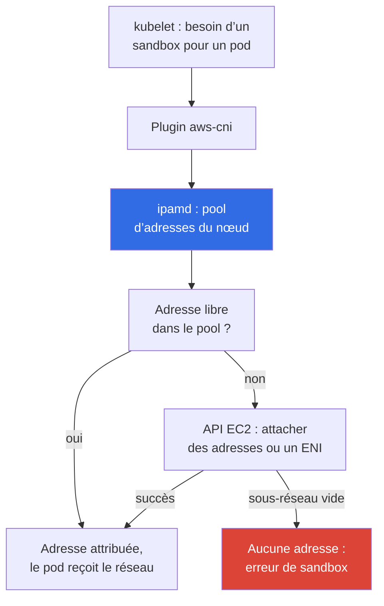
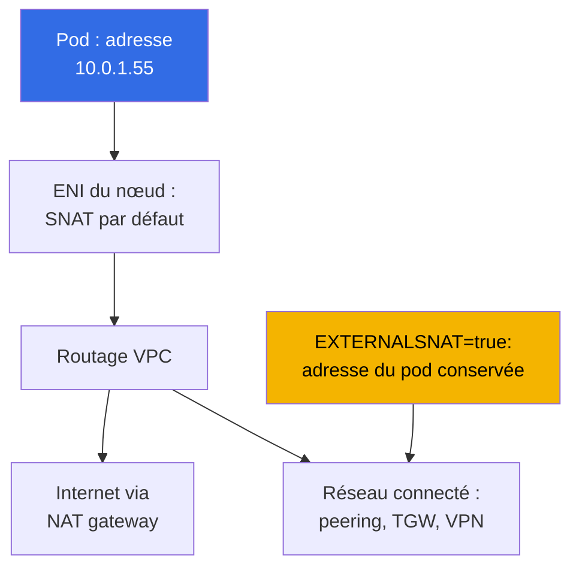

[Русская версия](ru.md) · [Eng version](en.md) · [Versión en español](es.md) · [Deutsche Version](de.md) · [ქართული ვერსია](ge.md) · [繁體中文版](tw.md) · [日本語版](jp.md)
# Chapitre 6. Réseau du cluster : VPC CNI, ENI et adresses IP, planification CIDR

> **La suite.** Le cluster est créé (chapitre 4), l’accès est configuré (chapitre 5) et les pods démarrent.
> On découvre ensuite que le réseau dans EKS ne fonctionne pas comme kubeadm avec un plugin overlay : les adresses
> des pods sont réelles, proviennent d’un sous-réseau VPC et sont en quantité finie. Ce chapitre explique comment VPC CNI attribue ces
> adresses, d’où vient la limite de pods par nœud, comment le pool d’adresses warm consomme le sous-réseau
> et comment calculer le CIDR avant que les pods ne restent bloqués dans `ContainerCreating`. Les solutions à l’épuisement
> des adresses sont présentées au chapitre 7, et les CNI alternatifs au chapitre 8.

## 6.1. « Un pod ne démarre pas alors que le nœud a du CPU et de la mémoire libres »

Le cluster fonctionne depuis six mois et les nœuds sont utilisés à 30 % de CPU. Une version est déployée et certains pods
restent dans `ContainerCreating`. Les événements n’indiquent ni `ImagePullBackOff` ni `FailedScheduling`, mais
une impossibilité d’attribuer une adresse :

```
Warning  FailedCreatePodSandBox  kubelet  Failed to create pod sandbox:
  plugin type="aws-cni" failed (add): add cmd: failed to assign an IP address to container
```

Il y a de la capacité sur le nœud et le planificateur a raison. Il n’y a plus d’adresses IP libres dans le sous-réseau : une vérification affiche
`0` dans la colonne `AvailableIpAddressCount`. Le sous-réseau était alloué en `/24`, avec 251 adresses disponibles,
« trente nœuds et une centaine de pods, avec de la marge pour des années ». Puis Karpenter est arrivé, des conteneurs sidecar et des jobs CI
ont été ajoutés. Le sous-réseau ne peut pas être étendu : **le CIDR d’un sous-réseau ne change pas après sa création**. Vous pouvez ajouter
nouveaux sous-réseaux ou attribuer un CIDR secondaire au VPC (chapitre 7), mais le `/24` existant restera `/24`.

Ce problème n’existait pas dans kubeadm : `--pod-network-cidr 10.244.0.0/16` n’était qu’un nombre dans
la configuration, les adresses de pods étaient virtuelles et n’occupaient rien dans le réseau réel. Dans EKS, chaque pod consomme une
**vraie adresse VPC privée**, la même ressource utilisée par les instances, les équilibreurs de charge, RDS et les VPC endpoints.
Le plan d’adressage cesse d’être une préoccupation interne au cluster.

## 6.2. Idée principale : un pod est un participant à part entière du VPC

Amazon VPC CNI attribue à un pod une **adresse IPv4 privée secondaire** du même sous-réseau où
s’exécute le nœud. Ce n’est ni une adresse d’une plage imaginaire, ni une adresse derrière un tunnel : du point de vue
VPC, un pod ressemble à une interface réseau supplémentaire. Il en découle une conclusion qu’il vaut la peine d’énoncer :
**il n’y a ni encapsulation ni NAT entre les pods**, et le trafic circule dans le VPC sans VXLAN
et sans MTU réduit.

| Propriété | Overlay (flannel VXLAN, Calico IPIP) | VPC CNI |
|---|---|---|
| Adresse de pod | issue d’un CIDR virtuel du cluster | adresse réelle d’un sous-réseau VPC |
| Adresses de pods hors du cluster | non routables | routables dans tout le VPC |
| Encapsulation | oui, avec surcoût et impact sur le MTU | non |
| Nombre d’adresses disponibles | pratiquement autant que vous le souhaitez | autant qu’il en existe dans le sous-réseau |
| Security groups sur le trafic des pods | non applicables | applicables |
| VPC Flow Logs pour le trafic des pods | ne voient que les adresses des nœuds | voient les adresses des pods |
| Planification des adresses | responsabilité du cluster | partie du plan réseau de l’organisation |

**Un pod est joignable directement depuis le VPC et les réseaux connectés** : une instance hors du cluster, une ressource dans un VPC appairé
ou une machine derrière Direct Connect peut ouvrir une connexion directement vers l’adresse du pod. « Le pod est caché
à l’intérieur du cluster » n’est donc plus un argument de sécurité. **Les security groups et les NACL s’appliquent au trafic des pods**,
mais la granularité est grossière : une règle couvre tout le nœud plutôt qu’un pod (l’association précise est au chapitre
19, NetworkPolicy au chapitre 30). **Le revers est dans la section 6.1** : le nombre d’adresses est fini.

## 6.3. Fonctionnement : aws-node, ipamd et adresses secondaires

VPC CNI s’exécute sous forme du DaemonSet `aws-node` dans `kube-system`. Il comporte deux composants clés :
**ipamd**, le démon de gestion du pool d’adresses du nœud qui communique avec l’API EC2, et le **plugin CNI**, que
kubelet invoque.



Le détail essentiel est qu’**ipamd n’appelle pas l’API EC2 lors de la création d’un pod**. Il attribue une adresse depuis un
pool préalloué, car l’association d’une adresse, et surtout la création d’un ENI, prend des secondes. Le faire
sur le chemin critique de démarrage retarderait chaque charge de travail. ipamd maintient donc une réserve d’adresses libres selon
les variables de réglage (section 6.5) et, lorsque cette réserve diminue, en associe de nouvelles et, si nécessaire, crée un
**nouvel ENI** dans le même sous-réseau et la même AZ.

Cela entraîne deux faits peu évidents. Les adresses occupées dans le sous-réseau **ne sont pas égales au nombre de pods en cours d’exécution**,
car la différence appartient au pool warm. Et tous les ENI du nœud sont dans la **même AZ**, donc les pénuries sont locales
à une Availability Zone : `eu-central-1a` peut être épuisée avec des milliers d’adresses libres dans
`eu-central-1b`.

## 6.4. ENI, limites d’instance et max-pods

Le nombre d’adresses sur un nœud n’est pas illimité : EC2 limite le nombre d’ENI qui peuvent être attachés à une
instance et le nombre d’adresses IPv4 qui peuvent être placées sur un ENI (chapitre 0.4). Ces deux valeurs dépendent du
type d’instance, d’où la formule de limite de pods. Une adresse de chaque ENI appartient à l’interface elle-même, d’où
`- 1`, et `+ 2` correspond à `aws-node` et `kube-proxy` dans le réseau hôte.

```
max-pods = ENI * (IP par ENI - 1) + 2
```

| Type d’instance | ENI | IP par ENI | max-pods selon la formule | vCPU |
|---|---|---|---|---|
| `t3.small` | 3 | 4 | 11 | 2 |
| `t3.medium` | 3 | 6 | 17 | 2 |
| `m5.xlarge` | 4 | 15 | 58 | 4 |
| `m5.4xlarge` | 8 | 30 | 234 (plafond 110) | 16 |

Il ne faut pas mémoriser ces valeurs. Il faut savoir les obtenir et les comparer avec l’état réel du nœud :

```bash
aws ec2 describe-instance-types --instance-types m5.xlarge \
  --query 'InstanceTypes[].NetworkInfo.[MaximumNetworkInterfaces,Ipv4AddressesPerInterface]'
kubectl describe node <node-name> | grep -A 8 'Allocatable'
kubectl get node <node-name> -o jsonpath='{.status.allocatable.pods}{"\n"}'
```

À propos du plafond entre parenthèses : pour les managed node groups sans AMI personnalisée, EKS écrit lui-même `max-pods` dans les user
data et le limite à 110 pour les instances ayant moins de 30 vCPU, et à 250 pour les plus grandes. Ainsi,
`m5.4xlarge` donne 234 selon la formule mais reçoit 110 en pratique. Le dimensionnement et le contournement du plafond sont au
chapitre 14.

La conclusion principale pour les personnes venant de Kubernetes bare metal est que **sur les petites instances, le plafond de pods est
limité par les ENI et non par le CPU ou la mémoire**. `t3.medium` accepte au maximum 17 pods et, avec des pods de 100m CPU, vous payez
pour une instance qui ne sera jamais entièrement utilisée. Les DaemonSets occupent aussi trois ou quatre emplacements, quelle que soit la taille de l’instance.

## 6.5. Pool d’adresses warm : trois variables et un compromis

La réserve d’adresses du nœud est configurée avec les variables d’environnement du DaemonSet `aws-node`.

| Variable | Par défaut | Rôle |
|---|---|---|
| `WARM_ENI_TARGET` | `1` | conserve en réserve les adresses d’un ENI entièrement libre |
| `WARM_IP_TARGET` | non définie | conserve le nombre indiqué d’adresses libres plutôt qu’un ENI |
| `MINIMUM_IP_TARGET` | non définie | seuil minimal d’adresses allouées immédiatement au démarrage |

L’algorithme d’ipamd est simple. Sans variables, `WARM_ENI_TARGET=1` s’applique : le démon conserve un
ENI de secours entièrement libre en plus des adresses occupées. Si `WARM_IP_TARGET` est défini, la logique ENI est désactivée et le
démon conserve exactement ce nombre d’adresses libres, les attachant et les attribuant une par une.
`MINIMUM_IP_TARGET` définit une limite inférieure d’adresses attachées et les alloue en une fois au démarrage ;
associé à `WARM_IP_TARGET`, il évite le traitement par à-coups d’une adresse à la fois : les adresses attachées ne descendent jamais sous
le minimum et les adresses libres ne descendent jamais sous warm.

La valeur par défaut mérite une attention particulière car c’est précisément elle qui surprend les utilisateurs de petits sous-réseaux.
`WARM_ENI_TARGET=1` signifie non pas « une adresse libre », mais **un ENI entièrement libre**. Sur
`m5.xlarge` (15 adresses par ENI), un nœud avec un pod conserve environ deux douzaines d’adresses en réserve :
ses adresses occupées plus une interface entièrement réservée. Vingt de ces nœuds consomment plus de la moitié d’un `/24`
avec seulement quelques dizaines de pods réels. C’est ainsi qu’un sous-réseau s’épuise « dans un cluster vide ». Le raisonnement
est clair : AWS optimise la **vitesse de démarrage des pods**. Le prix est payé en adresses.

```bash
kubectl set env daemonset aws-node -n kube-system WARM_IP_TARGET=5
kubectl set env daemonset aws-node -n kube-system MINIMUM_IP_TARGET=10
kubectl get ds aws-node -n kube-system \
  -o jsonpath='{.spec.template.spec.containers[0].env}' | tr ',' '\n'
```

`WARM_IP_TARGET=5` conserve cinq adresses libres au lieu d’un ENI entier, tandis que `MINIMUM_IP_TARGET=10` empêche
le démarrage du nœud de se dégrader en « attribuer une adresse à la fois ». Le compromis en une phrase :
**l’économie d’adresses s’achète par un délai de démarrage des pods et davantage d’appels à l’API EC2**, et ces appels sont soumis à des quotas
et limités dans les grands parcs. Gardez la valeur par défaut avec des sous-réseaux généreux (`/20` et plus larges) ; activez les deux variables
lorsque les adresses sont rares. Si VPC CNI est géré comme un managed addon, configurez les variables via sa
configuration, sinon une mise à jour de l’addon écrasera la modification (chapitre 37).

## 6.6. Planification CIDR pour les nœuds et les pods

Il faut calculer non pas « combien de pods existent maintenant », mais la consommation maximale d’adresses :

- **adresses des nœuds** (une adresse primaire par instance) et **adresses des pods** sur tous les nœuds, y compris
  les DaemonSets, ainsi que le **pool warm**, qui ajoute un supplément notable avec la valeur par défaut (section 6.5) ;
- **réserve pour les rolling updates** : lors d’une mise à jour de Deployment, les anciens et les nouveaux pods coexistent ; lors du remplacement
  de nœuds, les anciens et les nouveaux ENI coexistent. Ajoutez une **réserve de mise à l’échelle** : pics, jobs, développement ;
- **5 adresses réservées par AWS dans chaque sous-réseau** (chapitre 0.3) : adresse réseau, adresse de passerelle, adresse DNS VPC,
  adresse réservée et broadcast. Ainsi, `/24` possède 251 adresses disponibles.

| Préfixe de sous-réseau | Adresses totales | Disponibles | Indication de charge |
|---|---|---|---|
| `/24` | 256 | 251 | cluster de développement, environ dix nœuds, jusqu’à cent pods |
| `/22` | 1024 | 1019 | petit cluster de production, jusqu’à plusieurs centaines de pods |
| `/20` | 4096 | 4091 | cluster de production type avec autoscaling |
| `/18` | 16384 | 16379 | grand cluster ou plusieurs dans un VPC |

- **Allouez les sous-réseaux des nœuds avec de la capacité dès le départ**, de taille identique et dans au moins trois AZ,
  car une pénurie est locale à une zone. `/20` au lieu de `/24` lors de la création du VPC est une modification d’une ligne dans
  Terraform, mais un an plus tard c’est une migration de cluster.
- **Séparez les sous-réseaux des nœuds et des équilibreurs de charge** : ALB et NLB consomment également des adresses dans chaque AZ où ils
  sont déployés et l’augmentation du nombre d’Ingress retire des adresses aux pods. Des sous-réseaux publics `/24` pour les équilibreurs de
  charge et des sous-réseaux privés `/20` pour les nœuds constituent une disposition classique (chapitre 26).
- **Le CIDR VPC ne doit pas chevaucher** les adresses des réseaux connectés : peering, Transit Gateway,
  VPN et centre de données (chapitre 0.3). Vous découvrirez un chevauchement le jour où la connectivité sera nécessaire.

## 6.7. CIDR des Services : il n’est pas du tout dans le VPC

`serviceIpv4Cidr` **ne provient pas du VPC** : c’est une plage virtuelle à l’intérieur du cluster sur laquelle
kube-proxy installe des règles sur les nœuds. Les adresses Service ne sont attachées à aucun ENI et ne réduisent pas
`AvailableIpAddressCount`. Il est défini **uniquement lors de la création du cluster** (chapitre 4) ; s’il est omis,
EKS en choisit un parmi `10.100.0.0/16` ou `172.20.0.0/16`, selon celui qui n’entre pas en
conflit avec le CIDR de votre VPC.

```bash
aws eks describe-cluster --name demo --query 'cluster.kubernetesNetworkConfig'
kubectl -n kube-system get svc kube-dns -o jsonpath='{.spec.clusterIP}{"\n"}'
```

Il existe un problème typique, mais coûteux : l’automatisation vérifie le conflit avec **votre VPC**, et non avec
l’ensemble du réseau connecté. Si le centre de données de l’entreprise utilise `172.20.0.0/16` et que le cluster reçoit
la même plage pour les Services, les pods ne peuvent pas contacter une partie des systèmes internes : un paquet suit les règles Service au lieu
de la route vers le centre de données. Le seul remède est de recréer le cluster avec un `serviceIpv4Cidr` explicite,
c’est pourquoi cette plage est convenue à l’avance, comme le CIDR VPC.

## 6.8. Egress des pods et SNAT

Un pod contacte une adresse externe (Internet, S3 sans VPC endpoint ou un service dans un autre VPC). Par
défaut, VPC CNI effectue un **SNAT** : il remplace l’adresse source par l’adresse primaire du nœud, puis le paquet
suit la route normale via une NAT gateway ou une internet gateway (chapitre 0.3).



Le comportement est modifié par la variable `AWS_VPC_K8S_CNI_EXTERNALSNAT` de `aws-node` : quand elle vaut `true`, CNI
cesse de remplacer l’adresse source et le trafic sort avec la **vraie adresse du pod**.

```bash
kubectl set env daemonset aws-node -n kube-system AWS_VPC_K8S_CNI_EXTERNALSNAT=true
```

Modifiez-la lorsque l’adresse du pod doit être visible de l’autre côté : le trafic va vers un réseau connecté via
peering, Transit Gateway, VPN ou Direct Connect, et un firewall y possède des règles fondées sur les adresses, ou l’application
a besoin de la vraie source dans les journaux. La condition est qu’une route de retour vers les adresses des pods existe de l’autre côté.
Le SNAT ne s’applique jamais à l’intérieur du VPC.

## 6.9. Signes d’épuisement des adresses et diagnostic

```bash
kubectl get pods -A -o wide | grep -v Running
kubectl describe pod <pod> -n <ns> | tail -20
aws ec2 describe-subnets --filters Name=vpc-id,Values=vpc-0123456789abcdef0 \
  --query 'Subnets[].[SubnetId,AvailabilityZone,CidrBlock,AvailableIpAddressCount]' \
  --output table
```

Commencez par la source de l’erreur. `FailedScheduling` avec `Insufficient pods` signifie que `max-pods` est épuisé
sur les nœuds et que le sous-réseau n’y est pour rien (section 6.4). `FailedCreatePodSandBox` provenant de
`aws-cni` pointe vers le sous-réseau : zéro `AvailableIpAddressCount` dans son AZ est le diagnostic. Vérifiez ensuite
le côté serveur :

```bash
kubectl get ds aws-node -n kube-system
kubectl logs -n kube-system -l k8s-app=aws-node -c aws-node --tail=200 | grep -i \
  -e 'insufficient' -e 'InsufficientFreeAddressesInSubnet' -e 'assign'
aws ec2 describe-network-interfaces \
  --filters Name=attachment.instance-id,Values=i-0123456789abcdef0 \
  --query 'NetworkInterfaces[].[NetworkInterfaceId,Status,length(PrivateIpAddresses)]' \
  --output table
```

`InsufficientFreeAddressesInSubnet` renvoyé par l’API EC2 dans les journaux ipamd constitue une confirmation directe. Il vaut aussi la peine
de vérifier le nombre d’interfaces : si le nœud possède déjà autant d’ENI que son type d’instance l’autorise, de nouvelles
adresses n’apparaîtront pas même dans un sous-réseau non vide. Une mesure d’urgence rapide consiste à réduire le pool warm.
Le diagnostic complet des pannes réseau se trouve au chapitre 46.

Le diagnostic réactif est insuffisant pour un parc : surveillez la consommation d’ENI et d’adresses avec des métriques. ipamd
publie des métriques Prometheus sur le port `61678`, chemin `/metrics` (l’endpoint est activé par défaut et
se désactive avec la variable `DISABLE_METRICS`). Les métriques clés par nœud sont :
`awscni_assigned_ip_addresses` (adresses attribuées aux pods), `awscni_total_ip_addresses` (total d’adresses
secondaires attachées), `awscni_ip_max` (plafond d’adresses pour le type d’instance),
`awscni_eni_allocated` et `awscni_eni_max` (ENI attachés et maximum). Le ratio entre adresses attribuées et
maximum est le pourcentage d’utilisation du nœud, tandis que la croissance de `awscni_ec2api_error_count` révèle le throttling de l’API EC2.

```bash
kubectl -n kube-system port-forward ds/aws-node 61678:61678 &
curl -s localhost:61678/metrics \
  | grep -E 'awscni_(assigned_ip_addresses|total_ip_addresses|ip_max|eni_)'
```

`cni-metrics-helper` fournit la vue à l’échelle du cluster : il scrape ces endpoints depuis tous les pods `aws-node`,
les agrège par cluster et publie les métriques dans CloudWatch (`totalIPAddresses`,
`assignIPAddresses`, `eniAllocated`, `maxIPAddresses`). C’est sur elles qu’il faut attacher une alerte d’utilisation,
plutôt que de vérifier manuellement `AvailableIpAddressCount`.

## 6.10. Comment sortir de l’épuisement des adresses

Les solutions structurelles sont au chapitre 7 ; voici une carte de ce qu’il faut rechercher :

- **Prefix delegation** : un ENI reçoit des préfixes `/28` au lieu d’adresses individuelles. Cela augmente fortement
  `max-pods` et réduit les appels à l’API EC2, mais consomme les adresses par blocs.
- **Un CIDR secondaire du VPC** : ajoutez une plage, généralement issue de `100.64.0.0/10` (RFC 6598), et créez-y des
  sous-réseaux pour les pods.
- **Custom networking** : les pods reçoivent des adresses non pas du sous-réseau de leur nœud, mais de sous-réseaux séparés
  via `ENIConfig`, généralement avec un CIDR secondaire. **Des sous-réseaux séparés pour les pods** éliminent aussi
  la concurrence pour les adresses avec les nœuds et les équilibreurs de charge.
- **Passer à un CNI overlay** comme option radicale : les adresses virtuelles des pods reviennent, mais tout ce qui figure dans le
  tableau de la section 6.2 disparaît avec elles (chapitre 8).

## 6.11. Application en production

- **Convenez du plan d’adressage avant de créer le VPC** : les sous-réseaux privés des nœuds sont en `/20` ou plus larges dans
  chaque AZ, de petits sous-réseaux séparés pour les équilibreurs de charge existent, `serviceIpv4Cidr` est défini explicitement et vérifié contre
  les conflits avec tout le réseau connecté, et pas seulement le VPC.
- **Activez Prefix delegation immédiatement sur les nouveaux clusters** (chapitre 7) : c’est l’approche par défaut,
  et non une réponse d’urgence.
- **Surveillez les adresses libres** : `cni-metrics-helper` fournit des agrégats dans CloudWatch, et une alerte à
  20 % de `AvailableIpAddressCount` restant donne des semaines pour réagir (section 6.9).
- **Choisissez les types d’instance en tenant compte de la limite ENI**, pas seulement du CPU et de la mémoire : `t3.medium` avec 17
  pods est presque toujours inefficace en coût (chapitre 14).

## 6.12. Mini-glossaire

- **VPC CNI** : un plugin réseau AWS qui attribue aux pods de vraies adresses privées issues des sous-réseaux VPC ; le
  DaemonSet `aws-node` dans `kube-system`. **ipamd** est le démon dans `aws-node` qui gère le pool d’adresses
  du nœud : il attache des adresses secondaires et crée des ENI via l’API EC2.
- **ENI** : elastic network interface. Le nombre d’ENI par instance et d’adresses IPv4 par ENI dépend
  du type d’instance. Une **adresse privée secondaire** est une adresse IPv4 supplémentaire sur un ENI pour un pod,
  et le **pool warm** est une réserve de telles adresses pour accélérer le démarrage. **`cni-metrics-helper`** est un
  composant qui scrape `awscni_*` depuis les pods `aws-node` et envoie les agrégats à CloudWatch.
- **`max-pods`** : la limite de pods sur un nœud : `ENI * (IP par ENI - 1) + 2`, plafonnée dans les managed node groups
  (110 ou 250). **`serviceIpv4Cidr`** est la plage d’adresses Service, virtuelle et sans lien avec le VPC.
  **SNAT** remplace l’adresse source par l’adresse du nœud pour l’egress des pods et se désactive par la
  variable `AWS_VPC_K8S_CNI_EXTERNALSNAT`.

## 6.13. Résumé du chapitre

- Un pod reçoit une vraie adresse privée d’un sous-réseau VPC. Cela apporte la routabilité des pods depuis le VPC et
  les réseaux connectés, l’absence d’encapsulation ou de NAT entre les pods, l’applicabilité des security groups et des NACL, et
  la visibilité du trafic des pods dans les VPC Flow Logs. Cela a aussi un coût : les adresses sont finies.
- `aws-node` et son processus ipamd attribuent les adresses : ipamd maintient un pool warm, attache des adresses secondaires
  aux ENI du nœud et crée de nouveaux ENI dans le même sous-réseau et la même AZ. Il donne au pod une adresse du
  pool sans demander l’API EC2. Le plafond de pods vient de `ENI * (IP par ENI - 1) + 2`.
- Par défaut, `WARM_ENI_TARGET=1` réserve un ENI complet d’adresses sur chaque nœud, ce qui gaspille de l’espace dans
  les sous-réseaux étroits. `WARM_IP_TARGET` et `MINIMUM_IP_TARGET` économisent des adresses au prix d’une latence de démarrage
  des pods et de davantage d’appels à l’API EC2.
- La planification exige des sous-réseaux de nœuds avec de la capacité (`/20` et plus larges), des sous-réseaux identiques dans chaque AZ, des
  sous-réseaux séparés pour les équilibreurs de charge, moins 5 adresses réservées par AWS, et la reconnaissance qu’un CIDR de sous-réseau ne peut pas être
  étendu après sa création. `serviceIpv4Cidr` n’est pas dans le VPC et est défini uniquement lors de la création du cluster.
  Diagnostiquez une pénurie avec les événements de pods, `AvailableIpAddressCount` dans l’AZ concernée, les journaux ipamd et le
  nombre d’ENI sur l’instance. Les solutions structurelles sont au chapitre 7.

## 6.14. Utilité dans le travail réel

La question « combien de pods notre cluster peut-il prendre en charge » a une réponse arithmétique dans EKS, et vous pouvez la calculer
avant qu’une livraison ne bloque. La discussion avec l’équipe réseau au sujet d’un nouveau VPC change lorsque vous apportez non pas « donnez-
nous un sous-réseau », mais un calcul avec le nombre de nœuds, de pods, la capacité du pool warm et la réserve de mise à jour. Le cas
de la première section cesse d’être une urgence : les adresses restantes sont sous alerte, le pool warm peut être réduit en place,
et une solution structurelle peut être choisie sereinement.

## 6.15. Questions d’auto-évaluation

1. En quoi une adresse de pod dans EKS diffère-t-elle d’une adresse de pod dans kubeadm avec flannel, et qu’est-ce que cela implique ?
2. Comment distinguer un manque d’adresses dans un sous-réseau d’un `max-pods` épuisé sur les nœuds ?
3. Que fait ipamd au moment de la création d’un pod, que fait-il à l’avance et pourquoi fonctionne-t-il ainsi ?
4. Calculez `max-pods` pour une instance avec 4 ENI et 15 adresses par ENI. D’où viennent `- 1` et `+ 2` ?
5. Que réserve exactement `WARM_ENI_TARGET=1` et pourquoi est-ce dangereux dans un sous-réseau `/24` ?
6. Combien d’adresses sont disponibles dans `/22`, et pourquoi la réponse n’est-elle pas 1024 ?
7. Vous avez besoin d’un cluster pour 500 pods dans trois AZ. Quelles tailles de sous-réseau demanderiez-vous, et pourquoi ?
8. `serviceIpv4Cidr` fait-il partie de l’espace d’adresses VPC et quand peut-il être modifié ?
9. Quand activeriez-vous `AWS_VPC_K8S_CNI_EXTERNALSNAT=true`, et que faut-il de l’autre côté ?
10. Quelles métriques ipamd indiquent l’utilisation des adresses sur un nœud, et comment les collecter à l’échelle du cluster ?

## Pratique

Le lab du cours pour ce sujet est [lab 101 - cluster as code](../../labs/101/README_FR.MD). Vous y
vérifiez que VPC CNI attribue aux pods des adresses de votre CIDR VPC et examinez le plan d’adressage du cluster ; vérifiez
avec la commande `check_result`. Lancez-le avec `TASK=101 make run_eks_task`.
Ce sujet comprend aussi [lab 103 - Planification d’adresses : limites ENI, prefix delegation, CIDR
secondaire](../../labs/103/README_FR.MD), qui examine plus en détail le dimensionnement du plan d’adressage.

Au-delà des labs, le contenu du chapitre peut être vérifié sur un cluster en activité. Commencez par le plan
d’adressage : `aws eks describe-cluster --name <cluster> --query 'cluster.resourcesVpcConfig'` renvoie une
liste de sous-réseaux, tandis que `aws ec2 describe-subnets` avec `--query
'Subnets[].[SubnetId,AvailabilityZone,CidrBlock,AvailableIpAddressCount]'` affiche la capacité restante par
zone. Comparez-la au nombre de pods obtenu avec `kubectl get pods -A -o wide | wc -l` : la différence est le
coût du pool warm.

Calculez ensuite le plafond de pods : obtenez les ENI et les adresses par ENI avec `aws ec2
describe-instance-types`, appliquez la formule et comparez le résultat à la valeur réelle obtenue avec `kubectl get nodes -o
custom-columns='NODE:.metadata.name,PODS:.status.allocatable.pods'`. Si les nombres diffèrent, cherchez un plafond de
managed node group ou une prefix delegation activée. Examinez ensuite `kubectl get
ds aws-node -n kube-system -o yaml` : recherchez `WARM_ENI_TARGET`, `AWS_VPC_K8S_CNI_EXTERNALSNAT`
et vérifiez si `WARM_IP_TARGET` est défini. Enfin, comparez les adresses sur l’ENI d’un nœud depuis `aws ec2
describe-network-interfaces` avec le filtre `Name=attachment.instance-id` et ses pods depuis `kubectl
get pods -A -o wide --field-selector spec.nodeName=<node>`.

---
[Table des matières](../README_FR.md) · [Chapitre 5](../05/fr.md) · [Chapitre 7](../07/fr.md)
