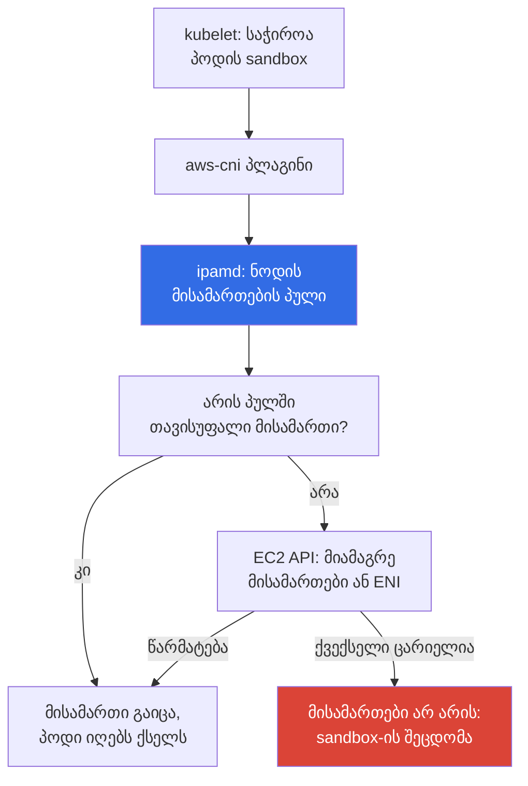
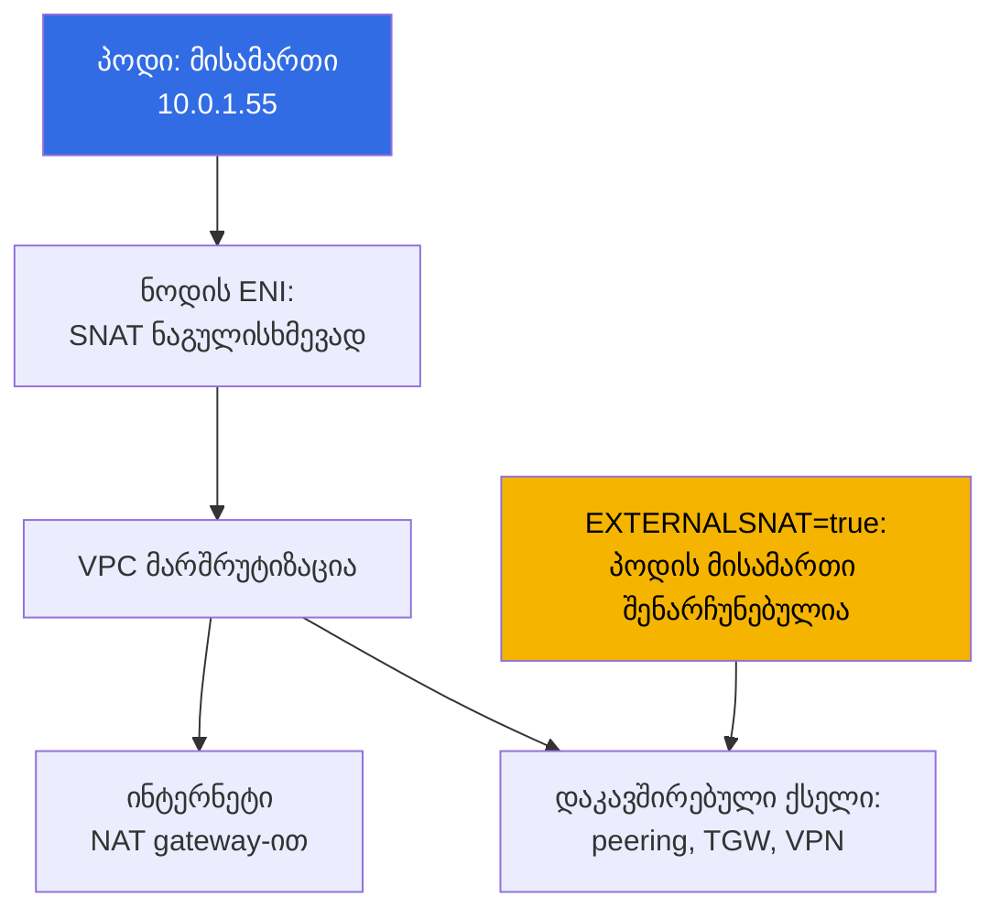

[Русская версия](ru.md) · [Eng version](en.md) · [Versión en español](es.md) · [Version française](fr.md) · [Deutsche Version](de.md) · [繁體中文版](tw.md) · [日本語版](jp.md)
# თავი 6. კლასტერის ქსელი: VPC CNI, ENI და IP მისამართები, CIDR-ის დაგეგმვა

> **რა არის შემდეგ.** კლასტერი შექმნილია (თავი 4) და წვდომა გამართულია (თავი 5), პოდები ეშვება.
> შემდეგ ირკვევა, რომ EKS-ში ქსელი არ არის მოწყობილი ისე, როგორც kubeadm-ში overlay-პლაგინით: პოდების
> მისამართები რეალურია, VPC-ის ქვექსელიდან, და ისინი სასრულია. ეს თავი განმარტავს, როგორ გასცემს VPC CNI ამ
> მისამართებს, საიდან მოდის პოდების ლიმიტი ნოდზე, როგორ ხარჯავს warm-მისამართების პული ქვექსელს და როგორ
> დაითვალოთ CIDR მანამდე, ვიდრე პოდები `ContainerCreating`-ში გაიჭედება. მისამართების დეფიციტის გამოსავალი
> არის თავი 7, ალტერნატიული CNI - თავი 8.

## 6.1. „პოდი არ ეშვება, თუმცა ნოდზე CPU და მეხსიერება თავისუფალია“

კლასტერი ნახევარი წელია მუშაობს, ნოდებზე CPU-ის დატვირთვა 30 პროცენტია. მიმდინარეობს რელიზის გაშლა და პოდების
ნაწილი `ContainerCreating`-ში რჩება. მოვლენებში არა `ImagePullBackOff` და არა `FailedScheduling`, არამედ
მისამართის მინიჭების შეუძლებლობაა:

```
Warning  FailedCreatePodSandBox  kubelet  Failed to create pod sandbox:
  plugin type="aws-cni" failed (add): add cmd: failed to assign an IP address to container
```

ნოდზე ადგილი არის, scheduler სწორია. ქვექსელში თავისუფალი IP მისამართები აღარ არის: შემოწმება
`AvailableIpAddressCount` სვეტში `0`-ს აჩვენებს. ქვექსელი `/24`-ად იყო გამოყოფილი, 251 ხელმისაწვდომი მისამართით,
„ოცდაათი ნოდი და ასი პოდი, წლების მარაგით“. შემდეგ დაემატა Karpenter, sidecar-კონტეინერები და CI-ის job-ები.
ქვექსელის გაფართოება კი შეუძლებელია: **ქვექსელის CIDR შექმნის შემდეგ არ იცვლება**. შეგიძლიათ დაამატოთ ახალი
ქვექსელები ან VPC-ს მისცეთ secondary CIDR (თავი 7), მაგრამ არსებული `/24` `/24`-ად დარჩება.

kubeadm-ში ასეთი პრობლემა არ იყო: `--pod-network-cidr 10.244.0.0/16` მხოლოდ რიცხვი იყო კონფიგურაციაში,
პოდების მისამართები ვირტუალურია და რეალურ ქსელში არაფერს იკავებს. EKS-ში ყოველი პოდი მოიხმარს **რეალურ კერძო
VPC მისამართს**, იმავე რესურსს, საიდანაც მისამართებს იღებენ ინსტანსები, load balancer-ები, RDS და VPC endpoint-ები.
მისამართების გეგმა წყვეტს, რომ იყოს კლასტერის შიდა საქმე.

## 6.2. მთავარი თეზისი: პოდი VPC-ის სრულუფლებიანი მონაწილეა

Amazon VPC CNI პოდს ანიჭებს **მეორეულ კერძო IPv4 მისამართს** იმავე ქვექსელიდან, სადაც ნოდი გაეშვა. ეს არ არის
გამოგონილი დიაპაზონის მისამართი და არც გვირაბს მიღმა მისამართი: VPC-ის თვალსაზრისით პოდი კიდევ ერთ ქსელურ
ინტერფეისს ჰგავს. აქედან გამომდინარეობს მნიშვნელოვანი დასკვნა: **პოდებს შორის არც ინკაფსულაციაა და არც NAT**,
ტრეფიკი VPC-ის შიგნით მიდის VXLAN-ისა და შემცირებული MTU-ის გარეშე.

| თვისება | Overlay (flannel VXLAN, Calico IPIP) | VPC CNI |
|---|---|---|
| პოდის მისამართი | კლასტერის ვირტუალური CIDR-დან | VPC ქვექსელის რეალური მისამართი |
| პოდების მისამართები კლასტერის გარეთ | არ მარშრუტდება | მარშრუტდება მთელ VPC-ში |
| ინკაფსულაცია | არის, დამატებითი ხარჯი და MTU | არ არის |
| რამდენი მისამართია ხელმისაწვდომი | პრაქტიკულად რამდენსაც მოიფიქრებთ | რამდენიც არის ქვექსელში |
| Security group-ები პოდების ტრეფიკზე | გამოუყენებელია | გამოიყენება |
| VPC Flow Logs პოდების ტრეფიკზე | მხოლოდ ნოდების მისამართებს ხედავს | პოდების მისამართებს ხედავს |
| მისამართების დაგეგმვა | კლასტერის საქმეა | ორგანიზაციის ქსელის გეგმის ნაწილია |

**პოდი VPC-დან და დაკავშირებული ქსელებიდან პირდაპირ ხელმისაწვდომია**: კლასტერის გარეთ არსებული ინსტანსი,
peered VPC-ის რესურსი ან Direct Connect-ის მიღმა მანქანა კავშირს პირდაპირ პოდის მისამართზე ხსნის, ამიტომ
„პოდი კლასტერის შიგნით არის დამალული“ უსაფრთხოების არგუმენტი აღარ არის. **Security group-ები და NACL პოდების
ტრეფიკზეც გამოიყენება**, მაგრამ გრანულარობა უხეშია: წესი მთელ ნოდზეა და არა პოდზე (ზუსტი მიბმა - თავი 19,
NetworkPolicy - 30). **მეორე მხარე განყოფილება 6.1-შია**: მისამართების რაოდენობა სასრულია.

## 6.3. როგორ არის მოწყობილი: aws-node, ipamd და მეორეული მისამართები

VPC CNI მუშაობს როგორც DaemonSet `aws-node` `kube-system`-ში. შიგნით ორი მთავარი კომპონენტია:
**ipamd**, ნოდის მისამართების პულის მართვის დემონი, რომელიც EC2 API-ს უკავშირდება, და **CNI პლაგინი**, რომელსაც
kubelet იძახებს.



მთავარი დეტალი: **პოდის შექმნისას ipamd არ მიდის EC2 API-ში**, ის მისამართს წინასწარ შევსებული პულიდან გასცემს,
რადგან მისამართის მიბმა და მით უფრო ENI-ის შექმნა წამებს მოითხოვს და გაშვების კრიტიკულ გზაზე თითოეული
დატვირთვის დაწყებას დააყოვნებდა. ამიტომ ipamd თავისუფალი მისამართების მარაგს ტიუნინგის ცვლადების მიხედვით
(განყოფილება 6.5) ინახავს, ხოლო როცა მარაგი მცირდება, ახალ მისამართებს ამაგრებს და საჭიროებისას იმავე ქვექსელსა
და AZ-ში **ახალ ENI-ს** ქმნის.

აქედან ორი არაცხადი ფაქტი გამომდინარეობს. ქვექსელში დაკავებული მისამართები **არ უდრის გაშვებული პოდების
რაოდენობას**, სხვაობა warm-პულში მიდის. ასევე ნოდის ყველა ENI **იმავე AZ-შია**, ამიტომ დეფიციტი ზონისთვის
ლოკალურია: `eu-central-1a` შეიძლება სრულად დაიცალოს მაშინ, როცა `eu-central-1b`-ში ათასობით თავისუფალი
მისამართია.

## 6.4. ENI, ინსტანსის ლიმიტები და max-pods

ნოდზე მისამართების რაოდენობა უსასრულო არ არის: EC2 ზღუდავს, რამდენი ENI შეიძლება დაერთოს ინსტანსს და რამდენი
IPv4 მისამართი შეიძლება დაემატოს ერთ ENI-ს (თავი 0.4). ორივე რიცხვი ინსტანსის ტიპზეა დამოკიდებული, საიდანაც
პოდების ლიმიტის ფორმულა მოდის. ყოველი ENI-ის ერთი მისამართი თავად ინტერფეისს ეკუთვნის, აქედან `- 1`, ხოლო
`+ 2` არის `aws-node` და `kube-proxy` host network-ში.

```
max-pods = ENI * (IP თითო ENI-ზე - 1) + 2
```

| ინსტანსის ტიპი | ENI | IP თითო ENI-ზე | max-pods ფორმულით | vCPU |
|---|---|---|---|---|
| `t3.small` | 3 | 4 | 11 | 2 |
| `t3.medium` | 3 | 6 | 17 | 2 |
| `m5.xlarge` | 4 | 15 | 58 | 4 |
| `m5.4xlarge` | 8 | 30 | 234 (ზღვარი 110) | 16 |

მნიშვნელობების დამახსოვრება არ არის საჭირო, უნდა იცოდეთ მათი მიღება და ნოდზე ფაქტთან შედარება:

```bash
aws ec2 describe-instance-types --instance-types m5.xlarge \
  --query 'InstanceTypes[].NetworkInfo.[MaximumNetworkInterfaces,Ipv4AddressesPerInterface]'
kubectl describe node <node-name> | grep -A 8 'Allocatable'
kubectl get node <node-name> -o jsonpath='{.status.allocatable.pods}{"\n"}'
```

ფრჩხილებში მითითებული ზღვრის შესახებ: managed node groups-ში custom AMI-ის გარეშე EKS თავად წერს `max-pods`-ს user
data-ში და ზემოდან ზღუდავს - 30 vCPU-ზე ნაკლები ინსტანსებისთვის 110, დიდი ინსტანსებისთვის 250. ანუ `m5.4xlarge`
ფორმულით 234-ს იძლევა, მაგრამ რეალურად 110-ს მიიღებს. sizing და ზღვრის გვერდის ავლა - თავი 14.

მთავარი დასკვნა მათთვის, ვინც bare-metal Kubernetes-დან მოვიდა: **მცირე ინსტანსებზე პოდების ჭერი არ ეყრდნობა
CPU-ს ან მეხსიერებას, არამედ ENI-ს**. `t3.medium` მაქსიმუმ 17 პოდს მიიღებს და 100m CPU-იანი პოდებით იხდით
ინსტანსისთვის, რომელიც არასდროს დაიტვირთება. ამას გარდა, DaemonSet-ები ინსტანსის ზომის მიუხედავად სამ-ოთხ
ადგილს იკავებს.

## 6.5. warm-მისამართების პული: სამი ცვლადი და ერთი კომპრომისი

ნოდზე მისამართების მარაგის ზომა განისაზღვრება DaemonSet `aws-node`-ის გარემოს ცვლადებით.

| ცვლადი | ნაგულისხმევად | რას აკეთებს |
|---|---|---|
| `WARM_ENI_TARGET` | `1` | მარაგში ინახავს ერთ მთლიანად თავისუფალ ENI მისამართებს |
| `WARM_IP_TARGET` | არაა მითითებული | ENI-ის ნაცვლად ინახავს მითითებული რაოდენობის თავისუფალ მისამართებს |
| `MINIMUM_IP_TARGET` | არაა მითითებული | მისამართების ქვედა ზღვარი, რომელიც გაშვებისასვე გამოიყოფა |

ipamd-ის ალგორითმი მარტივია. ცვლადების გარეშე მოქმედებს `WARM_ENI_TARGET=1`: დემონი დაკავებული მისამართების
ზემოთ ერთ სარეზერვო ENI-ს მთლიანად თავისუფლად ინახავს. თუ `WARM_IP_TARGET` მითითებულია, ENI-ლოგიკა ითიშება და
დემონი ზუსტად ამდენ თავისუფალ მისამართს ინახავს, მათ სათითაოდ ამაგრებს და გასცემს. `MINIMUM_IP_TARGET`
განსაზღვრავს მიმაგრებული მისამართების ქვედა ზღვარს და გაშვებისას ერთ პაკეტად გამოიყოფა; `WARM_IP_TARGET`-თან
წყვილში ის აქრობს სათითაო რყევას - მიმაგრებული მისამართები მინიმუმზე ნაკლები არაა, თავისუფალი კი warm-ზე ნაკლები.

ნაგულისხმევი მნიშვნელობა დაწვრილებით გასარჩევია, რადგან მცირე ქვექსელებში სწორედ ის აოცებს. `WARM_ENI_TARGET=1`
არ ნიშნავს „ერთ თავისუფალ მისამართს“, არამედ **ერთ მთლიანად თავისუფალ ENI-ს**. `m5.xlarge`-ზე (15 მისამართი თითო
ENI-ზე) ერთი პოდის მქონე ნოდი მარაგში დაახლოებით ორ ათეულ მისამართს ინახავს: საკუთარი დაკავებული და სრული
სარეზერვო ინტერფეისი. ოცი ასეთი ნოდი `/24`-ის ნახევარზე მეტს იკავებს რამდენიმე ათეული რეალური პოდისას, და ასე
იცლება ქვექსელი „ცარიელ კლასტერზე“. ლოგიკა გასაგებია: AWS ოპტიმიზაციას აკეთებს **პოდების გაშვების სიჩქარეზე**.
ფასი მისამართებია.

```bash
kubectl set env daemonset aws-node -n kube-system WARM_IP_TARGET=5
kubectl set env daemonset aws-node -n kube-system MINIMUM_IP_TARGET=10
kubectl get ds aws-node -n kube-system \
  -o jsonpath='{.spec.template.spec.containers[0].env}' | tr ',' '\n'
```

`WARM_IP_TARGET=5` მთელი ENI-ის ნაცვლად ხუთ თავისუფალ მისამართს ინახავს, `MINIMUM_IP_TARGET=10` კი არ აძლევს
ნოდის გაშვებისას მდგომარეობას „თითო მისამართს ვაძლევთ“ დაეცეს. კომპრომისი ერთ წინადადებაში: **მისამართების
დაზოგვა ყიდულობს პოდების გაშვების დაყოვნებასა და EC2 API გამოძახებების ზრდას**, ხოლო გამოძახებები კვოტირებულია და
დიდ პარკში throttling-ს ექვემდებარება. ნაგულისხმევს ტოვებენ ფართო ქვექსელებში (`/20` და უფრო ფართო); ცვლადების
წყვილს რთავენ, როცა მისამართები ცოტაა. თუ VPC CNI იმართება როგორც managed addon, ცვლადები მის კონფიგურაციაში
უნდა განისაზღვროს, თორემ addon-ის განახლება ცვლილებას გადაწერს (თავი 37).

## 6.6. CIDR-ის დაგეგმვა ნოდებისა და პოდებისთვის

უნდა ითვალოთ არა „რამდენი პოდია ახლა“, არამედ მისამართების პიკური მოხმარება:

- **ნოდების მისამართები** (თითო primary ინსტანსზე) და **პოდების მისამართები** ყველა ნოდზე, DaemonSet-ების
  ჩათვლით, პლუს **warm-პული**, რომელიც ნაგულისხმევად შესამჩნევ დანამატს იძლევა (განყოფილება 6.5);
- **მარაგი rolling update-ისთვის**: Deployment-ის განახლებისას ძველი და ახალი პოდები ერთად ცხოვრობს, ნოდების
  შეცვლისას კი ძველი და ახალი ENI. ასევე **მარაგი მასშტაბირებისთვის**: პიკები, job-ები, dev;
- **5 მისამართი, რომელსაც AWS თითოეულ ქვექსელში იტოვებს** (თავი 0.3): ქსელის მისამართი, gateway-ის მისამართი,
  VPC DNS-ის მისამართი, რეზერვირებული მისამართი და broadcast. ამიტომ `/24`-ში 251 ხელმისაწვდომია.

| ქვექსელის პრეფიქსი | სულ მისამართი | ხელმისაწვდომია | დატვირთვის ორიენტირი |
|---|---|---|---|
| `/24` | 256 | 251 | dev-კლასტერი, ათეული ნოდი, ასამდე პოდი |
| `/22` | 1024 | 1019 | მცირე prod, რამდენიმე ასეულ პოდამდე |
| `/20` | 4096 | 4091 | ტიპური prod-კლასტერი autoscaling-ით |
| `/18` | 16384 | 16379 | დიდი კლასტერი ან რამდენიმე ერთ VPC-ში |

- **ნოდების ქვექსელები თავიდანვე მარაგით აიღეთ**, ერთნაირი ზომის და მინიმუმ სამ AZ-ში, რადგან დეფიციტი ზონისთვის
  ლოკალურია. VPC-ის შექმნისას `/20` `/24`-ის ნაცვლად Terraform-ში ერთი ხაზის ცვლილებაა, ერთი წლის შემდეგ კი ეს
  უკვე კლასტერის მიგრაციაა.
- **ნოდებისა და load balancer-ების ქვექსელები გამოყავით**: ALB და NLB ასევე იკავებს მისამართებს თავისი განთავსების
  თითოეულ AZ-ში, ხოლო Ingress-ის რაოდენობის ზრდა პოდებს ართმევს მისამართებს. load balancer-ებისთვის საჯარო `/24`
  და ნოდებისთვის კერძო `/20` ტიპური განლაგებაა (თავი 26).
- **VPC-ის CIDR არ უნდა იკვეთებოდეს** დაკავშირებული ქსელების მისამართებთან: peering, Transit Gateway, VPN,
  data center (თავი 0.3). გადაკვეთა იმ დღეს გამოჩნდება, როცა კავშირი დაგჭირდებათ.

## 6.7. სერვისების CIDR: ის საერთოდ VPC-დან არაა

`serviceIpv4Cidr` **VPC-დან არ აიღება**: ეს კლასტერის შიდა ვირტუალური დიაპაზონია, რომლისთვისაც kube-proxy ნოდებზე
წესებს შლის. Service-ის მისამართები არც ერთ ENI-ს არ არის მიბმული და `AvailableIpAddressCount` არ მცირდება. ის
განისაზღვრება **მხოლოდ კლასტერის შექმნისას** (თავი 4); თუ ველი არაა მითითებული, EKS თვითონ აირჩევს
`10.100.0.0/16`-დან ან `172.20.0.0/16`-დან იმის მიხედვით, რომელი არ ეწინააღმდეგება თქვენი VPC-ის CIDR-ს.

```bash
aws eks describe-cluster --name demo --query 'cluster.kubernetesNetworkConfig'
kubectl -n kube-system get svc kube-dns -o jsonpath='{.spec.clusterIP}{"\n"}'
```

ტიპური პრობლემა ერთია, მაგრამ ძვირი: ავტომატიკა ამოწმებს გადაკვეთას **თქვენს VPC-სთან**, და არა მთელ დაკავშირებულ
ქსელთან. თუ კორპორატიული data center იყენებს `172.20.0.0/16`-ს, ხოლო კლასტერმა Service-ებისთვის იგივე დიაპაზონი
მიიღო, პოდები შიდა სისტემების ნაწილს ვერ დაუკავშირდება - პაკეტი data center-ის მარშრუტის ნაცვლად Service-ის
წესებში მოხვდება. გამოსავალი ერთია: კლასტერის ხელახლა შექმნა აშკარა `serviceIpv4Cidr`-ით, ამიტომ დიაპაზონს
წინასწარ ათანხმებენ, ისევე როგორც VPC-ის CIDR-ს.

## 6.8. პოდების egress და SNAT

პოდი გარე მისამართს მიმართავს (ინტერნეტი, S3 VPC endpoint-ის გარეშე, სერვისი სხვა VPC-ში). ნაგულისხმევად VPC CNI
აკეთებს **SNAT**-ს: წყაროს მისამართს ნოდის primary მისამართით ანაცვლებს, შემდეგ პაკეტი ჩვეულებრივი გზით მიდის NAT
gateway-ის ან internet gateway-ის გავლით (თავი 0.3).



ქცევა `aws-node`-ის `AWS_VPC_K8S_CNI_EXTERNALSNAT` ცვლადით იცვლება: `true`-ზე CNI წყვეტს წყაროს მისამართის
ჩანაცვლებას და ტრეფიკი **პოდის რეალური მისამართით** გადის.

```bash
kubectl set env daemonset aws-node -n kube-system AWS_VPC_K8S_CNI_EXTERNALSNAT=true
```

მას ცვლიან, როცა პოდის მისამართი მეორე მხარეს უნდა ჩანდეს: ტრეფიკი დაკავშირებულ ქსელში გადის peering, Transit
Gateway, VPN ან Direct Connect-ით და იქ firewall მისამართებზე წესებით დგას, ან აპლიკაციას ლოგებში რეალური წყარო
სჭირდება. პირობაა: მეორე მხარეს პოდების მისამართებამდე უკუ მარშრუტი უნდა არსებობდეს. VPC-ის შიგნით SNAT საერთოდ
არ გამოიყენება.

## 6.9. მისამართების ამოწურვის ნიშნები და დიაგნოსტიკა

```bash
kubectl get pods -A -o wide | grep -v Running
kubectl describe pod <pod> -n <ns> | tail -20
aws ec2 describe-subnets --filters Name=vpc-id,Values=vpc-0123456789abcdef0 \
  --query 'Subnets[].[SubnetId,AvailabilityZone,CidrBlock,AvailableIpAddressCount]' \
  --output table
```

ჯერ შეცდომის წყარო განსაზღვრეთ. `FailedScheduling` და `Insufficient pods` ნიშნავს, რომ ნოდებზე `max-pods`
ამოიწურა და ქვექსელის მისამართებს აქ კავშირი არ აქვს (განყოფილება 6.4). `aws-cni`-ის `FailedCreatePodSandBox`
ქვექსელზე მიგითითებთ: საკუთარი AZ-ის `AvailableIpAddressCount`-ში ნული არის დიაგნოზი. შემდეგ სერვერის მხარე:

```bash
kubectl get ds aws-node -n kube-system
kubectl logs -n kube-system -l k8s-app=aws-node -c aws-node --tail=200 | grep -i \
  -e 'insufficient' -e 'InsufficientFreeAddressesInSubnet' -e 'assign'
aws ec2 describe-network-interfaces \
  --filters Name=attachment.instance-id,Values=i-0123456789abcdef0 \
  --query 'NetworkInterfaces[].[NetworkInterfaceId,Status,length(PrivateIpAddresses)]' \
  --output table
```

ipamd-ის ლოგებში EC2 API-ის `InsufficientFreeAddressesInSubnet` პირდაპირი დადასტურებაა. ინტერფეისების რაოდენობაც
შეადარეთ: თუ ENI უკვე იმდენია, რამდენსაც ინსტანსის ტიპი უშვებს, ახალი მისამართები არ გამოჩნდება არც არაცარიელ
ქვექსელში. ავარიისას სწრაფი ზომაა warm-პულის შემცირება. ქსელური ხარვეზების სრული განხილვა - თავი 46.

რეაქტიული დიაგნოსტიკა პარკისთვის არ კმარა: ENI-ისა და მისამართების მოხმარება მეტრიკებით უნდა აკონტროლოთ. ipamd
Prometheus-მეტრიკებს პორტ `61678`-ზე, გზაზე `/metrics` აქვეყნებს (endpoint ნაგულისხმევად ჩართულია, ითიშება
`DISABLE_METRICS` ცვლადით). მთავარი მთვლელები თითო ნოდზეა: `awscni_assigned_ip_addresses` (პოდებისთვის გაცემული
მისამართები), `awscni_total_ip_addresses` (სულ მიმაგრებული მეორეული მისამართები), `awscni_ip_max` (ინსტანსის
ტიპის მისამართების ჭერი), `awscni_eni_allocated` და `awscni_eni_max` (მიმაგრებული და მაქსიმალური ENI).
assigned-ისა და max-ის შეფარდება ნოდის ამოწურვის პროცენტია, ხოლო `awscni_ec2api_error_count`-ის ზრდა EC2 API-ის
throttling-ს აჩვენებს.

```bash
kubectl -n kube-system port-forward ds/aws-node 61678:61678 &
curl -s localhost:61678/metrics \
  | grep -E 'awscni_(assigned_ip_addresses|total_ip_addresses|ip_max|eni_)'
```

კლასტერის სურათს `cni-metrics-helper` აგროვებს: ის ყველა `aws-node` პოდიდან ამ endpoint-ებს სკრეიპავს,
კლასტერზე აჯამებს და მეტრიკებს CloudWatch-ში აქვეყნებს (`totalIPAddresses`, `assignIPAddresses`, `eniAllocated`,
`maxIPAddresses`). მათზე აყენებენ ამოწურვის alert-ს და არა `AvailableIpAddressCount`-ის ხელით შემოწმებაზე.

## 6.10. სად წავიდეთ მისამართების დეფიციტიდან

სისტემური გამოსავლები თავში 7 არის, აქ რუკაა, რომ იცოდეთ, რას ეძებთ:

- **Prefix delegation** - ENI ცალკეული მისამართების ნაცვლად `/28` პრეფიქსებს იღებს: მკვეთრად ზრდის `max-pods`-ს
  და ზოგავს EC2 API გამოძახებებს, მაგრამ მისამართებს ბლოკებად მოიხმარს.
- **Secondary CIDR VPC-ზე** - ემატება დიაპაზონი, ჩვეულებრივ `100.64.0.0/10`-დან (RFC 6598), და მასში იქმნება
  ქვექსელები პოდებისთვის.
- **Custom networking** - პოდები მისამართებს იღებენ არა თავისი ნოდის ქვექსელიდან, არამედ ცალკეული ქვექსელებიდან
  `ENIConfig`-ის მეშვეობით; ჩვეულებრივ secondary CIDR-თან ერთად. **პოდებისთვის ცალკეული ქვექსელები** ამასთანავე
  ხსნის მისამართებისთვის კონკურენციას ნოდებთან და load balancer-ებთან.
- **CNI-ის overlay-ზე შეცვლა** როგორც რადიკალური ვარიანტი: პოდების ვირტუალური მისამართები დაბრუნდება, მაგრამ
  მათთან ერთად გაქრება ყველაფერი, რაც განყოფილება 6.2-ის ცხრილშია (თავი 8).

## 6.11. როგორ გამოიყენება ეს production-ში

- **მისამართების გეგმას VPC-ის შექმნამდე ათანხმებენ**: კერძო ქვექსელები ნოდებისთვის `/20` და უფრო ფართო თითოეულ
  AZ-ში, ცალკეული მცირე ქვექსელები load balancer-ებისთვის, `serviceIpv4Cidr` აშკარადაა მითითებული და შემოწმებულია
  მთელ დაკავშირებულ ქსელთან კონფლიქტზე და არა მხოლოდ VPC-თან.
- **Prefix delegation-ს ახალ კლასტერებზე მაშინვე რთავენ** (თავი 7): ეს ნაგულისხმევი მიდგომაა და არა ავარიული ზომა.
- **თავისუფალი მისამართები მონიტორინგის ქვეშაა**: `cni-metrics-helper` CloudWatch-ში აგრეგატებს იძლევა, ხოლო
  `AvailableIpAddressCount`-ის 20 პროცენტის ნაშთზე alert-ს რეაგირებისთვის კვირები მოაქვს (განყოფილება 6.9).
- **ინსტანსის ტიპს ENI-ის ლიმიტის გათვალისწინებით ირჩევენ**, და არა მხოლოდ CPU-სა და მეხსიერების: `t3.medium` 17
  პოდით თითქმის ყოველთვის არაეფექტურია ფულის მხრივ (თავი 14).

## 6.12. მინი-გლოსარიუმი

- **VPC CNI** - AWS-ის ქსელის პლაგინი, რომელიც პოდებს VPC ქვექსელებიდან რეალურ კერძო მისამართებს ანიჭებს;
  DaemonSet `aws-node` `kube-system`-ში. **ipamd** - `aws-node`-ის შიგნით არსებული დემონი, რომელიც ნოდის
  მისამართების პულს მართავს: ამაგრებს მეორეულ მისამართებს და EC2 API-ის მეშვეობით ქმნის ENI-ს.
- **ENI** - elastic network interface; ინსტანსზე ENI-ისა და ENI-ზე IPv4 მისამართების რაოდენობა ინსტანსის ტიპზეა
  დამოკიდებული. **მეორეული კერძო მისამართი** - პოდისთვის ENI-ზე დამატებითი IPv4 მისამართი, ხოლო **warm-პული** -
  ასეთი მისამართების მარაგი გაშვების სიჩქარისთვის. **`cni-metrics-helper`** - კომპონენტი: `aws-node` პოდებიდან
  `awscni_*`-ს სკრეიპავს და აგრეგატებს CloudWatch-ში აგზავნის.
- **`max-pods`** - ნოდზე პოდების ლიმიტი: `ENI * (IP თითო ENI-ზე - 1) + 2`, managed node groups-ში ზემოდან
  შეზღუდულია (110 ან 250). **`serviceIpv4Cidr`** - Service-ის მისამართების დიაპაზონი, ვირტუალური და VPC-სთან
  დაუკავშირებელი. **SNAT** - პოდების გამავალი ტრეფიკისთვის წყაროს მისამართის ნოდის მისამართით ჩანაცვლება,
  ითიშება `AWS_VPC_K8S_CNI_EXTERNALSNAT` ცვლადით.

## 6.13. თავის შეჯამება

- პოდი VPC ქვექსელიდან რეალურ კერძო მისამართს იღებს: აქედან მოდის პოდების მარშრუტიზებადობა VPC-დან და
  დაკავშირებული ქსელებიდან, პოდებს შორის ინკაფსულაციისა და NAT-ის არქონა, security group-ებისა და NACL-ის
  გამოყენებადობა და პოდების ტრეფიკის ხილვადობა VPC Flow Logs-ში. აქედან მოდის ფასიც: მისამართები სასრულია.
- მისამართებს `aws-node` ipamd პროცესით გასცემს: ის warm-პულს ინახავს, ნოდის ENI-ზე მეორეულ მისამართებს ამაგრებს
  და იმავე ქვექსელსა და AZ-ში ახალ ENI-ს ქმნის, პოდს კი მისამართს პულიდან აძლევს EC2 API-ის გამოკითხვის გარეშე.
  პოდების ჭერს ფორმულა `ENI * (IP თითო ENI-ზე - 1) + 2` განსაზღვრავს.
- ნაგულისხმევი `WARM_ENI_TARGET=1` თითო ნოდზე მისამართების მთელ ENI-ს ჯავშნის, რაც ვიწრო ქვექსელებზე მფლანგველია;
  `WARM_IP_TARGET` და `MINIMUM_IP_TARGET` მისამართებს პოდების გაშვების დაყოვნებისა და EC2 API გამოძახებების ზრდის
  ფასად ზოგავს.
- დაგეგმვა: ნოდების ქვექსელები მარაგით (`/20` და უფრო ფართო), AZ-ების მიხედვით ერთნაირი, ცალკე ქვექსელები load
  balancer-ებისთვის, მინუს AWS-ის 5 რეზერვირებული მისამართი, ხოლო ქვექსელის CIDR შექმნის შემდეგ არ ფართოვდება.
  `serviceIpv4Cidr` VPC-დან არაა და მხოლოდ კლასტერის შექმნისას განისაზღვრება. დეფიციტის დიაგნოსტიკა: პოდის
  მოვლენები, საკუთარი AZ-ის `AvailableIpAddressCount`, ipamd-ის ლოგები, ინსტანსზე ENI-ის რაოდენობა. სისტემური
  გამოსავლები - თავი 7-შია.

## 6.14. როგორ გამოგადგებათ ეს რეალურ სამუშაოში

კითხვას „რამდენ პოდს გაუძლებს ჩვენი კლასტერი“ EKS-ში არითმეტიკული პასუხი აქვს და მისი დათვლა შეიძლება მანამდე,
ვიდრე რელიზი გაჩერდება. ქსელის გუნდთან ახალი VPC-ის შესახებ საუბარი სხვაგვარად მიდის, როცა მიგაქვთ არა „მოგვეცით
ქვექსელი“, არამედ გამოთვლა ნოდების, პოდების, warm-პულისა და განახლებების მარაგის რიცხვებით. პირველი
განყოფილების შემთხვევაც ავარიულ მდგომარეობად აღარ რჩება: მისამართების ნაშთზე alert დგას, warm-პული ადგილზე
მცირდება, სისტემური გამოსავალი კი მშვიდად აირჩევა.

## 6.15. კითხვები თვითშემოწმებისთვის

1. რით განსხვავდება EKS-ში პოდის მისამართი kubeadm-ში flannel-იანი პოდის მისამართისგან და რა გამომდინარეობს აქედან?
2. როგორ განასხვავებთ ქვექსელში მისამართების ნაკლებობას ნოდებზე ამოწურული `max-pods`-ისგან?
3. რას აკეთებს ipamd პოდის შექმნის მომენტში, რას წინასწარ და რატომ ზუსტად ასე?
4. გამოთვალეთ `max-pods` ინსტანსისთვის 4 ENI-ით და თითო ENI-ზე 15 მისამართით. საიდან მოდის `- 1` და `+ 2`?
5. რას ჯავშნის ზუსტად `WARM_ENI_TARGET=1` და რატომ არის ეს საშიში `/24` ქვექსელზე?
6. რამდენი მისამართია ხელმისაწვდომი `/22`-ში და რატომ არა 1024?
7. საჭიროა კლასტერი 500 პოდზე სამ AZ-ში. რა ზომის ქვექსელებს მოითხოვდით და რატომ?
8. შედის თუ არა `serviceIpv4Cidr` VPC-ის მისამართთა სივრცეში და როდის შეიძლება მისი შეცვლა?
9. როდის ჩართავთ `AWS_VPC_K8S_CNI_EXTERNALSNAT=true`-ს და რა არის საჭირო მეორე მხარეს?
10. ipamd-ის რომელი მეტრიკები აჩვენებს ნოდზე მისამართების ამოწურვას და როგორ შეაგროვებთ მათ კლასტერზე?

## პრაქტიკა

კურსის ლაბორატორია ამ თემისთვის: [ლაბა 101 - კლასტერი როგორც კოდი](../../labs/101/README_GE.MD). მასში ამოწმებთ,
რომ VPC CNI პოდებს თქვენი VPC-ის CIDR-დან მისამართებს ანიჭებს და ათვალიერებთ კლასტერის მისამართების გეგმას;
შემოწმება ხდება `check_result` ბრძანებით. გაშვება - `TASK=101 make run_eks_task`. ამავე თემას ეკუთვნის
[ლაბა 103 - მისამართების გეგმა: ENI ლიმიტები, prefix delegation, secondary CIDR](../../labs/103/README_GE.MD),
რომელიც მისამართების გეგმის მასშტაბირებას უფრო დეტალურად განიხილავს.

ლაბორატორიების გარდა, თავის შინაარსი ცოცხალ კლასტერზეც მოწმდება. დაიწყეთ მისამართების გეგმიდან: `aws eks
describe-cluster --name <cluster> --query 'cluster.resourcesVpcConfig'` ქვექსელების სიას მოგცემთ, ხოლო `aws ec2
describe-subnets` `--query
'Subnets[].[SubnetId,AvailabilityZone,CidrBlock,AvailableIpAddressCount]'`-ით ზონების მიხედვით ნაშთს აჩვენებს.
შეადარეთ ის პოდების რაოდენობას `kubectl get pods -A -o wide | wc -l`-დან: სხვაობა warm-პულის ფასია.

შემდეგ დაითვალეთ პოდების ჭერი: მიიღეთ ENI და თითო ENI-ზე მისამართები `aws ec2 describe-instance-types`-ით,
გამოიყენეთ ფორმულა და შეადარეთ ფაქტს `kubectl get nodes -o
custom-columns='NODE:.metadata.name,PODS:.status.allocatable.pods'`-ით. თუ რიცხვები არ ემთხვევა, მოძებნეთ managed
node group-ის ზღვარი ან ჩართული prefix delegation. შემდეგ ნახეთ `kubectl get ds aws-node -n kube-system -o yaml`:
მოძებნეთ `WARM_ENI_TARGET`, `AWS_VPC_K8S_CNI_EXTERNALSNAT` და შეამოწმეთ, მითითებულია თუ არა `WARM_IP_TARGET`.
ბოლოს შეადარეთ ერთი ნოდის ENI-ზე მისამართები `aws ec2 describe-network-interfaces`-იდან `Name=attachment.instance-id`
ფილტრით და მისი პოდები `kubectl get pods -A -o wide --field-selector spec.nodeName=<node>`-დან.

---
[სარჩევი](../README_GE.md) · [თავი 5](../05/ge.md) · [თავი 7](../07/ge.md)
