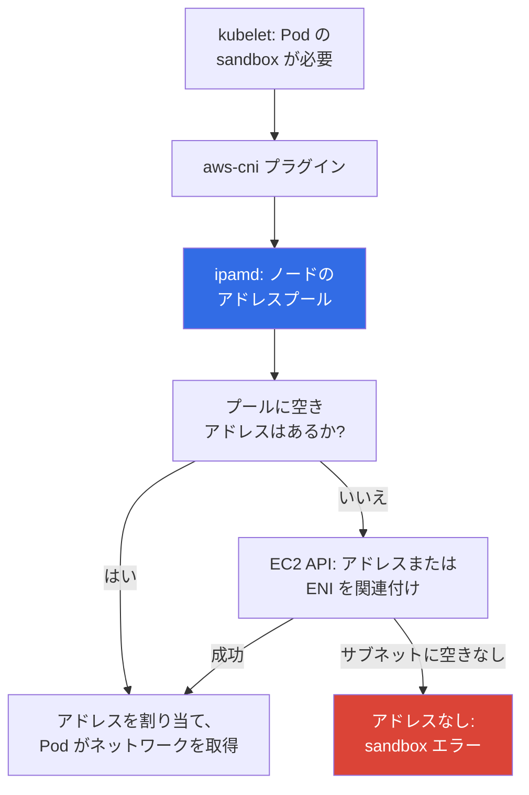
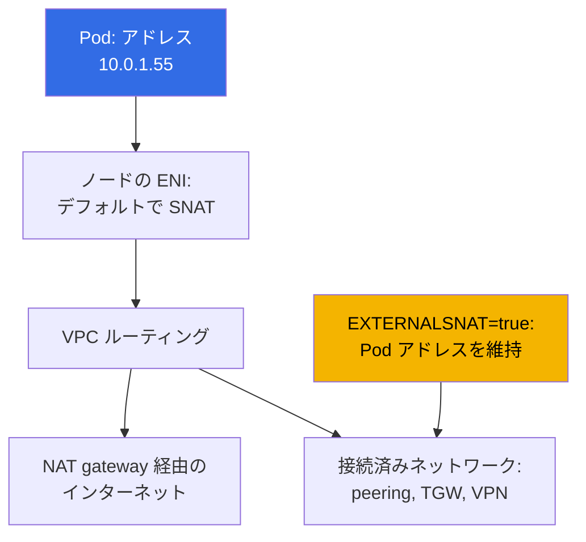

[Русская версия](ru.md) · [Eng version](en.md) · [Versión en español](es.md) · [Version française](fr.md) · [Deutsche Version](de.md) · [ქართული ვერსია](ge.md) · [繁體中文版](tw.md)
# 第6章. クラスターのネットワーク: VPC CNI、ENI、IP アドレス、CIDR 計画

> **次に進むこと。** クラスターは作成済み（第4章）、アクセスも設定済み（第5章）で、Pod は起動します。
> 次に分かるのは、EKS のネットワークが overlay プラグインを使う kubeadm と同じではないことです。Pod のアドレスは
> VPC サブネットから取得する実在のアドレスであり、数に限りがあります。本章では、VPC CNI がこれらの
> アドレスをどのように割り当てるか、ノードあたりの Pod 上限がどこから来るか、warm アドレスプールが
> サブネットをどのように消費するか、そして Pod が `ContainerCreating` で停止する前に CIDR をどう計算するかを説明します。アドレス
> 不足からの脱出策は第7章、代替 CNI は第8章です。

## 6.1. 「ノードの CPU とメモリは空いているのに Pod が起動しない」

クラスターは半年稼働し、ノードの CPU 使用率は 30 パーセントです。リリースを展開すると、一部の Pod が
`ContainerCreating` のままになります。イベントは `ImagePullBackOff` でも `FailedScheduling` でもなく、
アドレスを割り当てられないというものです。

```
Warning  FailedCreatePodSandBox  kubelet  Failed to create pod sandbox:
  plugin type="aws-cni" failed (add): add cmd: failed to assign an IP address to container
```

ノードには空きがあり、スケジューラーも正しい判断をしています。サブネットに空き IP アドレスがありません。確認すると
`AvailableIpAddressCount` は `0` です。サブネットは `/24`、利用可能なアドレスは 251 個で、
「ノード 30 台と Pod 100 個、何年分もの余裕」として割り当てました。その後 Karpenter が導入され、
sidecar コンテナと CI job が追加されました。しかしサブネットは拡張できません。**作成後にサブネットの CIDR は変更できません**。
新しいサブネットを追加するか、VPC に secondary CIDR を付与できます（第7章）が、既存の `/24` は `/24` のままです。

kubeadm ではこの問題はありませんでした。`--pod-network-cidr 10.244.0.0/16` は単に設定内の数値であり、
Pod のアドレスは仮想で実ネットワークのリソースを消費しません。EKS では各 Pod が **実在する VPC のプライベートアドレス**を
消費します。これはインスタンス、ロードバランサー、RDS、VPC endpoint がアドレスを取るのと同じリソースです。
アドレス計画はもはやクラスターだけの内部問題ではありません。

## 6.2. 中心となる考え方: Pod は VPC の正式な参加者

Amazon VPC CNI は、ノードが起動している同じサブネットから Pod に **secondary private IPv4 address** を割り当てます。
架空の範囲のアドレスでもトンネルの向こうのアドレスでもありません。VPC の視点では Pod は
もう 1 つのネットワークインターフェイスのように見えます。ここから声に出して確認すべき結論が得られます。
**Pod 間にはカプセル化も NAT もありません**。トラフィックは VXLAN も MTU の削減もなく VPC 内を流れます。

| 特性 | Overlay (flannel VXLAN, Calico IPIP) | VPC CNI |
|---|---|---|
| Pod のアドレス | クラスターの仮想 CIDR から | 実在する VPC サブネットアドレス |
| クラスター外からの Pod アドレス | ルーティングされない | VPC 全体でルーティングされる |
| カプセル化 | あり、オーバーヘッドと MTU への影響 | なし |
| 利用可能なアドレス数 | ほぼ好きなだけ | サブネットにある数だけ |
| Pod トラフィックへの Security groups | 適用できない | 適用できる |
| Pod トラフィックの VPC Flow Logs | ノードアドレスだけを確認 | Pod アドレスを確認 |
| アドレス計画 | クラスターの仕事 | 組織のネットワーク計画の一部 |

**Pod には VPC と接続済みネットワークから直接アクセスできます**。クラスター外のインスタンス、peered VPC のリソース、
または Direct Connect の背後にあるマシンは、Pod のアドレスへ直接接続を開けます。そのため「Pod は
クラスター内に隠されている」はセキュリティ上の根拠ではありません。**Security groups と NACL は Pod トラフィックに適用できます**が、
粒度は粗く、Pod 単位ではなくノード全体へのルールです（正確な関連付けは第19章、NetworkPolicy は第30章）。**6.1 節の裏面**は、
アドレス数が有限であることです。

## 6.3. 仕組み: aws-node、ipamd、secondary address

VPC CNI は `kube-system` 内の DaemonSet `aws-node` として動作します。内部には 2 つの重要なコンポーネントがあります。
**ipamd** は EC2 API と通信してノードのアドレスプールを管理するデーモンで、**CNI プラグイン**は kubelet から
呼び出されます。



重要な詳細として、**Pod 作成時に ipamd は EC2 API を呼び出しません**。アドレスはあらかじめ確保された
プールから渡されます。アドレスの関連付け、特に ENI の作成には数秒かかり、起動のクリティカルパスに置くと
すべてのワークロードの開始が遅延するためです。そのため ipamd はチューニング変数に従い空きアドレスを予備として保持し（6.5 節）、
予備が減ると新しいアドレスを関連付け、必要なら同じサブネットと AZ に **新しい ENI** を作成します。

ここから 2 つの自明でない事実が導かれます。サブネットで使用中のアドレス数は **実行中の Pod 数と等しくありません**。
差分は warm プールに入ります。また、ノードのすべての ENI は **同じ AZ** にあるため、不足はゾーンに局所化します。
`eu-central-1a` は `eu-central-1b` に数千の空きアドレスがあっても枯渇し得ます。

## 6.4. ENI、インスタンス制限、max-pods

ノード上のアドレス数は無限ではありません。EC2 は、インスタンスにアタッチできる ENI 数と、1 つの ENI に設定できる IPv4 アドレス数を制限します（第0.4章）。
両方の数値はインスタンスタイプに依存するため、ここから Pod 上限の式が導かれます。各 ENI の 1 アドレスは
インターフェイス自身に使われるため `- 1` となり、`+ 2` は host network 上の `aws-node` と `kube-proxy` です。

```
max-pods = ENI * (ENI あたりの IP - 1) + 2
```

| インスタンスタイプ | ENI | ENI あたりの IP | 式による max-pods | vCPU |
|---|---|---|---|---|
| `t3.small` | 3 | 4 | 11 | 2 |
| `t3.medium` | 3 | 6 | 17 | 2 |
| `m5.xlarge` | 4 | 15 | 58 | 4 |
| `m5.4xlarge` | 8 | 30 | 234 (上限 110) | 16 |

値を暗記する必要はありません。取得方法と、ノード上の実際の値との照合方法を把握すべきです。

```bash
aws ec2 describe-instance-types --instance-types m5.xlarge \
  --query 'InstanceTypes[].NetworkInfo.[MaximumNetworkInterfaces,Ipv4AddressesPerInterface]'
kubectl describe node <node-name> | grep -A 8 'Allocatable'
kubectl get node <node-name> -o jsonpath='{.status.allocatable.pods}{"\n"}'
```

括弧内の上限について説明します。custom AMI なしの managed node groups では EKS が user
 data に `max-pods` を自動で書き込み、30 vCPU 未満のインスタンスでは 110、大きなインスタンスでは 250 を上限にします。
つまり `m5.4xlarge` は式では 234 になりますが、実際には 110 です。サイジングと上限を回避する方法は第14章です。

bare-metal Kubernetes から来た人への主な結論は、**小さなインスタンスでは Pod の上限は CPU やメモリではなく ENI によって決まる**ことです。
`t3.medium` は最大 17 Pod しか受け入れられず、Pod が 100m CPU なら、決して完全に使用されないインスタンスに料金を払うことになります。
加えて DaemonSet はインスタンスサイズにかかわらず 3 個から 4 個を占有します。

## 6.5. warm アドレスプール: 3 つの変数と 1 つのトレードオフ

ノードのアドレス予備のサイズは DaemonSet `aws-node` の環境変数で設定します。

| 変数 | デフォルト | 動作 |
|---|---|---|
| `WARM_ENI_TARGET` | `1` | アドレスを持つ完全に空の ENI を 1 つ予備に保つ |
| `WARM_IP_TARGET` | 未設定 | ENI の代わりに指定数の空きアドレスを保つ |
| `MINIMUM_IP_TARGET` | 未設定 | 起動時にすぐ割り当てるアドレス数の下限 |

ipamd のアルゴリズムは単純です。変数を設定しなければ `WARM_ENI_TARGET=1` が動作します。デーモンは、使用中の
アドレスに加え、完全に空の予備 ENI を 1 つ維持します。`WARM_IP_TARGET` を設定すると ENI ロジックは無効化され、
デーモンは指定された空きアドレス数だけを保持し、それらを 1 つずつ関連付け、割り当てます。`MINIMUM_IP_TARGET` は
関連付けるアドレスの下限を決め、起動時に一括で割り当てます。`WARM_IP_TARGET` と組み合わせることで 1 アドレスずつの
細かな処理を抑えます。関連付け済みは最小値未満にならず、空きは warm 値未満になりません。

デフォルトは小さなサブネットで特に意外な結果になるため、詳しく見る価値があります。
`WARM_ENI_TARGET=1` は「空きアドレス 1 個」ではなく、**ENI 全体を 1 つ空きとして確保する**という意味です。
`m5.xlarge`（ENI あたり 15 アドレス）では、Pod が 1 つのノードが予備として約 20 個のアドレスを保持します。
自身が使用中のアドレスに完全な予備インターフェイスが加わるためです。そのようなノード 20 台なら、実際の Pod が数十個でも
`/24` の半分以上を占有し、こうして「空のクラスター」でサブネットが尽きます。理屈は明確です。AWS は **Pod 起動速度**を最適化します。
その代償はアドレスです。

```bash
kubectl set env daemonset aws-node -n kube-system WARM_IP_TARGET=5
kubectl set env daemonset aws-node -n kube-system MINIMUM_IP_TARGET=10
kubectl get ds aws-node -n kube-system \
  -o jsonpath='{.spec.template.spec.containers[0].env}' | tr ',' '\n'
```

`WARM_IP_TARGET=5` は ENI 全体の代わりに空きアドレスを 5 個保ち、`MINIMUM_IP_TARGET=10` はノード起動時に
「アドレスを 1 個ずつ渡す」状態へ落ちるのを防ぎます。トレードオフを一文で言うと、**アドレス節約は Pod 起動の遅延と EC2 API 呼び出し数の増加で買うものです**。
呼び出しにはクォータがあり、大規模なフリートではスロットリングされます。十分に大きなサブネット（`/20`
以上）ではデフォルトのままにし、アドレスが不足している場合にこの 2 変数を設定します。VPC CNI を managed
addon として管理している場合は、その設定を通じて変数を指定します。そうしないと addon の更新で変更が上書きされます（第37章）。

## 6.6. ノードと Pod の CIDR 計画

「現在の Pod 数」ではなく、アドレスのピーク消費量を計算する必要があります。

- すべてのノードに対する **ノードのアドレス**（インスタンスごとに primary 1 個）と **Pod のアドレス**。DaemonSet と、
  デフォルト時に目立つ追加消費となる **warm プール**（6.5 節）も含めます。
- **rolling update のための予備**。Deployment 更新時は旧 Pod と新 Pod が共存し、ノード置換時は旧 ENI と新 ENI が共存します。
  さらに **スケーリングのための予備**。ピーク、job、dev を含めます。
- **AWS が各サブネットで予約する 5 アドレス**（第0.3章）。ネットワークアドレス、ゲートウェイアドレス、VPC DNS アドレス、
  予約アドレス、broadcast です。そのため `/24` では 251 個を使用できます。

| サブネットプレフィックス | 総アドレス数 | 利用可能 | ワークロードの目安 |
|---|---|---|---|
| `/24` | 256 | 251 | dev クラスター、ノード十数台、Pod 最大約 100 個 |
| `/22` | 1024 | 1019 | 小規模な本番、Pod 数百個まで |
| `/20` | 4096 | 4091 | オートスケーリングを備えた標準的な本番クラスター |
| `/18` | 16384 | 16379 | 大規模クラスター、または 1 VPC 内の複数クラスター |

- **ノード用サブネットは最初から余裕を持って取ります**。ゾーンごとに不足が局所化するため、サイズを同じにし、最低 3 AZ に用意します。
  VPC 作成時の `/24` から `/20` への変更は Terraform では 1 行の修正ですが、1 年後にはクラスター移行になります。
- **ノード用サブネットとロードバランサー用サブネットを分けます**。ALB と NLB も、配置先の各 AZ でアドレスを使うため、Ingress 数の増加が
  Pod のアドレスを奪います。ロードバランサー用のパブリック `/24` と、ノード用のプライベート `/20` が典型的な構成です（第26章）。
- **VPC の CIDR は接続済みネットワークのアドレスと重複してはなりません**。peering、Transit Gateway、
  VPN、データセンターです（第0.3章）。重複は、接続性が必要になった日に発覚します。

## 6.7. Service CIDR: これは VPC から取得しない

`serviceIpv4Cidr` は **VPC から取得しません**。これは kube-proxy がノード上にルールを展開するための、クラスター内の仮想範囲です。
Service アドレスはどの ENI にも関連付かず、`AvailableIpAddressCount` も減らしません。これは **クラスター作成時にのみ**設定します（第4章）。
フィールドを指定しなければ、VPC の CIDR と競合しない方に応じて EKS が `10.100.0.0/16` または `172.20.0.0/16` から選択します。

```bash
aws eks describe-cluster --name demo --query 'cluster.kubernetesNetworkConfig'
kubectl -n kube-system get svc kube-dns -o jsonpath='{.spec.clusterIP}{"\n"}'
```

典型的な問題は 1 つだけですが高くつきます。自動処理は **VPC** との競合は確認しますが、接続済みネットワーク全体との
競合は確認しません。社内データセンターが `172.20.0.0/16` を使用し、クラスターの Service に同じ範囲が割り当てられると、
Pod は一部の内部システムに接続できません。パケットはデータセンターへのルートではなく Service ルールに向かいます。
対処は明示的な `serviceIpv4Cidr` を指定したクラスターの再作成だけです。そのため VPC CIDR と同様、範囲は事前に合意します。

## 6.8. Pod の egress と SNAT

Pod が外部アドレス（インターネット、VPC endpoint なしの S3、別 VPC のサービス）へ接続するとします。
デフォルトでは VPC CNI が **SNAT** を行います。送信元アドレスをノードの primary アドレスに置き換え、その後パケットは
NAT gateway または internet gateway を通る通常の経路をたどります（第0.3章）。



動作は `aws-node` の `AWS_VPC_K8S_CNI_EXTERNALSNAT` 変数で切り替えます。`true` の場合、CNI は送信元アドレスの
置換をやめ、トラフィックは **実際の Pod アドレス**で送信されます。

```bash
kubectl set env daemonset aws-node -n kube-system AWS_VPC_K8S_CNI_EXTERNALSNAT=true
```

Pod アドレスを相手側から見せる必要がある場合に変更します。トラフィックが peering、Transit Gateway、VPN、Direct Connect 経由で接続済みネットワークへ流れ、
アドレスベースのルールを持つ firewall がある場合、またはアプリケーションのログに実際の送信元が必要な場合です。
条件は、相手側に Pod アドレスへの戻りルートが存在することです。VPC 内では SNAT はまったく適用されません。

## 6.9. アドレス枯渇の兆候と診断

```bash
kubectl get pods -A -o wide | grep -v Running
kubectl describe pod <pod> -n <ns> | tail -20
aws ec2 describe-subnets --filters Name=vpc-id,Values=vpc-0123456789abcdef0 \
  --query 'Subnets[].[SubnetId,AvailabilityZone,CidrBlock,AvailableIpAddressCount]' \
  --output table
```

最初にエラーの発生元を特定します。`Insufficient pods` を伴う `FailedScheduling` は、ノード上の
`max-pods` が尽きたことを意味し、サブネットアドレスは関係ありません（6.4 節）。`aws-cni` からの `FailedCreatePodSandBox` は
サブネットを指します。自身の AZ の `AvailableIpAddressCount` がゼロなら診断は確定です。次にサーバー側を確認します。

```bash
kubectl get ds aws-node -n kube-system
kubectl logs -n kube-system -l k8s-app=aws-node -c aws-node --tail=200 | grep -i \
  -e 'insufficient' -e 'InsufficientFreeAddressesInSubnet' -e 'assign'
aws ec2 describe-network-interfaces \
  --filters Name=attachment.instance-id,Values=i-0123456789abcdef0 \
  --query 'NetworkInterfaces[].[NetworkInterfaceId,Status,length(PrivateIpAddresses)]' \
  --output table
```

ipamd ログ内の EC2 API からの `InsufficientFreeAddressesInSubnet` は直接的な裏付けです。インターフェイス数も確認する価値があります。
ENI がすでにインスタンスタイプの許容数に達していれば、サブネットに空きがあっても新しいアドレスは現れません。
障害時の迅速な対策は warm プールを縮小することです。ネットワーク障害全体の解析は第46章です。

リアクティブな診断だけではフリートには不十分です。ENI とアドレスの消費はメトリクスで監視します。ipamd は
ポート `61678`、パス `/metrics` で Prometheus メトリクスを公開します（endpoint はデフォルトで有効で、`DISABLE_METRICS` 変数で無効化します）。ノードごとの主な
カウンターは次のとおりです。`awscni_assigned_ip_addresses`（Pod に渡したアドレス）、`awscni_total_ip_addresses`（関連付け済み secondary アドレス総数）、
`awscni_ip_max`（インスタンスタイプ別のアドレス上限）、`awscni_eni_allocated` と `awscni_eni_max`（関連付け済みおよび最大 ENI）。
assigned と max の比はノードの消費率であり、`awscni_ec2api_error_count` の増加は EC2 API のスロットリングを示します。

```bash
kubectl -n kube-system port-forward ds/aws-node 61678:61678 &
curl -s localhost:61678/metrics \
  | grep -E 'awscni_(assigned_ip_addresses|total_ip_addresses|ip_max|eni_)'
```

クラスター全体の状況は `cni-metrics-helper` が収集します。全 `aws-node` Pod のこれらの endpoint を scrape し、
クラスター単位で集約し、メトリクスを CloudWatch（`totalIPAddresses`、`assignIPAddresses`、`eniAllocated`、`maxIPAddresses`）に公開します。
消費率のアラートはこれらに設定し、`AvailableIpAddressCount` の手動確認には設定しません。

## 6.10. アドレス不足から向かう先

体系的な解決策は第7章にあります。ここでは探すべきものを知るための地図を示します。

- **Prefix delegation**。ENI は個別のアドレスではなく `/28` プレフィックスを取得します。`max-pods` を大きく引き上げ、
  EC2 API 呼び出しを節約しますが、アドレスをブロック単位で消費します。
- **VPC の secondary CIDR**。通常は `100.64.0.0/10`（RFC 6598）の範囲を追加し、
  その中に Pod 用サブネットを作成します。
- **Custom networking**。Pod は自身のノードのサブネットではなく、`ENIConfig` を通じた別サブネットからアドレスを取得します。
  通常は secondary CIDR と共に使います。**Pod 用の別サブネット**は、ノードおよびロードバランサーとのアドレス競合も解消します。
- 根本的な選択肢としての **CNI を overlay へ変更**。仮想 Pod アドレスは戻りますが、同時に 6.2 節の表にあるすべても失われます（第8章）。

## 6.11. 本番での適用方法

- **アドレス計画は VPC 作成前に合意します**。各 AZ には `/20` 以上のノード用プライベートサブネット、ロードバランサー用の個別の小さなサブネット、
  明示的に設定し VPC だけでなく接続済みネットワーク全体との競合を確認した `serviceIpv4Cidr` を用意します。
- **新しいクラスターではすぐ Prefix delegation を有効化します**（第7章）。非常時の対応ではなくデフォルトです。
- **空きアドレスを監視します**。`cni-metrics-helper` は CloudWatch に集計値を出し、`AvailableIpAddressCount` の残り 20 パーセントでのアラートは、
  対応に数週間を与えます（6.9 節）。
- **インスタンスタイプは CPU とメモリだけでなく ENI 上限を考慮して選びます**。17 Pod の `t3.medium` は、ほぼ常にコスト効率が悪いものです（第14章）。

## 6.12. ミニ用語集

- **VPC CNI**。AWS のネットワークプラグインで、VPC サブネットから実在するプライベートアドレスを Pod に割り当てます。
  `kube-system` 内の DaemonSet `aws-node` です。**ipamd** は `aws-node` 内のデーモンで、ノードのアドレスプールを管理します。
  secondary address を関連付け、EC2 API 経由で ENI を作成します。
- **ENI**。elastic network interface。インスタンスあたりの ENI 数と ENI あたりの IPv4 アドレス数は
  インスタンスタイプに依存します。**secondary private address** は Pod 用の ENI 上の追加 IPv4 アドレスで、
  **warm プール**は起動速度のためのこれらのアドレスの予備です。**`cni-metrics-helper`** は
  `aws-node` Pod から `awscni_*` を scrape し、集計値を CloudWatch に送るコンポーネントです。
- **`max-pods`**。ノードあたりの Pod 上限で、`ENI * (ENI あたりの IP - 1) + 2` です。managed node groups
  では上限が設定されます（110 または 250）。**`serviceIpv4Cidr`** は Service アドレスの範囲で、仮想的であり
  VPC とは関連しません。**SNAT** は Pod の egress トラフィックで送信元アドレスをノードアドレスに置き換えることで、
  `AWS_VPC_K8S_CNI_EXTERNALSNAT` 変数で無効化できます。

## 6.13. 本章のまとめ

- Pod は VPC サブネットから実在するプライベートアドレスを取得します。そのため VPC と接続済みネットワークから Pod をルーティングでき、
  Pod 間にはカプセル化と NAT がなく、security groups と NACL を適用でき、VPC Flow Logs で Pod トラフィックが見えます。同時に代償もあります。
  アドレス数は有限です。
- アドレスは ipamd プロセスを持つ `aws-node` が割り当てます。warm プールを維持し、ノードの ENI に secondary address を関連付け、
  同じサブネットと AZ に新しい ENI を作成します。Pod には EC2 API を要求せずプールからアドレスを渡します。Pod 上限は
  `ENI * (ENI あたりの IP - 1) + 2` の式で決まります。
- デフォルトの `WARM_ENI_TARGET=1` は、各ノードでアドレスを持つ ENI 全体を予約するため、狭いサブネットでは浪費になります。
  `WARM_IP_TARGET` と `MINIMUM_IP_TARGET` は Pod 起動の遅延と EC2 API 呼び出し数の増加を代償にアドレスを節約します。
- 計画。ノード用サブネットは余裕を持って（`/20` 以上）、AZ ごとに同じサイズにし、ロードバランサー用サブネットを別に取り、
  AWS 予約の 5 アドレスを差し引きます。サブネットの CIDR は作成後に拡張できません。`serviceIpv4Cidr` は VPC のものではなく、クラスター作成時にのみ設定します。
  不足の診断は Pod イベント、自身の AZ の `AvailableIpAddressCount`、ipamd ログ、インスタンス上の ENI 数で行います。
  体系的な解決策は第7章にあります。

## 6.14. 実務での役立ち方

「私たちのクラスターは何 Pod に耐えられるか」という問いには EKS では算術的な答えがあり、リリースが止まる前に
計算できます。新しい VPC についてネットワークチームと話すときも、「サブネットをください」ではなく、ノード数、Pod 数、warm プール、
更新用の予備を含む計算を持ち込めます。そして最初の節の事例は非常事態ではなくなります。アドレス残量にはアラートがあり、
warm プールはその場で縮小でき、体系的な解決策を落ち着いて選択できます。

## 6.15. 自己確認のための質問

1. EKS の Pod アドレスは、flannel を使う kubeadm の Pod アドレスと何が違い、何がそこから導かれますか？
2. サブネットのアドレス不足とノード上の `max-pods` 枯渇をどう区別しますか？
3. Pod 作成時に ipamd は何を行い、何を事前に行いますか？ なぜそのようにしますか？
4. 4 ENI、ENI あたり 15 アドレスのインスタンスの `max-pods` を計算してください。`- 1` と `+ 2` はどこから来ますか？
5. `WARM_ENI_TARGET=1` は正確には何を予約し、なぜ `/24` サブネットで危険ですか？
6. `/22` で利用可能なアドレス数はいくつで、なぜ 1024 ではないのですか？
7. 3 AZ で 500 Pod のクラスターが必要です。どのサイズのサブネットを求め、なぜですか？
8. `serviceIpv4Cidr` は VPC のアドレス空間に含まれますか？ また、いつ変更できますか？
9. どのような場合に `AWS_VPC_K8S_CNI_EXTERNALSNAT=true` を有効化しますか？ 相手側には何が必要ですか？
10. ipamd のどのメトリクスがノードのアドレス消費を示し、それをクラスター全体でどう収集しますか？

## 実践

このトピックのコースラボ: [ラボ 101 - コードとしてのクラスター](../../labs/101/README_JP.MD)。このラボでは、
VPC CNI が VPC の CIDR から Pod にアドレスを割り当てることを確認し、クラスターのアドレス
計画を確認します。検証は `check_result` コマンドで行います。起動は `TASK=101 make run_eks_task` です。
同じトピックには、アドレス計画のスケーリングをより詳しく扱う[ラボ 103 - アドレス計画: ENI 制限、prefix delegation、secondary
CIDR](../../labs/103/README_JP.MD)もあります。

ラボに加え、本章の内容は稼働中のクラスターで確認できます。まずアドレス
計画から始めます。`aws eks describe-cluster --name <cluster> --query 'cluster.resourcesVpcConfig'` は
サブネットの一覧を返し、`--query
'Subnets[].[SubnetId,AvailabilityZone,CidrBlock,AvailableIpAddressCount]'` を付けた `aws ec2 describe-subnets` はゾーンごとの残量を示します。
`kubectl get pods -A -o wide | wc -l` の Pod 数と比較してください。差分が warm プールのコストです。

次に Pod 上限を計算します。`aws ec2
describe-instance-types` を通じて ENI と ENI あたりのアドレス数を取得し、式を適用して、`kubectl get nodes -o
custom-columns='NODE:.metadata.name,PODS:.status.allocatable.pods'` の実際の値と照合します。数値が異なる場合は、managed node group の上限または
有効化済みの prefix delegation を確認します。次に `kubectl get
ds aws-node -n kube-system -o yaml` を見ます。`WARM_ENI_TARGET`、`AWS_VPC_K8S_CNI_EXTERNALSNAT` を探し、
`WARM_IP_TARGET` が設定されているか確認します。最後に、`Name=attachment.instance-id` フィルターを付けた `aws ec2
describe-network-interfaces` で 1 ノードの ENI 上のアドレスを、そのノードの Pod を `kubectl
get pods -A -o wide --field-selector spec.nodeName=<node>` で比較します。

---
[目次](../README_JP.md) · [第5章](../05/jp.md) · [第7章](../07/jp.md)
