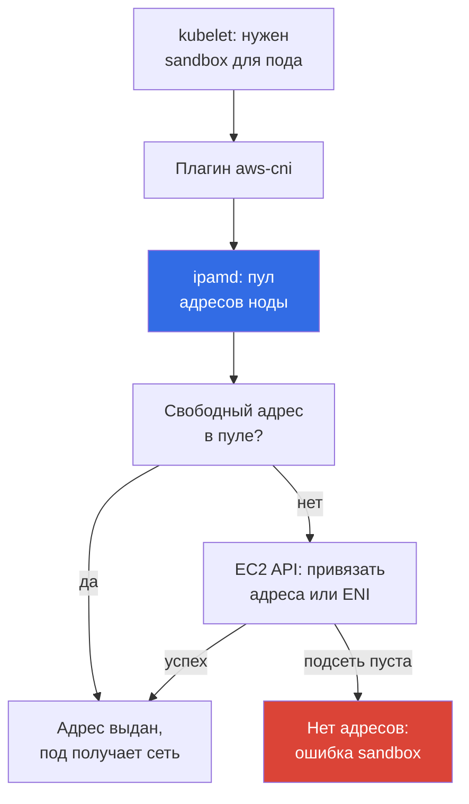
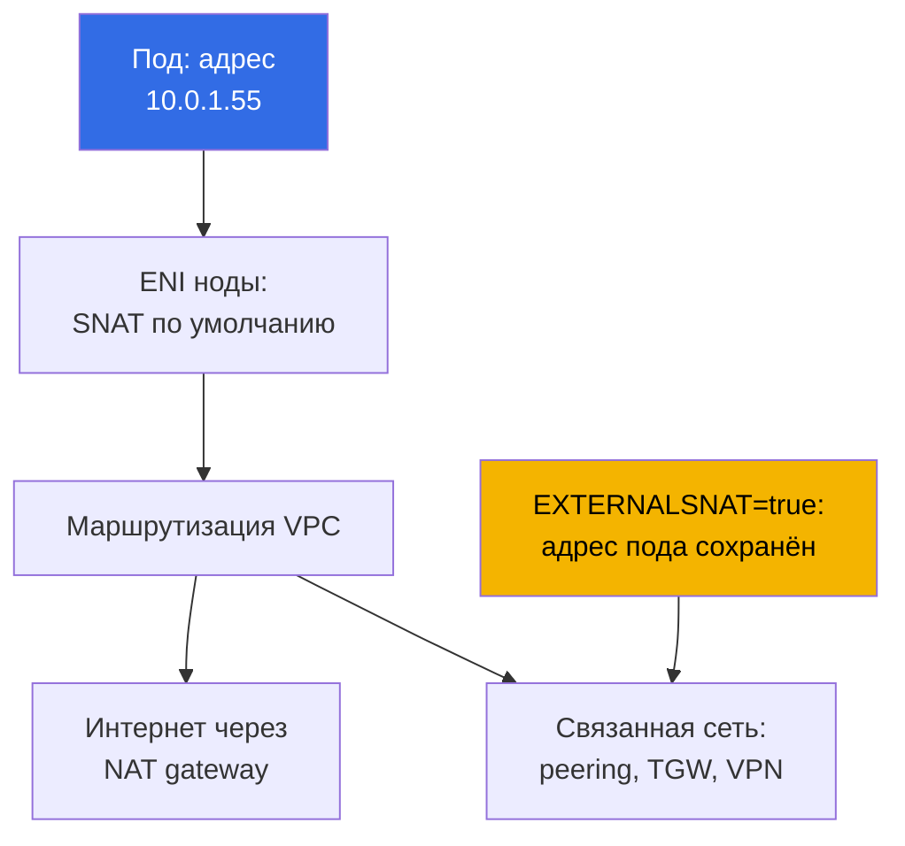

# Глава 6. Сеть кластера: VPC CNI, ENI и IP-адреса, планирование CIDR

> **Что дальше.** Кластер создан (глава 4) и доступ настроен (глава 5), поды запускаются.
> Дальше выясняется, что сеть в EKS устроена не как в kubeadm с overlay-плагином: адреса
> подов настоящие, из подсети VPC, и они конечны. Глава про то, как VPC CNI выдаёт эти
> адреса, откуда берётся лимит подов на ноду, как пул warm-адресов съедает подсеть и как
> посчитать CIDR до того, как поды начнут висеть в `ContainerCreating`. Выходы из дефицита
> адресов - глава 7, альтернативные CNI - глава 8.

## 6.1. «Под не стартует, хотя CPU и память на ноде свободны»

Кластер живёт полгода, ноды на 30 процентов по CPU. Раскатывается релиз, и часть подов
остаётся в `ContainerCreating`. В событиях не `ImagePullBackOff` и не `FailedScheduling`, а
невозможность назначить адрес:

```
Warning  FailedCreatePodSandBox  kubelet  Failed to create pod sandbox:
  plugin type="aws-cni" failed (add): add cmd: failed to assign an IP address to container
```

Место на ноде есть, планировщик прав. Нет свободных IP-адресов в подсети: проверка показывает
`0` в графе `AvailableIpAddressCount`. Подсеть выделяли как `/24`, 251 доступный адрес,
«тридцать нод и сотня подов, с запасом на годы». Потом добрался Karpenter, добавились
sidecar-контейнеры и job'ы CI. А расширить подсеть нельзя: **CIDR подсети после создания не
меняется**. Можно добавить новые подсети или дать VPC secondary CIDR (глава 7), но
существующая `/24` останется `/24`.

В kubeadm такой проблемы не было: `--pod-network-cidr 10.244.0.0/16` был просто числом в
конфиге, адреса подов виртуальные и в реальной сети ничего не занимают. В EKS каждый под
съедает **реальный приватный адрес VPC**, тот же ресурс, из которого берут адреса инстансы,
балансировщики, RDS и VPC endpoints. Адресный план перестаёт быть внутренним делом кластера.

## 6.2. Главный тезис: под - полноправный участник VPC

Amazon VPC CNI назначает поду **вторичный приватный адрес IPv4** из той же подсети, где
запущена нода. Не адрес выдуманного диапазона и не адрес за туннелем: с точки зрения VPC под
выглядит как ещё один сетевой интерфейс. Отсюда следствие, которое стоит проговорить вслух:
**между подами нет ни инкапсуляции, ни NAT**, трафик идёт внутри VPC без VXLAN и без
урезанного MTU.

| Свойство | Overlay (flannel VXLAN, Calico IPIP) | VPC CNI |
|---|---|---|
| Адрес пода | из виртуального CIDR кластера | реальный адрес подсети VPC |
| Адреса подов вне кластера | не маршрутизируются | маршрутизируются во всей VPC |
| Инкапсуляция | есть, накладные расходы и MTU | нет |
| Сколько адресов доступно | практически сколько выдумаете | сколько есть в подсети |
| Security groups на трафик подов | не применимы | применимы |
| VPC Flow Logs про трафик подов | видят только адреса нод | видят адреса подов |
| Планирование адресов | дело кластера | часть плана сети организации |

**Под доступен из VPC и связанных сетей напрямую**: инстанс вне кластера, ресурс в peered VPC
или машина за Direct Connect открывают соединение прямо на адрес пода, поэтому «под спрятан
внутри кластера» больше не аргумент безопасности. **Security groups и NACL применимы к трафику
подов**, но гранулярность грубая: правило на всю ноду, а не на под (точная привязка - глава
19, NetworkPolicy - 30). **Обратная сторона в разделе 6.1**: адресов конечное число.

## 6.3. Как это устроено: aws-node, ipamd и вторичные адреса

VPC CNI работает как DaemonSet `aws-node` в `kube-system`. Внутри два ключевых компонента:
**ipamd**, демон управления пулом адресов ноды, говорящий с EC2 API, и **плагин CNI**, который
вызывает kubelet.



Ключевая деталь: **при создании пода ipamd не ходит в EC2 API**, он выдаёт адрес из заранее
набранного пула, потому что привязка адреса и тем более создание ENI - операции на секунды, и
в критическом пути запуска они дали бы задержку старта каждой нагрузки. Поэтому ipamd держит
запас свободных адресов согласно переменным тюнинга (раздел 6.5), а когда запас тает,
привязывает новые и при необходимости создаёт **новый ENI** в той же подсети и AZ.

Отсюда два неочевидных факта. Занятые адреса в подсети **не равны числу работающих подов**,
разница уходит в warm-пул. И все ENI ноды находятся в **той же AZ**, поэтому дефицит локален
для зоны: `eu-central-1a` может быть выжата в ноль при тысячах свободных адресов в
`eu-central-1b`.

## 6.4. ENI, лимиты инстанса и max-pods

Число адресов на ноде не бесконечно: EC2 ограничивает, сколько ENI можно присоединить к
инстансу и сколько адресов IPv4 повесить на один ENI (глава 0.4). Оба числа зависят от типа
инстанса, отсюда формула лимита подов. Один адрес каждого ENI уходит на сам интерфейс, отсюда
`- 1`, а `+ 2` - это `aws-node` и `kube-proxy` в host network.

```
max-pods = ENI * (IP на ENI - 1) + 2
```

| Тип инстанса | ENI | IP на ENI | max-pods по формуле | vCPU |
|---|---|---|---|---|
| `t3.small` | 3 | 4 | 11 | 2 |
| `t3.medium` | 3 | 6 | 17 | 2 |
| `m5.xlarge` | 4 | 15 | 58 | 4 |
| `m5.4xlarge` | 8 | 30 | 234 (кэп 110) | 16 |

Значения не надо запоминать, их надо уметь получить и сверить с фактом на ноде:

```bash
aws ec2 describe-instance-types --instance-types m5.xlarge \
  --query 'InstanceTypes[].NetworkInfo.[MaximumNetworkInterfaces,Ipv4AddressesPerInterface]'
kubectl describe node <node-name> | grep -A 8 'Allocatable'
kubectl get node <node-name> -o jsonpath='{.status.allocatable.pods}{"\n"}'
```

Про кэп в скобках: у managed node groups без custom AMI EKS сам вписывает `max-pods` в user
data и ограничивает сверху - 110 для инстансов меньше 30 vCPU и 250 для больших. То есть
`m5.4xlarge` по формуле даёт 234, а по факту получит 110. Сайзинг и обход кэпа - глава 14.

Главный вывод для тех, кто пришёл из bare-metal Kubernetes: **на мелких инстансах потолок
подов упирается не в CPU и не в память, а в ENI**. `t3.medium` примет максимум 17 подов, и при
подах по 100m CPU вы платите за инстанс, который никогда не будет загружен. Плюс DaemonSet'ы
отбирают три-четыре штуки независимо от размера инстанса.

## 6.5. Пул warm-адресов: три переменные и один компромисс

Размер запаса адресов на ноде задаётся переменными окружения DaemonSet `aws-node`.

| Переменная | По умолчанию | Что делает |
|---|---|---|
| `WARM_ENI_TARGET` | `1` | держит один полностью свободный ENI адресов в запасе |
| `WARM_IP_TARGET` | не задана | держит указанное число свободных адресов вместо ENI |
| `MINIMUM_IP_TARGET` | не задана | нижняя граница адресов, выделяется сразу при старте |

Алгоритм ipamd прост. Без переменных действует `WARM_ENI_TARGET=1`: демон держит один
запасной ENI, полностью свободный, сверх занятых адресов. Если задан `WARM_IP_TARGET`,
ENI-логика отключается и демон держит ровно столько свободных адресов, привязывая и
отдавая их поштучно. `MINIMUM_IP_TARGET` задаёт нижнюю границу привязанных адресов и
выделяется одним пакетом на старте; в паре с `WARM_IP_TARGET` он гасит поштучную дёрготню -
привязанных не меньше минимума, свободных не меньше warm.

Дефолт стоит разобрать подробно, потому что именно он удивляет на маленьких подсетях.
`WARM_ENI_TARGET=1` означает не «один свободный адрес», а **один свободный ENI целиком**. На
`m5.xlarge` (15 адресов на ENI) нода с одним подом держит про запас порядка двух десятков
адресов: свои занятые плюс полный резервный интерфейс. Двадцать таких нод занимают больше
половины `/24` при паре десятков реальных подов, и именно так подсеть кончается «на пустом
кластере». Логика понятна: AWS оптимизирует **скорость запуска подов**. Цена - адреса.

```bash
kubectl set env daemonset aws-node -n kube-system WARM_IP_TARGET=5
kubectl set env daemonset aws-node -n kube-system MINIMUM_IP_TARGET=10
kubectl get ds aws-node -n kube-system \
  -o jsonpath='{.spec.template.spec.containers[0].env}' | tr ',' '\n'
```

`WARM_IP_TARGET=5` держит пять свободных адресов вместо целого ENI, `MINIMUM_IP_TARGET=10` не
даёт скатиться в «выдаём по одному адресу» на старте ноды. Компромисс в одну строку:
**экономия адресов покупается задержкой запуска подов и ростом числа вызовов EC2 API**, а
вызовы квотируются и при большом парке троттлятся. Дефолт оставляют при щедрых подсетях (`/20`
и шире); пару переменных включают, когда адресов мало. Если VPC CNI управляется как managed
addon, переменные задают через его конфигурацию, иначе обновление аддона перезапишет правку
(глава 37).

## 6.6. Планирование CIDR под ноды и поды

Считать надо не «сколько подов сейчас», а пиковое потребление адресов:

- **адреса нод** (по одному primary на инстанс) и **адреса подов** на всех нодах, включая
  DaemonSet'ы, плюс **warm-пул**, дающий при дефолте заметную надбавку (раздел 6.5);
- **запас на rolling update**: при обновлении Deployment живут старые и новые поды, при замене
  нод - старые и новые ENI. Плюс **запас на масштабирование**: пики, job'ы, dev;
- **5 адресов, которые в каждой подсети резервирует AWS** (глава 0.3): сетевой адрес, адрес
  шлюза, адрес VPC DNS, зарезервированный адрес и broadcast. Поэтому в `/24` доступно 251.

| Префикс подсети | Всего адресов | Доступно | Ориентир по нагрузке |
|---|---|---|---|
| `/24` | 256 | 251 | dev-кластер, десяток нод, до сотни подов |
| `/22` | 1024 | 1019 | небольшой прод, до нескольких сотен подов |
| `/20` | 4096 | 4091 | типовой прод-кластер с автомасштабированием |
| `/18` | 16384 | 16379 | крупный кластер или несколько в одной VPC |

- **Подсети под ноды берут с запасом сразу**, одинаковые по размеру и минимум в трёх AZ,
  потому что дефицит локален для зоны. `/20` вместо `/24` при создании VPC - правка одной
  строки в Terraform, а через год это уже миграция кластера.
- **Подсети под ноды и под балансировщики разделяют**: ALB и NLB тоже занимают адреса в каждой
  AZ своего развёртывания, и рост числа Ingress отбирает адреса у подов. Публичные `/24` под
  балансировщики и приватные `/20` под ноды - типовая раскладка (глава 26).
- **CIDR VPC не должен пересекаться** с адресами связанных сетей: peering, Transit Gateway,
  VPN, дата-центр (глава 0.3). Пересечение обнаружится в день, когда связность понадобится.

## 6.7. CIDR сервисов: он вообще не из VPC

`serviceIpv4Cidr` **не берётся из VPC**: это виртуальный диапазон внутри кластера, по которому
kube-proxy разворачивает правила на нодах. Адреса Service не привязаны ни к одному ENI и
`AvailableIpAddressCount` не уменьшают. Задаётся он **только при создании кластера** (глава
4); если поле не указать, EKS выберет сам из `10.100.0.0/16` или `172.20.0.0/16`, смотря какой
не конфликтует с CIDR вашей VPC.

```bash
aws eks describe-cluster --name demo --query 'cluster.kubernetesNetworkConfig'
kubectl -n kube-system get svc kube-dns -o jsonpath='{.spec.clusterIP}{"\n"}'
```

Типовая проблема одна, зато дорогая: автоматика проверяет конфликт с **вашей VPC**, а не со
всей связанной сетью. Если корпоративный дата-центр использует `172.20.0.0/16`, а кластер
получил тот же диапазон под Service, поды не обратятся к части внутренних систем - пакет уйдёт
в правила Service вместо маршрута в дата-центр. Лечение одно, пересоздание кластера с явным
`serviceIpv4Cidr`, поэтому диапазон согласуют заранее, как и CIDR VPC.

## 6.8. Egress подов и SNAT

Под обращается к внешнему адресу (интернет, S3 без VPC endpoint, сервис в другой VPC). По
умолчанию VPC CNI делает **SNAT**: подменяет адрес источника на primary-адрес ноды, дальше
пакет идёт обычным путём через NAT gateway или интернет-шлюз (глава 0.3).



Поведение переключается переменной `AWS_VPC_K8S_CNI_EXTERNALSNAT` у `aws-node`: при `true` CNI
перестаёт подменять адрес источника, и трафик уходит с **настоящим адресом пода**.

```bash
kubectl set env daemonset aws-node -n kube-system AWS_VPC_K8S_CNI_EXTERNALSNAT=true
```

Меняют её, когда адрес пода должен быть виден на другой стороне: трафик идёт в связанную сеть
через peering, Transit Gateway, VPN или Direct Connect, и там стоит firewall с правилами по
адресам либо приложению нужен реальный источник в логах. Условие: обратный маршрут до адресов
подов должен существовать на той стороне. Внутри VPC SNAT не применяется вообще.

## 6.9. Признаки исчерпания адресов и диагностика

```bash
kubectl get pods -A -o wide | grep -v Running
kubectl describe pod <pod> -n <ns> | tail -20
aws ec2 describe-subnets --filters Name=vpc-id,Values=vpc-0123456789abcdef0 \
  --query 'Subnets[].[SubnetId,AvailabilityZone,CidrBlock,AvailableIpAddressCount]' \
  --output table
```

Сначала источник ошибки. `FailedScheduling` с `Insufficient pods` означает исчерпанный
`max-pods` на нодах, и адреса подсети тут ни при чём (раздел 6.4). `FailedCreatePodSandBox` от
`aws-cni` отправляет в подсеть: ноль в `AvailableIpAddressCount` своей AZ - диагноз. Дальше
серверная сторона:

```bash
kubectl get ds aws-node -n kube-system
kubectl logs -n kube-system -l k8s-app=aws-node -c aws-node --tail=200 | grep -i \
  -e 'insufficient' -e 'InsufficientFreeAddressesInSubnet' -e 'assign'
aws ec2 describe-network-interfaces \
  --filters Name=attachment.instance-id,Values=i-0123456789abcdef0 \
  --query 'NetworkInterfaces[].[NetworkInterfaceId,Status,length(PrivateIpAddresses)]' \
  --output table
```

`InsufficientFreeAddressesInSubnet` от EC2 API в логах ipamd - прямое подтверждение. Число
интерфейсов тоже стоит сверить: если ENI уже столько, сколько допускает тип инстанса, новые
адреса не появятся даже в непустой подсети. Быстрая мера в аварии - поджать warm-пул. Разбор
сетевых сбоев целиком - глава 46.

Реактивной диагностики мало для парка: расход ENI и адресов держат под метриками. ipamd
публикует Prometheus-метрики на порту `61678`, путь `/metrics` (эндпоинт включён по
умолчанию, гасится переменной `DISABLE_METRICS`). Ключевые счётчики на ноду:
`awscni_assigned_ip_addresses` (адреса, отданные подам), `awscni_total_ip_addresses` (всего
привязано вторичных адресов), `awscni_ip_max` (потолок адресов по типу инстанса),
`awscni_eni_allocated` и `awscni_eni_max` (привязано и максимум ENI). Отношение assigned к
max - процент выработки ноды, а рост `awscni_ec2api_error_count` выдаёт троттлинг EC2 API.

```bash
kubectl -n kube-system port-forward ds/aws-node 61678:61678 &
curl -s localhost:61678/metrics \
  | grep -E 'awscni_(assigned_ip_addresses|total_ip_addresses|ip_max|eni_)'
```

Кластерную картину собирает `cni-metrics-helper`: он скрейпит эти эндпоинты со всех подов
`aws-node`, агрегирует по кластеру и публикует метрики в CloudWatch (`totalIPAddresses`,
`assignIPAddresses`, `eniAllocated`, `maxIPAddresses`). На них и вешают алерт выработки, а не
на ручную проверку `AvailableIpAddressCount`.

## 6.10. Куда идти из дефицита адресов

Системные решения живут в главе 7, здесь карта, чтобы знать, что искать:

- **Prefix delegation** - ENI получает префиксы `/28` вместо отдельных адресов: резко
  поднимает `max-pods` и экономит вызовы EC2 API, но потребляет адреса блоками.
- **Secondary CIDR у VPC** - добавляется диапазон, обычно из `100.64.0.0/10` (RFC 6598), и в
  нём создаются подсети под поды.
- **Custom networking** - поды получают адреса не из подсети своей ноды, а из отдельных
  подсетей через `ENIConfig`; обычно вместе с secondary CIDR. **Отдельные подсети под поды**
  заодно снимают конкуренцию за адреса с нодами и балансировщиками.
- **Смена CNI на overlay** как радикальный вариант: виртуальные адреса подов вернутся, но
  вместе с ними уйдёт всё из таблицы в разделе 6.2 (глава 8).

## 6.11. Как это применяют в продакшене

- **Адресный план согласуют до создания VPC**: приватные подсети под ноды `/20` и шире на
  каждую AZ, отдельные небольшие подсети под балансировщики, `serviceIpv4Cidr` задан явно и
  проверен на конфликт со всей связанной сетью, а не только с VPC.
- **Prefix delegation включают сразу на новых кластерах** (глава 7): дефолт, а не аврал.
- **Свободные адреса под мониторингом**: `cni-metrics-helper` даёт агрегаты в CloudWatch, а
  алерт на 20 процентов остатка `AvailableIpAddressCount` - недели на реакцию (раздел 6.9).
- **Тип инстанса выбирают с учётом лимита ENI**, а не только CPU и памяти: `t3.medium` с 17
  подами почти всегда неэффективен по деньгам (глава 14).

## 6.12. Мини-глоссарий

- **VPC CNI** - плагин сети от AWS, назначающий подам реальные приватные адреса из подсетей
  VPC; DaemonSet `aws-node` в `kube-system`. **ipamd** - демон внутри `aws-node`, управляющий
  пулом адресов ноды: привязывает вторичные адреса и создаёт ENI через EC2 API.
- **ENI** - elastic network interface; число ENI на инстанс и адресов IPv4 на ENI зависит от
  типа инстанса. **Вторичный приватный адрес** - дополнительный адрес IPv4 на ENI для пода, а
  **warm-пул** - запас таких адресов ради скорости запуска. **`cni-metrics-helper`** -
компонент: скрейпит `awscni_*` с подов `aws-node` и шлёт агрегаты в CloudWatch.
- **`max-pods`** - лимит подов на ноде: `ENI * (IP на ENI - 1) + 2`, у managed node groups
  ограничен сверху (110 или 250). **`serviceIpv4Cidr`** - диапазон адресов Service, виртуальный
  и не связанный с VPC. **SNAT** - подмена адреса источника на адрес ноды для исходящего
  трафика подов, выключается переменной `AWS_VPC_K8S_CNI_EXTERNALSNAT`.

## 6.13. Итоги главы

- Под получает реальный приватный адрес из подсети VPC: отсюда маршрутизируемость подов из VPC
  и связанных сетей, отсутствие инкапсуляции и NAT между подами, применимость security groups
  и NACL, видимость трафика подов в VPC Flow Logs. И отсюда же плата: адреса конечны.
- Адреса выдаёт `aws-node` с процессом ipamd: он держит warm-пул, привязывает вторичные адреса
  к ENI ноды и создаёт новые ENI в той же подсети и AZ, а поду отдаёт адрес из пула, не
  запрашивая EC2 API. Потолок подов даёт формула `ENI * (IP на ENI - 1) + 2`.
- `WARM_ENI_TARGET=1` по умолчанию резервирует целый ENI адресов на каждой ноде, что на узких
  подсетях расточительно; `WARM_IP_TARGET` и `MINIMUM_IP_TARGET` экономят адреса ценой
  задержки запуска подов и роста числа вызовов EC2 API.
- Планирование: подсети под ноды с запасом (`/20` и шире), одинаковые по AZ, отдельные подсети
  под балансировщики, минус 5 зарезервированных AWS адресов, и CIDR подсети после создания не
  расширяется. `serviceIpv4Cidr` не из VPC и задаётся только при создании кластера.
  Диагностика дефицита: события пода, `AvailableIpAddressCount` по своей AZ, логи ipamd, число
  ENI на инстансе. Системные выходы - в главе 7.

## 6.14. Как это пригодится в реальной работе

Вопрос «сколько подов выдержит наш кластер» имеет в EKS арифметический ответ, и посчитать его
можно до того, как релиз встанет. Разговор с сетевой командой про новую VPC проходит иначе,
когда вы приносите не «дайте подсеть», а расчёт с числом нод, подов, warm-пула и запаса на
обновления. А случай из первого раздела перестаёт быть авралом: остаток адресов под алертом,
warm-пул поджимается на месте, системное решение выбирается спокойно.

## 6.15. Вопросы для самопроверки

1. Чем адрес пода в EKS отличается от адреса пода в kubeadm с flannel и что из этого следует?
2. Как отличить нехватку адресов в подсети от исчерпанного `max-pods` на нодах?
3. Что делает ipamd в момент создания пода, а что заранее, и почему именно так?
4. Посчитайте `max-pods` для инстанса с 4 ENI и 15 адресами на ENI. Откуда `- 1` и `+ 2`?
5. Что именно резервирует `WARM_ENI_TARGET=1` и почему это опасно на подсети `/24`?
6. Сколько адресов доступно в `/22` и почему не 1024?
7. Нужен кластер на 500 подов в трёх AZ. Какого размера подсети вы попросите и почему?
8. Входит ли `serviceIpv4Cidr` в адресное пространство VPC и когда его можно изменить?
9. Когда вы включите `AWS_VPC_K8S_CNI_EXTERNALSNAT=true` и что нужно на той стороне?
10. Какие метрики ipamd покажут выработку адресов на ноде и как их собрать по кластеру?

## Практика

🧪 Лаба курса к этой теме: [лаба 101 - кластер как код](../../labs/101/README_RU.MD). В ней
вы проверяете, что VPC CNI выдаёт подам адреса из CIDR вашей VPC, и смотрите на адресный
план кластера; проверка - командой `check_result`. Запуск - `TASK=101 make run_eks_task`.

Помимо лабы, содержание главы проверяется на живом кластере. Начните с адресного
плана: `aws eks describe-cluster --name <cluster> --query 'cluster.resourcesVpcConfig'` даст
список подсетей, а `aws ec2 describe-subnets` с `--query
'Subnets[].[SubnetId,AvailabilityZone,CidrBlock,AvailableIpAddressCount]'` покажет остаток по
зонам. Сравните его с числом подов из `kubectl get pods -A -o wide | wc -l`: разница и есть
цена warm-пула.

Дальше посчитайте потолок подов: получите ENI и адреса на ENI через `aws ec2
describe-instance-types`, примените формулу и сверьте с фактом `kubectl get nodes -o
custom-columns='NODE:.metadata.name,PODS:.status.allocatable.pods'`. Если числа расходятся,
ищите кэп managed node group или включённый prefix delegation. Затем посмотрите `kubectl get
ds aws-node -n kube-system -o yaml`: найдите `WARM_ENI_TARGET`, `AWS_VPC_K8S_CNI_EXTERNALSNAT`
и проверьте, задан ли `WARM_IP_TARGET`. Наконец, сравните адреса на ENI одной ноды из `aws ec2
describe-network-interfaces` с фильтром `Name=attachment.instance-id` и её поды из `kubectl
get pods -A -o wide --field-selector spec.nodeName=<node>`.

---
[Оглавление](../README_RU.md) · [Глава 5](../05/ru.md) · [Глава 7](../07/ru.md)
