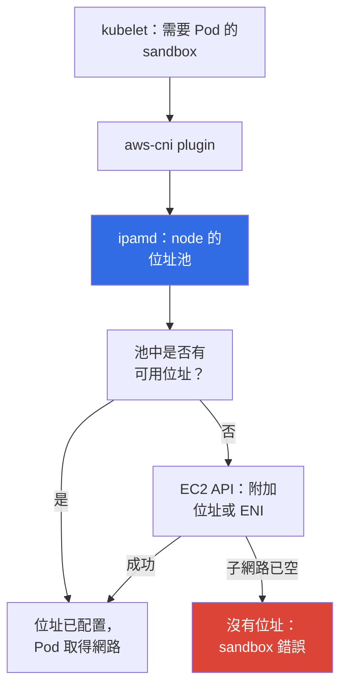
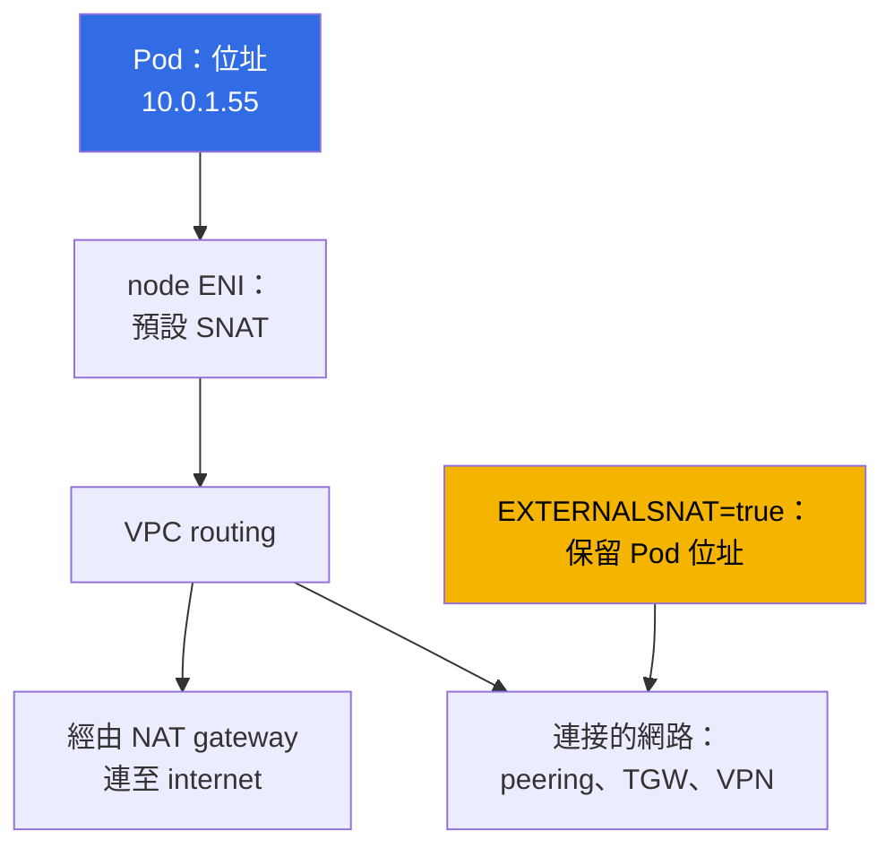

[Русская версия](ru.md) · [Eng version](en.md) · [Versión en español](es.md) · [Version française](fr.md) · [Deutsche Version](de.md) · [ქართული ვერსია](ge.md) · [日本語版](jp.md)
# 第 6 章. 叢集網路：VPC CNI、ENI 與 IP 位址、CIDR 規劃

> **接下來。** 叢集已建立（第 4 章）且已設定存取（第 5 章），Pod 正在執行。接著會發現 EKS 的網路並不像使用 overlay plugin 的 kubeadm：Pod 位址是真實的 VPC 子網路位址，而且數量有限。本章說明 VPC CNI 如何配置這些位址、每個 node 的 Pod 上限從何而來、warm 位址池如何耗用子網路，以及如何在 Pod 卡在 `ContainerCreating` 前計算 CIDR。位址不足的解法見第 7 章，替代 CNI 見第 8 章。

## 6.1. 「Pod 無法啟動，但 node 上的 CPU 與記憶體仍有空閒」

叢集運作了半年，nodes 的 CPU 使用率為 30%。一個 release 開始部署，部分 Pod 卻停在 `ContainerCreating`。events 中不是 `ImagePullBackOff` 或 `FailedScheduling`，而是無法配置位址：

```
Warning  FailedCreatePodSandBox  kubelet  Failed to create pod sandbox:
  plugin type="aws-cni" failed (add): add cmd: failed to assign an IP address to container
```

node 上還有空間，scheduler 沒錯。子網路沒有可用 IP 位址：檢查結果顯示 `AvailableIpAddressCount` 欄位為 `0`。子網路最初配置為 `/24`，有 251 個可用位址，原本以為「三十個 nodes 和一百個 Pods，足夠用很多年」。後來 Karpenter 加入了，增加了 sidecar containers 和 CI jobs。但子網路無法擴大：**子網路的 CIDR 建立後不可變更**。可新增子網路或為 VPC 配置 secondary CIDR（第 7 章），但既有的 `/24` 仍然是 `/24`。

在 kubeadm 中沒有這個問題：`--pod-network-cidr 10.244.0.0/16` 只是 config 裡的數字，Pod 位址是虛擬的，不占用實際網路。EKS 中每個 Pod 都會耗用**真正的 VPC private address**，這與 instances、load balancers、RDS 和 VPC endpoints 使用的是同一項資源。位址規劃不再只是叢集內部事務。

## 6.2. 核心概念：Pod 是完整的 VPC 成員

Amazon VPC CNI 會從 node 所在的同一子網路，向 Pod 配置**secondary private IPv4 address**。它不是虛構範圍的位址，也不是 tunnel 後的位址：從 VPC 的角度看，Pod 就像另一個 network interface。因此有一個應明確說出的結論：**Pod 之間既沒有 encapsulation，也沒有 NAT**，流量會在 VPC 內傳輸，沒有 VXLAN，也不會降低 MTU。

| 屬性 | Overlay（flannel VXLAN、Calico IPIP） | VPC CNI |
|---|---|---|
| Pod 位址 | 來自虛擬的 cluster CIDR | 真實 VPC 子網路位址 |
| 叢集外的 Pod 位址 | 不可路由 | 可在整個 VPC 中路由 |
| Encapsulation | 有，帶來額外成本與 MTU 影響 | 無 |
| 可用位址數 | 幾乎可任意設定 | 以子網路中的數量為限 |
| Pod 流量的 Security groups | 不適用 | 適用 |
| Pod 流量的 VPC Flow Logs | 僅看到 node 位址 | 可看到 Pod 位址 |
| 位址規劃 | 叢集的事情 | 組織網路規劃的一部分 |

**可從 VPC 與連接的網路直接存取 Pod**：叢集外的 instance、peered VPC 中的 resource，或 Direct Connect 後的機器可直接連到 Pod 位址，因此「Pod 藏在叢集內」不再是安全論點。**Security groups 和 NACL 適用於 Pod 流量**，但粒度很粗：規則套用到整個 node，而不是單一 Pod（精確綁定見第 19 章，NetworkPolicy 見第 30 章）。**第 6.1 節的另一面**是：位址數量有限。

## 6.3. 運作方式：aws-node、ipamd 與 secondary addresses

VPC CNI 以 `kube-system` 中名為 `aws-node` 的 DaemonSet 運作。內部有兩個核心 components：透過 EC2 API 管理 node 位址池的 daemon **ipamd**，以及由 kubelet 呼叫的 **CNI plugin**。



關鍵細節是：**建立 Pod 時 ipamd 不會呼叫 EC2 API**，而是從預先準備的池中交出位址。因為附加位址，尤其建立 ENI，都需要數秒，若放在啟動的 critical path 上，會延遲每一項 workload 的啟動。因此 ipamd 依照 tuning variables（第 6.5 節）保留可用位址，當存量下降時附加新位址，並在必要時於同一子網路與 AZ 建立**新的 ENI**。

因此有兩個不明顯的事實。子網路中的已用位址**不等於執行中 Pods 的數量**，差額進入 warm pool。而 node 的所有 ENI 都在**同一個 AZ**，所以不足是 zone-local 的：即使 `eu-central-1b` 有數千個可用位址，`eu-central-1a` 仍可能耗盡。

## 6.4. ENI、instance limits 與 max-pods

每個 node 的位址數並非無限：EC2 限制可附加到 instance 的 ENI 數量，也限制每個 ENI 可配置的 IPv4 位址數（第 0.4 章）。兩個數值都取決於 instance type，因而得出 Pod 上限公式。每個 ENI 有一個位址給介面本身，所以是 `- 1`；`+ 2` 則是 host network 中的 `aws-node` 與 `kube-proxy`。

```
max-pods = ENI * (每個 ENI 的 IP - 1) + 2
```

| 執行個體類型 | ENI | 每個 ENI 的 IP | 依公式的 max-pods | vCPU |
|---|---|---|---|---|
| `t3.small` | 3 | 4 | 11 | 2 |
| `t3.medium` | 3 | 6 | 17 | 2 |
| `m5.xlarge` | 4 | 15 | 58 | 4 |
| `m5.4xlarge` | 8 | 30 | 234（cap 為 110） | 16 |

不用背下這些值，但應能取得它們並與 node 上的實際值核對：

```bash
aws ec2 describe-instance-types --instance-types m5.xlarge \
  --query 'InstanceTypes[].NetworkInfo.[MaximumNetworkInterfaces,Ipv4AddressesPerInterface]'
kubectl describe node <node-name> | grep -A 8 'Allocatable'
kubectl get node <node-name> -o jsonpath='{.status.allocatable.pods}{"\n"}'
```

括號中的 cap 是指：對沒有 custom AMI 的 managed node groups，EKS 會自行在 user data 寫入 `max-pods`，並設定上限 - 小於 30 vCPU 的 instances 為 110，較大的為 250。因此，`m5.4xlarge` 依公式為 234，但實際只會得到 110。Sizing 與繞過 cap 見第 14 章。

對來自 bare-metal Kubernetes 的人，主要結論是：**小型 instances 的 Pod 上限受 ENI 限制，不受 CPU 或記憶體限制**。`t3.medium` 最多容納 17 個 Pods；若每個 Pod 只要 100m CPU，你仍在為永遠無法完全使用的 instance 付費。此外，DaemonSets 不論 instance 大小都會占用三到四個名額。
## 6.5. Warm 位址池：三個變數與一項取捨

每個 node 的位址預留量由 `aws-node` DaemonSet 的 environment variables 設定。

| 變數 | 預設值 | 作用 |
|---|---|---|
| `WARM_ENI_TARGET` | `1` | 預留一個完全未使用的 ENI 位址 |
| `WARM_IP_TARGET` | 未設定 | 以指定數量的可用位址取代 ENI 預留 |
| `MINIMUM_IP_TARGET` | 未設定 | 啟動時立即配置的位址下限 |

ipamd 的演算法很簡單。未設定 variables 時使用 `WARM_ENI_TARGET=1`：daemon 在已使用的位址之外，保留一個完全未使用的備用 ENI。若設定 `WARM_IP_TARGET`，則會停用 ENI 邏輯，daemon 會保留剛好這麼多可用位址，逐一附加並交付。`MINIMUM_IP_TARGET` 設定已附加位址的下限，於啟動時一次配置；與 `WARM_IP_TARGET` 搭配時，它會消除逐一配置的抖動 - 附加的位址不少於 minimum，可用的位址不少於 warm。

應詳細理解預設值，因為它特別容易在小子網路中造成意外。`WARM_ENI_TARGET=1` 並非「一個可用位址」，而是**一整個可用 ENI**。在 `m5.xlarge` 上（每個 ENI 有 15 個位址），只有一個 Pod 的 node 仍會預留約二十個位址：自身已使用的位址加上完整的備用介面。二十個這樣的 nodes，在實際只有數十個 Pods 時就會占用超過 `/24` 的一半，子網路就以這種方式在「空的叢集」中耗盡。其理由很明確：AWS 最佳化的是 **Pod 啟動速度**。代價是位址。

```bash
kubectl set env daemonset aws-node -n kube-system WARM_IP_TARGET=5
kubectl set env daemonset aws-node -n kube-system MINIMUM_IP_TARGET=10
kubectl get ds aws-node -n kube-system \
  -o jsonpath='{.spec.template.spec.containers[0].env}' | tr ',' '\n'
```

`WARM_IP_TARGET=5` 會保留五個可用位址，而不是一整個 ENI；`MINIMUM_IP_TARGET=10` 避免 node 啟動時落入「每次只配置一個位址」。一句話總結這個取捨：**節省位址是以 Pod 啟動延遲與 EC2 API 呼叫數增加換來的**，而 API calls 有 quota，在大型 fleet 中可能被 throttling。子網路充裕時（`/20` 或更寬）保留預設值；位址不足時設定這兩個 variables。若 VPC CNI 以 managed addon 管理，應透過其 configuration 設定 variables，否則 addon update 會覆寫變更（第 37 章）。

## 6.6. 為 nodes 與 Pods 規劃 CIDR

不應計算「現在有多少 Pods」，而應計算尖峰位址消耗：

- 所有 nodes 的**node 位址**（每個 instance 一個 primary）與**Pod 位址**，包含 DaemonSets 與 warm pool，後者在預設值下會增加顯著的額外用量（第 6.5 節）；
- **rolling update 預留量**：Deployment 更新時新舊 Pods 同時存在，node 更換時新舊 ENI 也會同時存在。還要有**scale-out 預留量**：尖峰、jobs、dev；
- **AWS 在每個子網路保留的 5 個位址**（第 0.3 章）：network address、gateway address、VPC DNS address、reserved address 與 broadcast。因此 `/24` 有 251 個可用位址。

| 子網路 prefix | 位址總數 | 可用數 | Workload 參考 |
|---|---|---|---|
| `/24` | 256 | 251 | dev cluster、十個 nodes、最多約一百個 Pods |
| `/22` | 1024 | 1019 | 小型 production、最多數百個 Pods |
| `/20` | 4096 | 4091 | 具有 autoscaling 的典型 production cluster |
| `/18` | 16384 | 16379 | 大型 cluster 或同一 VPC 中的多個 clusters |

- **最初就以充裕容量配置 node 子網路**，它們的大小應相同，且至少分布於三個 AZ，因為不足是 zone-local 的。建立 VPC 時選擇 `/20` 而不是 `/24` 只需修改 Terraform 的一行；一年後則會變成 cluster migration。
- **分開配置 nodes 與 load balancers 的子網路**：ALB 和 NLB 也會在部署所在的每個 AZ 占用位址，Ingress 數量增加會搶走 Pods 的位址。給 load balancers 使用 public `/24`，給 nodes 使用 private `/20`，是典型配置（第 26 章）。
- **VPC CIDR 不得與連接網路的位址重疊**：peering、Transit Gateway、VPN、data center（第 0.3 章）。當需要 connectivity 的那天，才會發現重疊問題。

## 6.7. Service CIDR：它完全不屬於 VPC

`serviceIpv4Cidr` **不來自 VPC**：它是叢集內的虛擬範圍，kube-proxy 用它在 nodes 上部署 rules。Service 位址不會附加到任何 ENI，也不會減少 `AvailableIpAddressCount`。它**僅能在建立 cluster 時**設定（第 4 章）；如果未指定，EKS 會從 `10.100.0.0/16` 或 `172.20.0.0/16` 中選擇一個不與 VPC CIDR 衝突的範圍。

```bash
aws eks describe-cluster --name demo --query 'cluster.kubernetesNetworkConfig'
kubectl -n kube-system get svc kube-dns -o jsonpath='{.spec.clusterIP}{"\n"}'
```

典型問題只有一個，但修復成本很高：自動機制只檢查**你的 VPC**，不是整個連接網路。若企業 data center 使用 `172.20.0.0/16`，而 cluster 為 Service 取得相同範圍，Pods 就無法連到部分內部系統 - packet 會進入 Service rules，而不是通往 data center 的 route。唯一解法是以明確的 `serviceIpv4Cidr` 重建 cluster，因此應事先協調此範圍，就像協調 VPC CIDR 一樣。

## 6.8. Pod egress 與 SNAT

Pod 連至外部位址（internet、沒有 VPC endpoint 的 S3、另一個 VPC 中的 service）時，VPC CNI 預設會進行 **SNAT**：將 source address 改為 node 的 primary address，然後 packet 經由 NAT gateway 或 internet gateway 以正常路徑前進（第 0.3 章）。



此行為可透過 `aws-node` 的 `AWS_VPC_K8S_CNI_EXTERNALSNAT` variable 切換：設為 `true` 時，CNI 不再變更 source address，流量會帶著**真正的 Pod 位址**送出。

```bash
kubectl set env daemonset aws-node -n kube-system AWS_VPC_K8S_CNI_EXTERNALSNAT=true
```

當另一端必須看見 Pod 位址時才變更它：流量經由 peering、Transit Gateway、VPN 或 Direct Connect 前往連接網路，而該處有依位址設定規則的 firewall，或應用程式在 logs 中需要真正的來源位址。條件是另一端必須有到 Pod 位址的 return route。在 VPC 內部完全不會套用 SNAT。
## 6.9. 位址耗盡的跡象與診斷

```bash
kubectl get pods -A -o wide | grep -v Running
kubectl describe pod <pod> -n <ns> | tail -20
aws ec2 describe-subnets --filters Name=vpc-id,Values=vpc-0123456789abcdef0 \
  --query 'Subnets[].[SubnetId,AvailabilityZone,CidrBlock,AvailableIpAddressCount]' \
  --output table
```

先找出錯誤來源。出現 `Insufficient pods` 的 `FailedScheduling` 表示 nodes 的 `max-pods` 已耗盡，與子網路位址無關（第 6.4 節）。來自 `aws-cni` 的 `FailedCreatePodSandBox` 則指向子網路：自身 AZ 的 `AvailableIpAddressCount` 為零，就是診斷結果。接著檢查 server side：

```bash
kubectl get ds aws-node -n kube-system
kubectl logs -n kube-system -l k8s-app=aws-node -c aws-node --tail=200 | grep -i \
  -e 'insufficient' -e 'InsufficientFreeAddressesInSubnet' -e 'assign'
aws ec2 describe-network-interfaces \
  --filters Name=attachment.instance-id,Values=i-0123456789abcdef0 \
  --query 'NetworkInterfaces[].[NetworkInterfaceId,Status,length(PrivateIpAddresses)]' \
  --output table
```

ipamd logs 中 EC2 API 回傳的 `InsufficientFreeAddressesInSubnet` 是直接證據。也應核對 interfaces 的數量：若 ENI 已達 instance type 允許的數量，即使子網路尚未空，新位址也不會出現。緊急情況下的快速措施是縮小 warm pool。完整網路故障排除見第 46 章。

對 fleet 而言，reactive 診斷還不夠：應監控 ENI 與位址消耗。ipamd 在 port `61678`、path `/metrics` 發布 Prometheus metrics（endpoint 預設啟用，可用 `DISABLE_METRICS` variable 停用）。每個 node 的主要 counters 為：`awscni_assigned_ip_addresses`（交給 Pods 的位址）、`awscni_total_ip_addresses`（已附加的 secondary addresses 總數）、`awscni_ip_max`（instance type 的位址上限）、`awscni_eni_allocated` 與 `awscni_eni_max`（已附加與最多的 ENI）。assigned 相對 max 的比例是 node 的使用百分比；`awscni_ec2api_error_count` 上升則表示 EC2 API throttling。

```bash
kubectl -n kube-system port-forward ds/aws-node 61678:61678 &
curl -s localhost:61678/metrics \
  | grep -E 'awscni_(assigned_ip_addresses|total_ip_addresses|ip_max|eni_)'
```

`cni-metrics-helper` 提供 cluster-wide 視圖：它從所有 `aws-node` Pods scrape 這些 endpoints，依叢集彙總，並將 metrics 發布到 CloudWatch（`totalIPAddresses`、`assignIPAddresses`、`eniAllocated`、`maxIPAddresses`）。應以這些設定耗用告警，而不是手動檢查 `AvailableIpAddressCount`。

## 6.10. 如何走出位址不足

系統性的解法在第 7 章，本節提供地圖，讓你知道該找什麼：

- **Prefix delegation** - ENI 取得 `/28` prefixes，而不是單獨的位址：大幅提高 `max-pods` 並減少 EC2 API calls，但會以 blocks 耗用位址。
- **VPC 的 secondary CIDR** - 新增一段範圍，通常是 `100.64.0.0/10`（RFC 6598），並在其中建立 Pod 子網路。
- **Custom networking** - Pods 不從其 node 的子網路取得位址，而是透過 `ENIConfig` 使用獨立子網路；通常與 secondary CIDR 一起使用。**Pod 的獨立子網路**也消除了 Pods 與 nodes、load balancers 之間對位址的競爭。
- 將 CNI 改為 **overlay** 作為激進方案：虛擬 Pod 位址會回來，但第 6.2 節表格中的一切優勢也會失去（第 8 章）。

## 6.11. 在 production 中的運用方式

- **在建立 VPC 前協調位址規劃**：每個 AZ 有 `/20` 或更寬的 private node 子網路、供 load balancers 使用的獨立小型子網路、明確設定的 `serviceIpv4Cidr`，並檢查它與整個連接網路的衝突，而不只與 VPC 衝突。
- **新 clusters 立即啟用 Prefix delegation**（第 7 章）：這是預設作法，而非緊急補救。
- **監控可用位址**：`cni-metrics-helper` 在 CloudWatch 提供彙總資料，`AvailableIpAddressCount` 剩餘 20 percent 的告警可留下數週反應時間（第 6.9 節）。
- **選擇 instance type 時考慮 ENI limit**，而非僅看 CPU 與記憶體：只有 17 個 Pods 的 `t3.medium` 幾乎總是在成本上沒有效率（第 14 章）。

## 6.12. 迷你詞彙表

- **VPC CNI** - AWS 的 network plugin，從 VPC 子網路為 Pods 配置真實 private addresses；它是 `kube-system` 中的 `aws-node` DaemonSet。**ipamd** - `aws-node` 內管理 node 位址池的 daemon：它透過 EC2 API 附加 secondary addresses 並建立 ENI。
- **ENI** - elastic network interface；每個 instance 可擁有的 ENI 與每個 ENI 的 IPv4 位址數取決於 instance type。**Secondary private address** - ENI 上供 Pod 使用的額外 IPv4 address；**warm pool** - 為提高啟動速度保留的這類位址。**`cni-metrics-helper`** - component：從 `aws-node` Pods scrape `awscni_*`，並將彙總資料傳送到 CloudWatch。
- **`max-pods`** - 每個 node 的 Pod limit：`ENI * (每個 ENI 的 IP - 1) + 2`，managed node groups 有上限（110 或 250）。**`serviceIpv4Cidr`** - 虛擬且不屬於 VPC 的 Service address range。**SNAT** - 將 Pod egress 流量的 source address 改為 node address，可用 `AWS_VPC_K8S_CNI_EXTERNALSNAT` variable 停用。

## 6.13. 本章小結

- Pod 從 VPC 子網路取得真正的 private address：因此 Pods 可從 VPC 與連接網路路由、Pod 之間沒有 encapsulation 與 NAT、Security groups 和 NACL 可用，且 VPC Flow Logs 可看見 Pod 流量。代價也由此而來：位址數量有限。
- `aws-node` 內的 ipamd 會配置位址：它維護 warm pool、將 secondary addresses 附加到 node ENI、在同一子網路與 AZ 建立新的 ENI，並從池中將位址交給 Pod，無需發出 EC2 API request。Pod 上限由公式 `ENI * (每個 ENI 的 IP - 1) + 2` 決定。
- 預設的 `WARM_ENI_TARGET=1` 在每個 node 預留完整的 ENI 位址，對狹窄的子網路很浪費；`WARM_IP_TARGET` 與 `MINIMUM_IP_TARGET` 以增加 Pod 啟動延遲和 EC2 API calls 作為代價來節省位址。
- 規劃時應為 nodes 保留充裕的子網路（`/20` 或更寬），各 AZ 大小相同，為 load balancers 使用獨立子網路，扣除 AWS 保留的 5 個位址，並記住子網路 CIDR 建立後不可擴大。`serviceIpv4Cidr` 不屬於 VPC，且僅能在建立 cluster 時設定。診斷不足時：查看 Pod events、自己 AZ 的 `AvailableIpAddressCount`、ipamd logs 與 instance 的 ENI 數。系統性解法見第 7 章。

## 6.14. 這如何協助實際工作

在 EKS 中，「我們的 cluster 能承受多少 Pods」有算術上的答案，且可在 release 卡住前算出來。當你向網路團隊討論新的 VPC，帶去的不是「請給我一個子網路」，而是 node 數、Pod 數、warm pool 與更新預留量的計算，對話就會不同。第一節的事件也不再是緊急事故：可用位址有告警，warm pool 可就地縮小，系統性解法能從容選擇。

## 6.15. 自我檢查問題

1. EKS 中的 Pod 位址與使用 flannel 的 kubeadm 中的 Pod 位址有何不同，會帶來什麼後果？
2. 如何區分子網路位址不足與 node 上 `max-pods` 耗盡？
3. ipamd 在建立 Pod 的當下做什麼，又預先做什麼，為什麼？
4. 計算有 4 個 ENI、每個 ENI 有 15 個位址的 instance 的 `max-pods`。`- 1` 與 `+ 2` 從何而來？
5. `WARM_ENI_TARGET=1` 究竟保留了什麼，為何對 `/24` 子網路危險？
6. `/22` 中有多少可用位址，為何不是 1024？
7. 三個 AZ 中需要容納 500 個 Pods 的 cluster。你會要求何種大小的子網路，為什麼？
8. `serviceIpv4Cidr` 是否屬於 VPC address space，何時可以變更？
9. 何時會啟用 `AWS_VPC_K8S_CNI_EXTERNALSNAT=true`，另一端必須具備什麼？
10. 哪些 ipamd metrics 顯示 node 的位址耗用，如何在整個 cluster 中收集它們？
## 實作

本主題的課程 lab 是[lab 101 - 以程式碼建立 cluster](../../labs/101/README_TW.MD)。在其中，你會驗證 VPC CNI 為 Pods 配置來自 VPC CIDR 的位址，並檢視 cluster 的位址規劃；可用 `check_result` command 進行檢查。執行方式為 `TASK=101 make run_eks_task`。本主題也涵蓋[lab 103 - 位址規劃：ENI limits、prefix delegation、secondary CIDR](../../labs/103/README_TW.MD)，它會更深入說明位址規劃的 scaling。

除 labs 之外，也能在 live cluster 上驗證本章內容。先從位址規劃開始：`aws eks describe-cluster --name <cluster> --query 'cluster.resourcesVpcConfig'` 會提供子網路清單，而帶有 `--query 'Subnets[].[SubnetId,AvailabilityZone,CidrBlock,AvailableIpAddressCount]'` 的 `aws ec2 describe-subnets` 會顯示各 zones 的餘量。將它與 `kubectl get pods -A -o wide | wc -l` 的 Pod 數比較：差額就是 warm pool 的成本。

接著計算 Pod 上限：透過 `aws ec2 describe-instance-types` 取得 ENI 與每個 ENI 的位址數，套用公式，並與 `kubectl get nodes -o custom-columns='NODE:.metadata.name,PODS:.status.allocatable.pods'` 的實際值核對。若數字不一致，請尋找 managed node group cap 或啟用的 prefix delegation。然後檢視 `kubectl get ds aws-node -n kube-system -o yaml`：找出 `WARM_ENI_TARGET`、`AWS_VPC_K8S_CNI_EXTERNALSNAT`，並檢查是否設定 `WARM_IP_TARGET`。最後，以 `Name=attachment.instance-id` filter 執行 `aws ec2 describe-network-interfaces`，比較一個 node ENI 上的位址與該 node 的 Pods：`kubectl get pods -A -o wide --field-selector spec.nodeName=<node>`。

---
[目錄](../README_TW.md) · [第 5 章](../05/tw.md) · [第 7 章](../07/tw.md)
