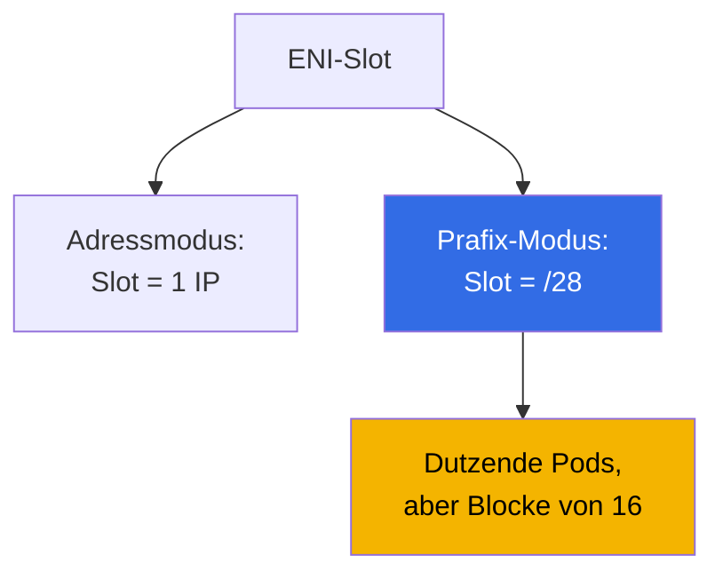
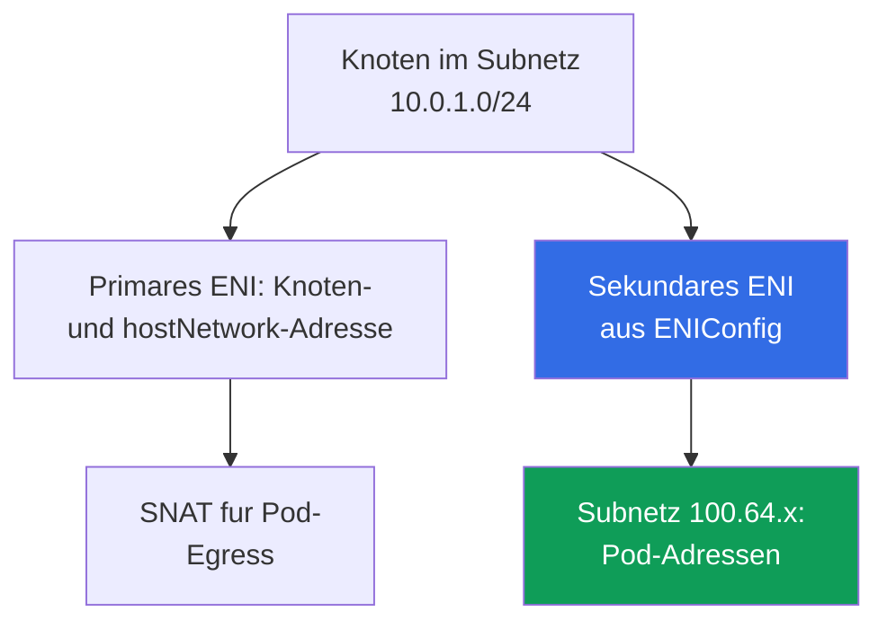

[Русская версия](ru.md) · [Eng version](en.md) · [Versión en español](es.md) · [Version française](fr.md) · [ქართული ვერსია](ge.md) · [繁體中文版](tw.md) · [日本語版](jp.md)
# Kapitel 7. Massstab des Adressplans: prefix delegation, secondary CIDR, custom networking

> **Was kommt als Nachstes.** In Kapitel 6 wurde erklart, wie VPC CNI den Pods echte Subnetz-Adressen zuweist und warum sie ausgehen. Dieses Kapitel behandelt die Losungen auf Systemebene: prefix delegation, secondary CIDR des VPC, custom networking uber `ENIConfig`, die Rollout-Reihenfolge in einem laufenden Cluster und betriebliche Anderungen. Alternative CNIs und Cilium sind in Kapitel 8, NetworkPolicy in Kapitel 30, Knotendichte und -dimensionierung in Kapitel 14 und die Analyse von Netzwerkausfallen in Kapitel 46. Ein IPv6-Cluster wird als eigener Weg erwahnt, aber nicht im Detail untersucht: `ipFamily` wird nur bei der Erstellung festgelegt (Kapitel 4).

## 7.1. Drei Antworten auf "das Subnetz ist erschopft und kann nicht erweitert werden"

Die Situation aus Kapitel 6 im schlimmsten Fall: Knoten-Subnetze sind `/24`, `AvailableIpAddressCount` in einer produktiven AZ nahert sich Null, und ein Release scheitert an `FailedCreatePodSandBox`. `/24` auf `/22` erweitern ist nicht moglich, aber der Cluster muss weiter wachsen.

- **Mehr Pods mit denselben Adressen auf einen Knoten packen** - prefix delegation: Ein ENI-Slot wird einem `/28`-Block zugewiesen. Gunstig, aber **fugt dem Subnetz keine Adressen hinzu** und verbraucht sie in grossen Blocken.
- **Neuen Adressraum in den VPC bringen** - secondary CIDR: Einen Bereich assoziieren, Subnetze erstellen und Pod-Adressen daraus vergeben. Der Bereich muss durch Routing, NAT und verbundene Netzwerke propagiert werden.
- **Dem IPv4-Mangel als Problemklasse entkommen** - ein IPv6-Cluster (Abschnitt 7.9) oder ein Overlay-CNI (Kapitel 8), aber nur in einem neuen Cluster.

Die ersten beiden Antworten werden in der Regel kombiniert. Ein Vergleich nach Kriterien findet sich in Abschnitt 7.6.

## 7.2. Prefix delegation: ein ENI-Slot wird einem /28-Block zugewiesen

Im normalen Modus verwendet VPC CNI einen ENI-Slot fur eine sekundare IPv4-Adresse, wobei die Anzahl der Slots durch den Instanztyp bestimmt wird (Kapitel 6). Prefix delegation andert den Inhalt des Slots: Statt einer Adresse erhalt er **ein `/28`-Prafix, also 16 Adressen**.



```bash
kubectl set env daemonset aws-node -n kube-system ENABLE_PREFIX_DELEGATION=true
aws eks update-addon --cluster-name demo --addon-name vpc-cni \
  --configuration-values '{"env":{"ENABLE_PREFIX_DELEGATION":"true","WARM_PREFIX_TARGET":"1"}}' \
  --resolve-conflicts PRESERVE
```

Der erste Befehl eignet sich fur ein manuell installiertes CNI. **Wenn VPC CNI als managed addon installiert ist, uberlebt eine Anderung uber `kubectl set env` nur bis zum nachsten Addon-Update**, weshalb Variablen uber dessen Konfiguration gesetzt werden, wie im zweiten Befehl. Dies gilt fur alle Variablen dieses Kapitels (Kapitel 37).

**Nur Nitro-basierte Instanzen unterstutzen Prafixe auf Netzwerk-Interfaces**: Die ubrigen nehmen weiterhin einzelne sekundare Adressen, und in einem gemischten Node-Group verhalten sich Knoten unterschiedlich. Fur grosse Flotten bietet dieser Modus einen weiteren Vorteil: **weniger EC2-API-Aufrufe**, da eine Anfrage 16 Adressen liefert und das Anhangen eines Prafixes an ein bestehendes ENI schneller ist als ein neues zu erstellen.

Jeder Slot ausser dem, der von der Interface-Adresse selbst belegt ist, liefert 16 Adressen, sodass die Pod-Obergrenze mit anderen Zahlen berechnet wird.

| Instanz | ENI | IPs pro ENI | Adressmodus | Prafix-Modus | Cap managed node group |
|---|---|---|---|---|---|
| `m5.large` | 3 | 10 | 29 | 434 | 110 |
| `m5.xlarge` | 4 | 15 | 58 | 898 | 110 |
| `m5.8xlarge` | 8 | 30 | 234 | 3714 | 250 |

**Managed node groups begrenzen `maxPods` unabhangig von prefix delegation: 110 fur Instanzen unter 30 vCPUs und 250 fur den Rest.** Das Aktivieren der Variable hebt diese Obergrenze nicht an: Zum Uberschreiten braucht man ein eigenes AMI im Launch Template mit `maxPods` in User Data (Kapitel 10) oder eine self-managed node group. Der Grund ist Ruckwartskompatibilitat: Die Standard-`max-pods`-Tabelle ist fur den Adressmodus berechnet, daher ubergeben User Data `--use-max-pods false` zusammen mit einem expliziten `--max-pods`, und der Wert wird von `max-pods-calculator.sh` mit dem Flag `--cni-prefix-delegation-enabled` berechnet. Das Wichtigste: **`kubelet` lernt `max-pods` beim Start**, daher behalt ein Knoten aus dem Adressmodus seinen alten Wert. Prefix delegation ist fur neue Knoten.

Der andere Teil der Kosten ist Fragmentierung. Ein Prafix benotigt **einen zusammenhangenden Block von 16 Adressen**, und dort, wo sekundare Adressen im Subnetz verstreut sind, gibt es moglicherweise viele freie Adressen, aber keine zusammenhangenden Blocke: `AvailableIpAddressCount` zeigt Hunderte Adressen an, Pods starten nicht, und ipamd-Logs zeigen `InsufficientCidrBlocks`. Die Losung ist ein neues Subnetz oder eine **subnet CIDR reservation**.

```bash
aws ec2 create-subnet-cidr-reservation --subnet-id subnet-0123456789abcdef0 \
  --reservation-type prefix --cidr 10.0.1.128/25
aws ec2 describe-network-interfaces \
  --filters Name=attachment.instance-id,Values=i-0123456789abcdef0 \
  --query 'NetworkInterfaces[].[NetworkInterfaceId,Ipv4Prefixes[].Ipv4Prefix]' --output text
```

Adressen werden **in Blocken von 16** verbraucht: Drei Knoten mit je einem Pod belegen 48 Adressen statt drei. Die Regel: Prefix delegation verbessert die Pod-Dichte und API-Aufrufe, nicht den Adressmangel, und bei Mangel wird es zusammen mit neuem Adressraum aktiviert.

## 7.3. Der Warm-Pool im Prafix-Modus

Die Reserve-Logik ist dieselbe wie in Kapitel 6, aber die Masseinheit ist eine andere.

| Umgebungsvariable | Was in Reserve gehalten wird | Prioritat |
|---|---|---|
| `WARM_PREFIX_TARGET` | ganze `/28`-Prafixe uber den aktuellen Bedarf hinaus | Basis fur den Prafix-Modus |
| `WARM_IP_TARGET` | einzelne Adressen uber den aktuellen Bedarf hinaus | uberschreibt `WARM_PREFIX_TARGET` |
| `MINIMUM_IP_TARGET` | die untere Adressgrenze auf einem Knoten | uberschreibt `WARM_PREFIX_TARGET` |

**`WARM_IP_TARGET` und `MINIMUM_IP_TARGET` gelten im Prafix-Modus und haben Vorrang vor `WARM_PREFIX_TARGET`.** `WARM_PREFIX_TARGET=1` halt ein ganzes zusatzliches Prafix vor, bis zu 16 ungenutzte Adressen pro Knoten, wahrend ein `WARM_IP_TARGET` unter 16 verhindert, ein ganzes zusatzliches Prafix anzuhangen, und Adressen auf Kosten haufigerer EC2-API-Aufrufe spart.

```bash
kubectl set env ds aws-node -n kube-system WARM_PREFIX_TARGET=1
kubectl set env ds aws-node -n kube-system WARM_IP_TARGET=8 MINIMUM_IP_TARGET=16
```

Bei breiten Subnetzen `WARM_PREFIX_TARGET=1` beibehalten und schnellen Pod-Start erhalten; bei engen Subnetzen das Paar `WARM_IP_TARGET` und `MINIMUM_IP_TARGET` hinzufugen. Alle drei zu setzen, ohne die Prioritat zu verstehen, ist ein Weg zu unerklarlichem Verhalten.

## 7.4. Secondary CIDR: neuer Adressraum in einem bestehenden VPC

Zusatzliche IPv4-Blocke werden dem VPC zugeordnet, und Subnetze darin erstellt. Bestehende Subnetze und Knoten bleiben unbeeinflusst, und die `local`-Route wird automatisch hinzugefugt.

```bash
vpc_id=$(aws eks describe-cluster --name demo \
  --query 'cluster.resourcesVpcConfig.vpcId' --output text)
aws ec2 associate-vpc-cidr-block --vpc-id $vpc_id --cidr-block 100.64.0.0/16
aws ec2 describe-vpcs --vpc-ids $vpc_id --output table \
  --query 'Vpcs[].CidrBlockAssociationSet[].{CIDR:CidrBlock,State:CidrBlockState.State}'
aws ec2 create-subnet --vpc-id $vpc_id --availability-zone eu-central-1a \
  --cidr-block 100.64.0.0/19 --query Subnet.SubnetId --output text
```

Der Block ist erst im Zustand `associated` nutzbar. Subnetze fruher zu erstellen ist verfrüht.

**Warum `100.64.0.0/10` verwendet wird.** Es ist ein Shared Address Space aus RFC 6598 fur CG-NAT. Formal ist es kein privater RFC-1918-Bereich, und daher **ist er in Unternehmensnetzwerken fast nie bereits belegt**. Es gibt auch einen technischen Grund: Ein VPC mit primarem CIDR aus `10.0.0.0/8` **kann keinen** Block aus `172.16.0.0/12` oder `192.168.0.0/16` hinzufugen, aber einen aus `100.64.0.0/10`.

- **Neue Subnetze erben die Main Route Table**: Konnektivitat innerhalb des VPC funktioniert, aber der Internet-Ausgang muss explizit konfiguriert werden. Ein Pod in `100.64.x` braucht eine Route zur NAT Gateway, die in einem Subnetz des primaren Bereichs liegt (Kapitel 31).
- **Verbundene Netzwerke kennen den Bereich moglicherweise nicht**: Peering, Transit Gateway, VPN und Direct Connect beginnen nicht von selbst `100.64.0.0/16` zu routen. Oft ist das das Ziel: Pod-Adressen sind extern nicht routbar.
- **Grosse und Kontingente**: Blocke reichen von `/16` bis `/28`; Uberschneidung mit bestehenden Blocken und CIDRs von gepeerten VPCs ist nicht erlaubt.

Der einfachste Weg, den neuen Adressraum zu nutzen, ist **eine Node Group in den neuen Subnetzen zu erstellen**: Sowohl Knoten als auch Pods erhalten Adressen aus `100.64.x` ohne eine einzige Variable auf `aws-node`.

## 7.5. Custom networking: Pod-Adressen aus separaten Subnetzen

Standardmassig werden sekundare ENIs im Subnetz des primaren ENI des Knotens erstellt. Custom networking bricht diese Verbindung: **Sekundare ENIs werden im Subnetz und mit den Security Groups des `ENIConfig`-Objekts erstellt**, Pod-Adressen werden von dort vergeben, und die Subnetze mussen im selben VPC und derselben AZ wie der Knoten sein.



Die erforderlichen Schritte sind ein `ENIConfig`-Objekt pro AZ, gefolgt von zwei Variablen auf `aws-node`. `ENIConfig` setzt `spec.subnet` und `spec.securityGroups` (normalerweise die Cluster Security Group), und der Objektname wird gleich dem Zonennamen gesetzt, wenn es ein Pod-Subnetz in dieser Zone gibt.

```yaml
apiVersion: crd.k8s.amazonaws.com/v1alpha1
kind: ENIConfig
metadata:
  name: eu-central-1a          # Name = Zonenname bei einem Subnet pro AZ
spec:
  subnet: subnet-0123456789abcdef0   # 100.64.x-Subnet in derselben AZ
  securityGroups:
    - sg-0123456789abcdef0           # cluster security group
```

Ein Objekt pro AZ mit Knoten anwenden, wobei Name und `subnet` geandert werden, und erst danach die Variablen aktivieren. Andernfalls kann ein Knoten in einer AZ ohne `ENIConfig` den Pods keine Adressen zuweisen.

Es ist wichtig, zwei Mechanismen nicht zu verwechseln. `spec.securityGroups` in `ENIConfig` sind Gruppen fur sekundare ENIs, also **alle Pods auf diesem Knoten**, die diesen `ENIConfig` nutzen: Die Granularitat ist zonal, nicht pro Pod. Wenn ein SG fur einen bestimmten Pod oder eine selektordefinierte Gruppe von Pods benotigt wird, ist das ein anderer Mechanismus: Security Groups for Pods, bei dem eine `SecurityGroupPolicy`-Ressource eine SG-Liste per Selektor zuordnet und VPC CNI diesen Pods ein separates Branch-ENI gibt (Details und haufige Fehler in Kapitel 46). Im Prafix-Modus ohne `SecurityGroupPolicy` teilen sich Pods die Security Group des Knotens.

```bash
kubectl set env daemonset aws-node -n kube-system AWS_VPC_K8S_CNI_CUSTOM_NETWORK_CFG=true
kubectl set env daemonset aws-node -n kube-system ENI_CONFIG_LABEL_DEF=topology.kubernetes.io/zone
kubectl get eniconfigs
```

`ENI_CONFIG_LABEL_DEF=topology.kubernetes.io/zone` aktiviert die automatische Auswahl: Der Knoten liest sein Zonen-Label und nimmt den gleichnamigen `ENIConfig`. Wenn es mehrere Pod-Subnetze in einer Zone gibt, mussen Knoten mit der Annotation `k8s.amazonaws.com/eniConfig` markiert werden.

- **Das primare ENI des Knotens nimmt nicht an der Pod-Adressvergabe teil**, daher sinkt der effektive `max-pods`: Die Formel verliert ein ganzes Interface, was fur `m5.large` 20 Pods statt 29 bedeutet. Prafixe kompensieren: `(3 - 1) * (10 - 1) * 16 + 2` ergibt 290.
- **Bestehende Knoten andern ihr Verhalten nicht**: Der Modus funktioniert nur auf Knoten, die nach Aktivierung der Variablen erstellt wurden, daher muss die Flotte neu erstellt werden (Abschnitt 7.7). Inkompatibel mit IPv6.
- **Egress verwendet standardmassig das primare ENI**: Bei `AWS_VPC_K8S_CNI_EXTERNALSNAT=false` verlasst Datenverkehr zu Adressen ausserhalb Ihres VPC-CIDR den Knoten uber das Subnetz und die Security Groups des primaren ENI, nicht die aus `ENIConfig`. Pods mit `hostNetwork: true` bleiben ebenfalls auf der Knotenadresse.
- **Die Diagnose wird schwieriger**: Knoten- und Pod-Adressen stammen aus verschiedenen Bereichen, Security Groups konnen sich unterscheiden, und die Frage "warum konnte sich der Pod nicht verbinden" erfordert, zu sehen, welches ENI das Paket benutzt hat (Abschnitt 7.8).

**Wann SNAT entfernt wird.** Derselbe Egress kann vom SNAT auf Knotenebene befreit werden: Bei `AWS_VPC_K8S_CNI_EXTERNALSNAT=true` wird die Masquerade-Regel nicht installiert, und Pakete an Adressen ausserhalb des VPC-CIDR gehen mit der echten Pod-Adresse statt mit der primaren Knotenadresse. Dies wird in zwei Fallen benotigt: Der Pod erreicht ein Rechenzentrum, einen gepeerten VPC oder ein VPN uber sein eigenes NAT Gateway, Transit Gateway oder Direct Connect und die andere Seite muss die Pod-Adresse sehen; oder eine externe Ressource muss eine Verbindung zum Pod initiieren. Die Kosten: Verbundene Netzwerke mussen den Pod-Bereich routen, und direkter Internet-Ausgang uber ein Internet Gateway funktioniert bei `true` nicht mehr - eine Route zum NAT Gateway ist erforderlich (Kapitel 31).

Es gibt ein einfacheres Werkzeug. **Enhanced subnet discovery**: VPC CNI `1.18.0` und neuer findet standardmassig (`ENABLE_SUBNET_DISCOVERY=true`) automatisch Subnetze in seinem VPC und seiner AZ mit dem Tag `kubernetes.io/role/cni=1` (`aws ec2 create-tags --resources <subnet-id> --tags Key=kubernetes.io/role/cni,Value=1`). Pods erhalten Adressen aus neuen Subnetzen **ohne `ENIConfig` und ohne Verlust des primaren ENI**, also ohne `max-pods`-Strafe. Custom networking ist fur Security-Group- und Isolationsanforderungen gedacht und hat Vorrang, wenn beide Mechanismen aktiviert sind.

## 7.6. Wie man wahlt

| Kriterium | Prefix delegation | Secondary CIDR plus Node Group | Custom networking | Subnetz-Tag `cni=1` | IPv6-Cluster |
|---|---|---|---|---|---|
| Komplexitat des Deployments | niedrig | mittel | hoch | niedrig | nur neuer Cluster |
| Liefert neue Adressen | nein | ja | ja | ja | ja |
| Auswirkung auf `max-pods` | nach oben, bis zum Cap | keine | nach unten, minus ein ENI | keine | nach oben, Prafixe |
| Knoten-Neuerstellung | ja, fur neuen `max-pods` | ja, neue Subnetze | ja, obligatorisch | nein | ja |
| Pod-Adressen in verbundenen Netzwerken | wie bisher | nur mit Routen | nur mit Routen | hangt vom Subnetz ab | uber IPv6-Routen |
| Eigene Security Groups fur Pods | nein | nein | ja | nein | nein |
| Anforderungen | Nitro | VPC-CIDR-Kontingent | `ENIConfig` pro AZ | VPC CNI `1.18.0`+ | Nitro, neuer Cluster |

Wenn Subnetze breit sind, aber Pods nicht auf einen Knoten passen, prefix delegation verwenden und nicht verkomplizieren. Wenn Adressen erschopft sind, secondary CIDR verwenden, dann zwischen einer neuen Node Group, einem Subnetz-Tag und custom networking wahlen, das wegen Isolationsanforderungen gewahlt wird, nicht wegen Adressen. IPv6 gehort zur Cluster-Erstellung.

## 7.7. Rollout-Reihenfolge in einem laufenden Cluster ohne Ausfallzeit

Alle drei Mechanismen teilen eine Eigenschaft: **Sie andern das Verhalten nur neuer Knoten**.

1. **Adressen vorbereiten.** Einen secondary CIDR assoziieren, ein Subnetz pro AZ und Routing-Tabellen erstellen, und bei Bedarf eine subnet CIDR reservation anlegen.
2. **Die CNI-Konfiguration andern** uber die Managed-Addon-Konfiguration (Kapitel 37). Fur custom networking zuerst `ENIConfig` in jeder Zone anwenden, und erst dann `AWS_VPC_K8S_CNI_CUSTOM_NETWORK_CFG` aktivieren.
3. **Eine neue Node Group erstellen** in den erforderlichen Subnetzen, auf Nitro-Instanzen, mit `maxPods` in User Data falls eine Obergrenze uber dem Cap benotigt wird. Pod-Adressen auf neuen Knoten prufen.
4. **Workloads migrieren.** Cordon und Drain alter Knoten einzeln unter Berucksichtigung von PDBs (Kapitel 40), dann die alte Node Group entfernen. Rolling Replacement wird fur einen Prafix-Ubergang nicht empfohlen: Ein Knoten mit einer Mischung aus Adressen und Prafixen meldet inkonsistente Kapazitat.

Bei jedem Schritt prufen, nicht erst am Ende:

```bash
kubectl get nodes -o custom-columns='NODE:.metadata.name,PODS:.status.allocatable.pods'
kubectl get pods -A -o wide | grep -c ' 100\.64\.'
kubectl get eniconfigs -o custom-columns='NAME:.metadata.name,SUBNET:.spec.subnet'
```

Die Befehle zeigen, ob `max-pods` auf neuen Knoten gestiegen ist, ob Pod-Adressen aus dem neuen Bereich stammen, und ob es einen `ENIConfig` fur jede Zone mit Knoten gibt. Ein Knoten in einer Zone ohne `ENIConfig` kann Pods keine Adressen zuweisen, und das Symptom ist dasselbe `FailedCreatePodSandBox`, nur mit einem nicht-vollen Subnetz.

## 7.8. Betrieb nach dem Rollout

Die Uberwachung verbleibender Adressen wird praziser: Pro Subnetz und AZ zahlen, und im Prafix-Modus nicht nur den Rest, sondern auch die Existenz zusammenhangender Blocke beobachten.

```bash
aws ec2 describe-subnets --filters Name=vpc-id,Values=vpc-0123456789abcdef0 --output table \
  --query 'Subnets[].[SubnetId,AvailabilityZone,CidrBlock,AvailableIpAddressCount]'
aws ec2 describe-network-interfaces --filters Name=vpc-id,Values=vpc-0123456789abcdef0 \
  --query 'NetworkInterfaces[].[NetworkInterfaceId,SubnetId,length(Ipv4Prefixes)]' --output text
```

Die wichtigste diagnostische Anderung ist, dass eine Pod-Adresse nicht mehr das Knoten-Subnetz verrat, und die Untersuchungsreihenfolge ist nun: Knoten, sein ENI, das Subnetz dieses ENI, die Security Groups des Subnetzes.

- **Alte Knoten ohne Prafixe.** Ein Teil der Flotte behalt den alten `max-pods`, und Pods verteilen sich ungleichmassig. Behoben durch Knotentausch, nicht durch Variablenanderung.
- **Das Addon hat Variablen uberschrieben.** Ein Managed-Addon-Update hat seine Werte wiederhergestellt, und neue Knoten starteten im Adressmodus. Nach jedem Update prufen.
- **`ENIConfig` ist nicht in jeder AZ vorhanden.** Der Cluster funktionierte, bis Karpenter einen Knoten in einer vierten Zone erstellte. Ein verwandtes Problem ist ein `ENIConfig`, der auf ein erschopftes Subnetz zeigt: Der Mangel kehrt zuruck.
- **Fragmentierung statt Mangel**: Viele Adressen bleiben, aber Logs zeigen `InsufficientCidrBlocks`. **Gemischte Instanztypen**: Eine Nicht-Nitro-Instanz erhalt keine Prafixe, und der niedrigste `max-pods` einer Gruppe gilt fur alle ihre Knoten.
- **Eine breite Liste von Karpenter-Instanztypen.** Dies ist ein eigenstandiges Beispiel derselben Falle: Ein Spot-Pool mit breiten Anforderungen kann alte Nicht-Nitro-Familien (`t2`, `m4`, `c4`) enthalten, und solche Knoten starten im Adressmodus mit deutlich geringerer Dichte als der Rest des Pools. Die Flotte sieht homogen aus, aber Pods verteilen sich ungleichmassig. Behoben durch Einschrankung der NodePool-Anforderungen: Das Label `karpenter.k8s.aws/instance-hypervisor` mit Wert `nitro` oder das Ausschliessen alter Generationen uber `karpenter.k8s.aws/instance-generation` (Kapitel 12 und 13).

## 7.9. IPv6-Cluster: Uberblick uber die radikale Option

In einem Cluster mit `ipFamily: ipv6` erhalten Pods und Services IPv6-Adressen, und VPC CNI arbeitet mit `/80`-Prafixen. Der Mangel wird nahezu vollstandig beseitigt. Die Kosten bestehen aus drei Teilen.

- **Nur bei Cluster-Erstellung.** `ipFamily` kann nicht geandert werden, EKS unterstutzt kein Dual-Stack fur Pods und Services, und custom networking ist mit IPv6 inkompatibel. Der Ubergang erfordert einen neuen Cluster und Workload-Migration (Kapitel 4 und 38).
- **Anwendungskompatibilitat.** Adressliterale in Konfigurationen, Bibliotheken, Agenten und externe Systeme mussen alle IPv6 unterstutzen. Nitro ist Pflicht, und Windows-Knoten werden nicht unterstutzt.
- **IPv4-Egress.** Der Pod erhalt eine IPv6-Adresse und zusatzlich eine host-lokale IPv4-Adresse, die fur die Control Plane unsichtbar ist. Beim Kontakt mit einer IPv4-Ressource nutzt NAT auf dem Knoten selbst SNAT zur primaren IPv4-Adresse des Knotens, und **dieser eingebaute Mechanismus macht DNS64 und NAT64** auf VPC-Seite uberflussig.

Kurz gesagt: IPv6 ist eine gute Antwort auf "wie sollen wir den nachsten Cluster bauen?" und eine schlechte auf "was tun wir mit diesem hier am Freitag?".

## 7.10. Wie dies in der Produktion eingesetzt wird

- **Prefix delegation auf neuen Clustern standardmassig aktivieren** zusammen mit `WARM_PREFIX_TARGET` und Nitro-Instanzen: Es ist gunstiger, als unter Last zum Thema zuruckzukehren.
- **Pod-Subnetze aus `100.64.0.0/10` vergeben** beim VPC-Design: Nicht-routbarer Pod-Adressraum lasst RFC 1918 fur Load Balancer und NAT.
- **VPC-CNI-Variablen in der Managed-Addon-Konfiguration und im Terraform-Code halten**, nicht in einem laufenden DaemonSet: Eine `kubectl set env`-Anderung uberlebt nur bis zum nachsten Addon-Update.
- **Bei verbleibenden Adressen pro Subnetz und AZ alarmieren**, und im Prafix-Modus einen Alert fur `InsufficientCidrBlocks` in `aws-node`-Logs hinzufugen.

## 7.11. Mini-Glossar

- **Prefix delegation** - ein Modus, in dem ein ENI-Slot ein `/28`-Prafix (16 Adressen) enthalt; aktiviert mit `ENABLE_PREFIX_DELEGATION` und erfordert Nitro. **`WARM_PREFIX_TARGET`** ist die Prafix-Reserve auf einem Knoten; `WARM_IP_TARGET` und `MINIMUM_IP_TARGET` haben Vorrang.
- **Subnet CIDR reservation** - Reservierung eines zusammenhangenden Subnetz-Blocks fur Prafixe. **`InsufficientCidrBlocks`** - ein EC2-API-Fehler uber fehlende zusammenhangende Blocke trotz formal freier Adressen.
- **Secondary CIDR** - ein zusatzlicher IPv4-Block auf einem VPC; fur EKS normalerweise aus `100.64.0.0/10` (RFC 6598). **Custom networking** - ein Modus, in dem sekundare ENIs und Pod-Adressen aus einem Subnetz und den Security Groups eines **`ENIConfig`**-Objekts genommen werden, eins pro AZ, ausgewahlt durch das Label in `ENI_CONFIG_LABEL_DEF`. **Enhanced subnet discovery** - Subnetze mit dem Tag `kubernetes.io/role/cni=1` ohne `ENIConfig`. **`AWS_VPC_K8S_CNI_EXTERNALSNAT`** entfernt den SNAT auf Knotenebene fur Pod-Egress (`true`), damit die externe Seite die echte Pod-Adresse sieht; Internet-Egress geht dann nur uber ein NAT Gateway. **`ipFamily`** ist die Adressfamilie des Clusters und wird nur bei der Erstellung festgelegt.

## 7.12. Zusammenfassung des Kapitels

- Ein Subnetz kann nicht erweitert werden, daher gibt es drei Auswege: mehr Adressen pro ENI-Slot, neuer VPC-Adressraum oder Abkehr von IPv4. Die ersten beiden werden oft zusammen eingesetzt.
- Prefix delegation wird mit `ENABLE_PREFIX_DELEGATION=true` auf `aws-node` aktiviert, erfordert Nitro und spart EC2-API-Aufrufe. Aber managed node groups behalten die Caps 110 und 250 unabhangig von Prafixen, `max-pods` wird beim Knotenstart fixiert, und Adressen werden in Blocken von 16 vergeben, was das Subnetz fragmentiert.
- `WARM_PREFIX_TARGET` legt die Reserve fest, aber `WARM_IP_TARGET` und `MINIMUM_IP_TARGET` gelten ebenfalls und uberschreiben es, wodurch man kein ganzes zusatzliches Prafix vorhalten muss.
- Ein secondary CIDR aus `100.64.0.0/10` uberlappt nicht mit Unternehmensnetzwerken und ist erlaubt, wo RFC-1918-Blocke verboten sind, erfordert aber Aufmerksamkeit fur Routing und NAT.
- Custom networking uber `ENIConfig` gibt Pods separate Subnetze und Security Groups, entfernt aber das primare ENI aus der Adressvergabe, reduziert `max-pods` und erfordert Knoten-Neuerstellung. Ein einfacherer Weg ist eine Node Group in neuen Subnetzen oder der Tag `kubernetes.io/role/cni=1`.
- Jede Anderung gilt nur fur neue Knoten: Zuerst Adressen und Konfiguration, dann eine neue Node Group, dann Drain der alten Knoten. IPv6 beseitigt den Mangel vollstandig, wird aber nur bei Cluster-Erstellung gewahlt und bringt Anwendungskompatibilitat und IPv4-Egress uber NAT mit sich.

## 7.13. Wie dies in der realen Arbeit hilft

Adressmangel kommt ohne Vorwarnung und ausserst sich sofort als "das Release lasst sich nicht ausrollen". Der Unterschied zwischen einem Ingenieur mit Plan und ohne wird in Stunden Ausfallzeit gemessen: Der erste weiss, dass prefix delegation die Dichte erhoht, aber keine Adressen hinzufugt, dass ein secondary CIDR in einer Minute assoziiert wird, wahrend Routen und NAT langer dauern, und dass die Anderung den Cluster nur mit neuen Knoten erreicht. In ruhigen Zeiten dient dies dem Design: Pod-Subnetze getrennt von Knoten, Prafixe vom ersten Tag an, und CNI-Variablen in der Addon-Konfiguration in Git.

## 7.14. Fragen zur Selbstuberprufung

1. Warum lost prefix delegation ein erschopftes Subnetz nicht, und warum kann es die Situation manchmal verschlimmern?
2. Sie haben `ENABLE_PREFIX_DELEGATION=true` aktiviert, aber `allocatable.pods` hat sich nicht geandert. Zwei Grunde?
3. Welche Anforderungen an Instanztypen hat der Prafix-Modus, und warum ist das in einer gemischten Gruppe gefahrlich?
4. Es sind 400 Adressen im Subnetz ubrig, aber `aws-node`-Logs zeigen `InsufficientCidrBlocks`. Was tun?
5. Wie verhalten sich `WARM_PREFIX_TARGET`, `WARM_IP_TARGET` und `MINIMUM_IP_TARGET` zueinander?
6. Warum werden Pod-Adressen aus `100.64.0.0/10` genommen statt aus einem freien Block in `192.168.0.0/16`?
7. Was muss nach `associate-vpc-cidr-block` getan werden, damit Pods das Internet und ein Rechenzentrum erreichen?
8. Welche Elemente sind fur custom networking obligatorisch, und warum wird ein `ENIConfig` fur jede AZ erstellt?
9. Wie unterscheidet sich `spec.securityGroups` in `ENIConfig` von `SecurityGroupPolicy` im Umfang?
10. Warum sinkt `max-pods` bei custom networking, und wie wird kompensiert?
11. Wie unterscheidet sich enhanced subnet discovery von custom networking, und wann reicht es nicht aus?
12. Beschreiben Sie die Rollout-Reihenfolge fur prefix delegation in einem laufenden Cluster ohne Ausfallzeit.
13. Was sollte nach einem VPC-CNI-Addon-Update gepruft werden, und warum rettet IPv6 den aktuellen Cluster nicht?
14. Wann wird `AWS_VPC_K8S_CNI_EXTERNALSNAT=true` aktiviert, und was bricht beim Egress?

## Praxis

Das Kurs-Lab zu diesem Thema ist [Lab 103 - Adressplanung: ENI-Limits, prefix delegation, secondary CIDR](../../labs/103/README_DE.MD). Daruber hinaus prufen Sie den Inhalt auf einem laufenden Cluster. Beginnen Sie mit dem CNI-Betriebsmodus:
`kubectl describe ds aws-node -n kube-system | grep -e PREFIX -e WARM_ -e CUSTOM_NETWORK -e
SUBNET_DISCOVERY`. Prufen Sie dann Prafixe auf einem Knoten-Interface uber `aws ec2
describe-network-interfaces` mit dem Filter `Name=attachment.instance-id` und der Abfrage
`Ipv4Prefixes[].Ipv4Prefix`: Eine leere Prafix-Liste bei nicht-leerer Liste sekundarer Adressen
bedeutet normaler Adressmodus. Prufen Sie die Pod-Obergrenze mit `kubectl get nodes -o
custom-columns='NODE:.metadata.name,PODS:.status.allocatable.pods'`: Identische 110-Werte bei verschiedenen
Typen zeigen den Cap der managed node group an.

Auf einem Test-Cluster gehen Sie den kompletten Pfad: `100.64.0.0/16` mit `aws ec2
associate-vpc-cidr-block` assoziieren, ein Subnetz pro AZ uber `aws ec2 create-subnet` erstellen,
`ENIConfig` in jeder Zone anwenden, `kubectl get eniconfigs` prufen,
`AWS_VPC_K8S_CNI_CUSTOM_NETWORK_CFG` und `ENI_CONFIG_LABEL_DEF` aktivieren, eine neue Node Group erstellen und
bestatigen, dass neue Pods Adressen aus `100.64.x` erhalten haben, wahrend alte Knoten wie zuvor funktionieren.
Vergleichen Sie auch verbleibende Adressen uber `aws ec2 describe-subnets` mit `AvailableIpAddressCount`.

---
[Inhaltsverzeichnis](../README_DE.md) · [Kapitel 6](../06/de.md) · [Kapitel 8](../08/de.md)
