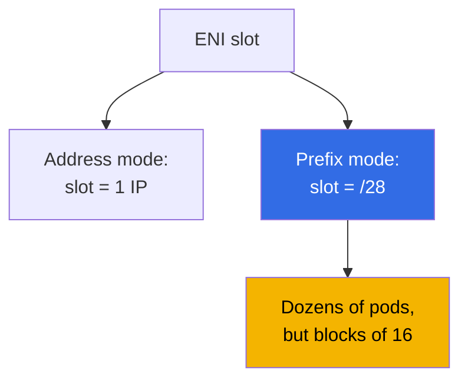
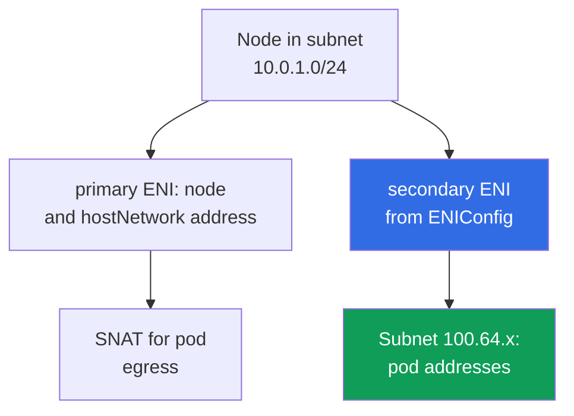

[Русская версия](ru.md) · [Versión en español](es.md) · [Version française](fr.md) · [Deutsche Version](de.md) · [ქართული ვერსია](ge.md) · [繁體中文版](tw.md) · [日本語版](jp.md)
# Chapter 7. Address-plan scale: prefix delegation, secondary CIDR, custom networking

> **What is next.** Chapter 6 explained how VPC CNI assigns real subnet addresses to pods and why they run out. This chapter covers the system-level ways out: prefix delegation, a VPC secondary CIDR, custom networking through `ENIConfig`, the rollout order in a live cluster, and operational changes. Alternative CNIs and Cilium are in Chapter 8, NetworkPolicy in Chapter 30, node density and sizing in Chapter 14, and network-failure analysis in Chapter 46. An IPv6 cluster is named as a separate path but not examined in detail: `ipFamily` is set only at creation time (Chapter 4).

## 7.1. Three answers to “the subnet is exhausted and cannot be expanded”

The Chapter 6 situation at its worst: node subnets are `/24`, `AvailableIpAddressCount` in a working AZ approaches zero, and a release hits `FailedCreatePodSandBox`. You cannot expand `/24` to `/22`, but the cluster must keep growing.

- **Fit more pods onto a node using the same addresses** - prefix delegation: an ENI slot is assigned a `/28` block. It is inexpensive, but **does not add addresses to the subnet** and consumes them in large chunks.
- **Bring new address space into the VPC** - secondary CIDR: associate a range, create subnets, and allocate pod addresses from them. The range must be propagated through routing, NAT, and connected networks.
- **Move away from IPv4 scarcity as a class of problem** - an IPv6 cluster (Section 7.9) or an overlay CNI (Chapter 8), but only in a new cluster.

The first two answers are usually combined. A criteria-based comparison is in Section 7.6.

## 7.2. Prefix delegation: an ENI slot is assigned a /28 block

In the regular mode, VPC CNI uses an ENI slot for one secondary IPv4 address, while the number of slots is set by the instance type (Chapter 6). Prefix delegation changes what the slot contains: instead of an address, it receives **a `/28` prefix, that is, 16 addresses**.



```bash
kubectl set env daemonset aws-node -n kube-system ENABLE_PREFIX_DELEGATION=true
aws eks update-addon --cluster-name demo --addon-name vpc-cni \
  --configuration-values '{"env":{"ENABLE_PREFIX_DELEGATION":"true","WARM_PREFIX_TARGET":"1"}}' \
  --resolve-conflicts PRESERVE
```

The first command is suitable for a self-installed CNI. **If VPC CNI is installed as a managed addon, a change through `kubectl set env` lasts only until the next addon update**, so variables are configured through its configuration, as in the second command. This applies to every variable in this chapter (Chapter 37).

**Only Nitro-based instances support prefixes on network interfaces**: the rest continue taking secondary addresses one at a time, so nodes in a mixed node group behave differently. For large fleets, this mode has another benefit: **fewer EC2 API calls**, because one request provides 16 addresses, and attaching a prefix to an existing ENI is faster than creating a new one.

Every slot other than the address occupied by the interface itself supplies 16 addresses, so the pod ceiling is calculated with different numbers.

| Instance | ENI | IPs per ENI | Address mode | Prefix mode | Managed node group cap |
|---|---|---|---|---|---|
| `m5.large` | 3 | 10 | 29 | 434 | 110 |
| `m5.xlarge` | 4 | 15 | 58 | 898 | 110 |
| `m5.8xlarge` | 8 | 30 | 234 | 3714 | 250 |

**Managed node groups cap `maxPods` independently of prefix delegation: 110 for instances below 30 vCPUs and 250 for the rest.** Enabling the variable does not raise that ceiling: exceeding it requires your own AMI in a launch template with `maxPods` in user data (Chapter 10), or a self-managed node group. The reason is backward compatibility: the default `max-pods` table is calculated for address mode, so user data passes `--use-max-pods false` together with an explicit `--max-pods`, while the value itself is calculated by `max-pods-calculator.sh` with the `--cni-prefix-delegation-enabled` flag. Most importantly, **`kubelet` learns `max-pods` at startup**, so a node from address mode retains its old value. Prefix delegation is for new nodes.

The other part of the cost is fragmentation. A prefix needs **a contiguous block of 16 addresses**, and where secondary addresses are scattered throughout a subnet, there may be many free addresses but no contiguous blocks: `AvailableIpAddressCount` shows hundreds of addresses, pods do not start, and ipamd logs show `InsufficientCidrBlocks`. Fix it with a new subnet or a **subnet CIDR reservation**.

```bash
aws ec2 create-subnet-cidr-reservation --subnet-id subnet-0123456789abcdef0 \
  --reservation-type prefix --cidr 10.0.1.128/25
aws ec2 describe-network-interfaces \
  --filters Name=attachment.instance-id,Values=i-0123456789abcdef0 \
  --query 'NetworkInterfaces[].[NetworkInterfaceId,Ipv4Prefixes[].Ipv4Prefix]' --output text
```

Addresses are allocated **in blocks of 16**: three nodes with one pod each consume 48 addresses rather than three. The rule is: prefix delegation improves pod density and API calls, not address scarcity, and when addresses are scarce it is enabled together with new space.

## 7.3. The warm pool in prefix mode

The reserve logic is the same as in Chapter 6, but the unit of measurement differs.

| Environment variable | What it keeps in reserve | Priority |
|---|---|---|
| `WARM_PREFIX_TARGET` | whole `/28` prefixes beyond current demand | baseline for prefix mode |
| `WARM_IP_TARGET` | individual addresses beyond current demand | overrides `WARM_PREFIX_TARGET` |
| `MINIMUM_IP_TARGET` | the lower address boundary on a node | overrides `WARM_PREFIX_TARGET` |

**`WARM_IP_TARGET` and `MINIMUM_IP_TARGET` apply in prefix mode and take priority over `WARM_PREFIX_TARGET`.** `WARM_PREFIX_TARGET=1` keeps one entire additional prefix, up to 16 unused addresses per node, whereas a `WARM_IP_TARGET` below 16 avoids attaching a whole extra prefix and saves addresses at the price of more frequent EC2 API calls.

```bash
kubectl set env ds aws-node -n kube-system WARM_PREFIX_TARGET=1
kubectl set env ds aws-node -n kube-system WARM_IP_TARGET=8 MINIMUM_IP_TARGET=16
```

In wide subnets, keep `WARM_PREFIX_TARGET=1` and fast pod startup; in narrow ones, add the `WARM_IP_TARGET` and `MINIMUM_IP_TARGET` pair. Setting all three without understanding priority is a way to get inexplicable behavior.

## 7.4. Secondary CIDR: new address space in an existing VPC

Additional IPv4 blocks are associated with a VPC, and subnets are created in them. Existing subnets and nodes are unaffected, while the `local` route is added automatically.

```bash
vpc_id=$(aws eks describe-cluster --name demo \
  --query 'cluster.resourcesVpcConfig.vpcId' --output text)
aws ec2 associate-vpc-cidr-block --vpc-id $vpc_id --cidr-block 100.64.0.0/16
aws ec2 describe-vpcs --vpc-ids $vpc_id --output table \
  --query 'Vpcs[].CidrBlockAssociationSet[].{CIDR:CidrBlock,State:CidrBlockState.State}'
aws ec2 create-subnet --vpc-id $vpc_id --availability-zone eu-central-1a \
  --cidr-block 100.64.0.0/19 --query Subnet.SubnetId --output text
```

The block is usable only in the `associated` state. Creating subnets earlier is premature.

**Why `100.64.0.0/10` is used.** It is shared address space from RFC 6598 for CG-NAT. Formally, it is not a private RFC 1918 range, so **it is almost never already occupied in corporate networks**. There is also a technical reason: a VPC whose primary CIDR is from `10.0.0.0/8` **cannot** add a block from `172.16.0.0/12` or `192.168.0.0/16`, but it can add one from `100.64.0.0/10`.

- **New subnets inherit the main route table**: connectivity inside the VPC works, but internet egress must be configured explicitly. A pod in `100.64.x` needs a route to the NAT gateway that resides in a subnet of the primary range (Chapter 31).
- **Connected networks may not know the range**: peering, Transit Gateway, VPN, and Direct Connect do not begin routing `100.64.0.0/16` on their own. Often that is the goal: pod addresses are not routable externally.
- **Size and quotas**: blocks range from `/16` to `/28`; overlap with existing blocks and CIDRs of peered VPCs is not allowed.

The simplest way to use the new space is to **create a node group in the new subnets**: both nodes and pods receive addresses from `100.64.x` without a single variable on `aws-node`.

## 7.5. Custom networking: pod addresses from separate subnets

By default, secondary ENIs are created in the subnet of the node primary ENI. Custom networking breaks that connection: **secondary ENIs are created in the subnet and with the security groups from an `ENIConfig` object**, pod addresses are allocated from there, and the subnets must be in the same VPC and AZ as the node.



The required steps are one `ENIConfig` object per AZ, followed by two variables on `aws-node`. `ENIConfig` sets `spec.subnet` and `spec.securityGroups` (usually the cluster security group), and its object name is made equal to the zone name when there is one pod subnet in that zone.

```yaml
apiVersion: crd.k8s.amazonaws.com/v1alpha1
kind: ENIConfig
metadata:
  name: eu-central-1a          # name = zone name when one subnet per AZ
spec:
  subnet: subnet-0123456789abcdef0   # 100.64.x subnet in the same AZ
  securityGroups:
    - sg-0123456789abcdef0           # cluster security group
```

Apply one object for every AZ with nodes, changing the name and `subnet`, and only then enable the variables. Otherwise, a node in an AZ without `ENIConfig` cannot assign addresses to pods.

It is important not to confuse two mechanisms. `spec.securityGroups` in `ENIConfig` are groups for secondary ENIs, meaning **all pods on that node** that use this `ENIConfig`: the granularity is zonal, not per-pod. If an SG is required for a particular pod or a selector-defined group of pods, that is a different mechanism: security groups for pods, where a `SecurityGroupPolicy` resource associates an SG list by selector, and VPC CNI gives those pods a separate branch ENI (details and common failures are in Chapter 46). In prefix mode without `SecurityGroupPolicy`, pods share the node security group.

```bash
kubectl set env daemonset aws-node -n kube-system AWS_VPC_K8S_CNI_CUSTOM_NETWORK_CFG=true
kubectl set env daemonset aws-node -n kube-system ENI_CONFIG_LABEL_DEF=topology.kubernetes.io/zone
kubectl get eniconfigs
```

`ENI_CONFIG_LABEL_DEF=topology.kubernetes.io/zone` enables automatic selection: a node reads its zone label and takes the `ENIConfig` with the same name. If there are several pod subnets in a zone, nodes must be labelled with the `k8s.amazonaws.com/eniConfig` annotation.

- **The node primary ENI does not allocate pod addresses**, so the effective `max-pods` falls: the formula loses a whole interface, making it 20 pods rather than 29 for `m5.large`. Prefixes compensate: `(3 - 1) * (10 - 1) * 16 + 2` yields 290.
- **Existing nodes do not change behavior**: the mode works only on nodes brought up after variables are enabled, so the fleet must be recreated (Section 7.7). It is incompatible with IPv6.
- **Egress uses the primary ENI by default**: with `AWS_VPC_K8S_CNI_EXTERNALSNAT=false`, traffic to addresses outside your VPC CIDR leaves using the primary ENI subnet and security groups, not those in `ENIConfig`. Pods with `hostNetwork: true` also remain on the node address.
- **Diagnosis becomes harder**: node and pod addresses come from different ranges, security groups can differ, and answering “why could the pod not connect” requires seeing which ENI the packet used (Section 7.8).

**When SNAT is removed.** You can take the same egress out from under node-level SNAT: with `AWS_VPC_K8S_CNI_EXTERNALSNAT=true`, the masquerade rule is not installed, and packets to addresses outside the VPC CIDR leave with the real pod address rather than being replaced with the node primary address. This is needed in two cases: a pod reaches a data center, peered VPC, or VPN through its own NAT gateway, Transit Gateway, or Direct Connect and the other side must see the pod address; or an external resource must initiate a connection to a pod. The cost is that connected networks must route the pod range, and direct internet egress through an internet gateway stops working with `true` - a route to a NAT gateway is required (Chapter 31).

There is a simpler tool. **Enhanced subnet discovery**: VPC CNI `1.18.0` and later, by default (`ENABLE_SUBNET_DISCOVERY=true`), automatically finds subnets in its VPC and AZ tagged `kubernetes.io/role/cni=1` (`aws ec2 create-tags --resources <subnet-id> --tags Key=kubernetes.io/role/cni,Value=1`). Pods receive addresses from new subnets **without `ENIConfig` and without losing the primary ENI**, hence without a `max-pods` penalty. Custom networking is for security-group and isolation requirements and takes priority if both mechanisms are enabled.

## 7.6. How to choose

| Criterion | Prefix delegation | Secondary CIDR plus node group | Custom networking | Subnet tag `cni=1` | IPv6 cluster |
|---|---|---|---|---|---|
| Deployment complexity | low | medium | high | low | new cluster only |
| Provides new addresses | no | yes | yes | yes | yes |
| Effect on `max-pods` | higher, up to the cap | none | lower, minus an ENI | none | higher, prefixes |
| Node recreation | yes, for new `max-pods` | yes, new subnets | yes, required | no | yes |
| Pod addresses in connected networks | as before | only with routes | only with routes | depends on subnet | through IPv6 routes |
| Custom security groups for pods | no | no | yes | no | no |
| Requirements | Nitro | VPC CIDR quota | `ENIConfig` per AZ | VPC CNI `1.18.0`+ | Nitro, new cluster |

If subnets are wide but pods do not fit on a node, use prefix delegation and do not add complexity. If addresses are exhausted, use a secondary CIDR, then choose between a new node group, a subnet tag, and custom networking, which is chosen for isolation requirements rather than addresses. IPv6 belongs at cluster creation.

## 7.7. Rollout order in a live cluster without downtime

All three mechanisms share one property: **they change behavior only on new nodes**.

1. **Prepare addresses.** Associate a secondary CIDR, create one subnet per AZ and routing tables, and create a subnet CIDR reservation if needed.
2. **Change the CNI configuration** through the managed addon configuration (Chapter 37). For custom networking, first apply `ENIConfig` in every zone, and only then enable `AWS_VPC_K8S_CNI_CUSTOM_NETWORK_CFG`.
3. **Create a new node group** in the required subnets, on Nitro instances, with `maxPods` in user data if a ceiling above the cap is required. Verify pod addresses on new nodes.
4. **Move workloads.** Cordon and drain old nodes one at a time while considering PDBs (Chapter 40), then remove the old node group. Rolling replacement is not recommended for a prefix transition: a node with a mixture of addresses and prefixes reports capacity inconsistently.

Check at every step rather than only at the end:

```bash
kubectl get nodes -o custom-columns='NODE:.metadata.name,PODS:.status.allocatable.pods'
kubectl get pods -A -o wide | grep -c ' 100\.64\.'
kubectl get eniconfigs -o custom-columns='NAME:.metadata.name,SUBNET:.spec.subnet'
```

The commands show whether `max-pods` increased on new nodes, whether pod addresses come from the new range, and whether there is an `ENIConfig` for every zone with nodes. A node in a zone without `ENIConfig` cannot issue pod addresses, and the symptom is the same `FailedCreatePodSandBox`, only with a non-full subnet.

## 7.8. Operations after rollout

Monitoring remaining addresses becomes more precise: count by every subnet and AZ, and in prefix mode watch not only the remaining count but also whether contiguous blocks exist.

```bash
aws ec2 describe-subnets --filters Name=vpc-id,Values=vpc-0123456789abcdef0 --output table \
  --query 'Subnets[].[SubnetId,AvailabilityZone,CidrBlock,AvailableIpAddressCount]'
aws ec2 describe-network-interfaces --filters Name=vpc-id,Values=vpc-0123456789abcdef0 \
  --query 'NetworkInterfaces[].[NetworkInterfaceId,SubnetId,length(Ipv4Prefixes)]' --output text
```

The main diagnostic change is that a pod address no longer reveals the node subnet, and the investigation order is now: node, its ENI, that ENI's subnet, and the subnet security groups.

- **Old nodes without prefixes.** Part of the fleet retains the prior `max-pods`, and pods distribute unevenly. Fix it by replacing nodes, not by changing variables.
- **The addon overwrote variables.** A managed addon update restored its values, and new nodes started in address mode. Check after every update.
- **`ENIConfig` is not present in every AZ.** The cluster worked until Karpenter created a node in a fourth zone. A related problem is an `ENIConfig` that points at an exhausted subnet: the shortage returns.
- **Fragmentation rather than shortage**: many addresses remain but logs show `InsufficientCidrBlocks`. **Mixed instance types**: a non-Nitro instance does not get prefixes, and the lowest `max-pods` in a group applies to all its nodes.
- **A wide list of Karpenter instance types.** This is a distinct instance of the same trap: a spot pool with broad requirements can include old non-Nitro families (`t2`, `m4`, `c4`), and such nodes start in address mode with noticeably lower density than the rest of the pool. The fleet looks homogeneous, but pods distribute unevenly. Fix it by narrowing NodePool requirements: the `karpenter.k8s.aws/instance-hypervisor` label with value `nitro`, or excluding old generations through `karpenter.k8s.aws/instance-generation` (Chapters 12 and 13).

## 7.9. IPv6 cluster: an overview of the radical option

In a cluster with `ipFamily: ipv6`, pods and Services receive IPv6 addresses, and VPC CNI operates with `/80` prefixes. Scarcity is almost completely eliminated. The cost has three parts.

- **Only at cluster creation.** `ipFamily` cannot change, EKS does not support dual-stack for pods and Services, and custom networking is incompatible with IPv6. The transition requires a new cluster and workload migration (Chapters 4 and 38).
- **Application compatibility.** Address literals in configuration, libraries, agents, and external systems must all support IPv6. Nitro is mandatory, and Windows nodes are unsupported.
- **IPv4 egress.** A pod receives an IPv6 address and also a host-local IPv4 address, invisible to the control plane. When it contacts an IPv4 resource, NAT on the node itself uses SNAT to the node primary IPv4 address, and **this built-in mechanism removes the need for DNS64 and NAT64** on the VPC side.

In short, IPv6 is a good answer to “how should we build the next cluster?” and a bad answer to “what should we do with this one on Friday?”.

## 7.10. How this is used in production

- **Enable prefix delegation on new clusters by default** together with `WARM_PREFIX_TARGET` and Nitro instances: it is cheaper than returning to the topic under load.
- **Allocate pod subnets from `100.64.0.0/10`** when designing the VPC: non-routable pod space leaves RFC 1918 for load balancers and NAT.
- **Keep VPC CNI variables in managed addon configuration and Terraform code**, not in a live DaemonSet: a `kubectl set env` change lasts only to the next addon update.
- **Alert on remaining addresses in every subnet and AZ**, and in prefix mode add an alert for `InsufficientCidrBlocks` in `aws-node` logs.

## 7.11. Mini glossary

- **Prefix delegation** - a mode where an ENI slot holds a `/28` prefix (16 addresses); enabled with `ENABLE_PREFIX_DELEGATION` and requires Nitro. **`WARM_PREFIX_TARGET`** is the prefix reserve on a node; `WARM_IP_TARGET` and `MINIMUM_IP_TARGET` take priority over it.
- **Subnet CIDR reservation** - reservation of a contiguous subnet block for prefixes. **`InsufficientCidrBlocks`** - an EC2 API error about missing contiguous blocks despite formally free addresses.
- **Secondary CIDR** - an additional IPv4 block on a VPC; for EKS, usually from `100.64.0.0/10` (RFC 6598). **Custom networking** - a mode where secondary ENIs and pod addresses are taken from a subnet and the security groups of an **`ENIConfig`** object, one per AZ, selected by the label in `ENI_CONFIG_LABEL_DEF`. **Enhanced subnet discovery** - subnets tagged `kubernetes.io/role/cni=1` without `ENIConfig`. **`AWS_VPC_K8S_CNI_EXTERNALSNAT`** removes node-level pod egress SNAT (`true`) so the external side sees the real pod address; internet egress then goes only through a NAT gateway. **`ipFamily`** is the cluster address family and is set only at creation.

## 7.12. Chapter summary

- A subnet cannot be expanded, so there are three exits: more addresses per ENI slot, new VPC address space, or leaving IPv4. The first two are often used together.
- Prefix delegation is enabled with `ENABLE_PREFIX_DELEGATION=true` on `aws-node`, requires Nitro, and saves EC2 API calls. But managed node groups retain the 110 and 250 caps regardless of prefixes, `max-pods` is fixed at node startup, and addresses are allocated in blocks of 16, fragmenting the subnet.
- `WARM_PREFIX_TARGET` sets the reserve, but `WARM_IP_TARGET` and `MINIMUM_IP_TARGET` also apply and override it, allowing you not to retain an entire extra prefix.
- A secondary CIDR from `100.64.0.0/10` does not overlap corporate networks and is allowed where RFC 1918 blocks are prohibited, but it requires attention to routing and NAT.
- Custom networking through `ENIConfig` gives pods separate subnets and security groups, but removes the primary ENI from address allocation, reduces `max-pods`, and requires node recreation. A simpler route is a node group in new subnets or the `kubernetes.io/role/cni=1` tag.
- Every change applies only to new nodes: first addresses and configuration, then a new node group, then draining old nodes. IPv6 removes scarcity completely but is chosen only at cluster creation and carries application compatibility and IPv4 egress considerations.

## 7.13. How this helps in real work

Address scarcity arrives without warning and immediately appears as “the release will not roll out”. The difference between an engineer with a plan and one without is measured in hours of downtime: the first knows that prefix delegation raises density but does not add addresses, that a secondary CIDR can be associated in a minute while routes and NAT take longer, and that the change reaches the cluster only with new nodes. In calm periods, this informs design: pod subnets separate from nodes, prefixes from day one, and CNI variables in addon configuration in Git.

## 7.14. Self-check questions

1. Why does prefix delegation not solve an exhausted subnet, and why can it sometimes make it worse?
2. You enabled `ENABLE_PREFIX_DELEGATION=true`, but `allocatable.pods` did not change. What are two reasons?
3. What are the instance-type requirements of prefix mode, and why is this dangerous in a mixed group?
4. There are 400 addresses remaining in a subnet, but `aws-node` logs show `InsufficientCidrBlocks`. What should you do?
5. How do `WARM_PREFIX_TARGET`, `WARM_IP_TARGET`, and `MINIMUM_IP_TARGET` relate to each other?
6. Why are pod addresses taken from `100.64.0.0/10` rather than a free block in `192.168.0.0/16`?
7. What must be done after `associate-vpc-cidr-block` so pods can reach the internet and a data center?
8. Which elements are mandatory for custom networking, and why is an `ENIConfig` created for every AZ?
9. How does `spec.securityGroups` in `ENIConfig` differ from `SecurityGroupPolicy` in scope?
10. Why does `max-pods` fall with custom networking, and how can it be compensated?
11. How does enhanced subnet discovery differ from custom networking, and when is it insufficient?
12. Describe the rollout order for prefix delegation in a live cluster without downtime.
13. What should be checked after a VPC CNI addon update, and why does IPv6 not save the current cluster?
14. When is `AWS_VPC_K8S_CNI_EXTERNALSNAT=true` enabled, and what breaks in egress when it is?

## Practice

The course lab for this topic is [lab 103 - Address planning: ENI limits, prefix delegation, secondary CIDR](../../labs/103/README.MD). Beyond it, verify the content on a live cluster. Start with the CNI operating mode:
`kubectl describe ds aws-node -n kube-system | grep -e PREFIX -e WARM_ -e CUSTOM_NETWORK -e
SUBNET_DISCOVERY`. Then check prefixes on a node interface through `aws ec2
describe-network-interfaces` with the `Name=attachment.instance-id` filter and the
`Ipv4Prefixes[].Ipv4Prefix` query: an empty prefix list with a non-empty secondary-address list
means regular address mode. Verify the pod ceiling with `kubectl get nodes -o
custom-columns='NODE:.metadata.name,PODS:.status.allocatable.pods'`: identical 110 values on different
types indicate the managed node group cap.

On a test cluster, walk through the complete path: associate `100.64.0.0/16` with `aws ec2
associate-vpc-cidr-block`, create one subnet per AZ through `aws ec2 create-subnet`, apply
`ENIConfig` in every zone, verify `kubectl get eniconfigs`, enable
`AWS_VPC_K8S_CNI_CUSTOM_NETWORK_CFG` and `ENI_CONFIG_LABEL_DEF`, create a new node group, and
confirm that new pods received addresses from `100.64.x` while old nodes keep working as before.
Also compare remaining addresses through `aws ec2 describe-subnets` with `AvailableIpAddressCount`.

---
[Table of contents](../README.md) · [Chapter 6](../06/en.md) · [Chapter 8](../08/en.md)
