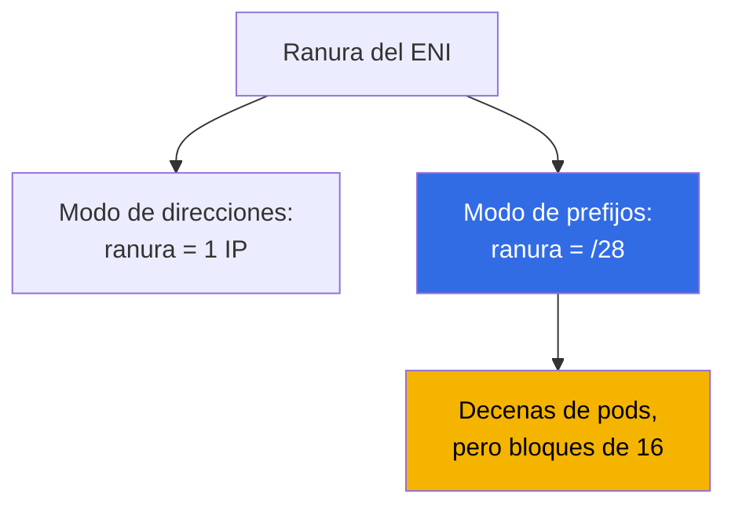
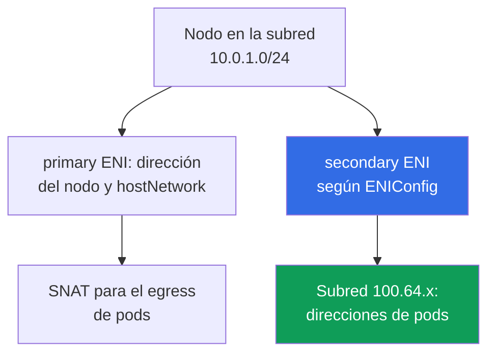

[Русская версия](ru.md) · [Eng version](en.md) · [Version française](fr.md) · [Deutsche Version](de.md) · [ქართული ვერსია](ge.md) · [繁體中文版](tw.md) · [日本語版](jp.md)
# Capítulo 7. Escala del plan de direccionamiento: prefix delegation, CIDR secundario y custom networking

> **Qué sigue.** El capítulo 6 explicó cómo VPC CNI asigna a los pods direcciones reales de la subred y por qué se agotan. Aquí se presentan las salidas sistémicas: prefix delegation, CIDR secundario en la VPC, custom networking mediante `ENIConfig`, el orden de adopción en un clúster activo y los cambios operativos. Los CNI alternativos y Cilium se tratan en el capítulo 8, NetworkPolicy en el capítulo 30, la densidad y el dimensionamiento de nodos en el capítulo 14, y el análisis de fallos de red en el capítulo 46. El clúster IPv6 se menciona como una ruta independiente, pero no se explica en detalle: `ipFamily` solo se establece durante la creación (capítulo 4).

## 7.1. Tres respuestas a «la subred se agotó y no se puede ampliar»

La situación del capítulo 6 en su peor forma: las subredes de nodos se tomaron como `/24`, `AvailableIpAddressCount` en la AZ activa se acerca a cero y el despliegue queda bloqueado en `FailedCreatePodSandBox`. No se puede ampliar `/24` a `/22`, pero el clúster debe seguir creciendo.

- **Obtener más pods de las mismas direcciones en el nodo** - prefix delegation: una ranura del ENI entrega un bloque `/28`. Es barato, pero **no añade direcciones a la subred** y las consume en bloques grandes.
- **Incorporar un nuevo espacio de direcciones a la VPC** - CIDR secundario: asociar un rango, crear subredes y entregar las direcciones a los pods. El rango debe pasar por el enrutamiento, NAT y las redes conectadas.
- **Abandonar la escasez de IPv4 como categoría** - clúster IPv6 (sección 7.9) u overlay-CNI (capítulo 8), pero solo en un clúster nuevo.

Las dos primeras respuestas normalmente se combinan; la comparación por criterios está en la sección 7.6.

## 7.2. Prefix delegation: una ranura del ENI entrega un bloque /28

En el modo normal, VPC CNI ocupa una ranura de un ENI con una dirección IPv4 secundaria, y el número de ranuras lo determina el tipo de instancia (capítulo 6). Prefix delegation cambia el contenido de la ranura: en vez de una dirección, contiene un **prefijo `/28`, es decir, 16 direcciones**.



```bash
kubectl set env daemonset aws-node -n kube-system ENABLE_PREFIX_DELEGATION=true
aws eks update-addon --cluster-name demo --addon-name vpc-cni \
  --configuration-values '{"env":{"ENABLE_PREFIX_DELEGATION":"true","WARM_PREFIX_TARGET":"1"}}' \
  --resolve-conflicts PRESERVE
```

El primer comando sirve para un CNI instalado de forma independiente. **Si VPC CNI está instalado como managed addon, el cambio mediante `kubectl set env` persiste hasta la siguiente actualización del addon**, por eso las variables se establecen mediante su configuración, como en el segundo comando. Esto se aplica a todas las variables del capítulo (capítulo 37).

**Los prefijos en las interfaces de red solo son compatibles con instancias basadas en Nitro**: las demás seguirán tomando direcciones secundarias de una en una, y en un node group mixto el comportamiento de los nodos será diferente. La ventaja del modo para flotas grandes es que **hay menos llamadas a la API de EC2**: una solicitud aporta 16 direcciones y asociar un prefijo a un ENI listo es más rápido que crear uno nuevo.

Cada ranura, salvo la ocupada por la dirección de la propia interfaz, aporta 16 direcciones, y el límite de pods se calcula con números diferentes.

| Instancia | ENI | IP por ENI | Modo de direcciones | Modo de prefijos | Límite de managed node group |
|---|---|---|---|---|---|
| `m5.large` | 3 | 10 | 29 | 434 | 110 |
| `m5.xlarge` | 4 | 15 | 58 | 898 | 110 |
| `m5.8xlarge` | 8 | 30 | 234 | 3714 | 250 |

**Managed node groups limitan `maxPods` desde arriba independientemente de prefix delegation: 110 para instancias de menos de 30 vCPU y 250 para las demás.** Activar la variable no elevará el límite: solo una AMI propia en un launch template con `maxPods` en los user data (capítulo 10) o un self-managed node group puede dar más. La razón es la compatibilidad hacia atrás: la tabla `max-pods` predeterminada está calculada para el modo de direcciones, por lo que en los user data se pasa `--use-max-pods false` junto con un `--max-pods` explícito, y el valor se calcula con el script `max-pods-calculator.sh` y el flag `--cni-prefix-delegation-enabled`. Y lo más importante: **`kubelet` conoce `max-pods` al iniciar**, de modo que un nodo creado en modo de direcciones mantendrá su valor anterior; prefix delegation es para nodos nuevos.

La segunda parte del coste es la fragmentación. Un prefijo requiere un **bloque contiguo de 16 direcciones** y, donde las direcciones secundarias están dispersas por la subred, puede haber muchas direcciones libres pero no bloques contiguos: `AvailableIpAddressCount` muestra cientos de direcciones, los pods no arrancan y los logs de ipamd muestran `InsufficientCidrBlocks`. Se resuelve con una subred nueva o una **subnet CIDR reservation**.

```bash
aws ec2 create-subnet-cidr-reservation --subnet-id subnet-0123456789abcdef0 \
  --reservation-type prefix --cidr 10.0.1.128/25
aws ec2 describe-network-interfaces \
  --filters Name=attachment.instance-id,Values=i-0123456789abcdef0 \
  --query 'NetworkInterfaces[].[NetworkInterfaceId,Ipv4Prefixes[].Ipv4Prefix]' --output text
```

Las direcciones se consumen **en bloques de 16**: tres nodos con un pod cada uno ocuparon 48 direcciones en vez de tres. La regla es que prefix delegation mejora la densidad de pods y las llamadas a la API, no la escasez de direcciones, y cuando hay escasez se activa junto con un espacio nuevo.

## 7.3. Pool warm en modo de prefijos

La lógica de reserva es la misma que en el capítulo 6, pero cambia la unidad de medida.

| Variable de entorno | Qué mantiene en reserva | Prioridad |
|---|---|---|
| `WARM_PREFIX_TARGET` | prefijos `/28` completos por encima de la necesidad actual | base para el modo de prefijos |
| `WARM_IP_TARGET` | direcciones individuales por encima de la necesidad actual | anula `WARM_PREFIX_TARGET` |
| `MINIMUM_IP_TARGET` | límite inferior de direcciones en el nodo | anula `WARM_PREFIX_TARGET` |

**`WARM_IP_TARGET` y `MINIMUM_IP_TARGET` se aplican en modo de prefijos y tienen prioridad sobre `WARM_PREFIX_TARGET`.** `WARM_PREFIX_TARGET=1` mantiene un prefijo completo adicional, hasta 16 direcciones sin usar por nodo; en cambio, un `WARM_IP_TARGET` menor que 16 evita asociar un prefijo adicional completo y ahorra direcciones a costa de llamadas más frecuentes a la API de EC2.

```bash
kubectl set env ds aws-node -n kube-system WARM_PREFIX_TARGET=1
kubectl set env ds aws-node -n kube-system WARM_IP_TARGET=8 MINIMUM_IP_TARGET=16
```

En subredes amplias se deja `WARM_PREFIX_TARGET=1` para lograr un arranque rápido de pods; en las estrechas se añade el par `WARM_IP_TARGET` y `MINIMUM_IP_TARGET`. Configurar las tres sin entender la prioridad es una forma de obtener un comportamiento inexplicable.

## 7.4. CIDR secundario: nuevo espacio de direcciones en una VPC existente

A la VPC se le asocian bloques IPv4 adicionales y se crean subredes en ellos. Las subredes y los nodos existentes no se modifican, y la ruta `local` se añade automáticamente.

```bash
vpc_id=$(aws eks describe-cluster --name demo \
  --query 'cluster.resourcesVpcConfig.vpcId' --output text)
aws ec2 associate-vpc-cidr-block --vpc-id $vpc_id --cidr-block 100.64.0.0/16
aws ec2 describe-vpcs --vpc-ids $vpc_id --output table \
  --query 'Vpcs[].CidrBlockAssociationSet[].{CIDR:CidrBlock,State:CidrBlockState.State}'
aws ec2 create-subnet --vpc-id $vpc_id --availability-zone eu-central-1a \
  --cidr-block 100.64.0.0/19 --query Subnet.SubnetId --output text
```

El bloque solo se puede usar cuando está en el estado `associated`; antes de eso es demasiado pronto para crear subredes.

**Por qué se usa `100.64.0.0/10`.** Es el shared address space de RFC 6598 para CG-NAT. Formalmente no es un rango privado RFC 1918 y, por eso, **casi nunca está ocupado en las redes corporativas**. También hay una razón técnica: a una VPC con un CIDR principal de `10.0.0.0/8` **no se le puede añadir** un bloque de `172.16.0.0/12` ni de `192.168.0.0/16`, pero sí uno de `100.64.0.0/10`.

- **Las subredes nuevas heredan la main route table**: habrá conectividad dentro de la VPC, pero la salida a Internet debe configurarse explícitamente. Un pod en `100.64.x` necesita una ruta hacia el NAT gateway que vive en una subred del rango principal (capítulo 31).
- **Las redes conectadas pueden no conocer el rango**: peering, Transit Gateway, VPN y Direct Connect no empezarán a enrutar `100.64.0.0/16` por sí mismos. A menudo este es justamente el objetivo: que las direcciones de los pods no sean enrutable desde fuera.
- **Tamaño y cuotas**: se permiten bloques de `/16` a `/28`; no se admiten solapamientos con los bloques existentes ni con los CIDR de VPC con peering.

La forma más sencilla de aprovechar el espacio nuevo es **crear un node group en las subredes nuevas**: tanto los nodos como los pods recibirán direcciones de `100.64.x` sin una sola variable en `aws-node`.

## 7.5. Custom networking: direcciones de pods desde subredes independientes

De forma predeterminada, los ENI secundarios se crean en la subred del ENI principal del nodo. Custom networking rompe esta relación: **los ENI secundarios se crean en la subred y con los security groups del objeto `ENIConfig`**, las direcciones de los pods provienen de allí y las subredes deben estar en la misma VPC y la misma AZ que el nodo.



Los pasos obligatorios son un objeto `ENIConfig` por cada AZ y, después, dos variables en `aws-node`. En `ENIConfig` se establecen `spec.subnet` y `spec.securityGroups` (normalmente el cluster security group), y el nombre del objeto se hace igual al nombre de la zona si hay una subred para pods en esa zona.

```yaml
apiVersion: crd.k8s.amazonaws.com/v1alpha1
kind: ENIConfig
metadata:
  name: eu-central-1a          # nombre = nombre de la zona con una subnet por AZ
spec:
  subnet: subnet-0123456789abcdef0   # subnet 100.64.x en la misma AZ
  securityGroups:
    - sg-0123456789abcdef0           # cluster security group
```

El objeto se aplica uno por cada AZ con nodos, cambiando el nombre y la `subnet`, y solo entonces se activan las variables; de lo contrario, un nodo en una zona sin `ENIConfig` no asignará direcciones a los pods.

Es importante no confundir los dos mecanismos. `spec.securityGroups` en `ENIConfig` son los grupos para ENI secundarios, es decir, **para todos los pods de ese nodo** que toman ese `ENIConfig`: la granularidad aquí es zonal, no por pod. Si un pod concreto o un conjunto de pods según un selector necesita un SG, se trata de otro mecanismo: security groups for pods. El recurso `SecurityGroupPolicy` asocia una lista de SG mediante un selector, y VPC CNI entrega a esos pods una branch ENI independiente (el análisis y los fallos típicos se tratan en el capítulo 46). En modo de prefijos, sin `SecurityGroupPolicy`, los pods comparten el security group del nodo.

```bash
kubectl set env daemonset aws-node -n kube-system AWS_VPC_K8S_CNI_CUSTOM_NETWORK_CFG=true
kubectl set env daemonset aws-node -n kube-system ENI_CONFIG_LABEL_DEF=topology.kubernetes.io/zone
kubectl get eniconfigs
```

`ENI_CONFIG_LABEL_DEF=topology.kubernetes.io/zone` activa la selección automática: el nodo lee la etiqueta de zona y toma el `ENIConfig` con el mismo nombre. Si hay varias subredes para pods en una zona, los nodos deberán etiquetarse con la anotación `k8s.amazonaws.com/eniConfig`.

- **El ENI principal del nodo no participa en la asignación de direcciones a los pods**, por lo que el `max-pods` efectivo disminuye: un interfaz completo desaparece de la fórmula, y para `m5.large` son 20 pods en vez de 29. Se compensa con prefijos: `(3 - 1) * (10 - 1) * 16 + 2` da 290.
- **Los nodos existentes no cambian de comportamiento**: el modo solo funciona en nodos creados después de activar las variables, por lo que hay que recrear la flota (sección 7.7). Es incompatible con IPv6.
- **El egress predeterminado pasa por el ENI principal**: con `AWS_VPC_K8S_CNI_EXTERNALSNAT=false`, el tráfico hacia direcciones fuera del CIDR de su VPC sale con la subred y los security groups del ENI principal, no con los de `ENIConfig`. Los pods con `hostNetwork: true` también permanecen en la dirección del nodo.
- **El diagnóstico se complica**: las direcciones del nodo y sus pods provienen de rangos diferentes, los security groups pueden ser distintos y para entender por qué un pod no llega a un destino hay que observar por qué ENI salió el paquete (sección 7.8).

**Cuándo se elimina SNAT.** El mismo egress puede salir sin el SNAT del nodo: con `AWS_VPC_K8S_CNI_EXTERNALSNAT=true` no se instala la regla de enmascaramiento y un paquete hacia direcciones fuera del CIDR de la VPC sale con la dirección real del pod, no se sustituye por la dirección principal del nodo. Se necesita en dos casos: un pod accede al centro de datos, una VPC con peering o una VPN mediante su NAT gateway, Transit Gateway o Direct Connect, y el otro lado debe ver la dirección del pod; o un recurso externo debe iniciar por sí mismo una conexión al pod. El coste es que las redes conectadas deben enrutar el rango de los pods, y la salida directa a Internet por un internet gateway deja de funcionar con `true` - se necesita una ruta a un NAT gateway (capítulo 31).

Hay una herramienta más sencilla. **Enhanced subnet discovery**: VPC CNI `1.18.0` y posteriores, de forma predeterminada (`ENABLE_SUBNET_DISCOVERY=true`), encuentran por sí mismos las subredes de su VPC y AZ con la etiqueta `kubernetes.io/role/cni=1` (`aws ec2 create-tags --resources <subnet-id> --tags Key=kubernetes.io/role/cni,Value=1`). Los pods reciben direcciones de las nuevas subredes **sin `ENIConfig` y sin perder el ENI principal**, es decir, sin una penalización de `max-pods`. Custom networking se necesita por requisitos de security groups y aislamiento, y tiene prioridad si ambos mecanismos están activados.

## 7.6. Cómo elegir

| Criterio | Prefix delegation | CIDR secundario más node group | Custom networking | Etiqueta de subred `cni=1` | Clúster IPv6 |
|---|---|---|---|---|---|
| Complejidad de adopción | baja | media | alta | baja | solo clúster nuevo |
| Aporta direcciones nuevas | no | sí | sí | sí | sí |
| Efecto sobre `max-pods` | aumenta, hasta el límite | ninguno | disminuye, menos un ENI | ninguno | aumenta, prefijos |
| Recreación de nodos | sí, para el nuevo `max-pods` | sí, subredes nuevas | sí, obligatoria | no | sí |
| Direcciones de pods en redes conectadas | como antes | solo con rutas | solo con rutas | depende de la subred | mediante rutas IPv6 |
| Security groups propios para pods | no | no | sí | no | no |
| Requisitos | Nitro | cuota de CIDR de la VPC | `ENIConfig` para cada AZ | VPC CNI `1.18.0`+ | Nitro, clúster nuevo |

Las subredes son amplias pero los pods no caben en el nodo: use prefix delegation sin complicar el diseño. Se agotaron las direcciones: CIDR secundario, y después elija entre un nuevo node group, la etiqueta de subred y custom networking, que se adopta por requisitos de aislamiento, no por direcciones; IPv6 se elige al iniciar el clúster.

## 7.7. Orden de adopción en un clúster activo sin tiempo de inactividad

Los tres mecanismos tienen una propiedad común: **solo cambian el comportamiento de los nodos nuevos**.

1. **Preparar las direcciones.** Asociar un CIDR secundario, crear una subred por AZ y las tablas de enrutamiento, y crear una subnet CIDR reservation si es necesaria.
2. **Cambiar la configuración del CNI** mediante la configuración del managed addon (capítulo 37). Para custom networking, primero aplicar `ENIConfig` en todas las zonas y solo después activar `AWS_VPC_K8S_CNI_CUSTOM_NETWORK_CFG`.
3. **Crear un node group nuevo** en las subredes necesarias, con instancias Nitro y `maxPods` en los user data si se necesita un límite superior al máximo. Verificar las direcciones de los pods en los nodos nuevos.
4. **Migrar la carga.** Hacer cordon y drain de los nodos antiguos uno a uno, teniendo en cuenta los PDB (capítulo 40), y después eliminar el node group antiguo. No se recomienda el rolling replacement para pasar a prefijos: un nodo con una mezcla de direcciones y prefijos anuncia su capacidad de forma inconsistente.

Hay que comprobar en cada paso, no al final:

```bash
kubectl get nodes -o custom-columns='NODE:.metadata.name,PODS:.status.allocatable.pods'
kubectl get pods -A -o wide | grep -c ' 100\.64\.'
kubectl get eniconfigs -o custom-columns='NAME:.metadata.name,SUBNET:.spec.subnet'
```

Los comandos muestran si `max-pods` aumentó en los nodos nuevos, si las direcciones de los pods proceden del rango nuevo y si hay un `ENIConfig` para cada zona con nodos. Un nodo en una zona sin `ENIConfig` no asignará direcciones a los pods, y el síntoma será el mismo `FailedCreatePodSandBox`, solo que con una subred completamente disponible.

## 7.8. Operación después de la adopción

El monitoreo de direcciones disponibles se vuelve más preciso: hay que contar por cada subred y AZ, y en modo de prefijos observar no solo el remanente, sino también la existencia de bloques contiguos.

```bash
aws ec2 describe-subnets --filters Name=vpc-id,Values=vpc-0123456789abcdef0 --output table \
  --query 'Subnets[].[SubnetId,AvailabilityZone,CidrBlock,AvailableIpAddressCount]'
aws ec2 describe-network-interfaces --filters Name=vpc-id,Values=vpc-0123456789abcdef0 \
  --query 'NetworkInterfaces[].[NetworkInterfaceId,SubnetId,length(Ipv4Prefixes)]' --output text
```

En el diagnóstico cambia lo principal: la dirección del pod ya no indica la subred del nodo, y ahora el orden de análisis es nodo, sus ENI, subred de ese ENI, security groups de la subred.

- **Nodos antiguos sin prefijos.** Parte de la flota mantiene el `max-pods` anterior y los pods se distribuyen de forma desigual. Se corrige sustituyendo los nodos, no modificando las variables.
- **El addon sobrescribió las variables.** Una actualización del managed addon restauró sus valores y los nodos nuevos se crearon en modo de direcciones. Hay que comprobarlo después de cada actualización.
- **`ENIConfig` no está en todas las AZ.** El clúster funcionaba hasta que Karpenter creó un nodo en una cuarta zona. Cerca aparece otro caso: «`ENIConfig` apunta a una subred saturada», y la escasez regresó.
- **Fragmentación en lugar de escasez**: queda un gran número de direcciones, pero los logs muestran `InsufficientCidrBlocks`. **Tipos de instancia mixtos**: una instancia que no es Nitro no recibirá prefijos, y el `max-pods` menor del grupo se aplica a todos sus nodos.
- **Lista amplia de tipos en Karpenter.** Es un caso particular de la misma trampa: un pool spot con requisitos amplios acepta familias antiguas sin Nitro (`t2`, `m4`, `c4`), y esos nodos se crean en modo de direcciones con una densidad notablemente menor que el resto del pool. La flota parece homogénea, pero los pods se distribuyen de forma desigual. Se resuelve restringiendo los requisitos del NodePool: la etiqueta `karpenter.k8s.aws/instance-hypervisor` con valor `nitro` o excluyendo generaciones antiguas mediante `karpenter.k8s.aws/instance-generation` (capítulos 12 y 13).

## 7.9. Clúster IPv6: visión general de la salida radical

En un clúster con `ipFamily: ipv6`, los pods y los Service reciben direcciones IPv6, y VPC CNI funciona en modo de prefijos `/80`. La escasez se elimina prácticamente por completo. El coste de la solución tiene tres puntos.

- **Solo durante la creación del clúster.** `ipFamily` no cambia, EKS no admite dual-stack para pods y Service, y custom networking es incompatible con IPv6. La transición implica un clúster nuevo y migrar la carga (capítulos 4 y 38).
- **Compatibilidad de las aplicaciones.** Literales de dirección en configuraciones, bibliotecas, agentes y sistemas externos: todo debe admitir IPv6. Nitro es obligatorio y los nodos Windows no son compatibles.
- **Egress hacia IPv4.** Un pod recibe una dirección IPv6 y, adicionalmente, una dirección IPv4 host-local invisible para el control plane. Al acceder a un recurso IPv4, funciona NAT en el propio nodo con SNAT hacia la dirección IPv4 principal del nodo, y **este mecanismo integrado elimina la necesidad de DNS64 y NAT64** en el lado de la VPC.

En resumen, IPv6 es una buena respuesta a «cómo construir el próximo clúster» y una mala respuesta a «qué hacer con este el viernes».

## 7.10. Cómo se aplica en producción

- **Prefix delegation se activa de forma predeterminada en los clústeres nuevos** junto con `WARM_PREFIX_TARGET` e instancias Nitro: es más barato que volver al tema bajo carga.
- **Las subredes para pods se crean desde `100.64.0.0/10`** al diseñar la VPC: un espacio no enrutable para pods deja RFC 1918 para balanceadores y NAT.
- **Las variables de VPC CNI se mantienen en la configuración del managed addon y en código Terraform**, no en un DaemonSet activo: el cambio de `kubectl set env` persiste hasta la siguiente actualización del addon.
- **Se generan alertas del remanente de direcciones por cada subred y AZ**, y en modo de prefijos se añade una alerta para `InsufficientCidrBlocks` en los logs de `aws-node`.

## 7.11. Mini glosario

- **Prefix delegation** - modo en el que una ranura de ENI toma un prefijo `/28` (16 direcciones); se activa con `ENABLE_PREFIX_DELEGATION` y requiere Nitro. **`WARM_PREFIX_TARGET`** - reserva de prefijos por nodo; `WARM_IP_TARGET` y `MINIMUM_IP_TARGET` tienen prioridad sobre él.
- **Subnet CIDR reservation** - reserva de un bloque contiguo dentro de una subred para prefijos. **`InsufficientCidrBlocks`** - error de la API de EC2 por no disponer de bloques contiguos con direcciones formalmente libres.
- **CIDR secundario** - bloque IPv4 adicional en una VPC; para EKS suele ser de `100.64.0.0/10` (RFC 6598). **Custom networking** - modo en que los ENI secundarios y las direcciones de pods se toman de la subred y los security groups del objeto **`ENIConfig`**, uno por AZ, seleccionado mediante la etiqueta de `ENI_CONFIG_LABEL_DEF`. **Enhanced subnet discovery** - subredes con la etiqueta `kubernetes.io/role/cni=1` sin `ENIConfig`. **`AWS_VPC_K8S_CNI_EXTERNALSNAT`** - elimina el SNAT de nodo para el egress de pods (`true`) y permite que el lado externo vea la dirección real del pod; entonces la salida a Internet solo pasa por un NAT gateway. **`ipFamily`** - familia de direcciones del clúster, que solo se establece durante su creación.

## 7.12. Resumen del capítulo

- Una subred no se amplía, por eso hay tres salidas: más direcciones por ranura de ENI, espacio de direcciones nuevo en la VPC o abandonar IPv4. Las dos primeras se usan a menudo juntas.
- Prefix delegation se activa con `ENABLE_PREFIX_DELEGATION=true` en `aws-node`, requiere Nitro y ahorra llamadas a la API de EC2. Sin embargo, managed node groups mantienen límites de 110 y 250 independientemente de los prefijos, `max-pods` se fija al iniciar el nodo, y las direcciones se consumen en bloques de 16 y fragmentan la subred.
- La reserva se establece con `WARM_PREFIX_TARGET`, pero `WARM_IP_TARGET` y `MINIMUM_IP_TARGET` también se aplican y lo anulan, permitiendo no mantener un prefijo adicional completo.
- Un CIDR secundario de `100.64.0.0/10` no se solapa con redes corporativas y está permitido donde se prohíben los bloques RFC 1918, pero exige atención al enrutamiento y NAT.
- Custom networking mediante `ENIConfig` entrega a los pods subredes y security groups separados, pero elimina el ENI principal de la asignación de direcciones, reduce `max-pods` y requiere recrear los nodos. Una ruta más simple es un node group en subredes nuevas o la etiqueta `kubernetes.io/role/cni=1`.
- Cualquier cambio solo actúa sobre nodos nuevos: primero las direcciones y la configuración, después un node group nuevo y finalmente el drain de los nodos antiguos. IPv6 elimina la escasez por completo, pero solo se elige al crear el clúster e implica compatibilidad de aplicaciones y egress a IPv4 mediante NAT.

## 7.13. Cómo sirve en el trabajo real

La escasez de direcciones llega sin aviso y de inmediato se manifiesta como «el despliegue no se publica». La diferencia entre un ingeniero con un plan y uno sin él se mide en horas de inactividad: el primero sabe que prefix delegation aumentará la densidad, pero no añadirá direcciones; que un CIDR secundario se asociará en un minuto, pero las rutas y NAT llevarán más tiempo; y que el cambio solo llegará al clúster con nodos nuevos. En tiempos tranquilos, esto funciona durante el diseño: subredes para pods separadas de las de nodos, prefijos desde el primer día y variables de CNI en la configuración del addon en Git.

## 7.14. Preguntas para autoevaluación

1. ¿Por qué prefix delegation no resuelve el problema de una subred agotada y a veces lo agrava?
2. Activó `ENABLE_PREFIX_DELEGATION=true`, pero `allocatable.pods` no cambió. ¿Cuáles son dos razones?
3. ¿Qué requisitos de tipos de instancia tiene el modo de prefijos y por qué es peligroso en un grupo mixto?
4. Quedan 400 direcciones en la subred, pero los logs de `aws-node` muestran `InsufficientCidrBlocks`. ¿Qué debe hacer?
5. ¿Cómo se relacionan `WARM_PREFIX_TARGET`, `WARM_IP_TARGET` y `MINIMUM_IP_TARGET`?
6. ¿Por qué se usa `100.64.0.0/10` para los pods y no un bloque libre de `192.168.0.0/16`?
7. ¿Qué hay que hacer después de `associate-vpc-cidr-block` para que los pods salgan a Internet y al centro de datos?
8. ¿Qué elementos son obligatorios para custom networking y por qué se crea un `ENIConfig` para cada AZ?
9. ¿En qué se diferencia `spec.securityGroups` en `ENIConfig` de `SecurityGroupPolicy` por su alcance?
10. ¿Por qué disminuye `max-pods` con custom networking y cómo se compensa?
11. ¿En qué se diferencia enhanced subnet discovery de custom networking y cuándo no es suficiente?
12. Describa el orden para adoptar prefix delegation en un clúster activo sin tiempo de inactividad.
13. ¿Qué debe comprobar después de actualizar el addon de VPC CNI y por qué IPv6 no salvará al clúster actual?
14. ¿Cuándo se activa `AWS_VPC_K8S_CNI_EXTERNALSNAT=true` y qué se rompe entonces en el egress?

## Práctica

El laboratorio del curso para este tema es [laboratorio 103 - Plan de direccionamiento: límites de ENI, prefix delegation, CIDR secundario](../../labs/103/README_ES.MD). Además, el contenido se verifica en un clúster activo. Comience con el modo de operación del CNI:
`kubectl describe ds aws-node -n kube-system | grep -e PREFIX -e WARM_ -e CUSTOM_NETWORK -e
SUBNET_DISCOVERY`. Después compruebe los prefijos en las interfaces de un nodo mediante `aws ec2
describe-network-interfaces`, con el filtro `Name=attachment.instance-id` y la consulta
`Ipv4Prefixes[].Ipv4Prefix`: una lista de prefijos vacía con una lista de direcciones secundarias no vacía indica
el modo de direcciones normal. Compruebe el límite de pods mediante `kubectl get nodes -o
custom-columns='NODE:.metadata.name,PODS:.status.allocatable.pods'`: valores idénticos de 110 en tipos distintos
son el límite de managed node group.

En un clúster de prueba, recorra todo el camino: asocie `100.64.0.0/16` mediante `aws ec2
associate-vpc-cidr-block`, cree una subred por AZ con `aws ec2 create-subnet`, aplique
`ENIConfig` a cada zona, compruebe `kubectl get eniconfigs`, active
`AWS_VPC_K8S_CNI_CUSTOM_NETWORK_CFG` y `ENI_CONFIG_LABEL_DEF`, cree un node group nuevo y
verifique que los pods nuevos recibieron direcciones de `100.64.x`, mientras los nodos antiguos
siguen funcionando como antes. Compare también el remanente de direcciones mediante `aws ec2 describe-subnets`
con `AvailableIpAddressCount`.

---
[Índice](../README_ES.md) · [Capítulo 6](../06/es.md) · [Capítulo 8](../08/es.md)
