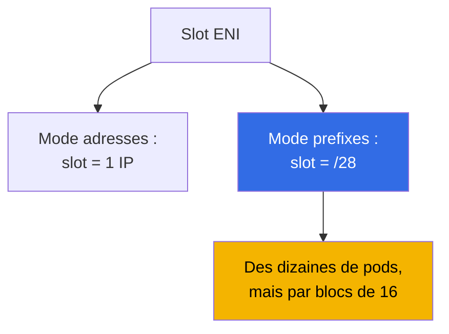
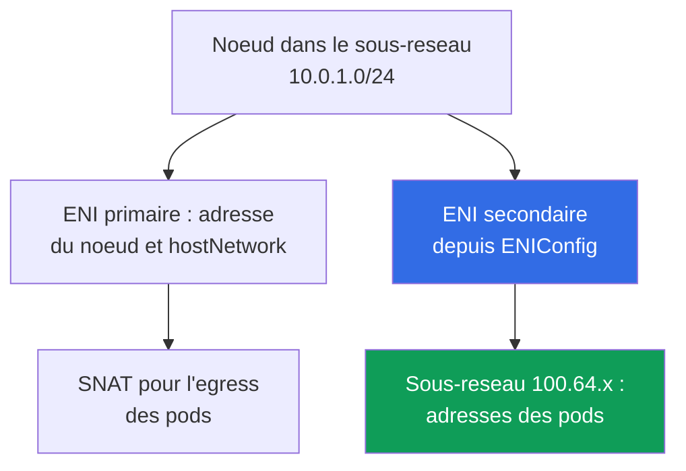

[Русская версия](ru.md) · [Eng version](en.md) · [Versión en español](es.md) · [Deutsche Version](de.md) · [ქართული ვერსია](ge.md) · [繁體中文版](tw.md) · [日本語版](jp.md)
# Chapitre 7. Echelle du plan d'adressage : prefix delegation, secondary CIDR, custom networking

> **La suite.** Le chapitre 6 a explique comment VPC CNI attribue aux pods de vraies adresses de sous-reseau et pourquoi elles s'epuisent. Ce chapitre couvre les solutions au niveau systeme : prefix delegation, secondary CIDR du VPC, custom networking via `ENIConfig`, l'ordre de deploiement dans un cluster en production et les changements operationnels. Les CNI alternatifs et Cilium sont au chapitre 8, NetworkPolicy au chapitre 30, la densite et le dimensionnement des noeuds au chapitre 14, et l'analyse des pannes reseau au chapitre 46. Un cluster IPv6 est mentionne comme voie distincte mais n'est pas examine en detail : `ipFamily` est defini uniquement a la creation (chapitre 4).

## 7.1. Trois reponses a "le sous-reseau est epuise et ne peut pas etre etendu"

La situation du chapitre 6 dans le pire des cas : les sous-reseaux des noeuds sont en `/24`, `AvailableIpAddressCount` dans une AZ de travail approche de zero, et un deploiement echoue sur `FailedCreatePodSandBox`. Etendre `/24` a `/22` est impossible, mais le cluster doit continuer a grandir.

- **Placer plus de pods avec les memes adresses sur un noeud** - prefix delegation : un slot ENI est attribue a un bloc `/28`. C'est peu couteux, mais **n'ajoute pas d'adresses au sous-reseau** et les consomme par gros blocs.
- **Apporter un nouvel espace d'adressage dans le VPC** - secondary CIDR : associer une plage, creer des sous-reseaux et attribuer les adresses des pods depuis ceux-ci. La plage doit etre propagee a travers le routage, le NAT et les reseaux connectes.
- **Sortir de la penurie IPv4 en tant que classe de probleme** - un cluster IPv6 (section 7.9) ou un CNI overlay (chapitre 8), mais uniquement dans un nouveau cluster.

Les deux premieres reponses sont generalement combinees. Une comparaison par criteres se trouve dans la section 7.6.

## 7.2. Prefix delegation : un slot ENI est attribue a un bloc /28

En mode normal, VPC CNI utilise un slot ENI pour une adresse IPv4 secondaire, et le nombre de slots est determine par le type d'instance (chapitre 6). Le prefix delegation change le contenu du slot : au lieu d'une adresse, il recoit **un prefixe `/28`, soit 16 adresses**.



```bash
kubectl set env daemonset aws-node -n kube-system ENABLE_PREFIX_DELEGATION=true
aws eks update-addon --cluster-name demo --addon-name vpc-cni \
  --configuration-values '{"env":{"ENABLE_PREFIX_DELEGATION":"true","WARM_PREFIX_TARGET":"1"}}' \
  --resolve-conflicts PRESERVE
```

La premiere commande convient pour un CNI installe manuellement. **Si VPC CNI est installe comme managed addon, une modification via `kubectl set env` ne survit que jusqu'a la prochaine mise a jour de l'addon**, c'est pourquoi les variables sont configurees via sa configuration, comme dans la deuxieme commande. Cela s'applique a toutes les variables de ce chapitre (chapitre 37).

**Seules les instances basees sur Nitro supportent les prefixes sur les interfaces reseau** : les autres continuent a prendre des adresses secondaires une par une, et dans un node group mixte les noeuds se comportent differemment. Pour les grands parcs, ce mode offre un autre avantage : **moins d'appels a l'API EC2**, car une requete fournit 16 adresses, et rattacher un prefixe a un ENI existant est plus rapide que d'en creer un nouveau.

Chaque slot, hormis celui occupe par l'adresse de l'interface elle-meme, fournit 16 adresses, et le plafond de pods est calcule avec des nombres differents.

| Instance | ENI | IP par ENI | Mode adresses | Mode prefixes | Cap managed node group |
|---|---|---|---|---|---|
| `m5.large` | 3 | 10 | 29 | 434 | 110 |
| `m5.xlarge` | 4 | 15 | 58 | 898 | 110 |
| `m5.8xlarge` | 8 | 30 | 234 | 3714 | 250 |

**Les managed node groups plafonnent `maxPods` independamment du prefix delegation : 110 pour les instances de moins de 30 vCPU et 250 pour les autres.** Activer la variable ne releve pas ce plafond : pour le depasser, il faut un AMI personnalise dans un launch template avec `maxPods` dans les user data (chapitre 10), ou un self-managed node group. La raison est la compatibilite ascendante : la table `max-pods` par defaut est calculee pour le mode adresses, donc les user data passent `--use-max-pods false` avec un `--max-pods` explicite, et la valeur est calculee par `max-pods-calculator.sh` avec le drapeau `--cni-prefix-delegation-enabled`. Surtout : **`kubelet` apprend `max-pods` au demarrage**, donc un noeud en mode adresses conserve son ancienne valeur. Le prefix delegation concerne les nouveaux noeuds.

L'autre partie du cout est la fragmentation. Un prefixe necessite **un bloc contigu de 16 adresses**, et la ou des adresses secondaires sont dispersees dans un sous-reseau, il peut y avoir beaucoup d'adresses libres mais aucun bloc contigu : `AvailableIpAddressCount` affiche des centaines d'adresses, les pods ne demarrent pas, et les logs ipamd montrent `InsufficientCidrBlocks`. La solution est un nouveau sous-reseau ou une **subnet CIDR reservation**.

```bash
aws ec2 create-subnet-cidr-reservation --subnet-id subnet-0123456789abcdef0 \
  --reservation-type prefix --cidr 10.0.1.128/25
aws ec2 describe-network-interfaces \
  --filters Name=attachment.instance-id,Values=i-0123456789abcdef0 \
  --query 'NetworkInterfaces[].[NetworkInterfaceId,Ipv4Prefixes[].Ipv4Prefix]' --output text
```

Les adresses sont consommees **par blocs de 16** : trois noeuds avec un pod chacun occupent 48 adresses au lieu de trois. La regle : le prefix delegation ameliore la densite des pods et les appels API, pas la penurie d'adresses, et en cas de penurie il est active en meme temps qu'un nouvel espace.

## 7.3. Le warm pool en mode prefixes

La logique de reserve est la meme qu'au chapitre 6, mais l'unite de mesure differe.

| Variable d'environnement | Ce qui est garde en reserve | Priorite |
|---|---|---|
| `WARM_PREFIX_TARGET` | des prefixes `/28` entiers au-dela du besoin actuel | base pour le mode prefixes |
| `WARM_IP_TARGET` | des adresses individuelles au-dela du besoin actuel | ecrase `WARM_PREFIX_TARGET` |
| `MINIMUM_IP_TARGET` | la borne inferieure d'adresses sur un noeud | ecrase `WARM_PREFIX_TARGET` |

**`WARM_IP_TARGET` et `MINIMUM_IP_TARGET` s'appliquent en mode prefixes et ont priorite sur `WARM_PREFIX_TARGET`.** `WARM_PREFIX_TARGET=1` garde un prefixe supplementaire entier, soit jusqu'a 16 adresses inutilisees par noeud, tandis qu'un `WARM_IP_TARGET` inferieur a 16 empeche l'attachement d'un prefixe supplementaire entier et economise des adresses au prix d'appels plus frequents a l'API EC2.

```bash
kubectl set env ds aws-node -n kube-system WARM_PREFIX_TARGET=1
kubectl set env ds aws-node -n kube-system WARM_IP_TARGET=8 MINIMUM_IP_TARGET=16
```

Sur des sous-reseaux larges, garder `WARM_PREFIX_TARGET=1` et un demarrage rapide des pods ; sur des sous-reseaux etroits, ajouter la paire `WARM_IP_TARGET` et `MINIMUM_IP_TARGET`. Definir les trois sans comprendre la priorite est un moyen d'obtenir un comportement inexplicable.

## 7.4. Secondary CIDR : un nouvel espace d'adressage dans un VPC existant

Des blocs IPv4 supplementaires sont associes au VPC, et des sous-reseaux y sont crees. Les sous-reseaux et noeuds existants ne sont pas affectes, et la route `local` est ajoutee automatiquement.

```bash
vpc_id=$(aws eks describe-cluster --name demo \
  --query 'cluster.resourcesVpcConfig.vpcId' --output text)
aws ec2 associate-vpc-cidr-block --vpc-id $vpc_id --cidr-block 100.64.0.0/16
aws ec2 describe-vpcs --vpc-ids $vpc_id --output table \
  --query 'Vpcs[].CidrBlockAssociationSet[].{CIDR:CidrBlock,State:CidrBlockState.State}'
aws ec2 create-subnet --vpc-id $vpc_id --availability-zone eu-central-1a \
  --cidr-block 100.64.0.0/19 --query Subnet.SubnetId --output text
```

Le bloc n'est utilisable que dans l'etat `associated`. Creer des sous-reseaux avant est premature.

**Pourquoi `100.64.0.0/10` est utilise.** C'est un espace d'adresses partage issu du RFC 6598 pour le CG-NAT. Formellement, ce n'est pas une plage privee RFC 1918, et donc **il n'est presque jamais deja occupe dans les reseaux d'entreprise**. Il y a aussi une raison technique : un VPC dont le CIDR primaire est dans `10.0.0.0/8` **ne peut pas** ajouter un bloc de `172.16.0.0/12` ou `192.168.0.0/16`, mais peut en ajouter un de `100.64.0.0/10`.

- **Les nouveaux sous-reseaux heritent de la table de routage principale** : la connectivite au sein du VPC fonctionne, mais la sortie internet doit etre configuree explicitement. Un pod en `100.64.x` a besoin d'une route vers la NAT gateway qui reside dans un sous-reseau de la plage primaire (chapitre 31).
- **Les reseaux connectes peuvent ne pas connaitre la plage** : le peering, Transit Gateway, le VPN et Direct Connect ne commencent pas a router `100.64.0.0/16` de leur propre chef. C'est souvent l'objectif : les adresses des pods ne sont pas routables de l'exterieur.
- **Taille et quotas** : les blocs vont de `/16` a `/28` ; le chevauchement avec des blocs existants et les CIDR de VPC appaires est interdit.

La facon la plus simple d'utiliser le nouvel espace est de **creer un node group dans les nouveaux sous-reseaux** : noeuds et pods recoivent des adresses de `100.64.x` sans aucune variable sur `aws-node`.

## 7.5. Custom networking : adresses des pods depuis des sous-reseaux separes

Par defaut, les ENI secondaires sont crees dans le sous-reseau de l'ENI primaire du noeud. Le custom networking rompt ce lien : **les ENI secondaires sont crees dans le sous-reseau et avec les security groups de l'objet `ENIConfig`**, les adresses des pods sont allouees a partir de la, et les sous-reseaux doivent etre dans le meme VPC et la meme AZ que le noeud.



Les etapes obligatoires sont un objet `ENIConfig` par AZ, puis deux variables sur `aws-node`. `ENIConfig` definit `spec.subnet` et `spec.securityGroups` (generalement le cluster security group), et le nom de l'objet est rendu egal au nom de la zone quand il n'y a qu'un sous-reseau de pods dans cette zone.

```yaml
apiVersion: crd.k8s.amazonaws.com/v1alpha1
kind: ENIConfig
metadata:
  name: eu-central-1a          # nom = nom de la zone avec un seul subnet par AZ
spec:
  subnet: subnet-0123456789abcdef0   # subnet 100.64.x dans la meme AZ
  securityGroups:
    - sg-0123456789abcdef0           # cluster security group
```

Appliquer un objet pour chaque AZ avec des noeuds, en changeant le nom et `subnet`, et seulement ensuite activer les variables. Sinon, un noeud dans une AZ sans `ENIConfig` ne pourra pas attribuer d'adresses aux pods.

Il est important de ne pas confondre deux mecanismes. `spec.securityGroups` dans `ENIConfig` sont les groupes pour les ENI secondaires, c'est-a-dire **tous les pods de ce noeud** qui utilisent cet `ENIConfig` : la granularite est zonale, pas par pod. Si un SG est requis pour un pod specifique ou un groupe de pods defini par selecteur, c'est un mecanisme different : security groups for pods, ou une ressource `SecurityGroupPolicy` associe une liste de SG par selecteur, et VPC CNI donne a ces pods une branch ENI separee (details et erreurs courantes au chapitre 46). En mode prefixes sans `SecurityGroupPolicy`, les pods partagent le security group du noeud.

```bash
kubectl set env daemonset aws-node -n kube-system AWS_VPC_K8S_CNI_CUSTOM_NETWORK_CFG=true
kubectl set env daemonset aws-node -n kube-system ENI_CONFIG_LABEL_DEF=topology.kubernetes.io/zone
kubectl get eniconfigs
```

`ENI_CONFIG_LABEL_DEF=topology.kubernetes.io/zone` active la selection automatique : le noeud lit son label de zone et prend l'`ENIConfig` du meme nom. S'il y a plusieurs sous-reseaux de pods dans une zone, les noeuds doivent etre marques avec l'annotation `k8s.amazonaws.com/eniConfig`.

- **L'ENI primaire du noeud ne participe pas a l'attribution d'adresses aux pods**, donc le `max-pods` effectif baisse : la formule perd une interface entiere, soit 20 pods au lieu de 29 pour `m5.large`. Les prefixes compensent : `(3 - 1) * (10 - 1) * 16 + 2` donne 290.
- **Les noeuds existants ne changent pas de comportement** : le mode fonctionne uniquement sur les noeuds crees apres l'activation des variables, donc le parc doit etre recree (section 7.7). Incompatible avec IPv6.
- **L'egress utilise l'ENI primaire par defaut** : avec `AWS_VPC_K8S_CNI_EXTERNALSNAT=false`, le trafic vers des adresses hors du CIDR de votre VPC sort via le sous-reseau et les security groups de l'ENI primaire, pas ceux de `ENIConfig`. Les pods avec `hostNetwork: true` restent egalement sur l'adresse du noeud.
- **Le diagnostic devient plus complexe** : les adresses du noeud et des pods proviennent de plages differentes, les security groups peuvent differer, et repondre a "pourquoi le pod n'a-t-il pas pu se connecter" necessite de voir quel ENI a ete utilise par le paquet (section 7.8).

**Quand le SNAT est supprime.** Le meme egress peut etre retire du SNAT au niveau du noeud : avec `AWS_VPC_K8S_CNI_EXTERNALSNAT=true`, la regle de masquerade n'est pas installee, et les paquets vers des adresses hors du CIDR du VPC partent avec l'adresse reelle du pod au lieu d'etre remplaces par l'adresse primaire du noeud. C'est necessaire dans deux cas : le pod atteint un data center, un VPC appaire ou un VPN via sa propre NAT gateway, Transit Gateway ou Direct Connect et l'autre cote doit voir l'adresse du pod ; ou une ressource externe doit initier une connexion vers le pod. Le cout : les reseaux connectes doivent router la plage des pods, et la sortie internet directe via une internet gateway cesse de fonctionner avec `true` - une route vers une NAT gateway est necessaire (chapitre 31).

Il existe un outil plus simple. **Enhanced subnet discovery** : VPC CNI `1.18.0` et versions ulterieures, par defaut (`ENABLE_SUBNET_DISCOVERY=true`), trouve automatiquement les sous-reseaux de son VPC et AZ avec le tag `kubernetes.io/role/cni=1` (`aws ec2 create-tags --resources <subnet-id> --tags Key=kubernetes.io/role/cni,Value=1`). Les pods recoivent des adresses des nouveaux sous-reseaux **sans `ENIConfig` et sans perdre l'ENI primaire**, donc sans penalite sur `max-pods`. Le custom networking est destine aux exigences de security groups et d'isolation, et il a priorite si les deux mecanismes sont actives.

## 7.6. Comment choisir

| Critere | Prefix delegation | Secondary CIDR plus node group | Custom networking | Tag de sous-reseau `cni=1` | Cluster IPv6 |
|---|---|---|---|---|---|
| Complexite du deploiement | faible | moyenne | elevee | faible | nouveau cluster uniquement |
| Fournit de nouvelles adresses | non | oui | oui | oui | oui |
| Effet sur `max-pods` | a la hausse, jusqu'au cap | aucun | a la baisse, moins un ENI | aucun | a la hausse, prefixes |
| Recreation des noeuds | oui, pour le nouveau `max-pods` | oui, nouveaux sous-reseaux | oui, obligatoire | non | oui |
| Adresses des pods dans les reseaux connectes | comme avant | uniquement avec des routes | uniquement avec des routes | depend du sous-reseau | via les routes IPv6 |
| Security groups personnalises pour les pods | non | non | oui | non | non |
| Exigences | Nitro | quota CIDR du VPC | `ENIConfig` par AZ | VPC CNI `1.18.0`+ | Nitro, nouveau cluster |

Si les sous-reseaux sont larges mais les pods ne tiennent pas sur un noeud, utiliser le prefix delegation sans ajouter de complexite. Si les adresses sont epuisees, utiliser un secondary CIDR, puis choisir entre un nouveau node group, un tag de sous-reseau et le custom networking, qui est choisi pour les exigences d'isolation plutot que pour les adresses. IPv6 se decide a la creation du cluster.

## 7.7. Ordre de deploiement dans un cluster en production sans interruption

Les trois mecanismes partagent une propriete commune : **ils ne changent le comportement que des nouveaux noeuds**.

1. **Preparer les adresses.** Associer un secondary CIDR, creer un sous-reseau par AZ et les tables de routage, et creer une subnet CIDR reservation si necessaire.
2. **Modifier la configuration du CNI** via la configuration du managed addon (chapitre 37). Pour le custom networking, d'abord appliquer `ENIConfig` dans chaque zone, et seulement ensuite activer `AWS_VPC_K8S_CNI_CUSTOM_NETWORK_CFG`.
3. **Creer un nouveau node group** dans les sous-reseaux requis, sur des instances Nitro, avec `maxPods` dans les user data si un plafond au-dessus du cap est necessaire. Verifier les adresses des pods sur les nouveaux noeuds.
4. **Migrer la charge.** Cordon et drain des anciens noeuds un par un en tenant compte des PDB (chapitre 40), puis supprimer l'ancien node group. Le remplacement progressif n'est pas recommande pour une transition vers les prefixes : un noeud avec un melange d'adresses et de prefixes rapporte une capacite incoherente.

Verifier a chaque etape plutot qu'a la fin :

```bash
kubectl get nodes -o custom-columns='NODE:.metadata.name,PODS:.status.allocatable.pods'
kubectl get pods -A -o wide | grep -c ' 100\.64\.'
kubectl get eniconfigs -o custom-columns='NAME:.metadata.name,SUBNET:.spec.subnet'
```

Les commandes montrent si `max-pods` a augmente sur les nouveaux noeuds, si les adresses des pods proviennent de la nouvelle plage, et s'il y a un `ENIConfig` pour chaque zone avec des noeuds. Un noeud dans une zone sans `ENIConfig` ne peut pas attribuer d'adresses aux pods, et le symptome est le meme `FailedCreatePodSandBox`, mais avec un sous-reseau non plein.

## 7.8. Exploitation apres le deploiement

La surveillance des adresses restantes devient plus precise : compter par sous-reseau et AZ, et en mode prefixes surveiller non seulement le reste mais aussi l'existence de blocs contigus.

```bash
aws ec2 describe-subnets --filters Name=vpc-id,Values=vpc-0123456789abcdef0 --output table \
  --query 'Subnets[].[SubnetId,AvailabilityZone,CidrBlock,AvailableIpAddressCount]'
aws ec2 describe-network-interfaces --filters Name=vpc-id,Values=vpc-0123456789abcdef0 \
  --query 'NetworkInterfaces[].[NetworkInterfaceId,SubnetId,length(Ipv4Prefixes)]' --output text
```

Le changement principal en diagnostic est que l'adresse d'un pod ne revele plus le sous-reseau du noeud, et l'ordre d'investigation est desormais : noeud, son ENI, le sous-reseau de cet ENI, les security groups du sous-reseau.

- **Anciens noeuds sans prefixes.** Une partie du parc conserve l'ancien `max-pods`, et les pods se distribuent de maniere inegale. Se corrige en remplacant les noeuds, pas en modifiant les variables.
- **L'addon a ecrase les variables.** Une mise a jour du managed addon a restaure ses valeurs, et les nouveaux noeuds ont demarre en mode adresses. Verifier apres chaque mise a jour.
- **`ENIConfig` n'est pas present dans chaque AZ.** Le cluster fonctionnait jusqu'a ce que Karpenter cree un noeud dans une quatrieme zone. Un probleme connexe est un `ENIConfig` qui pointe vers un sous-reseau epuise : la penurie revient.
- **Fragmentation au lieu de penurie** : beaucoup d'adresses restent mais les logs montrent `InsufficientCidrBlocks`. **Types d'instances mixtes** : une instance non-Nitro ne recoit pas de prefixes, et le `max-pods` le plus bas du groupe s'applique a tous ses noeuds.
- **Une liste large de types d'instances Karpenter.** C'est une instance distincte du meme piege : un pool spot avec des exigences larges peut inclure d'anciennes familles non-Nitro (`t2`, `m4`, `c4`), et ces noeuds demarrent en mode adresses avec une densite nettement inferieure au reste du pool. Le parc semble homogene, mais les pods se distribuent de maniere inegale. Se corrige en restreignant les exigences NodePool : le label `karpenter.k8s.aws/instance-hypervisor` avec la valeur `nitro`, ou l'exclusion des anciennes generations via `karpenter.k8s.aws/instance-generation` (chapitres 12 et 13).

## 7.9. Cluster IPv6 : apercu de la solution radicale

Dans un cluster avec `ipFamily: ipv6`, les pods et Services recoivent des adresses IPv6, et VPC CNI fonctionne avec des prefixes `/80`. La penurie est presque entierement eliminee. Le cout comporte trois volets.

- **Uniquement a la creation du cluster.** `ipFamily` ne peut pas changer, EKS ne supporte pas le dual-stack pour les pods et Services, et le custom networking est incompatible avec IPv6. La transition necessite un nouveau cluster et une migration de charge (chapitres 4 et 38).
- **Compatibilite des applications.** Les litteraux d'adresses dans les configurations, les bibliotheques, les agents et les systemes externes doivent tous supporter IPv6. Nitro est obligatoire et les noeuds Windows ne sont pas supportes.
- **Egress IPv4.** Le pod recoit une adresse IPv6 et aussi une adresse IPv4 host-local, invisible pour le control plane. Lorsqu'il contacte une ressource IPv4, le NAT sur le noeud lui-meme utilise le SNAT vers l'adresse IPv4 primaire du noeud, et **ce mecanisme integre supprime le besoin de DNS64 et NAT64** cote VPC.

En resume, IPv6 est une bonne reponse a "comment construire le prochain cluster ?" et une mauvaise reponse a "que faire avec celui-ci vendredi ?".

## 7.10. Comment c'est utilise en production

- **Activer le prefix delegation sur les nouveaux clusters par defaut** avec `WARM_PREFIX_TARGET` et des instances Nitro : c'est moins cher que de revenir au sujet sous charge.
- **Allouer les sous-reseaux des pods depuis `100.64.0.0/10`** lors de la conception du VPC : un espace non-routable pour les pods laisse RFC 1918 aux load balancers et au NAT.
- **Conserver les variables VPC CNI dans la configuration du managed addon et le code Terraform**, pas dans un DaemonSet vivant : une modification `kubectl set env` ne survit que jusqu'a la prochaine mise a jour de l'addon.
- **Alerter sur les adresses restantes dans chaque sous-reseau et AZ**, et en mode prefixes ajouter une alerte sur `InsufficientCidrBlocks` dans les logs `aws-node`.

## 7.11. Mini-glossaire

- **Prefix delegation** - un mode ou un slot ENI contient un prefixe `/28` (16 adresses) ; active avec `ENABLE_PREFIX_DELEGATION` et necessite Nitro. **`WARM_PREFIX_TARGET`** est la reserve de prefixes sur un noeud ; `WARM_IP_TARGET` et `MINIMUM_IP_TARGET` ont priorite sur lui.
- **Subnet CIDR reservation** - reservation d'un bloc contigu dans un sous-reseau pour les prefixes. **`InsufficientCidrBlocks`** - une erreur de l'API EC2 signalant l'absence de blocs contigus malgre des adresses formellement libres.
- **Secondary CIDR** - un bloc IPv4 supplementaire sur un VPC ; pour EKS, generalement depuis `100.64.0.0/10` (RFC 6598). **Custom networking** - un mode ou les ENI secondaires et les adresses des pods sont pris depuis un sous-reseau et les security groups d'un objet **`ENIConfig`**, un par AZ, selectionne par le label dans `ENI_CONFIG_LABEL_DEF`. **Enhanced subnet discovery** - des sous-reseaux avec le tag `kubernetes.io/role/cni=1` sans `ENIConfig`. **`AWS_VPC_K8S_CNI_EXTERNALSNAT`** supprime le SNAT au niveau du noeud pour l'egress des pods (`true`) afin que le cote externe voie l'adresse reelle du pod ; la sortie internet passe alors uniquement par une NAT gateway. **`ipFamily`** est la famille d'adresses du cluster et n'est defini qu'a la creation.

## 7.12. Resume du chapitre

- Un sous-reseau ne peut pas etre etendu, donc il y a trois sorties : plus d'adresses par slot ENI, un nouvel espace d'adressage dans le VPC, ou quitter IPv4. Les deux premieres sont souvent utilisees ensemble.
- Le prefix delegation s'active avec `ENABLE_PREFIX_DELEGATION=true` sur `aws-node`, necessite Nitro et economise les appels API EC2. Mais les managed node groups conservent les caps 110 et 250 independamment des prefixes, `max-pods` est fixe au demarrage du noeud, et les adresses sont allouees par blocs de 16, fragmentant le sous-reseau.
- `WARM_PREFIX_TARGET` definit la reserve, mais `WARM_IP_TARGET` et `MINIMUM_IP_TARGET` s'appliquent aussi et l'ecrasent, permettant de ne pas conserver un prefixe supplementaire entier.
- Un secondary CIDR depuis `100.64.0.0/10` ne chevauche pas les reseaux d'entreprise et est autorise la ou les blocs RFC 1918 sont interdits, mais necessite une attention au routage et au NAT.
- Le custom networking via `ENIConfig` donne aux pods des sous-reseaux et security groups separes, mais retire l'ENI primaire de l'allocation d'adresses, reduit `max-pods` et necessite la recreation des noeuds. Une voie plus simple est un node group dans de nouveaux sous-reseaux ou le tag `kubernetes.io/role/cni=1`.
- Chaque changement ne s'applique qu'aux nouveaux noeuds : d'abord les adresses et la configuration, puis un nouveau node group, puis le drain des anciens noeuds. IPv6 supprime entierement la penurie mais se choisit uniquement a la creation du cluster et implique la compatibilite des applications et l'egress vers IPv4 via NAT.

## 7.13. En quoi cela aide dans le travail reel

La penurie d'adresses arrive sans prevenir et se manifeste immediatement par "le deploiement ne se fait pas". La difference entre un ingenieur avec un plan et sans se mesure en heures d'indisponibilite : le premier sait que le prefix delegation augmente la densite mais n'ajoute pas d'adresses, qu'un secondary CIDR s'associe en une minute tandis que les routes et le NAT prennent plus de temps, et que le changement n'atteint le cluster qu'avec les nouveaux noeuds. En temps calme, cela sert a la conception : des sous-reseaux pour les pods separes des noeuds, des prefixes des le premier jour, et les variables CNI dans la configuration de l'addon dans Git.

## 7.14. Questions d'auto-evaluation

1. Pourquoi le prefix delegation ne resout-il pas un sous-reseau epuise, et pourquoi peut-il parfois aggraver la situation ?
2. Vous avez active `ENABLE_PREFIX_DELEGATION=true`, mais `allocatable.pods` n'a pas change. Deux raisons ?
3. Quelles sont les exigences sur les types d'instances du mode prefixes, et pourquoi est-ce dangereux dans un groupe mixte ?
4. Il reste 400 adresses dans un sous-reseau, mais les logs `aws-node` montrent `InsufficientCidrBlocks`. Que faire ?
5. Comment `WARM_PREFIX_TARGET`, `WARM_IP_TARGET` et `MINIMUM_IP_TARGET` sont-ils lies entre eux ?
6. Pourquoi les adresses des pods sont-elles prises dans `100.64.0.0/10` plutot qu'un bloc libre dans `192.168.0.0/16` ?
7. Que faut-il faire apres `associate-vpc-cidr-block` pour que les pods accedent a internet et au data center ?
8. Quels elements sont obligatoires pour le custom networking, et pourquoi un `ENIConfig` est-il cree pour chaque AZ ?
9. En quoi `spec.securityGroups` dans `ENIConfig` differe-t-il de `SecurityGroupPolicy` en termes de portee ?
10. Pourquoi `max-pods` baisse-t-il avec le custom networking, et comment compenser ?
11. En quoi l'enhanced subnet discovery differe-t-il du custom networking, et quand est-il insuffisant ?
12. Decrivez l'ordre de deploiement du prefix delegation dans un cluster en production sans interruption.
13. Que faut-il verifier apres une mise a jour de l'addon VPC CNI, et pourquoi IPv6 ne sauve-t-il pas le cluster actuel ?
14. Quand active-t-on `AWS_VPC_K8S_CNI_EXTERNALSNAT=true`, et qu'est-ce qui se casse dans l'egress ?

## Pratique

Le lab du cours pour ce sujet est [lab 103 - Plan d'adressage : limites ENI, prefix delegation, secondary CIDR](../../labs/103/README_FR.MD). Au-dela, verifiez le contenu sur un cluster en production. Commencez par le mode de fonctionnement du CNI :
`kubectl describe ds aws-node -n kube-system | grep -e PREFIX -e WARM_ -e CUSTOM_NETWORK -e
SUBNET_DISCOVERY`. Ensuite, verifiez les prefixes sur une interface de noeud via `aws ec2
describe-network-interfaces` avec le filtre `Name=attachment.instance-id` et la requete
`Ipv4Prefixes[].Ipv4Prefix` : une liste de prefixes vide avec une liste d'adresses secondaires non vide
signifie le mode adresses normal. Verifiez le plafond de pods avec `kubectl get nodes -o
custom-columns='NODE:.metadata.name,PODS:.status.allocatable.pods'` : des valeurs identiques de 110 sur differents
types indiquent le cap du managed node group.

Sur un cluster de test, parcourez le chemin complet : associer `100.64.0.0/16` avec `aws ec2
associate-vpc-cidr-block`, creer un sous-reseau par AZ via `aws ec2 create-subnet`, appliquer
`ENIConfig` dans chaque zone, verifier `kubectl get eniconfigs`, activer
`AWS_VPC_K8S_CNI_CUSTOM_NETWORK_CFG` et `ENI_CONFIG_LABEL_DEF`, creer un nouveau node group et
confirmer que les nouveaux pods ont recu des adresses de `100.64.x` tandis que les anciens noeuds fonctionnent comme avant.
Comparez aussi les adresses restantes via `aws ec2 describe-subnets` avec `AvailableIpAddressCount`.

---
[Table des matieres](../README_FR.md) · [Chapitre 6](../06/fr.md) · [Chapitre 8](../08/fr.md)
