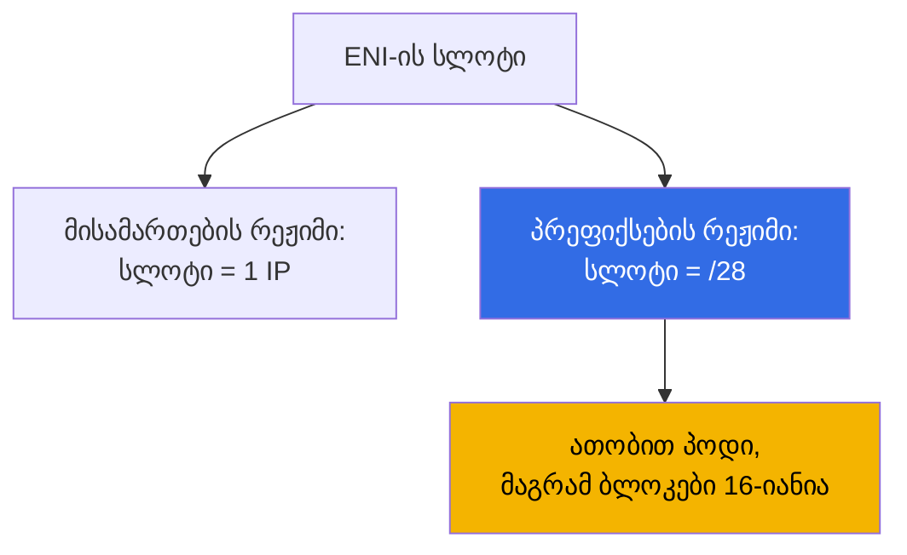
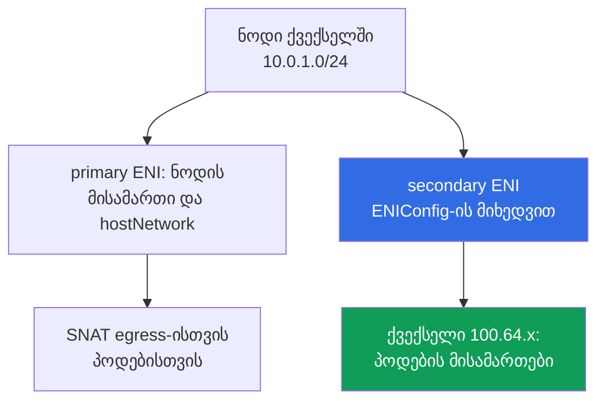

[Русская версия](ru.md) · [Eng version](en.md) · [Versión en español](es.md) · [Version française](fr.md) · [Deutsche Version](de.md) · [繁體中文版](tw.md) · [日本語版](jp.md)
# თავი 7. მისამართების გეგმის მასშტაბირება: prefix delegation, secondary CIDR, custom networking

> **რა არის შემდეგ.** მე-6 თავში განხილულია, როგორ ანიჭებს VPC CNI პოდებს ქვექსელის რეალურ მისამართებს და
> რატომ იწურება ისინი. აქ მოცემულია სისტემური გამოსავლები: prefix delegation, VPC-ის secondary CIDR,
> custom networking `ENIConfig`-ის მეშვეობით, მოქმედ კლასტერში დანერგვის თანმიმდევრობა და ის, რაც
> ექსპლუატაციაში იცვლება. ალტერნატიული CNI და Cilium მე-8 თავშია, NetworkPolicy - 30-ე თავში, ნოდების
> სიმჭიდროვე და sizing - მე-14 თავში, ქსელური გაუმართაობების ანალიზი - 46-ე თავში. IPv6-კლასტერი ცალკე
> გზად არის ნახსენები, მაგრამ დეტალურად არ განიხილება: `ipFamily` მხოლოდ შექმნისას განისაზღვრება (თავი 4).

## 7.1. სამი პასუხი კითხვაზე „ქვექსელი ამოიწურა, გაფართოება შეუძლებელია“

მე-6 თავის სიტუაცია ყველაზე მძიმე სახით: ნოდებისთვის ქვექსელები `/24` ზომითაა აღებული,
`AvailableIpAddressCount` სამუშაო AZ-ში ნულს უახლოვდება, რელიზი კი `FailedCreatePodSandBox`-ს ეჯახება.
`/24`-ის `/22`-მდე გაფართოება შეუძლებელია, კლასტერი კი კვლავ უნდა გაიზარდოს.

- **იმავე მისამართებით ნოდზე მეტი პოდის განთავსება** - prefix delegation: ENI-ის სლოტი
  `/28` ბლოკს ეთმობა. იაფია, მაგრამ **ქვექსელს მისამართებს არ უმატებს** და მათ დიდი
  ბლოკებით ხარჯავს.
- **VPC-ში ახალი მისამართების სივრცის დამატება** - secondary CIDR: დიაპაზონის მიბმა, ქვექსელების
  შექმნა და მისამართების პოდებისთვის გადაცემა. დიაპაზონი მარშრუტიზაციაში, NAT-სა და დაკავშირებულ
  ქსელებში უნდა გატარდეს.
- **IPv4-ის დეფიციტისგან, როგორც პრობლემის კლასისგან, თავის დაღწევა** - IPv6-კლასტერი (განყოფილება 7.9)
  ან overlay-CNI (თავი 8), თუმცა მხოლოდ ახალ კლასტერში.

პირველ ორ პასუხს, ჩვეულებრივ, ერთად იყენებენ; კრიტერიუმების მიხედვით შედარება 7.6 განყოფილებაშია.

## 7.2. Prefix delegation: ENI-ის სლოტი /28 ბლოკს ეთმობა

ჩვეულებრივ რეჟიმში VPC CNI ENI-ზე ერთ სლოტს ერთი მეორეული IPv4 მისამართისთვის იკავებს, სლოტების რაოდენობას
კი ინსტანსის ტიპი განსაზღვრავს (თავი 6). Prefix delegation სლოტის შიგთავსს ცვლის: მისამართის ნაცვლად
მასში თავსდება **`/28` პრეფიქსი, ანუ 16 მისამართი**.



```bash
kubectl set env daemonset aws-node -n kube-system ENABLE_PREFIX_DELEGATION=true
aws eks update-addon --cluster-name demo --addon-name vpc-cni \
  --configuration-values '{"env":{"ENABLE_PREFIX_DELEGATION":"true","WARM_PREFIX_TARGET":"1"}}' \
  --resolve-conflicts PRESERVE
```

პირველი ბრძანება დამოუკიდებლად დაყენებული CNI-ისთვის გამოდგება. **თუ VPC CNI managed addon-ის სახითაა
დაყენებული, `kubectl set env`-ით შეტანილი ცვლილება ადონის მომდევნო განახლებამდე ძლებს**, ამიტომ
ცვლადები მის კონფიგურაციაში უნდა განისაზღვროს, როგორც მეორე ბრძანებაშია. ეს ამ თავის ყველა ცვლადს
ეხება (თავი 37).

**ქსელურ ინტერფეისებზე პრეფიქსებს მხოლოდ Nitro-ზე დაფუძნებული ინსტანსები უჭერს მხარს**: დანარჩენები
მეორეულ მისამართებს კვლავ სათითაოდ იღებს და შერეულ node group-ში ნოდების ქცევა განსხვავებული იქნება.
დიდი პარკებისთვის რეჟიმის კიდევ ერთი უპირატესობაა: **EC2 API-ის გამოძახებები ნაკლებია**, ერთი მოთხოვნით 16
მისამართი მოდის, ხოლო მზა ENI-ზე პრეფიქსის მიბმა ახლის შექმნაზე სწრაფია.

ყოველი სლოტი, გარდა თავად ინტერფეისის მისამართით დაკავებულისა, 16 მისამართს იძლევა, ამიტომ პოდების
ზღვარი სხვა რიცხვებით ითვლება.

| ინსტანსი | ENI | IP თითო ENI-ზე | მისამართების რეჟიმი | პრეფიქსების რეჟიმი | Managed node group-ის ზღვარი |
|---|---|---|---|---|---|
| `m5.large` | 3 | 10 | 29 | 434 | 110 |
| `m5.xlarge` | 4 | 15 | 58 | 898 | 110 |
| `m5.8xlarge` | 8 | 30 | 234 | 3714 | 250 |

**Managed node groups `maxPods`-ს prefix delegation-ისგან დამოუკიდებლად ზღუდავს: 110 - 30 vCPU-ზე
ნაკლები ინსტანსებისთვის და 250 - დანარჩენებისთვის.** ცვლადის ჩართვა ზღვარს არ გაზრდის:
მეტი მხოლოდ launch template-ში საკუთარი AMI-ითა და user data-ში `maxPods`-ით (თავი 10), ან
self-managed node group-ით მიიღება. მიზეზი უკუთავსებადობაა: ნაგულისხმევი `max-pods` ცხრილი
მისამართების რეჟიმისთვისაა გამოთვლილი, ამიტომ user data-ში აშკარა `--max-pods`-თან ერთად
`--use-max-pods false` გადაეცემა, მნიშვნელობა კი `max-pods-calculator.sh` სკრიპტით,
`--cni-prefix-delegation-enabled` flag-ით ითვლება. და რაც მთავარია: **`kubelet` `max-pods`-ს გაშვებისას
იგებს**, ამიტომ მისამართების რეჟიმში შექმნილ ნოდს ძველი მნიშვნელობა დარჩება; prefix delegation ახალ
ნოდებს ეხება.

ფასის მეორე ნაწილი ფრაგმენტაციაა. პრეფიქსს **16 მისამართის უწყვეტი ბლოკი** სჭირდება, ხოლო იქ,
სადაც მეორეული მისამართები ქვექსელში გაფანტულადაა განთავსებული, შეიძლება თავისუფალი მისამართი ბევრი იყოს,
მაგრამ უწყვეტი ბლოკი - არცერთი: `AvailableIpAddressCount` ასობით მისამართს აჩვენებს, პოდები არ ეშვება,
ipamd-ის ლოგებში კი `InsufficientCidrBlocks` ჩანს. პრობლემა ახალი ქვექსელით ან **subnet CIDR reservation**-ით
გვარდება.

```bash
aws ec2 create-subnet-cidr-reservation --subnet-id subnet-0123456789abcdef0 \
  --reservation-type prefix --cidr 10.0.1.128/25
aws ec2 describe-network-interfaces \
  --filters Name=attachment.instance-id,Values=i-0123456789abcdef0 \
  --query 'NetworkInterfaces[].[NetworkInterfaceId,Ipv4Prefixes[].Ipv4Prefix]' --output text
```

მისამართები **16-იან ბლოკებად** იხარჯება: თითო პოდიანი სამი ნოდი სამის ნაცვლად 48 მისამართს იკავებს.
წესი ასეთია: prefix delegation პოდების სიმჭიდროვესა და API-ის გამოძახებებს აუმჯობესებს და არა მისამართების
დეფიციტს; დეფიციტისას მას ახალ სივრცესთან ერთად რთავენ.

## 7.3. Warm-პული პრეფიქსების რეჟიმში

მარაგის ლოგიკა იგივეა, რაც მე-6 თავში, მაგრამ საზომი ერთეული განსხვავებულია.

| გარემოს ცვლადი | რას ინახავს მარაგში | პრიორიტეტი |
|---|---|---|
| `WARM_PREFIX_TARGET` | მიმდინარე საჭიროებაზე მეტ მთლიან `/28` პრეფიქსებს | საბაზისო პრეფიქსების რეჟიმისთვის |
| `WARM_IP_TARGET` | მიმდინარე საჭიროებაზე მეტ ცალკეულ მისამართებს | გადაფარავს `WARM_PREFIX_TARGET`-ს |
| `MINIMUM_IP_TARGET` | ნოდზე მისამართების ქვედა ზღვარს | გადაფარავს `WARM_PREFIX_TARGET`-ს |

**`WARM_IP_TARGET` და `MINIMUM_IP_TARGET` პრეფიქსების რეჟიმშიც გამოიყენება და `WARM_PREFIX_TARGET`-ზე
მაღალი პრიორიტეტი აქვს.** `WARM_PREFIX_TARGET=1` ერთ მთლიან დამატებით პრეფიქსს, ანუ ნოდზე 16-მდე
გამოუყენებელ მისამართს ინახავს, ხოლო 16-ზე ნაკლები `WARM_IP_TARGET` ზედმეტი სრული პრეფიქსის მიბმას
არ მოითხოვს და მისამართებს EC2 API-ის უფრო ხშირი გამოძახებების ფასად ზოგავს.

```bash
kubectl set env ds aws-node -n kube-system WARM_PREFIX_TARGET=1
kubectl set env ds aws-node -n kube-system WARM_IP_TARGET=8 MINIMUM_IP_TARGET=16
```

ფართო ქვექსელებში ტოვებენ `WARM_PREFIX_TARGET=1`-სა და პოდების სწრაფ გაშვებას, ვიწროებში კი
`WARM_IP_TARGET`-ისა და `MINIMUM_IP_TARGET`-ის წყვილს ამატებენ. პრიორიტეტის გააზრების გარეშე სამივეს
ერთად მითითება აუხსნელი ქცევის მიღების გზაა.

## 7.4. Secondary CIDR: ახალი მისამართების სივრცე არსებულ VPC-ში

VPC-ს დამატებითი IPv4 ბლოკები მიებმება და მათში ქვექსელები იქმნება. არსებულ ქვექსელებსა და ნოდებს
არ ეხებიან, `local` მარშრუტი კი ავტომატურად ემატება.

```bash
vpc_id=$(aws eks describe-cluster --name demo \
  --query 'cluster.resourcesVpcConfig.vpcId' --output text)
aws ec2 associate-vpc-cidr-block --vpc-id $vpc_id --cidr-block 100.64.0.0/16
aws ec2 describe-vpcs --vpc-ids $vpc_id --output table \
  --query 'Vpcs[].CidrBlockAssociationSet[].{CIDR:CidrBlock,State:CidrBlockState.State}'
aws ec2 create-subnet --vpc-id $vpc_id --availability-zone eu-central-1a \
  --cidr-block 100.64.0.0/19 --query Subnet.SubnetId --output text
```

ბლოკის გამოყენება მხოლოდ `associated` მდგომარეობაში შეიძლება; მანამდე ქვექსელების შექმნა ნაადრევია.

**რატომ იყენებენ `100.64.0.0/10`-ს.** ეს RFC 6598-ის shared address space-ია, რომელიც CG-NAT-ისთვისაა
განკუთვნილი. ფორმალურად ის RFC 1918-ის კერძო დიაპაზონი არ არის, ამიტომ **კორპორაციულ ქსელებში თითქმის არასდროს
არის დაკავებული**. ტექნიკური მიზეზიც არსებობს: VPC-ს, რომლის primary CIDR `10.0.0.0/8`-დანაა,
**ვერ** დაემატება ბლოკი `172.16.0.0/12`-დან ან `192.168.0.0/16`-დან, `100.64.0.0/10`-დან კი შეიძლება.

- **ახალი ქვექსელები main route table-ს მემკვიდრეობით იღებს**: VPC-ის შიგნით კავშირი იქნება, ინტერნეტში
  გასვლა კი აშკარად უნდა განისაზღვროს. `100.64.x`-ში მყოფ პოდს NAT gateway-მდე მარშრუტი სჭირდება, თავად
  gateway კი ძირითადი დიაპაზონის ქვექსელში მდებარეობს (თავი 31).
- **დაკავშირებულმა ქსელებმა შეიძლება დიაპაზონი არ იცოდეს**: peering, Transit Gateway, VPN და Direct Connect
  `100.64.0.0/16`-ის მარშრუტიზაციას თავისით არ დაიწყებს. ხშირად ეს მიზანიცაა: პოდების მისამართები გარედან
  არ მარშრუტდება.
- **ზომა და კვოტები**: ბლოკი `/16`-დან `/28`-მდე; არსებულ ბლოკებსა და peered VPC-ის CIDR-ებთან გადაკვეთა
  დაუშვებელია.

ახალი სივრცის გამოყენების უმარტივესი გზაა **ახალ ქვექსელებში node group-ის შექმნა**: ნოდებიცა და პოდებიც
`100.64.x`-დან მიიღებს მისამართებს `aws-node`-ში არცერთი ცვლადის დამატების გარეშე.

## 7.5. Custom networking: პოდების მისამართები ცალკეული ქვექსელებიდან

ნაგულისხმევად secondary ENI-ები ნოდის primary ENI-ის ქვექსელში იქმნება. Custom networking ამ კავშირს
წყვეტს: **secondary ENI-ები `ENIConfig` ობიექტში მითითებულ ქვექსელსა და security groups-ში იქმნება**,
პოდების მისამართები იქიდან გაიცემა, ქვექსელები კი იმავე VPC-სა და AZ-ში უნდა იყოს, სადაც ნოდია.



სავალდებულო ნაბიჯებია: თითო `ENIConfig` ობიექტი ყოველ AZ-ზე, შემდეგ კი ორი ცვლადი `aws-node`-ში.
`ENIConfig`-ში განისაზღვრება `spec.subnet` და `spec.securityGroups` (ჩვეულებრივ cluster security group),
ხოლო თუ ზონაში პოდებისთვის ერთი ქვექსელია, ობიექტის სახელს ზონის სახელს ამთხვევენ.

```yaml
apiVersion: crd.k8s.amazonaws.com/v1alpha1
kind: ENIConfig
metadata:
  name: eu-central-1a          # სახელი = ზონის სახელი, როდესაც AZ-ზე ერთი ქვექსელია
spec:
  subnet: subnet-0123456789abcdef0   # ქვექსელი 100.64.x იმავე AZ-ში
  securityGroups:
    - sg-0123456789abcdef0           # კლასტერის security group
```

ობიექტი ნოდების მქონე ყოველ AZ-ზე სათითაოდ უნდა გამოიყენოთ, სახელი და `subnet` შეცვალოთ და მხოლოდ ამის
შემდეგ ჩართოთ ცვლადები - სხვაგვარად `ENIConfig`-ის არმქონე ზონის ნოდი პოდებს მისამართებს ვერ მისცემს.

მნიშვნელოვანია, ორი მექანიზმი ერთმანეთში არ აგერიოთ. `ENIConfig`-ის `spec.securityGroups` secondary ENI-ის,
ანუ **ამ ნოდის ყველა პოდის** ჯგუფებია, რომლებმაც ეს `ENIConfig` გამოიყენა: გრანულარობა აქ ზონალურია და არა
პოდური. თუ SG კონკრეტულ პოდს ან სელექტორით განსაზღვრულ პოდების ნაკრებს სჭირდება, ეს სხვა მექანიზმია -
security groups for pods: `SecurityGroupPolicy` რესურსი SG-ების სიას სელექტორით აბამს, VPC CNI კი ასეთ
პოდებს ცალკე branch ENI-ს აძლევს (ანალიზი და ტიპური გაუმართაობები - თავი 46). პრეფიქსების რეჟიმში,
`SecurityGroupPolicy`-ის გარეშე, პოდები ნოდის security group-ს იზიარებს.

```bash
kubectl set env daemonset aws-node -n kube-system AWS_VPC_K8S_CNI_CUSTOM_NETWORK_CFG=true
kubectl set env daemonset aws-node -n kube-system ENI_CONFIG_LABEL_DEF=topology.kubernetes.io/zone
kubectl get eniconfigs
```

`ENI_CONFIG_LABEL_DEF=topology.kubernetes.io/zone` ავტომატურ არჩევას რთავს: ნოდი ზონის label-ს კითხულობს
და იმავე სახელის `ENIConfig`-ს იღებს. თუ ზონაში პოდებისთვის რამდენიმე ქვექსელია, ნოდებს
`k8s.amazonaws.com/eniConfig` ანოტაცია უნდა მიენიჭოს.

- **ნოდის primary ENI პოდებისთვის მისამართების გაცემაში არ მონაწილეობს**, ამიტომ ფაქტობრივი `max-pods`
  მცირდება: ფორმულიდან მთელი ინტერფეისი ქრება, `m5.large`-ისთვის კი 29-ის ნაცვლად 20 პოდი გამოდის.
  დანაკარგს პრეფიქსები ანაზღაურებს: `(3 - 1) * (10 - 1) * 16 + 2` იძლევა 290-ს.
- **არსებული ნოდების ქცევა არ იცვლება**: რეჟიმი მხოლოდ ცვლადების ჩართვის შემდეგ შექმნილ ნოდებზე მუშაობს,
  ამიტომ პარკი ხელახლა უნდა შეიქმნას (განყოფილება 7.7). IPv6-თან შეუთავსებელია.
- **Egress ნაგულისხმევად primary ENI-ის გავლით მიდის**: `AWS_VPC_K8S_CNI_EXTERNALSNAT=false`-ისას თქვენი
  VPC-ის CIDR-ის გარეთ მიმავალი ტრეფიკი primary ENI-ის ქვექსელითა და security groups-ით გადის და არა
  `ENIConfig`-ში მითითებულით. `hostNetwork: true` პოდებიც ნოდის მისამართზე რჩება.
- **დიაგნოსტიკა რთულდება**: ნოდისა და მისი პოდების მისამართები სხვადასხვა დიაპაზონიდანაა, security groups
  შეიძლება განსხვავდებოდეს, ხოლო კითხვაზე „რატომ ვერ დაუკავშირდა პოდი“ პასუხისთვის უნდა ნახოთ, რომელი ENI-ით
  გავიდა პაკეტი (განყოფილება 7.8).

**როდის თიშავენ SNAT-ს.** იგივე egress ნოდის SNAT-იდან შეიძლება გამოიტანოთ: როცა
`AWS_VPC_K8S_CNI_EXTERNALSNAT=true`, masquerade-ის წესი არ იქმნება და VPC CIDR-ის გარეთ მიმავალი პაკეტი
ნოდის primary მისამართით ჩანაცვლების ნაცვლად პოდის რეალური მისამართით გადის. ეს ორ შემთხვევაშია საჭირო:
პოდი data center-ს, peered VPC-ს ან VPN-ს საკუთარი NAT gateway-ის, Transit Gateway-ის ან Direct Connect-ის
გავლით უკავშირდება და მეორე მხარეს პოდის მისამართის დანახვა სჭირდება; ან გარე რესურსმა თავად უნდა დაიწყოს
პოდთან კავშირი. ფასი: დაკავშირებულმა ქსელებმა პოდების დიაპაზონი უნდა დაამარშრუტოს, ხოლო `true`-ისას internet
 gateway-ის გავლით პირდაპირი ინტერნეტ-წვდომა აღარ მუშაობს - საჭიროა NAT gateway-მდე მარშრუტი (თავი 31).

არსებობს უფრო მარტივი ინსტრუმენტიც. **Enhanced subnet discovery**: VPC CNI `1.18.0` და უფრო ახალი ვერსია
ნაგულისხმევად (`ENABLE_SUBNET_DISCOVERY=true`) თავად პოულობს საკუთარი VPC-ისა და AZ-ის ქვექსელებს label-ით
`kubernetes.io/role/cni=1` (`aws ec2 create-tags --resources <subnet-id> --tags
Key=kubernetes.io/role/cni,Value=1`). პოდები ახალი ქვექსელებიდან მისამართებს **`ENIConfig`-ის გარეშე და primary
ENI-ის დაკარგვის გარეშე** იღებს, ანუ `max-pods` არ მცირდება. Custom networking security groups-ისა და
იზოლაციის მოთხოვნებისთვისაა საჭირო და, თუ ორივე მექანიზმი ჩართულია, მას აქვს პრიორიტეტი.

## 7.6. როგორ ავირჩიოთ

| კრიტერიუმი | Prefix delegation | Secondary CIDR და node group | Custom networking | ქვექსელის label `cni=1` | IPv6-კლასტერი |
|---|---|---|---|---|---|
| დანერგვის სირთულე | დაბალი | საშუალო | მაღალი | დაბალი | მხოლოდ ახალი კლასტერი |
| იძლევა ახალ მისამართებს | არა | დიახ | დიახ | დიახ | დიახ |
| გავლენა `max-pods`-ზე | იზრდება, ზღვრამდე | არა | მცირდება, მინუს ENI | არა | იზრდება, პრეფიქსები |
| ნოდების ხელახლა შექმნა | დიახ, ახალი `max-pods`-ისთვის | დიახ, ახალი ქვექსელები | დიახ, სავალდებულოა | არა | დიახ |
| პოდების მისამართები დაკავშირებულ ქსელებში | როგორც ადრე | მხოლოდ მარშრუტებით | მხოლოდ მარშრუტებით | ქვექსელზეა დამოკიდებული | IPv6-მარშრუტებით |
| საკუთარი security groups პოდებისთვის | არა | არა | დიახ | არა | არა |
| მოთხოვნები | Nitro | VPC-ის CIDR-ის კვოტა | `ENIConfig` ყოველ AZ-ზე | VPC CNI `1.18.0`+ | Nitro, ახალი კლასტერი |

თუ ქვექსელები ფართოა, მაგრამ პოდები ნოდზე ვერ ეტევა - გამოიყენეთ prefix delegation და ზედმეტად ნუ გაართულებთ.
თუ მისამართები ამოიწურა - secondary CIDR, შემდეგ კი არჩევანი ახალ node group-ს, ქვექსელის label-სა და custom
networking-ს შორის; custom networking-ს იზოლაციის მოთხოვნებისთვის ირჩევენ და არა მისამართების გამო. IPv6
კლასტერის შექმნისას უნდა აირჩიოთ.

## 7.7. მოქმედ კლასტერში downtime-ის გარეშე დანერგვის თანმიმდევრობა

სამივე მექანიზმს საერთო თვისება აქვს: **ისინი მხოლოდ ახალი ნოდების ქცევას ცვლის**.

1. **მისამართების მომზადება.** მიაბით secondary CIDR, შექმენით თითო ქვექსელი ყოველ AZ-ზე და მარშრუტიზაციის
   ცხრილები, საჭიროებისას გააკეთეთ subnet CIDR reservation.
2. **CNI-ის კონფიგურაციის შეცვლა** managed addon-ის კონფიგურაციის მეშვეობით (თავი 37). Custom
   networking-ისთვის ჯერ ყველა ზონაში გამოიყენეთ `ENIConfig` და მხოლოდ შემდეგ ჩართეთ
   `AWS_VPC_K8S_CNI_CUSTOM_NETWORK_CFG`.
3. **ახალი node group-ის შექმნა** საჭირო ქვექსელებში, Nitro-ინსტანსებზე, user data-ში `maxPods`-ით,
   თუ სტანდარტულ ზღვარზე მეტი გჭირდებათ. შეამოწმეთ პოდების მისამართები ახალ ნოდებზე.
4. **დატვირთვის გადატანა.** ძველ ნოდებს სათითაოდ გაუკეთეთ cordon და drain PDB-ის გათვალისწინებით (თავი 40),
   შემდეგ წაშალეთ ძველი node group. პრეფიქსებზე გადასასვლელად rolling replacement რეკომენდებული არ არის:
   მისამართებისა და პრეფიქსების ნარევის მქონე ნოდი ტევადობას არათანმიმდევრულად აცხადებს.

შემოწმება ყოველ ნაბიჯზეა საჭირო და არა მხოლოდ ბოლოს:

```bash
kubectl get nodes -o custom-columns='NODE:.metadata.name,PODS:.status.allocatable.pods'
kubectl get pods -A -o wide | grep -c ' 100\.64\.'
kubectl get eniconfigs -o custom-columns='NAME:.metadata.name,SUBNET:.spec.subnet'
```

ბრძანებები აჩვენებს: გაიზარდა თუ არა `max-pods` ახალ ნოდებზე, ახალი დიაპაზონიდანაა თუ არა პოდების მისამართები,
არის თუ არა `ENIConfig` ნოდების მქონე ყოველ ზონაში. `ENIConfig`-ის არმქონე ზონაში ნოდი პოდებს მისამართებს
ვერ მისცემს და სიმპტომი იგივე `FailedCreatePodSandBox` იქნება, ოღონდ ქვექსელის შევსების გარეშე.

## 7.8. ექსპლუატაცია დანერგვის შემდეგ

მისამართების ნაშთის მონიტორინგი უფრო ზუსტი ხდება: დაითვალეთ ყოველი ქვექსელისა და AZ-ის მიხედვით, პრეფიქსების
რეჟიმში კი არა მხოლოდ ნაშთს, არამედ უწყვეტი ბლოკების არსებობასაც დააკვირდით.

```bash
aws ec2 describe-subnets --filters Name=vpc-id,Values=vpc-0123456789abcdef0 --output table \
  --query 'Subnets[].[SubnetId,AvailabilityZone,CidrBlock,AvailableIpAddressCount]'
aws ec2 describe-network-interfaces --filters Name=vpc-id,Values=vpc-0123456789abcdef0 \
  --query 'NetworkInterfaces[].[NetworkInterfaceId,SubnetId,length(Ipv4Prefixes)]' --output text
```

დიაგნოსტიკაში მთავარი ცვლილება ისაა, რომ პოდის მისამართი ნოდის ქვექსელს აღარ გიკარნახებთ, ამიტომ ანალიზის
თანმიმდევრობა ახლა ასეთია: ნოდი, მისი ENI, ამ ENI-ის ქვექსელი, ქვექსელის security groups.

- **ძველი ნოდები პრეფიქსების გარეშე.** პარკის ნაწილი ძველი `max-pods`-ით მუშაობს, პოდები არათანაბრად
  ნაწილდება. პრობლემა ნოდების შეცვლით გვარდება და არა ცვლადების შესწორებით.
- **ადონმა ცვლადები გადაწერა.** Managed addon-ის განახლებამ საკუთარი მნიშვნელობები აღადგინა და ახალი
  ნოდები მისამართების რეჟიმში გაეშვა. შეამოწმეთ ყოველი განახლების შემდეგ.
- **`ENIConfig` ყველა AZ-ში არ არის.** კლასტერი მუშაობდა, სანამ Karpenter-მა მეოთხე ზონაში ნოდი არ შექმნა.
  მსგავსი შემთხვევაა „`ENIConfig` გადავსებულ ქვექსელზე მიუთითებს“: დეფიციტი ბრუნდება.
- **ფრაგმენტაცია დეფიციტის ნაცვლად**: მისამართების ნაშთი დიდია, ლოგებში კი `InsufficientCidrBlocks`.
  **შერეული ინსტანსის ტიპები**: არა-Nitro ინსტანსი პრეფიქსებს ვერ მიიღებს, ჯგუფის უმცირესი `max-pods` კი
  მის ყველა ნოდზე გამოიყენება.
- **ინსტანსის ტიპების ფართო სია Karpenter-ში.** იგივე ხაფანგის ცალკე შემთხვევა: ფართო მოთხოვნების მქონე
  spot-პულში ძველი, Nitro-ს გარეშე ოჯახები (`t2`, `m4`, `c4`) ხვდება და ასეთი ნოდები მისამართების რეჟიმში,
  დანარჩენ პულზე მნიშვნელოვნად ნაკლები სიმჭიდროვით ეშვება - პარკი ერთგვაროვნად გამოიყურება, პოდები კი
  არათანაბრად ნაწილდება. პრობლემა NodePool-ის მოთხოვნების შევიწროებით გვარდება: label
  `karpenter.k8s.aws/instance-hypervisor` მნიშვნელობით `nitro`, ან ძველი თაობების გამორიცხვა
  `karpenter.k8s.aws/instance-generation`-ის მეშვეობით (თავები 12 და 13).

## 7.9. IPv6-კლასტერი: რადიკალური გამოსავლის მიმოხილვა

`ipFamily: ipv6` კლასტერებში პოდები და Service-ები IPv6 მისამართებს იღებს, VPC CNI კი `/80` პრეფიქსების
რეჟიმში მუშაობს. დეფიციტი პრაქტიკულად სრულად ქრება. გადაწყვეტილების ფასი სამ პუნქტშია.

- **მხოლოდ კლასტერის შექმნისას.** `ipFamily` არ იცვლება, EKS პოდებისა და Service-ებისთვის dual-stack-ს
  არ უჭერს მხარს, custom networking კი IPv6-თან შეუთავსებელია. გადასვლა ახალ კლასტერსა და დატვირთვის
  მიგრაციას ნიშნავს (თავები 4 და 38).
- **აპლიკაციების თავსებადობა.** მისამართების literal-ები კონფიგურაციებში, ბიბლიოთეკები, აგენტები, გარე
  სისტემები - ყველაფერს IPv6-ის მხარდაჭერა უნდა ჰქონდეს. Nitro სავალდებულოა, Windows-ნოდები მხარდაჭერილი არ არის.
- **Egress IPv4-ისკენ.** პოდი IPv6 მისამართსა და დამატებით control plane-ისთვის უხილავ host-local IPv4
  მისამართს იღებს. IPv4 რესურსთან დაკავშირებისას NAT თავად ნოდზე მუშაობს, SNAT-ით ნოდის primary IPv4
  მისამართზე, და **ეს ჩაშენებული მექანიზმი VPC-ის მხარეს DNS64-ისა და NAT64-ის საჭიროებას ხსნის**.

შედეგად, IPv6 კარგი პასუხია კითხვაზე „როგორ ავაწყოთ შემდეგი კლასტერი“ და ცუდი - კითხვაზე „რა ვუყოთ ამას პარასკევს“.

## 7.10. როგორ გამოიყენება ეს production-ში

- **Prefix delegation ახალ კლასტერებში ნაგულისხმევად ირთვება** `WARM_PREFIX_TARGET`-თან და Nitro-ინსტანსებთან
  ერთად: ეს უფრო იაფია, ვიდრე დატვირთვის ქვეშ საკითხთან დაბრუნება.
- **პოდების ქვექსელები `100.64.0.0/10`-დან იქმნება** უკვე VPC-ის დაპროექტებისას: პოდებისთვის
  არამარშრუტირებადი სივრცე RFC 1918-ს load balancer-ებისა და NAT-ისთვის ტოვებს.
- **VPC CNI-ის ცვლადები managed addon-ის კონფიგურაციასა და Terraform-ის კოდში ინახება** და არა მოქმედ
  DaemonSet-ში: `kubectl set env`-ით ცვლილება ადონის მომდევნო განახლებამდე ძლებს.
- **მისამართების ნაშთზე alert იქმნება თითოეული ქვექსელისა და AZ-ისთვის**, პრეფიქსების რეჟიმში კი
  `aws-node`-ის ლოგებში `InsufficientCidrBlocks`-ზეც ემატება alert.

## 7.11. მინი-გლოსარიუმი

- **Prefix delegation** - რეჟიმი, რომელშიც ENI-ის სლოტს `/28` პრეფიქსი (16 მისამართი) იკავებს;
  ირთვება `ENABLE_PREFIX_DELEGATION`-ით და მოითხოვს Nitro-ს. **`WARM_PREFIX_TARGET`** - ნოდზე
  პრეფიქსების მარაგი; `WARM_IP_TARGET`-სა და `MINIMUM_IP_TARGET`-ს მასზე მაღალი პრიორიტეტი აქვს.
- **Subnet CIDR reservation** - პრეფიქსებისთვის ქვექსელში უწყვეტი ბლოკის რეზერვირება.
  **`InsufficientCidrBlocks`** - EC2 API-ის შეცდომა უწყვეტი ბლოკების არარსებობის შესახებ, როცა ფორმალურად
  თავისუფალი მისამართები არსებობს.
- **Secondary CIDR** - VPC-ის დამატებითი IPv4 ბლოკი; EKS-ისთვის ჩვეულებრივ `100.64.0.0/10`-დან (RFC
  6598). **Custom networking** - რეჟიმი, რომელშიც secondary ENI და პოდების მისამართები **`ENIConfig`**
  ობიექტის ქვექსელიდან და security groups-იდან მიიღება, თითო ობიექტი ყოველ AZ-ზე, არჩევით
  `ENI_CONFIG_LABEL_DEF`-ში მითითებული label-ის მიხედვით. **Enhanced subnet discovery** - ქვექსელები label-ით
  `kubernetes.io/role/cni=1`, `ENIConfig`-ის გარეშე. **`AWS_VPC_K8S_CNI_EXTERNALSNAT`** - პოდების egress-ის
  ნოდის SNAT-ს თიშავს (`true`), რათა გარე მხარემ პოდის რეალური მისამართი დაინახოს; ამ შემთხვევაში
  ინტერნეტში გასვლა მხოლოდ NAT gateway-ის გავლით ხდება. **`ipFamily`** - კლასტერის მისამართების ოჯახი,
  რომელიც მხოლოდ შექმნისას განისაზღვრება.

## 7.12. თავის შეჯამება

- ქვექსელი არ ფართოვდება, ამიტომ სამი გამოსავალია: მეტი მისამართი ENI-ის სლოტზე, VPC-ში ახალი მისამართების
  სივრცე, IPv4-იდან გადასვლა. პირველ ორს ხშირად ერთად იყენებენ.
- Prefix delegation `aws-node`-ში `ENABLE_PREFIX_DELEGATION=true`-ით ირთვება, მოითხოვს Nitro-ს და
  EC2 API-ის გამოძახებებს ამცირებს. მაგრამ managed node groups პრეფიქსებისგან დამოუკიდებლად 110-ისა და
  250-ის ზღვარს ინარჩუნებს, `max-pods` ნოდის გაშვებისას ფიქსირდება, მისამართები კი 16-იან ბლოკებად იხარჯება
  და ქვექსელს ფრაგმენტაციას უკეთებს.
- მარაგს `WARM_PREFIX_TARGET` განსაზღვრავს, მაგრამ `WARM_IP_TARGET` და `MINIMUM_IP_TARGET` ასევე გამოიყენება
  და მას გადაფარავს, რაც საშუალებას გაძლევთ, მთელი ზედმეტი პრეფიქსი არ შეინახოთ.
- `100.64.0.0/10`-დან secondary CIDR კორპორაციულ ქსელებს არ კვეთს და ნებადართულია იქ, სადაც RFC 1918-ის
  ბლოკები აკრძალულია, თუმცა მარშრუტიზაციასა და NAT-ს ყურადღება სჭირდება.
- Custom networking `ENIConfig`-ის მეშვეობით პოდებს ცალკეულ ქვექსელებსა და security groups-ს აძლევს,
  მაგრამ primary ENI-ს მისამართების გაცემიდან გამორიცხავს, `max-pods`-ს ამცირებს და ნოდების ხელახლა შექმნას
  მოითხოვს. უფრო მარტივი გზაა node group ახალ ქვექსელებში ან label `kubernetes.io/role/cni=1`.
- ნებისმიერი ცვლილება მხოლოდ ახალ ნოდებზე მოქმედებს: ჯერ მისამართები და კონფიგურაცია, შემდეგ ახალი
  node group, ბოლოს ძველი ნოდების drain. IPv6 დეფიციტს სრულად ხსნის, მაგრამ მხოლოდ კლასტერის შექმნისას
  აირჩევა და აპლიკაციების თავსებადობასა და NAT-ის გავლით IPv4 egress-ს მოითხოვს.

## 7.13. როგორ გამოგადგებათ ეს რეალურ სამუშაოში

მისამართების დეფიციტი გაფრთხილების გარეშე მოდის და მაშინვე „რელიზი არ იშლება“ სახით ვლინდება. გეგმის მქონე
და უგეგმო ინჟინერს შორის განსხვავება downtime-ის საათებით იზომება: პირველმა იცის, რომ prefix delegation
სიმჭიდროვეს გაზრდის, მაგრამ მისამართებს არ დაამატებს, secondary CIDR ერთ წუთში მიებმება, მარშრუტებსა და NAT-ს
კი მეტი დრო დასჭირდება, და რომ ცვლილება კლასტერამდე მხოლოდ ახალ ნოდებთან ერთად მივა. მშვიდ პერიოდში ეს
დაპროექტებაში მუშაობს: პოდების ქვექსელები ნოდებისგან ცალკეა, პრეფიქსები პირველივე დღიდან გამოიყენება, CNI-ის
ცვლადები კი Git-ში, ადონის კონფიგურაციაში ინახება.

## 7.14. კითხვები თვითშემოწმებისთვის

1. რატომ არ წყვეტს prefix delegation ამოწურული ქვექსელის პრობლემას და რატომ შეიძლება გაამწვავოს კიდეც?
2. ჩართეთ `ENABLE_PREFIX_DELEGATION=true`, მაგრამ `allocatable.pods` არ შეცვლილა. დაასახელეთ ორი მიზეზი.
3. რა მოთხოვნები აქვს პრეფიქსების რეჟიმს ინსტანსის ტიპების მიმართ და რითაა ეს სახიფათო შერეულ ჯგუფში?
4. ქვექსელში 400 მისამართია დარჩენილი, `aws-node`-ის ლოგებში კი `InsufficientCidrBlocks` ჩანს. რა უნდა გააკეთოთ?
5. როგორ უკავშირდება ერთმანეთს `WARM_PREFIX_TARGET`, `WARM_IP_TARGET` და `MINIMUM_IP_TARGET`?
6. რატომ იღებენ პოდებისთვის `100.64.0.0/10`-ს და არა თავისუფალ ბლოკს `192.168.0.0/16`-დან?
7. რა უნდა გააკეთოთ `associate-vpc-cidr-block`-ის შემდეგ, რომ პოდები ინტერნეტსა და data center-ს დაუკავშირდეს?
8. რა ელემენტებია აუცილებელი custom networking-ისთვის და რატომ იქმნება `ENIConfig` ყოველ AZ-ზე?
9. დაფარვით რით განსხვავდება `ENIConfig`-ის `spec.securityGroups` `SecurityGroupPolicy`-ისგან?
10. რატომ მცირდება `max-pods` custom networking-ისას და რით შეიძლება ამის ანაზღაურება?
11. რით განსხვავდება enhanced subnet discovery custom networking-ისგან და როდის არ არის ის საკმარისი?
12. აღწერეთ მოქმედ კლასტერში prefix delegation-ის downtime-ის გარეშე დანერგვის თანმიმდევრობა.
13. რა უნდა შემოწმდეს VPC CNI ადონის განახლების შემდეგ და რატომ ვერ უშველის IPv6 მიმდინარე კლასტერს?
14. როდის რთავენ `AWS_VPC_K8S_CNI_EXTERNALSNAT=true`-ს და რა ირღვევა ამ დროს egress-ში?

## პრაქტიკა

ამ თემის კურსის ლაბაა: [ლაბა 103 - მისამართების გეგმა: ENI ლიმიტები, prefix delegation, secondary
CIDR](../../labs/103/README_GE.MD). მის გარდა, შინაარსი ცოცხალ კლასტერზე მოწმდება. დაიწყეთ CNI-ის მუშაობის რეჟიმით:
`kubectl describe ds aws-node -n kube-system | grep -e PREFIX -e WARM_ -e CUSTOM_NETWORK -e
SUBNET_DISCOVERY`. შემდეგ შეამოწმეთ პრეფიქსები ნოდის ინტერფეისებზე `aws ec2
describe-network-interfaces`-ით, ფილტრით `Name=attachment.instance-id` და მოთხოვნით
`Ipv4Prefixes[].Ipv4Prefix`: პრეფიქსების ცარიელი სია მეორეული მისამართების არაცარიელი სიისას ჩვეულებრივ
მისამართების რეჟიმს ნიშნავს. პოდების ზღვარი შეადარეთ `kubectl get nodes -o
custom-columns='NODE:.metadata.name,PODS:.status.allocatable.pods'`-ით: სხვადასხვა ტიპზე ერთნაირი 110
managed node group-ის ზღვარია.

სატესტო კლასტერზე გაიარეთ სრული გზა: მიაბით `100.64.0.0/16` `aws ec2
associate-vpc-cidr-block`-ით, შექმენით თითო ქვექსელი ყოველ AZ-ზე `aws ec2 create-subnet`-ით, გამოიყენეთ
`ENIConfig` ყოველ ზონაში, შეამოწმეთ `kubectl get eniconfigs`, ჩართეთ
`AWS_VPC_K8S_CNI_CUSTOM_NETWORK_CFG` და `ENI_CONFIG_LABEL_DEF`, შექმენით ახალი node group და
დარწმუნდით, რომ ახალმა პოდებმა მისამართები `100.64.x`-დან მიიღო, ძველი ნოდები კი უწინდებურად მუშაობს.
ამასთან, `aws ec2 describe-subnets`-ით `AvailableIpAddressCount`-ის მისამართების ნაშთიც შეადარეთ.

---
[სარჩევი](../README_GE.md) · [თავი 6](../06/ge.md) · [თავი 8](../08/ge.md)
