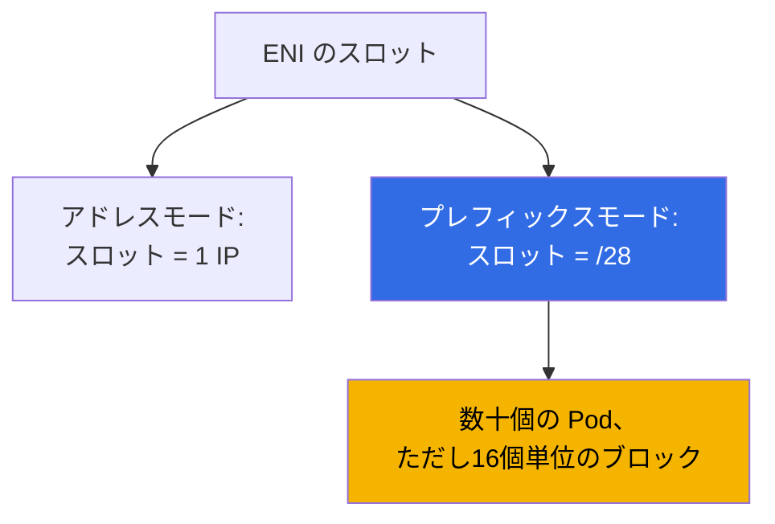
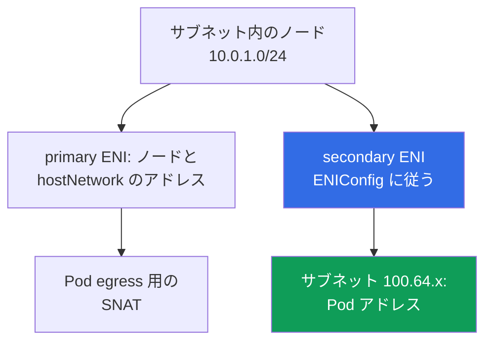

[Русская версия](ru.md) · [Eng version](en.md) · [Versión en español](es.md) · [Version française](fr.md) · [Deutsche Version](de.md) · [ქართული ვერსია](ge.md) · [繁體中文版](tw.md)
# 第7章. アドレス計画のスケーリング: prefix delegation、secondary CIDR、custom networking

> **この先の内容。** 第6章では、VPC CNI が Pod に実際のサブネットアドレスを割り当てる仕組みと、なぜそれが枯渇するのかを説明しました。本章では、その体系的な解決策として、prefix delegation、VPC の secondary CIDR、`ENIConfig` による custom networking、稼働中クラスターでの導入順序、そして運用上の変化を扱います。代替 CNI と Cilium は第8章、NetworkPolicy は第30章、ノード密度とサイジングは第14章、ネットワーク障害の分析は第46章で扱います。IPv6 クラスターは別の選択肢として触れますが、詳しくは扱いません。`ipFamily` は作成時にしか設定できないためです（第4章）。

## 7.1. 「サブネットが尽き、拡張もできない」場合の3つの答え

第6章の最悪の状況を考えます。ノード用サブネットは `/24`、稼働中 AZ の `AvailableIpAddressCount` はゼロに近づき、リリースは `FailedCreatePodSandBox` で止まります。`/24` を `/22` に拡張することはできませんが、クラスターはさらに拡張する必要があります。

- **同じノード上で同じアドレスからより多くの Pod を収容する** - prefix delegation: ENI スロットに `/28` ブロックを割り当てます。低コストですが、**サブネットのアドレス数は増えず**、大きな塊で消費します。
- **VPC に新しいアドレス空間を持ち込む** - secondary CIDR: 範囲を関連付け、サブネットを作成し、そこから Pod アドレスを割り当てます。範囲はルーティング、NAT、接続先ネットワークに通す必要があります。
- **IPv4 不足という問題自体から離れる** - IPv6 クラスター（7.9節）または overlay CNI（第8章）ですが、どちらも新しいクラスターでのみ可能です。

通常は最初の2つを組み合わせます。基準ごとの比較は7.6節にあります。

## 7.2. Prefix delegation: ENI スロットに /28 ブロックを割り当てる

通常モードでは、VPC CNI は ENI の1スロットを1つの secondary IPv4 アドレスに使用し、スロット数はインスタンスタイプで決まります（第6章）。Prefix delegation はスロットの内容を変えます。アドレスの代わりに、**`/28` プレフィックス、つまり16個のアドレス**を入れます。



```bash
kubectl set env daemonset aws-node -n kube-system ENABLE_PREFIX_DELEGATION=true
aws eks update-addon --cluster-name demo --addon-name vpc-cni \
  --configuration-values '{"env":{"ENABLE_PREFIX_DELEGATION":"true","WARM_PREFIX_TARGET":"1"}}' \
  --resolve-conflicts PRESERVE
```

1つ目のコマンドは、独自にインストールした CNI に適しています。**VPC CNI が managed addon として導入されている場合、`kubectl set env` による変更は次回のアドオン更新までしか維持されません**。そのため、2つ目のコマンドのように設定を通じて変数を指定します。これは本章のすべての変数に当てはまります（第37章）。

**ネットワークインターフェイス上のプレフィックスをサポートするのは Nitro ベースのインスタンスだけです**。それ以外は secondary アドレスを1つずつ取得し続けるため、混在した node group ではノードの挙動が異なります。大規模なフリートでは別の利点もあります。**EC2 API 呼び出しが減ります**。1リクエストで16アドレスを取得でき、準備済み ENI へのプレフィックスの関連付けは、新しい ENI の作成より高速です。

インターフェイス自身のアドレスで占有されるスロット以外は、それぞれ16アドレスを提供するため、Pod 上限は異なる数値で計算されます。

| インスタンス | ENI | ENI あたりの IP | アドレスモード | プレフィックスモード | managed node group の上限 |
|---|---|---|---|---|---|
| `m5.large` | 3 | 10 | 29 | 434 | 110 |
| `m5.xlarge` | 4 | 15 | 58 | 898 | 110 |
| `m5.8xlarge` | 8 | 30 | 234 | 3714 | 250 |

**Managed node group は prefix delegation に関係なく `maxPods` の上限を設けます。30 vCPU 未満のインスタンスでは110、それ以外では250です。** 変数を有効にしてもこの上限は上がりません。上限を超えるには、user data に `maxPods` を入れた launch template の独自 AMI（第10章）か、self-managed node group が必要です。理由は後方互換性です。デフォルトの `max-pods` テーブルはアドレスモード用に計算されているため、user data では明示的な `--max-pods` とともに `--use-max-pods false` を渡し、値自体は `--cni-prefix-delegation-enabled` フラグ付きの `max-pods-calculator.sh` で計算します。さらに重要なのは、**`kubelet` が `max-pods` を起動時に取得する**点です。そのため、アドレスモードからのノードは以前の値のままであり、prefix delegation は新しいノードのためのものです。

もう1つのコストは断片化です。プレフィックスには**連続した16アドレスのブロック**が必要です。サブネット内に secondary アドレスが散在していると、空きアドレスが多くても連続ブロックがない場合があります。`AvailableIpAddressCount` は数百アドレスを示していても Pod は起動せず、ipamd のログには `InsufficientCidrBlocks` が出ます。新しいサブネット、または **subnet CIDR reservation** で解決します。

```bash
aws ec2 create-subnet-cidr-reservation --subnet-id subnet-0123456789abcdef0 \
  --reservation-type prefix --cidr 10.0.1.128/25
aws ec2 describe-network-interfaces \
  --filters Name=attachment.instance-id,Values=i-0123456789abcdef0 \
  --query 'NetworkInterfaces[].[NetworkInterfaceId,Ipv4Prefixes[].Ipv4Prefix]' --output text
```

アドレスは**16個単位のブロック**で割り当てられます。各1 Pod のノード3台は、3個ではなく48個のアドレスを占有します。原則は、prefix delegation が改善するのは Pod 密度と API 呼び出しであってアドレス不足ではなく、不足時には新しいアドレス空間とともに有効化することです。

## 7.3. プレフィックスモードの warm プール

予備を持つロジックは第6章と同じですが、測定単位が異なります。

| 環境変数 | 予備として保持するもの | 優先順位 |
|---|---|---|
| `WARM_PREFIX_TARGET` | 現在の必要量を超える完全な `/28` プレフィックス | プレフィックスモードの基本値 |
| `WARM_IP_TARGET` | 現在の必要量を超える個別アドレス | `WARM_PREFIX_TARGET` を上書き |
| `MINIMUM_IP_TARGET` | ノード上のアドレス数の下限 | `WARM_PREFIX_TARGET` を上書き |

**`WARM_IP_TARGET` と `MINIMUM_IP_TARGET` はプレフィックスモードでも適用され、`WARM_PREFIX_TARGET` より優先されます。** `WARM_PREFIX_TARGET=1` は完全な余分のプレフィックスを1つ、ノードあたり最大16個の未使用アドレスとして保持します。一方、16未満の `WARM_IP_TARGET` は余分なプレフィックス全体の関連付けを避け、EC2 API 呼び出しが増える代わりにアドレスを節約します。

```bash
kubectl set env ds aws-node -n kube-system WARM_PREFIX_TARGET=1
kubectl set env ds aws-node -n kube-system WARM_IP_TARGET=8 MINIMUM_IP_TARGET=16
```

広いサブネットでは `WARM_PREFIX_TARGET=1` と高速な Pod 起動を維持し、狭いサブネットでは `WARM_IP_TARGET` と `MINIMUM_IP_TARGET` の組み合わせを追加します。優先順位を理解しないまま3つすべてを設定することは、説明できない挙動を招く方法です。

## 7.4. Secondary CIDR: 既存 VPC の新しいアドレス空間

追加の IPv4 ブロックを VPC に関連付け、その中にサブネットを作成します。既存のサブネットとノードには触れず、`local` ルートは自動的に追加されます。

```bash
vpc_id=$(aws eks describe-cluster --name demo \
  --query 'cluster.resourcesVpcConfig.vpcId' --output text)
aws ec2 associate-vpc-cidr-block --vpc-id $vpc_id --cidr-block 100.64.0.0/16
aws ec2 describe-vpcs --vpc-ids $vpc_id --output table \
  --query 'Vpcs[].CidrBlockAssociationSet[].{CIDR:CidrBlock,State:CidrBlockState.State}'
aws ec2 create-subnet --vpc-id $vpc_id --availability-zone eu-central-1a \
  --cidr-block 100.64.0.0/19 --query Subnet.SubnetId --output text
```

ブロックが使用可能になるのは `associated` 状態になってからです。それ以前にサブネットを作成するのは早すぎます。

**`100.64.0.0/10` を使う理由。** これは CG-NAT 用の RFC 6598 の shared address space です。正式には RFC 1918 のプライベート範囲ではないため、**企業ネットワークですでに使われていることはほとんどありません**。技術的な理由もあります。primary CIDR が `10.0.0.0/8` に含まれる VPC には、`172.16.0.0/12` や `192.168.0.0/16` のブロックを**追加できません**が、`100.64.0.0/10` のブロックは追加できます。

- **新しいサブネットは main route table を継承します**。VPC 内の接続性は確保されますが、インターネットへの egress は明示的に設定する必要があります。`100.64.x` の Pod には、primary 範囲のサブネットにある NAT gateway へのルートが必要です（第31章）。
- **接続先ネットワークが範囲を認識しない場合があります**。peering、Transit Gateway、VPN、Direct Connect が自動で `100.64.0.0/16` をルーティングし始めることはありません。多くの場合、それが目的です。Pod アドレスは外部からルーティングできません。
- **サイズとクォータ**: ブロックは `/16` から `/28` までです。既存ブロックや peered VPC の CIDR との重複は許可されません。

新しい空間を利用する最も簡単な方法は、**新しいサブネットに node group を作成すること**です。ノードと Pod の両方が、`aws-node` に変数を1つも設定せず `100.64.x` からアドレスを取得します。

## 7.5. Custom networking: 別サブネットから Pod アドレスを割り当てる

デフォルトでは、secondary ENI はノードの primary ENI があるサブネットに作成されます。Custom networking はこの結び付きを切り離します。**secondary ENI は `ENIConfig` オブジェクトで指定したサブネットと security groups に作成され**、Pod アドレスはそこから取得されます。サブネットはノードと同じ VPC、同じ AZ にある必要があります。



必須の手順は、AZ ごとに1つの `ENIConfig` オブジェクトを作成し、その後 `aws-node` に2つの変数を設定することです。`ENIConfig` では `spec.subnet` と `spec.securityGroups`（通常は cluster security group）を指定します。AZ に Pod 用サブネットが1つなら、オブジェクト名はゾーン名と同じにします。

```yaml
apiVersion: crd.k8s.amazonaws.com/v1alpha1
kind: ENIConfig
metadata:
  name: eu-central-1a          # AZ ごとにサブネットが1つなら、名前 = ゾーン名
spec:
  subnet: subnet-0123456789abcdef0   # 同じ AZ の 100.64.x サブネット
  securityGroups:
    - sg-0123456789abcdef0           # cluster security group
```

ノードのある各 AZ にオブジェクトを1つずつ適用し、名前と `subnet` を変更してから、変数を有効にします。そうしなければ、`ENIConfig` がない AZ のノードは Pod にアドレスを割り当てられません。

2つの仕組みを混同しないことが重要です。`ENIConfig` 内の `spec.securityGroups` は secondary ENI 用のグループであり、その `ENIConfig` を使う**そのノード上のすべての Pod**に適用されます。ここでの粒度は Pod 単位ではなくゾーン単位です。特定の Pod、またはセレクターで定義した Pod 群に SG が必要な場合は、別の仕組みである security groups for pods を使います。`SecurityGroupPolicy` リソースがセレクターにより SG リストを関連付け、VPC CNI はそのような Pod に個別の branch ENI を割り当てます（詳細と典型的な障害は第46章）。プレフィックスモードで `SecurityGroupPolicy` がない場合、Pod はノードの security group を共有します。

```bash
kubectl set env daemonset aws-node -n kube-system AWS_VPC_K8S_CNI_CUSTOM_NETWORK_CFG=true
kubectl set env daemonset aws-node -n kube-system ENI_CONFIG_LABEL_DEF=topology.kubernetes.io/zone
kubectl get eniconfigs
```

`ENI_CONFIG_LABEL_DEF=topology.kubernetes.io/zone` は自動選択を有効にします。ノードはゾーンラベルを読み、同名の `ENIConfig` を取得します。ゾーン内に Pod 用サブネットが複数ある場合、ノードに `k8s.amazonaws.com/eniConfig` アノテーションを付ける必要があります。

- **ノードの primary ENI は Pod アドレスの割り当てに使われません**。そのため実効的な `max-pods` は下がります。計算式からインターフェイス全体が1つ抜けるので、`m5.large` では29ではなく20 Pod になります。プレフィックスで補えます。`(3 - 1) * (10 - 1) * 16 + 2` は290になります。
- **既存ノードの挙動は変わりません**。このモードは変数を有効にした後に起動したノードでのみ動作するため、フリートを再作成する必要があります（7.7節）。IPv6 とは互換性がありません。
- **Egress はデフォルトで primary ENI を経由します**。`AWS_VPC_K8S_CNI_EXTERNALSNAT=false` の場合、VPC CIDR 外のアドレスへのトラフィックは、`ENIConfig` のものではなく primary ENI のサブネットと security groups を使用して送信されます。`hostNetwork: true` の Pod もノードアドレスのままです。
- **診断が複雑になります**。ノードとその Pod のアドレスは異なる範囲にあり、security groups も異なる可能性があります。「なぜ Pod に到達できなかったのか」を調べるには、パケットがどの ENI を通ったかを見る必要があります（7.8節）。

**SNAT を外す場合。** 同じ egress をノードレベルの SNAT から外すこともできます。`AWS_VPC_K8S_CNI_EXTERNALSNAT=true` ではマスカレードルールが設定されず、VPC CIDR 外のアドレスへのパケットはノードの primary アドレスに置き換えられず、実際の Pod アドレスのまま送信されます。これは2つの場合に必要です。Pod が独自の NAT gateway、Transit Gateway、または Direct Connect を経由してデータセンター、peered VPC、VPN に接続し、接続先が Pod アドレスを見る必要がある場合、または外部リソースが Pod への接続を開始する必要がある場合です。代償として、接続先ネットワークは Pod 範囲をルーティングしなければならず、`true` では internet gateway を通る直接のインターネット egress は動作しなくなります。NAT gateway へのルートが必要です（第31章）。

より簡単な手段もあります。**Enhanced subnet discovery** です。VPC CNI `1.18.0` 以降はデフォルトで（`ENABLE_SUBNET_DISCOVERY=true`）、VPC と AZ 内で `kubernetes.io/role/cni=1` タグが付いたサブネットを自動検出します（`aws ec2 create-tags --resources <subnet-id> --tags Key=kubernetes.io/role/cni,Value=1`）。Pod は**`ENIConfig` なし、かつ primary ENI を失わずに**新しいサブネットからアドレスを取得するため、`max-pods` のペナルティはありません。Custom networking は security groups と分離の要件に用いるもので、両方が有効な場合は custom networking が優先されます。

## 7.6. 選び方

| 基準 | Prefix delegation | Secondary CIDR と node group | Custom networking | サブネットタグ `cni=1` | IPv6 クラスター |
|---|---|---|---|---|---|
| 導入の複雑さ | 低い | 中程度 | 高い | 低い | 新規クラスターのみ |
| 新しいアドレスを提供するか | いいえ | はい | はい | はい | はい |
| `max-pods` への影響 | 上昇、上限まで | なし | 低下、ENI 1つ分減少 | なし | 上昇、プレフィックス |
| ノードの再作成 | はい、新しい `max-pods` のため | はい、新しいサブネット | はい、必須 | いいえ | はい |
| 接続先ネットワークでの Pod アドレス | 従来どおり | ルートがある場合のみ | ルートがある場合のみ | サブネットに依存 | IPv6 ルート経由 |
| Pod 用の独自 security groups | いいえ | いいえ | はい | いいえ | いいえ |
| 要件 | Nitro | VPC の CIDR クォータ | AZ ごとの `ENIConfig` | VPC CNI `1.18.0`+ | Nitro、新規クラスター |

サブネットが広く、Pod がノードに収まらないなら prefix delegation を使い、複雑にしません。アドレスが尽きたなら secondary CIDR を使い、その後に新しい node group、サブネットタグ、custom networking から選びます。custom networking を選ぶ理由はアドレスではなく分離要件です。IPv6 はクラスター作成時に選択します。

## 7.7. ダウンタイムなしで稼働中クラスターへ導入する順序

3つの仕組みには共通の性質があります。**挙動を変えるのは新しいノードだけです**。

1. **アドレスを準備する。** secondary CIDR を関連付け、AZ ごとに1つのサブネットとルーティングテーブルを作成し、必要に応じて subnet CIDR reservation を作成します。
2. **CNI 設定を変更する。** managed addon の設定を通じて行います（第37章）。Custom networking では、まずすべてのゾーンに `ENIConfig` を適用し、その後に `AWS_VPC_K8S_CNI_CUSTOM_NETWORK_CFG` を有効にします。
3. **新しい node group を起動する。** 必要なサブネット上、Nitro インスタンス上に作成し、上限を超える `maxPods` が必要なら user data に指定します。新しいノード上の Pod アドレスを確認します。
4. **ワークロードを移動する。** PDB を考慮しながら古いノードを1台ずつ cordon と drain し（第40章）、その後に古い node group を削除します。プレフィックスへの移行に rolling replacement は推奨しません。アドレスとプレフィックスが混在するノードは容量を一貫して報告しないためです。

最後だけでなく、各段階で確認します。

```bash
kubectl get nodes -o custom-columns='NODE:.metadata.name,PODS:.status.allocatable.pods'
kubectl get pods -A -o wide | grep -c ' 100\.64\.'
kubectl get eniconfigs -o custom-columns='NAME:.metadata.name,SUBNET:.spec.subnet'
```

これらのコマンドは、新しいノードで `max-pods` が上がったか、Pod アドレスが新しい範囲から取得されているか、ノードがある各ゾーンに `ENIConfig` があるかを示します。`ENIConfig` がないゾーンのノードは Pod にアドレスを割り当てられず、サブネットが完全には埋まっていないだけで、症状は同じ `FailedCreatePodSandBox` になります。

## 7.8. 導入後の運用

残りアドレスの監視はより精密になります。サブネットと AZ ごとに数え、プレフィックスモードでは残数だけでなく連続ブロックの有無も見ます。

```bash
aws ec2 describe-subnets --filters Name=vpc-id,Values=vpc-0123456789abcdef0 --output table \
  --query 'Subnets[].[SubnetId,AvailabilityZone,CidrBlock,AvailableIpAddressCount]'
aws ec2 describe-network-interfaces --filters Name=vpc-id,Values=vpc-0123456789abcdef0 \
  --query 'NetworkInterfaces[].[NetworkInterfaceId,SubnetId,length(Ipv4Prefixes)]' --output text
```

診断で変わる最も重要な点は、Pod アドレスがノードのサブネットを示さなくなることです。確認順序は、ノード、その ENI、その ENI のサブネット、サブネットの security groups となります。

- **プレフィックスなしの古いノード。** フリートの一部は以前の `max-pods` のままで、Pod の分散が不均一になります。変数を変更するのではなく、ノードを置き換えて解決します。
- **アドオンが変数を上書きした。** managed addon の更新が値を戻し、新しいノードがアドレスモードで起動しました。各更新後に確認します。
- **すべての AZ に `ENIConfig` がない。** Karpenter が4つ目のゾーンでノードを起動するまでは、クラスターは動作していました。隣り合わせの問題は「`ENIConfig` が満杯のサブネットを指している」ことで、不足が再発します。
- **不足ではなく断片化**: 残りアドレスは多いのに、ログに `InsufficientCidrBlocks` が出ます。**混在するインスタンスタイプ**: 非 Nitro インスタンスはプレフィックスを取得できず、グループ内で最小の `max-pods` がすべてのノードに適用されます。
- **Karpenter の広すぎるタイプ一覧。** 同じ罠の別の例です。広い要件を持つ spot プールには、Nitro を持たない古いファミリー（`t2`、`m4`、`c4`）が入り得ます。そのようなノードは、残りのプールより明らかに低い密度のアドレスモードで起動します。フリートは均一に見えても、Pod の分散は不均一になります。NodePool の要件を絞り、値を `nitro` とする `karpenter.k8s.aws/instance-hypervisor` ラベル、または `karpenter.k8s.aws/instance-generation` による古い世代の除外で解決します（第12章、第13章）。

## 7.9. IPv6 クラスター: 抜本的な選択肢の概要

`ipFamily: ipv6` のクラスターでは、Pod と Service が IPv6 アドレスを取得し、VPC CNI は `/80` プレフィックスモードで動作します。不足は実質的にほぼ解消されます。この選択には3つのコストがあります。

- **クラスター作成時のみ。** `ipFamily` は変更できず、EKS は Pod と Service の dual-stack をサポートせず、custom networking は IPv6 と互換性がありません。移行には新しいクラスターとワークロードの移行が必要です（第4章、第38章）。
- **アプリケーション互換性。** 設定内のアドレスリテラル、ライブラリ、エージェント、外部システムのすべてが IPv6 を扱える必要があります。Nitro は必須で、Windows ノードはサポートされません。
- **IPv4 への egress。** Pod は IPv6 アドレスに加えて、control plane から見えない host-local IPv4 アドレスも取得します。IPv4 リソースに接続すると、ノード自身で NAT が動作してノードの primary IPv4 アドレスへ SNAT します。この**組み込みの仕組みにより、VPC 側で DNS64 と NAT64 は不要になります**。

要するに IPv6 は「次のクラスターをどう構築するか」には良い答えですが、「金曜日にこのクラスターをどうするか」には悪い答えです。

## 7.10. 本番環境での使い方

- **新しいクラスターでは prefix delegation をデフォルトで有効にする**。`WARM_PREFIX_TARGET` と Nitro インスタンスも併用します。負荷がかかってからこの問題に戻るより低コストです。
- **Pod 用サブネットは `100.64.0.0/10` から確保する**。VPC 設計時に行います。ルーティングされない Pod 用空間を使うことで、RFC 1918 をロードバランサーと NAT 用に残せます。
- **VPC CNI の変数は、稼働中 DaemonSet ではなく managed addon の設定と Terraform コードで管理する**。`kubectl set env` による変更は次回のアドオン更新までしか持ちません。
- **各サブネットと AZ の残りアドレスにアラートを設定する**。プレフィックスモードでは、`aws-node` のログにある `InsufficientCidrBlocks` にもアラートを追加します。

## 7.11. ミニ用語集

- **Prefix delegation** - ENI スロットが `/28` プレフィックス（16アドレス）を保持するモードです。`ENABLE_PREFIX_DELEGATION` で有効にし、Nitro が必要です。**`WARM_PREFIX_TARGET`** はノード上のプレフィックス予備で、`WARM_IP_TARGET` と `MINIMUM_IP_TARGET` がこれより優先されます。
- **Subnet CIDR reservation** - プレフィックス用にサブネット内の連続ブロックを予約することです。**`InsufficientCidrBlocks`** - 形式上は空きアドレスがあるにもかかわらず連続ブロックがないことを示す EC2 API エラーです。
- **Secondary CIDR** - VPC の追加 IPv4 ブロックです。EKS では通常 `100.64.0.0/10`（RFC 6598）から使います。**Custom networking** - secondary ENI と Pod アドレスを、AZ ごとに1つの **`ENIConfig`** オブジェクトで指定したサブネットと security groups から取得するモードで、選択には `ENI_CONFIG_LABEL_DEF` のラベルを使います。**Enhanced subnet discovery** - `ENIConfig` を使わず、`kubernetes.io/role/cni=1` タグを持つサブネットを使う仕組みです。**`AWS_VPC_K8S_CNI_EXTERNALSNAT`** - Pod egress のノード SNAT を外す（`true`）ため、外部側から実際の Pod アドレスが見えるようになります。この場合、インターネット egress は NAT gateway 経由のみになります。**`ipFamily`** - クラスターのアドレスファミリーで、作成時にのみ設定します。

## 7.12. 章のまとめ

- サブネットは拡張できないため、選択肢は3つです。ENI スロットあたりのアドレスを増やす、VPC に新しいアドレス空間を追加する、IPv4 から離れることです。最初の2つはよく併用されます。
- Prefix delegation は `aws-node` の `ENABLE_PREFIX_DELEGATION=true` で有効にし、Nitro が必要で、EC2 API 呼び出しを節約します。しかし managed node group はプレフィックスに関係なく110と250の上限を維持し、`max-pods` はノード起動時に固定されます。またアドレスは16個単位で割り当てられ、サブネットを断片化します。
- 予備は `WARM_PREFIX_TARGET` で指定しますが、`WARM_IP_TARGET` と `MINIMUM_IP_TARGET` も適用され、これを上書きします。そのため、余分なプレフィックス全体を保持せずに済みます。
- `100.64.0.0/10` の secondary CIDR は企業ネットワークと重複せず、RFC 1918 ブロックが禁止される場所でも許可されますが、ルーティングと NAT に注意が必要です。
- `ENIConfig` による custom networking は Pod に別のサブネットと security groups を提供しますが、primary ENI をアドレス割り当てから外し、`max-pods` を下げ、ノードの再作成が必要です。より簡単な方法は、新しいサブネットの node group または `kubernetes.io/role/cni=1` タグです。
- どの変更も新しいノードにしか適用されません。まずアドレスと設定、次に新しい node group、最後に古いノードを drain します。IPv6 は不足を完全に解消しますが、クラスター作成時にしか選択できず、アプリケーション互換性と IPv4 への egress を伴います。

## 7.13. 実務でどう役立つか

アドレス不足は警告なしに発生し、すぐに「リリースが展開できない」という形で現れます。計画があるエンジニアとないエンジニアの差は、数時間の停止時間として現れます。前者は、prefix delegation が密度を上げてもアドレスは追加しないこと、secondary CIDR は1分で関連付けられてもルートと NAT にはより時間がかかること、変更がクラスターに届くのは新しいノードからであることを知っています。平時には、これが設計に生かされます。Pod 用サブネットをノードから分離し、初日からプレフィックスを使い、CNI 変数を Git 内のアドオン設定に置きます。

## 7.14. セルフチェック問題

1. Prefix delegation が枯渇したサブネットの問題を解決せず、ときに悪化させるのはなぜですか？
2. `ENABLE_PREFIX_DELEGATION=true` を有効にしましたが、`allocatable.pods` は変わりません。理由を2つ挙げてください。
3. プレフィックスモードにおけるインスタンスタイプの要件は何で、混在グループではなぜ危険ですか？
4. サブネットの残りアドレスは400ですが、`aws-node` のログには `InsufficientCidrBlocks` があります。何をしますか？
5. `WARM_PREFIX_TARGET`、`WARM_IP_TARGET`、`MINIMUM_IP_TARGET` はどう関係しますか？
6. Pod 用に `192.168.0.0/16` の空きブロックではなく、`100.64.0.0/10` を使うのはなぜですか？
7. Pod がインターネットとデータセンターへ到達できるようにするには、`associate-vpc-cidr-block` の後で何をする必要がありますか？
8. Custom networking に必須の要素は何で、なぜ各 AZ に `ENIConfig` を作成しますか？
9. `ENIConfig` の `spec.securityGroups` は、対象範囲の点で `SecurityGroupPolicy` とどう異なりますか？
10. Custom networking で `max-pods` が下がるのはなぜで、何で補えますか？
11. Enhanced subnet discovery は custom networking とどう異なり、どのような場合に不十分ですか？
12. ダウンタイムなしで、稼働中クラスターに prefix delegation を導入する順序を説明してください。
13. VPC CNI アドオンの更新後に何を確認すべきで、IPv6 が現在のクラスターを救えないのはなぜですか？
14. `AWS_VPC_K8S_CNI_EXTERNALSNAT=true` はいつ有効にし、その場合 egress で何が動かなくなりますか？

## 演習

このテーマのコースラボは、[ラボ 103 - アドレス計画: ENI 制限、prefix delegation、secondary CIDR](../../labs/103/README_JP.MD)です。これに加え、内容を稼働中クラスターで確認してください。まず CNI の動作モードから始めます。
`kubectl describe ds aws-node -n kube-system | grep -e PREFIX -e WARM_ -e CUSTOM_NETWORK -e
SUBNET_DISCOVERY`。次に、`Name=attachment.instance-id` フィルターと
`Ipv4Prefixes[].Ipv4Prefix` クエリを指定した `aws ec2
describe-network-interfaces` で、ノードのインターフェイス上のプレフィックスを確認します。secondary アドレス一覧が空でないのにプレフィックス一覧が空なら、通常のアドレスモードです。Pod 上限は、`kubectl get nodes -o
custom-columns='NODE:.metadata.name,PODS:.status.allocatable.pods'` で確認します。異なるタイプで同じ110なら、それは managed node group の上限です。

テストクラスターでは、全経路を実施してください。`aws ec2
associate-vpc-cidr-block` で `100.64.0.0/16` を関連付け、`aws ec2 create-subnet` で AZ ごとにサブネットを作成し、各ゾーンに `ENIConfig` を適用して `kubectl get eniconfigs` を確認し、`AWS_VPC_K8S_CNI_CUSTOM_NETWORK_CFG` と `ENI_CONFIG_LABEL_DEF` を有効にして、新しい node group を起動します。新しい Pod が `100.64.x` からアドレスを取得し、古いノードは従来どおり動作していることを確認します。あわせて、`AvailableIpAddressCount` を指定した `aws ec2 describe-subnets` で残りアドレスを比較します。

---
[目次](../README_JP.md) · [第6章](../06/jp.md) · [第8章](../08/jp.md)
