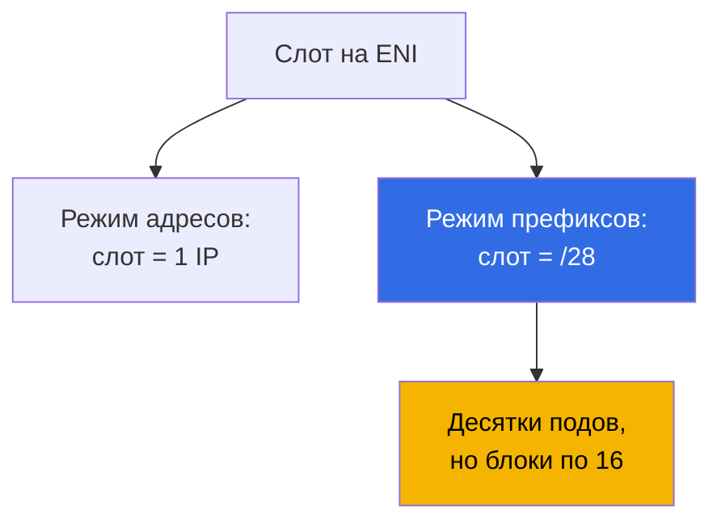
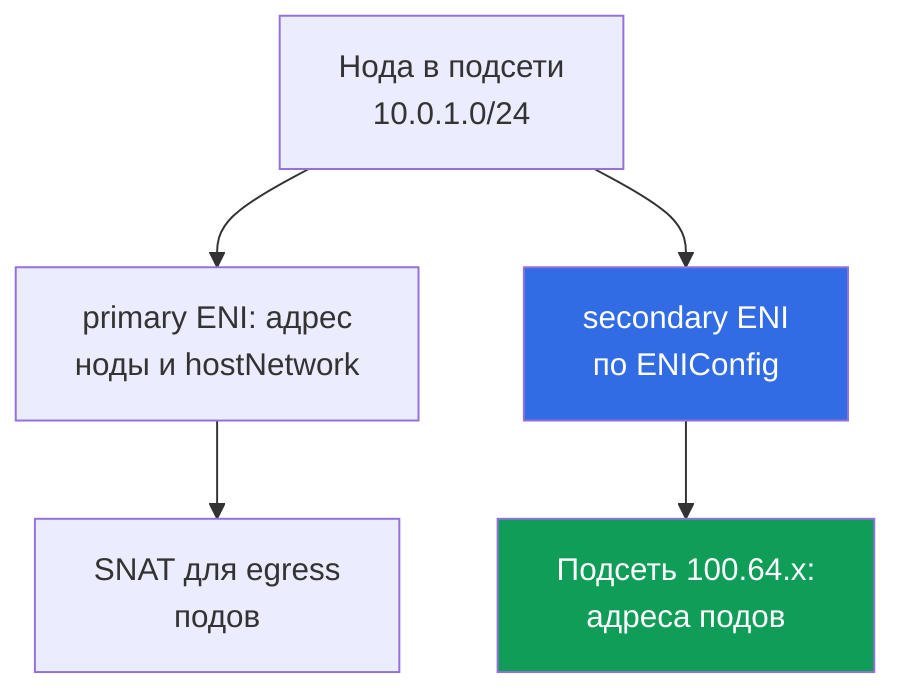

[Eng version](en.md) · [Versión en español](es.md) · [Version française](fr.md) · [Deutsche Version](de.md) · [ქართული ვერსია](ge.md) · [繁體中文版](tw.md) · [日本語版](jp.md)
# Глава 7. Масштаб адресного плана: prefix delegation, secondary CIDR, custom networking

> **Что дальше.** В главе 6 разобрано, как VPC CNI выдаёт подам реальные адреса подсети и
> почему они кончаются. Здесь системные выходы: prefix delegation, secondary CIDR у VPC,
> custom networking через `ENIConfig`, порядок внедрения в живом кластере и то, что меняется в
> эксплуатации. Альтернативные CNI и Cilium - глава 8, NetworkPolicy - глава 30, плотность и
> сайзинг нод - глава 14, разбор сетевых сбоев - глава 46. IPv6-кластер назван как отдельный
> путь, но подробно не разбирается: `ipFamily` задаётся только при создании (глава 4).

## 7.1. Три ответа на «подсеть кончилась, расширить нельзя»

Ситуация из главы 6 в худшем виде: подсети под ноды взяты как `/24`, `AvailableIpAddressCount`
в рабочей AZ подходит к нулю, релиз упирается в `FailedCreatePodSandBox`. Расширить `/24` до
`/22` нельзя, а кластер надо растить дальше.

- **Выжать больше подов из тех же адресов на ноде** - prefix delegation: слот на ENI отдаётся
  под блок `/28`. Дешево, но **адресов в подсети не добавляет**, расходует их крупными
  кусками.
- **Принести в VPC новое адресное пространство** - secondary CIDR: привязать диапазон, создать
  подсети, отдать адреса подам. Диапазон надо провести через маршрутизацию, NAT и связанные
  сети.
- **Уйти от дефицита IPv4 как класса** - IPv6-кластер (раздел 7.9) или overlay-CNI (глава 8),
  но только на новом кластере.

Первые два ответа обычно комбинируют, сравнение по критериям - в разделе 7.6.

## 7.2. Prefix delegation: слот на ENI отдаётся под блок /28

В обычном режиме VPC CNI занимает на ENI слот под один вторичный адрес IPv4, а число слотов
задано типом инстанса (глава 6). Prefix delegation меняет содержимое слота: вместо адреса в
него кладётся **префикс `/28`, то есть 16 адресов**.



```bash
kubectl set env daemonset aws-node -n kube-system ENABLE_PREFIX_DELEGATION=true
aws eks update-addon --cluster-name demo --addon-name vpc-cni \
  --configuration-values '{"env":{"ENABLE_PREFIX_DELEGATION":"true","WARM_PREFIX_TARGET":"1"}}' \
  --resolve-conflicts PRESERVE
```

Первая команда годится для самостоятельно установленного CNI. **Если VPC CNI стоит как managed
addon, правка через `kubectl set env` живёт до следующего обновления аддона**, поэтому
переменные задают через его конфигурацию, как во второй команде. Это касается всех переменных
главы (глава 37).

**Префиксы на сетевых интерфейсах поддерживают только инстансы на базе Nitro**: остальные
продолжат брать вторичные адреса по одному, и в смешанной node group поведение нод окажется
разным. Плюс режима для крупных парков: **вызовов EC2 API меньше**, один запрос приносит 16
адресов, а привязка префикса к готовому ENI быстрее создания нового.

Каждый слот, кроме занятого адресом самого интерфейса, приносит 16 адресов, и потолок подов
считается по другим числам.

| Инстанс | ENI | IP на ENI | Адресный режим | Режим префиксов | Кэп managed node group |
|---|---|---|---|---|---|
| `m5.large` | 3 | 10 | 29 | 434 | 110 |
| `m5.xlarge` | 4 | 15 | 58 | 898 | 110 |
| `m5.8xlarge` | 8 | 30 | 234 | 3714 | 250 |

**Managed node groups ограничивают `maxPods` сверху независимо от prefix delegation: 110 для
инстансов меньше 30 vCPU и 250 для остальных.** Включение переменной потолок не поднимет:
больше даст только свой AMI в launch template с `maxPods` в user data (глава 10) или
self-managed node group. Причина в обратной совместимости: таблица `max-pods` по умолчанию
рассчитана на адресный режим, поэтому в user data передают `--use-max-pods false` вместе с
явным `--max-pods`, а само значение считают скриптом `max-pods-calculator.sh` с флагом
`--cni-prefix-delegation-enabled`. И главное: **`kubelet` узнаёт `max-pods` при старте**,
поэтому нода из адресного режима останется с прежним значением, prefix delegation - это про
новые ноды.

Вторая часть цены - фрагментация. Префикс требует **непрерывный блок из 16 адресов**, а там,
где по подсети вразброс живут вторичные адреса, свободных адресов много, а непрерывных блоков
нет: `AvailableIpAddressCount` показывает сотни адресов, поды не стартуют, в логах ipamd
`InsufficientCidrBlocks`. Лечится новой подсетью или **subnet CIDR reservation**.

```bash
aws ec2 create-subnet-cidr-reservation --subnet-id subnet-0123456789abcdef0 \
  --reservation-type prefix --cidr 10.0.1.128/25
aws ec2 describe-network-interfaces \
  --filters Name=attachment.instance-id,Values=i-0123456789abcdef0 \
  --query 'NetworkInterfaces[].[NetworkInterfaceId,Ipv4Prefixes[].Ipv4Prefix]' --output text
```

Адреса уходят **блоками по 16**: три ноды с одним подом каждая заняли 48 адресов вместо трёх.
Правило: prefix delegation лечит плотность подов и вызовы API, а не дефицит адресов, и при
дефиците его включают вместе с новым пространством.

## 7.3. Warm-пул в режиме префиксов

Логика запаса та же, что в главе 6, но единица измерения другая.

| Переменная окружения | Что держит в запасе | Приоритет |
|---|---|---|
| `WARM_PREFIX_TARGET` | целые префиксы `/28` сверх текущей нужды | базовая для режима префиксов |
| `WARM_IP_TARGET` | отдельные адреса сверх текущей нужды | перекрывает `WARM_PREFIX_TARGET` |
| `MINIMUM_IP_TARGET` | нижнюю границу адресов на ноде | перекрывает `WARM_PREFIX_TARGET` |

**`WARM_IP_TARGET` и `MINIMUM_IP_TARGET` применимы в режиме префиксов и имеют приоритет над
`WARM_PREFIX_TARGET`.** `WARM_PREFIX_TARGET=1` держит целый лишний префикс, до 16
неиспользуемых адресов на ноду, а `WARM_IP_TARGET` меньше 16 не даёт привязать лишний префикс
целиком и экономит адреса ценой более частых обращений к EC2 API.

```bash
kubectl set env ds aws-node -n kube-system WARM_PREFIX_TARGET=1
kubectl set env ds aws-node -n kube-system WARM_IP_TARGET=8 MINIMUM_IP_TARGET=16
```

На широких подсетях оставляют `WARM_PREFIX_TARGET=1` и быстрый старт подов, на узких добавляют
пару `WARM_IP_TARGET` и `MINIMUM_IP_TARGET`. Задать все три сразу, не понимая приоритета, -
способ получить необъяснимое поведение.

## 7.4. Secondary CIDR: новое адресное пространство в существующей VPC

К VPC привязываются дополнительные блоки IPv4, и в них создаются подсети. Существующие подсети
и ноды не трогаются, маршрут `local` добавляется автоматически.

```bash
vpc_id=$(aws eks describe-cluster --name demo \
  --query 'cluster.resourcesVpcConfig.vpcId' --output text)
aws ec2 associate-vpc-cidr-block --vpc-id $vpc_id --cidr-block 100.64.0.0/16
aws ec2 describe-vpcs --vpc-ids $vpc_id --output table \
  --query 'Vpcs[].CidrBlockAssociationSet[].{CIDR:CidrBlock,State:CidrBlockState.State}'
aws ec2 create-subnet --vpc-id $vpc_id --availability-zone eu-central-1a \
  --cidr-block 100.64.0.0/19 --query Subnet.SubnetId --output text
```

Блок пригоден к использованию только в состоянии `associated`, до этого создавать подсети
рано.

**Почему берут `100.64.0.0/10`.** Это shared address space из RFC 6598 под CG-NAT. Формально
это не приватный диапазон RFC 1918, и потому **в корпоративных сетях он почти никогда не
занят**. Есть и техническая причина: к VPC с primary CIDR из `10.0.0.0/8` **нельзя** добавить
блок из `172.16.0.0/12` или `192.168.0.0/16`, а блок из `100.64.0.0/10` можно.

- **Новые подсети наследуют main route table**: связность внутри VPC будет, а выход в интернет
  надо задать явно. Поду в `100.64.x` нужен маршрут до NAT gateway, который живёт в подсети
  основного диапазона (глава 31).
- **Связанные сети могут не знать диапазон**: peering, Transit Gateway, VPN и Direct Connect
  не начнут маршрутизировать `100.64.0.0/16` сами. Часто это и есть цель: адреса подов
  нероутируемы снаружи.
- **Размер и квоты**: блок от `/16` до `/28`, перекрытия с существующими блоками и с CIDR
  peered VPC недопустимы.

Простейший способ воспользоваться новым пространством - **поднять node group в новых
подсетях**: и ноды, и поды получат адреса из `100.64.x` без единой переменной у `aws-node`.

## 7.5. Custom networking: адреса подов из отдельных подсетей

По умолчанию secondary ENI создаются в подсети primary ENI ноды. Custom networking разрывает
связь: **secondary ENI создаются в подсети и с security groups из объекта `ENIConfig`**,
адреса подов берутся оттуда, а подсети должны быть в той же VPC и той же AZ, что нода.



Обязательные шаги: по объекту `ENIConfig` на каждую AZ, затем две переменные у `aws-node`. В
`ENIConfig` задают `spec.subnet` и `spec.securityGroups` (обычно cluster security group), а
имя объекта делают равным имени зоны, если подсеть под поды в зоне одна.

```yaml
apiVersion: crd.k8s.amazonaws.com/v1alpha1
kind: ENIConfig
metadata:
  name: eu-central-1a          # имя = имя зоны при одной подсети на AZ
spec:
  subnet: subnet-0123456789abcdef0   # подсеть 100.64.x в этой же AZ
  securityGroups:
    - sg-0123456789abcdef0           # cluster security group
```

Объект применяют по одному на каждую AZ с нодами, меняя имя и `subnet`, и только потом
включают переменные - иначе нода в зоне без `ENIConfig` подам адреса не выдаст.

Важно не путать два механизма. `spec.securityGroups` в `ENIConfig` - это группы для secondary
ENI, то есть **для всех подов этой ноды**, взявших данный `ENIConfig`: гранулярность здесь
зональная, а не подовая. Если SG нужна конкретному поду или набору подов по селектору, это
другой механизм - security groups for pods: ресурс `SecurityGroupPolicy` привязывает список SG
по селектору, а VPC CNI выдаёт таким подам отдельную branch ENI (разбор и типовые сбои - глава
46). В режиме префиксов, без `SecurityGroupPolicy`, поды делят security group ноды.

```bash
kubectl set env daemonset aws-node -n kube-system AWS_VPC_K8S_CNI_CUSTOM_NETWORK_CFG=true
kubectl set env daemonset aws-node -n kube-system ENI_CONFIG_LABEL_DEF=topology.kubernetes.io/zone
kubectl get eniconfigs
```

`ENI_CONFIG_LABEL_DEF=topology.kubernetes.io/zone` включает автоматический выбор: нода читает
метку зоны и берёт одноимённый `ENIConfig`. Если подсетей под поды в зоне несколько, ноды
придётся размечать аннотацией `k8s.amazonaws.com/eniConfig`.

- **Primary ENI ноды не участвует в выдаче адресов подам**, поэтому фактический `max-pods`
  падает: в формуле пропадает целый интерфейс, для `m5.large` это 20 подов вместо 29.
  Компенсируется префиксами: `(3 - 1) * (10 - 1) * 16 + 2` даёт 290.
- **Существующие ноды поведение не меняют**: режим работает только на нодах, поднявшихся после
  включения переменных, поэтому парк надо пересоздать (раздел 7.7). С IPv6 несовместим.
- **Egress по умолчанию идёт через primary ENI**: при `AWS_VPC_K8S_CNI_EXTERNALSNAT=false`
  трафик к адресам вне CIDR вашей VPC уходит с подсетью и security groups primary ENI, а не с
  теми, что в `ENIConfig`. Поды с `hostNetwork: true` тоже остаются на адресе ноды.
- **Диагностика усложняется**: адреса ноды и её подов из разных диапазонов, security groups
  могут различаться, и «почему под не достучался» требует смотреть, каким ENI ушёл пакет
  (раздел 7.8).

**Когда SNAT снимают.** Тот же egress можно вывести из-под узлового SNAT: при
`AWS_VPC_K8S_CNI_EXTERNALSNAT=true` правило маскарадинга не ставится, и пакет к адресам вне
CIDR VPC уходит с реальным адресом пода, а не подменяется на primary-адрес ноды. Это нужно в
двух случаях: под ходит в дата-центр, peered VPC или VPN через свой NAT gateway, Transit
Gateway либо Direct Connect, и на той стороне требуется видеть адрес пода; либо внешний ресурс
должен сам инициировать соединение к поду. Цена: связанные сети обязаны маршрутизировать
диапазон подов, а прямой выход в интернет через internet gateway при `true` перестаёт работать
- нужен маршрут на NAT gateway (глава 31).

Есть инструмент попроще. **Enhanced subnet discovery**: VPC CNI `1.18.0` и новее по умолчанию
(`ENABLE_SUBNET_DISCOVERY=true`) сам находит подсети своей VPC и AZ с тегом
`kubernetes.io/role/cni=1` (`aws ec2 create-tags --resources <subnet-id> --tags
Key=kubernetes.io/role/cni,Value=1`). Поды получают адреса из новых подсетей **без `ENIConfig`
и без потери primary ENI**, то есть без штрафа по `max-pods`. Custom networking нужен под
требования к security groups и изоляции, и он имеет приоритет, если включены оба механизма.

## 7.6. Как выбирать

| Критерий | Prefix delegation | Secondary CIDR плюс node group | Custom networking | Тег подсети `cni=1` | IPv6-кластер |
|---|---|---|---|---|---|
| Сложность внедрения | низкая | средняя | высокая | низкая | только новый кластер |
| Даёт новые адреса | нет | да | да | да | да |
| Влияние на `max-pods` | вверх, до кэпа | нет | вниз, минус ENI | нет | вверх, префиксы |
| Пересоздание нод | да, для нового `max-pods` | да, новые подсети | да, обязательно | нет | да |
| Адреса подов в связанных сетях | как раньше | только с маршрутами | только с маршрутами | зависит от подсети | по IPv6-маршрутам |
| Свои security groups подам | нет | нет | да | нет | нет |
| Требования | Nitro | квота CIDR у VPC | `ENIConfig` на каждую AZ | VPC CNI `1.18.0`+ | Nitro, новый кластер |

Подсети широкие, а поды не влезают на ноду - prefix delegation и не усложнять. Кончились
адреса - secondary CIDR, дальше выбор между новой node group, тегом подсети и custom
networking, который берут из-за требований к изоляции, а не из-за адресов; IPv6 - на старте
кластера.

## 7.7. Порядок внедрения в живом кластере без даунтайма

У всех трёх механизмов общее свойство: **они меняют поведение только новых нод**.

1. **Подготовить адреса.** Привязать secondary CIDR, создать подсети по одной на AZ и таблицы
   маршрутизации, при необходимости сделать subnet CIDR reservation.
2. **Изменить конфигурацию CNI** через конфигурацию managed addon (глава 37). Для custom
   networking сначала применить `ENIConfig` на все зоны, только потом включать
   `AWS_VPC_K8S_CNI_CUSTOM_NETWORK_CFG`.
3. **Поднять новую node group** в нужных подсетях, на Nitro-инстансах, с `maxPods` в user
   data, если нужен потолок выше кэпа. Проверить адреса подов на новых нодах.
4. **Переселить нагрузку.** Cordon и drain старых нод по одной с оглядкой на PDB (глава 40),
   затем удалить старую node group. Rolling replacement для перехода на префиксы не
   рекомендуется: нода со смесью адресов и префиксов объявляет ёмкость непоследовательно.

Проверять надо на каждом шаге, а не в конце:

```bash
kubectl get nodes -o custom-columns='NODE:.metadata.name,PODS:.status.allocatable.pods'
kubectl get pods -A -o wide | grep -c ' 100\.64\.'
kubectl get eniconfigs -o custom-columns='NAME:.metadata.name,SUBNET:.spec.subnet'
```

Команды показывают: поднялся ли `max-pods` на новых нодах, из нового ли диапазона адреса
подов, есть ли `ENIConfig` на каждую зону с нодами. Нода в зоне без `ENIConfig` подам адреса
не выдаст, и симптом будет тот же `FailedCreatePodSandBox`, только при полной подсети.

## 7.8. Эксплуатация после внедрения

Мониторинг остатка адресов становится точнее: считать по каждой подсети и AZ, а в режиме
префиксов смотреть не только остаток, но и наличие непрерывных блоков.

```bash
aws ec2 describe-subnets --filters Name=vpc-id,Values=vpc-0123456789abcdef0 --output table \
  --query 'Subnets[].[SubnetId,AvailabilityZone,CidrBlock,AvailableIpAddressCount]'
aws ec2 describe-network-interfaces --filters Name=vpc-id,Values=vpc-0123456789abcdef0 \
  --query 'NetworkInterfaces[].[NetworkInterfaceId,SubnetId,length(Ipv4Prefixes)]' --output text
```

В диагностике меняется главное: адрес пода больше не подсказывает подсеть ноды, и порядок
разбора теперь такой - нода, её ENI, подсеть этого ENI, security groups подсети.

- **Старые ноды без префиксов.** Часть парка живёт с прежним `max-pods`, поды распределяются
  неравномерно. Лечится заменой нод, а не правкой переменных.
- **Аддон перезаписал переменные.** Обновление managed addon вернуло свои значения, и новые
  ноды поднялись в адресном режиме. Проверять после каждого обновления.
- **`ENIConfig` не на все AZ.** Кластер работал, пока Karpenter не поднял ноду в четвёртой
  зоне. Рядом стоит «`ENIConfig` смотрит на переполненную подсеть»: дефицит вернулся.
- **Фрагментация вместо дефицита**: остаток адресов большой, `InsufficientCidrBlocks` в логах.
  **Смешанные типы инстансов**: не-Nitro инстанс префиксы не получит, а наименьший `max-pods`
  группы применяется ко всем её нодам.
- **Широкий список типов в Karpenter.** Отдельный случай той же ловушки: в spot-пул с широкими
  требованиями попадают старые семейства без Nitro (`t2`, `m4`, `c4`), и такие ноды поднимаются
  в адресном режиме с заметно меньшей плотностью, чем остальной пул, - парк выглядит
  однородным, а поды распределяются неравномерно. Лечится сужением требований NodePool: метка
  `karpenter.k8s.aws/instance-hypervisor` со значением `nitro` либо отсечение старых поколений
  через `karpenter.k8s.aws/instance-generation` (главы 12 и 13).

## 7.9. IPv6-кластер: обзор радикального выхода

В кластере с `ipFamily: ipv6` поды и Service получают адреса IPv6, а VPC CNI работает в режиме
префиксов `/80`. Дефицит снимается практически полностью. Цена решения в трёх пунктах.

- **Только при создании кластера.** `ipFamily` не меняется, dual-stack для подов и Service EKS
  не поддерживает, custom networking с IPv6 несовместим. Переход - это новый кластер и
  миграция нагрузки (главы 4 и 38).
- **Совместимость приложений.** Литералы адресов в конфигах, библиотеки, агенты, внешние
  системы: всё должно уметь IPv6. Nitro обязателен, Windows-ноды не поддерживаются.
- **Egress к IPv4.** Под получает адрес IPv6 и дополнительно host-local адрес IPv4, невидимый
  для control plane. При обращении к ресурсу IPv4 работает NAT на самой ноде с SNAT в
  primary-адрес IPv4 ноды, и **этот встроенный механизм снимает необходимость в DNS64 и
  NAT64** на стороне VPC.

Итого IPv6 - хороший ответ на вопрос «как строить следующий кластер» и плохой на вопрос «что
делать с этим в пятницу».

## 7.10. Как это применяют в продакшене

- **Prefix delegation включают на новых кластерах по умолчанию** вместе с `WARM_PREFIX_TARGET`
  и Nitro-инстансами: дешевле, чем возвращаться к теме под нагрузкой.
- **Подсети под поды заводят из `100.64.0.0/10`** сразу при проектировании VPC: нероутируемое
  пространство под поды оставляет RFC 1918 балансировщикам и NAT.
- **Переменные VPC CNI держат в конфигурации managed addon и в коде Terraform**, а не в живом
  DaemonSet: правка `kubectl set env` живёт до следующего обновления аддона.
- **Алертят остаток адресов по каждой подсети и AZ**, а в режиме префиксов добавляют алерт на
  `InsufficientCidrBlocks` в логах `aws-node`.

## 7.11. Мини-глоссарий

- **Prefix delegation** - режим, где слот на ENI занимает префикс `/28` (16 адресов);
  включается `ENABLE_PREFIX_DELEGATION`, требует Nitro. **`WARM_PREFIX_TARGET`** - запас
  префиксов на ноде, `WARM_IP_TARGET` и `MINIMUM_IP_TARGET` имеют над ним приоритет.
- **Subnet CIDR reservation** - резервирование непрерывного блока внутри подсети под префиксы.
  **`InsufficientCidrBlocks`** - ошибка EC2 API про отсутствие непрерывных блоков при
  формально свободных адресах.
- **Secondary CIDR** - дополнительный блок IPv4 у VPC; для EKS обычно из `100.64.0.0/10` (RFC
  6598). **Custom networking** - режим, где secondary ENI и адреса подов берутся из подсети и
  security groups объекта **`ENIConfig`**, по одному на AZ, с выбором по метке из
  `ENI_CONFIG_LABEL_DEF`. **Enhanced subnet discovery** - подсети с тегом
  `kubernetes.io/role/cni=1` без `ENIConfig`. **`AWS_VPC_K8S_CNI_EXTERNALSNAT`** - снимает
  узловой SNAT egress подов (`true`), чтобы внешняя сторона видела реальный адрес пода; тогда
  выход в интернет идёт только через NAT gateway. **`ipFamily`** - семейство адресов кластера,
  задаётся только при создании.

## 7.12. Итоги главы

- Подсеть не расширяется, поэтому выходов три: больше адресов на слот ENI, новое адресное
  пространство в VPC, уход от IPv4. Первые два часто применяют вместе.
- Prefix delegation включается `ENABLE_PREFIX_DELEGATION=true` у `aws-node`, требует Nitro и
  экономит вызовы EC2 API. Но managed node groups держат кэп 110 и 250 независимо от
  префиксов, `max-pods` фиксируется при старте ноды, а адреса уходят блоками по 16 и
  фрагментируют подсеть.
- Запас задаёт `WARM_PREFIX_TARGET`, но `WARM_IP_TARGET` и `MINIMUM_IP_TARGET` применимы и
  перекрывают его, позволяя не держать лишний префикс целиком.
- Secondary CIDR из `100.64.0.0/10` не пересекается с корпоративными сетями и разрешён там,
  где запрещены блоки RFC 1918, но требует внимания к маршрутизации и NAT.
- Custom networking через `ENIConfig` отдаёт подам отдельные подсети и security groups, но
  выводит primary ENI из выдачи адресов, снижает `max-pods` и требует пересоздания нод. Проще
  путь - node group в новых подсетях или тег `kubernetes.io/role/cni=1`.
- Любое изменение действует только на новые ноды: сначала адреса и конфигурация, потом новая
  node group, затем drain старых нод. IPv6 снимает дефицит целиком, но выбирается только при
  создании кластера и тянет совместимость приложений и egress к IPv4 через NAT.

## 7.13. Как это пригодится в реальной работе

Дефицит адресов приходит без предупреждения и сразу в виде «релиз не раскатывается». Разница
между инженером с планом и без плана измеряется часами простоя: первый знает, что prefix
delegation поднимет плотность, но не добавит адресов, что secondary CIDR привяжется за минуту,
а маршруты и NAT займут больше, и что изменение придёт в кластер только с новыми нодами. В
спокойное время это работает на проектировании: подсети под поды отдельно от нод, префиксы с
первого дня, переменные CNI в конфигурации аддона в Git.

## 7.14. Вопросы для самопроверки

1. Почему prefix delegation не решает проблему исчерпанной подсети, а иногда усугубляет её?
2. Вы включили `ENABLE_PREFIX_DELEGATION=true`, но `allocatable.pods` не изменился. Две
   причины?
3. Какие требования к типам инстансов у режима префиксов и чем это опасно в смешанной группе?
4. Остаток адресов в подсети 400, а в логах `aws-node` - `InsufficientCidrBlocks`. Что делать?
5. Как соотносятся `WARM_PREFIX_TARGET`, `WARM_IP_TARGET` и `MINIMUM_IP_TARGET`?
6. Почему под поды берут `100.64.0.0/10`, а не свободный блок из `192.168.0.0/16`?
7. Что сделать после `associate-vpc-cidr-block` для выхода подов в интернет и дата-центр?
8. Какие элементы обязательны для custom networking и почему `ENIConfig` заводят на каждую AZ?
9. Чем `spec.securityGroups` в `ENIConfig` отличается от `SecurityGroupPolicy` по охвату?
10. Почему при custom networking падает `max-pods` и чем это компенсируют?
11. Чем enhanced subnet discovery отличается от custom networking и когда её недостаточно?
12. Опишите порядок внедрения prefix delegation в живом кластере без даунтайма.
13. Что проверить после обновления аддона VPC CNI и почему IPv6 не спасёт текущий кластер?
14. Когда включают `AWS_VPC_K8S_CNI_EXTERNALSNAT=true` и что при этом ломается в egress?

## Практика

Лаба курса к этой теме: [лаба 103 - Адресный план: лимиты ENI, prefix delegation, secondary
CIDR](../../labs/103/README_RU.MD). Кроме неё, содержание проверяется на живом кластере. Начните с режима работы CNI:
`kubectl describe ds aws-node -n kube-system | grep -e PREFIX -e WARM_ -e CUSTOM_NETWORK -e
SUBNET_DISCOVERY`. Затем проверьте префиксы на интерфейсах ноды через `aws ec2
describe-network-interfaces` с фильтром `Name=attachment.instance-id` и запросом
`Ipv4Prefixes[].Ipv4Prefix`: пустой список префиксов при непустом списке вторичных адресов -
обычный адресный режим. Потолок подов сверьте через `kubectl get nodes -o
custom-columns='NODE:.metadata.name,PODS:.status.allocatable.pods'`: одинаковые 110 на разных
типах - это кэп managed node group.

На тестовом кластере пройдите весь путь: привязать `100.64.0.0/16` через `aws ec2
associate-vpc-cidr-block`, создать по подсети на AZ через `aws ec2 create-subnet`, применить
`ENIConfig` на каждую зону, проверить `kubectl get eniconfigs`, включить
`AWS_VPC_K8S_CNI_CUSTOM_NETWORK_CFG` и `ENI_CONFIG_LABEL_DEF`, поднять новую node group и
убедиться, что новые поды получили адреса из `100.64.x`, а старые ноды работают по-прежнему.
Заодно сравните остаток адресов через `aws ec2 describe-subnets` с `AvailableIpAddressCount`.

---
[Оглавление](../README_RU.md) · [Глава 6](../06/ru.md) · [Глава 8](../08/ru.md)
