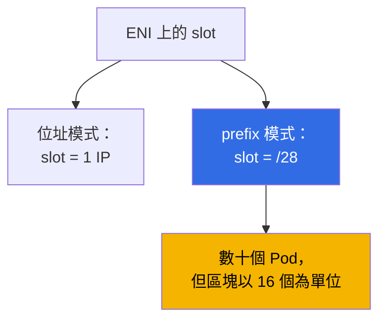
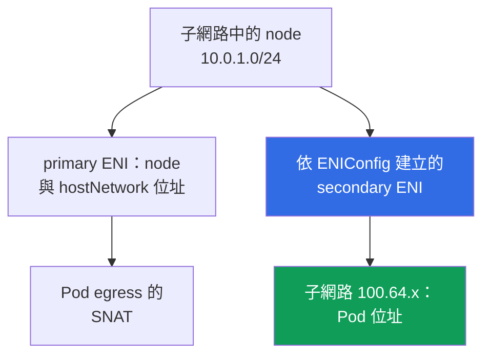

[Русская версия](ru.md) · [Eng version](en.md) · [Versión en español](es.md) · [Version française](fr.md) · [Deutsche Version](de.md) · [ქართული ვერსია](ge.md) · [日本語版](jp.md)
# 第 7 章. 位址規劃的規模：prefix delegation、secondary CIDR、custom networking

> **接下來。** 第 6 章說明了 VPC CNI 如何將真實的子網路位址指派給 Pod，以及位址為何會耗盡。本章介紹系統層面的解法：prefix delegation、VPC 的 secondary CIDR、透過 `ENIConfig` 的 custom networking、在運行中叢集的導入順序，以及維運上會有什麼改變。替代 CNI 與 Cilium 見第 8 章，NetworkPolicy 見第 30 章，node 密度與規模估算見第 14 章，網路故障分析見第 46 章。IPv6 叢集會作為另一條路徑提及，但不深入說明：`ipFamily` 僅能在建立時設定（第 4 章）。

## 7.1. 「子網路用盡且無法擴展」的三種解答

第 6 章情況最糟的樣子：node 子網路使用 `/24`，工作中 AZ 的 `AvailableIpAddressCount`
接近零，release 卡在 `FailedCreatePodSandBox`。無法將 `/24` 擴展成
`/22`，但叢集仍必須繼續成長。

- **在 node 上以相同位址容納更多 Pod** - prefix delegation：將 ENI slot 指派給一個
  `/28` 區塊。成本低，但**不會為子網路增加位址**，並會以較大的區塊消耗位址。
- **為 VPC 帶入新的位址空間** - secondary CIDR：關聯一個範圍、建立子網路，並將位址
  指派給 Pod。該範圍必須納入路由、NAT 與已連線網路。
- **從根本脫離 IPv4 短缺** - IPv6 叢集（第 7.9 節）或 overlay CNI（第 8 章），但僅適用於
  新叢集。

前兩種解答通常會合併使用，依條件比較見第 7.6 節。

## 7.2. Prefix delegation：ENI slot 指派給 /28 區塊

在一般模式中，VPC CNI 會在 ENI 上以一個 slot 配置一個次要 IPv4 位址，而 slot 數量由
instance 類型決定（第 6 章）。Prefix delegation 改變 slot 內的內容：不再放入一個位址，
而是放入**一個 `/28` prefix，也就是 16 個位址**。



```bash
kubectl set env daemonset aws-node -n kube-system ENABLE_PREFIX_DELEGATION=true
aws eks update-addon --cluster-name demo --addon-name vpc-cni \
  --configuration-values '{"env":{"ENABLE_PREFIX_DELEGATION":"true","WARM_PREFIX_TARGET":"1"}}' \
  --resolve-conflicts PRESERVE
```

第一個命令適合自行安裝的 CNI。**若 VPC CNI 是以 managed addon 安裝，透過 `kubectl set env`
所做的修改只會維持到下一次 addon 更新**，因此應如第二個命令般透過其設定來指定變數。這適用於
本章所有變數（第 37 章）。

**只有 Nitro 架構的 instance 支援在網路介面上使用 prefix**：其他 instance 仍會逐一取得次要
位址，因此混合 node group 中各 node 的行為會不同。此模式對大型 node 群還有一項優點：**EC2 API
呼叫次數更少**，一次請求會帶來 16 個位址，而且將 prefix 附加到既有 ENI 比建立新 ENI 更快。

除了介面本身已占用的位址外，每個 slot 都會帶來 16 個位址，因此 Pod 上限須以不同數字計算。

| Instance | ENI | 每個 ENI 的 IP | 位址模式 | Prefix 模式 | Managed node group 上限 |
|---|---|---|---|---|---|
| `m5.large` | 3 | 10 | 29 | 434 | 110 |
| `m5.xlarge` | 4 | 15 | 58 | 898 | 110 |
| `m5.8xlarge` | 8 | 30 | 234 | 3714 | 250 |

**Managed node group 不論是否使用 prefix delegation，都會限制 `maxPods` 上限：低於 30 vCPU 的
instance 為 110，其餘為 250。** 啟用該變數不會提高上限：只有在 launch template 中使用自訂 AMI
並於 user data 設定 `maxPods`（第 10 章），或使用 self-managed node group，才能超過此上限。原因
在於向後相容性：預設 `max-pods` 表格是針對位址模式計算，因此 user data 會將
`--use-max-pods false` 與明確的 `--max-pods` 一起傳入，而值本身則由帶有
`--cni-prefix-delegation-enabled` 旗標的 `max-pods-calculator.sh` 計算。最重要的是，**`kubelet`
會在啟動時取得 `max-pods`**，因此從位址模式啟動的 node 會保留原有值。Prefix delegation 是給新 node
使用的。

成本的另一面是碎片化。Prefix 需要**連續的 16 個位址區塊**，而在次要位址分散於整個子網路的地方，
可能有許多可用位址卻沒有連續區塊：`AvailableIpAddressCount` 顯示數百個位址，Pod 卻無法啟動，且
ipamd 日誌出現 `InsufficientCidrBlocks`。可透過新子網路或 **subnet CIDR reservation** 解決。

```bash
aws ec2 create-subnet-cidr-reservation --subnet-id subnet-0123456789abcdef0 \
  --reservation-type prefix --cidr 10.0.1.128/25
aws ec2 describe-network-interfaces \
  --filters Name=attachment.instance-id,Values=i-0123456789abcdef0 \
  --query 'NetworkInterfaces[].[NetworkInterfaceId,Ipv4Prefixes[].Ipv4Prefix]' --output text
```

位址會**以 16 個為一個區塊**配置：三個 node 各只有一個 Pod 時，會占用 48 個位址而不是三個。原則是：
prefix delegation 改善 Pod 密度與 API 呼叫次數，不解決位址短缺；位址不足時，應與新位址空間一起啟用。

## 7.3. Prefix 模式中的 warm pool

預留邏輯與第 6 章相同，但度量單位不同。

| 環境變數 | 預留的項目 | 優先順序 |
|---|---|---|
| `WARM_PREFIX_TARGET` | 超出目前需求的完整 `/28` prefix | prefix 模式的基準值 |
| `WARM_IP_TARGET` | 超出目前需求的個別位址 | 覆蓋 `WARM_PREFIX_TARGET` |
| `MINIMUM_IP_TARGET` | node 上位址數量的下限 | 覆蓋 `WARM_PREFIX_TARGET` |

**`WARM_IP_TARGET` 和 `MINIMUM_IP_TARGET` 可用於 prefix 模式，且優先於
`WARM_PREFIX_TARGET`。** `WARM_PREFIX_TARGET=1` 會保留一個完整的額外 prefix，也就是每個 node
最多有 16 個未使用位址；小於 16 的 `WARM_IP_TARGET` 則不會為此附加一整個額外 prefix，以較頻繁的
EC2 API 呼叫為代價來節省位址。

```bash
kubectl set env ds aws-node -n kube-system WARM_PREFIX_TARGET=1
kubectl set env ds aws-node -n kube-system WARM_IP_TARGET=8 MINIMUM_IP_TARGET=16
```

在較大的子網路中保留 `WARM_PREFIX_TARGET=1` 與快速 Pod 啟動；在較小的子網路中加入
`WARM_IP_TARGET` 和 `MINIMUM_IP_TARGET` 這組設定。不理解優先順序就同時設定三者，是導致難以解釋
行為的方式。

## 7.4. Secondary CIDR：既有 VPC 中的新位址空間

將額外 IPv4 區塊關聯到 VPC，並在其中建立子網路。既有子網路與 node 不受影響，`local` 路由會自動加入。

```bash
vpc_id=$(aws eks describe-cluster --name demo \
  --query 'cluster.resourcesVpcConfig.vpcId' --output text)
aws ec2 associate-vpc-cidr-block --vpc-id $vpc_id --cidr-block 100.64.0.0/16
aws ec2 describe-vpcs --vpc-ids $vpc_id --output table \
  --query 'Vpcs[].CidrBlockAssociationSet[].{CIDR:CidrBlock,State:CidrBlockState.State}'
aws ec2 create-subnet --vpc-id $vpc_id --availability-zone eu-central-1a \
  --cidr-block 100.64.0.0/19 --query Subnet.SubnetId --output text
```

此區塊僅在 `associated` 狀態時可用。在此之前建立子網路還太早。

**為何使用 `100.64.0.0/10`。** 它是 RFC 6598 中供 CG-NAT 使用的 shared address space。從形式上說，
它不是 RFC 1918 的私有範圍，因此**幾乎不會已被企業網路使用**。另有技術原因：primary CIDR 來自
`10.0.0.0/8` 的 VPC **無法**加入來自 `172.16.0.0/12` 或 `192.168.0.0/16` 的區塊，但可以加入
`100.64.0.0/10` 的區塊。

- **新子網路會繼承 main route table**：VPC 內的連通性可用，但網際網路 egress 必須明確設定。位於
  `100.64.x` 的 Pod 需要一條通往 NAT gateway 的路由，該 gateway 位於 primary 範圍的子網路中（第 31 章）。
- **已連線網路可能不知道此範圍**：peering、Transit Gateway、VPN 與 Direct Connect 不會自行開始路由
  `100.64.0.0/16`。這通常正是目的：Pod 位址無法從外部路由。
- **大小與配額**：區塊可從 `/16` 到 `/28`；不允許與既有區塊或 peered VPC 的 CIDR 重疊。

使用新空間最簡單的方法是**在新子網路中建立 node group**：node 與 Pod 都會從 `100.64.x` 取得位址，
不必在 `aws-node` 設定任何變數。

## 7.5. Custom networking：Pod 位址來自獨立子網路

預設情況下，次要 ENI 會建立在 node primary ENI 所在的子網路。Custom networking 打破此關係：
**次要 ENI 會建立在 `ENIConfig` 物件指定的子網路中，並使用其 security groups**，Pod 位址從該處取得，
而子網路必須與 node 位於相同 VPC 與相同 AZ。



必要步驟是每個 AZ 各有一個 `ENIConfig` 物件，接著在 `aws-node` 設定兩個變數。`ENIConfig` 設定
`spec.subnet` 與 `spec.securityGroups`（通常是 cluster security group）；若該 AZ 只有一個 Pod 子網路，
物件名稱會設為與 zone 名稱相同。

```yaml
apiVersion: crd.k8s.amazonaws.com/v1alpha1
kind: ENIConfig
metadata:
  name: eu-central-1a          # 每個 AZ 只有一個子網路時，名稱 = zone 名稱
spec:
  subnet: subnet-0123456789abcdef0   # 相同 AZ 中的 100.64.x 子網路
  securityGroups:
    - sg-0123456789abcdef0           # cluster security group
```

對每個具有 node 的 AZ 套用一個物件，變更名稱與 `subnet`，然後才啟用變數。否則，位於沒有 `ENIConfig`
的 AZ 中的 node 無法將位址指派給 Pod。

切勿混淆這兩種機制。`ENIConfig` 中的 `spec.securityGroups` 是次要 ENI 的群組，也就是使用該
`ENIConfig` 的**此 node 上所有 Pod**的群組：其粒度是 AZ 層級，而非單一 Pod。若特定 Pod 或由 selector
選出的 Pod 集合需要 SG，則是另一種機制 - security groups for pods：`SecurityGroupPolicy` 資源會依
selector 關聯 SG 清單，VPC CNI 則為這類 Pod 配置獨立的 branch ENI（詳細說明與常見故障見第 46 章）。
在沒有 `SecurityGroupPolicy` 的 prefix 模式中，Pod 共用 node 的 security group。

```bash
kubectl set env daemonset aws-node -n kube-system AWS_VPC_K8S_CNI_CUSTOM_NETWORK_CFG=true
kubectl set env daemonset aws-node -n kube-system ENI_CONFIG_LABEL_DEF=topology.kubernetes.io/zone
kubectl get eniconfigs
```

`ENI_CONFIG_LABEL_DEF=topology.kubernetes.io/zone` 啟用自動選擇：node 會讀取其 zone label，並採用同名的
`ENIConfig`。若一個 zone 有多個 Pod 子網路，則必須以 `k8s.amazonaws.com/eniConfig` annotation 標記 node。

- **Node 的 primary ENI 不參與 Pod 位址配置**，因此實際 `max-pods` 會下降：公式少了一整個介面，
  對 `m5.large` 而言是 20 個 Pod 而非 29 個。可由 prefix 補償：`(3 - 1) * (10 - 1) * 16 + 2` 得到 290。
- **既有 node 的行為不會改變**：此模式僅適用於啟用變數後建立的 node，因此必須重建整個 node 群
  （第 7.7 節）。它與 IPv6 不相容。
- **Egress 預設會經由 primary ENI**：使用 `AWS_VPC_K8S_CNI_EXTERNALSNAT=false` 時，前往 VPC CIDR
  以外位址的流量會使用 primary ENI 的子網路與 security groups 離開，而不是 `ENIConfig` 中的設定。
  使用 `hostNetwork: true` 的 Pod 也會保留在 node 位址上。
- **診斷更複雜**：node 與其 Pod 的位址來自不同範圍，security groups 可能不同，而要回答「為何 Pod
  無法連線」必須查看封包經由哪個 ENI 離開（第 7.8 節）。

**何時移除 SNAT。** 可讓相同 egress 不再經過 node 層級 SNAT：使用
`AWS_VPC_K8S_CNI_EXTERNALSNAT=true` 時，不會安裝 masquerade 規則，前往 VPC CIDR 外位址的封包會帶著
真實 Pod 位址離開，而不是被替換成 node primary 位址。這在兩種情況下需要：Pod 透過自己的 NAT gateway、
Transit Gateway 或 Direct Connect 連到資料中心、peered VPC 或 VPN，且另一端必須看到 Pod 位址；或外部
資源必須自行發起與 Pod 的連線。代價是已連線網路必須路由 Pod 範圍，且 `true` 時透過 internet gateway
直接連上網際網路的 egress 不再可用 - 必須有通往 NAT gateway 的路由（第 31 章）。

還有更簡單的工具。**Enhanced subnet discovery**：VPC CNI `1.18.0` 及更新版本預設會
（`ENABLE_SUBNET_DISCOVERY=true`）自動尋找其 VPC 與 AZ 中帶有 `kubernetes.io/role/cni=1` 標籤的子網路
（`aws ec2 create-tags --resources <subnet-id> --tags Key=kubernetes.io/role/cni,Value=1`）。Pod 會從新子網路
取得位址，**無需 `ENIConfig`，也不會失去 primary ENI**，因此沒有 `max-pods` 懲罰。Custom networking
是為 security group 與隔離需求而設，若兩種機制都啟用，它具有優先權。

## 7.6. 如何選擇

| 準則 | Prefix delegation | Secondary CIDR 加 node group | Custom networking | 子網路標籤 `cni=1` | IPv6 叢集 |
|---|---|---|---|---|---|
| 導入複雜度 | 低 | 中 | 高 | 低 | 僅限新叢集 |
| 提供新位址 | 否 | 是 | 是 | 是 | 是 |
| 對 `max-pods` 的影響 | 提高，直到上限 | 無 | 降低，少一個 ENI | 無 | 提高，使用 prefix |
| 重建 node | 是，為了新的 `max-pods` | 是，新子網路 | 是，必要 | 否 | 是 |
| 已連線網路中的 Pod 位址 | 與原先相同 | 僅有路由時 | 僅有路由時 | 取決於子網路 | 經 IPv6 路由 |
| Pod 可使用自訂 security groups | 否 | 否 | 是 | 否 | 否 |
| 要求 | Nitro | VPC CIDR 配額 | 每個 AZ 一個 `ENIConfig` | VPC CNI `1.18.0`+ | Nitro，新叢集 |

子網路夠大但 Pod 無法裝進 node 時，使用 prefix delegation，不要增加複雜度。位址耗盡時，使用 secondary
CIDR，接著在新 node group、子網路標籤與 custom networking 之間選擇；custom networking 是因隔離需求而選，
不是因位址需求。IPv6 則是在建立叢集時決定。

## 7.7. 在運行中叢集不造成停機的導入順序

三種機制都有共同特性：**它們只會改變新 node 的行為**。

1. **準備位址。** 關聯 secondary CIDR、每個 AZ 建立一個子網路與 route table，必要時建立 subnet CIDR
   reservation。
2. **變更 CNI 設定**，透過 managed addon 的設定完成（第 37 章）。對 custom networking，先在所有 zone
   套用 `ENIConfig`，然後才啟用 `AWS_VPC_K8S_CNI_CUSTOM_NETWORK_CFG`。
3. **建立新的 node group**，放入所需子網路、使用 Nitro instance；若需要高於上限的值，則在 user data 中
   設定 `maxPods`。驗證新 node 上的 Pod 位址。
4. **遷移工作負載。** 考量 PDB（第 40 章），逐一 cordon 與 drain 舊 node，然後移除舊 node group。不建議
   為轉換至 prefix 使用 rolling replacement：同時混用位址與 prefix 的 node 會以不一致的方式回報容量。

應在每個步驟檢查，而不是只在最後：

```bash
kubectl get nodes -o custom-columns='NODE:.metadata.name,PODS:.status.allocatable.pods'
kubectl get pods -A -o wide | grep -c ' 100\.64\.'
kubectl get eniconfigs -o custom-columns='NAME:.metadata.name,SUBNET:.spec.subnet'
```

這些命令顯示：新 node 的 `max-pods` 是否提高、Pod 位址是否來自新範圍，以及每個具有 node 的 zone 是否都有
`ENIConfig`。沒有 `ENIConfig` 的 zone 中，node 無法配置 Pod 位址，症狀同樣會是 `FailedCreatePodSandBox`，
只是子網路並未滿載。

## 7.8. 導入後的維運

剩餘位址的監控必須更精確：按每個子網路與 AZ 計算，而在 prefix 模式中不僅查看剩餘數量，也要查看是否有
連續區塊。

```bash
aws ec2 describe-subnets --filters Name=vpc-id,Values=vpc-0123456789abcdef0 --output table \
  --query 'Subnets[].[SubnetId,AvailabilityZone,CidrBlock,AvailableIpAddressCount]'
aws ec2 describe-network-interfaces --filters Name=vpc-id,Values=vpc-0123456789abcdef0 \
  --query 'NetworkInterfaces[].[NetworkInterfaceId,SubnetId,length(Ipv4Prefixes)]' --output text
```

診斷上最重要的變化是：Pod 位址不再能指出 node 子網路，而分析順序現在是 node、它的 ENI、該 ENI 的子網路、
子網路的 security groups。

- **沒有 prefix 的舊 node。** 部分 node 群維持原先的 `max-pods`，Pod 分布不均。應以替換 node 解決，
  而不是修改變數。
- **Addon 覆寫了變數。** Managed addon 更新還原了自己的值，新 node 因此以位址模式啟動。每次更新後都要檢查。
- **並非所有 AZ 都有 `ENIConfig`。** 叢集原本運作正常，直到 Karpenter 在第四個 zone 建立 node。另一個相鄰
  問題是「`ENIConfig` 指向已滿的子網路」：短缺會再次出現。
- **碎片化而非短缺**：剩餘位址很多，但日誌有 `InsufficientCidrBlocks`。**混合 instance 類型**：非 Nitro
  instance 無法取得 prefix，而群組中最低的 `max-pods` 會套用至其所有 node。
- **Karpenter 的廣泛類型清單。** 這是同一陷阱的另一種情況：需求寬鬆的 spot pool 會納入沒有 Nitro 的舊系列
  （`t2`、`m4`、`c4`），這些 node 會以位址模式啟動，密度明顯低於其餘 pool。整個 node 群看似一致，Pod 卻會
  分布不均。可縮小 NodePool 需求來解決：將 `karpenter.k8s.aws/instance-hypervisor` label 設為 `nitro`，
  或用 `karpenter.k8s.aws/instance-generation` 排除舊世代（第 12 與第 13 章）。

## 7.9. IPv6 叢集：激進解法概覽

在 `ipFamily: ipv6` 的叢集中，Pod 與 Service 會取得 IPv6 位址，VPC CNI 則以 `/80` prefix 模式運作。
位址短缺幾乎完全消除。此解法有三項代價。

- **僅限建立叢集時。** `ipFamily` 無法變更，EKS 不支援 Pod 與 Service 的 dual-stack，custom networking
  與 IPv6 不相容。轉換意味著建立新叢集並遷移工作負載（第 4 與第 38 章）。
- **應用程式相容性。** 設定中的位址 literal、函式庫、agent、外部系統：一切都必須支援 IPv6。Nitro 是必要條件，
  不支援 Windows node。
- **通往 IPv4 的 egress。** Pod 會取得 IPv6 位址，以及一個 control plane 看不見的 host-local IPv4 位址。
  當它存取 IPv4 資源時，node 本身的 NAT 會以 SNAT 使用 node primary IPv4 位址，且**此內建機制免除了在
  VPC 端使用 DNS64 與 NAT64 的需求**。

總結來說，IPv6 是回答「下一個叢集該如何建置？」的好答案，卻不是回答「這個叢集星期五該怎麼辦？」的好答案。

## 7.10. 在 production 中的運用方式

- **在新叢集預設啟用 prefix delegation**，並搭配 `WARM_PREFIX_TARGET` 與 Nitro instance：這比在負載下
  回頭處理此問題更便宜。
- **在設計 VPC 時就從 `100.64.0.0/10` 劃分 Pod 子網路**：不可路由的 Pod 空間會把 RFC 1918 留給 load balancer
  與 NAT。
- **將 VPC CNI 變數保存在 managed addon 設定與 Terraform 程式碼中**，而不是運行中的 DaemonSet：
  `kubectl set env` 的修改只能維持到下一次 addon 更新。
- **對每個子網路與 AZ 的剩餘位址設定告警**，並在 prefix 模式中為 `aws-node` 日誌的
  `InsufficientCidrBlocks` 加上告警。

## 7.11. 迷你詞彙表

- **Prefix delegation** - ENI slot 可容納 `/28` prefix（16 個位址）的模式；以
  `ENABLE_PREFIX_DELEGATION` 啟用，要求 Nitro。**`WARM_PREFIX_TARGET`** - node 上預留的 prefix；
  `WARM_IP_TARGET` 與 `MINIMUM_IP_TARGET` 優先於它。
- **Subnet CIDR reservation** - 在子網路內為 prefix 保留連續區塊。**`InsufficientCidrBlocks`** - EC2 API
  在形式上仍有可用位址時，回報缺少連續區塊的錯誤。
- **Secondary CIDR** - VPC 的額外 IPv4 區塊；EKS 通常使用 `100.64.0.0/10`（RFC 6598）。**Custom networking**
  - 次要 ENI 與 Pod 位址取自一個 **`ENIConfig`** 物件的子網路與 security groups 的模式，每個 AZ 各一個，
  並依 `ENI_CONFIG_LABEL_DEF` 中的 label 選取。**Enhanced subnet discovery** - 不使用 `ENIConfig`、帶有
  `kubernetes.io/role/cni=1` 標籤的子網路。**`AWS_VPC_K8S_CNI_EXTERNALSNAT`** - 移除 node 層級 Pod egress
  SNAT（`true`），讓外部端看見真實 Pod 位址；此時網際網路 egress 僅能經由 NAT gateway。**`ipFamily`** -
  叢集的位址家族，只能在建立時設定。

## 7.12. 本章總結

- 子網路無法擴展，因此有三種出路：每個 ENI slot 使用更多位址、VPC 的新位址空間，或脫離 IPv4。前兩種
  常會一起使用。
- Prefix delegation 透過 `aws-node` 的 `ENABLE_PREFIX_DELEGATION=true` 啟用，需要 Nitro，且可減少 EC2 API
  呼叫。但 managed node group 不論 prefix 仍有 110 與 250 的上限，`max-pods` 在 node 啟動時固定，且位址
  以 16 個為一個區塊配置，會使子網路碎片化。
- `WARM_PREFIX_TARGET` 設定預留量，但 `WARM_IP_TARGET` 與 `MINIMUM_IP_TARGET` 也適用且會覆蓋它，使你不必
  保留整個額外 prefix。
- 來自 `100.64.0.0/10` 的 secondary CIDR 不會與企業網路重疊，且可在禁止 RFC 1918 區塊之處使用，但必須注意
  路由與 NAT。
- 透過 `ENIConfig` 的 custom networking 會為 Pod 提供獨立子網路與 security groups，但會讓 primary ENI 不再
  參與位址配置、降低 `max-pods`，並要求重建 node。較簡單的路徑是在新子網路中使用 node group，或使用
  `kubernetes.io/role/cni=1` 標籤。
- 所有變更僅套用到新 node：先準備位址與設定，接著建立新的 node group，再 drain 舊 node。IPv6 完全消除短缺，
  但僅能在建立叢集時選擇，並帶來應用程式相容性與通往 IPv4 的 egress 考量。

## 7.13. 這對實際工作有何助益

位址短缺會毫無預警地到來，立刻表現為「release 無法推出」。有計畫與無計畫的工程師之間，差異以數小時的
停機時間計：前者知道 prefix delegation 會提高密度但不會增加位址，知道 secondary CIDR 可在一分鐘內關聯，
但路由與 NAT 需要更久，也知道變更只有在新 node 加入後才會進入叢集。在平靜時期，這可用於設計：Pod 子網路
與 node 分離、從第一天就使用 prefix，並將 CNI 變數放在 Git 中的 addon 設定。

## 7.14. 自我檢查問題

1. 為何 prefix delegation 無法解決已耗盡的子網路，而且有時會使問題更嚴重？
2. 你啟用了 `ENABLE_PREFIX_DELEGATION=true`，但 `allocatable.pods` 沒有變化。有哪兩個原因？
3. Prefix 模式對 instance 類型有何要求？在混合群組中為何危險？
4. 子網路剩餘 400 個位址，但 `aws-node` 日誌出現 `InsufficientCidrBlocks`。該怎麼做？
5. `WARM_PREFIX_TARGET`、`WARM_IP_TARGET` 與 `MINIMUM_IP_TARGET` 的關係為何？
6. 為何 Pod 使用 `100.64.0.0/10`，而不是 `192.168.0.0/16` 中一個空閒區塊？
7. 在 `associate-vpc-cidr-block` 之後，要讓 Pod 能連上網際網路與資料中心，還必須做什麼？
8. Custom networking 的必要元素有哪些？為何每個 AZ 都要建立 `ENIConfig`？
9. `ENIConfig` 中的 `spec.securityGroups` 與 `SecurityGroupPolicy` 在涵蓋範圍上有何不同？
10. 為何 custom networking 會降低 `max-pods`？如何補償？
11. Enhanced subnet discovery 與 custom networking 有何不同？何時不足以使用它？
12. 請描述在運行中叢集不造成停機地導入 prefix delegation 的順序。
13. VPC CNI addon 更新後應檢查什麼？為何 IPv6 無法拯救目前的叢集？
14. 何時啟用 `AWS_VPC_K8S_CNI_EXTERNALSNAT=true`？這樣會使 egress 的什麼功能失效？

## 實作

本主題的課程 lab：[lab 103 - 位址規劃：ENI 限制、prefix delegation、secondary
CIDR](../../labs/103/README_TW.MD)。除此之外，應在運行中的叢集驗證內容。先從 CNI 的運作模式開始：
`kubectl describe ds aws-node -n kube-system | grep -e PREFIX -e WARM_ -e CUSTOM_NETWORK -e
SUBNET_DISCOVERY`。接著，使用 `Name=attachment.instance-id` filter 與 `Ipv4Prefixes[].Ipv4Prefix`
query，透過 `aws ec2 describe-network-interfaces` 檢查 node 介面上的 prefix：prefix 清單為空但次要位址
清單非空，表示一般位址模式。透過 `kubectl get nodes -o
custom-columns='NODE:.metadata.name,PODS:.status.allocatable.pods'` 核對 Pod 上限：不同類型卻同樣為 110，
代表 managed node group 上限。

在測試叢集上走完完整流程：透過 `aws ec2 associate-vpc-cidr-block` 關聯 `100.64.0.0/16`，透過
`aws ec2 create-subnet` 在每個 AZ 建立一個子網路，在每個 zone 套用 `ENIConfig`，檢查
`kubectl get eniconfigs`，啟用 `AWS_VPC_K8S_CNI_CUSTOM_NETWORK_CFG` 與 `ENI_CONFIG_LABEL_DEF`，建立新的
node group，並確認新 Pod 從 `100.64.x` 取得位址、舊 node 仍照常運作。同時透過 `aws ec2 describe-subnets`
搭配 `AvailableIpAddressCount` 比較剩餘位址。

---
[目錄](../README_TW.md) · [第 6 章](../06/tw.md) · [第 8 章](../08/tw.md)
