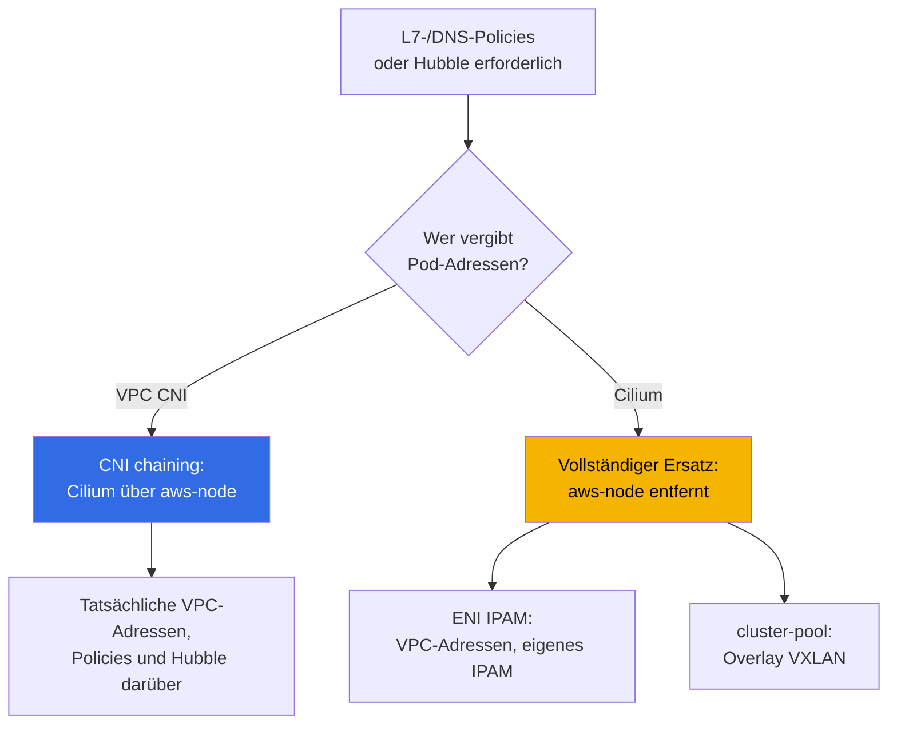
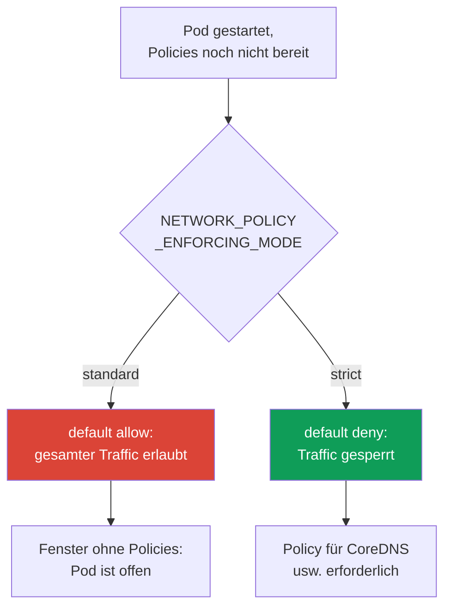

[Eng version](en.md) · [Versión en español](es.md) · [Version française](fr.md) · [Русская версия](ru.md) · [ქართული ვერსია](ge.md) · [繁體中文版](tw.md) · [日本語版](jp.md)
# Kapitel 8. Alternativen zu VPC CNI: Cilium, Netzwerkmodi und wann das CNI gewechselt werden sollte

> **Wie geht es weiter?** In den Kapiteln 6 und 7 wurden VPC CNI behandelt: tatsächliche Pod-Adressen, ENIs, Engpässe und ihre systemischen Auswege. Hier geht es um eine andere Frage: Wann reicht das Standard-CNI funktional nicht aus, nicht wegen fehlender Adressen, und lohnt sich ein Wechsel? VPC CNI selbst, ENIs und CIDR-Planung behandelt Kapitel 6; prefix delegation, sekundäre CIDRs und custom networking Kapitel 7 – sie werden hier nicht wiederholt. NetworkPolicy im Detail und das default-deny-Lab stehen in Kapitel 30 und Lab 110; hier erfolgt nur ein Vergleich der Fähigkeiten. Die Analyse von Netzwerkfehlern behandelt Kapitel 46, die Mechanik von Upgrades und Blue/Green Kapitel 38.

## 8.1. „Die integrierte NetworkPolicy reicht nicht aus“

Der Cluster läuft mit VPC CNI, es gibt ausreichend Adressen, die Pods kommunizieren miteinander. Nun kommt eine Anforderung, die sich mit der Standard-NetworkPolicy nicht abdecken lässt:

- Die Sicherheit verlangt eine Regel: „Dieser Service darf nur `api.stripe.com` erreichen“, also eine Richtlinie nach **DNS-Namen** und nicht nach Adresse oder Port.
- Oder es wird eine Regel auf HTTP-Ebene benötigt: „`GET /health` erlauben, alles andere verbieten“ – das ist **L7**, die siebte Schicht, die in der Standard-NetworkPolicy fehlt.
- Oder der Vorfall wurde geschlossen, aber niemand konnte beantworten: „Wer hat im Moment der Störung mit wem gesprochen?“ Es wird **Traffic-Observability** zwischen Pods benötigt, eine Flow-Karte statt nur Flow Logs auf Nodes.
- Oder das Projekt wächst zu einem **Multi-Cluster**-Netzwerk mit einheitlicher Policy und transparenter Konnektivität.

Keine dieser Anforderungen betrifft einen Adressmangel. Es geht um Fähigkeiten des Netzwerk-Plugins. Damit stellt sich in EKS eine kostspielige Frage: Soll das CNI gewechselt werden, womit, und zu welchem operativen Preis? Die Standardantwort lautet: **nicht wechseln**. Um sie bewusst treffen zu können, müssen jedoch die Grenzen verstanden werden.

## 8.2. Was VPC CNI und seine integrierte NetworkPolicy bieten

VPC CNI dient nicht nur der Adressvergabe (Kapitel 6). Seit Version `1.14` verfügt es über eine **integrierte eBPF-Implementierung von NetworkPolicy**. Sie ist wie folgt aufgebaut:

- Der **Policy-Controller** läuft in der EKS-Control-Plane und wird bei der Cluster-Erstellung automatisch installiert; er überwacht `NetworkPolicy`-Objekte und verteilt Regeln an die Nodes.
- Der **Agent** (`aws-network-policy-agent`) läuft als separater Container im DaemonSet `aws-node` und lädt eBPF-Programme in den Node-Kernel, die den Traffic filtern; erforderlich ist ein Linux-Kernel `5.10`+.
- Das Feature ist **standardmäßig deaktiviert** und wird über den Add-on-Parameter `enableNetworkPolicy` aktiviert.

```bash
kubectl get ds aws-node -n kube-system \
  -o jsonpath='{.spec.template.spec.containers[*].name}{"\n"}'   # aws-node + agent
aws eks update-addon --cluster-name demo --addon-name vpc-cni \
  --configuration-values '{"enableNetworkPolicy":"true"}' --resolve-conflicts PRESERVE
```

Was diese Implementierung kann: die Standard-**Kubernetes-`NetworkPolicy`** (L3/L4, nach Adressen, Ports, Pod- und Namespace-Selektoren) und seit Version `1.21` zusätzlich die administrative **`ClusterNetworkPolicy`** (`networking.k8s.aws/v1alpha1`) für clusterweite Regeln. All das ist ein **managed addon**: Es wird regulär aktualisiert, ist in AWS integriert und **durch dessen Support abgedeckt**.

Was ihr grundsätzlich fehlt:

- **L7-Regeln** (HTTP-Methoden und -Pfade, gRPC, Kafka) – die Filterung erfolgt nur auf L3/L4.
- **Policies nach DNS-Namen** – Regeln werden nach Adressen und Selektoren geschrieben, nicht nach FQDN.
- **CRDs auf Ebene von `CiliumNetworkPolicy` und `CiliumClusterwideNetworkPolicy`** mit deren erweiterten Fähigkeiten.
- **Hubble** und dessen Flow-Observability (Service-Karte, Metriken, Policy-Drops).

Gerade diese Liste führt Teams dazu, sich Cilium anzusehen.

## 8.3. Cilium in zwei Modi

Cilium wird auf EKS auf grundlegend unterschiedliche Arten installiert; dies sind zwei verschiedene Entscheidungen bezüglich Kosten und Risiko.



**Modus 1. CNI chaining über VPC CNI.** Die Pod-Adressen werden weiterhin durch VPC CNI über ENIs vergeben (das gesamte Kapitel 6 bleibt gültig: tatsächliche VPC-Adressen, kein Overlay, `max-pods` nach Formel). Cilium wird „in die Kette“ eingebunden: Nachdem VPC CNI das Pod-Interface eingerichtet hat, hängt Cilium eBPF-Programme daran und ergänzt **Policies (einschließlich L7 und DNS) sowie Hubble-Observability**. `aws-node` bleibt bestehen und arbeitet weiter. Dies ist der am wenigsten invasive Weg: Die Policy-Fähigkeiten wachsen, während Adressmodell und VPC-Integrationen unangetastet bleiben.

**Modus 2. Vollständiger Ersatz von VPC CNI.** Das DaemonSet `aws-node` wird **entfernt**, Cilium wird zum einzigen CNI und übernimmt IPAM. Hier gibt es zwei Untermodi:

- **ENI IPAM mit native routing**: Cilium verwaltet ENIs selbst und vergibt tatsächliche VPC-Adressen an Pods, ohne Kapselung. Die Adressen bleiben in der VPC routbar, aber den Lebenszyklus von IPAM verantwortet nun Cilium statt AWS.
- **cluster-pool (Overlay/VXLAN)**: Pod-Adressen stammen aus einem virtuellen Cluster-Pool und werden gekapselt. Der Mangel an VPC-Adressen verschwindet als Problemklasse (Pod-Adressen kommen nicht mehr aus dem Subnetz), aber zugleich entfallen die Eigenschaften aus der Tabelle in Kapitel 6 (siehe Abschnitt 8.4).

| Was VPC CNI NP kann | Was Cilium ergänzt | Womit Sie bezahlen |
|---|---|---|
| Standard-`NetworkPolicy` L3/L4 | `CiliumNetworkPolicy`, L7 (HTTP/gRPC/Kafka) | eigene Installation und deren Betrieb |
| administrative `ClusterNetworkPolicy` | `CiliumClusterwideNetworkPolicy`, DNS-Policies | eigenes CRD-Modell, Einarbeitung des Teams |
| eBPF-Agent als managed addon | Hubble: Flow-Karte, Metriken, Drops | Hubble UI/Relay als separate Komponenten |
| AWS-Support, reguläre Upgrades | optionales Overlay und Multi-Cluster | Sie verantworten Upgrades und Kompatibilität |
| Integration mit SG for pods, Flow Logs | Traffic-Verschlüsselung (WireGuard/IPsec) | ein Teil der AWS-Integrationen geht verloren (Abschnitt 8.5) |

Die Tabelle bedeutet nicht „Cilium ist besser“. Die rechte Spalte ist der Preis, und er ist real.

**eBPF-Modus mit Ersatz von kube-proxy.** Wenn Cilium zur primären Data Plane wird (vollständiger Ersatz, teils auch chaining), kann es **kube-proxy ersetzen**: mit dem Parameter `kubeProxyReplacement=true`. Service- und NodePort-Load-Balancing erfolgt dann durch eBPF-Programme von Cilium statt durch iptables kube-proxy. Der Gewinn: Keine anwachsenden iptables-Regeln in großen Clustern, geringere Latenz und bessere Service-Skalierung. Der Preis: Ein aktueller Node-Kernel ist erforderlich (socket-LB erfordert Kernel `4.19.57`/`5.2`+), das managed addon `kube-proxy` wird in EKS entfernt, und Sie übernehmen die Verantwortung für das Load-Balancing. Das Entfernen von kube-proxy unterbricht bestehende Service-Verbindungen; deshalb erfolgt dies per Blue/Green (Abschnitt 8.8), nicht auf laufenden Nodes.

**Cilium ClusterMesh.** Für Multi-Cluster verbindet Cilium die Pod Networks mehrerer Cluster zu einem einzigen Netzwerk. Architektur: In jedem Cluster läuft ein `clustermesh-apiserver`, der seinen Zustand an benachbarte Cluster ausgibt und deren Zustand übernimmt; die Agents verbinden sich mit dem apiserver jedes Clusters. Die Anforderungen sind strikt: Jeder Cluster benötigt eindeutige **`cluster-name` und `cluster-id`** sowie **nicht überlappende PodCIDRs** (der native-routing-CIDR muss alle Cluster abdecken). Services werden mit der Annotation `service.cilium.io/global: "true"` markiert, und der Traffic wird über Pods in allen Clustern verteilt. Der Preis: Control-Plane-Konnektivität zwischen den Clustern, eine einheitliche Adressplanung und die Verantwortung dafür – VPC CNI kann das überhaupt nicht.

Zusammenfassend für das Gesamtprodukt, nicht nur für NetworkPolicy:

| Vergleichsachse | VPC CNI | Cilium |
|---|---|---|
| Pod-Adressierung | tatsächliche VPC-Adressen, managed IPAM | ENI-IPAM oder Overlay, eigenes IPAM |
| NetworkPolicy | L3/L4 (+ `ClusterNetworkPolicy`) | L3/L4, L7 (HTTP/gRPC), DNS/FQDN |
| kube-proxy | reguläres managed addon | optionaler Ersatz durch eBPF (`kubeProxyReplacement`) |
| Observability | Flow Logs auf Nodes | Hubble: Flow-Karte, Metriken |
| Multi-Cluster | nein | ClusterMesh (gemeinsames Pod Network) |
| Betrieb | managed, AWS-Support | Sie verantworten Upgrades und Kompatibilität |

Die linke Spalte zeigt, was bereits unter AWS-Support vorhanden ist; die rechte zeigt Fähigkeiten zum Preis der CNI-Verantwortung.

## 8.4. Andere Alternativen und was das Overlay verliert

- **Calico**. In EKS wird es häufiger **nur für Policies über VPC CNI** eingesetzt (policy-only, die Adressierung bleibt bei VPC CNI), nicht als vollständiges CNI. Seit VPC CNI eine integrierte NetworkPolicy hat, ist dieses Szenario enger geworden: Falls nur Standard-L3/L4 benötigt wird, ist ein separates Calico nicht mehr erforderlich.
- **Overlay-Modi im Allgemeinen** (Cilium cluster-pool, Calico VXLAN/IPIP, flannel). Sie bringen „virtuelle“ Pod-Adressen zurück und lösen IPv4-Knappheit, allerdings um den Preis der Rückkehr zu einem Modell, das EKS verlassen hat. Gegenüber Kapitel 6 geht Folgendes verloren:

| Eigenschaft (Kapitel 6) | VPC CNI und ENI-Modi | Overlay |
|---|---|---|
| Tatsächliche Pod-Adressen in der VPC | ja | nein, virtueller CIDR |
| Routing zu Pods in verbundenen Netzwerken | ja | nein, nur über Gateway/SNAT |
| Security Groups für Pod-Traffic | ja (einschließlich SG for pods, Kapitel 19) | nein |
| VPC Flow Logs sehen Pod-Adressen | ja | nein, sie sehen Node-Adressen |
| Kapselung und Overhead, MTU | nein | ja |

Ein Overlay ist gerechtfertigt, wenn IPv4-Knappheit nicht durch andere Mittel behoben werden kann (Kapitel 7 listet diese auf) und direktes Routing zu Pods in der VPC nicht erforderlich ist. Das ist ein bewusster Tausch, keine Verbesserung.

## 8.5. Der ehrliche Preis eines Wechsels zum CNI-Ersatz

Der Wechsel von VPC CNI zu einem eigenen CNI ist keine Flag-Änderung, sondern ein Wechsel der Verantwortungszone. Folgendes ändert sich:

- **Sie verantworten den Lebenszyklus des CNI.** Upgrades sind nicht länger ein **managed addon**: Sie planen, testen und rollen sie selbst aus, über Helm oder eine eigene Pipeline (Kapitel 37).
- **Der AWS-Support wird eingeschränkt.** Der reguläre Support deckt VPC CNI ab; Probleme mit einem CNI eines Drittanbieters liegen im Bereich seiner Community und Ihres Teams. Für EKS Hybrid Nodes wird Cilium als CNI speziell unterstützt, für gewöhnliche Nodes in AWS bleibt jedoch VPC CNI der Standard.
- **Die Kompatibilität mit der Cluster-Version ist Ihre Aufgabe.** Bei Kubernetes-Upgrades (Kapitel 3 und 38) prüfen Sie selbst, dass die CNI-Version die neue Control-Plane-Version unterstützt, und aktualisieren in der richtigen Reihenfolge. Zuvor erledigte dies das managed addon.
- **Ein Teil der AWS-Integrationen funktioniert nicht mehr „out of the box“.** **Security groups for pods** (Kapitel 46) und die **Sichtbarkeit von Pod-Adressen in VPC Flow Logs** sind an VPC CNI und das ENI-Modell gebunden; mit Overlay funktionieren sie nicht, und bei fremdem ENI-IPAM müssen sie gesondert geprüft werden statt sie als selbstverständlich anzunehmen.
- **Die Diagnose wird komplexer.** Ein Netzwerkfehler wird nun mit CNI-Werkzeugen (`cilium`, Hubble) untersucht, nicht nur mit VPC-Mitteln und `aws-node`; die Anzahl möglicher Fehlerstellen wächst.

```bash
cilium status                      # Gesamtstatus des Cilium-Agents und -Operators
cilium connectivity test           # Prüfung von Konnektivität und Policies nach der Installation
kubectl get ciliumnetworkpolicies -A   # welche CiliumNetworkPolicy angewendet werden
```

Diese Befehle sind erst nach der Installation von Cilium verfügbar; auf einem reinen VPC CNI gibt es sie nicht. Das Auftauchen der `cilium`-CLI im Cluster ist selbst ein Signal dafür, dass Sie die oben genannte Verantwortung übernommen haben.

## 8.6. Reihenfolge der Policy-Anwendung beim Pod-Start und das Fenster ohne Policies

Ein leicht zu übersehender und für die Sicherheit wichtiger Moment: **Zwischen dem Start eines Pods und der Anwendung seiner Policies besteht eine Lücke**. Bei der integrierten NetworkPolicy von VPC CNI wird das Verhalten in dieser Lücke durch die Agent-Variable `NETWORK_POLICY_ENFORCING_MODE` bestimmt:



- **`standard` (Standardwert).** Bis der Agent alle Regeln für den neuen Pod eingerichtet hat, arbeitet dieser mit **default allow**: Gesamter Ingress und Egress ist offen. Es gibt ein **Fenster ohne Policies** – Sekunden, in denen der Pod bereits Traffic annimmt und sendet, die Filterung aber noch nicht aktiv ist. Für einen schnellen Start ist dies bequem, für strikte Isolation eine Lücke.
- **`strict`.** Der Pod startet mit **default deny**, und erst danach werden erlaubende Regeln angewendet. Es gibt kein Fenster, aber dann **muss für jede vom Pod benötigte Adresse eine Policy existieren**, einschließlich des Zugriffs auf CoreDNS; andernfalls löst der Pod keine Namen auf und startet nicht normal.

Dies ist der grundlegende Tausch „Startgeschwindigkeit gegen kein Fenster“. Cilium löst dieselbe Aufgabe mit eigenen Mitteln, doch das Prinzip bleibt gleich: Wird die Garantie verlangt, dass ein Pod keine Sekunde offen ist, eignet sich der Standardmodus nicht, und dies muss im Design berücksichtigt werden (im Detail: Kapitel 30).

## 8.7. Wann das CNI wechseln und wann nicht

Standardmäßig gilt: **Bei VPC CNI bleiben**. Wechseln Sie nur für einen konkreten, benannten Bedarf.

| Bedarf | Bei VPC CNI bleiben | CNI wechseln/ergänzen |
|---|---|---|
| Standard-L3/L4-NetworkPolicy | ja, integrierter Agent | nicht sinnvoll |
| Regeln nach DNS-Namen oder L7 (HTTP/gRPC) | nicht abgedeckt | Cilium (chaining genügt) |
| Flow-Observability zwischen Pods | Flow Logs auf Nodes | Cilium + Hubble (chaining) |
| Multi-Cluster-Netzwerk mit einheitlicher Policy | nicht abgedeckt | Cilium (cluster mesh) |
| Nicht behebbarer IPv4-Mangel (Kapitel 7 hat nicht geholfen) | Mangel bleibt bestehen | Overlay als letzte Maßnahme |
| Tatsächliche Adressen, SG for pods, Flow Logs sind wichtig | ja, das ist seine Stärke | Ersatz nimmt all dies weg |

Auswahlregeln:

- **L7-/DNS-Policies oder Hubble sind erforderlich, aber das Adressmodell passt** – verwenden Sie Cilium im Modus **CNI chaining**: Sie erhalten die Fähigkeiten, ohne IPAM und VPC-Integrationen abzugeben. Dies ist die häufigste und risikoärmste Antwort.
- **Ein vollständiger Ersatz ist nur eng begrenzt gerechtfertigt**: Ein Overlay wird benötigt, um dem Adressmangel zu entkommen, oder Multi-Cluster, oder Anforderungen, die das ENI-Modell grundsätzlich nicht erfüllt.
- **Wechseln Sie das CNI nicht „für die Zukunft“ oder „weil es modern ist“.** Jeder Punkt aus Abschnitt 8.5 ist eine dauerhafte Belastung für das Team, keine einmalige Konfiguration.

## 8.8. CNI-Migration als riskante Operation

Das CNI auf einem laufenden Cluster per Flag umzuschalten, **ist nicht möglich**. Das CNI wird einem Pod bei seiner Erstellung zugewiesen, und bereits laufende Pods wechseln nicht selbstständig zum neuen Plugin. Daher bedeutet ein CNI-Wechsel fast immer die **Neuerstellung von Nodes oder des Clusters**, nicht ein Umschalten im laufenden Betrieb.

Der sichere Weg ist **Blue/Green** (die Mechanik von Upgrades und Neuerstellung: Kapitel 38; hier das Prinzip):

1. Erstellen Sie einen **neuen Node-Pool**, der mit einem Label markiert ist und das neue CNI verwendet (oder einen separaten Cluster).
2. Prüfen Sie darauf Konnektivität und Policies (`cilium connectivity test`), AWS-Integrationen und DNS.
3. Verschieben Sie die Workloads schrittweise; führen Sie cordon/drain der alten Nodes einzeln und unter Beachtung von PDBs durch.
4. Entfernen Sie den alten Stack erst, wenn sichergestellt ist, dass alles funktioniert (beim Ersatz: `aws-node` entfernen).

Ein direktes Umschalten auf einem laufenden Cluster ist gefährlich, weil während der Übergangszeit Pods auf zwei unterschiedlichen Netzwerk-Stacks im Cluster leben und sich Konnektivität zwischen ihnen, Policies und Egress unvorhersehbar verhalten. Die Isolation des alten und neuen Stacks nach Nodes ist daher ein notwendiges Element und keine Vorsichtsmaßnahme „für alle Fälle“.

## 8.9. Anwendung in der Produktion

- **Standardmäßig bei VPC CNI bleiben** und die integrierte NetworkPolicy aktivieren: Für L3/L4-Isolation genügt das, und alles bleibt unter AWS-Support.
- **Cilium im CNI-chaining-Modus ergänzen**, wenn tatsächlich L7-/DNS-Policies oder Hubble benötigt werden: Adressmodell und VPC-Integrationen bleiben dabei unangetastet.
- **Den vollständigen CNI-Ersatz für einen konkreten Bedarf wählen** (Overlay gegen Adressmangel, Multi-Cluster) und im Team-Budget die Verantwortung für Upgrades und Diagnose einplanen.
- **Den Policy-Anwendungsmodus bewusst wählen**: `strict` dort, wo ein Fenster ohne Policies nicht zulässig ist, mit verpflichtender Policy für CoreDNS.
- **Jeden CNI-Wechsel per Blue/Green** über einen neuen Node-Pool durchführen, nicht durch Umschalten eines Flags auf einem laufenden Cluster.

## 8.10. Mini-Glossar

- **VPC CNI network policy** – integrierte eBPF-Implementierung von `NetworkPolicy`: Controller in der Control Plane plus Agent `aws-network-policy-agent` in `aws-node`; aktiviert über den Add-on-Parameter `enableNetworkPolicy`. Unterstützt L3/L4-`NetworkPolicy` und die administrative `ClusterNetworkPolicy` (`networking.k8s.aws/v1alpha1`).
- **CNI chaining** – Modus, in dem VPC CNI Adressen vergibt und das Interface einrichtet, während Cilium darüber Policies und Observability ergänzt; `aws-node` bleibt bestehen.
- **Vollständiger Ersatz** – `aws-node` ist entfernt, Cilium ist das einzige CNI mit eigenem IPAM: **ENI IPAM** (tatsächliche VPC-Adressen) oder **cluster-pool** (Overlay/VXLAN, virtuelle Adressen).
- **`CiliumNetworkPolicy` / `CiliumClusterwideNetworkPolicy`** – Cilium-CRDs mit L7- und DNS-Regeln. **Hubble** – Cilium-Flow-Observability.
- **`NETWORK_POLICY_ENFORCING_MODE`** – Modus für die Policy-Anwendung beim Pod-Start: `standard` (default allow, Fenster ohne Policies vorhanden) oder `strict` (default deny).
- **`kubeProxyReplacement`** – Cilium-Modus, in dem eBPF statt kube-proxy Service/NodePort ausbalanciert; `true` aktiviert den Ersatz. Erfordert einen aktuellen Kernel und die Verantwortung für das Load-Balancing.
- **ClusterMesh** – Verbindung der Pod Networks mehrerer Cilium-Cluster über `clustermesh-apiserver`; eindeutige `cluster-id` und nicht überlappende PodCIDRs sind erforderlich.

## 8.11. Zusammenfassung des Kapitels

- Der Grund für einen CNI-Wechsel sind Fähigkeiten, nicht Adressen: L7- oder DNS-Policies, Flow-Observability, Multi-Cluster. Die Adressfrage wird mit den Mitteln aus Kapitel 7 gelöst, nicht durch einen CNI-Wechsel.
- VPC CNI verfügt über eine integrierte eBPF-NetworkPolicy (Controller plus Agent, Flag `enableNetworkPolicy`): Standard-L3/L4 und administrative `ClusterNetworkPolicy`, alles als managed addon unter AWS-Support. L7, DNS-Policies, Cilium-CRDs und Hubble fehlen.
- Cilium wird auf zwei Arten installiert: CNI chaining über VPC CNI (Adressen und VPC-Integrationen bleiben erhalten, darüber Policies und Hubble) und vollständiger Ersatz (`aws-node` entfernt, eigenes IPAM: ENI-Modus oder Overlay). Chaining ist der risikoärmste Weg zu L7/DNS und Observability.
- Overlay beseitigt IPv4-Mangel, nimmt aber tatsächliche Pod-Adressen, deren Routing in verbundenen Netzwerken, Security Groups für Pod-Traffic und die Sichtbarkeit von Pods in Flow Logs.
- Der Preis eines CNI-Ersatzes: Sie verantworten Upgrades (kein managed addon), AWS-Support wird eingeschränkt, die Kompatibilität mit der Cluster-Version liegt bei Ihnen, ein Teil der Integrationen (SG for pods, Flow Logs für Pods) funktioniert nicht mehr out of the box, die Diagnose wird komplexer.
- Beim Pod-Start gibt es ein Fenster ohne Policies: `standard` öffnet Traffic bis zur Anwendung der Regeln, `strict` sperrt ihn, benötigt aber eine Policy für CoreDNS. Ein CNI-Wechsel ist Blue/Green über neue Nodes, kein Umschalten eines Flags im laufenden Betrieb.
- Im eBPF-Modus kann Cilium kube-proxy ersetzen (`kubeProxyReplacement=true`) und Cluster über ClusterMesh verbinden – beide Features entfernen reguläre managed-Komponenten und erfordern einen aktuellen Kernel, nicht überlappende PodCIDRs sowie Ihre Verantwortung für Load-Balancing und Adressen.

## 8.12. Nutzen für die praktische Arbeit

Die Anforderung „Policies nach DNS-Namen“ oder „Zeigen Sie die Traffic-Karte zur Zeit des Vorfalls“ kommt nicht vom Netzwerk, sondern von Sicherheit oder Entwicklung; darauf lässt sich leicht mit einer teuren Antwort reagieren: „Wir wechseln das CNI.“ Ein Ingenieur mit Plan fragt jedoch zunächst, ob das Adressmodell passt. Falls ja, nimmt er Cilium im chaining-Modus, ohne IPAM und VPC-Integrationen abzugeben. Den vollständigen Ersatz bewahrt er für Fälle auf, in denen er wirklich erforderlich ist, und rechnet im Voraus damit, dass CNI-Upgrades und Kompatibilität mit der Cluster-Version nun zu seiner dauerhaften Arbeit gehören. In ruhigen Zeiten prägt dies das Design: Der Policy-Anwendungsmodus wird bewusst gewählt, und jede CNI-Migration wird als Blue/Green geplant, nicht als Flag.

## 8.13. Fragen zur Selbstkontrolle

1. Welche Anforderungen rechtfertigen einen CNI-Wechsel, und welche werden mit den Mitteln aus Kapitel 7 gelöst?
2. Aus welchen Komponenten besteht die integrierte NetworkPolicy von VPC CNI, und wie wird sie aktiviert?
3. Was kann die integrierte NetworkPolicy von VPC CNI, und was fehlt ihr grundsätzlich?
4. Worin unterscheidet sich CNI chaining vom vollständigen Ersatz von VPC CNI, und was bleibt bei chaining unverändert?
5. Welche zwei IPAM-Untermodi hat der vollständige Wechsel zu Cilium, und wie unterscheiden sie sich bei Pod-Adressen?
6. Was geht gegenüber Kapitel 6 beim Wechsel zu einem Overlay verloren?
7. Zählen Sie auf, was bei einem CNI-Ersatz nicht mehr AWS-Aufgabe ist und zu Ihrer wird.
8. Warum können Security groups for pods und Flow Logs für Pods beim CNI-Wechsel aufhören zu funktionieren?
9. Was ist das Fenster ohne Policies, und wie wird es durch `NETWORK_POLICY_ENFORCING_MODE` beeinflusst?
10. Worin liegt die Gefahr des Modus `strict`, und warum benötigt er eine Policy für CoreDNS?
11. Nach welchen Kriterien sollte „bei VPC CNI bleiben“ gegenüber „Cilium per chaining ergänzen“ gewählt werden?
12. Warum kann ein CNI-Wechsel nicht durch Umschalten eines Flags erfolgen, und wie sieht der Blue/Green-Weg aus?
13. Was bringt `kubeProxyReplacement=true`, und welche Anforderungen stellt ClusterMesh an die Cluster-Adressen?

## Praxis

Das Lab des Kurses zu diesem Thema: [Lab 132 – Alternatives CNI: Cilium im CNI-chaining-Modus über VPC CNI](../../labs/132/README_DE.MD). Dort wird Cilium über Helm auf einem laufenden VPC CNI installiert (`cni.chainingMode: aws-cni`), es wird nachgewiesen, dass IPAM bei VPC CNI geblieben ist, und darüber erscheinen eine L7-Regel nach HTTP-Methode, eine Policy nach DNS-Namen über `toFQDNs` und eine Flow-Karte mit Verdict in Hubble. Der vollständige Ersatz von VPC CNI gehört bewusst nicht zum Umfang des Labs: Er erfolgt per Blue/Green über neue Nodes (Abschnitt 8.8), nicht durch Umschalten eines Flags. Das Ergebnis wird mit dem Befehl `check_result` geprüft. Zum selben Thema gehört [Lab 110 – NetworkPolicy in EKS: integrierte VPC CNI network policy](../../labs/110/README_DE.MD), in dem die integrierte network policy von VPC CNI separat und ohne Cilium geprüft wird.

Nachfolgend dasselbe auf einem beliebigen eigenen Cluster mit gewöhnlichen Befehlen. Beginnen Sie mit dem aktuell Installierten: `kubectl get ds aws-node -n kube-system` zeigt, ob VPC CNI läuft, und `kubectl get ds aws-node -n kube-system -o jsonpath='{.spec.template.spec.containers[*].name}'` zeigt, ob daneben der Container `aws-network-policy-agent` vorhanden ist, also ob die integrierte NetworkPolicy aktiviert ist. Den Status und die Version des Add-ons prüfen Sie mit `aws eks describe-addon --cluster-name <cluster> --addon-name vpc-cni`: Eine Version unter `1.14` bedeutet, dass keine integrierte NetworkPolicy vorhanden ist, eine unter `1.21`, dass keine administrative `ClusterNetworkPolicy` vorhanden ist.

Prüfen Sie den Policy-Anwendungsmodus: Suchen Sie `NETWORK_POLICY_ENFORCING_MODE` in `kubectl describe ds aws-node -n kube-system | grep -i NETWORK_POLICY`; ein leeres Ergebnis bedeutet den Standardmodus `standard`, also ein Fenster ohne Policies beim Start von Pods. Falls im Cluster bereits Cilium installiert ist, vergleichen Sie das Bild: `cilium status` zeigt Modus und Komponenten, `kubectl get ciliumnetworkpolicies -A` die angewendeten L7-/DNS-Policies, und `cilium connectivity test` prüft die Konnektivität (beachten Sie, dass der Test temporäre Workloads erstellt). Auf einem reinen VPC CNI werden diese Befehle nicht vorhanden sein – genau das ist die anschauliche Grenze zwischen „wir bleiben“ und „wir haben ein fremdes CNI übernommen“.

---
[Inhaltsverzeichnis](../README_DE.md) · [Kapitel 7](../07/de.md) · [Kapitel 9](../09/de.md)
