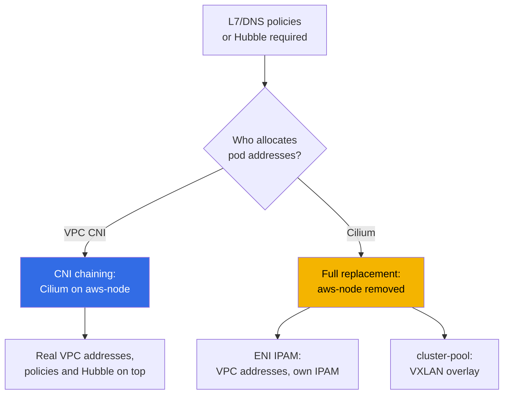
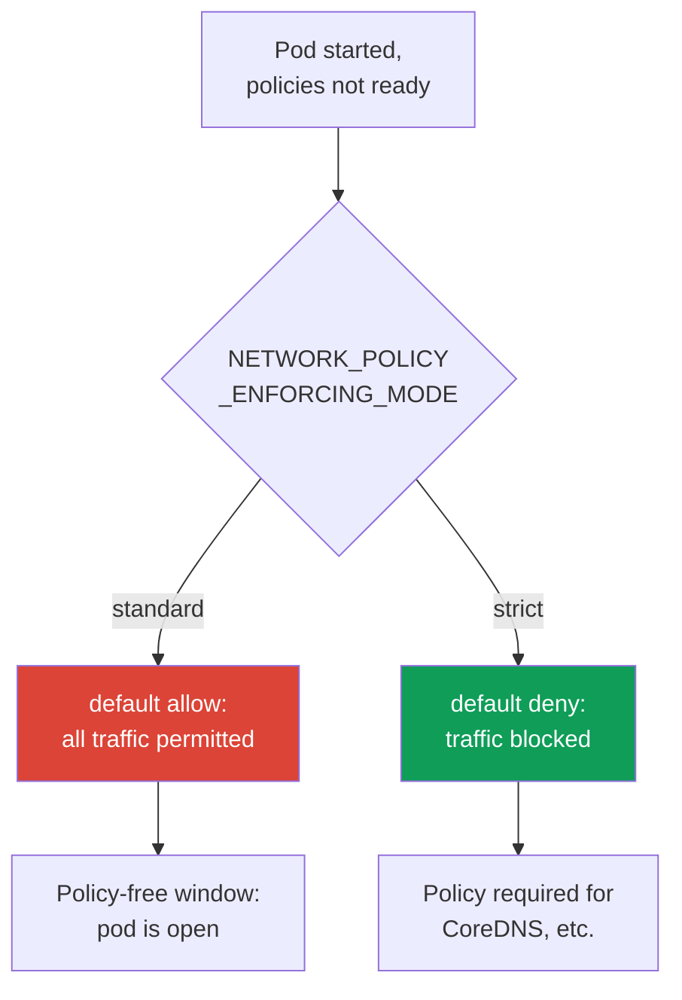

[Русская версия](ru.md) · [Versión en español](es.md) · [Version française](fr.md) · [Deutsche Version](de.md) · [ქართული ვერსია](ge.md) · [繁體中文版](tw.md) · [日本語版](jp.md)
# Chapter 8. VPC CNI alternatives: Cilium, network modes, when to change CNI

> **What is next.** Chapters 6 and 7 covered VPC CNI: real pod addresses, ENIs, address scarcity,
> and its system-level solutions. This chapter asks a different question: when the standard CNI lacks
> capabilities rather than addresses, and whether it is worth replacing. VPC CNI itself, ENIs, and CIDR
> planning are in Chapter 6; prefix delegation, secondary CIDR, and custom networking are in Chapter 7
> and are not repeated here. NetworkPolicy in depth and the default-deny lab are in Chapter 30 and lab 110;
> this chapter only compares capabilities. Network failure analysis is in Chapter 46, and upgrade and blue/green
> mechanics are in Chapter 38.

## 8.1. “The built-in NetworkPolicy is not enough”

The cluster runs VPC CNI, has enough addresses, and pods communicate. Then a requirement arrives
that the standard NetworkPolicy cannot meet:

- security requires a rule stating “this service may connect only to `api.stripe.com`”, that is, a policy
  by **DNS name**, not by address or port;
- or an HTTP-level rule is required: “allow `GET /health`, deny everything else” - that is **L7**,
  the seventh layer, which standard NetworkPolicy does not have;
- or the incident is closed, but nobody can answer “who was talking to whom when the failure happened”:
  **traffic observability** between pods is needed, a flow map rather than only node-level Flow Logs;
- or the project is growing into a **multi-cluster** network with a shared policy and transparent connectivity.

None of these requirements is about address scarcity. They are about network-plugin capabilities. This
raises an expensive question in EKS: should you change CNI, to what, and at what operational cost?
The default answer is **do not change it**, but making that choice consciously requires understanding
its boundaries.

## 8.2. What VPC CNI and its built-in NetworkPolicy provide

VPC CNI is not only address allocation (Chapter 6). Since version `1.14`, it has had a
**built-in eBPF implementation of NetworkPolicy**. It works as follows:

- the **policy controller** lives in the EKS control plane and is installed automatically when the
  cluster is created; it watches `NetworkPolicy` objects and distributes rules to nodes;
- the **agent** (`aws-network-policy-agent`) runs as a separate container in the `aws-node` DaemonSet
  and loads eBPF programs into the node kernel to filter traffic; Linux kernel `5.10`+ is required;
- the feature is **disabled by default** and enabled with the addon parameter `enableNetworkPolicy`.

```bash
kubectl get ds aws-node -n kube-system \
  -o jsonpath='{.spec.template.spec.containers[*].name}{"\n"}'   # aws-node + agent
aws eks update-addon --cluster-name demo --addon-name vpc-cni \
  --configuration-values '{"enableNetworkPolicy":"true"}' --resolve-conflicts PRESERVE
```

This implementation supports standard **Kubernetes `NetworkPolicy`** (L3/L4, by addresses,
ports, pod selectors, and namespaces), and from version `1.21` also the administrative
**`ClusterNetworkPolicy`** (`networking.k8s.aws/v1alpha1`) for cluster-wide rules. This is all a
**managed addon**: it is updated through the standard process, integrated with AWS, and **covered
by AWS support**.

What it fundamentally does not have:

- **L7 rules** (HTTP methods and paths, gRPC, Kafka) - filtering is L3/L4 only;
- **policies by DNS name** - rules are written for addresses and selectors, not FQDNs;
- **CRDs such as `CiliumNetworkPolicy` and `CiliumClusterwideNetworkPolicy`** with their extended
  capabilities;
- **Hubble** and its flow observability (service map, metrics, policy drops).

This is precisely the list that leads teams to look at Cilium.

## 8.3. Cilium in two modes

Cilium is deployed on EKS in two fundamentally different ways, and they are two different decisions
in cost and risk.



**Mode 1. CNI chaining on top of VPC CNI.** VPC CNI still allocates pod addresses through ENIs
(the whole of Chapter 6 remains true: real VPC addresses, no overlay, formula-based `max-pods`).
Cilium connects “in the chain”: after VPC CNI configures the pod interface, Cilium attaches its eBPF
programs and adds **policies (including L7 and DNS) and Hubble observability**. `aws-node` remains
and continues operating. This is the least invasive path: policy capabilities increase, while the
address model and VPC integrations remain untouched.

**Mode 2. Full VPC CNI replacement.** The `aws-node` DaemonSet is **removed**, Cilium becomes the
only CNI, and it takes over IPAM. There are two submodes:

- **ENI IPAM with native routing**: Cilium manages ENIs itself and gives pods real VPC addresses,
  without encapsulation. Addresses remain routable in the VPC, but Cilium rather than AWS now owns
  the IPAM lifecycle.
- **cluster-pool (overlay/VXLAN)**: pod addresses come from a virtual cluster pool and are
  encapsulated. VPC address scarcity disappears as a class of issue (pod addresses are no longer from
  the subnet), but the properties in the Chapter 6 table disappear with it (see Section 8.4).

| What VPC CNI NP provides | What Cilium adds | What you pay |
|---|---|---|
| standard `NetworkPolicy` L3/L4 | `CiliumNetworkPolicy`, L7 (HTTP/gRPC/Kafka) | your own installation and its maintenance |
| administrative `ClusterNetworkPolicy` | `CiliumClusterwideNetworkPolicy`, DNS policies | its own CRD model, team training |
| eBPF agent as a managed addon | Hubble: flow map, metrics, drops | Hubble UI/Relay as separate components |
| AWS support, standard upgrades | optional overlay and multi-cluster | you own upgrades and compatibility |
| integration with SG for pods, Flow Logs | traffic encryption (WireGuard/IPsec) | some AWS integrations are lost (Section 8.5) |

The table does not say “Cilium is better.” The right column is the cost, and it is real.

**eBPF mode with kube-proxy replacement.** When Cilium becomes the primary dataplane (a full
replacement, and sometimes chaining), it can **replace kube-proxy** using the
`kubeProxyReplacement=true` parameter. Cilium eBPF programs then perform Service and NodePort
load balancing instead of kube-proxy iptables. The benefits are no growing iptables rule sets in
large clusters, lower latency, and better Service scaling. The cost is a current node kernel
(socket-LB requires kernel `4.19.57`/`5.2`+), removing the EKS managed `kube-proxy` addon, and
assuming responsibility for load balancing. Removing kube-proxy breaks existing Service connections,
so do it blue/green (Section 8.8), not on live nodes.

**Cilium ClusterMesh.** For multi-cluster environments, Cilium merges the Pod Networks of several
clusters into one network. The architecture is as follows: each cluster runs `clustermesh-apiserver`,
which shares its state with peers and pulls in theirs, while agents connect to the apiserver of every
cluster. The requirements are strict: every cluster needs a **unique `cluster-name` and `cluster-id`**
and **non-overlapping PodCIDRs** (the native-routing CIDR must cover all clusters). Services are
marked with the `service.cilium.io/global: "true"` annotation, and traffic is balanced across pods in
all clusters. The cost is control-plane connectivity between clusters, unified address planning, and
owning all of it - VPC CNI cannot do this at all.

In summary, for the product as a whole rather than only NetworkPolicy:

| Comparison axis | VPC CNI | Cilium |
|---|---|---|
| Pod addressing | real VPC addresses, managed IPAM | ENI IPAM or overlay, own IPAM |
| NetworkPolicy | L3/L4 (+ `ClusterNetworkPolicy`) | L3/L4, L7 (HTTP/gRPC), DNS/FQDN |
| kube-proxy | standard managed addon | optional eBPF replacement (`kubeProxyReplacement`) |
| Observability | node-level Flow Logs | Hubble: flow map, metrics |
| Multi-cluster | no | ClusterMesh (shared Pod Network) |
| Operations | managed, AWS support | you own upgrades and compatibility |

The left column is what is already covered by AWS support; the right one is capabilities at the
cost of owning the CNI.

## 8.4. Other alternatives and what overlay loses

- **Calico**. On EKS, it is more commonly used **only for policy on top of VPC CNI** (policy-only,
  leaving addressing to VPC CNI), not as a full CNI. Since VPC CNI gained built-in NetworkPolicy,
  this use case has narrowed: if only standard L3/L4 is required, a separate Calico is no longer
  necessary.
- **Overlay modes in general** (Cilium cluster-pool, Calico VXLAN/IPIP, flannel). They restore
  “virtual” pod addresses and eliminate IPv4 scarcity, but at the cost of returning to the model EKS
  moved away from. Relative to Chapter 6, the following is lost:

| Property (Chapter 6) | VPC CNI and ENI modes | Overlay |
|---|---|---|
| Real pod addresses in the VPC | yes | no, virtual CIDR |
| Pod routing in connected networks | yes | no, only through gateway/SNAT |
| Security groups on pod traffic | yes (including SG for pods, Chapter 19) | no |
| VPC Flow Logs see pod addresses | yes | no, they see node addresses |
| Encapsulation and overhead, MTU | no | yes |

Overlay is justified when IPv4 scarcity cannot be resolved by the other means listed in Chapter 7,
and direct routing of pods in the VPC is not required. It is a conscious trade-off, not an improvement.

## 8.5. The honest cost of moving to a CNI replacement

Leaving VPC CNI for your own CNI is not changing a flag but changing the responsibility boundary.
What changes:

- **You own the CNI lifecycle.** Upgrades are no longer a **managed addon**: you plan, test, and
  roll them out through Helm or your own pipeline (Chapter 37).
- **AWS support narrows.** Standard support covers VPC CNI; issues with a third-party CNI fall to
  its community and your team. Cilium as a CNI is specifically supported for EKS Hybrid Nodes, but
  VPC CNI remains the standard CNI for ordinary nodes in AWS.
- **Compatibility with the cluster version becomes your responsibility.** During a Kubernetes upgrade
  (Chapters 3 and 38), you verify that the CNI version supports the new control-plane version and
  update in the correct order. Previously, the managed addon did this.
- **Some AWS integrations no longer work “out of the box.”** **Security groups for pods**
  (Chapter 46) and **pod-address visibility in VPC Flow Logs** are tied to VPC CNI and the ENI model;
  with overlay they do not work, and with another ENI IPAM they must be verified separately rather
  than assumed.
- **Diagnostics become more complex.** A network failure is now investigated with CNI tools
  (`cilium`, Hubble), not only VPC and `aws-node` tools; the number of places that can fail grows.

```bash
cilium status                      # overall state of the Cilium agent and operator
cilium connectivity test           # connectivity and policy check after installation
kubectl get ciliumnetworkpolicies -A   # applied CiliumNetworkPolicy resources
```

These commands are available only after Cilium is installed; they do not exist on a clean VPC CNI.
The presence of the `cilium` CLI in a cluster is itself a signal that you have accepted the
responsibility described above.

## 8.6. Policy-application order at pod startup and the policy-free window

An easy-to-miss but security-critical point is that **there is a gap between a pod starting and
policies being applied to it**. With VPC CNI built-in NetworkPolicy, behavior in this gap is set by
the agent’s `NETWORK_POLICY_ENFORCING_MODE` variable:



- **`standard` (default).** Until the agent configures all rules for a new pod, it runs with
  **default allow**: all ingress and egress is open. There is a **policy-free window** - seconds
  during which the pod already accepts and sends traffic but filtering has not been applied. This is
  convenient for fast startup and a gap for strict isolation.
- **`strict`.** The pod starts with **default deny**, and allow rules are applied only afterwards.
  There is no window, but then **every address the pod needs must have a policy**, including access
  to CoreDNS, or the pod will not resolve names and will not start normally.

This is the fundamental trade-off of “startup speed versus no window.” Cilium solves the same task
with its own mechanisms, but the principle is shared: if a guarantee is required that a pod is never
open for even one second, the default mode is unsuitable and this must be part of the design
(covered in detail in Chapter 30).

## 8.7. When to change CNI and when not to

By default, **stay on VPC CNI**. Change only for a specific, named need.

| Need | Stay on VPC CNI | Change/supplement CNI |
|---|---|---|
| Standard L3/L4 NetworkPolicy | yes, built-in agent | no reason |
| Rules by DNS name or L7 (HTTP/gRPC) | not covered | Cilium (chaining is sufficient) |
| Flow observability between pods | node-level Flow Logs | Cilium + Hubble (chaining) |
| Multi-cluster network with a unified policy | not covered | Cilium (cluster mesh) |
| IPv4 scarcity cannot be resolved (Chapter 7 did not help) | scarcity remains | overlay as a last resort |
| Real addresses, SG for pods, Flow Logs matter | yes, this is its strength | replacement removes all of this |

Selection rules:

- **L7/DNS policies or Hubble are needed, while the address model is suitable** - use Cilium in
  **CNI chaining** mode: you gain capabilities without giving up IPAM or VPC integrations. This is
  the most common answer and has the lowest risk cost.
- **A full replacement is justified** narrowly: an overlay is needed to escape address scarcity,
  or multi-cluster is required, or requirements exist that the ENI model cannot provide in principle.
- **Do not change CNI “for the future” or “because it is fashionable.”** Every item in Section 8.5
  is permanent work for the team, not a one-time configuration.

## 8.8. CNI migration as a risky operation

You **cannot** change CNI in a live cluster by switching a flag. CNI is assigned to a pod when it is
created, and already running pods do not migrate to the new plugin by themselves. Therefore, changing
CNI is almost always **node or cluster recreation**, not an in-place switch.

The safe path is **blue/green** (upgrade and recreation mechanics are in Chapter 38; the principle
is here):

1. create a **new node pool** labelled for the new CNI (or a separate cluster);
2. verify connectivity and policies on it (`cilium connectivity test`), AWS integrations, and DNS;
3. move workloads gradually, cordoning/draining old nodes one at a time while considering PDBs;
4. only after confirming that everything works, remove the old stack (in a replacement, remove
   `aws-node`).

A direct switchover on a working cluster is dangerous because, during the transition, pods on two
network stacks live in the cluster, and connectivity between them, policies, and egress behave
unpredictably. Therefore, isolating the old and new stacks by node is a mandatory element, not a
“just in case” precaution.

## 8.9. How this is used in production

- **By default, teams stay on VPC CNI** and enable its built-in NetworkPolicy: this is sufficient for
  L3/L4 isolation, and everything remains covered by AWS support.
- **Cilium is added in CNI chaining mode** when L7/DNS policies or Hubble are genuinely needed:
  the address model and VPC integrations remain untouched.
- **Full CNI replacement is selected for a specific need** (overlay for address scarcity,
  multi-cluster) and team ownership of upgrades and diagnostics is budgeted.
- **The policy-application mode is selected consciously**: `strict` where a policy-free window is
  unacceptable, with a mandatory policy for CoreDNS.
- **Every CNI change is performed blue/green** through a new node pool, not by switching a flag
  on live nodes.

## 8.10. Mini glossary

- **VPC CNI network policy** - a built-in eBPF implementation of `NetworkPolicy`: a controller in
  the control plane plus an `aws-network-policy-agent` agent in `aws-node`; enabled by the addon
  parameter `enableNetworkPolicy`. It supports L3/L4 `NetworkPolicy` and administrative
  `ClusterNetworkPolicy` (`networking.k8s.aws/v1alpha1`).
- **CNI chaining** - a mode in which VPC CNI allocates addresses and configures the interface, while
  Cilium adds policies and observability on top; `aws-node` remains.
- **Full replacement** - `aws-node` is removed and Cilium is the sole CNI with its own IPAM:
  **ENI IPAM** (real VPC addresses) or **cluster-pool** (overlay/VXLAN, virtual addresses).
- **`CiliumNetworkPolicy` / `CiliumClusterwideNetworkPolicy`** - Cilium CRDs with L7 and
  DNS rules. **Hubble** - Cilium flow observability.
- **`NETWORK_POLICY_ENFORCING_MODE`** - the policy-application mode at pod startup: `standard`
  (default allow, a policy-free window exists) or `strict` (default deny).
- **`kubeProxyReplacement`** - a Cilium mode where eBPF balances Service/NodePort rather than
  kube-proxy; `true` enables replacement. It requires a current kernel and ownership of load balancing.
- **ClusterMesh** - merging the Pod Networks of several Cilium clusters through
  `clustermesh-apiserver`; unique `cluster-id` values and non-overlapping PodCIDRs are required.

## 8.11. Chapter summary

- The reason to change CNI is capabilities rather than addresses: L7 or DNS policies, flow
  observability, or multi-cluster. Addressing is resolved by Chapter 7 mechanisms, not by changing CNI.
- VPC CNI provides a built-in eBPF NetworkPolicy (controller plus agent, the
  `enableNetworkPolicy` flag): standard L3/L4 and administrative `ClusterNetworkPolicy`, all as a
  managed addon covered by AWS support. It lacks L7, DNS policies, Cilium CRDs, and Hubble.
- Cilium is deployed in two ways: CNI chaining on top of VPC CNI (addresses and VPC integrations
  remain intact, with policies and Hubble on top) and full replacement (`aws-node` removed, own IPAM:
  ENI mode or overlay). Chaining is the lowest-risk route to L7/DNS and observability.
- Overlay removes IPv4 scarcity but also removes real pod addresses, their routing in connected
  networks, security groups on pod traffic, and pod visibility in Flow Logs.
- The cost of CNI replacement is that you own upgrades (not a managed addon), AWS support narrows,
  cluster-version compatibility is your responsibility, some integrations (SG for pods, pod Flow Logs)
  stop working out of the box, and diagnostics become more complex.
- At pod startup there is a policy-free window: `standard` opens traffic until rules apply, while
  `strict` blocks it but requires a policy for CoreDNS. CNI replacement is blue/green through new
  nodes, not an in-place flag switch.
- In eBPF mode, Cilium can replace kube-proxy (`kubeProxyReplacement=true`) and merge clusters
  through ClusterMesh - both features remove standard managed components and require a current kernel,
  non-overlapping PodCIDRs, and your ownership of load balancing and addresses.

## 8.12. How this helps in real work

The requirement “policies by DNS name” or “show us a traffic map for the incident” comes not from
the network but from security or development, and it is easy to give it an expensive answer: “change
the CNI.” But an engineer with a plan first asks whether the address model is suitable, and if it is,
uses Cilium in chaining mode without giving up IPAM or VPC integrations. They reserve full replacement
for cases where it is truly needed and account in advance for CNI upgrades and cluster-version
compatibility as permanent work. In quiet periods, this influences the design: the policy-application
mode is consciously selected, and every CNI migration is planned as blue/green rather than as a flag.

## 8.13. Self-check questions

1. Which requirements justify changing CNI, and which are solved by the Chapter 7 mechanisms?
2. Which components make up VPC CNI built-in NetworkPolicy, and how is it enabled?
3. What does VPC CNI built-in NetworkPolicy support, and what does it fundamentally lack?
4. How does CNI chaining differ from full VPC CNI replacement, and what remains unchanged with chaining?
5. What are the two IPAM submodes of a full Cilium replacement, and how do pod addresses differ?
6. What is lost relative to Chapter 6 when moving to overlay?
7. List exactly what stops being AWS’s responsibility and becomes yours with CNI replacement.
8. Why can security groups for pods and pod Flow Logs stop working when CNI changes?
9. What is the policy-free window, and how does `NETWORK_POLICY_ENFORCING_MODE` affect it?
10. What is dangerous about `strict` mode, and why does it need a policy for CoreDNS?
11. Which signs determine whether to “stay on VPC CNI” versus “add Cilium in chaining”?
12. Why cannot CNI be changed by switching a flag, and what does the blue/green path look like?
13. What does `kubeProxyReplacement=true` provide, and what address requirements does ClusterMesh have?

## Practice

The course lab for this topic is [lab 132 - Alternative CNI: Cilium in CNI chaining mode on top of
VPC CNI](../../labs/132/README.MD). It installs Cilium through Helm on top of a running VPC CNI
(`cni.chainingMode: aws-cni`), demonstrates that IPAM remains with VPC CNI, and adds an L7 rule by
HTTP method, a DNS-name policy through `toFQDNs`, and a flow map with verdict in Hubble. Full VPC CNI
replacement is deliberately outside the lab scope: it is blue/green through new nodes (Section 8.8),
not a flag switch. Verify the result with `check_result`. This topic also includes [lab 110 -
NetworkPolicy in EKS: built-in VPC CNI network policy](../../labs/110/README.MD), where VPC CNI
built-in network policy is verified separately, without Cilium.

Below is the same work on any cluster of your own using ordinary commands. Start with what is currently
installed: `kubectl get ds aws-node -n kube-system` shows whether VPC CNI is running, and
`kubectl get ds aws-node -n kube-system -o jsonpath='{.spec.template.spec.containers[*].name}'`
shows whether the `aws-network-policy-agent` container is alongside it, meaning built-in
NetworkPolicy is enabled. View the addon state and version through `aws eks describe-addon
--cluster-name <cluster> --addon-name vpc-cni`: a version below `1.14` means built-in NetworkPolicy
is absent, and one below `1.21` means administrative `ClusterNetworkPolicy` is absent.

Check the policy-application mode: find `NETWORK_POLICY_ENFORCING_MODE` in
`kubectl describe ds aws-node -n kube-system | grep -i NETWORK_POLICY`; an empty result means the
default `standard` mode, hence a policy-free window at pod startup. If Cilium is already installed in
the cluster, compare the picture: `cilium status` shows its mode and components,
`kubectl get ciliumnetworkpolicies -A` shows applied L7/DNS policies, and `cilium connectivity
test` tests connectivity (note that the test creates temporary workloads). These commands will not
exist on a clean VPC CNI - that is the visible boundary between “we stay” and “we took ownership of
another CNI.”

---
[Table of contents](../README.md) · [Chapter 7](../07/en.md) · [Chapter 9](../09/en.md)