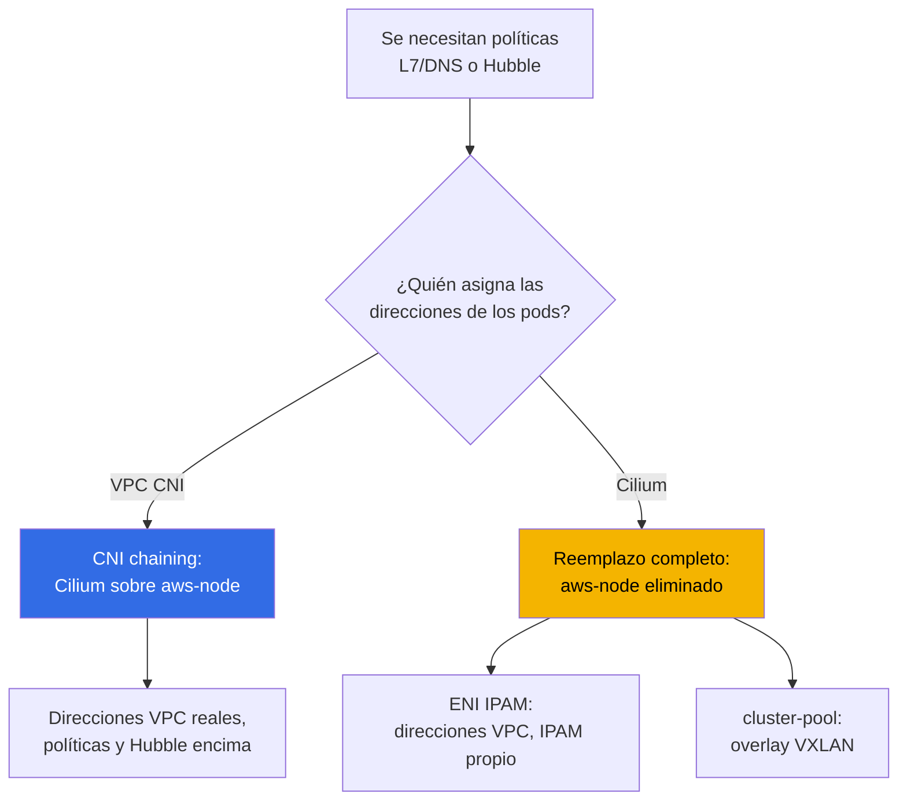
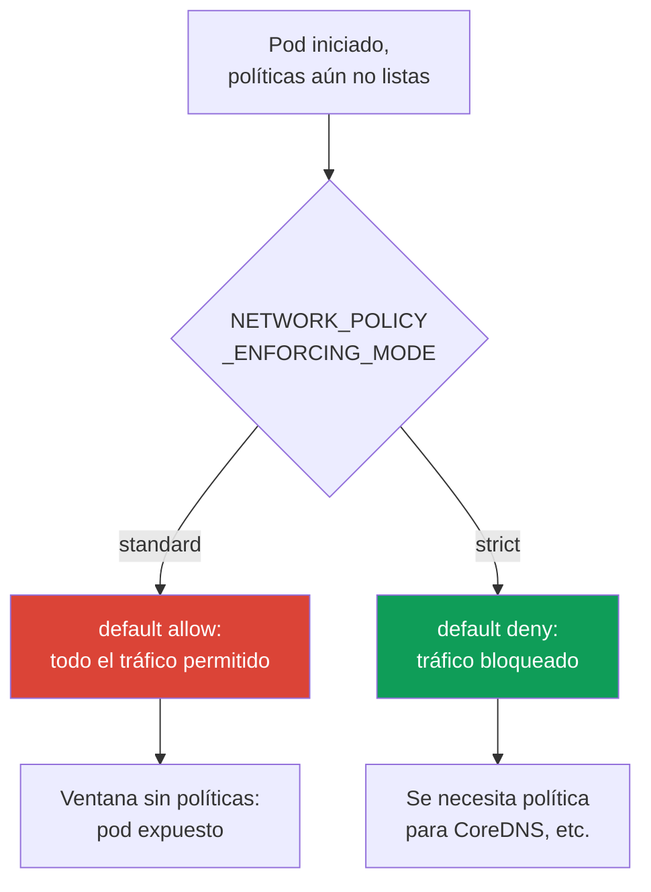

[Русская версия](ru.md) · [Eng version](en.md) · [Version française](fr.md) · [Deutsche Version](de.md) · [ქართული ვერსია](ge.md) · [繁體中文版](tw.md) · [日本語版](jp.md)
# Capítulo 8. Alternativas a VPC CNI: Cilium, modos de red y cuándo cambiar el CNI

> **Qué sigue.** Los capítulos 6 y 7 explicaron VPC CNI: direcciones reales de los pods, ENI, escasez
> de direcciones y sus soluciones sistémicas. Aquí se plantea otra cuestión: cuándo el CNI estándar
> carece de capacidades, no de direcciones, y si merece la pena cambiarlo. VPC CNI, ENI y la
> planificación de CIDR se tratan en el capítulo 6; prefix delegation, CIDR secundario y custom
> networking, en el capítulo 7, y no se repiten aquí. NetworkPolicy en detalle y el laboratorio
> default-deny se tratan en el capítulo 30 y el laboratorio 110; aquí solo se comparan capacidades.
> El análisis de fallos de red se trata en el capítulo 46, y la mecánica de upgrades y blue/green,
> en el capítulo 38.

## 8.1. «La NetworkPolicy integrada no es suficiente»

El clúster usa VPC CNI, tiene direcciones suficientes y los pods se comunican. Entonces llega un
requisito que la NetworkPolicy estándar no puede cubrir:

- seguridad solicita una regla: «este servicio solo puede conectarse a `api.stripe.com`», es decir,
  una política por **nombre DNS**, no por dirección o puerto;
- o se requiere una regla de nivel HTTP: «permitir `GET /health`, denegar todo lo demás»; es
  **L7**, la séptima capa, que la NetworkPolicy estándar no tiene;
- o el incidente se cerró, pero nadie pudo responder «quién hablaba con quién cuando ocurrió el
  fallo»: se necesita **observabilidad del tráfico** entre pods, un mapa de flujos y no solo Flow
  Logs a nivel de nodo;
- o el proyecto crece hacia una red **multiclúster** con una política compartida y conectividad
  transparente.

Ninguno de estos requisitos trata sobre escasez de direcciones. Tratan sobre las capacidades del
plugin de red. Surge una pregunta que en EKS resulta costosa: si se debe cambiar el CNI, por cuál
y a qué coste operativo. La respuesta predeterminada es **no cambiarlo**, pero para tomarla de
forma consciente hay que entender sus límites.

## 8.2. Qué proporcionan VPC CNI y su NetworkPolicy integrada

VPC CNI no es solo la asignación de direcciones (capítulo 6). Desde la versión `1.14`, incorpora
una **implementación eBPF de NetworkPolicy**. Está organizada así:

- el **controlador de políticas** vive en el control plane de EKS y se instala automáticamente al
  crear el clúster; observa objetos `NetworkPolicy` y distribuye reglas a los nodos;
- el **agente** (`aws-network-policy-agent`) se ejecuta como un contenedor independiente en el
  DaemonSet `aws-node` y carga programas eBPF en el kernel del nodo, que filtran el tráfico; se
  requiere kernel Linux `5.10`+;
- la funcionalidad está **desactivada de forma predeterminada** y se activa con el parámetro del
  addon `enableNetworkPolicy`.

```bash
kubectl get ds aws-node -n kube-system \
  -o jsonpath='{.spec.template.spec.containers[*].name}{"\n"}'   # aws-node + agente
aws eks update-addon --cluster-name demo --addon-name vpc-cni \
  --configuration-values '{"enableNetworkPolicy":"true"}' --resolve-conflicts PRESERVE
```

Esta implementación admite la **Kubernetes `NetworkPolicy`** estándar (L3/L4, por direcciones,
puertos, selectores de pods y namespaces) y, desde la versión `1.21`, también la administrativa
**`ClusterNetworkPolicy`** (`networking.k8s.aws/v1alpha1`) para reglas de todo el clúster. Todo
esto es un **managed addon**: se actualiza por el proceso estándar, está integrado con AWS y
**cuenta con soporte de AWS**.

Lo que no tiene por naturaleza:

- **reglas L7** (métodos y rutas HTTP, gRPC, Kafka): el filtrado es solo L3/L4;
- **políticas por nombres DNS**: las reglas se escriben por direcciones y selectores, no por FQDN;
- **CRD como `CiliumNetworkPolicy` y `CiliumClusterwideNetworkPolicy`** con sus capacidades
  ampliadas;
- **Hubble** y su observabilidad de flujos (mapa de servicios, métricas, descartes por política).

Precisamente esta lista lleva a los equipos a considerar Cilium.

## 8.3. Cilium en dos modos

Cilium se instala en EKS de dos formas fundamentalmente distintas; son dos decisiones distintas en
coste y riesgo.



**Modo 1. CNI chaining sobre VPC CNI.** VPC CNI continúa asignando direcciones a los pods mediante
ENI (sigue aplicando todo el capítulo 6: direcciones VPC reales, sin overlay, `max-pods` según la
fórmula). Cilium se conecta «en cadena»: después de que VPC CNI configura la interfaz del pod,
Cilium adjunta sus programas eBPF y añade **políticas (incluidas L7 y DNS) y observabilidad de
Hubble**. `aws-node` se mantiene y sigue funcionando. Es el camino menos invasivo: aumentan las
capacidades de las políticas, mientras que el modelo de direcciones y las integraciones VPC no se
tocan.

**Modo 2. Reemplazo completo de VPC CNI.** Se **elimina** el DaemonSet `aws-node`, Cilium pasa a
ser el único CNI y asume IPAM. Hay dos submodos:

- **ENI IPAM con native routing**: Cilium gestiona por sí mismo los ENI y entrega a los pods
  direcciones VPC reales, sin encapsulación. Las direcciones siguen siendo enrutables en la VPC,
  pero ahora Cilium, no AWS, es dueño del ciclo de vida de IPAM.
- **cluster-pool (overlay/VXLAN)**: las direcciones de los pods provienen de un pool virtual del
  clúster y se encapsulan. La escasez de direcciones VPC desaparece como clase de problema (las
  direcciones de los pods ya no provienen de la subred), pero con ella desaparecen las propiedades
  de la tabla del capítulo 6 (véase la sección 8.4).

| Qué proporciona VPC CNI NP | Qué añade Cilium | Qué se paga |
|---|---|---|
| `NetworkPolicy` estándar L3/L4 | `CiliumNetworkPolicy`, L7 (HTTP/gRPC/Kafka) | instalación propia y su mantenimiento |
| `ClusterNetworkPolicy` administrativa | `CiliumClusterwideNetworkPolicy`, políticas DNS | modelo propio de CRD, formación del equipo |
| agente eBPF como managed addon | Hubble: mapa de flujos, métricas, descartes | Hubble UI/Relay como componentes independientes |
| soporte de AWS, upgrades estándar | overlay y multiclúster opcionales | usted gestiona upgrades y compatibilidad |
| integración con SG for pods, Flow Logs | cifrado de tráfico (WireGuard/IPsec) | se pierden algunas integraciones AWS (sección 8.5) |

La tabla no dice «Cilium es mejor». La columna derecha es el coste, y es real.

**Modo eBPF con reemplazo de kube-proxy.** Cuando Cilium se convierte en el dataplane principal
(reemplazo completo y, a veces, también chaining), puede **reemplazar kube-proxy** con el parámetro
`kubeProxyReplacement=true`. Los programas eBPF de Cilium realizan entonces el balanceo de carga
de Service y NodePort en lugar de las iptables de kube-proxy. Esto evita el crecimiento de reglas
iptables en clústeres grandes, reduce la latencia y mejora el escalado de Service. El coste: se
necesita un kernel de nodo actual (socket-LB requiere kernel `4.19.57`/`5.2`+), se elimina el
managed addon `kube-proxy` de EKS y se asume la responsabilidad del balanceo de carga. Eliminar
kube-proxy rompe las conexiones Service existentes, por lo que se hace blue/green (sección 8.8),
no en nodos activos.

**Cilium ClusterMesh.** Para multiclúster, Cilium une las Pod Network de varios clústeres en una
sola red. La arquitectura es la siguiente: en cada clúster se levanta `clustermesh-apiserver`, que
comparte su estado con los pares y recibe el de ellos, mientras que los agentes se conectan al
apiserver de cada clúster. Los requisitos son estrictos: cada clúster necesita **`cluster-name` y
`cluster-id` únicos** y **PodCIDR sin solapamientos** (el CIDR de native routing debe abarcar todos
los clústeres). Los Service se marcan con la anotación `service.cilium.io/global: "true"`, y el
tráfico se balancea entre los pods de todos los clústeres. El coste es conectividad de control
plane entre clústeres, planificación de direcciones unificada y hacerse cargo de todo ello: VPC CNI
no puede hacerlo en absoluto.

En resumen, para el producto completo y no solo para NetworkPolicy:

| Eje de comparación | VPC CNI | Cilium |
|---|---|---|
| Direccionamiento de pods | direcciones VPC reales, IPAM gestionado | ENI IPAM u overlay, IPAM propio |
| NetworkPolicy | L3/L4 (+ `ClusterNetworkPolicy`) | L3/L4, L7 (HTTP/gRPC), DNS/FQDN |
| kube-proxy | managed addon estándar | reemplazo eBPF opcional (`kubeProxyReplacement`) |
| Observabilidad | Flow Logs por nodo | Hubble: mapa de flujos, métricas |
| Multiclúster | no | ClusterMesh (Pod Network compartida) |
| Operación | gestionada, soporte de AWS | usted gestiona upgrades y compatibilidad |

La columna izquierda indica lo que ya cubre el soporte de AWS; la derecha, las capacidades a costa
de asumir la gestión del CNI.

## 8.4. Otras alternativas y lo que se pierde con overlay

- **Calico**. En EKS suele adoptarse **solo para políticas sobre VPC CNI** (policy-only, dejando el
  direccionamiento en VPC CNI), no como CNI completo. Desde que VPC CNI tiene NetworkPolicy
  integrada, este caso de uso se ha reducido: si solo se necesita L3/L4 estándar, Calico separado
  ya no es obligatorio.
- **Modos overlay en general** (Cilium cluster-pool, Calico VXLAN/IPIP, flannel). Devuelven
  direcciones «virtuales» a los pods y eliminan la escasez de IPv4, pero a costa de volver al
  modelo del que EKS se alejó. Respecto al capítulo 6, se pierde lo siguiente:

| Propiedad (capítulo 6) | VPC CNI y modos ENI | Overlay |
|---|---|---|
| Direcciones reales de pods en la VPC | sí | no, CIDR virtual |
| Enrutamiento de pods en redes conectadas | sí | no, solo mediante gateway/SNAT |
| Security groups en el tráfico de pods | sí (incluido SG for pods, capítulo 19) | no |
| VPC Flow Logs ven las direcciones de pods | sí | no, ven las direcciones de nodos |
| Encapsulación, overhead y MTU | no | sí |

Overlay está justificado cuando la escasez de IPv4 no se puede resolver con los otros medios del
capítulo 7 y no se requiere enrutamiento directo de pods en la VPC. Es un compromiso consciente,
no una mejora.

## 8.5. El coste real de pasar a un CNI de reemplazo

Pasar de VPC CNI a un CNI propio no es cambiar una bandera, sino cambiar la zona de
responsabilidad. Esto es lo que cambia:

- **Usted gestiona el ciclo de vida del CNI.** Los upgrades dejan de ser un **managed addon**: los
  planifica, prueba y despliega usted, mediante Helm o su propio pipeline (capítulo 37).
- **El soporte de AWS se reduce.** El soporte estándar cubre VPC CNI; los problemas de un CNI de
  terceros quedan en el ámbito de su comunidad y de su equipo. Para EKS Hybrid Nodes, Cilium como
  CNI cuenta con soporte específico, pero para los nodos habituales en AWS VPC CNI sigue siendo el
  estándar.
- **La compatibilidad con la versión del clúster es su responsabilidad.** En un upgrade de
  Kubernetes (capítulos 3 y 38), usted verifica que la versión del CNI admita la nueva versión de
  control plane y la actualiza en el orden necesario. Antes lo hacía el managed addon.
- **Parte de las integraciones AWS deja de funcionar de forma inmediata.** **Security groups for
  pods** (capítulo 46) y la **visibilidad de direcciones de pods en VPC Flow Logs** dependen de
  VPC CNI y del modelo ENI; con overlay no funcionan y con ENI-IPAM ajeno hay que comprobarlas por
  separado, sin darlas por sentadas.
- **El diagnóstico se vuelve más complejo.** Un fallo de red ahora se analiza con las herramientas
  del CNI (`cilium`, Hubble), además de los recursos VPC y `aws-node`; aumenta el número de
  lugares en los que algo puede fallar.

```bash
cilium status                      # estado general del agente y del operador de Cilium
cilium connectivity test           # prueba de conectividad y políticas tras la instalación
kubectl get ciliumnetworkpolicies -A   # CiliumNetworkPolicy aplicadas
```

Estos comandos solo están disponibles después de instalar Cilium; no existen en VPC CNI sin
modificaciones. Que aparezca la CLI `cilium` en el clúster ya es señal de que usted asumió la
responsabilidad anterior.

## 8.6. Orden de aplicación de políticas al arrancar un pod y ventana sin políticas

Es fácil pasar por alto un detalle importante para la seguridad: **entre iniciar un pod y aplicarle
las políticas hay un intervalo**. En la NetworkPolicy integrada de VPC CNI, el comportamiento en
ese intervalo lo define la variable `NETWORK_POLICY_ENFORCING_MODE` del agente:



- **`standard` (predeterminado).** Hasta que el agente configura todas las reglas para un pod
  nuevo, este opera con **default allow**: todo ingress y egress está abierto. Existe una
  **ventana sin políticas**, segundos en los que el pod ya recibe y envía tráfico, pero el filtrado
  aún no se ha aplicado. Es práctico para un inicio rápido, pero una brecha para aislamiento
  estricto.
- **`strict`.** El pod se inicia con **default deny** y solo después se aplican reglas de permiso.
  No hay ventana, pero entonces **debe haber una política para cada dirección que necesite el
  pod**, incluido el acceso a CoreDNS; de lo contrario, el pod no resuelve nombres ni inicia bien.

Este es un compromiso fundamental entre «velocidad de inicio frente a ausencia de ventana».
Cilium resuelve la misma tarea con sus propios mecanismos, pero el principio es común: si se exige
la garantía de que un pod no esté abierto ni un segundo, el modo predeterminado no es adecuado y
hay que incorporarlo al diseño (en detalle, capítulo 30).

## 8.7. Cuándo cambiar el CNI y cuándo no

De forma predeterminada, **manténgase en VPC CNI**. Cambie solo por una necesidad concreta y
nombrada.

| Necesidad | Mantenerse en VPC CNI | Cambiar/complementar CNI |
|---|---|---|
| NetworkPolicy L3/L4 estándar | sí, agente integrado | no tiene sentido |
| Reglas por DNS o L7 (HTTP/gRPC) | no lo cubre | Cilium (chaining es suficiente) |
| Observabilidad de flujos entre pods | Flow Logs por nodo | Cilium + Hubble (chaining) |
| Red multiclúster con política unificada | no lo cubre | Cilium (cluster mesh) |
| Escasez de IPv4 irresoluble (el capítulo 7 no ayudó) | persiste la escasez | overlay como último recurso |
| Direcciones reales, SG for pods y Flow Logs son importantes | sí, es su punto fuerte | el reemplazo los elimina |

Reglas de elección:

- **Se necesitan políticas L7/DNS o Hubble, y el modelo de direcciones es adecuado**: adopte
  Cilium en modo **CNI chaining**; obtiene capacidades sin ceder IPAM ni las integraciones VPC.
  Es la respuesta más habitual y con menor riesgo.
- **El reemplazo completo está justificado** de forma limitada: se necesita overlay para escapar de
  la escasez de direcciones, multiclúster o requisitos que el modelo ENI no ofrece en principio.
- **No cambie el CNI «para el futuro» o «porque está de moda».** Cada punto de la sección 8.5 es
  una carga permanente para el equipo, no una configuración puntual.

## 8.8. La migración de CNI como operación de riesgo

No se puede cambiar el CNI en un clúster activo con una bandera. El CNI se asigna a un pod al
crearlo, y los pods ya ejecutándose no migrarán solos al nuevo plugin. Por ello, cambiar el CNI
casi siempre implica **recrear nodos o clúster**, no conmutar sobre la marcha.

La ruta segura es **blue/green** (la mecánica de upgrade y recreación está en el capítulo 38; aquí,
el principio):

1. levantar un **nuevo pool de nodos** etiquetado, con el CNI nuevo (o un clúster independiente);
2. comprobar en él conectividad y políticas (`cilium connectivity test`), integraciones AWS y DNS;
3. trasladar la carga gradualmente, hacer cordon/drain de los nodos antiguos de uno en uno y con
   atención a los PDB;
4. solo después de comprobar que todo funciona, eliminar el stack antiguo (en un reemplazo,
   eliminar `aws-node`).

La conmutación «directa» en un clúster en funcionamiento es peligrosa porque, durante la
transición, viven en el clúster pods con dos stacks de red distintos y la conectividad entre ellos,
las políticas y el egress tienen un comportamiento impredecible. Por eso, aislar los stacks
antiguo y nuevo por nodos es un elemento obligatorio, no una precaución «por si acaso».

## 8.9. Cómo se aplica esto en producción

- **De forma predeterminada se mantiene VPC CNI** y se activa su NetworkPolicy integrada: basta
  para aislamiento L3/L4 y todo permanece bajo soporte de AWS.
- **Cilium se añade en modo CNI chaining** cuando realmente se necesitan políticas L7/DNS o
  Hubble: el modelo de direcciones y las integraciones VPC no se tocan.
- **Se elige el reemplazo completo de CNI para una necesidad concreta** (overlay ante escasez de
  direcciones, multiclúster) y se incluye en el presupuesto del equipo la gestión de upgrades y
  diagnóstico.
- **El modo de aplicación de políticas se elige de forma consciente**: `strict` donde una ventana
  sin políticas sea inaceptable, con una política obligatoria para CoreDNS.
- **Todo cambio de CNI se realiza como blue/green** mediante un nuevo pool de nodos, no activando
  una bandera en un clúster activo.

## 8.10. Mini glosario

- **VPC CNI network policy**: implementación integrada de `NetworkPolicy` sobre eBPF: un
  controlador en el control plane más el agente `aws-network-policy-agent` en `aws-node`; se
  activa con el parámetro del addon `enableNetworkPolicy`. Admite `NetworkPolicy` L3/L4 y la
  administrativa `ClusterNetworkPolicy` (`networking.k8s.aws/v1alpha1`).
- **CNI chaining**: modo en el que VPC CNI asigna direcciones y configura la interfaz, mientras
  Cilium añade políticas y observabilidad encima; `aws-node` permanece.
- **Reemplazo completo**: se elimina `aws-node`; Cilium es el único CNI con su propio IPAM:
  **ENI IPAM** (direcciones VPC reales) o **cluster-pool** (overlay/VXLAN, direcciones virtuales).
- **`CiliumNetworkPolicy` / `CiliumClusterwideNetworkPolicy`**: CRD de Cilium con reglas L7 y
  DNS. **Hubble**: observabilidad de flujos de Cilium.
- **`NETWORK_POLICY_ENFORCING_MODE`**: modo de aplicación de políticas al iniciar un pod:
  `standard` (default allow, hay una ventana sin políticas) o `strict` (default deny).
- **`kubeProxyReplacement`**: modo de Cilium donde eBPF balancea Service/NodePort en lugar de
  kube-proxy; `true` activa el reemplazo. Requiere un kernel actual y gestionar el balanceo.
- **ClusterMesh**: unión de Pod Network de varios clústeres Cilium mediante
  `clustermesh-apiserver`; se requieren `cluster-id` únicos y PodCIDR sin solapamientos.

## 8.11. Resumen del capítulo

- El motivo para cambiar el CNI son las capacidades, no las direcciones: políticas L7 o DNS,
  observabilidad de flujos, multiclúster. La cuestión de direcciones se resuelve con los recursos
  del capítulo 7, no cambiando el CNI.
- VPC CNI ofrece NetworkPolicy integrada en eBPF (controlador más agente, bandera
  `enableNetworkPolicy`): `ClusterNetworkPolicy` L3/L4 estándar y administrativa, todo como
  managed addon bajo soporte de AWS. No tiene L7, políticas DNS, CRD de Cilium ni Hubble.
- Cilium se instala de dos formas: CNI chaining sobre VPC CNI (las direcciones y las integraciones
  VPC permanecen; encima, políticas y Hubble) y reemplazo completo (`aws-node` eliminado, IPAM
  propio: modo ENI u overlay). Chaining es el camino de menor riesgo hacia L7/DNS y
  observabilidad.
- Overlay elimina la escasez de IPv4, pero quita direcciones reales de pods, su enrutamiento en
  redes conectadas, security groups sobre el tráfico de pods y visibilidad de pods en Flow Logs.
- El coste del reemplazo de CNI: usted gestiona upgrades (ya no es managed addon), el soporte de
  AWS se reduce, la compatibilidad con la versión del clúster pasa a ser suya, algunas
  integraciones (SG for pods, Flow Logs por pod) dejan de funcionar de forma inmediata y el
  diagnóstico se vuelve más complejo.
- Al iniciar un pod hay una ventana sin políticas: `standard` abre tráfico hasta aplicar reglas,
  `strict` lo bloquea, pero requiere una política para CoreDNS. Cambiar el CNI es blue/green con
  nodos nuevos, no cambiar una bandera sobre la marcha.
- En modo eBPF, Cilium puede reemplazar kube-proxy (`kubeProxyReplacement=true`) y unir clústeres
  mediante ClusterMesh: ambas funciones eliminan componentes managed estándar y requieren kernel
  actual, PodCIDR sin solapamientos y que usted gestione balanceo y direcciones.

## 8.12. Cómo será útil en el trabajo real

El requisito «políticas por nombres DNS» o «muestre el mapa de tráfico durante el incidente» no
llega desde redes, sino desde seguridad o desarrollo, y es fácil responder de forma costosa:
«cambiamos el CNI». Pero un ingeniero con un plan pregunta primero si el modelo de direcciones es
adecuado y, de ser así, adopta Cilium en modo chaining sin ceder IPAM ni las integraciones VPC.
Deja el reemplazo completo para los casos en los que de verdad se necesita, y calcula de antemano
que los upgrades del CNI y la compatibilidad con la versión del clúster pasan a ser su trabajo
permanente. En tiempos tranquilos, esto afecta al diseño: se elige conscientemente el modo de
aplicación de políticas y toda migración de CNI se planifica como blue/green, no como una bandera.

## 8.13. Preguntas de autoevaluación

1. ¿Qué requisitos justifican cambiar el CNI y cuáles se resuelven con los recursos del capítulo 7?
2. ¿De qué componentes se compone la NetworkPolicy integrada de VPC CNI y cómo se activa?
3. ¿Qué puede hacer la NetworkPolicy integrada de VPC CNI y qué no tiene por naturaleza?
4. ¿En qué se diferencia CNI chaining del reemplazo completo de VPC CNI y qué permanece igual con chaining?
5. ¿Cuáles son los dos submodos de IPAM en un reemplazo completo por Cilium y cómo se diferencian en las direcciones de pods?
6. ¿Qué se pierde respecto al capítulo 6 al pasar a overlay?
7. Enumere qué deja exactamente de ser responsabilidad de AWS y pasa a ser suya al reemplazar el CNI.
8. ¿Por qué security groups for pods y Flow Logs de pods pueden dejar de funcionar al cambiar el CNI?
9. ¿Qué es la ventana sin políticas y cómo la afecta `NETWORK_POLICY_ENFORCING_MODE`?
10. ¿Qué peligro tiene el modo `strict` y por qué necesita una política para CoreDNS?
11. ¿Con qué indicios elegir «mantener VPC CNI» frente a «complementar con Cilium en chaining»?
12. ¿Por qué el CNI no se puede cambiar con una bandera y cómo es la ruta blue/green?
13. ¿Qué aporta `kubeProxyReplacement=true` y qué requisitos de direcciones tiene ClusterMesh?

## Práctica

El laboratorio del curso para este tema es el [laboratorio 132 - CNI alternativo: Cilium en modo
CNI chaining sobre VPC CNI](../../labs/132/README_ES.MD). Allí se instala Cilium mediante Helm
sobre un VPC CNI en funcionamiento (`cni.chainingMode: aws-cni`), se demuestra que IPAM sigue en
VPC CNI y, por encima, aparecen una regla L7 por método HTTP, una política por nombre DNS mediante
`toFQDNs` y un mapa de flujos con verdict en Hubble. El reemplazo completo de VPC CNI queda fuera
del alcance del laboratorio de forma consciente: es blue/green mediante nodos nuevos (sección 8.8),
no cambiar una bandera. El resultado se verifica con el comando `check_result`. También pertenece
a este tema el [laboratorio 110 - NetworkPolicy en EKS: network policy integrada de VPC CNI](../../labs/110/README_ES.MD),
donde la network policy integrada de VPC CNI se comprueba por separado, sin Cilium.

A continuación se muestra lo mismo con comandos habituales en cualquier clúster propio. Empiece
por comprobar lo que existe ahora: `kubectl get ds aws-node -n kube-system` mostrará si VPC CNI
está funcionando, y `kubectl get ds aws-node -n kube-system -o jsonpath='{.spec.template.spec.containers[*].name}'`
mostrará si está junto a él el contenedor `aws-network-policy-agent`, es decir, si la NetworkPolicy
integrada está activada. Consulte el estado y la versión del addon mediante `aws eks describe-addon
--cluster-name <cluster> --addon-name vpc-cni`: una versión inferior a `1.14` significa que no hay
NetworkPolicy integrada, y una inferior a `1.21`, que no hay `ClusterNetworkPolicy` administrativas.

Compruebe el modo de aplicación de políticas: busque `NETWORK_POLICY_ENFORCING_MODE` en
`kubectl describe ds aws-node -n kube-system | grep -i NETWORK_POLICY`; un resultado vacío
significa el modo `standard` predeterminado y, por tanto, una ventana sin políticas al iniciar pods.
Si Cilium ya está instalado en el clúster, compare la situación: `cilium status` mostrará el modo y
los componentes, `kubectl get ciliumnetworkpolicies -A` las políticas L7/DNS aplicadas y `cilium
connectivity test` ejecutará la prueba de conectividad (tenga en cuenta que crea cargas temporales).
En VPC CNI sin modificaciones esos comandos no existirán: esa es precisamente la frontera visible
entre «nos mantenemos» y «asumimos un CNI ajeno».

---
[Índice](../README_ES.md) · [Capítulo 7](../07/es.md) · [Capítulo 9](../09/es.md)
