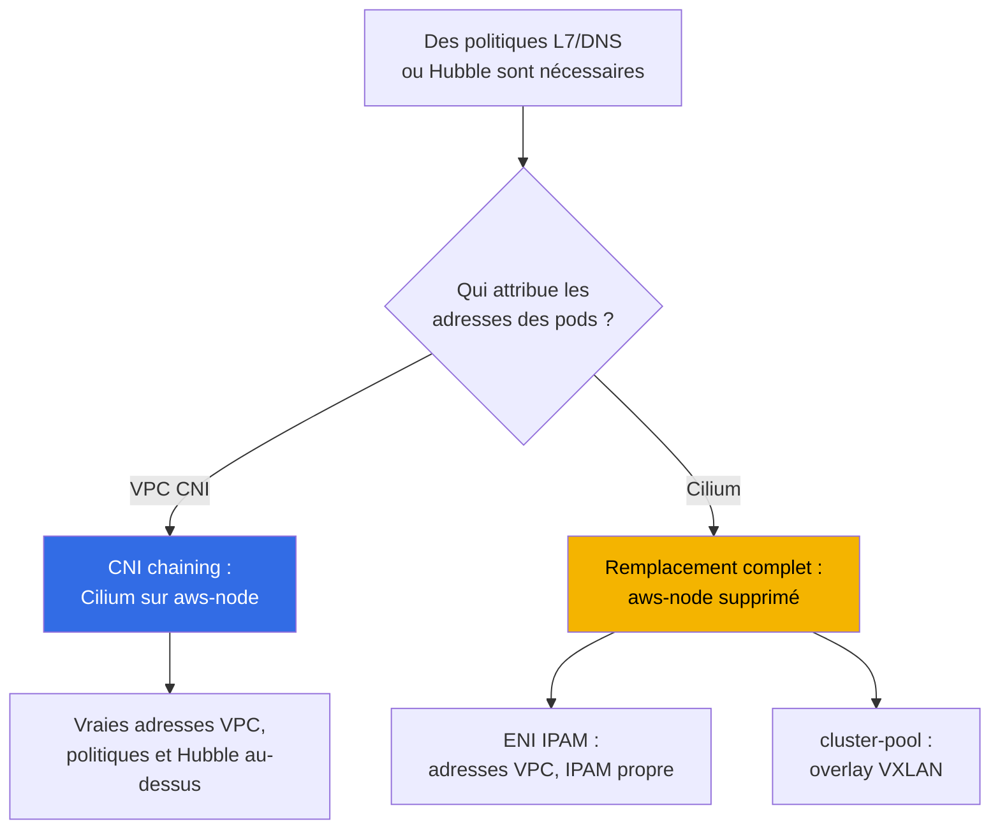
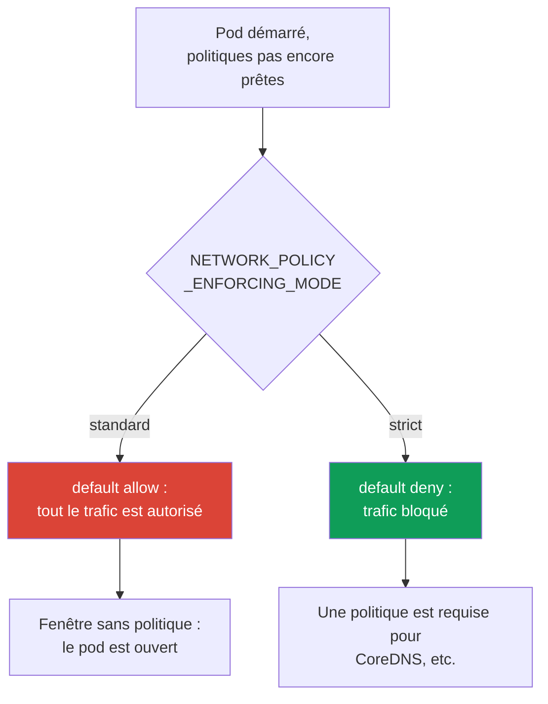

[Русская версия](ru.md) · [Eng version](en.md) · [Versión en español](es.md) · [Deutsche Version](de.md) · [ქართული ვერსია](ge.md) · [繁體中文版](tw.md) · [日本語版](jp.md)
# Chapitre 8. Alternatives à VPC CNI : Cilium, modes réseau, quand changer de CNI

> **La suite.** Les chapitres 6 et 7 ont traité de VPC CNI : vraies adresses des pods, ENI, pénurie
> d'adresses et ses solutions au niveau système. Ici, la question est différente : quand le CNI standard
> manque de capacités plutôt que d'adresses, et faut-il le remplacer. VPC CNI lui-même, les ENI et la
> planification CIDR sont au chapitre 6 ; prefix delegation, secondary CIDR et custom networking sont au
> chapitre 7 et ne sont pas répétés ici. NetworkPolicy en détail et le lab default-deny sont au chapitre 30
> et au lab 110 ; ce chapitre ne compare que les capacités. L'analyse des pannes réseau est au chapitre 46,
> et la mécanique des mises à niveau et du blue/green au chapitre 38.

## 8.1. « Le NetworkPolicy intégré ne suffit pas »

Le cluster utilise VPC CNI, les adresses sont suffisantes, les pods communiquent. Puis une exigence arrive,
que le NetworkPolicy standard ne peut pas satisfaire :

- la sécurité demande une règle disant « ce service ne peut se connecter qu'à `api.stripe.com` », c'est-à-dire
  une politique par **nom DNS**, et non par adresse ou port ;
- ou une règle au niveau HTTP est exigée : « autoriser `GET /health`, refuser tout le reste » - c'est du **L7**,
  la septième couche, que le NetworkPolicy standard ne possède pas ;
- ou l'incident est clos, mais personne ne peut répondre à « qui parlait à qui au moment de la panne » : il faut
  de l'**observabilité du trafic** entre pods, une carte des flux plutôt que les seuls Flow Logs au niveau des nœuds ;
- ou le projet se développe en réseau **multi-cluster** avec une politique partagée et une connectivité transparente.

Aucune de ces exigences ne concerne la pénurie d'adresses. Elles concernent les capacités du plugin réseau.
Cela pose, dans EKS, une question coûteuse : faut-il changer de CNI, pour lequel, et à quel coût opérationnel ?
La réponse par défaut est **de ne pas le changer**, mais pour faire ce choix consciemment, il faut en comprendre
les limites.

## 8.2. Ce que fournissent VPC CNI et son NetworkPolicy intégré

VPC CNI ne se limite pas à l'attribution d'adresses (chapitre 6). Depuis la version `1.14`, il dispose d'une
**implémentation eBPF intégrée de NetworkPolicy**. Son fonctionnement est le suivant :

- le **contrôleur de politiques** vit dans le control plane EKS et est installé automatiquement lors de la
  création du cluster ; il surveille les objets `NetworkPolicy` et distribue les règles aux nœuds ;
- l'**agent** (`aws-network-policy-agent`) s'exécute dans un conteneur distinct du DaemonSet `aws-node` et
  charge des programmes eBPF dans le noyau du nœud pour filtrer le trafic ; un noyau Linux `5.10`+ est requis ;
- la fonctionnalité est **désactivée par défaut** et s'active avec le paramètre d'addon `enableNetworkPolicy`.

```bash
kubectl get ds aws-node -n kube-system \
  -o jsonpath='{.spec.template.spec.containers[*].name}{"\n"}'   # aws-node + agent
aws eks update-addon --cluster-name demo --addon-name vpc-cni \
  --configuration-values '{"enableNetworkPolicy":"true"}' --resolve-conflicts PRESERVE
```

Cette implémentation prend en charge le **Kubernetes `NetworkPolicy`** standard (L3/L4, par adresses,
ports, sélecteurs de pods et namespaces), et depuis la version `1.21`, le **`ClusterNetworkPolicy`**
administratif (`networking.k8s.aws/v1alpha1`) pour les règles à l'échelle du cluster. Tout cela est un
**managed addon** : il est mis à jour par le processus standard, intégré à AWS et **couvert par le support AWS**.

Ce qu'il ne propose fondamentalement pas :

- des **règles L7** (méthodes et chemins HTTP, gRPC, Kafka) - le filtrage se limite à L3/L4 ;
- des **politiques par nom DNS** - les règles sont écrites pour des adresses et des sélecteurs, pas des FQDN ;
- des **CRD tels que `CiliumNetworkPolicy` et `CiliumClusterwideNetworkPolicy`** avec leurs capacités étendues ;
- **Hubble** et son observabilité des flux (carte des services, métriques, rejets par politique).

C'est précisément cette liste qui pousse les équipes à regarder Cilium.

## 8.3. Cilium dans deux modes

Cilium est déployé sur EKS de deux façons fondamentalement différentes, qui constituent deux décisions
différentes en termes de coût et de risque.



**Mode 1. CNI chaining au-dessus de VPC CNI.** VPC CNI continue d'attribuer les adresses aux pods via les
ENI (tout le chapitre 6 reste vrai : vraies adresses VPC, aucun overlay, `max-pods` calculé par formule).
Cilium se branche « dans la chaîne » : après que VPC CNI a configuré l'interface du pod, Cilium attache ses
programmes eBPF et ajoute **des politiques (dont L7 et DNS) ainsi que l'observabilité Hubble**. `aws-node`
reste présent et continue de fonctionner. C'est le chemin le moins invasif : les capacités de politiques
augmentent, tandis que le modèle d'adressage et les intégrations VPC restent inchangés.

**Mode 2. Remplacement complet de VPC CNI.** Le DaemonSet `aws-node` est **supprimé**, Cilium devient le
seul CNI et prend en charge IPAM. Il existe deux sous-modes :

- **ENI IPAM avec native routing** : Cilium gère lui-même les ENI et donne aux pods de vraies adresses VPC,
  sans encapsulation. Les adresses restent routables dans le VPC, mais c'est désormais Cilium, et non AWS,
  qui possède le cycle de vie d'IPAM.
- **cluster-pool (overlay/VXLAN)** : les adresses des pods proviennent d'un pool virtuel du cluster et sont
  encapsulées. La pénurie d'adresses VPC disparaît en tant que classe de problème (les adresses des pods ne
  viennent plus du sous-réseau), mais les propriétés du tableau du chapitre 6 disparaissent avec elle (voir section 8.4).

| Ce que fournit VPC CNI NP | Ce que Cilium ajoute | Ce que vous payez |
|---|---|---|
| `NetworkPolicy` L3/L4 standard | `CiliumNetworkPolicy`, L7 (HTTP/gRPC/Kafka) | votre propre installation et sa maintenance |
| `ClusterNetworkPolicy` administratif | `CiliumClusterwideNetworkPolicy`, politiques DNS | son propre modèle de CRD, formation de l'équipe |
| agent eBPF en tant que managed addon | Hubble : carte des flux, métriques, rejets | Hubble UI/Relay comme composants distincts |
| support AWS, mises à niveau standard | overlay et multi-cluster en option | vous possédez les mises à niveau et la compatibilité |
| intégration avec SG for pods, Flow Logs | chiffrement du trafic (WireGuard/IPsec) | certaines intégrations AWS sont perdues (section 8.5) |

Le tableau ne dit pas que « Cilium est meilleur ». La colonne de droite est le coût, et il est réel.

**Mode eBPF avec remplacement de kube-proxy.** Lorsque Cilium devient le dataplane principal (remplacement
complet, et parfois chaining), il peut **remplacer kube-proxy** à l'aide du paramètre
`kubeProxyReplacement=true`. Les programmes eBPF de Cilium effectuent alors l'équilibrage de charge Service
et NodePort à la place des iptables de kube-proxy. Les bénéfices : pas d'accumulation de règles iptables dans
les grands clusters, une latence plus faible et une meilleure mise à l'échelle des Services. Le coût : un noyau
récent sur les nœuds (socket-LB requiert le noyau `4.19.57`/`5.2`+), la suppression du managed addon
`kube-proxy` d'EKS et la prise de responsabilité de l'équilibrage de charge. La suppression de kube-proxy
interrompt les connexions Service existantes ; elle se fait donc en blue/green (section 8.8), et non sur des nœuds actifs.

**Cilium ClusterMesh.** Pour les environnements multi-cluster, Cilium fusionne les Pod Networks de plusieurs
clusters en un réseau unique. L'architecture est la suivante : chaque cluster exécute `clustermesh-apiserver`,
qui partage son état avec ses pairs et récupère le leur, tandis que les agents se connectent à l'apiserver de
chaque cluster. Les exigences sont strictes : chaque cluster doit avoir un **`cluster-name` et un `cluster-id`
uniques** ainsi que des **PodCIDR qui ne se chevauchent pas** (le CIDR de native routing doit couvrir tous les
clusters). Les Services sont marqués par l'annotation `service.cilium.io/global: "true"`, et le trafic est
équilibré entre les pods de tous les clusters. Le coût est la connectivité du control plane entre clusters, une
planification d'adressage unifiée et la responsabilité de l'ensemble - VPC CNI ne sait pas du tout faire cela.

En résumé, pour le produit dans son ensemble et non uniquement pour NetworkPolicy :

| Axe de comparaison | VPC CNI | Cilium |
|---|---|---|
| Adressage des pods | vraies adresses VPC, IPAM géré | ENI IPAM ou overlay, IPAM propre |
| NetworkPolicy | L3/L4 (+ `ClusterNetworkPolicy`) | L3/L4, L7 (HTTP/gRPC), DNS/FQDN |
| kube-proxy | managed addon standard | remplacement eBPF optionnel (`kubeProxyReplacement`) |
| Observabilité | Flow Logs au niveau des nœuds | Hubble : carte des flux, métriques |
| Multi-cluster | non | ClusterMesh (Pod Network partagé) |
| Exploitation | gérée, support AWS | vous possédez les mises à niveau et la compatibilité |

La colonne de gauche représente ce qui est déjà couvert par le support AWS ; celle de droite, des capacités au
prix de la responsabilité du CNI.

## 8.4. Autres alternatives et ce que l'overlay fait perdre

- **Calico**. Sur EKS, il est plus souvent utilisé **uniquement pour les politiques au-dessus de VPC CNI**
  (policy-only, en laissant l'adressage à VPC CNI), et non comme CNI complet. Depuis que VPC CNI dispose d'un
  NetworkPolicy intégré, ce cas d'usage s'est réduit : si seul le L3/L4 standard est nécessaire, un Calico
  distinct n'est plus obligatoire.
- **Les modes overlay en général** (Cilium cluster-pool, Calico VXLAN/IPIP, flannel). Ils rétablissent des
  adresses de pods « virtuelles » et éliminent la pénurie IPv4, mais au prix d'un retour au modèle dont EKS
  s'est éloigné. Par rapport au chapitre 6, on perd :

| Propriété (chapitre 6) | VPC CNI et modes ENI | Overlay |
|---|---|---|
| Vraies adresses des pods dans le VPC | oui | non, CIDR virtuel |
| Routage des pods dans les réseaux connectés | oui | non, uniquement via passerelle/SNAT |
| Security groups sur le trafic des pods | oui (dont SG for pods, chapitre 19) | non |
| VPC Flow Logs voient les adresses des pods | oui | non, ils voient les adresses des nœuds |
| Encapsulation et surcharge, MTU | non | oui |

L'overlay est justifié lorsque la pénurie IPv4 ne peut pas être résolue par les autres moyens énumérés au
chapitre 7 et que le routage direct des pods dans le VPC n'est pas requis. C'est un compromis conscient, pas
une amélioration.

## 8.5. Le coût réel du passage à un CNI de remplacement

Quitter VPC CNI pour son propre CNI ne revient pas à changer un drapeau, mais à déplacer la frontière des
responsabilités. Ce qui change :

- **Vous possédez le cycle de vie du CNI.** Les mises à niveau ne sont plus un **managed addon** : vous les
  planifiez, les testez et les déployez par Helm ou votre propre pipeline (chapitre 37).
- **Le support AWS se restreint.** Le support standard couvre VPC CNI ; les problèmes d'un CNI tiers relèvent
  de sa communauté et de votre équipe. Cilium comme CNI est spécifiquement pris en charge pour EKS Hybrid
  Nodes, mais VPC CNI reste le CNI standard des nœuds ordinaires dans AWS.
- **La compatibilité avec la version du cluster devient votre responsabilité.** Lors d'une mise à niveau
  Kubernetes (chapitres 3 et 38), vous vérifiez vous-même que la version du CNI prend en charge la nouvelle
  version du control plane et effectuez les mises à niveau dans le bon ordre. Auparavant, le managed addon le faisait.
- **Certaines intégrations AWS ne fonctionnent plus « immédiatement ».** Les **Security groups for pods**
  (chapitre 46) et la **visibilité des adresses de pods dans VPC Flow Logs** sont liés à VPC CNI et au modèle ENI ;
  avec l'overlay, ils ne fonctionnent pas et, avec un autre ENI IPAM, ils doivent être vérifiés séparément plutôt
  que supposés acquis.
- **Le diagnostic devient plus complexe.** Une panne réseau s'analyse désormais avec les outils du CNI
  (`cilium`, Hubble), et non seulement avec les outils VPC et `aws-node` ; le nombre de points de défaillance augmente.

```bash
cilium status                      # état général de l'agent et de l'opérateur Cilium
cilium connectivity test           # vérification de la connectivité et des politiques après l'installation
kubectl get ciliumnetworkpolicies -A   # ressources CiliumNetworkPolicy appliquées
```

Ces commandes ne sont disponibles qu'après l'installation de Cilium ; elles n'existent pas sur un VPC CNI pur.
La présence de la CLI `cilium` dans un cluster est en elle-même un signal que vous avez assumé la responsabilité
mentionnée ci-dessus.

## 8.6. Ordre d'application des politiques au démarrage d'un pod et fenêtre sans politique

Un point facile à manquer mais critique pour la sécurité est qu'**il existe un intervalle entre le démarrage
d'un pod et l'application des politiques qui le concernent**. Avec le NetworkPolicy intégré de VPC CNI, le
comportement dans cet intervalle est défini par la variable `NETWORK_POLICY_ENFORCING_MODE` de l'agent :



- **`standard` (par défaut).** Jusqu'à ce que l'agent configure toutes les règles pour un nouveau pod, il
  fonctionne avec **default allow** : tout l'ingress et l'egress sont ouverts. Il existe une **fenêtre sans
  politique** - quelques secondes durant lesquelles le pod accepte et envoie déjà du trafic, mais où le
  filtrage n'est pas encore appliqué. C'est pratique pour un démarrage rapide, mais c'est une faille pour une
  isolation stricte.
- **`strict`.** Le pod démarre avec **default deny**, et les règles d'autorisation ne sont appliquées
  qu'ensuite. Il n'y a pas de fenêtre, mais **chaque adresse nécessaire au pod doit alors avoir une politique**,
  y compris l'accès à CoreDNS ; sinon le pod ne résoudra pas les noms et ne démarrera pas normalement.

C'est le compromis fondamental entre « vitesse de démarrage et absence de fenêtre ». Cilium résout la même
tâche avec ses propres mécanismes, mais le principe est commun : si l'on exige la garantie qu'un pod ne soit
jamais ouvert, même une seconde, le mode par défaut ne convient pas et cela doit faire partie de la conception
(traité en détail au chapitre 30).

## 8.7. Quand changer de CNI, et quand ne pas le faire

Par défaut, **restez sur VPC CNI**. Ne changez que pour un besoin précis et identifié.

| Besoin | Rester sur VPC CNI | Changer/compléter le CNI |
|---|---|---|
| NetworkPolicy L3/L4 standard | oui, agent intégré | aucune raison |
| Règles par nom DNS ou L7 (HTTP/gRPC) | non couvert | Cilium (chaining suffit) |
| Observabilité des flux entre pods | Flow Logs au niveau des nœuds | Cilium + Hubble (chaining) |
| Réseau multi-cluster avec politique unifiée | non couvert | Cilium (cluster mesh) |
| Pénurie IPv4 insoluble (chapitre 7 n'a pas aidé) | la pénurie demeure | overlay en dernier recours |
| Vraies adresses, SG for pods, Flow Logs importants | oui, c'est son point fort | le remplacement supprime tout cela |

Règles de sélection :

- **Des politiques L7/DNS ou Hubble sont nécessaires, tandis que le modèle d'adressage convient** - utilisez
  Cilium en mode **CNI chaining** : vous obtenez les capacités sans abandonner IPAM ni les intégrations VPC.
  C'est la réponse la plus courante et celle dont le coût en risque est le plus faible.
- **Un remplacement complet n'est justifié** que dans un périmètre restreint : un overlay est nécessaire pour
  échapper à la pénurie d'adresses, ou le multi-cluster est requis, ou des exigences existent que le modèle ENI
  ne peut pas satisfaire en principe.
- **Ne changez pas de CNI « pour l'avenir » ou « parce que c'est à la mode ».** Chaque élément de la section 8.5
  est une charge permanente pour l'équipe, et non une configuration ponctuelle.

## 8.8. La migration de CNI comme opération risquée

Il est **impossible** de changer de CNI dans un cluster actif en basculant un drapeau. Le CNI est attribué à un
pod lors de sa création, et les pods déjà en cours d'exécution ne migrent pas d'eux-mêmes vers le nouveau plugin.
Changer de CNI est donc presque toujours une **recréation des nœuds ou du cluster**, pas un basculement sur place.

Le chemin sûr est le **blue/green** (la mécanique de mise à niveau et de recréation est au chapitre 38 ; le
principe est donné ici) :

1. créer un **nouveau pool de nœuds** marqué pour le nouveau CNI (ou un cluster distinct) ;
2. y vérifier la connectivité et les politiques (`cilium connectivity test`), les intégrations AWS et DNS ;
3. déplacer progressivement les charges, en cordon/drain les anciens nœuds un par un en tenant compte des PDB ;
4. seulement après avoir confirmé que tout fonctionne, supprimer l'ancienne pile (dans le cas d'un remplacement,
   supprimer `aws-node`).

Un basculement direct sur un cluster en fonctionnement est dangereux parce que, durant la transition, des pods
sur deux piles réseau différentes coexistent dans le cluster, et la connectivité entre eux, les politiques et
egress se comportent de façon imprévisible. Isoler les anciennes et nouvelles piles par nœud est donc un élément
obligatoire, et non une précaution « au cas où ».

## 8.9. Comment cela est utilisé en production

- **Par défaut, les équipes restent sur VPC CNI** et activent son NetworkPolicy intégré : cela suffit pour
  l'isolation L3/L4, et tout reste couvert par le support AWS.
- **Cilium est ajouté en mode CNI chaining** lorsque les politiques L7/DNS ou Hubble sont réellement nécessaires :
  le modèle d'adressage et les intégrations VPC restent inchangés.
- **Le remplacement complet du CNI est choisi pour un besoin précis** (overlay pour la pénurie d'adresses,
  multi-cluster) et la responsabilité des mises à niveau et du diagnostic est budgétée pour l'équipe.
- **Le mode d'application des politiques est choisi consciemment** : `strict` là où une fenêtre sans politique
  est inacceptable, avec une politique obligatoire pour CoreDNS.
- **Tout changement de CNI est réalisé en blue/green** par un nouveau pool de nœuds, et non par basculement
  d'un drapeau sur des nœuds actifs.

## 8.10. Mini-glossaire

- **VPC CNI network policy** - une implémentation eBPF intégrée de `NetworkPolicy` : un contrôleur dans le
  control plane et un agent `aws-network-policy-agent` dans `aws-node` ; activée par le paramètre d'addon
  `enableNetworkPolicy`. Elle prend en charge `NetworkPolicy` L3/L4 et le `ClusterNetworkPolicy` administratif
  (`networking.k8s.aws/v1alpha1`).
- **CNI chaining** - un mode où VPC CNI attribue les adresses et configure l'interface, tandis que Cilium ajoute
  les politiques et l'observabilité au-dessus ; `aws-node` reste présent.
- **Remplacement complet** - `aws-node` est supprimé et Cilium est le seul CNI avec son propre IPAM : **ENI IPAM**
  (vraies adresses VPC) ou **cluster-pool** (overlay/VXLAN, adresses virtuelles).
- **`CiliumNetworkPolicy` / `CiliumClusterwideNetworkPolicy`** - CRD Cilium avec des règles L7 et DNS.
  **Hubble** - l'observabilité des flux de Cilium.
- **`NETWORK_POLICY_ENFORCING_MODE`** - le mode d'application des politiques au démarrage d'un pod : `standard`
  (default allow, une fenêtre sans politique existe) ou `strict` (default deny).
- **`kubeProxyReplacement`** - un mode Cilium où eBPF équilibre Service/NodePort à la place de kube-proxy ;
  `true` active le remplacement. Il exige un noyau récent et la responsabilité de l'équilibrage de charge.
- **ClusterMesh** - la fusion des Pod Networks de plusieurs clusters Cilium via `clustermesh-apiserver` ; des
  valeurs `cluster-id` uniques et des PodCIDR ne se chevauchant pas sont requis.

## 8.11. Résumé du chapitre

- La raison de changer de CNI concerne les capacités plutôt que les adresses : politiques L7 ou DNS,
  observabilité des flux ou multi-cluster. L'adressage se résout par les mécanismes du chapitre 7, pas en
  changeant de CNI.
- VPC CNI fournit un NetworkPolicy eBPF intégré (contrôleur plus agent, drapeau `enableNetworkPolicy`) : L3/L4
  standard et `ClusterNetworkPolicy` administratif, le tout comme managed addon couvert par le support AWS. Il
  lui manque L7, les politiques DNS, les CRD Cilium et Hubble.
- Cilium se déploie de deux façons : CNI chaining au-dessus de VPC CNI (adresses et intégrations VPC intactes,
  avec politiques et Hubble au-dessus) et remplacement complet (`aws-node` supprimé, IPAM propre : mode ENI ou
  overlay). Le chaining est la voie la moins risquée vers L7/DNS et l'observabilité.
- L'overlay élimine la pénurie IPv4, mais supprime aussi les vraies adresses des pods, leur routage dans les
  réseaux connectés, les security groups sur le trafic des pods et la visibilité des pods dans Flow Logs.
- Le coût du remplacement de CNI est que vous possédez les mises à niveau (pas un managed addon), le support AWS
  se restreint, la compatibilité avec la version du cluster devient votre responsabilité, certaines intégrations
  (SG for pods, Flow Logs des pods) cessent de fonctionner immédiatement et le diagnostic devient plus complexe.
- Au démarrage du pod, il y a une fenêtre sans politique : `standard` ouvre le trafic jusqu'à l'application des
  règles, tandis que `strict` le bloque mais exige une politique pour CoreDNS. Le remplacement du CNI se fait en
  blue/green via de nouveaux nœuds, pas par changement de drapeau sur place.
- En mode eBPF, Cilium peut remplacer kube-proxy (`kubeProxyReplacement=true`) et fusionner les clusters via
  ClusterMesh - ces deux fonctionnalités retirent des composants managed standard et exigent un noyau récent,
  des PodCIDR ne se chevauchant pas et votre responsabilité de l'équilibrage de charge et des adresses.

## 8.12. Comment cela aide dans le travail réel

L'exigence « politiques par nom DNS » ou « montrez-nous une carte du trafic lors de l'incident » ne vient pas du
réseau mais de la sécurité ou du développement, et il est facile d'y apporter une réponse coûteuse : « changeons
le CNI ». Mais un ingénieur qui a un plan demande d'abord si le modèle d'adressage convient et, si c'est le cas,
utilise Cilium en mode chaining sans abandonner IPAM ni les intégrations VPC. Il réserve le remplacement complet
aux cas où il est réellement nécessaire et anticipe que les mises à niveau du CNI et la compatibilité avec la
version du cluster deviennent son travail permanent. En période calme, cela influence la conception : le mode
d'application des politiques est choisi consciemment, et toute migration de CNI est planifiée en blue/green plutôt
que comme un drapeau.

## 8.13. Questions d'auto-évaluation

1. Quelles exigences justifient le changement de CNI, et lesquelles sont résolues par les mécanismes du chapitre 7 ?
2. Quels composants constituent le NetworkPolicy intégré de VPC CNI et comment est-il activé ?
3. Que prend en charge le NetworkPolicy intégré de VPC CNI, et que lui manque-t-il fondamentalement ?
4. En quoi CNI chaining diffère-t-il du remplacement complet de VPC CNI, et qu'est-ce qui reste inchangé avec le chaining ?
5. Quels sont les deux sous-modes IPAM d'un remplacement complet par Cilium, et en quoi les adresses des pods diffèrent-elles ?
6. Que perd-on par rapport au chapitre 6 lors du passage à l'overlay ?
7. Énumérez exactement ce qui cesse d'être la responsabilité d'AWS et devient la vôtre avec le remplacement du CNI.
8. Pourquoi les security groups for pods et les Flow Logs des pods peuvent-ils cesser de fonctionner lors d'un changement de CNI ?
9. Qu'est-ce que la fenêtre sans politique et quel effet `NETWORK_POLICY_ENFORCING_MODE` a-t-il sur elle ?
10. En quoi le mode `strict` est-il dangereux et pourquoi requiert-il une politique pour CoreDNS ?
11. Quels signes déterminent s'il faut « rester sur VPC CNI » ou « ajouter Cilium en chaining » ?
12. Pourquoi ne peut-on pas changer de CNI en basculant un drapeau et à quoi ressemble le chemin blue/green ?
13. Que fournit `kubeProxyReplacement=true`, et quelles exigences ClusterMesh impose-t-il aux adresses des clusters ?

## Pratique

Le lab du cours pour ce sujet est [lab 132 - CNI alternatif : Cilium en mode CNI chaining au-dessus de
VPC CNI](../../labs/132/README_FR.MD). Il installe Cilium par Helm au-dessus d'un VPC CNI en fonctionnement
(`cni.chainingMode: aws-cni`), démontre qu'IPAM reste attribué à VPC CNI et ajoute une règle L7 par méthode HTTP,
une politique par nom DNS via `toFQDNs` et une carte des flux avec verdict dans Hubble. Le remplacement complet
de VPC CNI est délibérément hors du périmètre du lab : il se fait en blue/green via de nouveaux nœuds (section 8.8),
pas par changement de drapeau. Vérifiez le résultat avec `check_result`. Ce sujet comprend aussi le [lab 110 -
NetworkPolicy dans EKS : network policy VPC CNI intégrée](../../labs/110/README_FR.MD), où la network policy
intégrée de VPC CNI est vérifiée séparément, sans Cilium.

Ci-dessous se trouve le même travail sur n'importe lequel de vos propres clusters, avec des commandes ordinaires.
Commencez par ce qui est installé actuellement : `kubectl get ds aws-node -n kube-system` indique si VPC CNI
fonctionne, et `kubectl get ds aws-node -n kube-system -o jsonpath='{.spec.template.spec.containers[*].name}'`
indique si le conteneur `aws-network-policy-agent` est présent à ses côtés, ce qui signifie que le NetworkPolicy
intégré est activé. Consultez l'état et la version de l'addon avec `aws eks describe-addon
--cluster-name <cluster> --addon-name vpc-cni` : une version inférieure à `1.14` signifie que le NetworkPolicy
intégré est absent, et une version inférieure à `1.21` que le `ClusterNetworkPolicy` administratif est absent.

Vérifiez le mode d'application des politiques : cherchez `NETWORK_POLICY_ENFORCING_MODE` dans
`kubectl describe ds aws-node -n kube-system | grep -i NETWORK_POLICY` ; un résultat vide signifie le mode
`standard` par défaut, donc une fenêtre sans politique au démarrage des pods. Si Cilium est déjà installé dans le
cluster, comparez la situation : `cilium status` montre son mode et ses composants,
`kubectl get ciliumnetworkpolicies -A` montre les politiques L7/DNS appliquées, et `cilium connectivity
test` teste la connectivité (attention, le test crée des charges temporaires). Ces commandes n'existent pas sur un
VPC CNI pur : c'est la frontière visible entre « nous restons » et « nous avons pris la responsabilité d'un autre CNI ».

---
[Table des matières](../README_FR.md) · [Chapitre 7](../07/fr.md) · [Chapitre 9](../09/fr.md)
