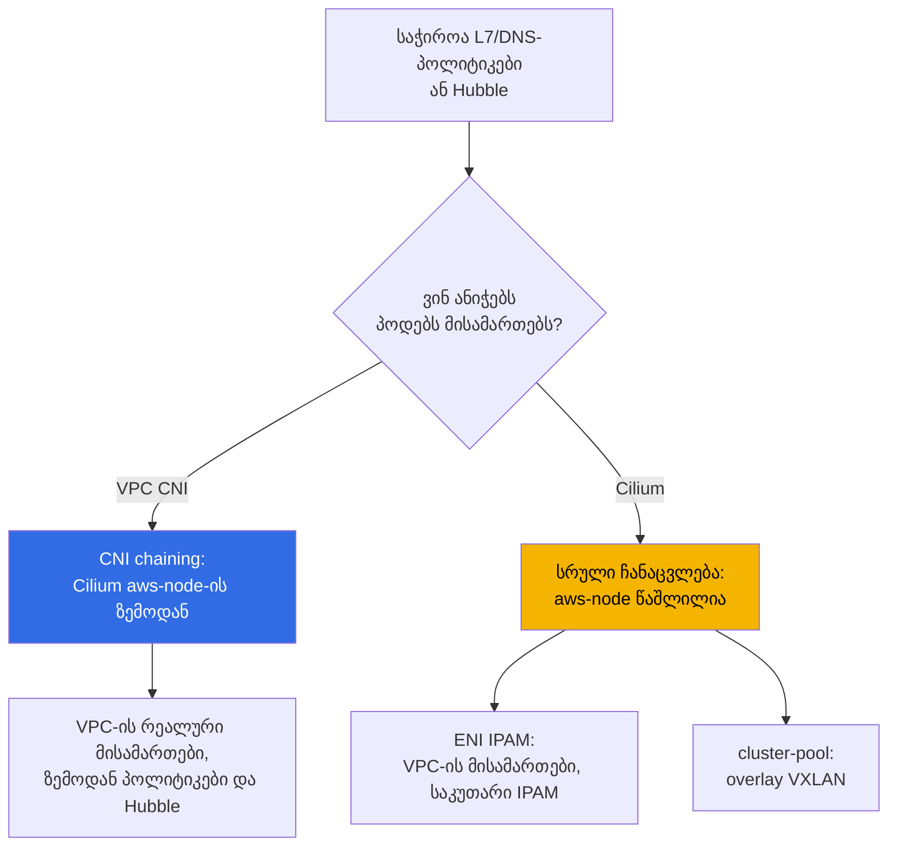
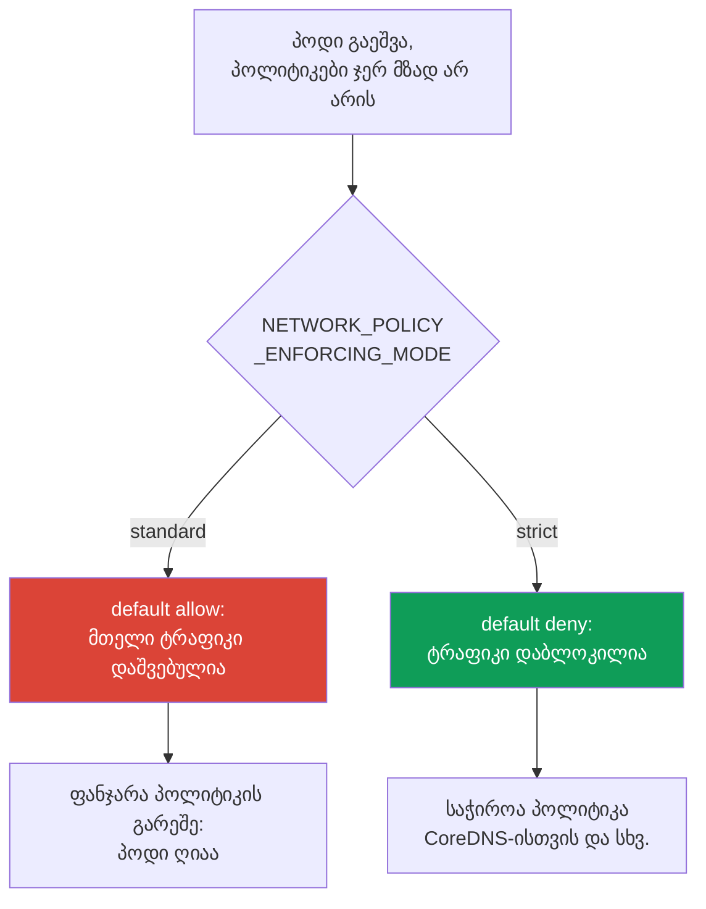

[Русская версия](ru.md) · [Eng version](en.md) · [Versión en español](es.md) · [Version française](fr.md) · [Deutsche Version](de.md) · [繁體中文版](tw.md) · [日本語版](jp.md)
# თავი 8. VPC CNI-ის ალტერნატივები: Cilium, ქსელის რეჟიმები და CNI-ის შეცვლის დრო

> **რა არის შემდეგ.** მე-6 და მე-7 თავებში განხილულია VPC CNI: პოდების რეალური მისამართები, ENI, მისამართების დეფიციტი და
> მისი სისტემური გადაწყვეტები. აქ სხვა კითხვას განვიხილავთ - როდის აღარ არის საკმარისი სტანდარტული CNI-ის შესაძლებლობები
> და ღირს თუ არა მისი შეცვლა. თავად VPC CNI, ENI და CIDR-ის დაგეგმვა მე-6 თავშია;
> prefix delegation, secondary CIDR და custom networking - მე-7 თავში და აქ აღარ მეორდება.
> NetworkPolicy დეტალურად და default-deny ლაბა - 30-ე თავსა და 110-ე ლაბაშია; აქ მხოლოდ
> შესაძლებლობებს ვადარებთ. ქსელური გაუმართაობების ანალიზი - 46-ე თავში, განახლებებისა და blue/green-ის მექანიკა - 38-ე თავში.

## 8.1. „ჩაშენებული NetworkPolicy საკმარისი არ არის“

კლასტერი მუშაობს VPC CNI-ზე, მისამართები საკმარისია და პოდები ერთმანეთს უკავშირდებიან. ჩნდება მოთხოვნა, რომელსაც
სტანდარტული NetworkPolicy ვერ ფარავს:

- უსაფრთხოების გუნდი ითხოვს წესს: „ამ სერვისს მხოლოდ `api.stripe.com`-თან შეუძლია დაკავშირება“, ანუ პოლიტიკას
  **DNS-სახელის** მიხედვით და არა მისამართის ან პორტის მიხედვით;
- ან საჭიროა HTTP-დონის წესი: „დაუშვი `GET /health`, დანარჩენი ყველაფერი აკრძალე“ -
  ეს არის **L7**, მეშვიდე დონე, რომელიც სტანდარტულ NetworkPolicy-ში არ არსებობს;
- ან ინციდენტი დასრულდა, მაგრამ ვერავინ უპასუხა კითხვას, „ვინ ვის უკავშირდებოდა გაუმართაობის დროს“: საჭიროა
  პოდებს შორის **ტრაფიკის დაკვირვებადობა**, ნაკადების რუკა და არა მხოლოდ ნოდების Flow Logs;
- ან პროექტი იზრდება **მულტიკლასტერულ** ქსელად, რომელსაც ერთიანი პოლიტიკა და გამჭვირვალე კავშირი სჭირდება.

არცერთი ეს მოთხოვნა მისამართების დეფიციტს არ ეხება. ეს ქსელის პლაგინის შესაძლებლობების საკითხია. აქ ჩნდება
EKS-ში ძვირადღირებული კითხვა: შეიცვალოს თუ არა CNI, რით შეიცვალოს და რა საექსპლუატაციო ფასად.
ნაგულისხმევი პასუხია - **არ შეცვალოთ**, თუმცა გააზრებული გადაწყვეტილებისთვის საზღვრები უნდა გესმოდეთ.

## 8.2. რას გვაძლევს VPC CNI და მისი ჩაშენებული NetworkPolicy

VPC CNI მხოლოდ მისამართების გამცემი არ არის (თავი 6). `1.14` ვერსიიდან მას აქვს
**eBPF-ზე დაფუძნებული NetworkPolicy-ის ჩაშენებული იმპლემენტაცია**. ის ასეა მოწყობილი:

- **პოლიტიკის კონტროლერი** EKS-ის control plane-ში მუშაობს და კლასტერის შექმნისას
  ავტომატურად ინსტალირდება; ის აკვირდება `NetworkPolicy` ობიექტებს და წესებს ნოდებზე ანაწილებს;
- **აგენტი** (`aws-network-policy-agent`) ცალკე კონტეინერად მუშაობს DaemonSet `aws-node`-ში და
  ნოდის ბირთვში ტვირთავს eBPF-პროგრამებს, რომლებიც ტრაფიკს ფილტრავს; საჭიროა Linux-ის `5.10`+ ბირთვი;
- ფუნქცია **ნაგულისხმევად გამორთულია** და ადონის `enableNetworkPolicy` პარამეტრით ირთვება.

```bash
kubectl get ds aws-node -n kube-system \
  -o jsonpath='{.spec.template.spec.containers[*].name}{"\n"}'   # aws-node + agent
aws eks update-addon --cluster-name demo --addon-name vpc-cni \
  --configuration-values '{"enableNetworkPolicy":"true"}' --resolve-conflicts PRESERVE
```

ამ იმპლემენტაციას შეუძლია სტანდარტული **Kubernetes `NetworkPolicy`** (L3/L4, მისამართების,
პორტების, პოდებისა და namespace-ის სელექტორების მიხედვით), ხოლო `1.21` ვერსიიდან - ასევე ადმინისტრაციული
**`ClusterNetworkPolicy`** (`networking.k8s.aws/v1alpha1`) მთელი კლასტერის წესებისთვის. ეს ყველაფერი
**managed addon**-ია: სტანდარტულად ახლდება, AWS-თან ინტეგრირებულია და **მისი მხარდაჭერით არის დაფარული**.

რა არ აქვს მას არსებითად:

- **L7-წესები** (HTTP-ის მეთოდები და გზები, gRPC, Kafka) - ფილტრაცია მხოლოდ L3/L4 დონეზეა;
- **პოლიტიკები DNS-სახელების მიხედვით** - წესი იწერება მისამართებისა და სელექტორების და არა FQDN-ის მიხედვით;
- **`CiliumNetworkPolicy` და `CiliumClusterwideNetworkPolicy` დონის CRD-ები** მათი გაფართოებული
  შესაძლებლობებით;
- **Hubble** და მისი ნაკადების დაკვირვებადობა (სერვისების რუკა, მეტრიკები, პოლიტიკით დაბლოკილი პაკეტები).

სწორედ ეს სია უბიძგებს გუნდებს Cilium-ისკენ გაიხედონ.

## 8.3. Cilium ორ რეჟიმში

EKS-ზე Cilium პრინციპულად ორი განსხვავებული გზით ინსტალირდება, რომლებიც ფასისა და რისკის მხრივ ორი სხვადასხვა გადაწყვეტილებაა.



**რეჟიმი 1. CNI chaining VPC CNI-ის ზემოდან.** პოდებს მისამართებს კვლავ VPC CNI ანიჭებს ENI-ის
მეშვეობით (მთელი მე-6 თავი კვლავ ძალაშია: VPC-ის რეალური მისამართები, overlay-ის გარეშე, `max-pods` ფორმულის მიხედვით).
Cilium „ჯაჭვში“ ერთვება: მას შემდეგ, რაც VPC CNI პოდის ინტერფეისს მოაწყობს, Cilium მასზე
eBPF-პროგრამებს აბამს და ამატებს **პოლიტიკებს (L7-ისა და DNS-ის ჩათვლით) და Hubble-ის დაკვირვებადობას**.
`aws-node` რჩება და მუშაობას აგრძელებს. ეს ყველაზე ნაკლებად ინვაზიური გზაა: პოლიტიკის შესაძლებლობები
იზრდება, ხოლო მისამართების მოდელი და VPC-ის ინტეგრაციები უცვლელი რჩება.

**რეჟიმი 2. VPC CNI-ის სრული ჩანაცვლება.** DaemonSet `aws-node` **იშლება**, Cilium ხდება
ერთადერთი CNI და IPAM-ს საკუთარ თავზე იღებს. აქ ორი ქვერეჟიმია:

- **ENI IPAM native routing-ით**: Cilium თავად მართავს ENI-ებს და პოდებს VPC-ის რეალურ მისამართებს
  ინკაფსულაციის გარეშე ანიჭებს. მისამართები VPC-ში კვლავ მარშრუტიზებადია, მაგრამ IPAM-ის სასიცოცხლო ციკლს ახლა
  Cilium მართავს და არა AWS.
- **cluster-pool (overlay/VXLAN)**: პოდების მისამართები კლასტერის ვირტუალური პულიდან გამოიყოფა და
  ინკაფსულირდება. VPC-ის მისამართების დეფიციტი, როგორც პრობლემა, ქრება (პოდების მისამართები აღარ ეკუთვნის subnet-ს),
  თუმცა მასთან ერთად იკარგება მე-6 თავის ცხრილში მოცემული თვისებები (იხ. განყოფილება 8.4).

| რა შეუძლია VPC CNI NP-ს | რას ამატებს Cilium | რით იხდით |
|---|---|---|
| სტანდარტული `NetworkPolicy` L3/L4 | `CiliumNetworkPolicy`, L7 (HTTP/gRPC/Kafka) | საკუთარი ინსტალაცია და მისი მოვლა |
| ადმინისტრაციული `ClusterNetworkPolicy` | `CiliumClusterwideNetworkPolicy`, DNS-პოლიტიკები | საკუთარი CRD-მოდელი, გუნდის სწავლება |
| eBPF-აგენტი, როგორც managed addon | Hubble: ნაკადების რუკა, მეტრიკები, drop-ები | Hubble UI/Relay, როგორც ცალკე კომპონენტები |
| AWS-ის მხარდაჭერა, სტანდარტული განახლებები | სურვილისამებრ overlay და მულტიკლასტერი | განახლებებსა და თავსებადობაზე თქვენ აგებთ პასუხს |
| SG for pods-თან, Flow Logs-თან ინტეგრაცია | ტრაფიკის დაშიფვრა (WireGuard/IPsec) | AWS-ის ინტეგრაციების ნაწილი იკარგება (განყოფილება 8.5) |

ეს ცხრილი არ ნიშნავს, რომ „Cilium უკეთესია“. მარჯვენა სვეტი ფასია და ეს ფასი რეალურია.

**eBPF-რეჟიმი kube-proxy-ის ჩანაცვლებით.** როდესაც Cilium ძირითად dataplane-ად იქცევა (სრული
ჩანაცვლებისას, ზოგჯერ chaining-ის დროსაც), მას **kube-proxy-ის ჩანაცვლება** შეუძლია: პარამეტრი
`kubeProxyReplacement=true`. ასეთ შემთხვევაში Service-ისა და NodePort-ის დატვირთვას Cilium-ის
ავრცელებენ eBPF-პროგრამები და არა kube-proxy-ის iptables. სარგებელი: დიდ კლასტერებში iptables-ის წესები აღარ
იზრდება უკონტროლოდ, დაყოვნება ნაკლებია და Service უკეთ მასშტაბირდება. ფასი: საჭიროა ნოდის ახალი kernel
(socket-LB-ს სჭირდება ბირთვი `4.19.57`/`5.2`+), EKS-ში managed addon `kube-proxy` უნდა წაშალოთ
და დატვირთვის განაწილება საკუთარ პასუხისმგებლობაში აიღოთ. kube-proxy-ის წაშლა Service-ის არსებულ კავშირებს
წყვეტს, ამიტომ ეს blue/green მეთოდით კეთდება (განყოფილება 8.8) და არა მოქმედ ნოდებზე.

**Cilium ClusterMesh.** მულტიკლასტერისთვის Cilium რამდენიმე კლასტერის Pod Network-ს
ერთიან ქსელში აერთიანებს. არქიტექტურა: თითოეულ კლასტერში იშვება `clustermesh-apiserver`, რომელიც
საკუთარ მდგომარეობას მეზობლებს გადასცემს და მათ მდგომარეობას იღებს, აგენტები კი თითოეული კლასტერის apiserver-ს
უკავშირდებიან. მოთხოვნები მკაცრია: თითოეულ კლასტერს უნდა ჰქონდეს **უნიკალური `cluster-name` და `cluster-id`** და
**ერთმანეთთან არაგადამკვეთი PodCIDR-ები** (native routing CIDR ყველა კლასტერს უნდა ფარავდეს). Service-ები ინიშნება
ანოტაციით `service.cilium.io/global: "true"` და ტრაფიკი ყველა კლასტერის პოდებზე ნაწილდება.
ფასი: კლასტერებს შორის control plane-ის კავშირი, მისამართების ერთიანი დაგეგმვა და ამ ყველაფრის მართვა -
VPC CNI-ს ეს საერთოდ არ შეუძლია.

მთლიანად პროდუქტის და არა მხოლოდ NetworkPolicy-ის შეჯამებული შედარება:

| შედარების ღერძი | VPC CNI | Cilium |
|---|---|---|
| პოდების დამისამართება | VPC-ის რეალური მისამართები, managed IPAM | ENI-IPAM ან overlay, საკუთარი IPAM |
| NetworkPolicy | L3/L4 (+ `ClusterNetworkPolicy`) | L3/L4, L7 (HTTP/gRPC), DNS/FQDN |
| kube-proxy | სტანდარტული managed addon | სურვილისამებრ eBPF-ით ჩანაცვლება (`kubeProxyReplacement`) |
| დაკვირვებადობა | ნოდების Flow Logs | Hubble: ნაკადების რუკა, მეტრიკები |
| მულტიკლასტერი | არა | ClusterMesh (საერთო Pod Network) |
| ექსპლუატაცია | managed, AWS-ის მხარდაჭერა | განახლებებსა და თავსებადობაზე თქვენ აგებთ პასუხს |

მარცხენა სვეტი აჩვენებს, რა გაქვთ უკვე AWS-ის მხარდაჭერით; მარჯვენა - შესაძლებლობებს CNI-ის მართვის ფასად.

## 8.4. სხვა ალტერნატივები და რას კარგავს overlay

- **Calico**. EKS-ზე მას უფრო ხშირად იყენებენ **მხოლოდ policy-სთვის VPC CNI-ის ზემოდან** (policy-only,
  დამისამართება VPC CNI-ს რჩება) და არა სრულ CNI-დ. VPC CNI-ში ჩაშენებული NetworkPolicy-ის გამოჩენის შემდეგ
  ეს სცენარი შევიწროვდა: თუ მხოლოდ სტანდარტული L3/L4 გჭირდებათ, ცალკე Calico უკვე აუცილებელი არ არის.
- **ზოგადად overlay-რეჟიმები** (Cilium cluster-pool, Calico VXLAN/IPIP, flannel). ისინი
  პოდების „ვირტუალურ“ მისამართებს აბრუნებს და IPv4-ის დეფიციტს ხსნის, თუმცა იმ მოდელთან დაბრუნების ფასად,
  რომელსაც EKS დაშორდა. მე-6 თავთან შედარებით იკარგება:

| თვისება (თავი 6) | VPC CNI და ENI-რეჟიმები | Overlay |
|---|---|---|
| პოდების რეალური მისამართები VPC-ში | დიახ | არა, ვირტუალური CIDR |
| პოდების მარშრუტიზაცია დაკავშირებულ ქსელებში | დიახ | არა, მხოლოდ gateway/SNAT-ის გავლით |
| Security groups პოდების ტრაფიკზე | დიახ (მათ შორის SG for pods, თავი 19) | არა |
| VPC Flow Logs ხედავს პოდების მისამართებს | დიახ | არა, ხედავს ნოდების მისამართებს |
| ინკაფსულაცია და ზედნადები ხარჯები, MTU | არა | არის |

Overlay გამართლებულია, როცა IPv4-ის დეფიციტი სხვა საშუალებებით ვერ გვარდება (ისინი მე-7 თავშია ჩამოთვლილი), ხოლო
VPC-ში პოდების პირდაპირი მარშრუტიზაცია საჭირო არ არის. ეს გააზრებული გაცვლაა და არა გაუმჯობესება.

## 8.5. CNI-ის ჩანაცვლებაზე გადასვლის რეალური ფასი

VPC CNI-დან საკუთარ CNI-ზე გადასვლა უბრალოდ flag-ის შეცვლა კი არა, პასუხისმგებლობის ზონის შეცვლაა. იცვლება შემდეგი:

- **თქვენ მართავთ CNI-ის სასიცოცხლო ციკლს.** განახლებები აღარ არის **managed addon**: მათ თქვენ გეგმავთ,
  ტესტავთ და ავრცელებთ Helm-ით ან საკუთარი pipeline-ით (თავი 37).
- **AWS-ის მხარდაჭერა ვიწროვდება.** სტანდარტული მხარდაჭერა VPC CNI-ს ფარავს; მესამე მხარის CNI-ის პრობლემები
  მისი საზოგადოების და თქვენი გუნდის პასუხისმგებლობის ზონაა. EKS Hybrid Nodes-ისთვის Cilium, როგორც CNI,
  ცალკე არის მხარდაჭერილი, მაგრამ AWS-ში ჩვეულებრივი ნოდებისთვის სტანდარტული ვარიანტი კვლავ VPC CNI-ა.
- **კლასტერის ვერსიასთან თავსებადობა თქვენი საზრუნავია.** Kubernetes-ის განახლებისას (თავები 3 და 38)
  თავად ამოწმებთ, რომ CNI-ის ვერსიას ახალი control plane-ის ვერსია აქვს მხარდაჭერილი და კომპონენტებს
  სწორი თანმიმდევრობით აახლებთ. ადრე ამას managed addon აკეთებდა.
- **AWS-ის ინტეგრაციების ნაწილი აღარ მუშაობს „მზად მდგომარეობაში“.** **Security groups for pods**
  (თავი 46) და **VPC Flow Logs-ში პოდების მისამართების ხილვადობა** VPC CNI-სა და ENI-მოდელზეა დამოკიდებული;
  overlay-ის დროს ისინი არ მუშაობს, ხოლო სხვა ENI-IPAM-ის შემთხვევაში ცალკე უნდა გადაამოწმოთ და მოცემულობად არ ჩათვალოთ.
- **დიაგნოსტიკა რთულდება.** ქსელური გაუმართაობა ახლა CNI-ის ინსტრუმენტებითაც (`cilium`,
  Hubble) უნდა გამოიკვლიოთ და არა მხოლოდ VPC-ისა და `aws-node`-ის საშუალებებით; იზრდება ადგილების რაოდენობა, სადაც რამე შეიძლება გაფუჭდეს.

```bash
cilium status                      # Cilium აგენტისა და ოპერატორის საერთო მდგომარეობა
cilium connectivity test           # კავშირისა და პოლიტიკების შემოწმება ინსტალაციის შემდეგ
kubectl get ciliumnetworkpolicies -A   # რომელი CiliumNetworkPolicy არის გამოყენებული
```

ეს ბრძანებები მხოლოდ Cilium-ის ინსტალაციის შემდეგ არის ხელმისაწვდომი; სუფთა VPC CNI-ზე ისინი არ არსებობს. კლასტერში
`cilium` CLI-ის გამოჩენაც კი იმის ნიშანია, რომ საკუთარ თავზე მეტი პასუხისმგებლობა აიღეთ.

## 8.6. პოდის გაშვებისას პოლიტიკების გამოყენების თანმიმდევრობა და ფანჯარა პოლიტიკის გარეშე

ადვილად გამოსატოვებელი და უსაფრთხოებისთვის მნიშვნელოვანი მომენტი: **პოდის გაშვებასა და
მასზე პოლიტიკების გამოყენებას შორის შუალედია**. VPC CNI-ის ჩაშენებულ NetworkPolicy-ში ამ
შუალედის ქცევას აგენტის `NETWORK_POLICY_ENFORCING_MODE` ცვლადი განსაზღვრავს:



- **`standard` (ნაგულისხმევი).** სანამ აგენტი ახალი პოდისთვის ყველა წესს მოაწყობს, პოდი
  **default allow** რეჟიმში მუშაობს: მთელი ingress და egress ღიაა. არსებობს **ფანჯარა პოლიტიკის გარეშე** -
  რამდენიმე წამი, როცა პოდი უკვე იღებს და აგზავნის ტრაფიკს, ფილტრაცია კი ჯერ არ არის დადებული. სწრაფი
  გაშვებისთვის ეს მოსახერხებელია, მკაცრი იზოლაციისთვის კი - ხარვეზი.
- **`strict`.** პოდი **default deny** რეჟიმში იშვება და მხოლოდ შემდეგ ედება დაშვების
  წესები. ფანჯარა არ არსებობს, თუმცა მაშინ **პოდისთვის საჭირო თითოეულ მისამართზე პოლიტიკა უნდა არსებობდეს**, მათ შორის
  CoreDNS-ზე წვდომისთვის; სხვაგვარად პოდი სახელებს ვერ resolve-ავს და გამართულად ვერ ეშვება.

ეს ფუნდამენტური გაცვლაა „გაშვების სიჩქარესა და ფანჯრის არარსებობას“ შორის. Cilium იმავე ამოცანას
საკუთარი საშუალებებით წყვეტს, მაგრამ პრინციპი საერთოა: თუ გარანტირებულად გჭირდებათ, რომ პოდი ერთი წამითაც არ იყოს ღია,
ნაგულისხმევი რეჟიმი არ გამოდგება და ეს დიზაინში უნდა გაითვალისწინოთ (დეტალურად - თავი 30).

## 8.7. როდის შევცვალოთ CNI და როდის არ შევცვალოთ

ნაგულისხმევი არჩევანია - **დარჩეთ VPC CNI-ზე**. შეცვალეთ მხოლოდ კონკრეტული, დასახელებული საჭიროების გამო.

| საჭიროება | დარჩეთ VPC CNI-ზე | შეცვალოთ/შეავსოთ CNI |
|---|---|---|
| სტანდარტული L3/L4 NetworkPolicy | დიახ, ჩაშენებული აგენტი | აზრი არ აქვს |
| წესები DNS-სახელების ან L7-ის მიხედვით (HTTP/gRPC) | ვერ ფარავს | Cilium (chaining საკმარისია) |
| პოდებს შორის ნაკადების დაკვირვებადობა | ნოდების Flow Logs | Cilium + Hubble (chaining) |
| მულტიკლასტერული ქსელი ერთიანი პოლიტიკით | ვერ ფარავს | Cilium (cluster mesh) |
| IPv4-ის დეფიციტი ვერ გვარდება (მე-7 თავი ვერ დაეხმარა) | დეფიციტი რჩება | overlay, როგორც უკიდურესი ზომა |
| მნიშვნელოვანია რეალური მისამართები, SG for pods, Flow Logs | დიახ, ეს მისი ძლიერი მხარეა | ჩანაცვლება ამ ყველაფერს წაგართმევთ |

არჩევის წესები:

- **გჭირდებათ L7/DNS-პოლიტიკები ან Hubble, ხოლო მისამართების მოდელი გაკმაყოფილებთ** - გამოიყენეთ Cilium
  **CNI chaining** რეჟიმში: მიიღებთ შესაძლებლობებს IPAM-ისა და VPC-ის ინტეგრაციების დათმობის გარეშე. ეს ყველაზე ხშირი
  და რისკის მხრივ ყველაზე იაფი პასუხია.
- **სრული ჩანაცვლება ვიწრო შემთხვევებშია გამართლებული**: overlay გჭირდებათ მისამართების დეფიციტის მოსახსნელად, ან
  მულტიკლასტერი, ან მოთხოვნები, რომლებსაც ENI-მოდელი პრინციპულად ვერ უზრუნველყოფს.
- **არ შეცვალოთ CNI „სამომავლოდ“ ან „იმიტომ, რომ მოდურია“.** 8.5 განყოფილების თითოეული პუნქტი
  გუნდის მუდმივი დატვირთვაა და არა ერთჯერადი კონფიგურაცია.

## 8.8. CNI-ის მიგრაცია, როგორც სარისკო ოპერაცია

მოქმედ კლასტერში CNI-ის flag-ის გადართვით შეცვლა **შეუძლებელია**. CNI პოდს შექმნისას ენიჭება
და უკვე გაშვებული პოდები ახალ პლაგინზე თავისით არ გადავა. ამიტომ CNI-ის შეცვლა თითქმის ყოველთვის
**ნოდების ან კლასტერის ხელახლა შექმნაა** და არა მუშაობის დროს გადართვა.

უსაფრთხო გზა არის **blue/green** (განახლებისა და ხელახლა შექმნის მექანიკა - თავი 38, აქ მხოლოდ პრინციპია):

1. შექმენით **ნოდების ახალი პული**, რომელსაც აქვს label და ახალი CNI (ან ცალკე კლასტერი);
2. მასზე შეამოწმეთ კავშირი და პოლიტიკები (`cilium connectivity test`), AWS-ის ინტეგრაციები და DNS;
3. workload-ები თანდათან გადაიტანეთ, ძველ ნოდებს სათითაოდ გაუკეთეთ cordon/drain PDB-ების გათვალისწინებით;
4. მხოლოდ მას შემდეგ, რაც დარწმუნდებით, რომ ყველაფერი მუშაობს, წაშალეთ ძველი stack (ჩანაცვლების შემთხვევაში - `aws-node`).

მოქმედ კლასტერში „პირდაპირი“ გადართვა სახიფათოა, რადგან გარდამავალ პერიოდში კლასტერში ორი სხვადასხვა
ქსელური stack-ის პოდები ცხოვრობენ, ხოლო მათ შორის კავშირი, პოლიტიკები და egress არაპროგნოზირებადად იქცევა.
ამიტომ ძველი და ახალი stack-ის ნოდების მიხედვით იზოლაცია აუცილებელი ელემენტია და არა სიფრთხილის ზომა „ყოველი შემთხვევისთვის“.

## 8.9. როგორ გამოიყენება ეს production-ში

- **ნაგულისხმევად რჩებიან VPC CNI-ზე** და რთავენ ჩაშენებულ NetworkPolicy-ს: L3/L4 იზოლაციისთვის
  ეს საკმარისია და ყველაფერი AWS-ის მხარდაჭერის ქვეშ რჩება.
- **Cilium-ს CNI chaining რეჟიმში ამატებენ**, როცა ნამდვილად სჭირდებათ L7/DNS-პოლიტიკები ან Hubble:
  მისამართების მოდელსა და VPC-ის ინტეგრაციებს ამ დროს არ ეხებიან.
- **CNI-ის სრულ ჩანაცვლებას კონკრეტული საჭიროებისთვის ირჩევენ** (overlay მისამართების დეფიციტის გამო,
  მულტიკლასტერი) და გუნდის ბიუჯეტში განახლებებისა და დიაგნოსტიკის მართვას ითვალისწინებენ.
- **პოლიტიკის გამოყენების რეჟიმს გააზრებულად ირჩევენ**: `strict` იქ, სადაც ფანჯარა პოლიტიკის გარეშე
  მიუღებელია, CoreDNS-ისთვის სავალდებულო პოლიტიკით.
- **CNI-ის ნებისმიერ შეცვლას blue/green მეთოდით ატარებენ** ნოდების ახალი პულის მეშვეობით და არა
  მოქმედ კლასტერში flag-ის გადართვით.

## 8.10. მინი-გლოსარიუმი

- **VPC CNI network policy** - eBPF-ზე დაფუძნებული `NetworkPolicy`-ის ჩაშენებული იმპლემენტაცია: კონტროლერი
  control plane-ში და აგენტი `aws-network-policy-agent` `aws-node`-ში; ირთვება ადონის
  `enableNetworkPolicy` პარამეტრით. მხარს უჭერს L3/L4 `NetworkPolicy`-სა და ადმინისტრაციულ
  `ClusterNetworkPolicy`-ს (`networking.k8s.aws/v1alpha1`).
- **CNI chaining** - რეჟიმი, რომელშიც VPC CNI მისამართს ანიჭებს და ინტერფეისს აწყობს, ხოლო Cilium
  ზემოდან პოლიტიკასა და დაკვირვებადობას ამატებს; `aws-node` რჩება.
- **სრული ჩანაცვლება** - `aws-node` წაშლილია, Cilium ერთადერთი CNI-ა საკუთარი IPAM-ით: **ENI IPAM**
  (VPC-ის რეალური მისამართები) ან **cluster-pool** (overlay/VXLAN, ვირტუალური მისამართები).
- **`CiliumNetworkPolicy` / `CiliumClusterwideNetworkPolicy`** - Cilium-ის CRD L7- და
  DNS-წესებით. **Hubble** - Cilium-ის ნაკადების დაკვირვებადობა.
- **`NETWORK_POLICY_ENFORCING_MODE`** - პოდის გაშვებისას პოლიტიკის გამოყენების რეჟიმი: `standard`
  (default allow, არის ფანჯარა პოლიტიკის გარეშე) ან `strict` (default deny).
- **`kubeProxyReplacement`** - Cilium-ის რეჟიმი, რომელშიც Service/NodePort-ის დატვირთვას kube-proxy-ის
  ნაცვლად eBPF ანაწილებს; `true` ჩანაცვლებას რთავს. მოითხოვს ახალ ბირთვს და დატვირთვის განაწილების მართვას.
- **ClusterMesh** - Cilium-ის რამდენიმე კლასტერის Pod Network-ის გაერთიანება
  `clustermesh-apiserver`-ის მეშვეობით; საჭიროა უნიკალური `cluster-id`-ები და არაგადამკვეთი PodCIDR-ები.

## 8.11. თავის შეჯამება

- CNI-ის შეცვლის მიზეზი შესაძლებლობებია და არა მისამართები: L7- ან DNS-პოლიტიკები, ნაკადების დაკვირვებადობა,
  მულტიკლასტერი. მისამართების საკითხი მე-7 თავის საშუალებებით გვარდება და არა CNI-ის შეცვლით.
- VPC CNI-ს აქვს eBPF-ზე დაფუძნებული ჩაშენებული NetworkPolicy (კონტროლერი და აგენტი, flag
  `enableNetworkPolicy`): სტანდარტული L3/L4 და ადმინისტრაციული `ClusterNetworkPolicy`, ყველაფერი managed
  addon-ის სახით AWS-ის მხარდაჭერით. არ აქვს L7, DNS-პოლიტიკები, Cilium-ის CRD-ები და Hubble.
- Cilium ორი გზით ინსტალირდება: CNI chaining VPC CNI-ის ზემოდან (მისამართები და VPC-ის ინტეგრაციები უცვლელია,
  ზემოდან ემატება პოლიტიკები და Hubble) და სრული ჩანაცვლება (`aws-node` წაშლილია, საკუთარი IPAM: ENI-რეჟიმი ან
  overlay). Chaining ყველაზე ნაკლებრისკიანი გზაა L7/DNS-ისა და დაკვირვებადობის მისაღებად.
- Overlay ხსნის IPv4-ის დეფიციტს, მაგრამ გვართმევს პოდების რეალურ მისამართებს, დაკავშირებულ ქსელებში მათ მარშრუტიზაციას,
  პოდების ტრაფიკზე security groups-სა და Flow Logs-ში პოდების ხილვადობას.
- CNI-ის ჩანაცვლების ფასი: განახლებებს თქვენ მართავთ (ეს აღარ არის managed addon), AWS-ის მხარდაჭერა ვიწროვდება,
  კლასტერის ვერსიასთან თავსებადობა თქვენს პასუხისმგებლობაში გადადის, ზოგი ინტეგრაცია (SG for pods, პოდების Flow Logs)
  მზად მდგომარეობაში აღარ მუშაობს და დიაგნოსტიკა რთულდება.
- პოდის გაშვებისას არსებობს ფანჯარა პოლიტიკის გარეშე: `standard` წესების გამოყენებამდე ტრაფიკს ხსნის,
  `strict` კეტავს, მაგრამ CoreDNS-ისთვის პოლიტიკას მოითხოვს. CNI blue/green მეთოდით, ახალი
  ნოდების მეშვეობით იცვლება და არა მუშაობის დროს flag-ის გადართვით.
- eBPF-რეჟიმში Cilium-ს kube-proxy-ის ჩანაცვლება (`kubeProxyReplacement=true`) და კლასტერების
  ClusterMesh-ით გაერთიანება შეუძლია - ორივე ფუნქცია სტანდარტულ managed-კომპონენტებს ანაცვლებს და მოითხოვს ახალ
  ბირთვს, არაგადამკვეთ PodCIDR-ებს და დატვირთვის განაწილებისა და მისამართების თქვენ მიერ მართვას.

## 8.12. როგორ გამოგადგებათ ეს რეალურ სამუშაოში

მოთხოვნა „პოლიტიკები DNS-სახელების მიხედვით“ ან „გვაჩვენეთ ინციდენტის დროინდელი ტრაფიკის რუკა“ მოდის არა
ქსელისგან, არამედ უსაფრთხოების ან დეველოპმენტის გუნდისგან და მასზე ადვილია ძვირადღირებული პასუხის გაცემა - „ვცვლით CNI-ს“.
გეგმის მქონე ინჟინერი ჯერ კითხულობს, მისაღებია თუ არა მისამართების მოდელი და, თუ პასუხი დადებითია, Cilium-ს
chaining რეჟიმში იყენებს, IPAM-ისა და VPC-ის ინტეგრაციების დათმობის გარეშე. სრულ ჩანაცვლებას ის მხოლოდ იმ შემთხვევებისთვის
იტოვებს, როცა ეს ნამდვილად საჭიროა, და წინასწარ ითვალისწინებს, რომ CNI-ის განახლებები და კლასტერის ვერსიასთან თავსებადობა
ახლა მისი მუდმივი საქმეა. მშვიდ პერიოდში ეს დიზაინზე აისახება: პოლიტიკის გამოყენების რეჟიმი გააზრებულად არის არჩეული,
ხოლო CNI-ის ნებისმიერი მიგრაცია blue/green ოპერაციადაა დაგეგმილი და არა flag-ის გადართვად.

## 8.13. კითხვები თვითშემოწმებისთვის

1. რომელი მოთხოვნები ამართლებს CNI-ის შეცვლას და რომელი გვარდება მე-7 თავის საშუალებებით?
2. რა კომპონენტებისგან შედგება VPC CNI-ის ჩაშენებული NetworkPolicy და როგორ ირთვება ის?
3. რა შეუძლია VPC CNI-ის ჩაშენებულ NetworkPolicy-ს და რა არ აქვს მას არსებითად?
4. რით განსხვავდება CNI chaining VPC CNI-ის სრული ჩანაცვლებისგან და რა რჩება chaining-ის დროს უცვლელი?
5. Cilium-ით სრული ჩანაცვლებისას IPAM-ის რომელი ორი ქვერეჟიმი არსებობს და რით განსხვავდება მათი პოდების მისამართები?
6. რა იკარგება მე-6 თავთან შედარებით overlay-ზე გადასვლისას?
7. ჩამოთვალეთ, CNI-ის ჩანაცვლებისას კონკრეტულად რა გადადის AWS-ის პასუხისმგებლობიდან თქვენს პასუხისმგებლობაში.
8. რატომ შეიძლება შეწყვიტოს მუშაობა security groups for pods-მა და პოდების Flow Logs-მა CNI-ის შეცვლისას?
9. რა არის ფანჯარა პოლიტიკის გარეშე და როგორ მოქმედებს მასზე `NETWORK_POLICY_ENFORCING_MODE`?
10. რით არის სახიფათო `strict` რეჟიმი და რატომ სჭირდება მას CoreDNS-ის პოლიტიკა?
11. რა ნიშნებით უნდა აირჩიოთ „დარჩენა VPC CNI-ზე“ ან „Cilium-ის დამატება chaining რეჟიმში“?
12. რატომ არ შეიძლება CNI-ის შეცვლა flag-ის გადართვით და როგორ გამოიყურება blue/green გზა?
13. რას გვაძლევს `kubeProxyReplacement=true` და რა მოთხოვნები აქვს ClusterMesh-ს კლასტერების მისამართების მიმართ?

## პრაქტიკა

ამ თემის კურსის ლაბაა [ლაბა 132 - ალტერნატიული CNI: Cilium CNI chaining რეჟიმში
VPC CNI-ის ზემოდან](../../labs/132/README_GE.MD). იქ Cilium Helm-ის მეშვეობით ინსტალირდება მოქმედი
VPC CNI-ის ზემოდან (`cni.chainingMode: aws-cni`), დასტურდება, რომ IPAM VPC CNI-ს დარჩა, ხოლო ზემოდან
ჩნდება L7-წესი HTTP-მეთოდის მიხედვით, პოლიტიკა DNS-სახელის მიხედვით `toFQDNs`-ის მეშვეობით და ნაკადების რუკა
verdict-ით Hubble-ში. VPC CNI-ის სრული ჩანაცვლება შეგნებულად არ შედის ლაბის მოცულობაში: ეს არის blue/green
ახალი ნოდების მეშვეობით (განყოფილება 8.8) და არა flag-ის გადართვა. შედეგი მოწმდება ბრძანებით
`check_result`. ამავე თემას ეხება [ლაბა 110 - NetworkPolicy EKS-ში: ჩაშენებული VPC CNI
network policy](../../labs/110/README_GE.MD), სადაც VPC CNI-ის ჩაშენებული network policy
Cilium-ის გარეშე, ცალკე მოწმდება.

ქვემოთ იგივე მოქმედებებია ნებისმიერი საკუთარი კლასტერისთვის ჩვეულებრივი ბრძანებებით. ჯერ შეამოწმეთ, რა არის
ამჟამად დაყენებული: `kubectl get ds aws-node -n kube-system` აჩვენებს, მუშაობს თუ არა VPC CNI, ხოლო
`kubectl get ds aws-node -n kube-system -o jsonpath='{.spec.template.spec.containers[*].name}'`
- არის თუ არა გვერდით კონტეინერი `aws-network-policy-agent`, ანუ ჩართულია თუ არა ჩაშენებული
NetworkPolicy. ადონის მდგომარეობა და ვერსია ნახეთ ბრძანებით `aws eks describe-addon
--cluster-name <cluster> --addon-name vpc-cni`: `1.14`-ზე დაბალი ვერსია ნიშნავს, რომ ჩაშენებული
NetworkPolicy არ არის, ხოლო `1.21`-ზე დაბალი - რომ ადმინისტრაციული `ClusterNetworkPolicy` არ არის.

შეამოწმეთ პოლიტიკის გამოყენების რეჟიმი: მოძებნეთ `NETWORK_POLICY_ENFORCING_MODE` ბრძანებაში
`kubectl describe ds aws-node -n kube-system | grep -i NETWORK_POLICY`; ცარიელი შედეგი
ნიშნავს ნაგულისხმევ `standard` რეჟიმს, ანუ პოდის გაშვებისას ფანჯარას პოლიტიკის გარეშე. თუ კლასტერში
Cilium უკვე დაყენებულია, შეადარეთ სურათი: `cilium status` აჩვენებს რეჟიმსა და კომპონენტებს,
`kubectl get ciliumnetworkpolicies -A` - გამოყენებულ L7/DNS-პოლიტიკებს, ხოლო `cilium connectivity
test` კავშირს შეამოწმებს (გაითვალისწინეთ, რომ ტესტი დროებით workload-ებს ქმნის). სუფთა VPC CNI-ზე ეს
ბრძანებები არ იარსებებს - ეს არის თვალსაჩინო საზღვარი „ვრჩებით“ და „სხვა CNI საკუთარ თავზე ავიღეთ“ მიდგომებს შორის.

---
[სარჩევი](../README_GE.md) · [თავი 7](../07/ge.md) · [თავი 9](../09/ge.md)
