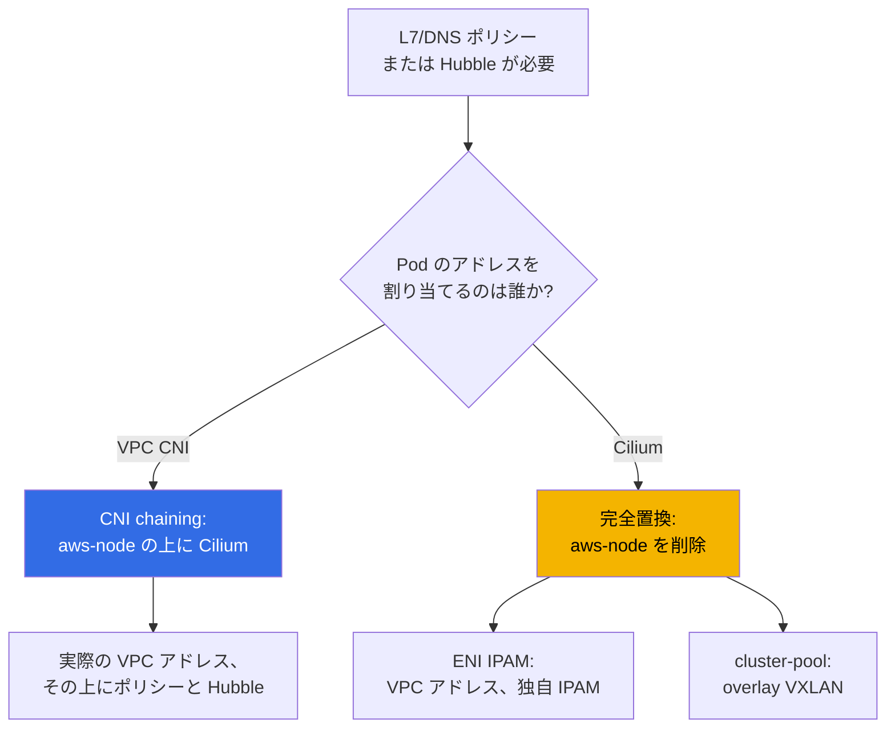
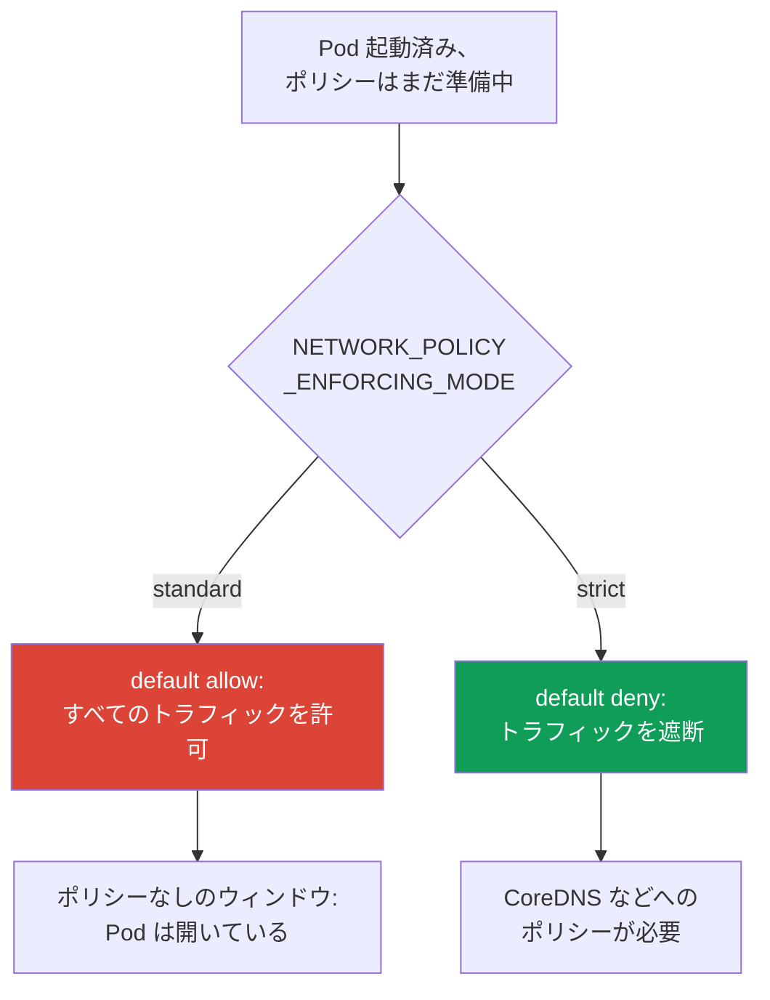

[Русская версия](ru.md) · [Eng version](en.md) · [Versión en español](es.md) · [Version française](fr.md) · [Deutsche Version](de.md) · [ქართული ვერსია](ge.md) · [繁體中文版](tw.md)
# 第8章 VPC CNI の代替: Cilium、ネットワークモード、CNI を変更するべき場合

> **この先の内容。** 第6章と第7章では、Pod の実アドレス、ENI、不足、およびその体系的な解決策として VPC CNI を扱いました。本章では、アドレス不足ではなく機能面で標準 CNI が足りないのはいつか、そして変更する価値があるのかという別の問いを扱います。VPC CNI 自体、ENI、CIDR 計画は第6章、prefix delegation、secondary CIDR、custom networking は第7章で扱うため、ここでは繰り返しません。NetworkPolicy の詳細と default-deny ラボは第30章とラボ110で扱い、ここでは機能比較のみを行います。ネットワーク障害の分析は第46章、アップグレードと blue/green の仕組みは第38章です。

## 8.1. 「組み込みの NetworkPolicy では足りない」

クラスターは VPC CNI で稼働しており、アドレスは十分で、Pod 同士も通信しています。しかし、標準の NetworkPolicy では満たせない要件が来ます。

- セキュリティ部門が「この Service は `api.stripe.com` にのみアクセスできる」という、アドレスやポートではなく **DNS 名** によるポリシーを要求する。
- または、HTTP レベルの「`GET /health` は許可し、それ以外はすべて拒否する」というルールが必要になる。これは標準 NetworkPolicy にはない第7層の **L7** です。
- または、インシデントは収束したものの、「障害時に誰が誰と通信していたか」に答えられない。Node ごとの Flow Logs だけではなく、Pod 間の **トラフィック可観測性**、フローマップが必要です。
- または、プロジェクトが一元的なポリシーと透過的な接続性を備えた **マルチクラスター** ネットワークへ成長する。

これらの要件はいずれもアドレス不足の問題ではありません。ネットワークプラグインの機能に関する問題です。そして EKS では高コストな問いが生じます。CNI を変更すべきか、何に変更するか、そして運用コストはいくらか。デフォルトの答えは **変更しない** です。ただし、それを意識して判断するには境界を理解する必要があります。

## 8.2. VPC CNI と組み込み NetworkPolicy が提供するもの

VPC CNI はアドレス割り当てだけではありません（第6章）。バージョン `1.14` 以降、**eBPF による組み込みの NetworkPolicy 実装**があります。構成は次のとおりです。

- **ポリシーコントローラー**は EKS control plane にあり、クラスター作成時に自動で導入されます。`NetworkPolicy` オブジェクトを監視し、ルールを Node に配布します。
- **エージェント**（`aws-network-policy-agent`）は DaemonSet `aws-node` の別コンテナとして稼働し、トラフィックをフィルタリングする eBPF プログラムを Node カーネルへロードします。Linux カーネル `5.10`+ が必要です。
- この機能は**デフォルトで無効**であり、アドオンパラメーター `enableNetworkPolicy` で有効にします。

```bash
kubectl get ds aws-node -n kube-system \
  -o jsonpath='{.spec.template.spec.containers[*].name}{"\n"}'   # aws-node + agent
aws eks update-addon --cluster-name demo --addon-name vpc-cni \
  --configuration-values '{"enableNetworkPolicy":"true"}' --resolve-conflicts PRESERVE
```

この実装ができるのは、標準の **Kubernetes `NetworkPolicy`**（L3/L4、アドレス、ポート、Pod と namespace のセレクターによるもの）と、バージョン `1.21` 以降ではクラスター全体のルール用の管理用 **`ClusterNetworkPolicy`**（`networking.k8s.aws/v1alpha1`）です。これらはすべて **managed addon** です。標準的に更新され、AWS と統合され、**AWS のサポート対象**です。

本質的にできないことは次のとおりです。

- **L7 ルール**（HTTP のメソッドとパス、gRPC、Kafka）。フィルタリングは L3/L4 のみです。
- **DNS 名によるポリシー**。ルールは FQDN ではなくアドレスとセレクターで記述します。
- 拡張機能を持つ **`CiliumNetworkPolicy` と `CiliumClusterwideNetworkPolicy` レベルの CRD**。
- **Hubble** とそのフロー可観測性（Service マップ、メトリクス、ポリシーによるドロップ）。

まさにこの一覧が、チームを Cilium の検討へ向かわせます。

## 8.3. 2つのモードの Cilium

EKS 上の Cilium は根本的に異なる方法で導入でき、コストとリスクが異なる2つの選択肢です。



**モード1。VPC CNI 上の CNI chaining。** Pod のアドレスは引き続き ENI 経由で VPC CNI が割り当てます（第6章のすべてが当てはまります。実際の VPC アドレス、overlay なし、式に基づく `max-pods`）。Cilium は「チェーン」に接続されます。VPC CNI が Pod インターフェイスを設定した後、Cilium が eBPF プログラムをアタッチし、**ポリシー（L7 と DNS を含む）および Hubble の可観測性**を追加します。`aws-node` は残り、動作を継続します。これは最も侵襲性の低い経路です。ポリシー機能は増えますが、アドレスモデルと VPC 統合には手を加えません。

**モード2。VPC CNI の完全置換。** DaemonSet `aws-node` を**削除**し、Cilium が唯一の CNI となって IPAM を担います。ここには2つのサブモードがあります。

- **native routing を使用する ENI IPAM**: Cilium 自身が ENI を管理し、カプセル化せずに Pod へ実際の VPC アドレスを割り当てます。アドレスは VPC 内でルーティング可能なままですが、IPAM のライフサイクルは AWS ではなく Cilium が所有します。
- **cluster-pool（overlay/VXLAN）**: Pod アドレスは仮想クラスター Pool から取得し、カプセル化されます。VPC アドレスの不足は問題の種類として解消されます（Pod アドレスはもはや subnet から取得しないため）が、第6章の表にある特性も同時に失われます（8.4節を参照）。

| VPC CNI NP ができること | Cilium が追加すること | 支払う対価 |
|---|---|---|
| 標準 `NetworkPolicy` L3/L4 | `CiliumNetworkPolicy`、L7（HTTP/gRPC/Kafka） | 独自の導入とその運用 |
| 管理用 `ClusterNetworkPolicy` | `CiliumClusterwideNetworkPolicy`、DNS ポリシー | 独自の CRD モデル、チームの学習 |
| managed addon としての eBPF エージェント | Hubble: フローマップ、メトリクス、ドロップ | 別コンポーネントとしての Hubble UI/Relay |
| AWS サポート、標準アップグレード | 任意の overlay とマルチクラスター | アップグレードと互換性を自分で所有 |
| SG for pods、Flow Logs との統合 | トラフィック暗号化（WireGuard/IPsec） | AWS 統合の一部を失う（8.5節） |

この表は「Cilium の方が優れている」という意味ではありません。右列は現実のコストです。

**kube-proxy を置換する eBPF モード。** Cilium が主要なデータプレーンとなる場合（完全置換、場合によっては chaining でも）、パラメーター `kubeProxyReplacement=true` により **kube-proxy を置換**できます。すると Service と NodePort の負荷分散は iptables の kube-proxy ではなく Cilium の eBPF プログラムが実行します。得られるものは、大規模クラスターで iptables ルールが肥大化しないこと、低レイテンシ、より良い Service のスケーリングです。対価として、最新の Node カーネルが必要です（socket-LB にはカーネル `4.19.57`/`5.2`+ が必要）。EKS の managed addon `kube-proxy` を取り除き、負荷分散を自ら所有します。kube-proxy の削除は既存の Service 接続を切断するため、稼働中の Node 上ではなく blue/green（8.8節）で行います。

**Cilium ClusterMesh。** マルチクラスター向けに、Cilium は複数クラスターの Pod Network を単一のネットワークへ結合します。アーキテクチャは、各クラスターで `clustermesh-apiserver` を起動し、隣接クラスターに自らの状態を提供して他クラスターの状態を取り込み、エージェントが各クラスターの apiserver に接続するものです。要件は厳格です。各クラスターには一意の **`cluster-name` と `cluster-id`**、および**重複しない PodCIDR** が必要です（native routing の CIDR はすべてのクラスターをカバーする必要があります）。Service にアノテーション `service.cilium.io/global: "true"` を付けると、トラフィックはすべてのクラスターの Pod に分散されます。その対価は、クラスター間の control plane 接続性、一元的なアドレス計画、そしてそのすべてを所有することです。VPC CNI にはこの機能はまったくありません。

NetworkPolicy だけでなく製品全体をまとめると、次のようになります。

| 比較軸 | VPC CNI | Cilium |
|---|---|---|
| Pod アドレッシング | 実際の VPC アドレス、managed IPAM | ENI-IPAM または overlay、独自 IPAM |
| NetworkPolicy | L3/L4（+ `ClusterNetworkPolicy`） | L3/L4、L7（HTTP/gRPC）、DNS/FQDN |
| kube-proxy | 標準の managed addon | 任意の eBPF 置換（`kubeProxyReplacement`） |
| 可観測性 | Node ごとの Flow Logs | Hubble: フローマップ、メトリクス |
| マルチクラスター | なし | ClusterMesh（共有 Pod Network） |
| 運用 | managed、AWS サポート | アップグレードと互換性を自分で所有 |

左列は AWS サポートのもとですでにあるもの、右列は CNI の所有という対価で得られる機能です。

## 8.4. 他の代替と overlay が失うもの

- **Calico**。EKS では完全な CNI としてではなく、より多くの場合 **VPC CNI 上で policy 専用**（policy-only、アドレッシングは VPC CNI に残す）として利用されます。VPC CNI に組み込み NetworkPolicy が登場したことで、このシナリオは狭まりました。標準 L3/L4 だけが必要なら、別途 Calico は必須ではありません。
- **一般的な overlay モード**（Cilium cluster-pool、Calico VXLAN/IPIP、flannel）。「仮想」Pod アドレスを復活させ、IPv4 不足を取り除きますが、EKS が離れたモデルへ戻るという対価を払います。第6章と比較して失われるものは次のとおりです。

| 特性（第6章） | VPC CNI と ENI モード | Overlay |
|---|---|---|
| VPC 内の実際の Pod アドレス | はい | いいえ、仮想 CIDR |
| 接続されたネットワーク内の Pod へのルーティング | はい | いいえ、gateway/SNAT 経由のみ |
| Pod トラフィックの Security groups | はい（SG for pods、第19章を含む） | いいえ |
| VPC Flow Logs が Pod アドレスを確認できる | はい | いいえ、Node アドレスを確認する |
| カプセル化とオーバーヘッド、MTU | なし | あり |

IPv4 不足を別の手段で解消できず（第7章に列挙されています）、VPC 内の Pod への直接ルーティングが不要な場合、overlay は正当化されます。これは意識的なトレードオフであり、改善ではありません。

## 8.5. CNI 置換へ移行する正直なコスト

VPC CNI から独自 CNI へ移行することは、フラグの変更ではなく責任範囲の変更です。変わることは次のとおりです。

- **CNI のライフサイクルを自分で所有する。** アップグレードはもはや **managed addon** ではありません。Helm または独自のパイプラインを通じて（第37章）、自ら計画、テスト、ロールアウトします。
- **AWS サポートが限定される。** 標準サポートは VPC CNI を対象とします。サードパーティー CNI の問題は、そのコミュニティと自チームの責任範囲です。EKS Hybrid Nodes では CNI として Cilium が特別にサポートされますが、AWS 内の通常 Node では VPC CNI が標準のままです。
- **クラスターのバージョンとの互換性は自分の責任になる。** Kubernetes のアップグレード時（第3章と第38章）、CNI バージョンが新しい control plane バージョンをサポートすることを自ら確認し、適切な順番で更新します。以前は managed addon がこれを行っていました。
- **AWS 統合の一部が「そのまま」では動作しなくなる。** **Security groups for pods**（第46章）と **VPC Flow Logs での Pod アドレスの可視性**は VPC CNI と ENI モデルに結び付いています。overlay では動作せず、別の ENI-IPAM では当然と見なさず個別に確認する必要があります。
- **診断が複雑になる。** ネットワーク障害は VPC と `aws-node` の手段だけでなく、CNI のツール（`cilium`、Hubble）で分析するようになります。故障し得る箇所が増えます。

```bash
cilium status                      # Cilium エージェントとオペレーターの全体状態
cilium connectivity test           # 導入後の接続性とポリシーの確認
kubectl get ciliumnetworkpolicies -A   # 適用されている CiliumNetworkPolicy
```

これらのコマンドは Cilium 導入後にのみ利用可能であり、純粋な VPC CNI では存在しません。クラスターに `cilium` CLI が現れること自体が、上記の責任を引き受けたシグナルです。

## 8.6. Pod 起動時のポリシー適用順序とポリシーなしのウィンドウ

見落としやすくセキュリティ上重要な点があります。**Pod の起動からポリシーが適用されるまでには隙間があります**。VPC CNI の組み込み NetworkPolicy では、この隙間での振る舞いをエージェント変数 `NETWORK_POLICY_ENFORCING_MODE` が決定します。



- **`standard`（デフォルト）。** エージェントが新しい Pod のすべてのルールを設定するまで、Pod は **default allow** で動作します。すべての ingress と egress が開いています。**ポリシーなしのウィンドウ**、すなわち Pod がすでにトラフィックを受信・送信しているがフィルタリングはまだ適用されていない数秒間が存在します。高速な起動には便利ですが、厳格な隔離では穴になります。
- **`strict`。** Pod は **default deny** で起動し、その後で許可ルールが適用されます。ウィンドウはありませんが、**Pod に必要な各アドレスにポリシーが必要**になります。CoreDNS へのアクセスも含まれます。そうしないと Pod は名前解決できず、正常に起動しません。

これは「起動速度とウィンドウ不在」の根本的なトレードオフです。Cilium は独自の手段で同じ課題を解きますが、原則は同じです。Pod が一秒も開放されない保証が必要なら、デフォルトモードは不適切であり、設計に織り込む必要があります（詳細は第30章）。

## 8.7. CNI を変更すべき場合と変更すべきでない場合

デフォルトは **VPC CNI のままにする**ことです。具体的に名前を挙げられる要件がある場合にのみ変更します。

| 要件 | VPC CNI のままにする | CNI を変更／追加する |
|---|---|---|
| 標準 L3/L4 NetworkPolicy | はい、組み込みエージェント | 意味がない |
| DNS 名または L7（HTTP/gRPC）によるルール | カバーしない | Cilium（chaining で十分） |
| Pod 間フローの可観測性 | Node ごとの Flow Logs | Cilium + Hubble（chaining） |
| 一元的ポリシーを持つマルチクラスターネットワーク | カバーしない | Cilium（cluster mesh） |
| 解消不能な IPv4 不足（第7章で解決しなかった） | 不足は残る | 最終手段として overlay |
| 実アドレス、SG for pods、Flow Logs が重要 | はい、これが強み | 置換するとこれらを失う |

選択ルールは次のとおりです。

- **L7/DNS ポリシーまたは Hubble が必要だが、アドレスモデルには満足している**なら、**CNI chaining** モードで Cilium を採用します。IPAM と VPC 統合を手放さずに機能を得られます。これが最も一般的で、リスク面で最も安価な答えです。
- **完全置換が正当化されるのは限定的です**。アドレス不足から逃れるために overlay が必要な場合、マルチクラスターが必要な場合、または ENI モデルが原理的に提供しない要件がある場合です。
- **「将来のため」や「流行だから」と CNI を変更しないでください。** 8.5節の各項目は、一度きりの設定ではなくチームに対する恒久的な負荷です。

## 8.8. リスクの高い操作としての CNI 移行

稼働中クラスターの CNI をフラグの切り替えで変更することは**できません**。CNI は Pod 作成時に割り当てられ、すでに実行中の Pod が自動で新しいプラグインへ移行することはありません。そのため CNI の変更は、オンザフライの切り替えではなく、ほぼ常に **Node またはクラスターの再作成**です。

安全な方法は **blue/green** です（アップグレードと再作成の仕組みは第38章、ここでは原則を示します）。

1. 新しい CNI を使用する、ラベル付きの**新しい Node Pool**（または別クラスター）を作成する。
2. そこで接続性とポリシー（`cilium connectivity test`）、AWS 統合、DNS を確認する。
3. PDB を考慮しながら、古い Node を1台ずつ cordon/drain してワークロードを段階的に移行する。
4. すべてが動作することを確認してから、古いスタックを削除する（置換の場合は `aws-node` を削除する）。

稼働中クラスターでの「直接」切り替えは危険です。移行期間中、2つの異なるネットワークスタック上の Pod がクラスター内に存在し、それらの間の接続性、ポリシー、egress が予測不能に振る舞うためです。したがって、古いスタックと新しいスタックを Node 単位で隔離することは、念のための予防策ではなく必須要素です。

## 8.9. 本番環境での適用方法

- デフォルトでは **VPC CNI のまま**組み込み NetworkPolicy を有効にします。L3/L4 の隔離にはこれで十分であり、すべてが AWS サポートの対象に残ります。
- L7/DNS ポリシーまたは Hubble が実際に必要になったら、**CNI chaining モードで Cilium を追加**します。この場合、アドレスモデルと VPC 統合には手を加えません。
- **完全な CNI 置換は具体的な要件のために選択**します（アドレス不足に対する overlay、マルチクラスター）。そしてアップグレードと診断を所有する責任をチームの予算に組み込みます。
- **ポリシー適用モードを意識して選択**します。ポリシーなしのウィンドウが許容できない場所では `strict` を使い、CoreDNS 用のポリシーを必ず用意します。
- **すべての CNI 変更を blue/green で実施**します。稼働中クラスターでフラグを切り替えるのではなく、新しい Node Pool を経由します。

## 8.10. ミニ用語集

- **VPC CNI network policy** - `NetworkPolicy` の組み込み eBPF 実装。control plane のコントローラーと、`aws-node` 内の `aws-network-policy-agent` で構成され、アドオンパラメーター `enableNetworkPolicy` で有効にします。L3/L4 の `NetworkPolicy` と管理用 `ClusterNetworkPolicy`（`networking.k8s.aws/v1alpha1`）をサポートします。
- **CNI chaining** - VPC CNI がアドレスを割り当ててインターフェイスを設定し、Cilium がその上にポリシーと可観測性を追加するモード。`aws-node` は残ります。
- **完全置換** - `aws-node` が削除され、Cilium が独自 IPAM を持つ唯一の CNI となること。**ENI IPAM**（実際の VPC アドレス）または **cluster-pool**（overlay/VXLAN、仮想アドレス）を使用します。
- **`CiliumNetworkPolicy` / `CiliumClusterwideNetworkPolicy`** - L7 および DNS ルールを持つ Cilium CRD。**Hubble** は Cilium のフロー可観測性です。
- **`NETWORK_POLICY_ENFORCING_MODE`** - Pod 起動時のポリシー適用モード。`standard`（default allow、ポリシーなしのウィンドウあり）または `strict`（default deny）です。
- **`kubeProxyReplacement`** - kube-proxy の代わりに eBPF が Service/NodePort を負荷分散する Cilium モード。`true` で置換を有効にします。最新カーネルと負荷分散を所有することが必要です。
- **ClusterMesh** - `clustermesh-apiserver` を通じて複数の Cilium クラスターの Pod Network を結合する機能。一意の `cluster-id` と重複しない PodCIDR が必要です。

## 8.11. 章のまとめ

- CNI を変更する理由はアドレスではなく機能です。L7 または DNS ポリシー、フロー可観測性、マルチクラスターです。アドレスの問題は CNI 変更ではなく第7章の手段で解決します。
- VPC CNI には、組み込み eBPF NetworkPolicy（コントローラーとエージェント、フラグ `enableNetworkPolicy`）があります。標準 L3/L4 と管理用 `ClusterNetworkPolicy` を提供し、すべて AWS サポート下の managed addon です。L7、DNS ポリシー、Cilium CRD、Hubble はありません。
- Cilium の導入方法は2つです。VPC CNI 上の CNI chaining（アドレスと VPC 統合は維持し、その上にポリシーと Hubble を載せる）と完全置換（`aws-node` を削除し、ENI モードまたは overlay の独自 IPAM を使用）です。chaining は L7/DNS と可観測性への最も低リスクな経路です。
- Overlay は IPv4 不足を解消しますが、実際の Pod アドレス、接続されたネットワークでの Pod ルーティング、Pod トラフィックの security groups、Flow Logs での Pod の可視性を失わせます。
- CNI 置換のコストは、アップグレードを所有すること（managed addon ではない）、AWS サポートの限定、クラスターのバージョンとの互換性を自分で担うこと、統合の一部（SG for pods、Pod ごとの Flow Logs）がそのままでは動かないこと、診断の複雑化です。
- Pod 起動時にはポリシーなしのウィンドウがあります。`standard` はルール適用までトラフィックを開放し、`strict` は遮断しますが CoreDNS 用のポリシーが必要です。CNI の変更は新しい Node 経由の blue/green であり、オンザフライのフラグ切り替えではありません。
- eBPF モードでは、Cilium は kube-proxy（`kubeProxyReplacement=true`）を置換でき、ClusterMesh でクラスターを結合できます。どちらの機能も標準 managed コンポーネントを外し、最新カーネル、重複しない PodCIDR、そして負荷分散とアドレスを自分で所有することを必要とします。

## 8.12. 実務での役立て方

「DNS 名によるポリシーが必要」または「インシデント時のトラフィックマップを見せてほしい」という要件は、ネットワークではなくセキュリティや開発から来ます。それに対し「CNI を変更する」という高価な回答をするのは容易です。しかし計画を持つエンジニアは、最初にアドレスモデルが満足できるものかを確認します。満足できるなら IPAM と VPC 統合を手放さず、chaining モードで Cilium を採用します。完全置換は本当に必要なケースに残し、CNI のアップグレードとクラスターのバージョンとの互換性が恒久的な仕事になることを事前に見積もります。平時にはこれが設計に影響します。ポリシー適用モードが意識的に選択され、あらゆる CNI 移行がフラグではなく blue/green として計画されます。

## 8.13. 自己確認の質問

1. どの要件が CNI の変更を正当化し、どの要件が第7章の手段で解決されますか？
2. VPC CNI の組み込み NetworkPolicy はどのコンポーネントで構成され、どのように有効化しますか？
3. VPC CNI の組み込み NetworkPolicy は何ができ、本質的に何ができませんか？
4. CNI chaining は VPC CNI の完全置換とどのように異なり、chaining では何が変わらずに残りますか？
5. Cilium への完全置換における IPAM の2つのサブモードは何で、Pod アドレスの点でどう異なりますか？
6. overlay へ移行すると第6章と比較して何が失われますか？
7. CNI を置換すると AWS の責任ではなくなり、自分の責任になるものを列挙してください。
8. CNI の変更により、Security groups for pods と Pod ごとの Flow Logs が動作しなくなる可能性があるのはなぜですか？
9. ポリシーなしのウィンドウとは何で、`NETWORK_POLICY_ENFORCING_MODE` はそれにどのように影響しますか？
10. `strict` モードの危険性は何で、なぜ CoreDNS 用のポリシーが必要ですか？
11. 「VPC CNI のままにする」と「chaining で Cilium を追加する」は、どの基準で選びますか？
12. CNI 変更をフラグ切り替えで行えないのはなぜで、blue/green の経路はどのようなものですか？
13. `kubeProxyReplacement=true` は何を提供し、ClusterMesh はクラスターのアドレスにどのような要件を課しますか？

## 実践

このテーマのコースラボは、[ラボ132 - 代替 CNI: VPC CNI 上で CNI chaining モードの Cilium](../../labs/132/README_JP.MD)です。このラボでは、稼働中の VPC CNI 上に Helm で Cilium を導入し（`cni.chainingMode: aws-cni`）、IPAM が VPC CNI に残っていることを証明したうえで、HTTP メソッドによる L7 ルール、`toFQDNs` による DNS 名のポリシー、Hubble での verdict 付きフローマップを追加します。VPC CNI の完全置換は意図的にラボの範囲外です。これはフラグの切り替えではなく、新しい Node による blue/green（8.8節）だからです。結果は `check_result` コマンドで検証します。同じテーマには、Cilium なしで VPC CNI の組み込み network policy を個別に検証する[ラボ110 - EKS の NetworkPolicy: 組み込み VPC CNI network policy](../../labs/110/README_JP.MD)もあります。

以下は、任意の自分のクラスターで通常のコマンドを用いて同じことを確認する方法です。まず現在導入されているものから始めます。`kubectl get ds aws-node -n kube-system` は VPC CNI が稼働しているかを表示し、`kubectl get ds aws-node -n kube-system -o jsonpath='{.spec.template.spec.containers[*].name}'` は、組み込み NetworkPolicy が有効であることを示すコンテナー `aws-network-policy-agent` が並んでいるかを表示します。アドオンの状態とバージョンは `aws eks describe-addon --cluster-name <cluster> --addon-name vpc-cni` で確認します。バージョンが `1.14` 未満なら組み込み NetworkPolicy はなく、`1.21` 未満なら管理用 `ClusterNetworkPolicy` はありません。

ポリシー適用モードを確認します。`kubectl describe ds aws-node -n kube-system | grep -i NETWORK_POLICY` で `NETWORK_POLICY_ENFORCING_MODE` を探してください。結果が空なら、Pod 起動時にポリシーなしのウィンドウがあるデフォルトの `standard` モードです。クラスターにすでに Cilium がある場合は、状況を比較します。`cilium status` はモードとコンポーネント、`kubectl get ciliumnetworkpolicies -A` は適用された L7/DNS ポリシー、`cilium connectivity test` は接続性を確認します（このテストは一時的なワークロードを作成する点に注意してください）。純粋な VPC CNI にはこれらのコマンドはありません。これこそが「残る」と「別の CNI を所有する」の視覚的な境界です。

---
[目次](../README_JP.md) · [第7章](../07/jp.md) · [第9章](../09/jp.md)
