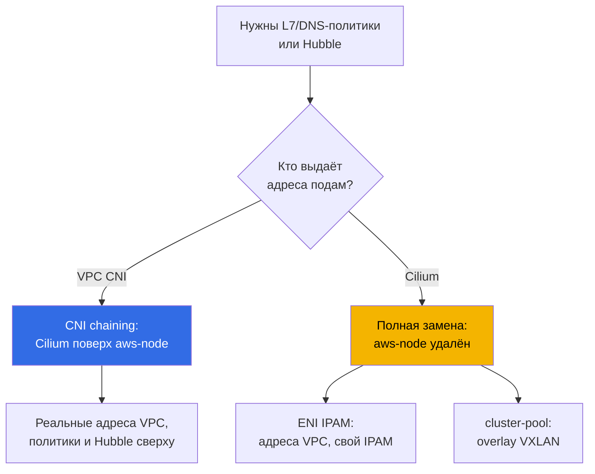
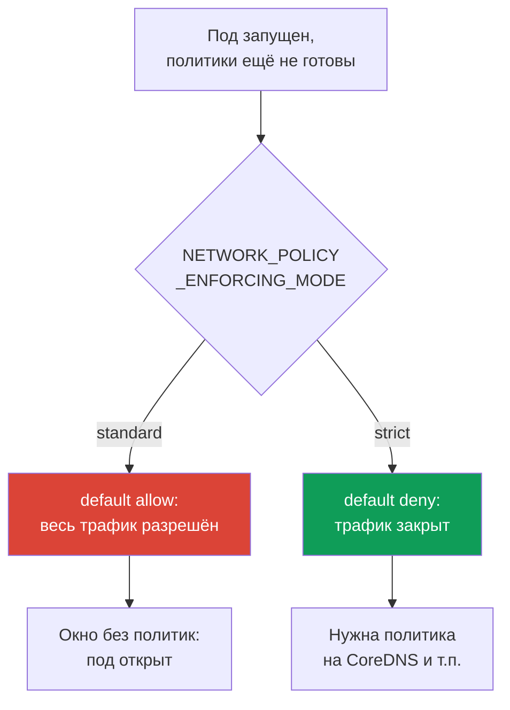

# Глава 8. Альтернативы VPC CNI: Cilium, режимы сети, когда менять CNI

> **Что дальше.** В главах 6 и 7 разобран VPC CNI: реальные адреса подов, ENI, дефицит и
> его системные выходы. Здесь другой вопрос - когда штатного CNI не хватает по возможностям,
> а не по адресам, и стоит ли его менять. Сам VPC CNI, ENI и планирование CIDR - глава 6;
> prefix delegation, secondary CIDR и custom networking - глава 7, здесь не повторяются.
> NetworkPolicy предметно и лаба default-deny - глава 30 и лаба 110, здесь только сравнение
> возможностей. Разбор сетевых сбоев - глава 46, механика апгрейдов и blue/green - глава 38.

## 8.1. «Встроенного NetworkPolicy не хватает»

Кластер живёт на VPC CNI, адресов достаточно, поды общаются. Приходит требование, которое
штатным NetworkPolicy не закрыть:

- безопасность просит правило «этот сервис ходит только на `api.stripe.com`», то есть политику
  по **DNS-имени**, а не по адресу или порту;
- или требуется правило на уровне HTTP: «разрешить `GET /health`, запретить всё остальное» -
  это **L7**, седьмой уровень, которого в стандартном NetworkPolicy нет;
- или инцидент закрыли, но никто не смог ответить «кто с кем говорил в момент сбоя»: нужна
  **наблюдаемость трафика** между подами, карта потоков, а не только Flow Logs по нодам;
- или проект растёт в **мультикластерную** сеть с единой политикой и прозрачной связностью.

Ни одно из этих требований не про нехватку адресов. Это про возможности плагина сети. И встаёт
вопрос, который в EKS стоит дорого: менять ли CNI, на что, и какой ценой в эксплуатации.
Ответ по умолчанию - **не менять**, но чтобы принять его осознанно, надо понять границы.

## 8.2. Что даёт VPC CNI и его встроенный NetworkPolicy

VPC CNI - это не только выдача адресов (глава 6). Начиная с версии `1.14`, у него есть
**встроенная реализация NetworkPolicy на eBPF**. Устроена она так:

- **контроллер политик** живёт в control plane EKS и ставится автоматически при создании
  кластера; он следит за объектами `NetworkPolicy` и раздаёт правила на ноды;
- **агент** (`aws-network-policy-agent`) едет отдельным контейнером в DaemonSet `aws-node` и
  грузит eBPF-программы в ядро ноды, которые и фильтруют трафик; нужен ядро Linux `5.10`+;
- фича **выключена по умолчанию** и включается параметром аддона `enableNetworkPolicy`.

```bash
kubectl get ds aws-node -n kube-system \
  -o jsonpath='{.spec.template.spec.containers[*].name}{"\n"}'   # aws-node + agent
aws eks update-addon --cluster-name demo --addon-name vpc-cni \
  --configuration-values '{"enableNetworkPolicy":"true"}' --resolve-conflicts PRESERVE
```

Что эта реализация умеет: стандартный **Kubernetes `NetworkPolicy`** (L3/L4, по адресам,
портам, селекторам подов и namespace), а с версии `1.21` - ещё и админскую
**`ClusterNetworkPolicy`** (`networking.k8s.aws/v1alpha1`) для правил на весь кластер. Всё это
**managed addon**: обновляется штатно, интегрировано с AWS и **покрыто их поддержкой**.

Чего в нём нет по сути:

- **L7-правил** (методы и пути HTTP, gRPC, Kafka) - фильтрация только на L3/L4;
- **политик по DNS-именам** - правило пишется по адресам и селекторам, не по FQDN;
- **CRD уровня `CiliumNetworkPolicy` и `CiliumClusterwideNetworkPolicy`** с их расширенными
  возможностями;
- **Hubble** и его наблюдаемости потоков (карта сервисов, метрики, дроп-по-политике).

Именно этот список и толкает команды смотреть в сторону Cilium.

## 8.3. Cilium в двух режимах

Cilium на EKS ставят принципиально по-разному, и это два разных решения по стоимости и риску.



**Режим 1. CNI chaining поверх VPC CNI.** Адреса подам по-прежнему выдаёт VPC CNI через ENI
(вся глава 6 остаётся в силе: реальные адреса VPC, никакого overlay, `max-pods` по формуле).
Cilium подключается «в цепочку»: после того как VPC CNI настроил интерфейс пода, Cilium вешает
на него eBPF-программы и добавляет **политики (включая L7 и DNS) и наблюдаемость Hubble**.
`aws-node` остаётся и продолжает работать. Это наименее инвазивный путь: возможности политик
растут, а адресная модель и интеграции VPC не трогаются.

**Режим 2. Полная замена VPC CNI.** DaemonSet `aws-node` **удаляется**, Cilium становится
единственным CNI и берёт на себя IPAM. Здесь два подрежима:

- **ENI IPAM с native routing**: Cilium сам управляет ENI и раздаёт подам реальные адреса VPC,
  без инкапсуляции. Адреса остаются маршрутизируемыми в VPC, но жизненным циклом IPAM теперь
  владеет Cilium, а не AWS.
- **cluster-pool (overlay/VXLAN)**: адреса подов берутся из виртуального пула кластера и
  инкапсулируются. Дефицит адресов VPC как класс исчезает (адреса подов больше не из подсети),
  но вместе с ним уходят свойства из таблицы главы 6 (см. раздел 8.4).

| Что умеет VPC CNI NP | Что добавляет Cilium | Чем платите |
|---|---|---|
| стандартный `NetworkPolicy` L3/L4 | `CiliumNetworkPolicy`, L7 (HTTP/gRPC/Kafka) | своя установка и её сопровождение |
| админская `ClusterNetworkPolicy` | `CiliumClusterwideNetworkPolicy`, DNS-политики | своя модель CRD, обучение команды |
| eBPF-агент как managed addon | Hubble: карта потоков, метрики, дропы | Hubble UI/Relay как отдельные компоненты |
| поддержка AWS, штатные апгрейды | опционально overlay и мультикластер | вы владеете апгрейдами и совместимостью |
| интеграция с SG for pods, Flow Logs | шифрование трафика (WireGuard/IPsec) | часть интеграций AWS теряется (раздел 8.5) |

Таблица - это не «Cilium лучше». Правый столбец - цена, и она реальна.

**Режим eBPF с заменой kube-proxy.** Когда Cilium становится основным датапланом (полная
замена, иногда и chaining), он умеет **заменить kube-proxy**: параметр
`kubeProxyReplacement=true`. Балансировку Service и NodePort тогда делают eBPF-программы
Cilium, а не iptables kube-proxy. Что это даёт: нет разрастания iptables-правил на крупных
кластерах, ниже задержка и лучше масштабирование Service. Чем платите: нужен свежий kernel
ноды (socket-LB требует ядра `4.19.57`/`5.2`+), managed addon `kube-proxy` в EKS вы убираете
и берёте балансировку под своё владение. Удаление kube-proxy рвёт существующие соединения
Service, поэтому его делают в blue/green (раздел 8.8), а не на живых нодах.

**Cilium ClusterMesh.** Для мультикластера Cilium объединяет Pod Network нескольких кластеров
в единую сеть. Архитектура: в каждом кластере поднимается `clustermesh-apiserver`, он отдаёт
своё состояние соседям и втягивает чужое, а агенты связываются с apiserver каждого кластера.
Требования жёсткие: у каждого кластера **уникальные `cluster-name` и `cluster-id`** и
**непересекающиеся PodCIDR** (native routing CIDR обязан покрывать все кластеры). Service метят
аннотацией `service.cilium.io/global: "true"`, и трафик балансируется по подам во всех
кластерах. Цена: связность control plane между кластерами, единое планирование адресов и
владение всем этим - VPC CNI такого не умеет вовсе.

Сводно, по продукту в целом, а не только по NetworkPolicy:

| Ось сравнения | VPC CNI | Cilium |
|---|---|---|
| Адресация подов | реальные адреса VPC, managed IPAM | ENI-IPAM или overlay, свой IPAM |
| NetworkPolicy | L3/L4 (+ `ClusterNetworkPolicy`) | L3/L4, L7 (HTTP/gRPC), DNS/FQDN |
| kube-proxy | штатный managed addon | опц. замена на eBPF (`kubeProxyReplacement`) |
| Наблюдаемость | Flow Logs по нодам | Hubble: карта потоков, метрики |
| Мультикластер | нет | ClusterMesh (общий Pod Network) |
| Эксплуатация | managed, поддержка AWS | вы владеете апгрейдами и совместимостью |

Левый столбец - что уже есть под поддержкой AWS; правый - возможности ценой владения CNI.

## 8.4. Другие альтернативы и что теряет overlay

- **Calico**. На EKS его чаще берут **только под policy поверх VPC CNI** (policy-only,
  адресацию оставляют VPC CNI), а не как полный CNI. С появлением встроенного NetworkPolicy у
  VPC CNI этот сценарий сузился: если нужен просто стандартный L3/L4, отдельный Calico уже не
  обязателен.
- **Overlay-режимы вообще** (Cilium cluster-pool, Calico VXLAN/IPIP, flannel). Возвращают
  «виртуальные» адреса подов и снимают дефицит IPv4, но ценой возврата к модели, от которой
  EKS ушёл. Относительно главы 6 теряется:

| Свойство (глава 6) | VPC CNI и ENI-режимы | Overlay |
|---|---|---|
| Реальные адреса подов в VPC | да | нет, виртуальный CIDR |
| Маршрутизация подов в связанных сетях | да | нет, только через шлюз/SNAT |
| Security groups на трафик подов | да (в т.ч. SG for pods, глава 19) | нет |
| VPC Flow Logs видят адреса подов | да | нет, видят адреса нод |
| Инкапсуляция и накладные расходы, MTU | нет | есть |

Overlay оправдан, когда дефицит IPv4 неустраним другими средствами (глава 7 их перечислила), а
прямая маршрутизация подов в VPC не требуется. Это осознанный размен, а не улучшение.

## 8.5. Честная цена перехода на замену CNI

Уход с VPC CNI на свой CNI - это не смена флага, а смена зоны ответственности. Что меняется:

- **Вы владеете жизненным циклом CNI.** Апгрейды больше **не managed addon**: их планируете,
  тестируете и катите вы, через Helm или свой пайплайн (глава 37).
- **Поддержка AWS сужается.** Штатная поддержка покрывает VPC CNI; проблемы стороннего CNI - в
  зоне его сообщества и вашей команды. Для EKS Hybrid Nodes Cilium как CNI поддерживается
  особо, но для обычных нод в AWS штатным остаётся VPC CNI.
- **Совместимость с версией кластера - ваша забота.** При апгрейде Kubernetes (главы 3 и 38)
  вы сами сверяете, что версия CNI поддерживает новую версию control plane, и обновляете в
  нужном порядке. Раньше это делал managed addon.
- **Часть интеграций AWS перестаёт работать «из коробки».** **Security groups for pods**
  (глава 46) и **видимость адресов подов в VPC Flow Logs** завязаны на VPC CNI и ENI-модель;
  при overlay они не работают, а при чужом ENI-IPAM их надо проверять отдельно, не считая
  данностью.
- **Диагностика усложняется.** Сетевой сбой теперь разбирается инструментами CNI (`cilium`,
  Hubble), а не только средствами VPC и `aws-node`; растёт число мест, где может сломаться.

```bash
cilium status                      # общее состояние агента и оператора Cilium
cilium connectivity test           # проверка связности и политик после установки
kubectl get ciliumnetworkpolicies -A   # какие CiliumNetworkPolicy применены
```

Эти команды доступны только после установки Cilium; на чистом VPC CNI их нет. Появление в
кластере `cilium` CLI - само по себе сигнал, что вы приняли на себя ответственность выше.

## 8.6. Порядок применения политик при старте пода и окно без политик

Момент, который легко упустить и который важен для безопасности: **между запуском пода и
применением к нему политик есть зазор**. У встроенного NetworkPolicy VPC CNI поведение в этом
зазоре задаётся переменной `NETWORK_POLICY_ENFORCING_MODE` у агента:



- **`standard` (по умолчанию).** Пока агент не настроил все правила для нового пода, тот
  работает с **default allow**: весь ingress и egress открыт. Есть **окно без политик** -
  секунды, когда под уже принимает и шлёт трафик, а фильтрация ещё не наложена. Для быстрого
  старта это удобно, для строгой изоляции - дыра.
- **`strict`.** Под стартует с **default deny**, и только потом накладываются разрешающие
  правила. Окна нет, но тогда **на каждый нужный поду адрес должна быть политика**, включая
  доступ к CoreDNS, иначе под не резолвит имена и не стартует нормально.

Это фундаментальный размен «скорость старта против отсутствия окна». Cilium решает ту же задачу
своими средствами, но принцип общий: если требуется гарантия, что под ни секунды не открыт,
режим по умолчанию не подходит, и это надо закладывать в дизайн (предметно - глава 30).

## 8.7. Когда менять CNI, а когда не менять

По умолчанию - **оставаться на VPC CNI**. Менять только под конкретную, названную потребность.

| Потребность | Оставаться на VPC CNI | Менять/дополнять CNI |
|---|---|---|
| Стандартный L3/L4 NetworkPolicy | да, встроенный агент | нет смысла |
| Правила по DNS-именам или L7 (HTTP/gRPC) | не покрывает | Cilium (chaining достаточно) |
| Наблюдаемость потоков между подами | Flow Logs по нодам | Cilium + Hubble (chaining) |
| Мультикластерная сеть с единой политикой | не покрывает | Cilium (cluster mesh) |
| Дефицит IPv4 неустраним (глава 7 не помог) | остаётся дефицит | overlay как крайняя мера |
| Реальные адреса, SG for pods, Flow Logs важны | да, это его сильная сторона | замена всё это отнимет |

Правила выбора:

- **Нужны L7/DNS-политики или Hubble, а адресная модель устраивает** - берите Cilium в режиме
  **CNI chaining**: получаете возможности, не отдавая IPAM и интеграции VPC. Это самый частый
  и самый дешёвый по риску ответ.
- **Полная замена оправдана** узко: нужен overlay ради ухода от дефицита адресов, либо
  мультикластер, либо требования, которых ENI-модель не даёт в принципе.
- **Не меняйте CNI «на будущее» или «потому что модно».** Каждый пункт раздела 8.5 - это
  постоянная нагрузка на команду, а не разовая настройка.

## 8.8. Миграция CNI как рискованная операция

Сменить CNI на живом кластере переключением флага **нельзя**. CNI назначается поду при его
создании, и уже запущенные поды не переедут на новый плагин сами. Поэтому смена CNI - это
почти всегда **пересоздание нод или кластера**, а не переключение на лету.

Безопасный путь - **blue/green** (механика апгрейда и пересоздания - глава 38, здесь принцип):

1. поднять **новый пул нод**, размеченный меткой, с новым CNI (или отдельный кластер);
2. проверить на нём связность и политики (`cilium connectivity test`), интеграции AWS, DNS;
3. переносить нагрузку постепенно, cordon/drain старых нод по одной с оглядкой на PDB;
4. только убедившись, что всё работает, убирать старый стек (в замене - удалять `aws-node`).

Переключение «в лоб» на работающем кластере опасно тем, что в переходный период в кластере
живут поды на двух разных сетевых стеках, и связность между ними, политики и egress ведут себя
непредсказуемо. Поэтому изоляция старого и нового стека по нодам - обязательный элемент, а не
предосторожность «на всякий случай».

## 8.9. Как это применяют в продакшене

- **По умолчанию остаются на VPC CNI** и включают встроенный NetworkPolicy: для L3/L4-изоляции
  этого достаточно, и всё остаётся под поддержкой AWS.
- **Cilium добавляют в режиме CNI chaining**, когда реально нужны L7/DNS-политики или Hubble:
  адресную модель и интеграции VPC при этом не трогают.
- **Полную замену CNI выбирают под конкретную потребность** (overlay от дефицита адресов,
  мультикластер) и закладывают в бюджет команды владение апгрейдами и диагностикой.
- **Режим применения политик выбирают осознанно**: `strict` там, где окно без политик
  недопустимо, с обязательной политикой на CoreDNS.
- **Любую смену CNI проводят как blue/green** через новый пул нод, а не переключением флага на
  живом кластере.

## 8.10. Мини-глоссарий

- **VPC CNI network policy** - встроенная реализация `NetworkPolicy` на eBPF: контроллер в
  control plane плюс агент `aws-network-policy-agent` в `aws-node`; включается параметром
  аддона `enableNetworkPolicy`. Поддерживает L3/L4 `NetworkPolicy` и админскую
  `ClusterNetworkPolicy` (`networking.k8s.aws/v1alpha1`).
- **CNI chaining** - режим, где VPC CNI выдаёт адреса и настраивает интерфейс, а Cilium
  добавляет поверх политики и наблюдаемость; `aws-node` остаётся.
- **Полная замена** - `aws-node` удалён, Cilium - единственный CNI со своим IPAM: **ENI IPAM**
  (реальные адреса VPC) или **cluster-pool** (overlay/VXLAN, виртуальные адреса).
- **`CiliumNetworkPolicy` / `CiliumClusterwideNetworkPolicy`** - CRD Cilium с L7- и
  DNS-правилами. **Hubble** - наблюдаемость потоков Cilium.
- **`NETWORK_POLICY_ENFORCING_MODE`** - режим применения политик при старте пода: `standard`
  (default allow, есть окно без политик) или `strict` (default deny).
- **`kubeProxyReplacement`** - режим Cilium, где Service/NodePort балансирует eBPF вместо
  kube-proxy; `true` включает замену. Требует свежего ядра и владения балансировкой.
- **ClusterMesh** - объединение Pod Network нескольких кластеров Cilium через
  `clustermesh-apiserver`; нужны уникальные `cluster-id` и непересекающиеся PodCIDR.

## 8.11. Итоги главы

- Повод менять CNI - это возможности, а не адреса: L7- или DNS-политики, наблюдаемость потоков,
  мультикластер. Вопрос адресов решается средствами главы 7, не сменой CNI.
- VPC CNI умеет встроенный NetworkPolicy на eBPF (контроллер плюс агент, флаг
  `enableNetworkPolicy`): стандартный L3/L4 и админский `ClusterNetworkPolicy`, всё как managed
  addon под поддержкой AWS. Нет L7, DNS-политик, CRD Cilium и Hubble.
- Cilium ставят двумя способами: CNI chaining поверх VPC CNI (адреса и интеграции VPC целы,
  сверху политики и Hubble) и полная замена (`aws-node` удалён, свой IPAM: ENI-режим или
  overlay). Chaining - самый дешёвый по риску путь к L7/DNS и наблюдаемости.
- Overlay снимает дефицит IPv4, но отнимает реальные адреса подов, их маршрутизацию в связанных
  сетях, security groups на трафик подов и видимость подов в Flow Logs.
- Цена замены CNI: вы владеете апгрейдами (не managed addon), поддержка AWS сужается,
  совместимость с версией кластера на вас, часть интеграций (SG for pods, Flow Logs по подам)
  перестаёт работать из коробки, диагностика усложняется.
- При старте пода есть окно без политик: `standard` открывает трафик до применения правил,
  `strict` закрывает, но требует политики на CoreDNS. Смена CNI - это blue/green через новые
  ноды, а не переключение флага на лету.
- В режиме eBPF Cilium может заменить kube-proxy (`kubeProxyReplacement=true`) и объединить
  кластеры через ClusterMesh - обе фичи убирают штатные managed-компоненты и требуют свежего
  ядра, непересекающихся PodCIDR и вашего владения балансировкой и адресами.

## 8.12. Как это пригодится в реальной работе

Требование «политики по DNS-именам» или «покажите карту трафика за время инцидента» приходит не
от сети, а от безопасности или разработки, и на него легко ответить дорого - «меняем CNI». Но
инженер с планом сначала спрашивает, устраивает ли адресная модель, и если да - берёт Cilium в
режиме chaining, не отдавая IPAM и интеграции VPC. Полную замену он оставляет на случаи, где
она действительно нужна, и заранее считает, что теперь апгрейды CNI и совместимость с версией
кластера - его постоянная работа. В спокойное время это влияет на дизайн: режим применения
политик выбран осознанно, а любая миграция CNI спланирована как blue/green, а не как флаг.

## 8.13. Вопросы для самопроверки

1. Какие требования оправдывают смену CNI, а какие решаются средствами главы 7?
2. Из каких компонентов состоит встроенный NetworkPolicy VPC CNI и как он включается?
3. Что встроенный NetworkPolicy VPC CNI умеет, а чего в нём нет по сути?
4. Чем CNI chaining отличается от полной замены VPC CNI и что при chaining остаётся прежним?
5. Какие два подрежима IPAM у полной замены на Cilium и чем они отличаются по адресам подов?
6. Что теряется относительно главы 6 при переходе на overlay?
7. Перечислите, что именно перестаёт быть заботой AWS и становится вашей при замене CNI.
8. Почему security groups for pods и Flow Logs по подам могут перестать работать со сменой CNI?
9. Что такое окно без политик и как на него влияет `NETWORK_POLICY_ENFORCING_MODE`?
10. Чем опасен режим `strict` и почему в нём нужна политика на CoreDNS?
11. По каким признакам выбрать «оставаться на VPC CNI» против «дополнить Cilium в chaining»?
12. Почему смену CNI нельзя сделать переключением флага и как выглядит blue/green-путь?
13. Что даёт `kubeProxyReplacement=true` и какие требования у ClusterMesh к адресам кластеров?

## Практика

Лабы у главы пока нет, содержание проверяется на живом кластере. Начните с того, что стоит
сейчас: `kubectl get ds aws-node -n kube-system` покажет, работает ли VPC CNI, а
`kubectl get ds aws-node -n kube-system -o jsonpath='{.spec.template.spec.containers[*].name}'`
- есть ли рядом контейнер `aws-network-policy-agent`, то есть включён ли встроенный
NetworkPolicy. Состояние аддона и его версию посмотрите через `aws eks describe-addon
--cluster-name <cluster> --addon-name vpc-cni`: версия ниже `1.14` означает, что встроенного
NetworkPolicy нет, а ниже `1.21` - что нет админских `ClusterNetworkPolicy`.

Проверьте режим применения политик: найдите `NETWORK_POLICY_ENFORCING_MODE` в
`kubectl describe ds aws-node -n kube-system | grep -i NETWORK_POLICY`; пустой результат
означает режим `standard` по умолчанию, то есть окно без политик при старте подов. Если в
кластере уже стоит Cilium, сравните картину: `cilium status` покажет режим и компоненты,
`kubectl get ciliumnetworkpolicies -A` - применённые L7/DNS-политики, а `cilium connectivity
test` прогонит связность (учтите, что тест создаёт временные нагрузки). На чистом VPC CNI этих
команд не будет - это и есть наглядная граница между «остаёмся» и «взяли на себя чужой CNI».

---
[Оглавление](../README_RU.md) · [Глава 7](../07/ru.md) · [Глава 9](../09/ru.md)
