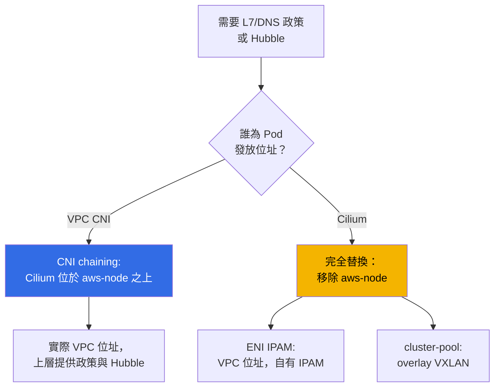
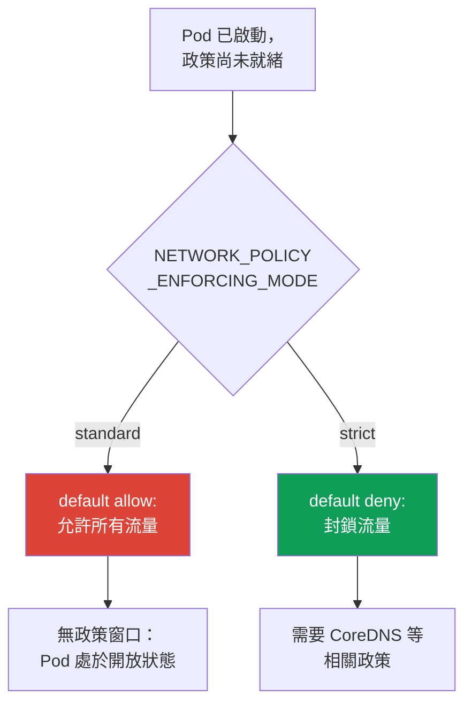

[Eng version](en.md) · [Versión en español](es.md) · [Version française](fr.md) · [Deutsche Version](de.md) · [ქართული ვერსია](ge.md) · [Русская версия](ru.md) · [日本語版](jp.md)
# 第 8 章．VPC CNI 的替代方案：Cilium、網路模式，以及何時應更換 CNI

> **接下來。** 第 6 與第 7 章介紹了 VPC CNI：Pod 的實際位址、ENI、位址不足及其系統性解法。本章討論另一個問題：預設 CNI 是功能不足而非位址不足時，是否應該更換它。VPC CNI、ENI 與 CIDR 規劃請見第 6 章；prefix delegation、secondary CIDR 與 custom networking 請見第 7 章，這裡不再重複。NetworkPolicy 的詳細說明與 default-deny 實驗在第 30 章和實驗 110；本章僅比較功能。網路故障排查請見第 46 章；升級和 blue/green 的機制請見第 38 章。

## 8.1．「內建的 NetworkPolicy 不夠用」

叢集使用 VPC CNI，位址充足，Pod 可以通訊。接著出現預設 NetworkPolicy 無法滿足的需求：

- 安全團隊要求規則「此服務只能連線至 `api.stripe.com`」，也就是依據 **DNS 名稱** 而非位址或連接埠的政策；
- 或需要 HTTP 層級的規則：「允許 `GET /health`，拒絕其他所有內容」--這是 **L7**，即第七層，而標準 NetworkPolicy 不具備此功能；
- 或事件已結案，卻沒有人能回答「故障當下誰與誰通訊」：需要 Pod 間的 **流量可觀測性**、流量圖，而不只是節點的 Flow Logs；
- 或專案擴展為具有統一政策與透明連線能力的 **多叢集** 網路。

這些需求都不是位址不足的問題，而是網路外掛功能的問題。於是出現一個在 EKS 中代價高昂的問題：是否要更換 CNI、換成什麼，以及營運成本是多少。預設答案是 **不要更換**，但要有意識地做出這個決定，必須先了解其界限。

## 8.2．VPC CNI 及其內建 NetworkPolicy 提供什麼

VPC CNI 不只是發放位址（第 6 章）。自 `1.14` 版起，它提供 **基於 eBPF 的內建 NetworkPolicy 實作**。其運作方式如下：

- **policy controller** 位於 EKS control plane，建立叢集時會自動安裝；它監看 `NetworkPolicy` 物件並將規則分發到節點；
- **agent**（`aws-network-policy-agent`）作為獨立容器隨 `DaemonSet` `aws-node` 部署，將 eBPF 程式載入節點核心並過濾流量；需要 Linux 核心 `5.10`+；
- 此功能 **預設停用**，可透過 addon 的 `enableNetworkPolicy` 參數啟用。

```bash
kubectl get ds aws-node -n kube-system \
  -o jsonpath='{.spec.template.spec.containers[*].name}{"\n"}'   # aws-node + agent
aws eks update-addon --cluster-name demo --addon-name vpc-cni \
  --configuration-values '{"enableNetworkPolicy":"true"}' --resolve-conflicts PRESERVE
```

此實作可提供：標準的 **Kubernetes `NetworkPolicy`**（L3/L4，依位址、連接埠、Pod 與 namespace selector），以及自 `1.21` 版起，可提供叢集全域規則的管理型 **`ClusterNetworkPolicy`**（`networking.k8s.aws/v1alpha1`）。這些全都是 **managed addon**：使用標準方式更新、與 AWS 整合，並且 **受到 AWS 支援**。

其本質上不具備的功能包括：

- **L7 規則**（HTTP 方法與路徑、gRPC、Kafka）--僅能在 L3/L4 過濾；
- **依 DNS 名稱的政策**--規則依位址與 selector 撰寫，而非 FQDN；
- 具有進階功能的 **`CiliumNetworkPolicy` 與 `CiliumClusterwideNetworkPolicy` 層級 CRD**；
- **Hubble** 及其流量可觀測性（服務圖、指標、依政策丟棄的流量）。

正是這份清單促使團隊開始考慮 Cilium。

## 8.3．Cilium 的兩種模式

在 EKS 上部署 Cilium 有兩種根本不同的方式，兩者的成本與風險也不同。



**模式 1．位於 VPC CNI 之上的 CNI chaining。** Pod 位址仍由 VPC CNI 透過 ENI 發放（第 6 章的全部內容仍適用：實際 VPC 位址、沒有 overlay、依公式計算 `max-pods`）。Cilium 被「串接」進來：VPC CNI 設定 Pod 介面後，Cilium 在其上掛載 eBPF 程式，並增加 **政策（包括 L7 與 DNS）及 Hubble 可觀測性**。`aws-node` 保留並繼續運作。這是侵入性最低的路徑：政策能力提升，但不變更位址模型與 VPC 整合。

**模式 2．完全替換 VPC CNI。** `DaemonSet` `aws-node` **會被移除**，Cilium 成為唯一的 CNI 並接管 IPAM。此處又有兩種子模式：

- **具 native routing 的 ENI IPAM**：Cilium 自行管理 ENI，向 Pod 發放實際 VPC 位址，無需封裝。位址仍可在 VPC 中路由，但 IPAM 生命週期改由 Cilium 而非 AWS 負責。
- **cluster-pool（overlay/VXLAN）**：Pod 位址取自虛擬叢集集區並經過封裝。VPC 位址不足這類問題不再存在（Pod 位址不再來自子網路），但第 6 章表格中的特性也會一併消失（見第 8.4 節）。

| VPC CNI NP 的能力 | Cilium 額外提供 | 所付出的代價 |
|---|---|---|
| 標準 `NetworkPolicy` L3/L4 | `CiliumNetworkPolicy`、L7（HTTP/gRPC/Kafka） | 自行安裝與維護 |
| 管理型 `ClusterNetworkPolicy` | `CiliumClusterwideNetworkPolicy`、DNS 政策 | 自行管理 CRD 模型、培訓團隊 |
| 作為 managed addon 的 eBPF agent | Hubble：流量圖、指標、丟棄事件 | Hubble UI/Relay 作為獨立元件 |
| AWS 支援、標準升級 | 可選的 overlay 與多叢集 | 您負責升級與相容性 |
| 與 SG for pods、Flow Logs 整合 | 流量加密（WireGuard/IPsec） | 部分 AWS 整合會遺失（第 8.5 節） |

此表並不是在說「Cilium 較好」。右欄是實際存在的代價。

**具 kube-proxy 替換的 eBPF 模式。** 當 Cilium 成為主要 dataplane（完全替換，有時 chaining 也可）時，它可以 **取代 kube-proxy**：設定 `kubeProxyReplacement=true`。此時 Service 與 NodePort 的負載平衡由 Cilium eBPF 程式而非 iptables kube-proxy 完成。其優點是：大型叢集不會出現 iptables 規則膨脹、延遲較低，且 Service 擴展性更好。代價是：需要較新的節點 kernel（socket-LB 需要 `4.19.57`/`5.2`+ kernel），您要移除 EKS 中的 managed addon `kube-proxy`，並自行承擔負載平衡責任。移除 kube-proxy 會中斷現有 Service 連線，因此應在 blue/green（第 8.8 節）中執行，而非在運作中的節點上操作。

**Cilium ClusterMesh。** 面對多叢集，Cilium 可將多個叢集的 Pod Network 合併為單一網路。架構上，每個叢集都會啟動 `clustermesh-apiserver`，將自身狀態提供給鄰居並接收其他叢集的狀態，而 agents 會連線至各叢集的 apiserver。要求嚴格：每個叢集必須具有 **唯一的 `cluster-name` 與 `cluster-id`**，以及 **不重疊的 PodCIDR**（native routing CIDR 必須覆蓋所有叢集）。Service 加上 `service.cilium.io/global: "true"` annotation 後，流量會在所有叢集的 Pod 之間負載平衡。代價是：叢集間 control plane 連線、統一的位址規劃，以及自行管理這一切--VPC CNI 完全不支援這項能力。

整體產品的彙總比較，而不僅是 NetworkPolicy：

| 比較面向 | VPC CNI | Cilium |
|---|---|---|
| Pod 位址 | 實際 VPC 位址、managed IPAM | ENI-IPAM 或 overlay、自有 IPAM |
| NetworkPolicy | L3/L4（+ `ClusterNetworkPolicy`） | L3/L4、L7（HTTP/gRPC）、DNS/FQDN |
| kube-proxy | 標準 managed addon | 可選的 eBPF 替換（`kubeProxyReplacement`） |
| 可觀測性 | 節點層級 Flow Logs | Hubble：流量圖、指標 |
| 多叢集 | 無 | ClusterMesh（共享 Pod Network） |
| 營運 | managed、AWS 支援 | 您負責升級與相容性 |

左欄是 AWS 支援下已具備的功能；右欄則是以 CNI 所有權為代價換取的能力。

## 8.4．其他替代方案與 overlay 會失去什麼

- **Calico**。在 EKS 上，它通常僅用於 **VPC CNI 之上的 policy**（policy-only，位址仍由 VPC CNI 負責），而非作為完整 CNI。隨著 VPC CNI 的內建 NetworkPolicy 出現，這個使用情境縮小了：若只需要標準 L3/L4，便不再一定需要獨立的 Calico。
- **一般的 overlay 模式**（Cilium cluster-pool、Calico VXLAN/IPIP、flannel）。它們恢復「虛擬」Pod 位址並消除 IPv4 不足問題，但代價是重新回到 EKS 已離開的模型。相較第 6 章，會失去：

| 特性（第 6 章） | VPC CNI 與 ENI 模式 | Overlay |
|---|---|---|
| VPC 中實際的 Pod 位址 | 是 | 否，虛擬 CIDR |
| 在已連線網路中路由 Pod | 是 | 否，僅能透過 gateway/SNAT |
| Pod 流量的 Security groups | 是（包括 SG for pods，第 19 章） | 否 |
| VPC Flow Logs 可見 Pod 位址 | 是 | 否，只會看到節點位址 |
| 封裝與額外負擔、MTU | 無 | 有 |

當 IPv4 不足無法透過其他方法解決（第 7 章已列出）且不需要在 VPC 中直接路由 Pod 時，overlay 才有合理性。這是有意識的取捨，而非改善。

## 8.5．轉換至替代 CNI 的真實代價

從 VPC CNI 改用自有 CNI 並非切換一個旗標，而是改變責任範圍。變更如下：

- **您負責 CNI 的生命週期。** 升級不再是 **managed addon**：您要透過 Helm 或自己的 pipeline（第 37 章）規劃、測試與部署。
- **AWS 支援範圍縮小。** 標準支援涵蓋 VPC CNI；第三方 CNI 的問題則屬於其社群與您的團隊。EKS Hybrid Nodes 對 Cilium 作為 CNI 有特別支援，但對一般 AWS 節點而言，VPC CNI 仍是標準方案。
- **叢集版本相容性由您負責。** 升級 Kubernetes（第 3 與第 38 章）時，您必須自行確認 CNI 版本支援新的 control plane 版本，並以正確順序更新。過去這些工作由 managed addon 處理。
- **部分 AWS 整合不再「開箱即用」。** **Security groups for pods**（第 46 章）與 **VPC Flow Logs 中 Pod 位址的可見性** 依賴 VPC CNI 和 ENI 模型；在 overlay 下它們無法運作，而在其他 ENI-IPAM 下也必須單獨驗證，不能想當然耳。
- **診斷更為複雜。** 現在網路故障必須以 CNI 工具（`cilium`、Hubble）而不只是 VPC 與 `aws-node` 工具進行分析；可能出問題的位置更多了。

```bash
cilium status                      # Cilium agent 與 operator 的整體狀態
cilium connectivity test           # 安裝後驗證連線與政策
kubectl get ciliumnetworkpolicies -A   # 已套用哪些 CiliumNetworkPolicy
```

這些命令只有在安裝 Cilium 後才能使用；在純 VPC CNI 上不存在。叢集中出現 `cilium` CLI 本身，就表示您已承擔上述責任。

## 8.6．Pod 啟動時的政策套用順序與無政策窗口

一個容易忽略、但對安全性非常重要的時刻是：**Pod 啟動與政策套用至該 Pod 之間存在間隔**。對 VPC CNI 的內建 NetworkPolicy 而言，該間隔期間的行為由 agent 的 `NETWORK_POLICY_ENFORCING_MODE` 變數決定：



- **`standard`（預設）。** 在 agent 為新 Pod 設定所有規則之前，Pod 以 **default allow** 運作：所有 ingress 與 egress 均開放。存在 **無政策窗口**--Pod 已可收發流量，但尚未套用過濾的那幾秒鐘。這對快速啟動很方便，對嚴格隔離則是一個漏洞。
- **`strict`。** Pod 以 **default deny** 啟動，之後才套用允許規則。沒有窗口，但 **Pod 需要連線的每個位址都必須有對應政策**，包括 CoreDNS 存取，否則 Pod 無法解析名稱，也無法正常啟動。

這是「啟動速度與無窗口保證」之間的根本取捨。Cilium 以自己的方法解決相同問題，但原則相同：若需要保證 Pod 連一秒鐘都不處於開放狀態，預設模式並不適用，必須在設計中納入考量（詳細內容見第 30 章）。

## 8.7．何時更換 CNI，何時不要更換

預設情況是 **保留 VPC CNI**。只有針對明確命名的需求才更換。

| 需求 | 保留 VPC CNI | 更換/補充 CNI |
|---|---|---|
| 標準 L3/L4 NetworkPolicy | 是，內建 agent | 沒有意義 |
| 依 DNS 名稱或 L7（HTTP/gRPC）的規則 | 不支援 | Cilium（chaining 已足夠） |
| Pod 間流量可觀測性 | 節點層級 Flow Logs | Cilium + Hubble（chaining） |
| 具有統一政策的多叢集網路 | 不支援 | Cilium（cluster mesh） |
| 無法解決的 IPv4 不足（第 7 章無效） | 仍然不足 | overlay 作為最後手段 |
| 實際位址、SG for pods、Flow Logs 很重要 | 是，這是它的強項 | 替換會失去這些能力 |

選擇規則：

- **需要 L7/DNS 政策或 Hubble，但對位址模型滿意**--採用 **CNI chaining** 模式的 Cilium：獲得所需能力，同時不交出 IPAM 與 VPC 整合。這是最常見且風險成本最低的答案。
- **完全替換只有在較窄的情況下合理**：需要 overlay 來解決位址不足、多叢集，或 ENI 模型原則上無法提供的需求。
- **不要因為「未來可能需要」或「它很流行」而更換 CNI。** 第 8.5 節的每一項都是團隊的持續負擔，而非一次性的設定。

## 8.8．將 CNI 遷移視為高風險操作

不能在運作中的叢集上切換旗標來更換 CNI。CNI 在 Pod 建立時指派，已運作的 Pod 不會自行遷移至新外掛。因此，更換 CNI 幾乎總是 **重建節點或叢集**，而不是即時切換。

安全途徑是 **blue/green**（升級與重建的機制請見第 38 章；此處只說明原則）：

1. 建立一個標有 label、使用新 CNI 的**新節點集區**（或獨立叢集）；
2. 在其上驗證連線與政策（`cilium connectivity test`）、AWS 整合與 DNS；
3. 逐步遷移工作負載，逐一 cordon/drain 舊節點，並注意 PDB；
4. 確認一切運作正常後，才移除舊 stack（完全替換時，移除 `aws-node`）。

直接在運作中的叢集「硬切」是危險的，因為轉換期間叢集中的 Pod 使用兩種不同網路 stack，它們之間的連線、政策與 egress 行為難以預測。因此，依節點隔離舊與新 stack 是必要條件，而非「以防萬一」的預防措施。

## 8.9．在生產環境中的應用方式

- **預設保留 VPC CNI** 並啟用內建 NetworkPolicy：對於 L3/L4 隔離已足夠，且所有內容仍受到 AWS 支援。
- 當確實需要 L7/DNS 政策或 Hubble 時，**以 CNI chaining 模式加入 Cilium**：不會變更位址模型與 VPC 整合。
- **針對具體需求選擇完全替換 CNI**（解決位址不足的 overlay、多叢集），並將升級與診斷的責任納入團隊預算。
- **有意識地選擇政策套用模式**：在無政策窗口不可接受之處使用 `strict`，並且必須為 CoreDNS 設定政策。
- **任何 CNI 更換都透過新節點集區以 blue/green 進行**，而非在運作中的叢集切換旗標。

## 8.10．迷你詞彙表

- **VPC CNI network policy**--基於 eBPF 的內建 `NetworkPolicy` 實作：control plane 中的 controller 加上 `aws-node` 裡的 `aws-network-policy-agent`；由 addon 參數 `enableNetworkPolicy` 啟用。支援 L3/L4 `NetworkPolicy` 與管理型 `ClusterNetworkPolicy`（`networking.k8s.aws/v1alpha1`）。
- **CNI chaining**--VPC CNI 發放位址並設定介面，而 Cilium 在其上增加政策與可觀測性的模式；`aws-node` 保留。
- **完全替換**--移除 `aws-node`，Cilium 是唯一 CNI，並使用自己的 IPAM：**ENI IPAM**（實際 VPC 位址）或 **cluster-pool**（overlay/VXLAN、虛擬位址）。
- **`CiliumNetworkPolicy` / `CiliumClusterwideNetworkPolicy`**--具有 L7 與 DNS 規則的 Cilium CRD。**Hubble**--Cilium 的流量可觀測性。
- **`NETWORK_POLICY_ENFORCING_MODE`**--Pod 啟動時的政策套用模式：`standard`（default allow，存在無政策窗口）或 `strict`（default deny）。
- **`kubeProxyReplacement`**--Cilium 使用 eBPF 而非 kube-proxy 對 Service/NodePort 進行負載平衡的模式；`true` 會啟用替換。需要較新的 kernel，並需自行負責負載平衡。
- **ClusterMesh**--透過 `clustermesh-apiserver` 合併多個 Cilium 叢集的 Pod Network；需要唯一的 `cluster-id` 與不重疊的 PodCIDR。

## 8.11．本章重點

- 更換 CNI 的理由是功能而非位址：L7 或 DNS 政策、流量可觀測性、多叢集。位址問題應以第 7 章的方法解決，而非更換 CNI。
- VPC CNI 提供基於 eBPF 的內建 NetworkPolicy（controller 加 agent、`enableNetworkPolicy` 旗標）：標準 L3/L4 與管理型 `ClusterNetworkPolicy`，全部作為受到 AWS 支援的 managed addon。它不支援 L7、DNS 政策、Cilium CRD 與 Hubble。
- Cilium 有兩種部署方式：位於 VPC CNI 上的 CNI chaining（保留位址與 VPC 整合，上層增加政策與 Hubble），以及完全替換（移除 `aws-node`，使用自有 IPAM：ENI 模式或 overlay）。Chaining 是獲得 L7/DNS 與可觀測性而風險最低的途徑。
- Overlay 解決 IPv4 不足，卻失去實際 Pod 位址、其在已連線網路中的路由、Pod 流量的 security groups，以及 Flow Logs 中 Pod 的可見性。
- 更換 CNI 的代價：您負責升級（不再是 managed addon）、AWS 支援縮小、叢集版本相容性由您負責，部分整合（SG for pods、Pod Flow Logs）不再開箱即用，診斷變得更複雜。
- Pod 啟動時存在無政策窗口：`standard` 在套用規則前開放流量，`strict` 則封鎖流量，但需要為 CoreDNS 設定政策。更換 CNI 應經由新節點以 blue/green 進行，而非即時切換旗標。
- 在 eBPF 模式中，Cilium 可替換 kube-proxy（`kubeProxyReplacement=true`），並透過 ClusterMesh 合併叢集--這兩項功能都會移除預設 managed 元件，並要求較新的 kernel、不重疊的 PodCIDR，以及由您負責負載平衡與位址規劃。

## 8.12．這在實際工作中如何派上用場

「依 DNS 名稱制定政策」或「顯示事件期間的流量圖」這類需求並非來自網路團隊，而是來自安全或開發團隊；很容易以代價高昂的方式回答：「更換 CNI」。但有計畫的工程師會先問位址模型是否合適；若合適，便採用 Cilium chaining 模式，而不交出 IPAM 與 VPC 整合。他只會在確實需要時才完全替換，並且預先估算 CNI 升級與叢集版本相容性現在會成為他的持續工作。在平時，這會影響設計：有意識地選擇政策套用模式，並將每次 CNI 遷移規劃為 blue/green，而非一個旗標。

## 8.13．自我檢查問題

1. 哪些需求合理地支持更換 CNI，哪些可透過第 7 章的方法解決？
2. VPC CNI 的內建 NetworkPolicy 由哪些元件組成，以及如何啟用？
3. VPC CNI 的內建 NetworkPolicy 能做什麼，本質上缺少什麼？
4. CNI chaining 與完全替換 VPC CNI 有何不同，chaining 時哪些內容保持不變？
5. 完全改用 Cilium 時 IPAM 的兩種子模式為何，其 Pod 位址有何差異？
6. 相較第 6 章，轉換至 overlay 會失去什麼？
7. 列舉更換 CNI 後，哪些項目不再由 AWS 負責而變成您的責任？
8. 為何更換 CNI 後，security groups for pods 與 Pod Flow Logs 可能停止運作？
9. 什麼是無政策窗口，`NETWORK_POLICY_ENFORCING_MODE` 如何影響它？
10. `strict` 模式有何風險，為何此模式需要為 CoreDNS 設定政策？
11. 根據哪些條件決定「保留 VPC CNI」或「在 chaining 中補充 Cilium」？
12. 為何不能以切換旗標來更換 CNI，blue/green 路徑是什麼樣子？
13. `kubeProxyReplacement=true` 有何作用，ClusterMesh 對叢集位址有何要求？

## 實作練習

本課程與此主題相關的實驗：[實驗 132--替代 CNI：VPC CNI 上的 Cilium CNI chaining 模式](../../labs/132/README_TW.MD)。該實驗會透過 Helm 在運作中的 VPC CNI 上安裝 Cilium（`cni.chainingMode: aws-cni`），證明 IPAM 仍由 VPC CNI 負責，並在其上提供依 HTTP 方法的 L7 規則、透過 `toFQDNs` 的 DNS 名稱政策，以及含 Hubble verdict 的流量圖。實驗有意不涵蓋完全替換 VPC CNI：這必須透過新節點進行 blue/green（第 8.8 節），而非切換旗標。使用 `check_result` 命令驗證結果。同一主題還包括[實驗 110--EKS 中的 NetworkPolicy：內建 VPC CNI network policy](../../labs/110/README_TW.MD)，該實驗會單獨驗證 VPC CNI 的內建 network policy，而不使用 Cilium。

以下以一般命令在自己的任意叢集中執行相同檢查。先檢視目前的安裝：`kubectl get ds aws-node -n kube-system` 顯示 VPC CNI 是否正在運作，而 `kubectl get ds aws-node -n kube-system -o jsonpath='{.spec.template.spec.containers[*].name}'` 顯示是否存在 `aws-network-policy-agent` 容器，也就是內建 NetworkPolicy 是否已啟用。透過 `aws eks describe-addon --cluster-name <cluster> --addon-name vpc-cni` 檢查 addon 狀態與版本：低於 `1.14` 表示沒有內建 NetworkPolicy，低於 `1.21` 表示沒有管理型 `ClusterNetworkPolicy`。

檢查政策套用模式：在 `kubectl describe ds aws-node -n kube-system | grep -i NETWORK_POLICY` 中尋找 `NETWORK_POLICY_ENFORCING_MODE`；空白結果表示預設的 `standard` 模式，也就是 Pod 啟動時存在無政策窗口。若叢集已安裝 Cilium，請比較結果：`cilium status` 顯示模式與元件，`kubectl get ciliumnetworkpolicies -A` 顯示已套用的 L7/DNS 政策，而 `cilium connectivity test` 執行連線測試（請注意，此測試會建立臨時工作負載）。在純 VPC CNI 上不會有這些命令--這正是「保留」和「承擔第三方 CNI」之間清楚可見的界線。

---
[目錄](../README_TW.md) · [第 7 章](../07/tw.md) · [第 9 章](../09/tw.md)
