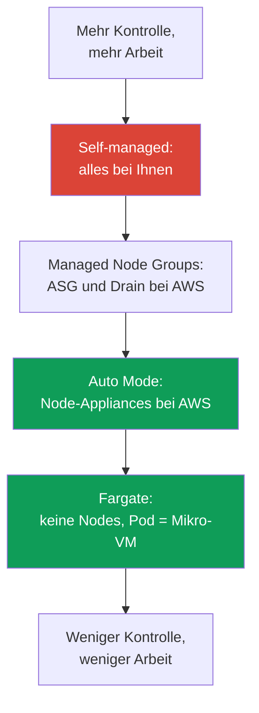
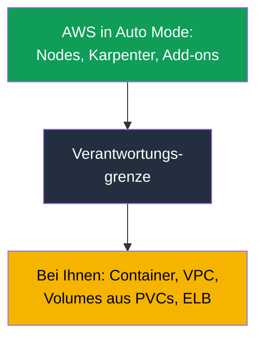

[Eng version](en.md) · [Versión en español](es.md) · [Version française](fr.md) · [Русская версия](ru.md) · [ქართული ვერსია](ge.md) · [繁體中文版](tw.md) · [日本語版](jp.md)
# Kapitel 9. Compute-Typen: Managed Node Groups, Self-Managed, Fargate, Auto Mode

> **Wie geht es weiter?** Die Control Plane wird von AWS betrieben (Kapitel 1–2), der Cluster ist erstellt (Kapitel 4), Zugriff und Netzwerk sind eingerichtet (Kapitel 5–8). Als Nächstes stellt sich die Frage, worauf Pods ausgeführt werden: Es gibt nun vier Optionen, jede mit einem eigenen Betriebsmodell. Dieses Kapitel gibt einen Überblick über diese vier Typen und behandelt die zentrale Entscheidung von Teil 2 – EKS Auto Mode gegenüber dem eigenen Stack. AMI, Bootstrap und Launch Template behandelt Kapitel 10, Autoscaling und Karpenter die Kapitel 11–12, Spot Kapitel 13, Sizing und `max-pods` die Kapitel 6 und 14, Fargate im Detail (Profile, Einschränkungen) Kapitel 15.

## 9.1. „Den falschen Compute-Typ gewählt, und es fiel zu spät auf“

Ein Team migriert einen Service zu EKS. Der Cluster läuft, die Pods laufen, alles scheint zu funktionieren. Nach Wochen treten Probleme auf, wenn etwas an einem Node erledigt werden muss, es aber nicht möglich ist:

- Die Workload wurde wegen „keiner Nodes“ auf Fargate platziert, doch nun verlangt die Sicherheit die Installation eines Runtime-Agenten als DaemonSet – auf Fargate werden **DaemonSets nicht unterstützt**, daher gibt es keinen Ort für den Agenten.
- EKS Auto Mode wurde gewählt, um den Betriebsaufwand zu minimieren. Bei einem Vorfall will der Engineer auf dem Node die kubelet-Logs prüfen und stellt fest, dass **SSH und SSM by design gesperrt sind**.
- Self-managed Nodes wurden für vollständige Kontrolle eingerichtet, und nun sind Betriebssystem-Patches, kubelet-Updates, AMI-Rotation und Node-Registrierung monatliche Arbeit, die niemand eingeplant hatte.

Keine dieser Fehlerquellen ist am ersten Tag sichtbar. Alle drei sind die Folge davon, dass der **Compute-Typ gewählt wurde, ohne das Betriebsmodell zu besprechen**: Wer patcht das Betriebssystem, gibt es Zugriff auf den Node, kann ein Agent installiert werden, wer ist für Updates verantwortlich und was kostet dies? Dieses Kapitel liefert die Übersicht, damit die Wahl bewusst getroffen wird und nicht nach dem Motto „wir nehmen, was im Tutorial zuerst auftaucht“.

## 9.2. Vier Compute-Typen: Wer übernimmt was?

In EKS kann ein Pod auf einem von vier Compute-Typen ausgeführt werden. Alle befinden sich im selben Cluster und teilen sich eine Control Plane; sie unterscheiden sich darin, **wie viel der Node-Ebene AWS übernimmt** und wie viel bei Ihnen bleibt.

| Typ | Was AWS übernimmt | Was bei Ihnen bleibt | Wann passend |
|---|---|---|---|
| Managed Node Groups | ASG und Launch Template, Update auf Befehl, Drain | Node-Betriebssystem, was darauf läuft, Sizing | Basis-Produktion, vertrautes Modell |
| Self-managed Nodes | nichts über EC2 hinaus | der gesamte Node-Lebenszyklus | benutzerdefiniertes AMI, GPU, Sonderfälle |
| Fargate | der gesamte Node: Pod = Mikro-VM | nur der Container und seine Konfiguration | Isolation, Gruppen von Jobs, ohne Nodes |
| EKS Auto Mode | Node-Appliance, Skalierung, Add-ons | Container, VPC, Volumes aus PVCs, ELB | minimaler Betriebsaufwand für Nodes |

Der Unterschied lässt sich gut als Verantwortungsskala verstehen: Oben stehen self-managed Nodes, bei denen alles bei Ihnen liegt, unten Auto Mode und Fargate, bei denen die Nodes fast vollständig bei AWS liegen, und in der Mitte stehen Managed Node Groups.



Dieselben vier Typen lassen sich anhand dreier Auswahlkriterien zusammenfassen: Was sie kosten (Kosten- und Verwaltungsstruktur), wie isoliert die Workload ist und wie viel operativer Aufwand bei Ihnen bleibt.

| Typ | Kosten und Verwaltung | Isolation | Operativer Overhead |
|---|---|---|---|
| Managed Node Groups | Zahlung für EC2, ASG-Verwaltung ohne Aufpreis | Nodes werden von Pods gemeinsam genutzt | mittel: Betriebssystem und Updates bei Ihnen |
| Self-managed Nodes | nur EC2, Orchestrierung in Eigenregie | Nodes gemeinsam genutzt, Isolation nach eigener Konfiguration | hoch: gesamter Node-Lebenszyklus |
| Fargate | Zahlung für vCPU und Pod-Speicher, bei dichter Packung teurer | maximal: Pod = Mikro-VM | niedrig: keine Nodes |
| EKS Auto Mode | EC2 plus Verwaltungsaufschlag | Nodes gemeinsam genutzt, aber als Appliance | minimal: Nodes bei AWS |

Im Folgenden geht es für jeden Typ darum, was AWS Ihnen genau abnimmt, was nicht und wann der Typ gerechtfertigt ist. Auto Mode wird in den Abschnitten 9.6–9.8 separat und ausführlich behandelt, weil dies die zentrale Entscheidung von Teil 2 ist.

## 9.3. Managed Node Groups: ASG unter EKS-Verwaltung

Eine Managed Node Group ist eine Gruppe von EC2-Instances, die EKS über eine Auto Scaling Group und ein Launch Template unter eigener Verwaltung für Sie erstellt und betreibt. Die Nodes registrieren sich automatisch im Cluster, und ein Versionsupdate erfolgt mit einem Befehl: EKS startet neue Nodes, markiert die alten nacheinander als `SchedulingDisabled`, **drained** die Workload unter Berücksichtigung von PDBs korrekt und beendet die alten Instances.

```bash
aws eks create-nodegroup --cluster-name demo --nodegroup-name system \
  --node-role arn:aws:iam::111122223333:role/eksNodeRole \
  --subnets subnet-0abc subnet-0def --instance-types m5.large \
  --scaling-config minSize=2,maxSize=6,desiredSize=3
eksctl create nodegroup --cluster demo --name apps --managed --nodes 3
```

Was AWS **übernimmt**: den ASG-Lebenszyklus, die Orchestrierung von Updates mit Drain, Health Checks und den Ersatz fehlerhafter Nodes. Was **bei Ihnen bleibt**: das Betriebssystem des Nodes und alles, was darauf läuft, die Wahl des Instance-Typs und das Sizing (Kapitel 6 und 14), die Entscheidung für ein Update und dessen Zeitpunkt. Eine Managed Node Group entbindet Sie nicht von der Verantwortung für den Inhalt des Nodes – sie nimmt Ihnen die manuelle Arbeit mit ASG und der Update-Reihenfolge ab.

Sie sind als **grundlegende Wahl für die Produktion** geeignet, wenn Sie kein benutzerdefiniertes Image benötigen und das vertraute Modell „Wir haben Nodes, wir verwalten sie, aber ohne eine manuelle ASG“ wünschen. Mit diesem Typ beginnt man, wenn Auto Mode aus irgendeinem Grund nicht passt.

## 9.4. Self-managed Nodes: vollständige Kontrolle und vollständige Last

Self-managed Nodes sind EC2-Instances, die Sie selbst starten (mit eigener ASG, eigenem Terraform, eigenem Launch Template) und selbst dem Cluster hinzufügen. EKS weiß über diese Nodes nur, dass sie sich registriert haben; alles andere liegt in Ihrem Verantwortungsbereich.

Was das ermöglicht: **vollständige Kontrolle**. Ein eigenes AMI mit dem benötigten Kernel und vorinstallierten Paketen, ein spezieller Bootstrap (Kapitel 10), spezifische GPU-Treiber, ungewöhnliche Instance-Typen und Konfigurationen, die in der managed Variante nicht verfügbar sind. Die Berechtigung, solche Nodes hinzuzufügen, wird über einen Access Entry vom Typ `EC2_LINUX` oder `EC2_WINDOWS` erteilt (Kapitel 5), nicht über das alte `aws-auth`.

Was es kostet: **Die vollständige Betriebslast kehrt zu Ihnen zurück**. Sicherheits-Patches für das Betriebssystem, kubelet-Updates und die Abstimmung seiner Version mit der Control Plane, AMI-Rotation, korrekte Registrierung und Drain beim Ersatz, die eigenständige Behandlung von Spot-Unterbrechungen (Kapitel 13). Alles, was Managed Node Groups und Auto Mode für Sie erledigen, ist hier wieder Ihre Arbeit. Self-managed wird nicht gewählt, weil „mehr Kontrolle generell besser ist“, sondern wenn es eine **konkrete Anforderung** gibt, die Managed-Varianten nicht erfüllen.

## 9.5. Fargate: Pod als Mikro-VM, überhaupt keine Nodes

Fargate entfernt Nodes vollständig aus dem Bild. Sie wählen keinen Instance-Typ, skalieren keine Gruppen und patchen kein Betriebssystem: Ein Pod mit passendem Fargate-Profil (Kapitel 15) startet auf einer dedizierten **Mikro-VM** mit eigenem Kernel, eigener CPU, eigenem Speicher und eigener Netzwerkschnittstelle, die nicht mit anderen Pods geteilt werden.

```bash
aws eks create-fargate-profile --cluster-name demo --fargate-profile-name batch \
  --pod-execution-role-arn arn:aws:iam::111122223333:role/eksFargatePodRole \
  --subnets subnet-0abc subnet-0def \
  --selectors namespace=batch
```

Der Preis der Isolation sind **Einschränkungen**, die durch die Fargate-Dokumentation belegt sind. Auf Fargate gibt es keine DaemonSets (ein Agent ist nur als Sidecar im Pod selbst möglich), keine privilegierten Container, kein `HostPort` und `HostNetwork`, keine GPUs und keinen Zugriff auf einen „Node“, weil es im herkömmlichen Sinn keinen Node gibt. Load Balancer funktionieren nur im Target-Type `ip`, Pods werden nur in privaten Subnetzen gestartet. Vom persistenten Storage lässt sich **nur EFS** (über EFS CSI) mounten; **EBS kann nicht an Fargate-Pods angebunden werden**. Es gibt nur ephemeral Storage für den Pod: standardmäßig 20 GiB, erweitert nicht über eine Festplatte, sondern über eine Anfrage für `ephemeral-storage` in `resources.requests` des Pods, bis zu 175 GiB (Details und Beispiel: Kapitel 15). Fargate eignet sich für isolierte Workloads, Gruppen von Jobs und Services, bei denen kein Node-Zugriff und keine Node-Agenten benötigt werden. Profile, Einschränkungen und Kostenstruktur (Zahlung für vCPU und Speicher des Pods selbst) behandelt Kapitel 15 im Detail.

## 9.6. EKS Auto Mode: Nodes als Appliance

EKS Auto Mode ist ein Modus, in dem AWS nicht nur die Control Plane, sondern auch die Dateninfrastruktur verwaltet: Nodes, Skalierung, Pod-Netzwerk, Load Balancing und ephemeral Storage. Nodes in Auto Mode sind **als Appliance** konzipiert, als Black Box, die Sie nicht öffnen. Laut der Auto-Mode-Dokumentation übernimmt AWS Folgendes.

**Die Nodes selbst.** AWS wählt das AMI (Bottlerocket-Varianten), aktiviert **SELinux im enforcing-Modus** und ein **read-only root filesystem**, und direkter Zugriff auf den Node ist gesperrt: **weder SSH noch SSM**. Ein Node hat eine **maximale Lebensdauer von 21 Tagen** (sie kann verkürzt werden) und wird danach automatisch durch einen aktuellen ersetzt – eine erzwungene Rotation für aktuelle Patches.

**Skalierung und Ereignisse.** Innerhalb des Dienstes arbeitet Karpenter: Er überwacht nicht planbare Pods, startet Nodes für sie und entfernt überflüssige Nodes bei der Konsolidierung. Spot-Unterbrechungen, Health-Ereignisse und geplante EC2-Wartung werden **durch den Service ohne Ihren Node Termination Handler** verarbeitet.

**Integrierte Fähigkeiten statt Add-ons.** Die IP-Zuweisung an Pods, Network Policy, lokales DNS, GPU-Plugins (NVIDIA, Neuron), EBS CSI und die ELB-Integration für Service und Ingress sind als Kernkomponenten in den Modus eingebaut. Der **Pod Identity Agent muss nicht installiert werden** – er ist bereits Teil des Modus.

```bash
aws eks describe-cluster --name demo --query 'cluster.computeConfig'
kubectl get nodes -L eks.amazonaws.com/compute-type -L karpenter.sh/nodepool
```

## 9.7. Auto Mode: Updates, Grenzen und was nicht bearbeitet werden darf

**Automatische Updates.** Auto Mode hält Cluster, Nodes und Komponenten aktuell und **beachtet dabei Ihre PDBs und NodePool Disruption Budgets**. Wenn eine blockierende PDB ein Update länger als die 21-tägige Lebensdauer eines Nodes verhindert, kann Ihr Eingreifen erforderlich sein. Bei einem **Rollback der Cluster-Version werden Auto-Mode-Nodes vor der Control Plane zurückgerollt**, unter Berücksichtigung Ihrer Disruption-Kontrollen (Reihenfolge des Rollbacks: Kapitel 39).

**Was nicht bearbeitet werden darf und was möglich ist.** Die standardmäßigen NodePools und NodeClasses werden vom Service konfiguriert und **dürfen nicht bearbeitet werden**. Neben den Standardobjekten können Sie jedoch **eigene** NodePools und NodeClasses hinzufügen: für bestimmte Instance-Typen, die Isolation von Workloads oder Einstellungen für ephemeral Storage.

Dies ist der Weg, die Steuerung der Konsolidierung zurückzugewinnen. Im eigenen NodePool gibt es den Abschnitt `disruption`: `consolidationPolicy` und `consolidateAfter` legen fest, wie aggressiv Nodes konsolidiert werden, während `budgets` den Anteil gleichzeitig unterbrochener Nodes begrenzt und Ruhezeiten nach Zeitplan ermöglicht (die Mechanik dieser Felder: Kapitel 12). Die Standard-NodePools haben dabei vorgegebene Kosteneinschränkungen: nur die Familien C, M und R, nur On-Demand ohne Spot, Generationen ab der fünften, aber **ohne `limits`**. Eigene NodePools **übernehmen diese Einschränkungen nicht**; daher müssen Sie darin Limits und zulässige Instance-Typen selbst festlegen, andernfalls wächst der Pool unbegrenzt.

**Der Ersatz von Nodes kostet im Moment Geld.** Bei einem Update oder dem Ablauf der Lebensdauer startet Auto Mode zunächst einen neuen Node und drainet anschließend unter Berücksichtigung von PDBs die Pods vom alten; eine Zeit lang laufen beide. In einer großen Flotte führt dies zu periodischen Ausschlägen auf der Rechnung. Dies lässt sich auf drei Arten abmildern: Disruption Budgets nicht so streng gestalten, dass der Drain lange dauert, kleinere Instances verwenden und die maximale Node-Lebensdauer verkürzen – Ersatzvorgänge werden häufiger, aber jeder einzelne günstiger.

**Grenzen: Was bei Ihnen bleibt.** Auto Mode nimmt Ihnen die Nodes ab, aber nicht alles:

| Bleibt bei Ihnen | Was genau |
|---|---|
| Container | Images, deren Sicherheit, Requests und Limits |
| Cluster und VPC | Cluster-Konfiguration, Subnetze, Security Groups |
| Persistente Volumes | Volumes aus PVCs sind Ihre Verantwortung; Auto Mode verwaltet nur ephemeral Storage |
| Load Balancer | Service und Ingress als Ressource sowie deren Konfiguration sind Ihre Verantwortung |

Die wesentliche Storage-Nuance: Auto Mode konfiguriert den **ephemeral** Storage des Nodes (Volume-Typ, Größe, Verschlüsselung, Löschrichtlinie), aber **persistente Volumes aus PVCs bleiben Ihr Verantwortungsbereich** – ihren Lebenszyklus, Snapshots und die Bindung an eine AZ behandelt Kapitel 23.



### Placement Group: physische Platzierung von Nodes

Ein weiterer Grund für eine eigene `NodeClass` ist eine **Placement Group**. Die Standardklasse darf nicht bearbeitet werden; deshalb lässt sich die physische Platzierung von Nodes in Auto Mode nur über eine eigene Klasse steuern. Die Strategien `cluster`, `partition` und `spread` werden in Kapitel 0.4 behandelt; hier geht es darum, wie dies aktiviert wird und was dabei problematisch wird. Die Gruppe wird zuvor in EC2 selbst erstellt, die `NodeClass` wählt sie nur nach Name oder ID aus (das Feld wurde im Mai 2026 zu Auto Mode hinzugefügt):

```yaml
apiVersion: eks.amazonaws.com/v1
kind: NodeClass
metadata:
  name: latency-sensitive
spec:
  role: MyNodeRole
  subnetSelectorTerms:
    - tags: {Name: private-subnet}
  securityGroupSelectorTerms:
    - tags: {Name: eks-cluster-sg}
  placementGroupSelector:
    name: training-pg            # oder id: pg-02465754522cda020
```

Danach beginnt eine wenig offensichtliche Besonderheit des Modus. Auto Mode ersetzt einen Node **zuerst durch Starten, dann durch Löschen**: Der neue Node wird vor dem Drain des alten gestartet. Bei der Strategie `spread` liegt das Limit bei 7 laufenden Instances pro Zone und Gruppe. Wird es erreicht, schlägt der Start des Ersatzes fehl und der driftende Node **bleibt auf unbestimmte Zeit in Betrieb**: Auto Mode versucht nicht, die Gruppe zu verlassen. Wenn alle Zonen der Gruppe am Limit sind, gibt es überhaupt keine Ersetzungen. Teilweise hilft `consolidationPolicy: WhenEmpty`: Ein solcher Node wird nach dem Drain seiner Pods gelöscht und gibt einen Slot frei, ohne zuvor gestartet zu werden; Drift erfolgt jedoch immer per Ersatz, daher bleibt der Drift blockiert. Zusammen mit der 21-tägigen Node-Lebensdauer bedeutet dies, dass das Versprechen einer automatischen Rotation in einer solchen Gruppe nicht erfüllt wird.

Drei weitere Fallstricke: Eine Gruppe mit der Strategie `cluster` bindet sich an die Zone der ersten gestarteten Instance. Wenn ein NodePool mehrere Zonen zulässt, konkurrieren parallele Starts bei der ersten Skalierung: Einer gewinnt und fixiert die Zone, die übrigen schlagen mit einem Kapazitätsfehler fehl. Deshalb wird die Zone in den `requirements` des Pools festgelegt. Ein Verweis auf eine nicht vorhandene oder gelöschte Gruppe bedeutet, dass Instances **überhaupt nicht starten**: Das ID-Format wird beim Annehmen des Objekts geprüft, die Existenz der Gruppe jedoch erst beim Start. Wird eine Gruppe unter laufenden Nodes gelöscht, werden diese als driftend markiert und bleiben hängen. Schließlich kann die Konsolidierung einen Pod **aus der Gruppe umplatzieren**, wenn der Pod keine Einschränkungen für seine Platzierung hat. Deshalb wird die Gruppenzugehörigkeit über `nodeSelector` mit dem Label `eks.amazonaws.com/placement-group-id` ausgedrückt. Für `partition` gibt es keine zusätzlichen Einschränkungen.

## 9.8. Auto Mode gegenüber dem eigenen Stack: Wann was?

Auto Mode ist nicht „immer besser“ und kein Spielzeug. Es ist ein Tausch: Sie geben die Kontrolle über den Node ab, um den Betriebsaufwand loszuwerden, und zahlen dafür einen Verwaltungsaufschlag zusätzlich zu den EC2-Kosten. Nachfolgend die Anforderungen direkt gegenübergestellt.

| Anforderung | EKS Auto Mode | Eigener Stack (managed oder self-managed) |
|---|---|---|
| Benutzerdefiniertes AMI oder eigener Bootstrap | nicht möglich, AWS wählt das AMI | ja, Ihr Launch Template (Kapitel 10) |
| Node-Zugriff für Debugging oder Agent | kein SSH und SSM | vorhanden, installieren Sie, was benötigt wird |
| Nicht VPC CNI (zum Beispiel Cilium) | nein, Netzwerk ist integriert | ja, eigenes CNI (Kapitel 8) |
| Feingranulare Steuerung von Karpenter | Standard-NodePools nicht bearbeitbar, eigene mit `disruption` möglich; der Controller selbst ist nicht verfügbar | Ihr Controller: Version, Einstellungen, beliebige Policies (Kapitel 12) |
| Kostenkontrolle | Verwaltungsaufschlag vorhanden | Sie zahlen nur für EC2 |
| Regulatorische Anforderungen an das Image | AWS wählt das Image | Ihr geprüftes AMI |
| Minimaler Betriebsaufwand für Nodes | ja, das ist sein Zweck | nein, Nodes liegen bei Ihnen |

Die kurze Auswahl-Checkliste: Wählen Sie **Ihren eigenen Stack**, wenn auch nur eines zutrifft – ein benutzerdefiniertes AMI oder Bootstrap wird benötigt, Node-Zugriff für Debugging oder Node-Agenten wird benötigt, es wird nicht VPC CNI benötigt, es wird Kontrolle über den Karpenter-Controller selbst und nicht nur über die eigenen NodePools benötigt, die Kosten sind so kritisch, dass der Verwaltungsaufschlag nicht akzeptabel ist, oder das Node-Image unterliegt regulatorischen Anforderungen. Wenn nichts davon zutrifft und das Ziel **minimaler Betriebsaufwand für Nodes** ist, gewinnt Auto Mode in der Regel. Der Verwaltungsaufschlag wird zusätzlich zu EC2 berechnet und ist auf der Rechnung von den Kosten der Instances getrennt.

Für die Analyse der Rechnung ist diese Trennung wichtiger, als sie scheint. Auto-Mode-Nodes sind **managed instances**: Sie zahlen den regulären EC2-Tarif für eine Instance plus eine separate EKS-Gebühr für deren Verwaltung, und die zweite Rechnungsposition existiert eigenständig. Daraus folgt praktisch: Reserved Instances und Savings Plans reduzieren nur den EC2-Anteil; auf die Verwaltungsgebühr wird **kein Rabatt** gewährt. Beim Vergleich von Auto Mode mit dem eigenen Stack oder Fargate muss dies explizit berechnet werden, andernfalls ist die Vergleichswirtschaftlichkeit falsch (Kapitel 43 und 15).

## 9.9. Wie sich die Typen in einem Cluster kombinieren lassen

Compute-Typen schließen sich nicht gegenseitig aus: In einem Cluster laufen oft mehrere gleichzeitig. Eine typische Aufteilung ist ein **System-Pool auf einer Managed Node Group** (CoreDNS, Controller, Monitoring, damit Kritisches nicht von der Skalierung abhängt) und **Anwendungen auf Auto Mode oder Fargate**.

Die Workloads werden mit den Kubernetes-Standardmechanismen getrennt. Der System-Pool erhält einen Taint, damit sich dort keine fremden Pods platzieren, und Systemkomponenten erhalten die passende Toleration. Fargate zieht Pods anhand von Namespace und Label über das Fargate-Profil an (Kapitel 15). Auto Mode plant nach seinen NodePools; dort kann ein eigener NodePool mit den benötigten Labels und Taints hinzugefügt werden.

```bash
kubectl get nodes -L eks.amazonaws.com/compute-type -L node.kubernetes.io/instance-type
kubectl get pods -A -o wide --field-selector spec.nodeName=<node>
```

Praktisch bedeutet dies: Kritische Systemkomponenten werden auf vorhersehbaren Nodes gehalten, die Sie verwalten, während elastische Anwendungen dort ausgeführt werden, wo der Betriebsaufwand geringer ist. Die Mischung erfolgt bewusst – Labels und Taints entscheiden darüber, „was wo ausgeführt wird“, nicht ein zufälliges Placement.

## 9.10. Anwendung in der Produktion

- **Der Compute-Typ wird gemeinsam mit dem Betriebsmodell gewählt**, nicht nach einem Tutorial: Wer patcht das Betriebssystem, gibt es Zugriff auf den Node, kann ein Agent installiert werden, wer aktualisiert wann?
- **Standardmäßig Managed Node Groups oder Auto Mode**; self-managed wird nur für eine konkrete Anforderung gewählt (benutzerdefiniertes AMI, GPU, Bootstrap), die sich anders nicht erfüllen lässt.
- **System-Pool und Anwendungen werden** durch Taints und Labels getrennt: Kritische Komponenten laufen auf Nodes unter Ihrer Kontrolle, elastische Workloads auf Auto Mode oder Fargate.
- **Vor Auto Mode wird die Checkliste aus 9.8 geprüft**: Wird Node-Zugriff, ein benutzerdefiniertes Image, nicht VPC CNI oder feingranulares Karpenter benötigt? Falls ja, wird ein eigener Stack aufgebaut.
- **Der Verwaltungsaufschlag von Auto Mode wird getrennt von EC2 in die Kostenkalkulation aufgenommen** und mit dem Betriebsaufwand des eigenen Stacks verglichen, statt Instances direkt gegenüberzustellen.

## 9.11. Mini-Glossar

- **Managed Node Group** – eine von EKS verwaltete EC2-Gruppe: AWS betreibt ASG und Launch Template sowie Updates mit Drain auf Befehl, aber Betriebssystem und Node-Inhalt liegen bei Ihnen.
- **Self-managed Node** – eine EC2-Instance, die Sie selbst starten und hinzufügen (Access Entry vom Typ `EC2_LINUX`); der gesamte Node-Lebenszyklus liegt bei Ihnen.
- **Fargate** – Ausführung eines Pods auf einer dedizierten Mikro-VM ohne Nodes; ohne DaemonSet, Privilegien, `HostNetwork`, GPU und Node-Zugriff. Abrechnung nach vCPU und Speicher des Pods.
- **EKS Auto Mode** – ein Modus, in dem AWS Node-Appliances (Bottlerocket, SELinux enforcing, read-only root, ohne SSH und SSM, 21 Tage Lebensdauer), Skalierung mit Karpenter sowie integriertes Netzwerk, DNS, EBS CSI und ELB verwaltet. Standard-NodePools und NodeClasses dürfen nicht bearbeitet werden.
- **NodePool und NodeClass** – Objekte, die beschreiben, welche Nodes wie gestartet werden; in Auto Mode sind die Standardobjekte unveränderlich, eigene können hinzugefügt werden (im Detail: Kapitel 12).
- **`placementGroupSelector`** – ein Feld einer eigenen `NodeClass`, das eine Placement Group nach Name oder ID auswählt. Die Gruppe wird zuvor selbst erstellt; die Zugehörigkeit eines Pods zur Gruppe wird mit `nodeSelector` über das Label `eks.amazonaws.com/placement-group-id` festgelegt.

## 9.12. Zusammenfassung des Kapitels

- In EKS gibt es vier Compute-Typen in einem Cluster: Managed Node Groups, Self-managed Nodes, Fargate und EKS Auto Mode. Der Unterschied besteht darin, wie viel der Node-Ebene AWS übernimmt und wie viel bei Ihnen bleibt.
- Managed Node Groups betreiben ASG und Updates mit Drain, aber Betriebssystem und Sizing liegen bei Ihnen. Self-managed bietet vollständige Kontrolle zum Preis der vollständigen Last für Patches, Updates und Registrierung.
- Fargate entfernt Nodes: Pod = Mikro-VM, jedoch ohne DaemonSet, Privilegien, `HostNetwork`, GPU und Node-Zugriff; Details und Profile behandelt Kapitel 15.
- Auto Mode übergibt AWS Node-Appliances (Bottlerocket, SELinux enforcing, read-only root, ohne SSH und SSM, Rotation nach 21 Tagen), Karpenter und die Verarbeitung von Spot-Ereignissen sowie integriertes Netzwerk, DNS, EBS CSI und ELB; der Pod Identity Agent wird nicht benötigt. Standard-NodePools und NodeClasses dürfen nicht bearbeitet werden, eigene können hinzugefügt werden. Bei Ihnen bleiben Container, VPC, Volumes aus PVCs und Load Balancer.
- Die Wahl zwischen Auto Mode und dem eigenen Stack wird mit einer Checkliste getroffen: benutzerdefiniertes AMI, Node-Zugriff, nicht VPC CNI, feingranulares Karpenter, Kostenkontrolle und regulatorische Anforderungen sprechen für den eigenen Stack; minimaler Node-Betriebsaufwand für Auto Mode.
- Die Typen lassen sich kombinieren: ein System-Pool auf Managed Nodes, Anwendungen auf Auto Mode oder Fargate, getrennt durch Taints und Labels.

## 9.13. Wie dies in der Praxis hilft

Die Wahl des Compute-Typs gehört zu den ersten Architekturentscheidungen für einen Cluster. Der Preis eines Fehlers besteht darin, dass er spät sichtbar wird: Es gibt keinen Ort, um einen Agenten zu installieren, ein Node lässt sich nicht öffnen oder die Betriebslast ist größer als erwartet. Wenn Sie die Checkliste aus 9.8 zu Beginn durchgehen, beantworten Sie Fragen wie „Wer patcht das Betriebssystem?“, „Wird Node-Zugriff benötigt?“ und „Ist der Auto-Mode-Aufschlag akzeptabel?“, bevor die Workload in die Produktion geht statt während eines Vorfalls. Im Bereitschaftsdienst gibt das Verständnis, welcher Typ unter welchem Node läuft, sofort vor, was überhaupt möglich ist: wo `kubectl debug node` funktioniert und wo ein Node grundsätzlich nicht geöffnet werden kann.

## 9.14. Fragen zur Selbstkontrolle

1. Wie nimmt eine Managed Node Group gegenüber self-managed Arbeit ab, und was bleibt bei Ihnen?
2. Warum lässt sich auf Fargate kein Runtime-Agent als DaemonSet installieren, und wie wird diese Einschränkung umgangen?
3. Was genau übernimmt AWS in EKS Auto Mode auf der Ebene des Nodes selbst?
4. Warum gibt es in Auto Mode kein SSH und SSM, und wie wird ein Problem auf einem Node dann untersucht?
5. Was bedeutet „21 Tage maximale Lebensdauer eines Nodes“, und warum wurde dies eingeführt?
6. Was bleibt in Auto Mode bei Ihnen, wenn es um Storage und Load Balancer geht?
7. Nennen Sie vier Situationen, in denen der eigene Stack gegenüber Auto Mode gewinnt.
8. Warum dürfen Standard-NodePools und NodeClasses in Auto Mode nicht bearbeitet werden, und was ist stattdessen zu tun?
9. Wie lassen sich System-Pool und Anwendungen in einem Cluster zwischen verschiedenen Compute-Typen aufteilen?
10. Wie ist die Kostenstruktur von Fargate, Auto Mode und Managed Node Groups aufgebaut?
11. Was geschieht mit Auto-Mode-Nodes beim Rollback der Cluster-Version und warum (Kapitel 39)?
12. Warum können Auto-Mode-Nodes in einer Placement Group mit der Strategie `spread` nicht mehr ersetzt werden, und was ändert hier `consolidationPolicy: WhenEmpty`?

## Praxis

Zu diesem Thema gehören zwei Kurs-Labs. [Lab 101 – Cluster als Code](../../labs/101/README_DE.MD) zeigt die Aufteilung von Compute im eigenen Stack: System-Pods auf Fargate, Workload auf EC2-Nodes von Karpenter, Skalierung nach Bedarf. Start: `TASK=101 make run_eks_task`.

[Lab 125 – EKS Auto Mode gegenüber dem eigenen Stack](../../labs/125/README_DE.MD) erstellt den Cluster auf entgegengesetzte Weise: ohne Fargate-Profil, Add-ons und externen Karpenter, mit nur einem Flag `compute_config.enabled`. Darin arbeiten Sie mit den integrierten NodePools, ermitteln praktisch, wo die tatsächliche Grenze der Verwaltbarkeit liegt (die Bearbeitung des integrierten Pools wird akzeptiert, aber das Objekt gehört dem Service), überzeugen sich davon, dass es keinen Operator-Zugriff auf den Node gibt, und erstellen einen eigenen NodePool mit expliziten `limits`, die integrierte Pools nicht haben. Start: `TASK=125 make run_eks_task`. Beide Labs werden mit dem Befehl `check_result` geprüft. Zu diesem Thema gehören auch [Lab 106 – EBS CSI: gp3, Bindung an AZ, Erweiterung, Snapshot](../../labs/106/README_DE.MD) und [Lab 107 – EFS CSI: ReadWriteMany zwischen Availability Zones](../../labs/107/README_DE.MD), in denen der Cluster auf denselben Managed Node Groups und Fargate erstellt wird, die in diesem Kapitel beschrieben sind.

Neben den Labs sind die Compute-Typen in einem laufenden Cluster sichtbar. Beginnen Sie mit dem, was bereits läuft: `kubectl get nodes -L eks.amazonaws.com/compute-type -L node.kubernetes.io/instance-type` zeigt, welche Nodes welchen Typ haben, und `kubectl get pods -A -o wide`, was wo ausgeführt wird. Für Auto Mode prüfen Sie `aws eks describe-cluster --name <cluster> --query 'cluster.computeConfig'`: Das Feld zeigt, ob der Modus aktiviert ist.

Sehen Sie sich anschließend die Node Groups an: `aws eks list-nodegroups --cluster-name <cluster>` und `aws eks describe-nodegroup --cluster-name <cluster> --nodegroup-name <name>` zeigen Scaling Config und Launch Template der Managed Groups. Falls es Fargate gibt, liefern `aws eks list-fargate-profiles --cluster-name <cluster>` und `describe-fargate-profile` die Selektoren nach Namespace und Label. Gehen Sie die Checkliste aus 9.8 für Ihre Workload durch und beantworten Sie ehrlich, welcher Typ dazu passt: Wird Node-Zugriff, ein benutzerdefiniertes Image oder ein Node-Agent benötigt? Vergleichen Sie die Antwort mit dem, was derzeit bereitgestellt ist.

---
[Inhaltsverzeichnis](../README_DE.md) · [Kapitel 8](../08/de.md) · [Kapitel 10](../10/de.md)
