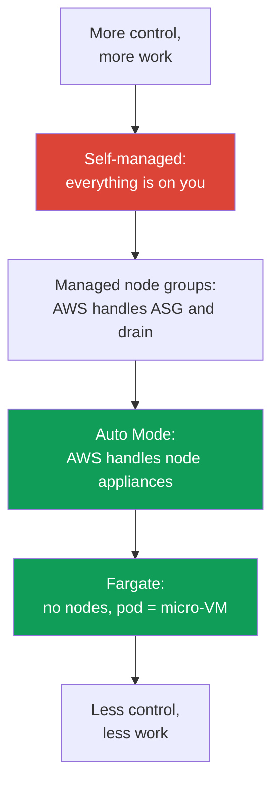
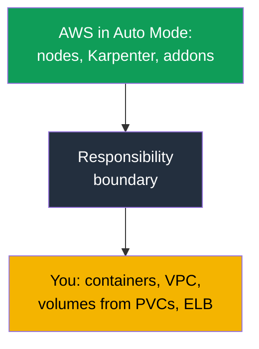

[Русская версия](ru.md) · [Versión en español](es.md) · [Version française](fr.md) · [Deutsche Version](de.md) · [ქართული ვერსია](ge.md) · [繁體中文版](tw.md) · [日本語版](jp.md)
# Chapter 9. Compute types: managed node groups, self-managed, Fargate, Auto Mode

> **What comes next.** AWS operates the control plane (Chapters 1-2), the cluster has been created (Chapter 4), and access
> and networking are configured (Chapters 5-8). The next question is what to run pods on: there are now four options,
> each with its own operating model. This chapter provides an overview of those four compute types and the main choice
> of Part 2 - EKS Auto Mode versus your own stack. AMIs, bootstrap, and launch templates are in Chapter 10,
> autoscaling and Karpenter in Chapters 11-12, Spot in Chapter 13, sizing and `max-pods` in Chapters 6 and 14,
> and Fargate in detail (profiles and limits) in Chapter 15.

## 9.1. “We chose the wrong compute type, and it surfaced late”

A team is migrating a service to EKS. The cluster is up, pods are running, and everything looks fine. Problems
arrive weeks later, when something needs to be done to a node but cannot be:

- the workload was placed on Fargate for “no nodes,” but security now requires a runtime agent installed as a
  DaemonSet - **DaemonSet is not supported on Fargate**, so there is nowhere to install the agent;
- EKS Auto Mode was chosen for minimal operations, but during an incident an engineer goes to a node to inspect
  kubelet logs and discovers that **SSH and SSM are closed by design**;
- self-managed nodes were assembled for full control, and now OS patches, kubelet upgrades, AMI rotation, and node
  registration are all monthly work nobody had budgeted for.

None of these mistakes is visible on day one. All three result from **choosing the compute type without discussing
its operating model**: who patches the OS, whether node access exists, whether an agent can be installed, who is
responsible for upgrades, and what it costs. This chapter provides a map so the choice is deliberate rather than
“we picked the first thing in the tutorial.”

## 9.2. Four compute types: who takes on what

In EKS, a pod can run on one of four compute types. All of them live in the same cluster and share one control plane;
they differ in **how much of the node layer AWS takes over** and how much remains with you.

| Type | What AWS takes on | What remains with you | When it fits |
|---|---|---|---|
| Managed node groups | ASG and launch template, command-initiated updates, drain | node OS, what runs on it, sizing | production baseline, familiar model |
| Self-managed nodes | nothing beyond EC2 | the complete node lifecycle | custom AMI, GPU, unusual requirements |
| Fargate | the entire node: pod = micro-VM | only the container and its configuration | isolation, batches of jobs, no nodes |
| EKS Auto Mode | node appliance, scaling, addons | containers, VPC, volumes from PVCs, ELB | minimal node operations |

It is useful to think of the difference as a responsibility scale: self-managed at the top, where everything is on
you; Auto Mode and Fargate at the bottom, where AWS handles almost the entire node; and managed node groups in the
middle.



The same four can be summarized by three selection criteria: what they cost (cost and management structure), how
isolated the workload is, and how much operational work remains with you.

| Type | Cost and management | Isolation | Operational overhead |
|---|---|---|---|
| Managed node groups | pay for EC2, ASG management at no surcharge | nodes are shared by pods | medium: OS and updates are on you |
| Self-managed nodes | EC2 only, orchestration by your own means | nodes are shared, isolation as you configure it | high: the entire node lifecycle |
| Fargate | pay for pod vCPU and memory, more expensive at high density | maximum: pod = micro-VM | low: no nodes |
| EKS Auto Mode | EC2 plus a management surcharge | nodes are shared, but are appliances | minimal: AWS handles nodes |

The following sections cover each type: precisely what AWS takes off your hands, what it does not, and when the type
is justified. Auto Mode is covered separately and in detail in Sections 9.6-9.8 because it is the main choice in
Part 2.

## 9.3. Managed node groups: an ASG managed by EKS

A managed node group is a group of EC2 instances that EKS creates and operates for you through an Auto Scaling group
and a launch template under its management. Nodes register with the cluster automatically, and a version update is a
single command: EKS brings up new nodes, successively marks old ones `SchedulingDisabled`, properly **drains** the
workload with PDBs considered, and terminates old instances.

```bash
aws eks create-nodegroup --cluster-name demo --nodegroup-name system \
  --node-role arn:aws:iam::111122223333:role/eksNodeRole \
  --subnets subnet-0abc subnet-0def --instance-types m5.large \
  --scaling-config minSize=2,maxSize=6,desiredSize=3
eksctl create nodegroup --cluster demo --name apps --managed --nodes 3
```

What AWS **takes on**: the ASG lifecycle, update orchestration with drain, health checks, and replacement of
unhealthy nodes. What **remains with you**: the operating system on the node and everything running on it, instance
type selection and sizing (Chapters 6 and 14), and deciding whether and when to update. A managed node group does not
remove responsibility for the node contents - it removes the manual work of operating the ASG and update sequence.

They fit as a **production baseline** when you do not need a custom image and want the familiar model of “we have
nodes and manage them, but without a manual ASG.” This is the type to start with if Auto Mode is unsuitable for some
reason.

## 9.4. Self-managed nodes: full control and full burden

Self-managed nodes are EC2 instances that you bring up yourself (with your own ASG, Terraform, and launch template)
and join to the cluster yourself. EKS knows only that these nodes registered; everything else is your responsibility.

What this gives you: **full control**. Your own AMI with the needed kernel and preinstalled packages, special
bootstrap (Chapter 10), specific GPU drivers, unusual instance types, and configurations unavailable in the managed
option. Permission to join such nodes is granted through an access entry of type `EC2_LINUX` or `EC2_WINDOWS`
(Chapter 5), rather than through the old `aws-auth`.

What this costs: **the full maintenance burden returns to you**. OS security patches, kubelet upgrades and keeping
its version synchronized with the control plane, AMI rotation, correct registration and drain during replacement, and
handling Spot interruptions yourself (Chapter 13). Everything managed node groups and Auto Mode do for you becomes
your work again here. Self-managed is chosen not because “more control is always better,” but when there is a
**specific requirement** that managed options do not cover.

## 9.5. Fargate: a pod as a micro-VM, no nodes at all

Fargate removes nodes from the picture entirely. You do not choose an instance type, scale groups, or patch the OS: a
pod with a matching Fargate profile (Chapter 15) runs on a dedicated **micro-VM**, with its own kernel, CPU, memory,
and network interface, none of which are shared with other pods.

```bash
aws eks create-fargate-profile --cluster-name demo --fargate-profile-name batch \
  --pod-execution-role-arn arn:aws:iam::111122223333:role/eksFargatePodRole \
  --subnets subnet-0abc subnet-0def \
  --selectors namespace=batch
```

The price of isolation is **limits**, as documented for Fargate. Fargate has no DaemonSets (an agent can only be a
sidecar in the pod itself), no privileged containers, no `HostPort` or `HostNetwork`, no GPU, and no node access,
because there is no node in the sense you are used to. Load balancers work only in `ip` target type mode, and pods run
only in private subnets. Of persistent storage, **only EFS** can be mounted (through EFS CSI); **EBS cannot be
attached to Fargate pods**. There is only ephemeral pod storage: 20 GiB by default, expanded not by adding a disk but
by requesting `ephemeral-storage` in the pod's `resources.requests`, up to 175 GiB (details and an example are in
Chapter 15). It fits isolated workloads, batches of jobs, and services that need neither node access nor node agents.
Profiles, limits, and the cost structure (payment for the pod's vCPU and memory) are covered in detail in Chapter 15.

## 9.6. EKS Auto Mode: nodes as appliances

EKS Auto Mode is a mode in which AWS manages not only the control plane but also the data infrastructure: nodes,
scaling, pod networking, load balancing, and ephemeral storage. Auto Mode nodes are designed **as appliances**,
black boxes that you do not open. According to the Auto Mode documentation, AWS takes on the following.

**The nodes themselves.** AWS chooses the AMI (Bottlerocket variants), enables **SELinux in enforcing mode** and a
**read-only root filesystem**, and closes direct node access: **no SSH or SSM**. A node has a **maximum lifetime of
21 days** (which you can reduce), after which it is automatically replaced with a fresh one - enforced rotation for
current patches.

**Scaling and events.** Karpenter runs inside the service: it watches non-schedulable pods, launches nodes for them,
and removes excess nodes during consolidation. Spot interruptions, health events, and EC2 scheduled maintenance are
handled **by the service, without your Node Termination Handler**.

**Built-in capabilities instead of addons.** Assigning IP addresses to pods, network policy, local DNS, GPU plugins
(NVIDIA, Neuron), EBS CSI, and ELB integration for Service and Ingress are built into the mode as core components.
You **do not need to install a Pod Identity agent** - it is already part of the mode.

```bash
aws eks describe-cluster --name demo --query 'cluster.computeConfig'
kubectl get nodes -L eks.amazonaws.com/compute-type -L karpenter.sh/nodepool
```

## 9.7. Auto Mode: updates, boundaries, and what cannot be edited

**Automatic updates.** Auto Mode keeps the cluster, nodes, and components current **while respecting your PDBs and
NodePool disruption budgets**. If a blocking PDB prevents an update for longer than the node's 21-day lifetime limit,
your intervention may be required. During a **cluster version rollback, Auto Mode nodes roll back before the control
plane**, subject to your disruption controls (the rollback order is in Chapter 39).

**What cannot be edited and what can.** Default NodePools and NodeClasses are configured by the service, and **cannot
be edited**. However, next to the defaults, you can **add your own** NodePools and NodeClasses: for specific instance
types, workload isolation, or ephemeral-storage settings.

This is the way to regain control of consolidation. Your own NodePool has a `disruption` section: `consolidationPolicy`
and `consolidateAfter` set how aggressively nodes are consolidated, while `budgets` limit the share of nodes disrupted
at once and let you define quiet hours on a schedule (the mechanics of these fields are in Chapter 12). The default
NodePools carry ready-made cost constraints: only C, M, and R families; on-demand only, without Spot; generations five
and later; but **without `limits`**. Your own NodePools **do not inherit** those constraints, so you must set limits
and allowed instance types manually, otherwise the pool grows without a ceiling.

**Node replacement has a short-term cost.** During an update or on expiration of the maximum lifetime, Auto Mode first
launches a new node, then drains pods from the old one with PDBs considered, so both run for some time. In a large
fleet, this produces periodic spikes in the bill. There are three ways to mitigate it: do not make disruption budgets
so strict that draining takes a long time, use smaller instances, and shorten the maximum node lifetime - replacements
will be more frequent but each one will cost less.

**Boundaries: what remains with you.** Auto Mode removes nodes, but not everything:

| Remains with you | Specifically |
|---|---|
| Containers | images, their security, requests and limits |
| Cluster and VPC | cluster configuration, subnets, security groups |
| Persistent volumes | volumes from PVCs are yours; Auto Mode operates only ephemeral storage |
| Load balancers | Service and Ingress as resources and their configuration are yours |

The key storage nuance: Auto Mode configures **ephemeral** node storage (volume type, size, encryption, and deletion
policy), while **persistent volumes from PVCs remain your responsibility** - their lifecycle, snapshots, and AZ binding
are covered in Chapter 23.



### Placement group: placing nodes on physical hardware

Another reason to create your own `NodeClass` is a **placement group**. The default class cannot be edited, so in Auto
Mode you can manage the physical placement of nodes only through your own class. The `cluster`, `partition`, and
`spread` strategies are covered in Chapter 0.4; here is how to enable one and what breaks as a result. The group
itself is created beforehand in EC2; the `NodeClass` only selects it by name or ID (the field appeared in Auto Mode in
May 2026):

```yaml
apiVersion: eks.amazonaws.com/v1
kind: NodeClass
metadata:
  name: latency-sensitive
spec:
  role: MyNodeRole
  subnetSelectorTerms:
    - tags: {Name: private-subnet}
  securityGroupSelectorTerms:
    - tags: {Name: eks-cluster-sg}
  placementGroupSelector:
    name: training-pg            # or id: pg-02465754522cda020
```

The mode-specific behavior starts next, and it is not obvious. Auto Mode replaces a node **launch first, then
delete**: the new one comes up before the old one is drained. The `spread` strategy has a ceiling of 7 running
instances per Availability Zone per group; when it is reached, launching a replacement fails, and the drifting node
**remains running indefinitely**: Auto Mode does not attempt to go beyond the group boundary. If all group AZs reach
the ceiling, no replacements happen at all. `consolidationPolicy: WhenEmpty` partly addresses this - such a node is
deleted after its pods are drained and frees a slot without a prior launch - but drift always goes through replacement,
so drift remains blocked. Together with the 21-day node lifetime, this means the promised automatic rotation does not
occur in such a group.

The other three pitfalls follow. A group with the `cluster` strategy becomes tied to the AZ of its first launched
instance, and if a NodePool permits several AZs, parallel launches during the first scale-out race: one wins and fixes
the AZ, while the others fail with a capacity error - so the AZ is fixed in the pool's `requirements`. A reference to
a nonexistent or deleted group means instances **do not launch at all**: the ID format is checked when the object is
accepted, but the existence of the group only at launch; if the group is deleted under running nodes, they are marked
as drifting and get stuck. Finally, consolidation can **move a pod out of the group** if the pod has no placement
constraints, so group membership is expressed with a `nodeSelector` using the
`eks.amazonaws.com/placement-group-id` label. `partition` has no additional limits.

## 9.8. Auto Mode versus your own stack: when to choose which

Auto Mode is neither “always better” nor a toy. It is a trade-off: you give up control over the node in exchange for
removing operational work, and pay a management surcharge on top of the EC2 cost. The table below presents the
requirements directly.

| Requirement | EKS Auto Mode | Your own stack (managed or self-managed) |
|---|---|---|
| Custom AMI or your own bootstrap | impossible, AWS selects the AMI | yes, your launch template (Chapter 10) |
| Node access for debugging or an agent | no SSH or SSM | available; install what you need |
| CNI other than VPC CNI (for example, Cilium) | no, networking is built in | yes, your own CNI (Chapter 8) |
| Fine-grained Karpenter control | do not edit default NodePools; own pools can use `disruption`; the controller itself is unavailable | the controller is yours: version, settings, any policies (Chapter 12) |
| Cost control | management surcharge applies | pay only for EC2 |
| Regulatory requirements for the image | AWS selects the image | your attested AMI |
| Minimum node operations | yes, that is its purpose | no, nodes are on you |

A short selection checklist: choose **your own stack** if at least one is true - you need a custom AMI or bootstrap,
node access for debugging or node agents, a CNI other than VPC CNI, control over the Karpenter controller itself rather
than only your own NodePools, costs are critical enough that the management surcharge is unacceptable, or the node
image is subject to regulatory requirements. If none applies and the goal is **minimum node operations**, Auto Mode
usually wins. The management surcharge is charged on top of EC2, so it is separate from the cost of the instances
themselves on the bill.

For analyzing the bill, this separation matters more than it seems. Auto Mode nodes are **managed instances**: you pay
the normal EC2 rate for the instance plus a separate EKS fee for managing it, and the second line item exists on its
own. The practical conclusion is that Reserved Instances and Savings Plans reduce only the EC2 portion; the management
fee **is not discounted**. When comparing Auto Mode with your own stack or Fargate, calculate this explicitly or the
comparison economics will be wrong (Chapters 43 and 15).

## 9.9. How the types combine in one cluster

Compute types are not mutually exclusive: a single cluster often runs several at once. A typical layout is a **system
pool on a managed node group** (CoreDNS, controllers, monitoring, so critical components do not depend on scaling),
with **applications on Auto Mode or Fargate**.

Workloads are separated using standard Kubernetes mechanisms. A taint is applied to the system pool so foreign pods
cannot land there, and system components get the corresponding toleration. Fargate attracts pods by namespace and
label through a Fargate profile (Chapter 15). Auto Mode schedules through its NodePools, where you can add your own
NodePool with the needed labels and taints.

```bash
kubectl get nodes -L eks.amazonaws.com/compute-type -L node.kubernetes.io/instance-type
kubectl get pods -A -o wide --field-selector spec.nodeName=<node>
```

The practical point is that critical system scaffolding stays on predictable nodes under your control, while elastic
applications go where operations are lower. This is deliberate mixing: labels and taints determine “what runs where,”
not accidental placement.

## 9.10. How this is used in production

- **Choose the compute type together with the operating model**, not from a tutorial: who patches the OS, whether node
  access exists, whether an agent can be installed, and who updates it and when.
- **Use managed node groups or Auto Mode by default**; take self-managed only for a specific requirement (custom AMI,
  GPU, bootstrap) that cannot otherwise be met.
- **Separate the system pool from applications** with taints and labels: critical scaffolding on nodes under your
  control, elastic workloads on Auto Mode or Fargate.
- **Check the Section 9.8 checklist before Auto Mode**: whether you need node access, a custom image, a CNI other than
  VPC CNI, or fine-grained Karpenter control - if so, assemble your own stack.
- **Include the Auto Mode surcharge in cost calculations** separately from EC2 and compare it with the operations work
  of your own stack rather than comparing “instances head-to-head.”

## 9.11. Mini-glossary

- **Managed node group** - an EC2 group managed by EKS: AWS operates the ASG and launch template and updates with
  command-initiated drain, but the OS and node contents are on you.
- **Self-managed node** - an EC2 instance that you bring up and join yourself (an access entry of type `EC2_LINUX`);
  the entire node lifecycle is on you.
- **Fargate** - running a pod on a dedicated micro-VM without nodes; no DaemonSet, privileges, `HostNetwork`, GPU, or
  node access. You pay for the pod's vCPU and memory.
- **EKS Auto Mode** - a mode where AWS manages node appliances (Bottlerocket, SELinux in enforcing mode, read-only
  root, no SSH or SSM, 21-day lifetime), Karpenter-based scaling, and built-in networking, DNS, EBS CSI, and ELB.
  Default NodePools and NodeClasses cannot be edited.
- **NodePool and NodeClass** - objects describing which nodes to launch and how; in Auto Mode defaults are immutable,
  while you can add your own (covered in detail in Chapter 12).
- **`placementGroupSelector`** - a field of your own `NodeClass` that selects a placement group by name or ID. You
  create the group yourself beforehand; a pod's group membership is set using a `nodeSelector` on the
  `eks.amazonaws.com/placement-group-id` label.

## 9.12. Chapter summary

- EKS has four compute types in one cluster: managed node groups, self-managed nodes, Fargate, and EKS Auto Mode. The
  difference is how much of the node layer AWS takes over and how much remains with you.
- Managed node groups operate the ASG and updates with drain, but OS and sizing are on you. Self-managed provides full
  control at the cost of the full burden of patches, upgrades, and registration.
- Fargate removes nodes: pod = micro-VM, but without DaemonSet, privileges, `HostNetwork`, GPU, or node access;
  details and profiles are in Chapter 15.
- Auto Mode gives AWS node appliances (Bottlerocket, SELinux in enforcing mode, read-only root, no SSH or SSM,
  21-day rotation), Karpenter and Spot-event handling, and built-in networking, DNS, EBS CSI, and ELB; no Pod Identity
  Agent is required. Do not edit default NodePools and NodeClasses; you can add your own. Containers, VPC, volumes
  from PVCs, and load balancers remain with you.
- The choice between Auto Mode and your own stack is decided by a checklist: custom AMI, node access, a CNI other than
  VPC CNI, fine-grained Karpenter control, cost control, and regulatory requirements favor your own stack; minimum
  node operations favors Auto Mode.
- The types combine: a system pool on managed nodes, applications on Auto Mode or Fargate, separated with taints and
  labels.

## 9.13. How this helps in real work

Choosing the compute type is one of the first cluster architecture decisions, and the price of getting it wrong is that
it surfaces late: there is nowhere to install an agent, you cannot access a node, or the maintenance burden is greater
than expected. By applying the Section 9.8 checklist at the start, you answer “who patches the OS,” “is node access
needed,” and “is the Auto Mode surcharge acceptable” before the workload reaches production, rather than during an
incident. On call, understanding which compute type is under a node immediately defines what can be done at all: where
`kubectl debug node` works and where the node cannot be opened in principle.

## 9.14. Self-check questions

1. How does a managed node group reduce work compared with self-managed, and what does it leave with you?
2. Why cannot a runtime agent be installed as a DaemonSet on Fargate, and how is this limitation worked around?
3. What precisely does AWS take on at the node level in EKS Auto Mode?
4. Why are SSH and SSM unavailable in Auto Mode, and how can a node problem be debugged then?
5. What does “21 days maximum node lifetime” mean, and why is it done?
6. What remains your responsibility in Auto Mode when it comes to storage and load balancers?
7. Name four situations in which your own stack wins over Auto Mode.
8. Why cannot default NodePools and NodeClasses in Auto Mode be edited, and what should be done instead?
9. How can a system pool and applications be separated across different compute types in one cluster?
10. What is the cost structure for Fargate, Auto Mode, and managed node groups?
11. What happens to Auto Mode nodes during a cluster version rollback, and why (Chapter 39)?
12. Why can Auto Mode nodes stop being replaced in a placement group with the `spread` strategy, and what does
    `consolidationPolicy: WhenEmpty` change here?

## Practice

This topic has two course labs. [Lab 101 - cluster as
code](../../labs/101/README.MD) shows the compute split in your own stack: system pods on Fargate, a workload on
Karpenter EC2 nodes, and scaling on demand. Run it with `TASK=101 make run_eks_task`.

[Lab 125 - EKS Auto Mode versus your own stack](../../labs/125/README.MD) builds the cluster in the opposite way:
without a Fargate profile, addons, or external Karpenter, using only the `compute_config.enabled` flag. In it, you work
with built-in NodePools, determine firsthand where the true management boundary lies (an edit to a built-in pool is
accepted, but the service owns the object), confirm there is no operator access to the node, and create your own
NodePool with explicit `limits`, which built-in pools do not have. Run it with `TASK=125 make run_eks_task`. Validation
in both labs uses the `check_result` command. Also related to this topic are [Lab 106 - EBS CSI: gp3, AZ binding,
expansion, snapshot](../../labs/106/README.MD) and [Lab 107 - EFS CSI: ReadWriteMany across Availability Zones](../../labs/107/README.MD),
where the cluster is assembled with the same managed node groups and Fargate described in this chapter.

In addition to the labs, compute types are visible in a live cluster. Start with what is already running: `kubectl get
nodes -L eks.amazonaws.com/compute-type -L node.kubernetes.io/instance-type` shows which nodes are of which type, and
`kubectl get pods -A -o wide` shows what runs where. For Auto Mode, inspect `aws eks describe-cluster --name <cluster>
--query 'cluster.computeConfig'`: the field says whether the mode is enabled.

Next, inspect node groups: `aws eks list-nodegroups --cluster-name <cluster>` and `aws eks
describe-nodegroup --cluster-name <cluster> --nodegroup-name <name>` show the scaling config and launch template of
managed groups. If Fargate exists, `aws eks list-fargate-profiles
--cluster-name <cluster>` and `describe-fargate-profile` provide selectors by namespace and label. Apply the Section
9.8 checklist to your workload and answer honestly which type fits it: whether you need node access, a custom image,
or node agents - then compare that answer with what is deployed now.

---
[Table of Contents](../README.md) · [Chapter 8](../08/en.md) · [Chapter 10](../10/en.md)
