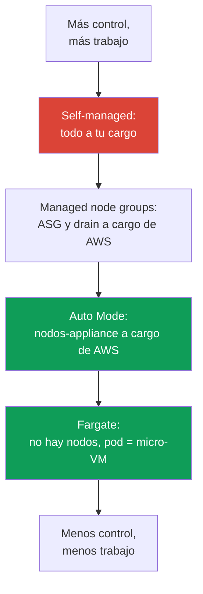
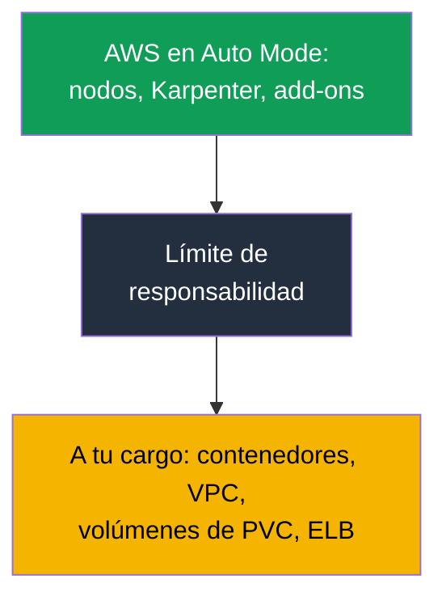

[Русская версия](ru.md) · [Eng version](en.md) · [Version française](fr.md) · [Deutsche Version](de.md) · [ქართული ვერსია](ge.md) · [繁體中文版](tw.md) · [日本語版](jp.md)
# Capítulo 9. Tipos de cómputo: managed node groups, self-managed, Fargate, Auto Mode

> **Qué sigue.** AWS opera el control plane (capítulos 1-2), el clúster está creado (capítulo 4), y
> el acceso y la red están configurados (capítulos 5-8). La siguiente pregunta es dónde ejecutar los
> pods: ahora hay cuatro opciones, y cada una tiene su propio modelo operativo. Este capítulo ofrece
> una visión general de estos cuatro tipos y de la decisión principal de la Parte 2: EKS Auto Mode
> frente a tu propia pila. AMI, bootstrap y launch template se tratan en el capítulo 10;
> autoescalado y Karpenter, en los capítulos 11-12; spot, en el capítulo 13; sizing y `max-pods`,
> en los capítulos 6 y 14; y Fargate en detalle (perfiles, limitaciones), en el capítulo 15.

## 9.1. «Elegimos el tipo de cómputo equivocado y salió a la luz tarde»

Un equipo migra un servicio a EKS. El clúster está levantado, los pods se ejecutan, todo parece
funcionar. Los problemas llegan semanas después, cuando hay que hacer algo con un nodo y no se
puede:

- la carga se colocó en Fargate por «no tener nodos», pero ahora seguridad exige instalar un
  agente de runtime como DaemonSet; Fargate **no admite DaemonSet**, así que no hay dónde
  instalar el agente;
- se eligió EKS Auto Mode para minimizar la operación, pero durante un incidente un ingeniero va
  al nodo para consultar los logs de kubelet y descubre que **SSH y SSM están cerrados by design**;
- se montaron nodos self-managed para tener control total, y ahora los parches del SO, las
  actualizaciones de kubelet, la rotación de AMI y el registro de nodos son trabajo mensual
  propio que nadie había presupuestado.

Ninguno de estos errores se ve el primer día. Los tres son consecuencia de **haber elegido el tipo
de cómputo sin acordar el modelo operativo**: quién aplica parches al SO, si hay acceso al nodo, si
se puede instalar un agente, quién es responsable de las actualizaciones y cuánto cuesta todo
esto. Este capítulo proporciona un mapa para que la elección sea consciente, no «tomamos lo
primero que apareció en el tutorial».

## 9.2. Cuatro tipos de cómputo: quién se hace cargo de qué

En EKS, un pod puede ejecutarse en uno de cuatro tipos de cómputo. Todos viven en el mismo
clúster y comparten un control plane; se diferencian por **cuánto de la capa del nodo asume AWS** y
cuánto queda a tu cargo.

| Tipo | Qué asume AWS | Qué queda a tu cargo | Cuándo conviene |
|---|---|---|---|
| Managed node groups | ASG y launch template, actualización bajo orden, drain | SO del nodo, lo que se ejecuta en él, sizing | producción básica, modelo conocido |
| Self-managed nodes | nada más allá de EC2 | todo el ciclo de vida del nodo | AMI personalizada, GPU, casos exóticos |
| Fargate | todo el nodo: pod = micro-VM | solo el contenedor y su configuración | aislamiento, lotes de jobs, sin nodos |
| EKS Auto Mode | nodo-appliance, escalado, add-ons | contenedor, VPC, volúmenes de PVC, ELB | mínima operación de nodos |

Es práctico considerar la diferencia como una escala de responsabilidad: arriba está self-managed,
donde todo queda a tu cargo; abajo, Auto Mode y Fargate, donde AWS asume casi por completo los
nodos; y managed node groups está en medio.



También es útil resumir los cuatro mediante tres criterios de elección: qué cuestan (estructura de
coste y gestión), cuánto se aísla la carga y cuánto trabajo operativo queda a tu cargo.

| Tipo | Coste y gestión | Aislamiento | Sobrecarga operativa |
|---|---|---|---|
| Managed node groups | se paga EC2, gestión de ASG sin recargo | los nodos son compartidos por los pods | media: SO y actualizaciones a tu cargo |
| Self-managed nodes | solo EC2, orquestación por cuenta propia | nodos compartidos, aislamiento según configuración | alta: todo el ciclo de vida del nodo |
| Fargate | se paga vCPU y memoria del pod, más caro con empaquetado denso | máximo: pod = micro-VM | baja: no hay nodos |
| EKS Auto Mode | EC2 más recargo por gestión | nodos compartidos, pero son un appliance | mínima: los nodos los gestiona AWS |

A continuación se explica cada tipo: qué asume exactamente AWS, qué no asume y cuándo se
justifica. Auto Mode se analiza por separado y en detalle en las secciones 9.6-9.8, porque es la
decisión principal de la Parte 2.

## 9.3. Managed node groups: ASG bajo gestión de EKS

Un managed node group es un grupo de instancias EC2 que EKS crea y mantiene por ti mediante un
Auto Scaling group y un launch template bajo su gestión. Los nodos se registran automáticamente
en el clúster, y la actualización de versión se realiza con un comando: EKS levanta nodos nuevos,
marca los antiguos como `SchedulingDisabled` uno por uno, hace correctamente **drain** de la carga
teniendo en cuenta los PDB y apaga las instancias antiguas.

```bash
aws eks create-nodegroup --cluster-name demo --nodegroup-name system \
  --node-role arn:aws:iam::111122223333:role/eksNodeRole \
  --subnets subnet-0abc subnet-0def --instance-types m5.large \
  --scaling-config minSize=2,maxSize=6,desiredSize=3
eksctl create nodegroup --cluster demo --name apps --managed --nodes 3
```

AWS **asume** el ciclo de vida del ASG, la orquestación de actualizaciones con drain, las
comprobaciones de estado y la sustitución de nodos no saludables. **Quedan a tu cargo** el sistema
operativo de los nodos y todo lo que se ejecuta en ellos, elegir el tipo de instancia y el sizing
(capítulos 6 y 14), y decidir actualizar y cuándo. Un managed node group no elimina la
responsabilidad por el contenido del nodo: elimina el trabajo manual con el ASG y la secuencia de
actualización.

Es adecuado como **elección básica para producción**, si no necesitas una imagen personalizada y
quieres el modelo conocido de «tenemos nodos, los gestionamos, pero sin ASG manual». Es el tipo por
el que se empieza si Auto Mode no resulta adecuado por alguna razón.

## 9.4. Self-managed nodes: control total y carga total

Los self-managed nodes son instancias EC2 que levantas tú mismo (con tu propio ASG, tu propio
Terraform, tu propio launch template) y que tú mismo unes al clúster. EKS solo sabe de estos nodos
que se registraron; todo lo demás es tu responsabilidad.

¿Qué aporta? **Control total**. Tu propia AMI con el kernel y los paquetes preinstalados necesarios,
un bootstrap especial (capítulo 10), drivers GPU específicos, tipos de instancia y configuraciones
exóticos que no están disponibles en la variante managed. El permiso para unir esos nodos se otorga
mediante un access entry de tipo `EC2_LINUX` o `EC2_WINDOWS` (capítulo 5), no mediante el antiguo
`aws-auth`.

¿Cuánto cuesta? **La carga total de mantenimiento vuelve a ti**. Parches de seguridad del SO,
actualización de kubelet y sincronización de su versión con el control plane, rotación de AMI,
registro correcto y drain durante la sustitución, y gestión de interrupciones spot por cuenta propia
(capítulo 13). Todo lo que managed node group y Auto Mode hacen por ti vuelve a ser tu trabajo aquí.
Self-managed no se adopta porque «en general da más control», sino cuando existe un **requisito
concreto** que las variantes managed no cubren.

## 9.5. Fargate: el pod como micro-VM, sin nodos en absoluto

Fargate elimina por completo los nodos de la ecuación. No eliges el tipo de instancia, no escalas
grupos ni aplicas parches al SO: un pod con un perfil de Fargate compatible (capítulo 15) se ejecuta
en una **micro-VM** dedicada, con su propio kernel, CPU, memoria e interfaz de red, no compartidos
con otros pods.

```bash
aws eks create-fargate-profile --cluster-name demo --fargate-profile-name batch \
  --pod-execution-role-arn arn:aws:iam::111122223333:role/eksFargatePodRole \
  --subnets subnet-0abc subnet-0def \
  --selectors namespace=batch
```

El precio del aislamiento son las **limitaciones**, verificadas en la documentación de Fargate. En
Fargate no hay DaemonSet (el agente solo puede ir como sidecar en el propio pod), no hay
contenedores privilegiados, no hay `HostPort` ni `HostNetwork`, no hay GPU, ni acceso al «nodo»,
porque no existe un nodo en el sentido habitual. Los balanceadores funcionan únicamente en modo
target-type `ip`, y los pods solo se ejecutan en subredes privadas. Del almacenamiento persistente
se monta **solo EFS** (mediante EFS CSI); **no se puede conectar EBS a pods de Fargate**, solo hay
almacenamiento efímero del pod: 20 GiB de forma predeterminada, y se amplía no con un disco sino
mediante una solicitud `ephemeral-storage` en `resources.requests` del pod, hasta 175 GiB (detalles
y ejemplo en el capítulo 15). Es apropiado para cargas aisladas, lotes de jobs y servicios donde no
se necesita acceso al nodo ni agentes a nivel de nodo. Los perfiles, las limitaciones y la estructura
de coste (pago por vCPU y memoria del propio pod) se tratan específicamente en el capítulo 15.

## 9.6. EKS Auto Mode: nodos como appliance

EKS Auto Mode es un modo en el que AWS gestiona no solo el control plane, sino también la
infraestructura de datos: nodos, escalado, red de pods, balanceo y almacenamiento efímero. Los
nodos de Auto Mode están diseñados **como un appliance**, una caja negra que no se abre. Según la
documentación de Auto Mode, AWS asume lo siguiente.

**Los propios nodos.** AWS elige la AMI (variantes de Bottlerocket), activa **SELinux en enforcing**
y un **read-only root filesystem**, y cierra el acceso directo al nodo: **ni SSH ni SSM**. El nodo
tiene una **vida máxima de 21 días** (puede reducirse), tras la cual se sustituye automáticamente
por uno nuevo, con rotación forzada para aplicar parches actualizados.

**Escalado y eventos.** Karpenter se ejecuta dentro del servicio: vigila los pods no planificables,
levanta nodos para ellos y elimina los sobrantes durante la consolidación. Las interrupciones spot,
eventos de estado y scheduled maintenance de EC2 son procesados por **el servicio, sin tu propio
Node Termination Handler**.

**Capacidades integradas en lugar de add-ons.** La asignación de IP a pods, network policy, DNS
local, plugins GPU (NVIDIA, Neuron), EBS CSI e integración con ELB para Service e Ingress están
integrados en el modo como componentes core. **No necesitas instalar el agente Pod Identity**: ya
forma parte del modo.

```bash
aws eks describe-cluster --name demo --query 'cluster.computeConfig'
kubectl get nodes -L eks.amazonaws.com/compute-type -L karpenter.sh/nodepool
```

## 9.7. Auto Mode: actualizaciones, límites y qué no se puede modificar

**Actualizaciones automáticas.** Auto Mode mantiene actualizados el clúster, los nodos y los
componentes, **respetando tus PDB y los NodePool disruption budgets**. Si un PDB que bloquea
impide la actualización durante más del límite de vida del nodo de 21 días, puede requerirse tu
intervención. Durante un **rollback de la versión del clúster, los nodos de Auto Mode se revierten
antes que el control plane**, teniendo en cuenta tus controles de disruption (el orden del rollback
se trata en el capítulo 39).

**Qué no se puede modificar y qué sí.** El servicio configura los NodePool y NodeClass
predeterminados, y **no puedes editarlos**. Pero junto a los predeterminados puedes **añadir los
tuyos** NodePool y NodeClass: para tipos de instancia concretos, aislamiento de cargas y ajustes de
almacenamiento efímero.

Esta es precisamente la forma de recuperar el control sobre la consolidación. En tu propio NodePool
está disponible la sección `disruption`: `consolidationPolicy` y `consolidateAfter` determinan con
qué agresividad se consolidan los nodos, mientras que `budgets` limita la proporción de nodos
interrumpidos simultáneamente y permite definir horas tranquilas programadas (la mecánica de estos
campos se trata en el capítulo 12). Los NodePool predeterminados traen restricciones de coste
preparadas: solo familias C, M y R, solo on-demand sin spot, generaciones desde la quinta, pero
**sin `limits`**. Tus propios NodePool **no heredan** esas restricciones, por lo que debes definir
manualmente sus límites y tipos de instancia permitidos; de otro modo el pool crecerá sin techo.

**La sustitución de nodos cuesta dinero temporalmente.** Durante una actualización o el vencimiento
de la vida útil, Auto Mode primero levanta un nodo nuevo y después drena los pods del antiguo,
teniendo en cuenta los PDB, y durante un tiempo ambos están activos. En un parque grande esto
produce picos periódicos en la factura. Se mitiga de tres maneras: no hacer los disruption budgets
tan estrictos que el drenaje se prolongue, mantener instancias más pequeñas y acortar la vida máxima
del nodo; las sustituciones serán más frecuentes, pero cada una será más barata.

**Límites: qué queda a tu cargo.** Auto Mode elimina los nodos, pero no todo:

| Queda a tu cargo | Qué exactamente |
|---|---|
| Contenedores | imágenes, su seguridad, requests y limits |
| Clúster y VPC | configuración del clúster, subredes, security groups |
| Volúmenes persistentes | los volúmenes de PVC son tuyos; Auto Mode solo gestiona el almacenamiento efímero |
| Balanceadores | Service e Ingress como recursos, y su configuración, son tuyos |

El matiz clave sobre almacenamiento es que Auto Mode configura el almacenamiento **efímero** del
nodo (tipo de volumen, tamaño, cifrado y política de eliminación), mientras que los **volúmenes
persistentes de PVC siguen siendo tu responsabilidad**: su ciclo de vida, snapshots y vínculo con
la AZ se tratan en el capítulo 23.



### Placement group: distribución de nodos en el hardware

Otra razón para crear tu propio `NodeClass` es un **placement group**. No puedes modificar la clase
predeterminada, por lo que solo puedes controlar la distribución física de nodos en Auto Mode
mediante uno propio. Las estrategias `cluster`, `partition` y `spread` se tratan en el capítulo 0.4;
aquí se explica cómo se activa y qué se rompe con ello. El grupo se crea previamente en EC2;
`NodeClass` solo lo selecciona, por nombre o por id (el campo apareció en Auto Mode en mayo de
2026):

```yaml
apiVersion: eks.amazonaws.com/v1
kind: NodeClass
metadata:
  name: latency-sensitive
spec:
  role: MyNodeRole
  subnetSelectorTerms:
    - tags: {Name: private-subnet}
  securityGroupSelectorTerms:
    - tags: {Name: eks-cluster-sg}
  placementGroupSelector:
    name: training-pg            # o id: pg-02465754522cda020
```

A partir de ahí comienza una particularidad del modo que no es obvia. Auto Mode reemplaza un nodo
**primero iniciando y luego eliminando**: el nuevo se levanta antes de drenar el antiguo. Con la
estrategia `spread`, el máximo es de 7 instancias en ejecución por zona y por grupo; al alcanzarlo,
el lanzamiento de la sustitución falla y el nodo con drift **permanece activo durante un tiempo
indefinido**: Auto Mode no intenta salir del grupo. Si todas las zonas del grupo llegan al máximo,
no habrá sustituciones. Se mitiga parcialmente con `consolidationPolicy: WhenEmpty`: dicho nodo se
elimina tras drenar los pods y libera un hueco sin lanzamiento previo; pero el drift siempre se
produce mediante sustitución, por lo que el drift continúa bloqueado. Junto con la vida útil del
nodo de 21 días, esto significa que la promesa de rotación automática no se cumple en ese grupo.

Los otros tres problemas. Un grupo con estrategia `cluster` queda vinculado a la zona de la primera
instancia iniciada y, si el NodePool permite varias zonas, los lanzamientos paralelos durante el
primer escalado compiten: uno gana y fija la zona, mientras los demás fallan con un error de
capacidad; por ello se fija la zona en los `requirements` del pool. Una referencia a un grupo
inexistente o eliminado implica que las instancias **no se inician en absoluto**: el formato del id
se valida al aceptar el objeto, pero la existencia del grupo solo se verifica en el inicio; si se
elimina el grupo bajo nodos en ejecución, estos se marcan con drift y se quedan atascados. Por
último, la consolidación puede **migrar un pod fuera del grupo** si este no tiene restricciones de
distribución, por lo que la pertenencia al grupo se expresa con `nodeSelector` mediante la etiqueta
`eks.amazonaws.com/placement-group-id`. `partition` no tiene restricciones adicionales.

## 9.8. Auto Mode frente a tu propia pila: cuándo usar cada uno

Auto Mode no es «siempre mejor» ni un juguete. Es un acuerdo: cedes el control del nodo a cambio
de eliminar la operación y pagas por ello un recargo de gestión sobre el coste de EC2. A continuación
se comparan las tareas directamente.

| Tarea | EKS Auto Mode | Pila propia (managed o self-managed) |
|---|---|---|
| AMI personalizada o bootstrap propio | no, AWS elige la AMI | sí, tu launch template (capítulo 10) |
| Acceso al nodo para depuración o agente | sin SSH ni SSM | sí, instala lo que necesites |
| CNI que no sea VPC CNI (por ejemplo, Cilium) | no, la red está integrada | sí, tu propio CNI (capítulo 8) |
| Control fino de Karpenter | no se editan los NodePool predeterminados; los propios pueden tener `disruption`; el controlador no es accesible | el controlador es tuyo: versión, ajustes, cualquier política (capítulo 12) |
| Control de costes | hay recargo de gestión | pagas solo EC2 |
| Requisitos regulatorios de la imagen | AWS elige la imagen | tu AMI certificada |
| Mínima operación de nodos | sí, ese es su propósito | no, los nodos son tu responsabilidad |

Checklist breve de elección: usa **tu propia pila** si se cumple al menos una condición: necesitas
una AMI personalizada o bootstrap, acceso al nodo para depuración o agentes a nivel de nodo, un CNI
que no sea VPC CNI, control del propio controlador Karpenter y no solo de tus NodePool, el coste es
tan crítico que el recargo de gestión no es aceptable, o la imagen del nodo está sujeta a requisitos
regulatorios. Si ninguna aplica y el objetivo es la **mínima operación de nodos**, Auto Mode suele
ganar. El recargo de gestión se cobra sobre EC2, por lo que aparece separado del coste de las
propias instancias en la factura.

Para analizar la factura, esta separación es más importante de lo que parece. Los nodos de Auto
Mode son **managed instances**: pagas la tarifa normal de EC2 por la instancia más una tarifa EKS
separada por gestionarla, y la segunda partida de la factura existe por sí sola. De ahí la conclusión
práctica: Reserved Instances y Savings Plans reducen solo la parte de EC2; la tarifa de gestión **no
recibe** descuento. Al comparar Auto Mode con tu propia pila o con Fargate hay que calcularlo de
forma explícita; de otro modo la economía de la comparación será incorrecta (capítulos 43 y 15).

## 9.9. Cómo se combinan los tipos en un mismo clúster

Los tipos de cómputo no se excluyen mutuamente: en un clúster suelen operar varios a la vez. Una
distribución típica es un **pool de sistema en un managed node group** (CoreDNS, controladores,
monitorización, para que lo crítico no dependa del escalado) y **aplicaciones en Auto Mode o
Fargate**.

Las cargas se separan mediante mecanismos estándar de Kubernetes. Al pool de sistema se le aplica
un taint para evitar que se programen pods ajenos, mientras que los componentes del sistema reciben
el toleration correspondiente. Fargate atrae pods por namespace y label mediante un perfil de
Fargate (capítulo 15). Auto Mode planifica según sus NodePool, donde puedes añadir tu propio
NodePool con los labels y taints necesarios.

```bash
kubectl get nodes -L eks.amazonaws.com/compute-type -L node.kubernetes.io/instance-type
kubectl get pods -A -o wide --field-selector spec.nodeName=<node>
```

El sentido práctico es mantener la infraestructura crítica de sistema en nodos predecibles que
controlas, y entregar las aplicaciones elásticas donde hay menos operación. La combinación es
consciente: los labels y taints determinan «qué se ejecuta dónde», no una colocación accidental.

## 9.10. Cómo se aplica esto en producción

- **El tipo de cómputo se elige junto con el modelo operativo**, no siguiendo un tutorial: quién
  aplica parches al SO, si hay acceso al nodo, si se puede instalar un agente, quién actualiza y
  cuándo.
- **De forma predeterminada, managed node groups o Auto Mode**; self-managed solo se adopta para
  un requisito concreto (AMI personalizada, GPU, bootstrap) que no se puede cubrir de otra forma.
- **El pool de sistema se separa de las aplicaciones** con taints y labels: la infraestructura
  crítica se aloja en nodos bajo tu control, las cargas elásticas en Auto Mode o Fargate.
- **Antes de usar Auto Mode se revisa el checklist 9.8**: si se necesita acceso al nodo, una imagen
  personalizada, un CNI que no sea VPC CNI o Karpenter detallado, se construye una pila propia.
- **El recargo de Auto Mode se incorpora al cálculo de costes** separado de EC2 y se compara con el
  trabajo de operar una pila propia, no se comparan «las instancias directamente».

## 9.11. Mini glosario

- **Managed node group**: grupo de EC2 gestionado por EKS: AWS gestiona el ASG y launch template,
  actualiza con drain bajo orden, pero el SO y el contenido del nodo quedan a tu cargo.
- **Self-managed node**: instancia EC2 que levantas y unes tú mismo (access entry de tipo
  `EC2_LINUX`); todo el ciclo de vida del nodo queda a tu cargo.
- **Fargate**: ejecución de un pod en una micro-VM dedicada sin nodos; sin DaemonSet, privilegios,
  `HostNetwork`, GPU ni acceso al nodo. Se paga por vCPU y memoria del pod.
- **EKS Auto Mode**: modo en el que AWS gestiona nodos-appliance (Bottlerocket, SELinux enforcing,
  root de solo lectura, sin SSH ni SSM, 21 días de vida), escalado con Karpenter y red, DNS, EBS
  CSI y ELB integrados. No se pueden modificar los NodePool y NodeClass predeterminados.
- **NodePool y NodeClass**: objetos que describen qué nodos levantar y cómo; en Auto Mode los
  predeterminados son inmutables, pero puedes añadir los tuyos (en detalle, capítulo 12).
- **`placementGroupSelector`**: campo de tu propio `NodeClass` que selecciona un placement group
  por nombre o id. Creas el grupo previamente; la pertenencia de un pod al grupo se define con
  `nodeSelector` mediante la etiqueta `eks.amazonaws.com/placement-group-id`.

## 9.12. Resumen del capítulo

- En EKS hay cuatro tipos de cómputo en un mismo clúster: managed node groups, self-managed nodes,
  Fargate y EKS Auto Mode. La diferencia es cuánto de la capa del nodo asume AWS y cuánto queda a
  tu cargo.
- Managed node groups gestionan el ASG y la actualización con drain, pero el SO y el sizing quedan
  a tu cargo. Self-managed proporciona control total al precio de asumir por completo parches,
  actualizaciones y registro.
- Fargate elimina los nodos: pod = micro-VM, pero sin DaemonSet, privilegios, `HostNetwork`, GPU
  ni acceso al nodo; los detalles y perfiles se tratan en el capítulo 15.
- Auto Mode entrega a AWS los nodos-appliance (Bottlerocket, SELinux enforcing, root de solo
  lectura, sin SSH ni SSM, rotación en 21 días), Karpenter y la gestión de eventos spot, así como
  red, DNS, EBS CSI y ELB integrados; no se necesita Pod Identity Agent. No se editan los NodePool
  y NodeClass predeterminados, pero puedes añadir los tuyos. A tu cargo quedan los contenedores,
  la VPC, los volúmenes de PVC y los balanceadores.
- La elección entre Auto Mode y tu propia pila se resuelve mediante un checklist: AMI personalizada,
  acceso al nodo, CNI distinto de VPC, Karpenter detallado, control de costes y requisitos
  regulatorios favorecen una pila propia; la mínima operación de nodos favorece Auto Mode.
- Los tipos se combinan: pool de sistema en managed nodes, aplicaciones en Auto Mode o Fargate,
  separación mediante taints y labels.

## 9.13. Cómo resultará útil en el trabajo real

Elegir el tipo de cómputo es una de las primeras decisiones arquitectónicas del clúster, y el coste
del error es que aparece tarde: no hay dónde instalar un agente, no se puede acceder al nodo, la
carga de mantenimiento resultó mayor de lo esperado. Al revisar el checklist 9.8 al inicio,
respondes «quién aplica parches al SO», «se necesita acceso al nodo» y «el recargo de Auto Mode es
aceptable» antes de que la carga entre en producción, no en medio de un incidente. Durante la
guardia, entender qué tipo hay bajo cada nodo define de inmediato qué se puede hacer: dónde usar
`kubectl debug node` y dónde el nodo no se puede abrir en absoluto.

## 9.14. Preguntas de autoevaluación

1. ¿En qué reduce un managed node group la carga frente a self-managed, y qué te deja a cargo?
2. ¿Por qué no se puede instalar un agente de runtime como DaemonSet en Fargate y cómo se sortea
   esta limitación?
3. ¿Qué asume exactamente AWS en EKS Auto Mode a nivel del propio nodo?
4. ¿Por qué no hay SSH ni SSM en Auto Mode y cómo se depura entonces un problema en el nodo?
5. ¿Qué significa «21 días de vida máxima del nodo» y para qué se hace?
6. ¿Qué sigue siendo tu responsabilidad en Auto Mode con respecto a almacenamiento y balanceadores?
7. Menciona cuatro situaciones en las que una pila propia gana a Auto Mode.
8. ¿Por qué no se pueden modificar los NodePool y NodeClass predeterminados en Auto Mode y qué se
   hace en su lugar?
9. ¿Cómo se separan en un mismo clúster el pool de sistema y las aplicaciones entre distintos tipos
   de cómputo?
10. ¿Cómo se estructura el coste de Fargate, Auto Mode y managed node groups?
11. ¿Qué ocurre con los nodos de Auto Mode durante un rollback de la versión del clúster y por qué
    (capítulo 39)?
12. ¿Por qué los nodos de Auto Mode pueden dejar de sustituirse en un placement group con estrategia
    `spread`, y qué cambia `consolidationPolicy: WhenEmpty`?

## Práctica

Este tema incluye dos laboratorios del curso. [Laboratorio 101: clúster como
código](../../labs/101/README_ES.MD) muestra la separación de cómputo en una pila propia: pods de
sistema en Fargate, carga de trabajo en nodos EC2 con Karpenter y escalado según demanda. Se inicia
con `TASK=101 make run_eks_task`.

[Laboratorio 125: EKS Auto Mode frente a tu propia pila](../../labs/125/README_ES.MD) construye el
clúster de la forma opuesta: sin perfil de Fargate, add-ons ni Karpenter externo, con un único flag
`compute_config.enabled`. En él trabajas con los NodePool integrados, descubres manualmente dónde
pasa el límite real de capacidad de gestión (la modificación del pool integrado se acepta, pero el
servicio posee el objeto), confirmas que no hay acceso del operador al nodo y creas tu propio
NodePool con `limits` explícitos, que los pools integrados no tienen. Se inicia con
`TASK=125 make run_eks_task`. La comprobación en ambos laboratorios se realiza con el comando
`check_result`. También corresponden a este tema el [laboratorio 106: EBS CSI: gp3, vínculo con AZ,
ampliación, snapshot](../../labs/106/README_ES.MD) y el [laboratorio 107: EFS CSI: ReadWriteMany
entre zonas de disponibilidad](../../labs/107/README_ES.MD), donde el clúster se construye con los
mismos managed node groups y Fargate descritos en este capítulo.

Además del laboratorio, los tipos de cómputo se ven en un clúster activo. Comienza por lo que ya se
ejecuta: `kubectl get nodes -L eks.amazonaws.com/compute-type -L
node.kubernetes.io/instance-type` mostrará qué nodos son de cada tipo, y `kubectl get pods -A -o
wide` mostrará qué se ejecuta dónde. Para Auto Mode, consulta `aws eks describe-cluster --name
<cluster> --query 'cluster.computeConfig'`: el campo indica si el modo está activado.

Después consulta los grupos de nodos: `aws eks list-nodegroups --cluster-name <cluster>` y `aws eks
describe-nodegroup --cluster-name <cluster> --nodegroup-name <name>` mostrarán el scaling-config y
el launch template del grupo managed. Si hay Fargate, `aws eks list-fargate-profiles
--cluster-name <cluster>` y `describe-fargate-profile` proporcionarán los selectores por namespace
y label. Recorre el checklist 9.8 aplicado a tu propia carga y responde con sinceridad qué tipo le
conviene: si necesita acceso al nodo, una imagen personalizada o agentes a nivel de nodo, y compara
la respuesta con lo desplegado actualmente.

---
[Índice](../README_ES.md) · [Capítulo 8](../08/es.md) · [Capítulo 10](../10/es.md)
