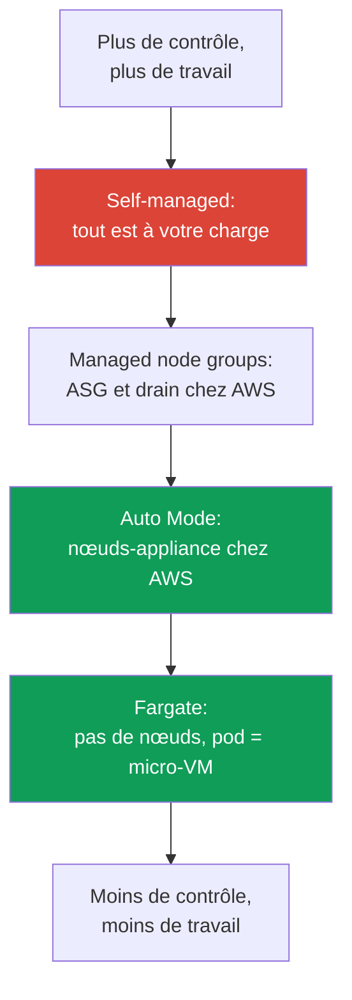
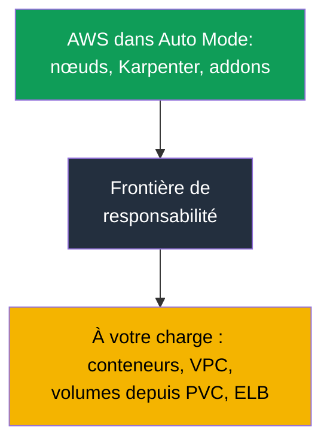

[Русская версия](ru.md) · [Eng version](en.md) · [Versión en español](es.md) · [Deutsche Version](de.md) · [ქართული ვერსია](ge.md) · [繁體中文版](tw.md) · [日本語版](jp.md)
# Chapitre 9. Types de calcul : managed node groups, self-managed, Fargate, Auto Mode

> **La suite.** AWS gère le control plane (chapitres 1-2), le cluster est créé (chapitre 4), et
> l’accès ainsi que le réseau sont configurés (chapitres 5-8). La question suivante est : sur
> quoi exécuter les pods ? Il existe désormais quatre options, chacune avec son propre modèle
> d’exploitation. Ce chapitre présente ces quatre types et le choix central de la partie 2 :
> EKS Auto Mode contre votre propre stack. AMI, bootstrap et launch template : chapitre 10 ;
> autoscaling et Karpenter : chapitres 11-12 ; spot : chapitre 13 ; dimensionnement et
> `max-pods` : chapitres 6 et 14 ; Fargate en détail (profils, limites) : chapitre 15.

## 9.1. « Nous avons choisi le mauvais type de calcul, et cela est apparu trop tard »

Une équipe migre un service vers EKS. Le cluster est lancé, les pods s’exécutent, tout semble
fonctionner. Les problèmes arrivent plusieurs semaines plus tard, lorsqu’il faut intervenir sur
un nœud et que cela devient impossible :

- la charge a été placée sur Fargate pour « ne pas avoir de nœuds », mais la sécurité impose
  maintenant d’installer un agent runtime en DaemonSet : sur Fargate, les **DaemonSet ne sont
  pas pris en charge**, il n’y a nulle part où installer l’agent ;
- EKS Auto Mode a été choisi pour réduire l’exploitation au minimum, puis, lors d’un incident,
  un ingénieur tente d’aller sur le nœud consulter les logs kubelet et découvre que **SSH et SSM
  sont fermés par conception** ;
- des nœuds self-managed ont été assemblés pour disposer d’un contrôle total, et les correctifs
  de l’OS, les mises à jour kubelet, la rotation des AMI et l’enregistrement des nœuds sont
  désormais une charge mensuelle que personne n’avait anticipée.

Aucune de ces erreurs n’est visible le premier jour. Elles résultent toutes du fait que le
**type de calcul a été choisi sans expliciter le modèle d’exploitation** : qui applique les
correctifs à l’OS, y a-t-il un accès au nœud, peut-on installer un agent, qui est responsable des
mises à jour et quel en est le coût ? Ce chapitre fournit une carte pour que le choix soit
conscient, et non pas « on a pris ce qui apparaissait en premier dans le tutoriel ».

## 9.2. Les quatre types de calcul : qui prend quoi en charge

Dans EKS, un pod peut être exécuté sur l’un des quatre types de calcul. Ils vivent tous dans le
même cluster et partagent un même control plane ; ils diffèrent par la part de la couche nœud que
**AWS prend en charge** et celle qui vous reste.

| Type | Ce qu’AWS prend en charge | Ce qui vous reste | Quand c’est approprié |
|---|---|---|---|
| Managed node groups | ASG et launch template, mise à jour sur commande, drain | OS du nœud, ce qui y est installé, dimensionnement | production de base, modèle familier |
| Self-managed nodes | rien au-delà d’EC2 | cycle de vie complet du nœud | AMI personnalisé, GPU, cas exotiques |
| Fargate | le nœud entier : pod = micro-VM | uniquement le conteneur et sa configuration | isolation, lots de jobs, sans nœuds |
| EKS Auto Mode | nœud-appliance, mise à l’échelle, addons | conteneur, VPC, volumes depuis PVC, ELB | exploitation minimale des nœuds |

Il est pratique de voir cette différence comme une échelle de responsabilité : en haut,
self-managed, où tout vous incombe ; en bas, Auto Mode et Fargate, où AWS prend presque
entièrement les nœuds en charge ; les managed node groups se situent au milieu.



On peut également comparer ces quatre options selon trois critères : leur coût (structure du coût
et de la gestion), le niveau d’isolation de la charge et la quantité de travail opérationnel qui
vous reste.

| Type | Coût et gestion | Isolation | Surcharge opérationnelle |
|---|---|---|---|
| Managed node groups | paiement EC2, gestion de l’ASG sans surcoût | nœuds partagés entre les pods | moyenne : OS et mises à jour à votre charge |
| Self-managed nodes | EC2 seulement, orchestration par vos moyens | nœuds partagés, isolation selon votre configuration | élevée : cycle de vie complet du nœud |
| Fargate | paiement des vCPU et de la mémoire du pod, plus cher avec une forte densité | maximale : pod = micro-VM | faible : pas de nœuds |
| EKS Auto Mode | EC2 plus surcoût de gestion | nœuds partagés, mais appliance | minimale : nœuds gérés par AWS |

La suite présente pour chaque type ce qu’AWS vous retire exactement, ce qu’il ne vous retire pas
et dans quel cas le type est justifié. Auto Mode est traité séparément et en détail dans les
sections 9.6-9.8, car il s’agit du choix central de la partie 2.

## 9.3. Managed node groups : un ASG géré par EKS

Une managed node group est un groupe d’instances EC2 qu’EKS crée et exploite pour vous via un
Auto Scaling group et un launch template sous son contrôle. Les nœuds s’enregistrent
automatiquement dans le cluster, et la mise à jour de version s’effectue avec une seule commande :
EKS lance de nouveaux nœuds, marque tour à tour les anciens `SchedulingDisabled`, **drain**
correctement les charges en tenant compte des PDB, puis arrête les anciennes instances.

```bash
aws eks create-nodegroup --cluster-name demo --nodegroup-name system \
  --node-role arn:aws:iam::111122223333:role/eksNodeRole \
  --subnets subnet-0abc subnet-0def --instance-types m5.large \
  --scaling-config minSize=2,maxSize=6,desiredSize=3
eksctl create nodegroup --cluster demo --name apps --managed --nodes 3
```

Ce qu’AWS **prend en charge** : le cycle de vie de l’ASG, l’orchestration des mises à jour avec
drain, les contrôles d’état et le remplacement des nœuds défectueux. Ce qui **vous reste** : le
système d’exploitation du nœud et tout ce qui s’y exécute, le choix du type d’instance et le
dimensionnement (chapitres 6 et 14), la décision de mettre à jour et son calendrier. Une managed
node group ne supprime pas votre responsabilité sur le contenu du nœud ; elle enlève la gestion
manuelle de l’ASG et de l’ordre des mises à jour.

Elles conviennent comme **choix de base pour la production**, si vous n’avez pas besoin d’une
image personnalisée et souhaitez le modèle familier « nous avons des nœuds, nous les gérons,
mais sans ASG manuel ». C’est le type par lequel on commence si Auto Mode ne convient pas pour
une raison quelconque.

## 9.4. Self-managed nodes : contrôle total et charge totale

Les self-managed nodes sont des instances EC2 que vous lancez vous-même (avec votre propre ASG,
votre Terraform, votre launch template) et que vous joignez vous-même au cluster. EKS ne sait de
ces nœuds que ce qu’ils ont enregistré ; tout le reste relève de votre périmètre.

Cela apporte un **contrôle total** : votre AMI avec le noyau et les paquets préinstallés requis,
un bootstrap particulier (chapitre 10), des pilotes GPU spécifiques, des types d’instances et
configurations exotiques qui ne figurent pas dans l’option managed. Le droit de joindre ces nœuds
est accordé via une access entry de type `EC2_LINUX` ou `EC2_WINDOWS` (chapitre 5), et non via
l’ancien `aws-auth`.

Le coût est que la **charge complète de maintenance vous revient**. Correctifs de sécurité de
l’OS, mise à jour de kubelet et synchronisation de sa version avec le control plane, rotation des
AMI, enregistrement et drain corrects lors du remplacement, traitement des interruptions spot par
vos propres moyens (chapitre 13). Tout ce que managed node groups et Auto Mode font pour vous
redevient ici votre travail. On ne choisit pas self-managed parce que « cela donne davantage de
contrôle en général », mais lorsqu’il existe une **exigence précise** que les options managed ne
couvrent pas.

## 9.5. Fargate : le pod comme micro-VM, sans nœuds du tout

Fargate retire totalement les nœuds de l’équation. Vous ne choisissez pas le type d’instance, ne
mettez pas à l’échelle des groupes et n’appliquez pas de correctifs à l’OS : un pod correspondant à
un profil Fargate (chapitre 15) s’exécute sur une **micro-VM** dédiée, avec son propre noyau,
CPU, mémoire et interface réseau, qui ne sont pas partagés avec d’autres pods.

```bash
aws eks create-fargate-profile --cluster-name demo --fargate-profile-name batch \
  --pod-execution-role-arn arn:aws:iam::111122223333:role/eksFargatePodRole \
  --subnets subnet-0abc subnet-0def \
  --selectors namespace=batch
```

Le prix de cette isolation est constitué de **limitations**, vérifiées dans la documentation
Fargate. Fargate ne prend pas en charge les DaemonSet (un agent doit être un sidecar dans le pod
lui-même), ni les conteneurs privilégiés, `HostPort`, `HostNetwork`, les GPU ou l’accès au
« nœud », car il n’existe pas de nœud au sens où vous l’entendez. Les load balancers fonctionnent
uniquement avec target-type `ip`, et les pods ne s’exécutent que dans des sous-réseaux privés. Du
stockage persistant, **seul EFS** se monte (via EFS CSI) ; **il est impossible d’attacher EBS aux
pods Fargate**. Il n’existe qu’un stockage éphémère du pod : 20 GiB par défaut, extensible non
pas par un disque, mais avec la requête `ephemeral-storage` dans `resources.requests` du pod,
jusqu’à 175 GiB (détails et exemple : chapitre 15). Fargate convient aux charges isolées, aux
lots de jobs et aux services qui ne nécessitent ni accès au nœud ni agents au niveau du nœud.
Les profils, limites et la structure des coûts (paiement des vCPU et de la mémoire du pod lui-même)
sont présentés en détail au chapitre 15.

## 9.6. EKS Auto Mode : les nœuds comme appliance

EKS Auto Mode est un mode dans lequel AWS gère non seulement le control plane, mais aussi
l’infrastructure de données : nœuds, mise à l’échelle, réseau des pods, équilibrage de charge et
stockage éphémère. Les nœuds d’Auto Mode sont conçus **comme une appliance**, une boîte noire
que vous n’ouvrez pas. Selon la documentation Auto Mode, AWS prend en charge les éléments
suivants.

**Les nœuds eux-mêmes.** AWS choisit l’AMI (variantes Bottlerocket), active **SELinux en mode
enforcing** et un **read-only root filesystem**, et ferme l’accès direct au nœud : **ni SSH ni
SSM**. Le nœud a une **durée de vie maximale de 21 jours** (qui peut être réduite), après quoi il
est automatiquement remplacé par un nœud récent : une rotation forcée pour garantir des correctifs
à jour.

**Mise à l’échelle et événements.** Karpenter s’exécute au sein du service : il surveille les
pods non schedulable, lance des nœuds pour eux et supprime les nœuds superflus lors de la
consolidation. Les interruptions spot, événements de santé et scheduled maintenance EC2 sont
traités **par le service, sans votre Node Termination Handler**.

**Fonctionnalités intégrées plutôt que des addons.** L’attribution d’IP aux pods, les network
policy, le DNS local, les plugins GPU (NVIDIA, Neuron), EBS CSI et l’intégration à ELB pour
Service et Ingress sont intégrés au mode en tant que composants core. Il est inutile d’installer
l’agent **Pod Identity** : il fait déjà partie du mode.

```bash
aws eks describe-cluster --name demo --query 'cluster.computeConfig'
kubectl get nodes -L eks.amazonaws.com/compute-type -L karpenter.sh/nodepool
```

## 9.7. Auto Mode : mises à jour, limites et ce qu’on ne peut pas modifier

**Mises à jour automatiques.** Auto Mode maintient le cluster, les nœuds et les composants à
jour, **en respectant vos PDB et les NodePool disruption budgets**. Si un PDB bloquant empêche
une mise à jour au-delà de la limite de vie de 21 jours du nœud, votre intervention peut être
nécessaire. Lors d’un **rollback de la version du cluster, les nœuds Auto Mode sont restaurés
avant le control plane**, en tenant compte de vos contrôles de disruption (ordre du rollback :
chapitre 39).

**Ce qu’on ne peut pas modifier et ce qui est possible.** Les NodePool et NodeClass par défaut
sont configurés par le service, et **vous ne pouvez pas les modifier**. En revanche, à côté des
valeurs par défaut, vous pouvez **ajouter les vôtres** : NodePool et NodeClass destinés à des
types d’instances précis, à l’isolation de charges ou aux réglages du stockage éphémère.

C’est ainsi que vous pouvez reprendre le contrôle de la consolidation. Dans votre propre NodePool,
la section `disruption` est disponible : `consolidationPolicy` et `consolidateAfter` définissent
l’agressivité de la consolidation des nœuds, tandis que `budgets` limite la proportion de nœuds
interrompus simultanément et permet de prévoir des heures calmes selon un calendrier (mécanique de
ces champs : chapitre 12). Les NodePool par défaut comportent toutefois des restrictions de coût
prêtes à l’emploi : familles C, M et R uniquement, seulement on-demand sans spot, générations à
partir de la cinquième, mais **sans `limits`**. Vos propres NodePool **n’héritent pas** de ces
restrictions ; vous devez donc y définir vous-même les limites et les types d’instances autorisés,
sinon le pool grandit sans plafond.

**Le remplacement des nœuds coûte de l’argent à l’instant donné.** Lors d’une mise à jour ou de
l’expiration de la durée de vie, Auto Mode lance d’abord un nouveau nœud, puis évacue les pods de
l’ancien en tenant compte des PDB ; les deux fonctionnent donc pendant un certain temps. Dans un
grand parc, cela produit des pics périodiques sur la facture. Trois moyens permettent d’atténuer
cela : ne pas rendre les disruption budgets si stricts que l’évacuation s’éternise, conserver des
instances plus petites et réduire la durée de vie maximale du nœud : les remplacements seront plus
fréquents, mais chacun sera moins coûteux.

**Limites : ce qui vous reste.** Auto Mode retire les nœuds, mais pas tout :

| Ce qui vous reste | En détail |
|---|---|
| Conteneurs | images, leur sécurité, requests et limits |
| Cluster et VPC | configuration du cluster, sous-réseaux, security groups |
| Volumes persistants | les volumes issus de PVC sont à vous ; Auto Mode ne gère que le stockage éphémère |
| Load balancers | Service et Ingress comme ressources, ainsi que leur configuration, sont à vous |

La nuance essentielle concernant le stockage : Auto Mode configure le stockage **éphémère** du
nœud (type de volume, taille, chiffrement, politique de suppression), tandis que les **volumes
persistants issus de PVC restent dans votre périmètre** : leur cycle de vie, snapshots et lien avec
l’AZ sont traités au chapitre 23.



### Placement group : répartition des nœuds sur le matériel

Une autre raison de créer votre propre `NodeClass` est le **placement group**. La classe par
défaut ne peut pas être modifiée ; on ne peut donc gérer la répartition physique des nœuds dans
Auto Mode qu’au moyen de sa propre classe. Les stratégies `cluster`, `partition` et `spread` sont
présentées au chapitre 0.4 ; nous voyons ici comment les activer et ce qui se dégrade alors. Le
groupe lui-même est créé à l’avance dans EC2 ; `NodeClass` le sélectionne uniquement, par nom ou
par id (ce champ est apparu dans Auto Mode en mai 2026) :

```yaml
apiVersion: eks.amazonaws.com/v1
kind: NodeClass
metadata:
  name: latency-sensitive
spec:
  role: MyNodeRole
  subnetSelectorTerms:
    - tags: {Name: private-subnet}
  securityGroupSelectorTerms:
    - tags: {Name: eks-cluster-sg}
  placementGroupSelector:
    name: training-pg            # ou id: pg-02465754522cda020
```

La spécificité du mode commence ensuite, et elle n’est pas évidente. Auto Mode remplace un nœud
**en lançant d’abord, puis en supprimant** : le nouveau nœud démarre avant l’évacuation de
l’ancien. Avec la stratégie `spread`, le plafond est de 7 instances actives par zone et par
groupe ; lorsqu’il est atteint, le lancement du remplacement échoue, et le nœud en dérive
**continue de fonctionner pour une durée indéterminée** : Auto Mode ne tente pas de sortir des
limites du groupe. Si toutes les zones du groupe atteignent le plafond, il n’y aura plus de
remplacements. `consolidationPolicy: WhenEmpty` remédie partiellement au problème : un tel nœud
est supprimé après l’évacuation de ses pods et libère un emplacement sans lancement préalable ;
mais la dérive passe toujours par un remplacement, elle reste donc bloquée. Avec la durée de vie de
21 jours du nœud, cela signifie que la promesse de rotation automatique n’est pas tenue dans un
tel groupe.

Les trois autres pièges sont les suivants. Un groupe dont la stratégie est `cluster` se lie à la
zone de la première instance lancée ; si le NodePool autorise plusieurs zones, les lancements
parallèles lors de la première mise à l’échelle entrent en concurrence : l’un gagne et fixe la zone,
les autres échouent par erreur de capacité ; il faut donc fixer la zone dans les `requirements` du
pool. Une référence vers un groupe inexistant ou supprimé signifie que les instances **ne se
lancent pas du tout** : le format de l’id est vérifié lors de l’acceptation de l’objet, mais
l’existence du groupe seulement au lancement ; si vous supprimez le groupe sous des nœuds actifs,
ceux-ci sont marqués en dérive et restent bloqués. Enfin, la consolidation peut **déplacer un pod
hors du groupe** si le pod n’a pas de contraintes de répartition ; l’appartenance au groupe
s’exprime donc au moyen du `nodeSelector` du label
`eks.amazonaws.com/placement-group-id`. `partition` ne présente pas de restrictions
supplémentaires.

## 9.8. Auto Mode contre votre propre stack : quand choisir quoi

Auto Mode n’est ni « toujours meilleur », ni un jouet. C’est un compromis : vous cédez le contrôle
du nœud en échange de la suppression de son exploitation, et payez pour cela un surcoût de gestion
au-delà du coût EC2. Voici les situations directement comparées.

| Besoin | EKS Auto Mode | Votre stack (managed ou self-managed) |
|---|---|---|
| AMI personnalisé ou votre bootstrap | impossible, AWS choisit l’AMI | oui, votre launch template (chapitre 10) |
| Accès au nœud pour débogage ou agent | ni SSH ni SSM | oui, installez ce dont vous avez besoin |
| CNI autre que VPC CNI (par exemple Cilium) | non, le réseau est intégré | oui, votre CNI (chapitre 8) |
| Contrôle fin de Karpenter | NodePool par défaut non modifiables, les vôtres avec `disruption` sont possibles ; le contrôleur lui-même est inaccessible | votre contrôleur : version, réglages, toutes les politiques (chapitre 12) |
| Contrôle des coûts | surcoût de gestion | vous ne payez qu’EC2 |
| Exigences réglementaires sur l’image | AWS choisit l’image | votre AMI certifiée |
| Exploitation minimale des nœuds | oui, c’est sa raison d’être | non, les nœuds vous incombent |

Checklist courte : optez pour **votre propre stack** si au moins l’un des éléments suivants est
vrai : vous avez besoin d’un AMI ou bootstrap personnalisé, d’un accès au nœud pour le débogage ou
les agents de nœud, d’un CNI autre que VPC CNI, d’un contrôle sur le contrôleur Karpenter lui-même
et pas seulement sur vos NodePool, le coût est suffisamment critique pour que le surcoût de gestion
ne passe pas, ou l’image du nœud est soumise à des exigences réglementaires. Si aucun de ces cas ne
s’applique et que l’objectif est une **exploitation minimale des nœuds**, Auto Mode l’emporte
généralement. Le surcoût de gestion s’ajoute à EC2 ; il est donc séparé du coût des instances elles-
mêmes sur la facture.

Pour analyser la facture, cette séparation est plus importante qu’il n’y paraît. Les nœuds Auto
Mode sont des **managed instances** : vous payez le tarif EC2 habituel de l’instance, plus des
frais EKS distincts pour sa gestion ; le second poste existe indépendamment sur la facture. La
conséquence pratique est que Reserved Instances et Savings Plans ne réduisent que la part EC2 ; les
frais de gestion **ne bénéficient pas** de la remise. Lors de la comparaison d’Auto Mode avec votre
propre stack ou Fargate, il faut le calculer explicitement, sinon l’économie de la comparaison sera
fausse (chapitres 43 et 15).

## 9.9. Comment les types se combinent dans un même cluster

Les types de calcul ne sont pas mutuellement exclusifs : plusieurs fonctionnent souvent
simultanément dans un même cluster. Une répartition classique est un **pool système sur managed
node group** (CoreDNS, contrôleurs, monitoring, afin que les éléments critiques ne dépendent pas
de la mise à l’échelle) et des **applications sur Auto Mode ou Fargate**.

Les charges sont séparées par les mécanismes Kubernetes standards. Un taint est ajouté au pool
système afin que les pods étrangers ne s’y placent pas, et les composants système reçoivent le
toleration correspondant. Fargate attire les pods selon le namespace et le label par le biais du
profil Fargate (chapitre 15). Auto Mode planifie selon ses NodePool, auxquels on peut ajouter un
NodePool personnalisé avec les labels et taints requis.

```bash
kubectl get nodes -L eks.amazonaws.com/compute-type -L node.kubernetes.io/instance-type
kubectl get pods -A -o wide --field-selector spec.nodeName=<node>
```

En pratique, l’infrastructure système critique est maintenue sur des nœuds prévisibles que vous
contrôlez ; les applications élastiques sont confiées à l’endroit où l’exploitation est moindre. Le
mélange est intentionnel : les labels et taints, et non le hasard, déterminent « ce qui s’exécute
où ».

## 9.10. Application en production

- **Le type de calcul se choisit avec le modèle d’exploitation**, et non selon un tutoriel : qui
  applique les correctifs à l’OS, y a-t-il un accès au nœud, peut-on installer un agent, qui met à
  jour et quand ?
- **Par défaut, managed node groups ou Auto Mode** ; self-managed n’est retenu que pour une
  exigence précise (AMI personnalisé, GPU, bootstrap) impossible à couvrir autrement.
- **Le pool système est séparé des applications** avec taints et labels : l’infrastructure critique
  est sur des nœuds sous votre contrôle ; les charges élastiques sont sur Auto Mode ou Fargate.
- **Avant Auto Mode, vérifiez la checklist 9.8** : faut-il un accès au nœud, une image
  personnalisée, un CNI autre que VPC CNI, un Karpenter précis ? Si oui, assemblez votre propre
  stack.
- **Le surcoût d’Auto Mode est intégré séparément au calcul du coût**, en plus d’EC2, et comparé au
  travail d’exploitation de votre propre stack, plutôt que de comparer « directement les
  instances ».

## 9.11. Mini-glossaire

- **Managed node group** : groupe EC2 géré par EKS : AWS gère l’ASG et le launch template, avec
  une mise à jour avec drain sur commande, mais l’OS et le contenu du nœud vous incombent.
- **Self-managed node** : instance EC2 que vous lancez et joignez vous-même (access entry de type
  `EC2_LINUX`) ; l’intégralité de son cycle de vie vous incombe.
- **Fargate** : exécution d’un pod sur une micro-VM dédiée sans nœuds ; sans DaemonSet, privilèges,
  `HostNetwork`, GPU ni accès au nœud. Paiement selon les vCPU et la mémoire du pod.
- **EKS Auto Mode** : mode où AWS gère les nœuds-appliance (Bottlerocket, SELinux enforcing,
  read-only root, sans SSH ni SSM, durée de vie de 21 jours), la mise à l’échelle avec Karpenter et
  les composants intégrés de réseau, DNS, EBS CSI et ELB. Les NodePool et NodeClass par défaut ne
  sont pas modifiables.
- **NodePool et NodeClass** : objets qui décrivent quels nœuds lancer et comment ; dans Auto Mode,
  les valeurs par défaut sont immuables, mais vous pouvez ajouter les vôtres (en détail :
  chapitre 12).
- **`placementGroupSelector`** : champ d’un `NodeClass` personnalisé qui sélectionne un placement
  group par son nom ou son id. Vous créez vous-même le groupe à l’avance ; l’appartenance d’un pod
  au groupe se définit avec le `nodeSelector` du label
  `eks.amazonaws.com/placement-group-id`.

## 9.12. Résumé du chapitre

- EKS propose quatre types de calcul dans un même cluster : managed node groups, self-managed
  nodes, Fargate et EKS Auto Mode. La différence tient à la part de la couche nœud prise en charge
  par AWS et celle qui vous reste.
- Les managed node groups gèrent l’ASG et la mise à jour avec drain, mais l’OS et le
  dimensionnement vous incombent. Self-managed apporte un contrôle total au prix de la charge
  complète des correctifs, mises à jour et enregistrements.
- Fargate supprime les nœuds : pod = micro-VM, mais sans DaemonSet, privilèges, `HostNetwork`, GPU
  ni accès au nœud ; détails et profils au chapitre 15.
- Auto Mode confie à AWS les nœuds-appliance (Bottlerocket, SELinux enforcing, read-only root,
  sans SSH ni SSM, rotation en 21 jours), Karpenter et le traitement des événements spot, ainsi que
  le réseau, DNS, EBS CSI et ELB intégrés ; Pod Identity Agent n’est pas nécessaire. Les NodePool
  et NodeClass par défaut ne sont pas modifiables ; vous pouvez ajouter les vôtres. Les
  conteneurs, le VPC, les volumes depuis PVC et les load balancers vous restent.
- Le choix d’Auto Mode face à votre stack se décide avec une checklist : AMI personnalisé, accès au
  nœud, CNI autre que VPC CNI, Karpenter fin, contrôle des coûts, exigences réglementaires : en
  faveur de votre stack ; exploitation minimale des nœuds : en faveur d’Auto Mode.
- Les types se combinent : pool système sur managed nodes, applications sur Auto Mode ou Fargate,
  séparation au moyen des taints et labels.

## 9.13. Utilité dans le travail réel

Le choix du type de calcul est l’une des premières décisions d’architecture du cluster, et le prix
d’une erreur est qu’elle apparaît tardivement : il n’y a nulle part où installer un agent, il est
impossible d’entrer sur le nœud, ou la charge de maintenance s’avère plus importante que prévu. En
passant la checklist 9.8 dès le départ, vous répondez aux questions « qui applique les correctifs à
l’OS ? », « faut-il un accès au nœud ? », « le surcoût d’Auto Mode passe-t-il ? » avant que la
charge n’arrive en production, et non pendant un incident. En astreinte, comprendre quel type se
trouve sous quel nœud définit immédiatement ce qui est possible : où utiliser `kubectl debug node`
et où il est impossible d’ouvrir le nœud par principe.

## 9.14. Questions d’auto-évaluation

1. En quoi une managed node group réduit-elle la charge par rapport à self-managed, et que vous
   laisse-t-elle ?
2. Pourquoi ne peut-on pas installer un agent runtime via DaemonSet sur Fargate, et comment cette
   limite est-elle contournée ?
3. Que prend précisément AWS en charge dans EKS Auto Mode au niveau du nœud lui-même ?
4. Pourquoi n’y a-t-il ni SSH ni SSM dans Auto Mode, et comment déboguer alors un problème sur un
   nœud ?
5. Que signifie « durée de vie maximale du nœud de 21 jours », et pourquoi cette règle existe-t-elle ?
6. Que reste-t-il dans votre périmètre dans Auto Mode en matière de stockage et de load balancers ?
7. Nommez quatre situations dans lesquelles votre propre stack l’emporte sur Auto Mode.
8. Pourquoi les NodePool et NodeClass par défaut ne peuvent-ils pas être modifiés dans Auto Mode,
   et que faire à la place ?
9. Comment séparer, dans un même cluster, le pool système et les applications entre différents
   types de calcul ?
10. Comment fonctionne la structure des coûts pour Fargate, Auto Mode et managed node groups ?
11. Que se passe-t-il avec les nœuds Auto Mode lors d’un rollback de la version du cluster, et
    pourquoi (chapitre 39) ?
12. Pourquoi les nœuds Auto Mode dans un placement group avec la stratégie `spread` peuvent-ils ne
    plus être remplacés, et quel effet `consolidationPolicy: WhenEmpty` a-t-il ici ?

## Pratique

Deux labs du cours sont associés à ce sujet. [Lab 101 - cluster as
code](../../labs/101/README_FR.MD) montre la séparation des calculs dans votre propre stack : pods
système sur Fargate, charge de travail sur des nœuds EC2 Karpenter, mise à l’échelle selon la
demande. Lancement : `TASK=101 make run_eks_task`.

[Lab 125 - EKS Auto Mode contre votre propre stack](../../labs/125/README_FR.MD) assemble le
cluster de manière opposée : sans profil Fargate, addons ni Karpenter externe, avec le seul flag
`compute_config.enabled`. Vous y travaillez avec les NodePool intégrés, vérifiez concrètement où
passe la véritable limite de gestion (la modification du pool intégré passe, mais l’objet appartient
au service), constatez qu’il n’y a pas d’accès opérateur au nœud, et créez votre propre NodePool
avec des `limits` explicites, absents des pools intégrés. Lancement : `TASK=125 make run_eks_task`.
La vérification dans les deux labs s’effectue avec la commande `check_result`. Sont également liés
à ce sujet le [lab 106 - EBS CSI : gp3, liaison à une AZ, extension,
snapshot](../../labs/106/README_FR.MD) et le [lab 107 - EFS CSI : ReadWriteMany entre zones de
disponibilité](../../labs/107/README_FR.MD), où le cluster est assemblé avec les mêmes managed node
groups et Fargate que ceux décrits dans ce chapitre.

En plus du lab, les types de calcul sont visibles dans un cluster réel. Commencez par ce qui
fonctionne déjà : `kubectl get nodes -L eks.amazonaws.com/compute-type -L
node.kubernetes.io/instance-type` indique quels nœuds sont de quel type, et `kubectl get pods -A -o
wide` indique ce qui s’exécute où. Pour Auto Mode, consultez `aws eks describe-cluster --name
<cluster> --query 'cluster.computeConfig'` : le champ indique si le mode est activé.

Examinez ensuite les groupes de nœuds : `aws eks list-nodegroups --cluster-name <cluster>` et `aws
eks describe-nodegroup --cluster-name <cluster> --nodegroup-name <name>` montrent la scaling-config
et le launch template du groupe managed. S’il existe Fargate, `aws eks list-fargate-profiles
--cluster-name <cluster>` et `describe-fargate-profile` donnent les sélecteurs par namespace et
label. Parcourez la checklist 9.8 pour votre propre charge et répondez honnêtement au type qui lui
convient : faut-il un accès au nœud, une image personnalisée, des agents de nœud ? Comparez ensuite
la réponse avec ce qui est déployé actuellement.

---
[Table des matières](../README_FR.md) · [Chapitre 8](../08/fr.md) · [Chapitre 10](../10/fr.md)
