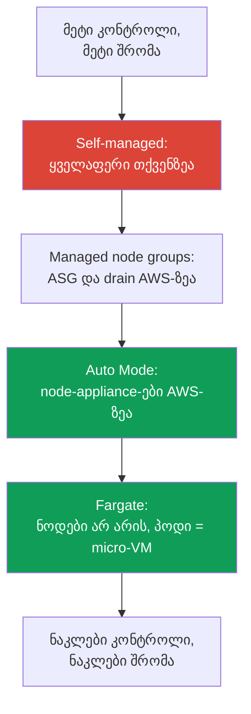
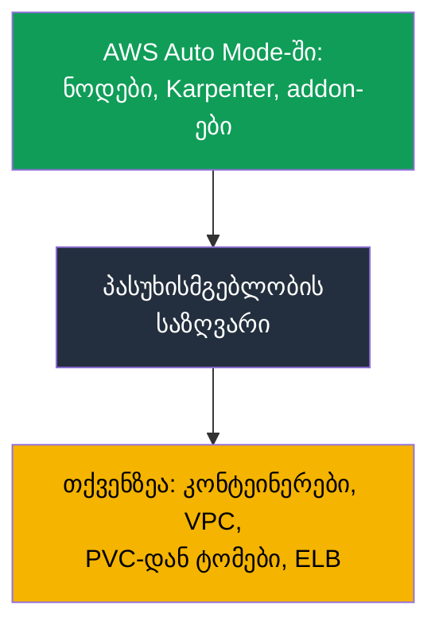

[Русская версия](ru.md) · [Eng version](en.md) · [Versión en español](es.md) · [Version française](fr.md) · [Deutsche Version](de.md) · [繁體中文版](tw.md) · [日本語版](jp.md)
# თავი 9. გამოთვლითი რესურსების ტიპები: managed node groups, self-managed, Fargate, Auto Mode

> **რა არის შემდეგ.** Control plane-ს AWS ემსახურება (თავები 1-2), კლასტერი შექმნილია (თავი 4), წვდომა
> და ქსელი გამართულია (თავები 5-8). შემდეგი კითხვაა, რაზე გაეშვას პოდები: ახლა ოთხი ვარიანტია
> და თითოეულს თავისი საექსპლუატაციო მოდელი აქვს. ეს თავი ამ ოთხი ტიპის მიმოხილვასა და
> მე-2 ნაწილის მთავარ არჩევანს ეხება - EKS Auto Mode საკუთარი სტეკის წინააღმდეგ. AMI, bootstrap და launch template - თავი 10,
> ავტომასშტაბირება და Karpenter - თავები 11-12, spot - თავი 13, sizing და `max-pods` - თავები
> 6 და 14, Fargate დეტალურად (პროფილები, შეზღუდვები) - თავი 15.

## 9.1. „გამოთვლითი რესურსების არასწორი ტიპი ავირჩიეთ და ეს გვიან გამოჩნდა“

გუნდს სერვისი EKS-ში გადააქვს. კლასტერი გაშვებულია, პოდები მუშაობს, ყველაფერი გამართულად გამოიყურება. პრობლემები
რამდენიმე კვირის შემდეგ ჩნდება, როდესაც ნოდზე რაღაცის გაკეთება ხდება საჭირო, მაგრამ შეუძლებელია:

- workload Fargate-ზე განათავსეს „ნოდების გარეშე“ მუშაობისთვის, ახლა კი უსაფრთხოების მოთხოვნით
  runtime-აგენტი DaemonSet-ად უნდა დაყენდეს - Fargate-ზე **DaemonSet მხარდაჭერილი არ არის**, აგენტის დაყენება
  არსად შეიძლება;
- მინიმალური ექსპლუატაციისთვის EKS Auto Mode აირჩიეს, ინციდენტის დროს კი ინჟინერი ნოდზე
  kubelet-ის ლოგების სანახავად შედის და აღმოაჩენს, რომ **SSH და SSM by design დახურულია**;
- სრული კონტროლისთვის self-managed ნოდები ააწყვეს, ახლა კი OS-ის პატჩები, kubelet-ის განახლებები,
  AMI-ის როტაცია და ნოდების რეგისტრაცია - ყველაფერი თქვენი ყოველთვიური სამუშაოა, რომელიც არავის გაუთვალისწინებია.

არცერთი შეცდომა პირველივე დღეს არ ჩანს. სამივე იმის შედეგია, რომ **გამოთვლითი რესურსების ტიპი
საექსპლუატაციო მოდელის განხილვის გარეშე აირჩიეს**: ვინ აყენებს OS-ის პატჩებს, არის თუ არა ნოდზე წვდომა, შეიძლება თუ არა
აგენტის დაყენება, ვინ აგებს პასუხს განახლებებზე და რა ღირს ეს. ეს თავი გაძლევთ რუკას,
რომ არჩევანი გააზრებული იყოს და არა „ავიღეთ ის, რაც tutorial-ში პირველად შეგვხვდა“.

## 9.2. გამოთვლითი რესურსების ოთხი ტიპი: ვინ რას იღებს საკუთარ თავზე

EKS-ში პოდის გაშვება გამოთვლითი რესურსების ოთხი ტიპიდან ერთ-ერთზე შეიძლება. ყველა ერთ
კლასტერში მუშაობს და ერთ control plane-ს იყოფს; განსხვავება ისაა, **ნოდის დონის რა ნაწილს იღებს AWS** და
რამდენი რჩება თქვენზე.

| ტიპი | რას იღებს AWS | რა რჩება თქვენზე | როდის არის შესაფერისი |
|---|---|---|---|
| Managed node groups | ASG და launch template, მოთხოვნით განახლება, drain | ნოდის OS, მასზე დაყენებული კომპონენტები, sizing | საბაზისო production, ნაცნობი მოდელი |
| Self-managed nodes | EC2-ის გარდა არაფერს | ნოდის მთელი lifecycle | custom AMI, GPU, ეგზოტიკური შემთხვევები |
| Fargate | მთელი ნოდი: პოდი = micro-VM | მხოლოდ კონტეინერი და მისი კონფიგურაცია | იზოლაცია, job-ების პაკეტები, ნოდების გარეშე |
| EKS Auto Mode | node-appliance, მასშტაბირება, addon-ები | კონტეინერი, VPC, PVC-დან ტომები, ELB | ნოდების მინიმალური ექსპლუატაცია |

განსხვავება მოსახერხებელია პასუხისმგებლობის სკალად აღვიქვათ: ზემოთ self-managed-ია, სადაც ყველაფერი თქვენზეა, ქვემოთ
Auto Mode და Fargate, სადაც ნოდები თითქმის მთლიანად AWS-ს ეკუთვნის, managed node groups კი შუაშია.



იგივე ოთხეული არჩევანის სამი კრიტერიუმითაც მოსახერხებლად ერთიანდება: რა ჯდება (ღირებულებისა და
მართვის სტრუქტურა), რამდენად იზოლირებულია workload და რამდენი ოპერაციული შრომა რჩება თქვენზე.

| ტიპი | ღირებულება და მართვა | იზოლაცია | ოპერაციული overhead |
|---|---|---|---|
| Managed node groups | EC2-ის საფასური, ASG-ის მართვა დამატებითი საფასურის გარეშე | ნოდებს პოდები იზიარებს | საშუალო: OS და განახლებები თქვენზეა |
| Self-managed nodes | მხოლოდ EC2, ორკესტრაცია საკუთარი ძალებით | ნოდები საერთო, იზოლაცია თქვენი კონფიგურაციის მიხედვით | მაღალი: ნოდის მთელი lifecycle |
| Fargate | პოდის vCPU-სა და მეხსიერების საფასური, მჭიდრო განთავსებისას უფრო ძვირი | მაქსიმალური: პოდი = micro-VM | დაბალი: ნოდები არ არის |
| EKS Auto Mode | EC2 პლუს მართვის დამატებითი საფასური | ნოდები საერთო, მაგრამ appliance-ია | მინიმალური: ნოდები AWS-ზეა |

შემდეგ თითოეული ტიპისთვის განვიხილავთ: კონკრეტულად რას გიხსნით AWS, რას არ გიხსნით და რომელ შემთხვევაშია ტიპი
გამართლებული. Auto Mode ცალკე და დეტალურად 9.6-9.8 სექციებშია განხილული, რადგან ეს მე-2 ნაწილის მთავარი
არჩევანია.

## 9.3. Managed node groups: ASG EKS-ის მართვის ქვეშ

Managed node group არის EC2-ინსტანსების ჯგუფი, რომელსაც EKS თქვენთვის ქმნის და ემსახურება მის მიერ მართული
Auto Scaling group-ისა და launch template-ის მეშვეობით. ნოდები კლასტერში
ავტომატურად რეგისტრირდება, ვერსიის განახლება კი ერთი ბრძანებით სრულდება: EKS ახალ ნოდებს ქმნის,
ძველებს რიგრიგობით ანიჭებს `SchedulingDisabled` სტატუსს, PDB-ის გათვალისწინებით workload-ს კორექტულად **drain**-ს უკეთებს და
ძველ ინსტანსებს თიშავს.

```bash
aws eks create-nodegroup --cluster-name demo --nodegroup-name system \
  --node-role arn:aws:iam::111122223333:role/eksNodeRole \
  --subnets subnet-0abc subnet-0def --instance-types m5.large \
  --scaling-config minSize=2,maxSize=6,desiredSize=3
eksctl create nodegroup --cluster demo --name apps --managed --nodes 3
```

რას **იღებს საკუთარ თავზე** AWS: ASG-ის lifecycle-ს, drain-ით განახლებების ორკესტრაციას, health-შემოწმებებს
და არაჯანსაღი ნოდების ჩანაცვლებას. რა **რჩება თქვენზე**: ნოდის ოპერაციული სისტემა და ყველაფერი, რაც მასზე
მუშაობს, ინსტანსის ტიპის არჩევა და sizing (თავები 6 და 14), გადაწყვეტილება, განახლდეთ თუ არა და როდის.
Managed node group ნოდის შიგთავსზე პასუხისმგებლობას არ აუქმებს - ის ASG-თან და
განახლების თანმიმდევრობასთან დაკავშირებულ ხელით სამუშაოს გიხსნით.

შესაფერისია როგორც **საბაზისო არჩევანი production-ისთვის**, თუ custom image არ გჭირდებათ და გსურთ
ნაცნობი მოდელი: „ნოდები გვაქვს და ვმართავთ, მაგრამ ASG-ს ხელით არ ვემსახურებით“. ამ ტიპით
იწყებენ, თუ Auto Mode რაიმე მიზეზით არ გამოდგება.

## 9.4. Self-managed nodes: სრული კონტროლი და სრული ტვირთი

Self-managed nodes არის EC2-ინსტანსები, რომლებსაც თავად ქმნით (საკუთარი ASG-ით, საკუთარი Terraform-ით,
საკუთარი launch template-ით) და თავად უერთებთ კლასტერს. EKS-მა ამ ნოდების შესახებ მხოლოდ ის იცის, რომ
ისინი დარეგისტრირდა; დანარჩენი ყველაფერი თქვენი ზონაა.

რას გაძლევთ ეს: **სრულ კონტროლს**. საკუთარი AMI საჭირო kernel-ითა და წინასწარ დაყენებული პაკეტებით,
განსაკუთრებული bootstrap (თავი 10), სპეციფიკური GPU-დრაივერები, ეგზოტიკური ტიპის ინსტანსები და
კონფიგურაციები, რომლებიც managed-ვარიანტში არ არის. ასეთი ნოდების მიერთების უფლება გაიცემა
`EC2_LINUX` ან `EC2_WINDOWS` ტიპის access entry-ით (თავი 5) და არა ძველი `aws-auth`-ით.

რა ღირს ეს: **მომსახურების სრული ტვირთი თქვენთან ბრუნდება**. OS-ის უსაფრთხოების პატჩები,
kubelet-ის განახლება და მისი ვერსიის control plane-თან სინქრონიზაცია, AMI-ის როტაცია, ჩანაცვლებისას
კორექტული რეგისტრაცია და drain, spot-შეწყვეტების საკუთარი ძალებით დამუშავება (თავი 13). ყველაფერი, რასაც
managed node group და Auto Mode თქვენთვის აკეთებს, აქ ისევ თქვენი სამუშაოა. Self-managed-ს არა იმიტომ
ირჩევენ, რომ „ზოგადად მეტი კონტროლია“, არამედ მაშინ, როდესაც არსებობს **კონკრეტული მოთხოვნა**, რომელსაც
managed-ვარიანტები ვერ ფარავს.

## 9.5. Fargate: პოდი როგორც micro-VM, ნოდები საერთოდ არ არის

Fargate ნოდებს სურათიდან მთლიანად აქრობს. თქვენ არ ირჩევთ ინსტანსის ტიპს, არ მასშტაბირებთ
ჯგუფებს, არ აყენებთ OS-ის პატჩებს: შესაბამისი Fargate-პროფილის (თავი 15) მქონე პოდი გამოყოფილ
**micro-VM**-ზე ეშვება, რომელსაც საკუთარი kernel, CPU, მეხსიერება და ქსელური ინტერფეისი აქვს და
სხვა პოდებთან არ იზიარებს.

```bash
aws eks create-fargate-profile --cluster-name demo --fargate-profile-name batch \
  --pod-execution-role-arn arn:aws:iam::111122223333:role/eksFargatePodRole \
  --subnets subnet-0abc subnet-0def \
  --selectors namespace=batch
```

იზოლაციის ფასი არის **შეზღუდვები**, რომლებიც Fargate-ის დოკუმენტაციითაა დადასტურებული. Fargate-ზე არ არის
DaemonSet-ები (აგენტი მხოლოდ sidecar-ად თავად პოდში), არ არის privileged კონტეინერები, არ არის
`HostPort` და `HostNetwork`, არ არის GPU, არ არის „ნოდზე“ წვდომა, რადგან თქვენთვის გასაგები ნოდი
არ არსებობს. Load balancer-ები მხოლოდ target-type `ip` რეჟიმში მუშაობს, პოდები კი მხოლოდ
private subnet-ებში ეშვება. მუდმივი storage-იდან **მხოლოდ EFS** მონტაჟდება (EFS CSI-ის მეშვეობით); **EBS-ის
Fargate-პოდებთან მიერთება შეუძლებელია**, ხელმისაწვდომია მხოლოდ პოდის ephemeral storage: ნაგულისხმევად 20 GiB, მისი
გაფართოება კი დისკით არა, არამედ პოდის `resources.requests`-ში `ephemeral-storage` მოთხოვნით ხდება, 175
GiB-მდე (დეტალები და მაგალითი - თავი 15). შესაფერისია
იზოლირებული workload-ებისთვის, job-ების პაკეტებისა და სერვისებისთვის, რომლებსაც
ნოდზე წვდომა და node-level აგენტები არ სჭირდება. პროფილები, შეზღუდვები და ღირებულების სტრუქტურა (თავად პოდის
vCPU-სა და მეხსიერების საფასური) დეტალურად მე-15 თავშია.

## 9.6. EKS Auto Mode: ნოდები როგორც appliance

EKS Auto Mode არის რეჟიმი, რომელშიც AWS არა მხოლოდ control plane-ს, არამედ
data plane-ის ინფრასტრუქტურასაც მართავს: ნოდებს, მასშტაბირებას, პოდების ქსელს, load balancing-ს, ephemeral
storage-ს. Auto Mode-ის ნოდები დაპროექტებულია **როგორც appliance**, შავი ყუთი, რომელსაც არ ხსნით.
Auto Mode-ის დოკუმენტაციის მიხედვით AWS შემდეგს იღებს საკუთარ თავზე.

**თავად ნოდები.** AWS ირჩევს AMI-ს (Bottlerocket-ის ვარიანტებს), რთავს **SELinux-ს enforcing რეჟიმში** და
**read-only root filesystem-ს**, ნოდზე პირდაპირი წვდომა კი დახურულია: **არც SSH, არც SSM**. ნოდის
**სიცოცხლის მაქსიმალური დრო 21 დღეა** (შეიძლება შემცირდეს), რის შემდეგაც ის ავტომატურად
ახლით იცვლება - იძულებითი როტაცია აქტუალური პატჩების უზრუნველსაყოფად.

**მასშტაბირება და მოვლენები.** სერვისის შიგნით Karpenter მუშაობს: ის აკვირდება
non-schedulable პოდებს, მათთვის ნოდებს ქმნის და კონსოლიდაციისას ზედმეტებს შლის. Spot-
შეწყვეტებს, health-მოვლენებსა და EC2-ის scheduled maintenance-ს **სერვისი ამუშავებს, თქვენი
Node Termination Handler-ის გარეშე**.

**ჩაშენებული შესაძლებლობები addon-ების ნაცვლად.** პოდებისთვის IP-ის მინიჭება, network policy, ლოკალური DNS,
GPU-პლაგინები (NVIDIA, Neuron), EBS CSI და Service-სა და Ingress-ისთვის ELB-თან ინტეგრაცია რეჟიმში
core-კომპონენტების სახითაა ჩაშენებული. **Pod Identity აგენტის დაყენება საჭირო არ არის** - ის უკვე რეჟიმის ნაწილია.

```bash
aws eks describe-cluster --name demo --query 'cluster.computeConfig'
kubectl get nodes -L eks.amazonaws.com/compute-type -L karpenter.sh/nodepool
```

## 9.7. Auto Mode: განახლებები, საზღვრები და რისი შეცვლა არ შეიძლება

**ავტომატური განახლებები.** Auto Mode კლასტერს, ნოდებსა და კომპონენტებს აქტუალურ მდგომარეობაში ინარჩუნებს,
**თქვენი PDB-ებისა და NodePool disruption budgets-ის დაცვით**. თუ დამბლოკავი PDB განახლებას
ნოდის სიცოცხლის 21-დღიან ლიმიტზე მეტხანს უშლის ხელს, შეიძლება თქვენი ჩარევა გახდეს საჭირო. კლასტერის ვერსიის
**rollback-ისას Auto Mode-ის ნოდები control plane-ზე ადრე ბრუნდება უკან**, თქვენი disruption-
კონტროლების გათვალისწინებით (rollback-ის თანმიმდევრობა - თავი 39).

**რისი შეცვლა არ შეიძლება და რისი შეიძლება.** ნაგულისხმევი NodePool და NodeClass სერვისის მიერაა კონფიგურირებული და
**მათი რედაქტირება არ შეიძლება**. თუმცა ნაგულისხმევების გვერდით შეგიძლიათ **საკუთარი** NodePool-ისა და
NodeClass-ის დამატება: კონკრეტული ტიპის ინსტანსებისთვის, workload-ების იზოლაციისა და ephemeral storage-ის პარამეტრებისთვის.

ეს განთავსების სიმჭიდროვეზე კონტროლის დაბრუნების გზაა. საკუთარ NodePool-ში ხელმისაწვდომია სექცია
`disruption`: `consolidationPolicy` და `consolidateAfter` განსაზღვრავს, რამდენად აგრესიულად ხდება ნოდების
კონსოლიდაცია, `budgets` კი ერთდროულად გასაწყვეტი ნოდების წილს ზღუდავს და განრიგით
მშვიდი საათების დაწესების საშუალებას იძლევა (ამ ველების მექანიკა - თავი 12). ამასთან, ნაგულისხმევ NodePool-ებს
ღირებულების მზა შეზღუდვები აქვს: მხოლოდ C, M და R ოჯახები, მხოლოდ on-demand spot-ის გარეშე,
მეხუთე და შემდგომი თაობები, მაგრამ **`limits`-ის გარეშე**. თქვენი NodePool-ები ამ შეზღუდვებს **არ მემკვიდრეობს**,
ამიტომ მათში ლიმიტები და დასაშვები ინსტანსის ტიპები ხელით უნდა მიუთითოთ, წინააღმდეგ შემთხვევაში pool ჭერის გარეშე იზრდება.

**ნოდების ჩანაცვლება დროებით დამატებით ხარჯს ქმნის.** განახლებისას ან სიცოცხლის ვადის გასვლისას Auto Mode
ჯერ ახალ ნოდს ქმნის, შემდეგ PDB-ის გათვალისწინებით ძველიდან პოდებს drain-ს უკეთებს და გარკვეული ხნით
ორივე მუშაობს. დიდ პარკში ეს ანგარიშში პერიოდულ ზრდას იწვევს. მისი შერბილების სამი გზა არსებობს:
disruption budgets იმდენად მკაცრი არ იყოს, რომ drain დიდხანს გაგრძელდეს, გამოიყენოთ შედარებით პატარა
ინსტანსები და შეამციროთ ნოდის სიცოცხლის მაქსიმალური ვადა - ჩანაცვლებები გახშირდება, მაგრამ თითოეული გაიაფდება.

**საზღვრები: რა რჩება თქვენზე.** Auto Mode ნოდებს გიხსნით, მაგრამ არა ყველაფერს:

| თქვენზე რჩება | კონკრეტულად რა |
|---|---|
| კონტეინერები | image-ები, მათი უსაფრთხოება, requests და limits |
| კლასტერი და VPC | კლასტერის კონფიგურაცია, subnet-ები, security groups |
| მუდმივი ტომები | PVC-დან ტომები თქვენია; Auto Mode მხოლოდ ephemeral storage-ს მართავს |
| Load balancer-ები | Service და Ingress როგორც რესურსები და მათი კონფიგურაცია თქვენია |

storage-ის მთავარი ნიუანსი: Auto Mode ნოდის **ephemeral** storage-ს აკონფიგურირებს (ტომის ტიპი,
ზომა, დაშიფვრა, წაშლის პოლიტიკა), ხოლო **PVC-დან მუდმივი ტომები თქვენს ზონად რჩება** -
მათი lifecycle, snapshot-ები და AZ-ზე მიბმა 23-ე თავშია განხილული.



### Placement group: ნოდების განლაგება ფიზიკურ ინფრასტრუქტურაზე

საკუთარი `NodeClass`-ის შექმნის კიდევ ერთი მიზეზია **placement group**. ნაგულისხმევი კლასის შეცვლა
არ შეიძლება, ამიტომ Auto Mode-ში ნოდების ფიზიკური განლაგების მართვა მხოლოდ საკუთარი კლასითაა შესაძლებელი.
`cluster`, `partition` და `spread` სტრატეგიები 0.4 თავშია განხილული, აქ კი - როგორ ჩაირთოს და
რა შეიძლება დაირღვეს. თავად ჯგუფი წინასწარ იქმნება EC2-ში, `NodeClass` მხოლოდ ირჩევს მას
სახელით ან id-ით (ველი Auto Mode-ში 2026 წლის მაისში გამოჩნდა):

```yaml
apiVersion: eks.amazonaws.com/v1
kind: NodeClass
metadata:
  name: latency-sensitive
spec:
  role: MyNodeRole
  subnetSelectorTerms:
    - tags: {Name: private-subnet}
  securityGroupSelectorTerms:
    - tags: {Name: eks-cluster-sg}
  placementGroupSelector:
    name: training-pg            # ან id: pg-02465754522cda020
```

აქედან რეჟიმის სპეციფიკა იწყება და ის აშკარა არ არის. Auto Mode ნოდს **ჯერ გაშვებით,
შემდეგ წაშლით** ცვლის: ახალი ძველიდან drain-ის დაწყებამდე იქმნება. `spread` სტრატეგიის ლიმიტია
7 მოქმედი ინსტანსი თითო ზონაში თითო ჯგუფზე; ლიმიტის მიღწევისას ჩანაცვლების გაშვება ვერ ხერხდება, ხოლო
drift-ის მქონე ნოდი **განუსაზღვრელი დროით აგრძელებს მუშაობას**: Auto Mode ჯგუფის გარეთ გასვლას არ
ცდილობს. თუ ჯგუფის ყველა ზონა ლიმიტს მიაღწევს, ჩანაცვლება საერთოდ არ მოხდება. ნაწილობრივ შველის
`consolidationPolicy: WhenEmpty` - ასეთი ნოდი პოდების drain-ის შემდეგ იშლება და სლოტს
წინასწარი გაშვების გარეშე ათავისუფლებს, - მაგრამ drift ყოველთვის ჩანაცვლებით სრულდება, ამიტომ drift კვლავ
დაბლოკილი რჩება. ნოდის სიცოცხლის 21-დღიან ვადასთან ერთად ეს ნიშნავს, რომ ასეთ ჯგუფში ავტომატური
როტაციის დაპირება ვერ სრულდება.

დანარჩენი სამი ხაფანგი. `cluster` სტრატეგიის მქონე ჯგუფი პირველი გაშვებული ინსტანსის ზონას
ებმება და თუ NodePool რამდენიმე ზონას უშვებს, პირველი მასშტაბირებისას პარალელური გაშვებები ერთმანეთს
ეჯიბრება: ერთი გაიმარჯვებს და ზონას დააფიქსირებს, დანარჩენები capacity error-ით დასრულდება -
ამიტომ ზონას pool-ის `requirements`-ში აფიქსირებენ. არარსებულ ან წაშლილ ჯგუფზე მითითება
ნიშნავს, რომ ინსტანსები **საერთოდ არ ეშვება**: id-ის ფორმატი ობიექტის მიღებისას მოწმდება, ხოლო
ჯგუფის არსებობა - მხოლოდ გაშვებისას; თუ ჯგუფს მოქმედი ნოდების ქვეშ წაშლით, ისინი
drift-ის მქონედ მოინიშნება და გაიჭედება. და ბოლოს: კონსოლიდაციამ შეიძლება **პოდი ჯგუფიდან გადაიყვანოს**,
თუ პოდს განლაგების შეზღუდვები არ აქვს, ამიტომ ჯგუფისადმი კუთვნილებას გამოხატავენ
`nodeSelector`-ით, `eks.amazonaws.com/placement-group-id` label-ის მიხედვით. `partition`-ს დამატებითი
შეზღუდვები არ აქვს.

## 9.8. Auto Mode საკუთარი სტეკის წინააღმდეგ: როდის რომელი

Auto Mode არც „ყოველთვის უკეთესია“ და არც სათამაშო. ეს გარიგებაა: ნოდზე კონტროლს თმობთ
ექსპლუატაციის მოხსნის სანაცვლოდ და ამისთვის EC2-ის ღირებულებაზე დამატებით მართვის საფასურს იხდით. ქვემოთ მოცემულია
პირდაპირი შედარება.

| ამოცანა | EKS Auto Mode | საკუთარი სტეკი (managed ან self-managed) |
|---|---|---|
| Custom AMI ან საკუთარი bootstrap | შეუძლებელია, AMI-ს AWS ირჩევს | დიახ, თქვენი launch template (თავი 10) |
| ნოდზე წვდომა debugging-ისთვის ან აგენტისთვის | SSH და SSM არ არის | არის, დააყენეთ რაც გჭირდებათ |
| VPC CNI-ისგან განსხვავებული CNI (მაგალითად Cilium) | არა, ქსელი ჩაშენებულია | დიახ, საკუთარი CNI (თავი 8) |
| Karpenter-ის დეტალური კონტროლი | ნაგულისხმევი NodePool-ები არ რედაქტირდება, საკუთარში `disruption` შეიძლება; თავად controller მიუწვდომელია | controller თქვენია: ვერსია, პარამეტრები, ნებისმიერი policy (თავი 12) |
| ღირებულების კონტროლი | მართვის დამატებითი საფასური არის | მხოლოდ EC2-ის საფასურს იხდით |
| image-ის მიმართ მარეგულირებლის მოთხოვნები | image-ს AWS ირჩევს | თქვენი ატესტირებული AMI |
| ნოდების მინიმალური ექსპლუატაცია | დიახ, ეს მისი დანიშნულებაა | არა, ნოდები თქვენზეა |

არჩევანის მოკლე checklist: აირჩიეთ **საკუთარი სტეკი**, თუ ერთ-ერთი მაინც მართებულია - საჭიროა custom AMI
ან bootstrap, debugging-ისთვის ან node-level აგენტებისთვის ნოდზე წვდომაა საჭირო, VPC CNI არ გამოდგება, საჭიროა
თავად Karpenter controller-ის კონტროლი და არა მხოლოდ საკუთარი NodePool-ების, ღირებულება იმდენად კრიტიკულია,
რომ მართვის დამატებითი საფასური მიუღებელია, ან ნოდის image-ზე მარეგულირებლის მოთხოვნები ვრცელდება. თუ არცერთი პირობა
არ შესრულდა და მიზანია **ნოდების მინიმალური ექსპლუატაცია**, Auto Mode ჩვეულებრივ იმარჯვებს. მართვის საფასური
EC2-ის ზემოდან ირიცხება, ამიტომ ანგარიშში ის თავად ინსტანსების ღირებულებისგან განცალკევებულია.

ანგარიშის გასარჩევად ეს განცალკევება იმაზე მნიშვნელოვანია, ვიდრე ჩანს. Auto Mode-ის ნოდები **managed
instances** არის: იხდით ინსტანსის ჩვეულებრივ EC2 ტარიფს და ცალკე EKS-ის მიერ მისი მართვის საფასურს,
ანგარიშში კი მეორე პოზიცია დამოუკიდებლად არსებობს. აქედან პრაქტიკული დასკვნა: Reserved Instances
და Savings Plans მხოლოდ EC2-ის ნაწილს ამცირებს, მართვის საფასურზე ფასდაკლება **არ ვრცელდება**. Auto Mode-ის
საკუთარ სტეკთან ან Fargate-თან შედარებისას ეს ცხადად უნდა დაითვალოს, წინააღმდეგ შემთხვევაში
შედარების ეკონომიკა მცდარი იქნება (თავები 43 და 15).

## 9.9. როგორ თანაარსებობს ტიპები ერთ კლასტერში

გამოთვლითი რესურსების ტიპები ურთიერთგამომრიცხავი არ არის: ერთ კლასტერში ხშირად რამდენიმე ერთდროულად მუშაობს. ტიპური
განლაგებაა **system pool managed node group-ზე** (CoreDNS, controller-ები, monitoring, რათა
კრიტიკული კომპონენტები მასშტაბირებაზე არ იყოს დამოკიდებული), ხოლო **აპლიკაციები Auto Mode-ზე ან Fargate-ზე**.

workload-ები Kubernetes-ის სტანდარტული მექანიზმებით იყოფა. system pool-ს taint-ს უმატებენ, რათა იქ
უცხო პოდები არ მოხვდეს, სისტემური კომპონენტები კი შესაბამის toleration-ს იღებს. Fargate
პოდებს namespace-ისა და label-ის მიხედვით Fargate-პროფილით იზიდავს (თავი 15). Auto Mode საკუთარ
NodePool-ებში გეგმავს, სადაც საჭირო labels-ისა და taints-ის მქონე საკუთარი NodePool-ის დამატებაც შეიძლება.

```bash
kubectl get nodes -L eks.amazonaws.com/compute-type -L node.kubernetes.io/instance-type
kubectl get pods -A -o wide --field-selector spec.nodeName=<node>
```

პრაქტიკული აზრი: კრიტიკული სისტემური კომპონენტები ინახება პროგნოზირებად ნოდებზე, რომლებსაც თქვენ
მართავთ, ელასტიკური აპლიკაციები კი იქ გადადის, სადაც ნაკლები ექსპლუატაციაა. შერევა
გააზრებულია - „რა სად გაეშვება“ labels-ითა და taints-ით წყდება და არა შემთხვევითი მოხვედრით.

## 9.10. როგორ იყენებენ ამას production-ში

- **გამოთვლითი რესურსების ტიპს საექსპლუატაციო მოდელთან ერთად ირჩევენ** და არა tutorial-ის მიხედვით: ვინ აყენებს
  OS-ის პატჩებს, არის თუ არა ნოდზე წვდომა, შეიძლება თუ არა აგენტის დაყენება, ვინ და როდის განაახლებს.
- **ნაგულისხმევად managed node groups ან Auto Mode**, self-managed კი მხოლოდ
  კონკრეტული მოთხოვნისთვის (custom AMI, GPU, bootstrap), რომელსაც სხვაგვარად ვერ დაფარავთ.
- **system pool-ს აპლიკაციებისგან taints-ითა და labels-ით გამოყოფენ**: კრიტიკული კომპონენტები იმ ნოდებზეა, რომლებიც
  თქვენს კონტროლქვეშაა, ელასტიკური workload-ები - Auto Mode-ზე ან Fargate-ზე.
- **Auto Mode-მდე 9.8-ის checklist-ს ამოწმებენ**: საჭიროა თუ არა ნოდზე წვდომა, custom image, VPC CNI-ისგან განსხვავებული
  CNI, Karpenter-ის დეტალური კონტროლი - თუ დიახ, საკუთარ სტეკს აწყობენ.
- **Auto Mode-ის დამატებით საფასურს ღირებულების გამოთვლაში ცალკე ითვალისწინებენ** EC2-ისგან და ადარებენ საკუთარი
  სტეკის ექსპლუატაციის შრომას, ნაცვლად „ინსტანსების პირდაპირი შედარებისა“.

## 9.11. მინი-ლექსიკონი

- **Managed node group** - EC2-ების ჯგუფი EKS-ის მართვის ქვეშ: ASG-სა და launch template-ს AWS მართავს,
  მოთხოვნით განახლება drain-ით ხდება, მაგრამ OS და ნოდის შიგთავსი თქვენზეა.
- **Self-managed node** - EC2-ინსტანსი, რომელსაც თავად ქმნით და უერთებთ (`EC2_LINUX` ტიპის access
  entry-ით); ნოდის მთელი lifecycle თქვენზეა.
- **Fargate** - პოდის გაშვება გამოყოფილ micro-VM-ზე ნოდების გარეშე; DaemonSet-ის, privileges-ის,
  `HostNetwork`-ის, GPU-ისა და ნოდზე წვდომის გარეშე. საფასური პოდის vCPU-სა და მეხსიერებაზეა.
- **EKS Auto Mode** - რეჟიმი, სადაც AWS მართავს node-appliance-ებს (Bottlerocket, SELinux
  enforcing, read-only root, SSH-ისა და SSM-ის გარეშე, სიცოცხლის 21 დღე), Karpenter-ზე დაფუძნებულ მასშტაბირებას და
  ჩაშენებულ ქსელს, DNS-ს, EBS CSI-ს, ELB-ს. ნაგულისხმევი NodePool-ისა და NodeClass-ის შეცვლა არ შეიძლება.
- **NodePool და NodeClass** - ობიექტები, რომლებიც აღწერს, როგორი ნოდები და როგორ უნდა შეიქმნას; Auto Mode-ში
  ნაგულისხმევები უცვლელია, საკუთარის დამატება კი შეიძლება (დეტალურად - თავი 12).
- **`placementGroupSelector`** - საკუთარი `NodeClass`-ის ველი, რომელიც placement group-ს სახელით
  ან id-ით ირჩევს. ჯგუფს წინასწარ თავად ქმნით; პოდის ჯგუფისადმი კუთვნილება განისაზღვრება `nodeSelector`-ით,
  `eks.amazonaws.com/placement-group-id` label-ის მიხედვით.

## 9.12. თავის შეჯამება

- EKS-ში ერთ კლასტერში გამოთვლითი რესურსების ოთხი ტიპია: managed node groups, self-managed nodes,
  Fargate, EKS Auto Mode. განსხვავება ისაა, ნოდის დონის რა ნაწილს იღებს AWS და რამდენი რჩება თქვენზე.
- Managed node groups მართავს ASG-სა და drain-ით განახლებას, მაგრამ OS და sizing თქვენზეა. Self-managed
  სრულ კონტროლს გაძლევთ პატჩების, განახლებებისა და რეგისტრაციის სრული ტვირთის ფასად.
- Fargate ნოდებს აქრობს: პოდი = micro-VM, მაგრამ DaemonSet-ის, privileges-ის, `HostNetwork`-ის, GPU-ისა და
  ნოდზე წვდომის გარეშე; დეტალები და პროფილები - თავი 15.
- Auto Mode AWS-ს გადასცემს node-appliance-ებს (Bottlerocket, SELinux enforcing, read-only root,
  SSH-ისა და SSM-ის გარეშე, როტაცია 21 დღეში), Karpenter-სა და spot-მოვლენების დამუშავებას, ჩაშენებულ ქსელს, DNS-ს,
  EBS CSI-სა და ELB-ს; Pod Identity Agent საჭირო არ არის. ნაგულისხმევი NodePool და NodeClass არ რედაქტირდება,
  საკუთარის დამატება კი შეიძლება. თქვენზე რჩება კონტეინერები, VPC, PVC-დან ტომები და load balancer-ები.
- Auto Mode-სა და საკუთარ სტეკს შორის არჩევანი checklist-ით წყდება: custom AMI, ნოდზე წვდომა, VPC CNI-ისგან განსხვავებული
  CNI, Karpenter-ის დეტალური კონტროლი, ღირებულების კონტროლი, მარეგულირებლის მოთხოვნები - საკუთარი
  სტეკის სასარგებლოდ; ნოდების მინიმალური ექსპლუატაცია - Auto Mode-ის სასარგებლოდ.
- ტიპები თავსებადია: system pool managed nodes-ზე, აპლიკაციები Auto Mode-ზე ან Fargate-ზე,
  გაყოფა taints-ისა და labels-ის მეშვეობით.

## 9.13. როგორ გამოგადგებათ ეს რეალურ სამუშაოში

გამოთვლითი რესურსების ტიპის არჩევა კლასტერის ერთ-ერთი პირველი არქიტექტურული გადაწყვეტილებაა და შეცდომის ფასი ისაა,
რომ იგი გვიან ჩნდება: აგენტის დაყენება არსად შეიძლება, ნოდზე ვერ შედიხართ, მომსახურების ტვირთი მოსალოდნელზე
მეტი აღმოჩნდა. თუ დასაწყისში 9.8-ის checklist-ს გაივლით, კითხვებს „ვინ აყენებს OS-ის პატჩებს“,
„საჭიროა თუ არა ნოდზე წვდომა“, „მისაღებია თუ არა Auto Mode-ის დამატებითი საფასური“ workload-ის
production-ში გაშვებამდე უპასუხებთ და არა ინციდენტის დროს. მორიგეობისას იმის ცოდნა, რომელი ტიპი რომელი ნოდის ქვეშ დგას,
მაშინვე განსაზღვრავს, რისი გაკეთება შეიძლება: სად არის შესაძლებელი `kubectl debug node`, ხოლო სად ნოდის გახსნა პრინციპულად შეუძლებელია.

## 9.14. თვითშემოწმების კითხვები

1. self-managed-თან შედარებით managed node group რა ტვირთს გიხსნით და რას ტოვებს თქვენზე?
2. რატომ არ შეიძლება Fargate-ზე runtime-აგენტის DaemonSet-ად დაყენება და როგორ უვლიან გვერდს ამ შეზღუდვას?
3. თავად ნოდის დონეზე კონკრეტულად რას იღებს AWS საკუთარ თავზე EKS Auto Mode-ში?
4. რატომ არ არის Auto Mode-ში SSH და SSM და ასეთ შემთხვევაში როგორ უნდა გამოიკვლიოთ პრობლემა ნოდზე?
5. რას ნიშნავს „ნოდის სიცოცხლის მაქსიმალური დრო 21 დღეა“ და რატომ არის ეს საჭირო?
6. storage-სა და load balancer-ებზე საუბრისას Auto Mode-ში რა რჩება თქვენს ზონად?
7. დაასახელეთ ოთხი შემთხვევა, როდესაც საკუთარი სტეკი Auto Mode-ს სჯობს.
8. რატომ არ შეიძლება Auto Mode-ში ნაგულისხმევი NodePool-ისა და NodeClass-ის შეცვლა და რა უნდა გააკეთოთ ამის ნაცვლად?
9. როგორ უნდა გაყოთ ერთ კლასტერში system pool და აპლიკაციები გამოთვლითი რესურსების სხვადასხვა ტიპს შორის?
10. როგორია Fargate-ის, Auto Mode-ისა და managed node groups-ის ღირებულების სტრუქტურა?
11. რა ემართება Auto Mode-ის ნოდებს კლასტერის ვერსიის rollback-ისას და რატომ (თავი 39)?
12. რატომ შეიძლება `spread` სტრატეგიის მქონე placement group-ში Auto Mode-ის ნოდების ჩანაცვლება შეწყდეს
    და რას ცვლის აქ `consolidationPolicy: WhenEmpty`?

## პრაქტიკა

ამ თემას კურსის ორი ლაბა ახლავს. [ლაბა 101 - კლასტერი როგორც
კოდი](../../labs/101/README_GE.MD) აჩვენებს გამოთვლითი რესურსების გაყოფას საკუთარ სტეკში:
system პოდები Fargate-ზე, workload Karpenter-ის EC2-ნოდებზე, მოთხოვნის მიხედვით მასშტაბირება.
გაშვება - `TASK=101 make run_eks_task`.

[ლაბა 125 - EKS Auto Mode საკუთარი სტეკის წინააღმდეგ](../../labs/125/README_GE.MD) კლასტერს
საპირისპირო გზით აწყობს: Fargate-პროფილის, addon-ებისა და გარე Karpenter-ის გარეშე, მხოლოდ
`compute_config.enabled` flag-ით. მასში ჩაშენებულ NodePool-ებთან მუშაობთ, ხელით ადგენთ,
სად გადის მართვადობის ნამდვილი ზღვარი (ჩაშენებული pool-ის შეცვლა სრულდება, მაგრამ ობიექტს
სერვისი ფლობს), რწმუნდებით, რომ ოპერატორს ნოდზე წვდომა არ აქვს და ქმნით საკუთარ
NodePool-ს ცხადად მითითებული `limits`-ით, რომელიც ჩაშენებულ pool-ებს არ აქვს. გაშვება -
`TASK=125 make run_eks_task`. ორივე ლაბაში შემოწმება `check_result` ბრძანებით ხდება. ამავე თემას
ეხება [ლაბა 106 - EBS CSI: gp3, AZ-ზე მიბმა, გაფართოება, snapshot](../../labs/106/README_GE.MD)
და [ლაბა 107 - EFS CSI: ReadWriteMany ხელმისაწვდომობის ზონებს შორის](../../labs/107/README_GE.MD),
სადაც კლასტერი იმავე managed node groups-სა და Fargate-ზე ეწყობა, რომლებიც ამ თავშია აღწერილი.

ლაბის გარდა, გამოთვლითი რესურსების ტიპების ნახვა მოქმედ კლასტერზეც შეიძლება. დაიწყეთ იმით, რაც უკვე
მუშაობს: `kubectl get nodes -L eks.amazonaws.com/compute-type -L
node.kubernetes.io/instance-type` გაჩვენებთ, რომელი ნოდი რა ტიპისაა, ხოლო `kubectl get pods -A -o
wide` - რა სადაა გაშვებული. Auto Mode-ისთვის შეამოწმეთ `aws eks describe-cluster --name <cluster>
--query 'cluster.computeConfig'`: ველი გიჩვენებთ, ჩართულია თუ არა რეჟიმი.

შემდეგ node group-ები შეამოწმეთ: `aws eks list-nodegroups --cluster-name <cluster>` და `aws eks
describe-nodegroup --cluster-name <cluster> --nodegroup-name <name>` managed-ჯგუფის scaling-config-სა და
launch template-ს გაჩვენებთ. თუ Fargate გაქვთ, `aws eks list-fargate-profiles
--cluster-name <cluster>` და `describe-fargate-profile` namespace-ისა და label-ის selector-ებს მოგცემთ.
9.8-ის checklist თქვენს workload-ს მოარგეთ და გულწრფელად უპასუხეთ, რომელი ტიპია მისთვის
შესაფერისი: საჭიროა თუ არა ნოდზე წვდომა, custom image, node-level აგენტები - და პასუხი შეადარეთ იმას,
რაც ახლაა გაშლილი.

---
[სარჩევი](../README_GE.md) · [თავი 8](../08/ge.md) · [თავი 10](../10/ge.md)