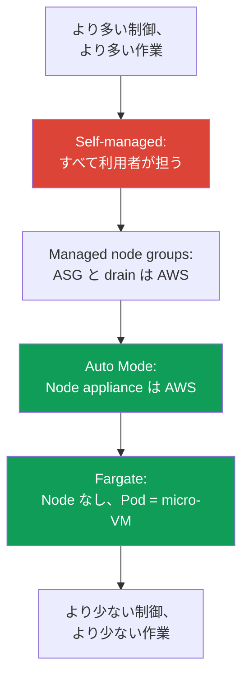
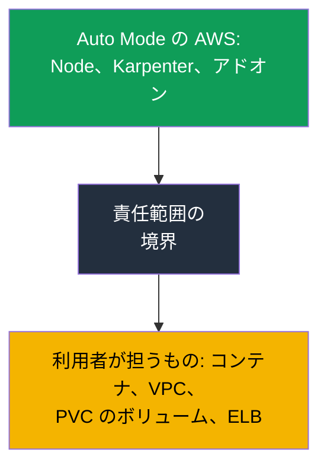

[Русская версия](ru.md) · [Eng version](en.md) · [Versión en español](es.md) · [Version française](fr.md) · [Deutsche Version](de.md) · [ქართული ვერსია](ge.md) · [繁體中文版](tw.md)
# 第9章 コンピューティングタイプ: managed node groups、self-managed、Fargate、Auto Mode

> **この先の内容。** control plane は AWS が運用し（第1～2章）、クラスターは作成済み（第4章）、アクセスとネットワークは設定済みです（第5～8章）。次に問うのは、Pod を何の上で実行するかです。選択肢は4つあり、それぞれ運用モデルが異なります。本章では、この4つのコンピューティングタイプの概要と、第2部の主な選択である EKS Auto Mode と独自スタックの比較を扱います。AMI、bootstrap、launch template は第10章、オートスケーリングと Karpenter は第11～12章、spot は第13章、サイジングと `max-pods` は第6章と第14章、Fargate の詳細（プロファイル、制限）は第15章です。

## 9.1. 「誤ったコンピューティングタイプを選び、後になって判明した」

チームがサービスを EKS に移行します。クラスターは起動済みで、Pod は実行され、一見すべて動いています。問題は数週間後、Node 上で何かをする必要が生じたものの、それができないときに発生します。

- 「Node がない」ことを理由にワークロードを Fargate に配置したが、セキュリティ上 runtime エージェントを DaemonSet として導入する必要が出た。しかし Fargate では **DaemonSet はサポートされない**ため、エージェントを置く場所がない。
- 運用を最小化するため EKS Auto Mode を選んだが、インシデント時にエンジニアが Node に入り kubelet ログを見ようとして、**SSH と SSM が設計上閉じられている**ことに気付く。
- 完全な制御のため self-managed Node を構築した結果、OS パッチ、kubelet の更新、AMI ローテーション、Node 登録のすべてが、誰も見積もっていなかった毎月の作業になる。

どの誤りも初日には見えません。3つとも、**運用モデルを話し合わずにコンピューティングタイプを選んだ**結果です。つまり、誰が OS をパッチするのか、Node へアクセスできるのか、エージェントを導入できるのか、誰が更新を担い、どの程度のコストになるのかを決めていません。本章は、チュートリアルで最初に見つけたものを選ぶのではなく、意識して選択するための地図を提供します。

## 9.2. 4つのコンピューティングタイプ: 誰が何を担うか

EKS では、Pod を4つのコンピューティングタイプのいずれかで実行できます。すべてが同一クラスターに存在し、同一の control plane を共有します。異なるのは、**Node レイヤーをどこまで AWS が引き受けるか**、どこまでが利用者に残るかです。

| タイプ | AWS が担うこと | 利用者に残ること | 適した場面 |
|---|---|---|---|
| Managed node groups | ASG と launch template、指示に基づく更新、drain | Node OS、Node 上にあるもの、サイジング | 基本的な本番環境、慣れ親しんだモデル |
| Self-managed nodes | EC2 以外は何もしない | Node ライフサイクル全体 | カスタム AMI、GPU、特殊な用途 |
| Fargate | Node 全体: Pod = micro-VM | コンテナとその設定だけ | 分離、ジョブのバッチ、Node なし |
| EKS Auto Mode | Node appliance、スケーリング、アドオン | コンテナ、VPC、PVC のボリューム、ELB | Node 運用の最小化 |

違いは責任範囲の尺度として捉えると分かりやすくなります。上端はすべてを利用者が担う self-managed、下端は Node のほぼ全体を AWS が担う Auto Mode と Fargate、その中間が managed node groups です。



同じ4つは、選択における3つの基準、すなわちコスト（料金構造と管理）、ワークロードの分離度、利用者に残る運用作業量にまとめることもできます。

| タイプ | コストと管理 | 分離度 | 運用オーバーヘッド |
|---|---|---|---|
| Managed node groups | EC2 の料金、追加料金なしで ASG を管理 | Node は Pod 間で共有 | 中程度: OS と更新は利用者が担う |
| Self-managed nodes | EC2 のみ、オーケストレーションは自力 | Node は共有、分離は設定次第 | 高い: Node ライフサイクル全体 |
| Fargate | Pod の vCPU とメモリに課金、高密度配置では高コスト | 最大: Pod = micro-VM | 低い: Node がない |
| EKS Auto Mode | EC2 に管理料金を加算 | Node は共有だが appliance | 最小: Node は AWS が担う |

以降では各タイプについて、AWS が具体的に何を引き受けるか、何は引き受けないか、どのような場合に適切かを扱います。Auto Mode は第2部の主な選択であるため、第9.6～9.8節で個別に詳しく説明します。

## 9.3. Managed node groups: EKS 管理下の ASG

Managed node group は、EKS が管理する Auto Scaling group と launch template を介して AWS が作成・保守する EC2 インスタンスのグループです。Node はクラスターへ自動登録され、バージョン更新は1コマンドで行えます。EKS は新しい Node を起動し、古い Node を順番に `SchedulingDisabled` としてマークし、PDB を考慮してワークロードを適切に **drain** し、古いインスタンスを終了します。

```bash
aws eks create-nodegroup --cluster-name demo --nodegroup-name system \
  --node-role arn:aws:iam::111122223333:role/eksNodeRole \
  --subnets subnet-0abc subnet-0def --instance-types m5.large \
  --scaling-config minSize=2,maxSize=6,desiredSize=3
eksctl create nodegroup --cluster demo --name apps --managed --nodes 3
```

AWS が**担うこと**は、ASG のライフサイクル、drain を伴う更新のオーケストレーション、ヘルスチェック、不健全な Node の置換です。**利用者に残ること**は、Node の OS とその上で動作するすべて、インスタンスタイプとサイジングの選択（第6章と第14章）、更新するかどうかとその時期の判断です。Managed node group は Node の内容に対する責任をなくすものではなく、ASG の手作業と更新順序の管理を取り除くものです。

カスタムイメージが不要で、「Node はあり、それを管理するが、手動で ASG を扱いたくはない」という慣れたモデルを望むなら、**本番環境の基本選択**として適します。何らかの理由で Auto Mode が適合しない場合に、最初に採用するタイプです。

## 9.4. Self-managed nodes: 完全な制御と完全な負担

Self-managed nodes は、利用者自身が起動し（独自の ASG、Terraform、launch template で）、自らクラスターに参加させる EC2 インスタンスです。EKS がそれらの Node について知るのは、登録されたという事実だけで、それ以外はすべて利用者の領域です。

これにより得られるのは**完全な制御**です。必要なカーネルと事前インストール済みパッケージを含む独自 AMI、特殊な bootstrap（第10章）、固有の GPU ドライバー、managed の選択肢にない特殊なインスタンスタイプと設定を使用できます。このような Node を参加させる権限は、古い `aws-auth` ではなく、`EC2_LINUX` または `EC2_WINDOWS` タイプの access entry（第5章）で与えます。

そのコストは、**保守の全負担が利用者に戻る**ことです。OS のセキュリティパッチ、kubelet の更新と control plane バージョンとの同期、AMI ローテーション、置換時の正しい登録と drain、spot 中断の自力での処理（第13章）。Managed node group と Auto Mode が代行するものはすべて、ここでは再び利用者の作業です。Self-managed を選ぶのは「一般に制御が多いから」ではなく、managed の選択肢では満たせない**具体的な要件**がある場合です。

## 9.5. Fargate: Pod は micro-VM、Node は一切ない

Fargate は Node を完全に取り除きます。インスタンスタイプの選択、グループのスケーリング、OS パッチは不要です。適合する Fargate profile（第15章）を持つ Pod は、独自のカーネル、CPU、メモリ、ネットワークインターフェイスを持ち、他の Pod と共有しない専用の **micro-VM** で実行されます。

```bash
aws eks create-fargate-profile --cluster-name demo --fargate-profile-name batch \
  --pod-execution-role-arn arn:aws:iam::111122223333:role/eksFargatePodRole \
  --subnets subnet-0abc subnet-0def \
  --selectors namespace=batch
```

この分離の代価は、Fargate のドキュメントで確認された**制限**です。Fargate には DaemonSet がありません（エージェントは Pod 自体の sidecar としてのみ実行可能です）。privileged コンテナ、`HostPort`、`HostNetwork`、GPU、「Node」へのアクセスもありません。利用者の考える意味での Node が存在しないためです。Load Balancer は target-type `ip` モードでのみ動作し、Pod は private subnet でのみ起動します。永続ストレージとしてマウントできるのは **EFS のみ**（EFS CSI 経由）です。**EBS を Fargate Pod に接続することはできません**。あるのは Pod の ephemeral storage のみで、デフォルトは 20 GiB です。ディスクを拡張するのではなく、Pod の `resources.requests` で `ephemeral-storage` を要求して最大 175 GiB まで拡張します（詳細と例は第15章）。Node へのアクセスも Node レベルのエージェントも不要な、分離されたワークロード、ジョブのバッチ、サービスに適しています。プロファイル、制限、料金構造（Pod 自身の vCPU とメモリに対する課金）は第15章で詳しく扱います。

## 9.6. EKS Auto Mode: appliance としての Node

EKS Auto Mode は、AWS が control plane だけでなく、Node、スケーリング、Pod ネットワーク、ロードバランシング、ephemeral storage というデータインフラも管理するモードです。Auto Mode の Node は、開けないブラックボックスである **appliance** として設計されています。Auto Mode のドキュメントによると、AWS は次を担います。

**Node 自体。** AWS は AMI（Bottlerocket のバリアント）を選択し、**SELinux を enforcing**、**root filesystem を read-only** で有効化します。Node への直接アクセスは閉じられ、**SSH も SSM もありません**。Node の**最大ライフタイムは21日**（短縮は可能）であり、最新のパッチを強制的に適用するため、その後は新しい Node に自動で置き換えられます。

**スケーリングとイベント。** サービス内部で Karpenter が動作します。スケジュール不可能な Pod を監視してそれに適した Node を起動し、consolidation 時には余剰 Node を削除します。spot 中断、health イベント、EC2 の scheduled maintenance は、**独自の Node Termination Handler なしでサービスが処理します**。

**アドオンの代わりの組み込み機能。** Pod への IP 割り当て、network policy、ローカル DNS、GPU プラグイン（NVIDIA、Neuron）、EBS CSI、Service と Ingress のための ELB 統合は、core コンポーネントとしてモードに組み込まれています。**Pod Identity エージェントを導入する必要はありません**。すでにモードの一部です。

```bash
aws eks describe-cluster --name demo --query 'cluster.computeConfig'
kubectl get nodes -L eks.amazonaws.com/compute-type -L karpenter.sh/nodepool
```

## 9.7. Auto Mode: 更新、境界、変更できないもの

**自動更新。** Auto Mode は、**利用者の PDB と NodePool disruption budgets を順守**しながら、クラスター、Node、コンポーネントを最新の状態に保ちます。Node の21日というライフタイム制限を超えてもブロッキング PDB が更新を妨げる場合、利用者の介入が必要になることがあります。**クラスターのバージョンをロールバックする際は、Auto Mode Node が control plane より先にロールバック**されます。利用者の disruption controls を考慮します（ロールバック順序は第39章）。

**変更できないものとできるもの。** デフォルトの NodePool と NodeClass はサービスにより設定され、**編集できません**。ただし、デフォルトのものに加えて、特定のインスタンスタイプ、ワークロードの分離、ephemeral storage の設定のために、独自の NodePool と NodeClass を**追加できます**。

これが、Node の集約に対する制御を取り戻す方法です。独自の NodePool では `disruption` セクションが使用できます。`consolidationPolicy` と `consolidateAfter` は Node をどの程度積極的に集約するかを定め、`budgets` は同時に中断可能な Node の割合を制限し、スケジュールに基づく静穏時間を設定できます（これらのフィールドの仕組みは第12章）。一方、デフォルトの NodePool には事前設定されたコスト上の制限があります。C、M、R ファミリーのみ、spot なしの on-demand のみ、第5世代以降ですが、**`limits` はありません**。独自の NodePool はこれらの制限を**継承しない**ため、上限なくプールが拡大しないよう、limits と許可するインスタンスタイプを手動で設定します。

**Node の置換は一時的にコストがかかります。** 更新時またはライフタイム満了時、Auto Mode はまず新しい Node を起動し、次に PDB を考慮して古い Node から Pod を drain します。そのため、しばらくは両方が稼働します。大規模なフリートでは、請求額に定期的な急増が生じます。これを3つの方法で緩和できます。drain が長引くほど disruption budgets を厳格にしないこと、より小さいインスタンスを維持すること、Node の最大ライフタイムを短くすることです。置換頻度は増えますが、1回ごとのコストは低くなります。

**境界: 利用者に残ること。** Auto Mode は Node を取り除きますが、すべてを取り除くわけではありません。

| 利用者に残ること | 詳細 |
|---|---|
| コンテナ | イメージ、そのセキュリティ、requests と limits |
| クラスターと VPC | クラスター設定、subnet、security groups |
| 永続ボリューム | PVC からのボリュームは利用者のもの。Auto Mode が管理するのは ephemeral storage のみ |
| Load Balancer | リソースとしての Service と Ingress、およびそれらの設定 |

ストレージに関する重要な注意点は、Auto Mode は Node の**ephemeral** storage（ボリュームタイプ、サイズ、暗号化、削除ポリシー）を設定する一方、**PVC からの永続ボリュームは利用者の領域に残る**ことです。そのライフサイクル、snapshot、AZ へのバインドは第23章で扱います。



### Placement group: ハードウェア上の Node 配置

独自の `NodeClass` を作るもう1つの理由が **placement group** です。デフォルトのクラスは変更できないため、Auto Mode における Node の物理配置を制御できるのは独自のものだけです。`cluster`、`partition`、`spread` の戦略は第0.4章で扱いました。ここでは、それを有効にする方法と、その際に何が壊れるかを説明します。グループ自体は事前に EC2 で作成し、`NodeClass` は名前または id で選択するだけです（このフィールドは2026年5月に Auto Mode へ追加されました）。

```yaml
apiVersion: eks.amazonaws.com/v1
kind: NodeClass
metadata:
  name: latency-sensitive
spec:
  role: MyNodeRole
  subnetSelectorTerms:
    - tags: {Name: private-subnet}
  securityGroupSelectorTerms:
    - tags: {Name: eks-cluster-sg}
  placementGroupSelector:
    name: training-pg            # または id: pg-02465754522cda020
```

ここからはモード特有で、分かりにくい挙動が始まります。Auto Mode は Node を**起動してから削除する**順で置き換えます。古い Node を drain する前に新しい Node を起動します。`spread` 戦略では、1つのグループあたり1 AZ で稼働できるインスタンスは7台までです。この上限に達すると置換の起動は失敗し、drift した Node は**期限なく稼働し続けます**。Auto Mode はグループの外部で起動を試みません。グループの全 AZ が上限に達した場合、置換は一切行われません。`consolidationPolicy: WhenEmpty` で部分的に緩和できます。このような Node は Pod の drain 後、事前の起動なしで削除されスロットを解放します。しかし drift は常に置換によって行われるため、drift は依然としてブロックされます。Node の21日ライフタイムと組み合わさることで、このグループでは自動ローテーションの約束は果たされません。

残りの3つの落とし穴があります。`cluster` 戦略のグループは、最初に起動したインスタンスの AZ に結び付きます。NodePool が複数の AZ を許可している場合、最初のスケール時に並行起動が競合します。1つが勝って AZ を固定し、他は容量エラーで失敗します。そのため、プールの `requirements` で AZ を固定します。存在しない、または削除済みのグループへの参照は、インスタンスが**まったく起動しない**ことを意味します。id の形式はオブジェクト受付時に検証されますが、グループの存在は起動時にのみ検証されます。稼働 Node があるグループを削除すると、それらは drift としてマークされ、停止します。最後に、Pod に配置の制約がない場合、consolidation は**グループ外へ Pod を移動させる可能性があります**。したがって、グループへの所属は `eks.amazonaws.com/placement-group-id` ラベルによる `nodeSelector` で表します。`partition` に追加の制約はありません。

## 9.8. Auto Mode と独自スタック: どちらを選ぶか

Auto Mode は「常に優れている」ものでも、玩具でもありません。これは取引です。運用を不要にする代わりに Node の制御を手放し、EC2 の料金に加えて管理料金を支払います。以下は要件ごとの直接比較です。

| 要件 | EKS Auto Mode | 独自スタック（managed または self-managed） |
|---|---|---|
| カスタム AMI または独自 bootstrap | 不可、AMI は AWS が選択 | 可、独自の launch template（第10章） |
| デバッグまたはエージェントのための Node アクセス | SSH も SSM もない | 可能、必要なものを導入できる |
| VPC CNI 以外（例: Cilium） | 不可、ネットワークは組み込み | 可能、独自の CNI（第8章） |
| Karpenter の詳細な制御 | デフォルト NodePool は変更不可、独自のものは `disruption` が利用可能。コントローラー自体にはアクセス不可 | コントローラーは利用者のもの: バージョン、設定、任意のポリシー（第12章） |
| コスト制御 | 管理料金がある | EC2 にのみ支払う |
| イメージに関する規制要件 | イメージは AWS が選択 | 認証済みの独自 AMI |
| Node 運用の最小化 | 可、これが目的 | 不可、Node は利用者が担う |

短い選択チェックリストです。次のいずれかが真であれば、**独自スタック**を選びます。カスタム AMI または bootstrap が必要、デバッグまたは Node レベルのエージェントのため Node アクセスが必要、VPC CNI 以外が必要、独自 NodePool だけではなく Karpenter コントローラーそのものの制御が必要、管理料金を許容できないほどコストが重要、または Node イメージに規制要件がある場合です。どれにも当てはまらず、目標が**Node 運用の最小化**であれば、通常は Auto Mode が優位です。管理料金は EC2 に上乗せされるため、請求ではインスタンス自体のコストと分かれています。

請求を分析するうえで、この分離は見かけ以上に重要です。Auto Mode の Node は **managed instances** です。インスタンスには通常の EC2 料金を払い、さらにその管理に対する EKS の別料金を支払います。後者は請求上の独立した項目です。ここから実務上の結論が出ます。Reserved Instances と Savings Plans は EC2 部分だけを削減し、管理料金には**割引が適用されません**。Auto Mode を独自スタックや Fargate と比較する際は、これを明示的に計算する必要があります。そうしなければ比較の経済性を誤ります（第43章と第15章）。

## 9.9. 1つのクラスターでタイプを組み合わせる方法

コンピューティングタイプは相互排他的ではありません。1つのクラスターで複数を同時に使用することはよくあります。典型的な構成は、**managed node group 上のシステムプール**（CoreDNS、コントローラー、監視。重要なものをスケーリングに依存させないため）と、**Auto Mode または Fargate 上のアプリケーション**です。

ワークロードは標準的な Kubernetes の仕組みで分離します。システムプールには taint を付け、他の Pod が配置されないようにし、システムコンポーネントには対応する toleration を付けます。Fargate は Fargate profile（第15章）を介して namespace と label により Pod を引き付けます。Auto Mode は自身の NodePool に従ってスケジュールし、必要な labels と taints を持つ独自 NodePool を追加できます。

```bash
kubectl get nodes -L eks.amazonaws.com/compute-type -L node.kubernetes.io/instance-type
kubectl get pods -A -o wide --field-selector spec.nodeName=<node>
```

実務的な意味は、重要なシステム基盤を利用者が管理する予測可能な Node に保持し、弾力的なアプリケーションを運用の少ない場所へ委ねることです。この混在は意図的なものです。「何をどこで実行するか」は偶然の配置ではなく、labels と taints で決めます。

## 9.10. 本番環境での適用方法

- **コンピューティングタイプはチュートリアルではなく運用モデルとともに選択します**。誰が OS をパッチするのか、Node にアクセスできるのか、エージェントを導入できるのか、誰がいつ更新するのかを決めます。
- **デフォルトは managed node groups または Auto Mode**とし、self-managed は、他では満たせない具体的な要件（カスタム AMI、GPU、bootstrap）がある場合にのみ選びます。
- **システムプールをアプリケーションから分離します**。taints と labels を使い、重要な基盤は利用者の制御下にある Node に、弾力的なワークロードは Auto Mode または Fargate に置きます。
- **Auto Mode の前に9.8節のチェックリストを確認します**。Node アクセス、カスタムイメージ、VPC CNI 以外、詳細な Karpenter 制御が必要なら、独自スタックを構築します。
- **Auto Mode の管理料金を EC2 と分けてコスト計算に組み込みます**。独自スタックの運用作業と比較し、インスタンス料金だけで直接比較しません。

## 9.11. ミニ用語集

- **Managed node group** - EKS 管理下の EC2 グループ。ASG と launch template は AWS が管理し、指示により drain を伴う更新を行いますが、OS と Node の内容は利用者が担います。
- **Self-managed node** - 利用者自身が起動・参加させる EC2 インスタンス（`EC2_LINUX` タイプの access entry）。Node ライフサイクル全体を利用者が担います。
- **Fargate** - Node なしで、Pod を専用 micro-VM 上で実行します。DaemonSet、privilege、`HostNetwork`、GPU、Node アクセスはありません。Pod の vCPU とメモリに課金されます。
- **EKS Auto Mode** - AWS が Node appliance（Bottlerocket、SELinux enforcing、read-only root、SSH と SSM なし、21日間のライフタイム）、Karpenter によるスケーリング、組み込みのネットワーク、DNS、EBS CSI、ELB を管理するモードです。デフォルトの NodePool と NodeClass は編集できません。
- **NodePool と NodeClass** - 起動する Node とその方法を記述するオブジェクト。Auto Mode ではデフォルトのものは不変ですが、独自のものは追加できます（詳細は第12章）。
- **`placementGroupSelector`** - 独自の `NodeClass` のフィールドであり、名前または id によって placement group を選択します。グループは事前に利用者自身が作成し、Pod のグループ所属は `eks.amazonaws.com/placement-group-id` ラベルによる `nodeSelector` で定義します。

## 9.12. 本章のまとめ

- EKS では1つのクラスターに4つのコンピューティングタイプがあります。managed node groups、self-managed nodes、Fargate、EKS Auto Mode です。違いは、Node レイヤーをどこまで AWS が担い、どこまでが利用者に残るかです。
- Managed node groups は ASG と drain を伴う更新を管理しますが、OS とサイジングは利用者が担います。Self-managed は完全な制御を与える一方、パッチ、更新、登録の全負担を伴います。
- Fargate は Node を取り除きます。Pod = micro-VM ですが、DaemonSet、privilege、`HostNetwork`、GPU、Node アクセスはありません。詳細とプロファイルは第15章です。
- Auto Mode は Node appliance（Bottlerocket、SELinux enforcing、read-only root、SSH と SSM なし、21日でローテーション）、Karpenter、spot イベント処理、組み込みのネットワーク、DNS、EBS CSI、ELB を AWS に委ねます。Pod Identity Agent は不要です。デフォルトの NodePool と NodeClass は編集せず、独自のものは追加できます。コンテナ、VPC、PVC のボリューム、Load Balancer は利用者に残ります。
- Auto Mode と独自スタックの選択はチェックリストで決まります。カスタム AMI、Node アクセス、VPC CNI 以外、詳細な Karpenter、コスト制御、規制要件は独自スタックに有利です。Node 運用の最小化は Auto Mode に有利です。
- タイプは組み合わせられます。システムプールは managed nodes、アプリケーションは Auto Mode または Fargate とし、taints と labels で分離します。

## 9.13. 実務での活用方法

コンピューティングタイプの選択は、クラスターに関する最初のアーキテクチャ判断の1つです。誤りのコストは後になって現れます。エージェントを置く場所がない、Node に入れない、保守負担が想定より大きい、といった形です。開始時に9.8節のチェックリストを行えば、ワークロードを本番に載せる前に、「誰が OS をパッチするか」「Node アクセスが必要か」「Auto Mode の管理料金を許容できるか」に答えられます。インシデント対応時には、どのタイプがどの Node の下にあるかを理解することで、何が可能かが直ちに決まります。`kubectl debug node` が可能な場所と、原理的に Node を開けない場所が分かります。

## 9.14. 自己確認の質問

1. Managed node group は self-managed と比べてどの負担を取り除き、何を利用者に残しますか？
2. Fargate に runtime エージェントを DaemonSet として置けないのはなぜですか？ この制限はどのように回避されますか？
3. EKS Auto Mode では、Node 自体のレベルで AWS は具体的に何を担いますか？
4. Auto Mode に SSH と SSM がないのはなぜですか？ その場合、Node 上の問題はどのようにデバッグしますか？
5. 「Node の最大ライフタイムが21日」とは何を意味し、なぜ設けられていますか？
6. ストレージと Load Balancer について、Auto Mode で何が利用者の領域に残りますか？
7. 独自スタックが Auto Mode より優位となる状況を4つ挙げてください。
8. Auto Mode のデフォルト NodePool と NodeClass を変更できないのはなぜですか？ 代わりに何をすべきですか？
9. 1つのクラスターで、異なるコンピューティングタイプ間にシステムプールとアプリケーションをどのように分離しますか？
10. Fargate、Auto Mode、managed node groups の料金構造はどのようなものですか？
11. クラスターのバージョンをロールバックする際、Auto Mode の Node では何が起こり、なぜですか（第39章）？
12. `spread` 戦略の placement group で Auto Mode Node の置換が止まることがあるのはなぜですか？ `consolidationPolicy: WhenEmpty` はここで何を変えますか？

## 演習

このトピックにはコースのラボが2つあります。[ラボ101 - コードとしてのクラスター](../../labs/101/README_JP.MD)では、独自スタックでコンピューティングを分離します。システム Pod は Fargate、ワークロードは Karpenter EC2 Node 上に置き、需要に応じてスケールします。起動は `TASK=101 make run_eks_task` です。

[ラボ125 - EKS Auto Mode と独自スタック](../../labs/125/README_JP.MD)では、逆の方法でクラスターを構築します。Fargate profile、アドオン、外部 Karpenter を使わず、`compute_config.enabled` という1つのフラグだけを使用します。このラボでは、組み込みの NodePool を操作し、管理可能性の実際の境界がどこにあるかを手で確かめます（組み込みプールの変更は通りますが、オブジェクトはサービスが所有します）。また、オペレーターに Node アクセスがないことを確認し、組み込みプールにはない明示的な `limits` を持つ独自 NodePool を作成します。起動は `TASK=125 make run_eks_task` です。両ラボの検証は `check_result` コマンドで行います。同じトピックには、[ラボ106 - EBS CSI: gp3、AZ へのバインド、拡張、snapshot](../../labs/106/README_JP.MD)と、[ラボ107 - EFS CSI: アベイラビリティゾーン間の ReadWriteMany](../../labs/107/README_JP.MD)もあります。これらでは、本章で説明した同じ managed node groups と Fargate でクラスターを構築します。

ラボ以外でも、稼働中のクラスターでコンピューティングタイプを確認できます。まず既に動作しているものを見ます。`kubectl get nodes -L eks.amazonaws.com/compute-type -L node.kubernetes.io/instance-type` は各 Node のタイプを示し、`kubectl get pods -A -o wide` は何がどこで動作しているかを示します。Auto Mode については、`aws eks describe-cluster --name <cluster> --query 'cluster.computeConfig'` を確認してください。このフィールドはモードが有効かどうかを示します。

次に Node group を確認します。`aws eks list-nodegroups --cluster-name <cluster>` と `aws eks describe-nodegroup --cluster-name <cluster> --nodegroup-name <name>` は、managed group の scaling-config と launch template を示します。Fargate があれば、`aws eks list-fargate-profiles --cluster-name <cluster>` と `describe-fargate-profile` により namespace と label のセレクターを確認できます。自身のワークロードに9.8節のチェックリストを適用し、どのタイプが適合するかを率直に判断してください。Node アクセス、カスタムイメージ、Node レベルのエージェントが必要かを問い、現在デプロイされているものと照合します。

---
[目次](../README_JP.md) · [第8章](../08/jp.md) · [第10章](../10/jp.md)
