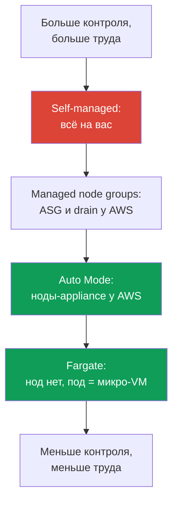
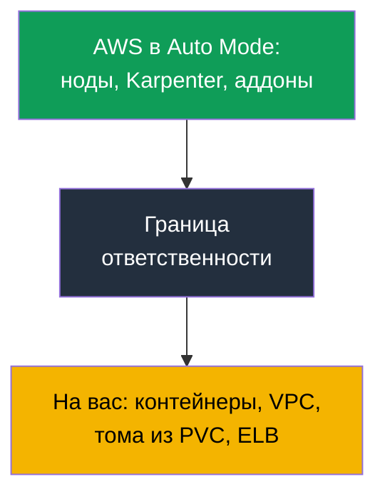

# Глава 9. Типы вычислений: managed node groups, self-managed, Fargate, Auto Mode

> **Что дальше.** Control plane обслуживает AWS (главы 1-2), кластер создан (глава 4), доступ
> и сеть настроены (главы 5-8). Дальше вопрос, на чём запускать поды: вариантов теперь четыре,
> и модель эксплуатации у каждого своя. Глава про обзор этих четырёх типов и про главный выбор
> Части 2 - EKS Auto Mode против своего стека. AMI, bootstrap и launch template - глава 10,
> автомасштабирование и Karpenter - главы 11-12, spot - глава 13, сайзинг и `max-pods` - главы
> 6 и 14, Fargate предметно (профили, ограничения) - глава 15.

## 9.1. «Выбрали не тот тип вычислений, и это всплыло поздно»

Команда переносит сервис в EKS. Кластер поднят, поды бегут, всё выглядит рабочим. Проблемы
приходят через недели, когда что-то надо сделать с нодой, а сделать нельзя:

- нагрузку посадили на Fargate ради «без нод», а теперь безопасность требует поставить
  runtime-агент DaemonSet'ом - на Fargate **DaemonSet не поддерживается**, агента ставить
  некуда;
- выбрали EKS Auto Mode ради минимума эксплуатации, а инженер при инциденте идёт на ноду
  посмотреть логи kubelet и обнаруживает, что **SSH и SSM закрыты by design**;
- собрали self-managed ноды ради полного контроля, и теперь патчи ОС, обновления kubelet,
  ротация AMI и регистрация нод - всё это ваш ежемесячный труд, которого никто не закладывал.

Ни одна из ошибок не видна в первый день. Все три - следствие того, что **тип вычислений
выбрали, не проговорив модель эксплуатации**: кто патчит ОС, есть ли доступ на ноду, можно ли
поставить агента, кто отвечает за обновления и во что это обходится. Эта глава даёт карту,
чтобы выбор был осознанным, а не «взяли, что первым попалось в туториале».

## 9.2. Четыре типа вычислений: кто что берёт на себя

В EKS под можно запустить на одном из четырёх типов вычислений. Все они живут в одном
кластере и делят один control plane; отличаются тем, **сколько уровня ноды забирает AWS** и
сколько остаётся на вас.

| Тип | Что берёт AWS | Что остаётся на вас | Когда уместен |
|---|---|---|---|
| Managed node groups | ASG и launch template, обновление по команде, drain | ОС ноды, что на ней стоит, сайзинг | базовый прод, знакомая модель |
| Self-managed nodes | ничего сверх EC2 | весь жизненный цикл ноды целиком | кастомный AMI, GPU, экзотика |
| Fargate | вся нода: под = микро-VM | только контейнер и его конфигурация | изоляция, пачки job'ов, без нод |
| EKS Auto Mode | нода-appliance, масштабирование, аддоны | контейнер, VPC, тома из PVC, ELB | минимум эксплуатации нод |

Различие удобно держать как шкалу ответственности: сверху self-managed, где на вас всё, снизу
Auto Mode и Fargate, где ноды почти целиком у AWS, а managed node groups посередине.



Ту же четвёрку удобно свести по трём критериям выбора: во что обходится (структура стоимости и
управления), насколько изолирована нагрузка и сколько операционного труда остаётся на вас.

| Тип | Стоимость и управление | Изолированность | Операционный оверхед |
|---|---|---|---|
| Managed node groups | плата за EC2, управление ASG без наценки | ноды общие для подов | средний: ОС и апдейты на вас |
| Self-managed nodes | только EC2, оркестрация своими силами | ноды общие, изоляция как настроите | высокий: весь жизненный цикл ноды |
| Fargate | плата за vCPU и память пода, дороже на плотной упаковке | максимальная: под = микро-VM | низкий: нод нет |
| EKS Auto Mode | EC2 плюс наценка за управление | ноды общие, но это appliance | минимальный: ноды у AWS |

Дальше по каждому типу: что именно AWS снимает с вас, что не снимает и в каком случае тип
оправдан. Auto Mode разбирается отдельно и подробно в разделах 9.6-9.8, потому что это главный
выбор Части 2.

## 9.3. Managed node groups: ASG под управлением EKS

Managed node group - это группа EC2-инстансов, которую EKS создаёт и обслуживает за вас через
Auto Scaling group и launch template под своим управлением. Ноды регистрируются в кластере
автоматически, а обновление версии делается одной командой: EKS поднимает новые ноды, по
очереди помечает старые `SchedulingDisabled`, корректно **drain'ит** нагрузку с учётом PDB и
гасит старые инстансы.

```bash
aws eks create-nodegroup --cluster-name demo --nodegroup-name system \
  --node-role arn:aws:iam::111122223333:role/eksNodeRole \
  --subnets subnet-0abc subnet-0def --instance-types m5.large \
  --scaling-config minSize=2,maxSize=6,desiredSize=3
eksctl create nodegroup --cluster demo --name apps --managed --nodes 3
```

Что AWS **берёт на себя**: жизненный цикл ASG, оркестрацию обновлений с drain, health-проверки
и замену нездоровых нод. Что **остаётся на вас**: операционная система на ноде и всё, что на
ней работает, выбор типа инстанса и сайзинг (главы 6 и 14), решение обновляться и когда.
Managed node group не отменяет ответственности за содержимое ноды - она снимает ручную возню с
ASG и последовательностью обновления.

Уместны как **базовый выбор для прода**, если вам не нужен кастомный образ и вы хотите
привычную модель «у нас есть ноды, мы ими управляем, но без ручного ASG». Это тот тип, с
которого начинают, если Auto Mode по каким-то причинам не подходит.

## 9.4. Self-managed nodes: полный контроль и полный груз

Self-managed nodes - это EC2-инстансы, которые вы поднимаете сами (своим ASG, своим Terraform,
своим launch template) и сами присоединяете к кластеру. EKS про эти ноды знает только то, что
они зарегистрировались; всё остальное - ваша зона.

Что это даёт: **полный контроль**. Свой AMI с нужным ядром и предустановленными пакетами,
особый bootstrap (глава 10), специфические GPU-драйверы, экзотические типы инстансов и
конфигурации, которых нет в managed-варианте. Право присоединить такие ноды выдаётся через
access entry типа `EC2_LINUX` или `EC2_WINDOWS` (глава 5), а не через старый `aws-auth`.

Что это стоит: **полный груз обслуживания возвращается к вам**. Патчи безопасности ОС,
обновление kubelet и синхронизация его версии с control plane, ротация AMI, корректная
регистрация и drain при замене, обработка спот-прерываний своими силами (глава 13). Всё, что
managed node group и Auto Mode делают за вас, здесь снова ваша работа. Self-managed берут не
потому, что «так больше контроля вообще», а когда есть **конкретное требование**, которое
managed-варианты не закрывают.

## 9.5. Fargate: под как микро-VM, нод нет вовсе

Fargate убирает ноды из картины полностью. Вы не выбираете тип инстанса, не масштабируете
группы, не патчите ОС: под с подходящим Fargate-профилем (глава 15) запускается на выделенной
**микро-VM**, у которой свой ядро, свой CPU, своя память и свой сетевой интерфейс, не
разделяемые с другими подами.

```bash
aws eks create-fargate-profile --cluster-name demo --fargate-profile-name batch \
  --pod-execution-role-arn arn:aws:iam::111122223333:role/eksFargatePodRole \
  --subnets subnet-0abc subnet-0def \
  --selectors namespace=batch
```

Цена изоляции - **ограничения**, проверенные по документации Fargate. На Fargate нет
DaemonSet'ов (агент только как sidecar в самом поде), нет привилегированных контейнеров, нет
`HostPort` и `HostNetwork`, нет GPU, нет доступа на «ноду», потому что ноды в вашем понимании
нет. Балансировщики работают только в режиме target-type `ip`, поды запускаются только в
приватных подсетях. Из постоянного хранилища монтируется **только EFS** (через EFS CSI); **EBS
к Fargate-подам подключить нельзя**, есть лишь эфемерный сторедж пода: по умолчанию 20 GiB, и
расширяется он не диском, а запросом `ephemeral-storage` в `resources.requests` пода, до 175
GiB (детали и пример - глава 15). Уместен для
изолированных нагрузок, пачек job'ов и сервисов, где не нужен
доступ к ноде и не нужны узловые агенты. Профили, ограничения и структура стоимости (плата за
vCPU и память самого пода) - предметно в главе 15.

## 9.6. EKS Auto Mode: ноды как appliance

EKS Auto Mode - это режим, в котором AWS управляет не только control plane, но и
инфраструктурой данных: нодами, масштабированием, сетью подов, балансировкой, эфемерным
стореджем. Ноды в Auto Mode спроектированы **как appliance**, чёрный ящик, который вы не
открываете. По документации Auto Mode AWS забирает себе следующее.

**Сами ноды.** AWS выбирает AMI (варианты Bottlerocket), включает **SELinux в enforcing** и
**read-only root filesystem**, а прямой доступ на ноду закрыт: **ни SSH, ни SSM**. У ноды
**максимальное время жизни 21 день** (можно уменьшить), после чего она автоматически
заменяется на свежую - принудительная ротация ради актуальных патчей.

**Масштабирование и события.** Внутри сервиса работает Karpenter: он следит за
non-schedulable подами, поднимает ноды под них и убирает лишние при консолидации. Спот-
прерывания, health-события и scheduled maintenance EC2 обрабатываются **сервисом, без вашего
Node Termination Handler**.

**Встроенные возможности вместо аддонов.** Назначение IP подам, network policy, локальный DNS,
GPU-плагины (NVIDIA, Neuron), EBS CSI и интеграция с ELB для Service и Ingress встроены в режим
как core-компоненты. Агент **Pod Identity ставить не нужно** - он уже часть режима.

```bash
aws eks describe-cluster --name demo --query 'cluster.computeConfig'
kubectl get nodes -L eks.amazonaws.com/compute-type -L karpenter.sh/nodepool
```

## 9.7. Auto Mode: обновления, границы и что править нельзя

**Автообновления.** Auto Mode держит кластер, ноды и компоненты в актуальном состоянии,
**соблюдая ваши PDB и NodePool disruption budgets**. Если блокирующий PDB мешает обновлению
дольше 21-дневного лимита жизни ноды, может потребоваться ваше вмешательство. При **откате
версии кластера ноды Auto Mode откатываются раньше control plane**, с учётом ваших disruption-
контролей (порядок отката - глава 39).

**Что править нельзя, а что можно.** NodePool и NodeClass по умолчанию настроены сервисом, и
**их редактировать нельзя**. Но рядом с дефолтными можно **добавлять свои** NodePool и
NodeClass: под конкретные типы инстансов, изоляцию нагрузок, настройки эфемерного стореджа.

Это и есть способ вернуть себе управление уплотнением. В своём NodePool доступна секция
`disruption`: `consolidationPolicy` и `consolidateAfter` задают, насколько агрессивно ноды
уплотняются, а `budgets` ограничивают долю одновременно прерываемых нод и позволяют завести
тихие часы по расписанию (механика этих полей - глава 12). Дефолтные NodePool при этом несут
готовые ограничения по стоимости: семейства только C, M и R, только on-demand без spot,
поколения от пятого, но **без `limits`**. Свои NodePool этих ограничений **не наследуют**,
поэтому в них лимиты и допустимые типы инстансов задают руками, иначе пул растёт без потолка.

**Замена нод стоит денег в моменте.** При обновлении или истечении срока жизни Auto Mode
сначала поднимает новую ноду, потом сливает поды со старой с учётом PDB, и какое-то время
работают обе. На большом парке это даёт периодические всплески в счёте. Смягчают тремя
способами: не делать disruption budgets настолько строгими, чтобы слив тянулся долго, держать
инстансы меньшего размера и укорачивать максимальный срок жизни ноды - замены станут чаще, но
дешевле каждая.

**Границы: что остаётся на вас.** Auto Mode снимает ноды, но не всё:

| Остаётся на вас | Что именно |
|---|---|
| Контейнеры | образы, их безопасность, requests и limits |
| Кластер и VPC | конфигурация кластера, подсети, security groups |
| Постоянные тома | тома из PVC ваши; Auto Mode ведёт только эфемерный сторедж |
| Балансировщики | Service и Ingress как ресурс и их конфигурация ваши |

Ключевой нюанс про сторедж: Auto Mode настраивает **эфемерный** сторедж ноды (тип тома,
размер, шифрование, политику удаления), а **постоянные тома из PVC остаются вашей зоной** -
их жизненный цикл, снапшоты и привязка к AZ разбираются в главе 23.



### Placement group: раскладка нод по железу

Ещё одна причина завести свой `NodeClass` - **placement group**. Дефолтный класс править
нельзя, поэтому управлять физической раскладкой нод в Auto Mode можно только через свой.
Стратегии `cluster`, `partition` и `spread` разобраны в главе 0.4, здесь - как это включается и
что при этом ломается. Саму группу создают заранее в EC2, `NodeClass` только выбирает её, по
имени или по id (поле появилось в Auto Mode в мае 2026):

```yaml
apiVersion: eks.amazonaws.com/v1
kind: NodeClass
metadata:
  name: latency-sensitive
spec:
  role: MyNodeRole
  subnetSelectorTerms:
    - tags: {Name: private-subnet}
  securityGroupSelectorTerms:
    - tags: {Name: eks-cluster-sg}
  placementGroupSelector:
    name: training-pg            # либо id: pg-02465754522cda020
```

Дальше начинается специфика режима, и она неочевидная. Auto Mode заменяет ноду **сначала
запуском, потом удалением**: новая поднимается до слива старой. У стратегии `spread` потолок -
7 работающих инстансов на зону на группу, и при упоре в него запуск замены падает, а
дрейфующая нода **остаётся работать неопределённо долго**: выйти за пределы группы Auto Mode не
пробует. Если все зоны группы уперлись в потолок, замен не будет вовсе. Частично лечится
`consolidationPolicy: WhenEmpty` - такая нода удаляется после слива подов и освобождает слот
без предварительного запуска, - но drift всегда идёт через замену, поэтому drift остаётся
заблокированным. Вместе с 21-дневным сроком жизни ноды это значит, что обещание автоматической
ротации в такой группе не выполняется.

Три остальные грабли. Группа со стратегией `cluster` привязывается к зоне первого запущенного
инстанса, и если NodePool разрешает несколько зон, параллельные запуски на первом
масштабировании гонятся: один победит и закрепит зону, остальные упадут с ошибкой ёмкости -
поэтому зону фиксируют в `requirements` пула. Ссылка на несуществующую или удалённую группу
означает, что инстансы **не запускаются вообще**: формат id проверяется при приёме объекта, а
существование группы - только при запуске; если удалить группу под работающими нодами, они
помечаются дрейфующими и застревают. И последнее: консолидация может **переселить под из
группы**, если у пода нет ограничений на раскладку, поэтому принадлежность к группе выражают
`nodeSelector` по метке `eks.amazonaws.com/placement-group-id`. У `partition` дополнительных
ограничений нет.

## 9.8. Auto Mode против своего стека: когда что

Auto Mode - не «всегда лучше» и не игрушка. Это сделка: вы отдаёте контроль над нодой в обмен
на снятие эксплуатации и платите за это наценку за управление сверх стоимости EC2. Ниже -
задачи в лоб.

| Задача | EKS Auto Mode | Свой стек (managed или self-managed) |
|---|---|---|
| Кастомный AMI или свой bootstrap | нельзя, AMI выбирает AWS | да, ваш launch template (глава 10) |
| Доступ на ноду для отладки или агента | нет SSH и SSM | есть, ставьте что нужно |
| Не VPC CNI (например Cilium) | нет, сеть встроена | да, свой CNI (глава 8) |
| Тонкий контроль Karpenter | дефолтные NodePool не править, свои с `disruption` можно; сам контроллер недоступен | контроллер ваш: версия, настройки, любые политики (глава 12) |
| Контроль стоимости | есть наценка за управление | платите только за EC2 |
| Регуляторные требования к образу | образ выбирает AWS | ваш аттестованный AMI |
| Минимум эксплуатации нод | да, это его смысл | нет, ноды на вас |

Короткий чеклист выбора: берите **свой стек**, если верно хотя бы одно - нужен кастомный AMI
или bootstrap, нужен доступ на ноду для отладки или узловых агентов, нужен не VPC CNI, нужен
контроль над самим контроллером Karpenter, а не только над своими NodePool, стоимость критична
настолько, что наценка за управление не
проходит, или образ ноды под регуляторными требованиями. Если ни одно не сработало и цель -
**минимум эксплуатации нод**, Auto Mode обычно выигрывает. Наценка за управление берётся сверх
EC2, поэтому в счёте она отделена от стоимости самих инстансов.

Для разбора счёта это разделение важнее, чем кажется. Ноды Auto Mode - это **managed
instances**: вы платите обычную ставку EC2 за инстанс плюс отдельную плату EKS за управление
им, и вторая позиция в счёте живёт сама по себе. Отсюда практический вывод: Reserved Instances
и Savings Plans снижают только EC2-часть, плата за управление под скидку **не попадает**. При
сравнении Auto Mode со своим стеком или с Fargate это надо считать явно, иначе экономика
сравнения окажется неверной (главы 43 и 15).

## 9.9. Как типы сочетаются в одном кластере

Типы вычислений не взаимоисключающие: в одном кластере часто работают несколько сразу. Типовая
раскладка - **системный пул на managed node group** (CoreDNS, контроллеры, мониторинг, чтобы
критичное не зависело от масштабирования), а **приложения на Auto Mode или Fargate**.

Разводят нагрузки штатными механизмами Kubernetes. На системный пул вешают taint, чтобы туда
не сели чужие поды, а системные компоненты получают соответствующий toleration. Fargate
притягивает поды по namespace и label через Fargate-профиль (глава 15). Auto Mode планирует по
своим NodePool, куда можно добавить свой NodePool с нужными labels и taints.

```bash
kubectl get nodes -L eks.amazonaws.com/compute-type -L node.kubernetes.io/instance-type
kubectl get pods -A -o wide --field-selector spec.nodeName=<node>
```

Практический смысл: критичную системную обвязку держат на предсказуемых нодах, которыми вы
управляете, а эластичные приложения отдают туда, где меньше эксплуатации. Смешение
осознанное - «что где запускается» решают лейблами и taints, а не случайным попаданием.

## 9.10. Как это применяют в продакшене

- **Тип вычислений выбирают вместе с моделью эксплуатации**, а не по туториалу: кто патчит
  ОС, есть ли доступ на ноду, можно ли поставить агента, кто и когда обновляет.
- **По умолчанию managed node groups или Auto Mode**, а self-managed берут только под
  конкретное требование (кастомный AMI, GPU, bootstrap), которое иначе не закрыть.
- **Системный пул отделяют от приложений** taints и labels: критичная обвязка на нодах, что
  под вашим контролем, эластичные нагрузки на Auto Mode или Fargate.
- **Перед Auto Mode проверяют чеклист 9.8**: нужен ли доступ на ноду, кастомный образ, не
  VPC CNI, тонкий Karpenter - если да, собирают свой стек.
- **Наценку Auto Mode закладывают в расчёт стоимости** отдельно от EC2 и сверяют с трудом на
  эксплуатацию своего стека, а не сравнивают «в лоб по инстансам».

## 9.11. Мини-глоссарий

- **Managed node group** - группа EC2 под управлением EKS: ASG и launch template ведёт AWS,
  обновление с drain по команде, но ОС и содержимое ноды на вас.
- **Self-managed node** - EC2-инстанс, который вы сами поднимаете и присоединяете (access
  entry типа `EC2_LINUX`); весь жизненный цикл ноды на вас.
- **Fargate** - запуск пода на выделенной микро-VM без нод; без DaemonSet, привилегий,
  `HostNetwork`, GPU и доступа к ноде. Плата за vCPU и память пода.
- **EKS Auto Mode** - режим, где AWS управляет нодами-appliance (Bottlerocket, SELinux
  enforcing, read-only root, без SSH и SSM, 21 день жизни), масштабированием на Karpenter и
  встроенными сетью, DNS, EBS CSI, ELB. Дефолтные NodePool и NodeClass править нельзя.
- **NodePool и NodeClass** - объекты, описывающие, какие ноды и как поднимать; в Auto Mode
  дефолтные неизменяемы, свои добавлять можно (предметно - глава 12).
- **`placementGroupSelector`** - поле своего `NodeClass`, выбирающее placement group по имени
  или id. Группу создают заранее сами; принадлежность пода к группе задают `nodeSelector` по
  метке `eks.amazonaws.com/placement-group-id`.

## 9.12. Итоги главы

- В EKS четыре типа вычислений в одном кластере: managed node groups, self-managed nodes,
  Fargate, EKS Auto Mode. Различие - сколько уровня ноды забирает AWS и сколько на вас.
- Managed node groups ведут ASG и обновление с drain, но ОС и сайзинг на вас. Self-managed
  дают полный контроль ценой полного груза патчей, обновлений и регистрации.
- Fargate убирает ноды: под = микро-VM, но без DaemonSet, привилегий, `HostNetwork`, GPU и
  доступа к ноде; детали и профили - глава 15.
- Auto Mode отдаёт AWS ноды-appliance (Bottlerocket, SELinux enforcing, read-only root, без
  SSH и SSM, ротация за 21 день), Karpenter и обработку spot-событий, встроенные сеть, DNS,
  EBS CSI и ELB; Pod Identity Agent не нужен. Дефолтные NodePool и NodeClass не править,
  свои добавлять можно. На вас остаются контейнеры, VPC, тома из PVC и балансировщики.
- Выбор Auto Mode против своего стека решается чеклистом: кастомный AMI, доступ на ноду, не
  VPC CNI, тонкий Karpenter, контроль стоимости, регуляторные требования - в пользу своего
  стека; минимум эксплуатации нод - в пользу Auto Mode.
- Типы сочетаются: системный пул на managed nodes, приложения на Auto Mode или Fargate,
  разведение через taints и labels.

## 9.13. Как это пригодится в реальной работе

Выбор типа вычислений - одно из первых архитектурных решений по кластеру, и цена ошибки в том,
что она всплывает поздно: агента некуда поставить, на ноду не зайти, груз обслуживания оказался
больше, чем думали. Пройдя чеклист 9.8 на старте, вы отвечаете на вопросы «кто патчит ОС»,
«нужен ли доступ на ноду», «проходит ли наценка Auto Mode» до того, как нагрузка встанет в
прод, а не в момент инцидента. На дежурстве понимание, какой тип под какой нодой стоит, сразу
задаёт, что вообще можно сделать: где `kubectl debug node`, а где ноду не открыть в принципе.

## 9.14. Вопросы для самопроверки

1. Чем managed node group снимает нагрузку по сравнению с self-managed, а что оставляет на вас?
2. Почему на Fargate нельзя поставить runtime-агент DaemonSet'ом и как обходят это ограничение?
3. Что именно AWS забирает себе в EKS Auto Mode на уровне самой ноды?
4. Почему в Auto Mode нет SSH и SSM и как тогда отлаживать проблему на ноде?
5. Что значит «21 день максимальное время жизни ноды» и зачем это сделано?
6. Что в Auto Mode остаётся вашей зоной, если говорить про сторедж и балансировщики?
7. Назовите четыре ситуации, в которых свой стек выигрывает у Auto Mode.
8. Почему дефолтные NodePool и NodeClass в Auto Mode нельзя править, и что делать вместо этого?
9. Как в одном кластере развести системный пул и приложения между разными типами вычислений?
10. Как устроена структура стоимости у Fargate, Auto Mode и managed node groups?
11. Что происходит с нодами Auto Mode при откате версии кластера и почему (глава 39)?
12. Почему в placement group со стратегией `spread` ноды Auto Mode могут перестать
    заменяться, и что здесь меняет `consolidationPolicy: WhenEmpty`?

## Практика

К этой теме идут две лабы курса. [Лаба 101 - кластер как
код](../../labs/101/README_RU.MD) показывает разделение вычислений в своём стеке:
системные поды на Fargate, рабочая нагрузка на EC2-нодах Karpenter, масштаб под спрос.
Запуск - `TASK=101 make run_eks_task`.

[Лаба 125 - EKS Auto Mode против своего стека](../../labs/125/README_RU.MD) собирает
кластер противоположным способом: без Fargate-профиля, аддонов и внешнего Karpenter, на
одном флаге `compute_config.enabled`. В ней вы работаете со встроенными NodePool, выясняете
руками, где проходит настоящая граница управляемости (правка встроенного пула проходит, но
объектом владеет сервис), убеждаетесь, что доступа оператора на ноду нет, и заводите свой
NodePool с явными `limits`, которых у встроенных пулов нет. Запуск -
`TASK=125 make run_eks_task`. Проверка в обеих лабах - командой `check_result`. К этой же теме
относятся [лаба 106 - EBS CSI: gp3, привязка к AZ, расширение, снапшот](../../labs/106/README_RU.MD)
и [лаба 107 - EFS CSI: ReadWriteMany между зонами доступности](../../labs/107/README_RU.MD),
где кластер собирается на тех же managed node groups и Fargate, что описаны в этой главе.

Помимо лабы, типы вычислений видно на живом кластере. Начните с того, что уже
работает: `kubectl get nodes -L eks.amazonaws.com/compute-type -L
node.kubernetes.io/instance-type` покажет, какие ноды какого типа, а `kubectl get pods -A -o
wide` - что где запущено. Для Auto Mode загляните в `aws eks describe-cluster --name <cluster>
--query 'cluster.computeConfig'`: поле скажет, включён ли режим.

Дальше посмотрите на группы нод: `aws eks list-nodegroups --cluster-name <cluster>` и `aws eks
describe-nodegroup --cluster-name <cluster> --nodegroup-name <name>` покажут scaling-config и
launch template managed-группы. Если есть Fargate, `aws eks list-fargate-profiles
--cluster-name <cluster>` и `describe-fargate-profile` дадут селекторы по namespace и label.
Пройдите по чеклисту 9.8 применительно к своей нагрузке и честно ответьте, какой тип ей
подходит: нужен ли доступ на ноду, кастомный образ, узловые агенты - и сверьте ответ с тем,
что развёрнуто сейчас.

---
[Оглавление](../README_RU.md) · [Глава 8](../08/ru.md) · [Глава 10](../10/ru.md)
