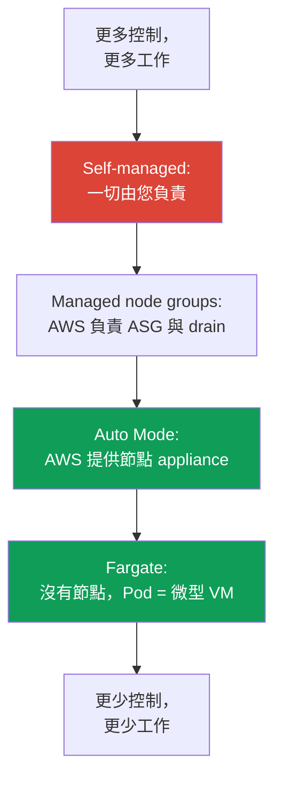
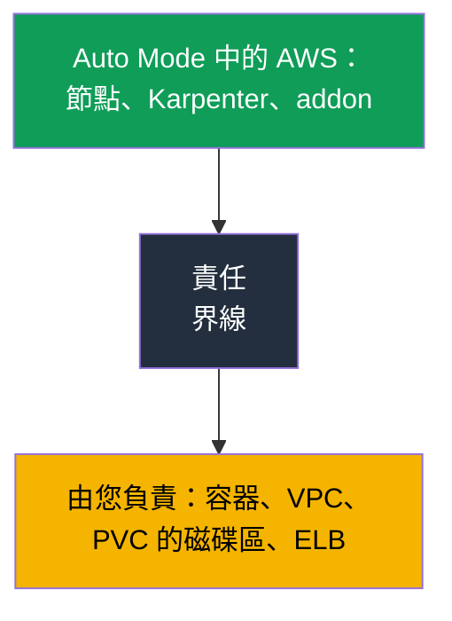

[Eng version](en.md) · [Versión en español](es.md) · [Version française](fr.md) · [Deutsche Version](de.md) · [ქართული ვერსია](ge.md) · [Русская версия](ru.md) · [日本語版](jp.md)
# 第 9 章．運算類型：受管節點群組、自行管理、Fargate、Auto Mode

> **接下來。** AWS 負責 control plane（第 1–2 章），叢集已建立（第 4 章），存取和網路已設定（第 5–8 章）。接下來的問題是 Pod 要執行在哪裡：現在有四種選項，每一種都有不同的營運模型。本章概覽這四種型別，以及第 2 部分的主要選擇--EKS Auto Mode 或自建堆疊。AMI、bootstrap 與 launch template 請見第 10 章；自動擴展與 Karpenter 請見第 11–12 章；spot 請見第 13 章；sizing 與 `max-pods` 請見第 6 與第 14 章；Fargate 的細節（profile、限制）請見第 15 章。

## 9.1．「選錯運算類型，問題很晚才浮現」

團隊將服務遷移至 EKS。叢集已建立、Pod 正在執行，一切看起來都正常。幾週後需要對節點做某件事卻做不到時，問題才出現：

- 為了「沒有節點」而將工作負載放到 Fargate，但現在安全性要求透過 DaemonSet 安裝 runtime agent--Fargate **不支援 DaemonSet**，無處可安裝 agent；
- 為了最少營運工作而選擇 EKS Auto Mode，但工程師在事件中前往節點查看 kubelet 日誌，才發現 **SSH 與 SSM 按設計被關閉**；
- 為了完全控制而建置 self-managed 節點，現在 OS 修補、kubelet 更新、AMI 輪替和節點註冊--全都成為每月沒有人預估過的工作。

這些錯誤沒有一個會在第一天顯現。三者都是因為**選擇運算類型時，沒有先談清楚營運模型**：誰修補 OS、是否能存取節點、能否安裝 agent、誰負責更新，以及成本多少。本章提供一張地圖，讓選擇是有意識的，而不是「選教學文件中最先出現的那個」。

## 9.2．四種運算類型：各自承擔什麼

在 EKS 中，Pod 可以在四種運算類型之一執行。它們都位於同一叢集並共用一個 control plane；差異在於 **AWS 接手多少節點層工作**，以及多少工作留給您。

| 類型 | AWS 承擔什麼 | 留給您什麼 | 適用時機 |
|---|---|---|---|
| Managed node groups | ASG 與 launch template、按命令更新、drain | 節點 OS、其上執行的內容、sizing | 基本生產環境、熟悉的模型 |
| Self-managed nodes | 除 EC2 外沒有其他項目 | 完整節點生命週期 | 自訂 AMI、GPU、特殊需求 |
| Fargate | 整個節點：Pod = 微型 VM | 僅容器及其設定 | 隔離、批次 job、沒有節點 |
| EKS Auto Mode | 節點 appliance、擴展、addon | 容器、VPC、PVC 的磁碟區、ELB | 最少節點營運 |

可將這個差異視為責任範圍的刻度：最上方是 self-managed，一切由您負責；最下方是 Auto Mode 與 Fargate，節點幾乎完全由 AWS 負責；managed node groups 則居中。



也可依三項選擇標準比較這四種類型：成本（成本與管理結構）、工作負載的隔離程度，以及留給您的營運工作量。

| 類型 | 成本與管理 | 隔離性 | 營運負擔 |
|---|---|---|---|
| Managed node groups | 支付 EC2，管理 ASG 不另加價 | 節點供 Pod 共用 | 中等：OS 與更新由您負責 |
| Self-managed nodes | 僅 EC2，編排自行處理 | 節點共用，隔離依您的設定 | 高：完整節點生命週期 |
| Fargate | 依 Pod 的 vCPU 與記憶體付費，高密度封裝時較昂貴 | 最高：Pod = 微型 VM | 低：沒有節點 |
| EKS Auto Mode | EC2 加上管理費 | 節點共用，但它是 appliance | 最低：節點由 AWS 負責 |

以下將逐一說明每種類型：AWS 確切為您卸下什麼、未卸下什麼，以及何時採用才合理。第 9.6–9.8 節會分開且詳細地討論 Auto Mode，因為它是第 2 部分的主要選擇。

## 9.3．Managed node groups：由 EKS 管理的 ASG

Managed node group 是一組 EC2 執行個體，EKS 會透過由其管理的 Auto Scaling group 和 launch template 為您建立及維護。節點自動註冊到叢集，版本更新只需一個命令：EKS 建立新節點、依序將舊節點標記為 `SchedulingDisabled`、考量 PDB 正確地 **drain** 工作負載，並終止舊執行個體。

```bash
aws eks create-nodegroup --cluster-name demo --nodegroup-name system \
  --node-role arn:aws:iam::111122223333:role/eksNodeRole \
  --subnets subnet-0abc subnet-0def --instance-types m5.large \
  --scaling-config minSize=2,maxSize=6,desiredSize=3
eksctl create nodegroup --cluster demo --name apps --managed --nodes 3
```

AWS **承擔**的工作：ASG 生命週期、具 drain 的更新編排、health check 和不健康節點的替換。**留給您**的工作：節點上的作業系統和其執行的所有內容、執行個體類型的選擇與 sizing（第 6 與第 14 章），以及是否、何時進行更新的決定。Managed node group 並不免除您對節點內容的責任--它免除了手動處理 ASG 及更新順序的麻煩。

若不需要自訂映像檔，且想要熟悉的「我們有節點、由我們管理，但不用手動維護 ASG」模型，它們適合作為**生產環境的基本選擇**。若 Auto Mode 因某些原因不適用，這就是通常的起點。

## 9.4．Self-managed nodes：完全控制，完全負擔

Self-managed nodes 是您自行建立（以自己的 ASG、Terraform、launch template）的 EC2 執行個體，並自行將其加入叢集。EKS 對這些節點唯一知道的是它們已註冊；其他一切都是您的責任範圍。

這帶來的好處是：**完全控制**。您可使用具所需核心和預安裝套件的 AMI、特殊 bootstrap（第 10 章）、特定 GPU driver、managed 選項沒有的特殊執行個體類型與設定。透過型別為 `EC2_LINUX` 或 `EC2_WINDOWS` 的 access entry（第 5 章），而不是舊的 `aws-auth`，即可授予此類節點加入的權限。

代價是：**完整的維護負擔回到您身上**。OS 安全性修補、kubelet 更新及其與 control plane 版本的同步、AMI 輪替、替換時正確的註冊和 drain、自己處理 spot 中斷（第 13 章）。managed node group 和 Auto Mode 替您處理的一切，在這裡再次成為您的工作。採用 self-managed 並不是因為「整體來說能有更多控制」，而是在有 **明確需求**、而 managed 選項無法滿足時才採用。

## 9.5．Fargate：Pod 是微型 VM，完全沒有節點

Fargate 完全移除節點。您不選擇執行個體類型、不擴展群組、不修補 OS：符合 Fargate profile（第 15 章）的 Pod 會在專屬的**微型 VM**上執行，具備自己的核心、CPU、記憶體和網路介面，不與其他 Pod 共用。

```bash
aws eks create-fargate-profile --cluster-name demo --fargate-profile-name batch \
  --pod-execution-role-arn arn:aws:iam::111122223333:role/eksFargatePodRole \
  --subnets subnet-0abc subnet-0def \
  --selectors namespace=batch
```

隔離的代價是經 Fargate 文件驗證的**限制**。Fargate 沒有 DaemonSet（agent 僅能作為 Pod 內的 sidecar）、沒有 privileged container、沒有 `HostPort` 和 `HostNetwork`、沒有 GPU、也無法存取「節點」，因為不存在您所理解的節點。load balancer 僅能以 target-type `ip` 運作，Pod 僅能在 private subnet 啟動。持久儲存只可掛載 **EFS**（經由 EFS CSI）；**無法將 EBS 連接至 Fargate Pod**，僅有 Pod 的 ephemeral storage：預設為 20 GiB，不是透過磁碟擴充，而是在 Pod 的 `resources.requests` 以 `ephemeral-storage` 請求擴充，最多 175 GiB（詳細資料與範例請見第 15 章）。它適用於隔離的工作負載、批次 job，以及不需要節點存取和節點 agent 的服務。profile、限制和成本結構（依 Pod 本身的 vCPU 和記憶體收費）詳見第 15 章。

## 9.6．EKS Auto Mode：節點作為 appliance

EKS Auto Mode 是一種模式，在該模式中 AWS 不僅管理 control plane，也管理資料基礎設施：節點、擴展、Pod 網路、load balancing、ephemeral storage。Auto Mode 的節點被設計為 **appliance**，即您不會打開的黑盒子。根據 Auto Mode 文件，AWS 會接手以下工作。

**節點本身。** AWS 選擇 AMI（Bottlerocket 變體），啟用 **SELinux enforcing** 和 **read-only root filesystem**，並且封鎖直接節點存取：**既無 SSH，也無 SSM**。節點的**最長生命週期為 21 天**（可縮短），此後會自動替換為新的節點--為了維持最新修補的強制輪替。

**擴展與事件。** Karpenter 在服務內部執行：它監看不可排程的 Pod、為其建立節點，並在 consolidation 時移除多餘節點。spot 中斷、health event 和 EC2 scheduled maintenance 都由**服務處理，無需您部署 Node Termination Handler**。

**以內建功能替代 addon。** Pod IP 指派、network policy、本機 DNS、GPU plugin（NVIDIA、Neuron）、EBS CSI，以及 Service 與 Ingress 的 ELB 整合，都是該模式內建的 core component。**不需要安裝 Pod Identity agent**--它已是模式的一部分。

```bash
aws eks describe-cluster --name demo --query 'cluster.computeConfig'
kubectl get nodes -L eks.amazonaws.com/compute-type -L karpenter.sh/nodepool
```

## 9.7．Auto Mode：更新、界線與無法修改的項目

**自動更新。** Auto Mode 會使叢集、節點和元件維持在最新狀態，**並遵守您的 PDB 和 NodePool disruption budget**。若阻擋更新的 PDB 超過節點 21 天生命週期限制，可能需要您介入。於**回復叢集版本**時，Auto Mode 節點會先於 control plane 回復，並考量您的 disruption control（回復順序請見第 39 章）。

**哪些無法修改、哪些可以。** 預設 NodePool 和 NodeClass 由服務設定，且**無法編輯**。不過，您可以在預設項目旁**新增自己的** NodePool 和 NodeClass：用於特定執行個體類型、工作負載隔離、ephemeral storage 設定。

這就是重新掌控 consolidation 的方式。在自有 NodePool 中可使用 `disruption` 區段：`consolidationPolicy` 和 `consolidateAfter` 定義節點 consolidation 的積極程度，而 `budgets` 限制可同時中斷的節點比例，並可依排程建立安靜時段（這些欄位的機制請見第 12 章）。預設 NodePool 則具備現成的成本限制：僅 C、M 和 R 家族、僅 on-demand 而無 spot、第五代起，但**沒有 `limits`**。自有 NodePool **不繼承**這些限制，因此必須手動設定其 limit 和允許的執行個體類型，否則 pool 將無上限地成長。

**節點替換在當下會產生成本。** Auto Mode 在更新或節點生命週期到期時，會先建立新節點，再依 PDB 從舊節點 drain Pod，因此兩者會同時執行一段時間。對大型節點群，這會造成帳單週期性尖峰。可透過三種方式緩解：不要讓 disruption budget 嚴格到 drain 持續過久、使用較小的執行個體，以及縮短節點最長生命週期--替換會更頻繁，但每次成本較低。

**界線：哪些仍由您負責。** Auto Mode 免除了節點，但不是全部：

| 仍由您負責 | 具體內容 |
|---|---|
| 容器 | 映像檔、其安全性、requests 與 limits |
| 叢集與 VPC | 叢集設定、subnet、security group |
| 持久性磁碟區 | PVC 的磁碟區由您負責；Auto Mode 僅管理 ephemeral storage |
| Load balancer | Service 和 Ingress 作為資源及其設定由您負責 |

儲存的關鍵細節：Auto Mode 設定節點的 **ephemeral** storage（磁碟區型別、大小、加密、刪除政策），但 **PVC 的持久性磁碟區仍是您的責任範圍**--其生命週期、snapshot 和 AZ 綁定請見第 23 章。



### Placement group：將節點配置至實體硬體

建立自有 `NodeClass` 的另一個理由是 **placement group**。預設 class 無法修改，因此在 Auto Mode 中只能透過自有 class 控制節點在實體硬體上的配置。`cluster`、`partition` 和 `spread` 策略請見第 0.4 章；此處說明如何啟用它，以及會造成什麼限制。group 本身要預先在 EC2 建立，`NodeClass` 僅透過名稱或 id 選取它（此欄位於 2026 年 5 月在 Auto Mode 中出現）：

```yaml
apiVersion: eks.amazonaws.com/v1
kind: NodeClass
metadata:
  name: latency-sensitive
spec:
  role: MyNodeRole
  subnetSelectorTerms:
    - tags: {Name: private-subnet}
  securityGroupSelectorTerms:
    - tags: {Name: eks-cluster-sg}
  placementGroupSelector:
    name: training-pg            # 或 id: pg-02465754522cda020
```

接下來是這個模式不明顯的特性。Auto Mode 替換節點時是**先啟動，後刪除**：在 drain 舊節點前先啟動新節點。`spread` 策略的上限是每個 group、每個 AZ 7 個執行中的執行個體；達到此上限時，替換節點的啟動會失敗，而發生 drift 的節點會**無限期持續執行**：Auto Mode 不會嘗試超出 group。若 group 的所有 AZ 都達到上限，完全不會進行替換。`consolidationPolicy: WhenEmpty` 可部分緩解此問題--此類節點會在 drain Pod 後刪除，並在不預先啟動的情況下釋放名額--但 drift 始終透過替換處理，因此 drift 仍會被阻塞。配合節點 21 天生命週期，這表示此類 group 中自動輪替的承諾無法實現。

另外三個陷阱。採用 `cluster` 策略的 group 會繫結至第一個啟動執行個體所在的 AZ；若 NodePool 允許多個 AZ，第一次擴展時的平行啟動會競爭：一個會勝出並固定 AZ，其他則因容量錯誤而失敗--因此應在 pool 的 `requirements` 中固定 AZ。參照不存在或已刪除的 group 表示執行個體**完全不會啟動**：物件接受時會驗證 id 格式，但只會在啟動時驗證 group 是否存在；若刪除仍有執行中節點的 group，節點會被標記為 drifted 並卡住。最後，若 Pod 沒有配置限制，consolidation 可能**將 Pod 移出 group**，因此以 `eks.amazonaws.com/placement-group-id` 標籤的 `nodeSelector` 表達 Pod 對 group 的歸屬。`partition` 沒有額外限制。

## 9.8．Auto Mode 與自建堆疊：何時選擇哪個

Auto Mode 並非「永遠更好」，也不是玩具。這是一項交易：您交出節點控制權以換取免除營運工作，並在 EC2 成本之外支付管理費。下表直接比較需求。

| 需求 | EKS Auto Mode | 自建堆疊（managed 或 self-managed） |
|---|---|---|
| 自訂 AMI 或自有 bootstrap | 不可，AMI 由 AWS 選擇 | 可以，使用自己的 launch template（第 10 章） |
| 為除錯或 agent 存取節點 | 沒有 SSH 和 SSM | 有，可安裝所需項目 |
| 非 VPC CNI（例如 Cilium） | 不可，網路已內建 | 可以，自有 CNI（第 8 章） |
| 精細控制 Karpenter | 預設 NodePool 無法修改，可使用帶有 `disruption` 的自有 NodePool；無法存取 controller 本身 | controller 由您負責：版本、設定、任何 policy（第 12 章） |
| 成本控制 | 有管理費 | 僅支付 EC2 |
| 映像檔的法規要求 | 映像檔由 AWS 選擇 | 您自己經認證的 AMI |
| 最少節點營運 | 是，這正是其目的 | 否，節點由您負責 |

簡短的選擇清單：若以下至少一項為真，選擇**自建堆疊**--需要自訂 AMI 或 bootstrap、需要存取節點進行除錯或安裝節點 agent、需要非 VPC CNI、需要控制 Karpenter controller 本身而不只是自有 NodePool、成本重要到管理費無法接受，或節點映像檔受法規要求。若都不成立，且目標是**最少節點營運**，Auto Mode 通常勝出。管理費在 EC2 之上收取，因此帳單中它會與執行個體成本分開。

對帳單分析而言，這種區分比看起來更重要。Auto Mode 節點是 **managed instances**：您支付執行個體的標準 EC2 費率，另加一筆獨立的 EKS 管理費，且帳單中的第二項獨立存在。因此，Reserved Instances 和 Savings Plans 僅降低 EC2 部分，管理費**不適用**折扣。在比較 Auto Mode 與自建堆疊或 Fargate 時，必須明確計算這一點，否則比較的經濟性會不正確（第 43 與第 15 章）。

## 9.9．各類型如何在同一叢集結合

運算類型並非互斥：同一叢集通常同時執行多種。典型配置是：**system pool 位於 managed node group**（CoreDNS、controller、monitoring，以免關鍵元件依賴擴展），而**應用程式位於 Auto Mode 或 Fargate**。

使用標準 Kubernetes 機制分離工作負載。對 system pool 加上 taint，防止其他 Pod 排程至其中，並為系統元件提供對應的 toleration。Fargate 透過 Fargate profile（第 15 章）依 namespace 和 label 吸引 Pod。Auto Mode 依其 NodePool 排程；您可新增帶有所需 label 與 taint 的自有 NodePool。

```bash
kubectl get nodes -L eks.amazonaws.com/compute-type -L node.kubernetes.io/instance-type
kubectl get pods -A -o wide --field-selector spec.nodeName=<node>
```

實務上的意義是：在由您控制的可預期節點上保留關鍵系統基礎元件，而將彈性的應用程式交給營運負擔較低的地方。此混用是有意識的--「何者執行於何處」由 label 和 taint 決定，而非隨機安排。

## 9.10．如何應用於生產環境

- **運算類型應與營運模型一併選擇**，而非依教學文件決定：誰修補 OS、是否有節點存取、能否安裝 agent、誰何時更新。
- 預設使用 **managed node groups 或 Auto Mode**，僅在有明確需求（自訂 AMI、GPU、bootstrap）且無其他方法滿足時採用 self-managed。
- 使用 taint 和 label **將 system pool 與應用程式分離**：關鍵基礎元件放在由您控制的節點，彈性工作負載放在 Auto Mode 或 Fargate。
- **採用 Auto Mode 前檢查 9.8 的清單**：若需要節點存取、自訂映像檔、非 VPC CNI、精細控制 Karpenter，請建置自有堆疊。
- 將 **Auto Mode 管理費納入成本計算**，並與經營自有堆疊所需的工作量比較，而不是僅「直接按執行個體比較」。

## 9.11．迷你詞彙表

- **Managed node group**--由 EKS 管理的 EC2 群組：AWS 維護 ASG 和 launch template，按命令以 drain 更新，但 OS 與節點內容由您負責。
- **Self-managed node**--由您自行建立和加入的 EC2 執行個體（型別為 `EC2_LINUX` 的 access entry）；完整節點生命週期由您負責。
- **Fargate**--在沒有節點的專屬微型 VM 上執行 Pod；不支援 DaemonSet、privilege、`HostNetwork`、GPU 或節點存取。依 Pod 的 vCPU 與記憶體付費。
- **EKS Auto Mode**--AWS 管理節點 appliance（Bottlerocket、SELinux enforcing、read-only root、無 SSH 與 SSM、21 天生命週期）、由 Karpenter 進行擴展，以及內建網路、DNS、EBS CSI、ELB 的模式。預設 NodePool 和 NodeClass 無法修改。
- **NodePool 與 NodeClass**--描述要建立何種節點及如何建立的物件；在 Auto Mode 中預設項目不可變更，但可新增自有項目（詳見第 12 章）。
- **`placementGroupSelector`**--自有 `NodeClass` 中按名稱或 id 選取 placement group 的欄位。group 必須自行預先建立；以 `eks.amazonaws.com/placement-group-id` 標籤的 `nodeSelector` 指定 Pod 對 group 的歸屬。

## 9.12．本章總結

- EKS 在同一叢集中提供四種運算類型：managed node groups、self-managed nodes、Fargate、EKS Auto Mode。差異在於 AWS 接手多少節點層，以及多少工作留給您。
- Managed node groups 管理 ASG 和具 drain 的更新，但 OS 與 sizing 由您負責。Self-managed 以完整修補、更新和註冊負擔換取完全控制。
- Fargate 移除節點：Pod = 微型 VM，但沒有 DaemonSet、privilege、`HostNetwork`、GPU 和節點存取；詳細資料與 profile 請見第 15 章。
- Auto Mode 將節點 appliance（Bottlerocket、SELinux enforcing、read-only root、無 SSH 與 SSM、每 21 天輪替）、Karpenter、spot event 處理，以及內建網路、DNS、EBS CSI 和 ELB 交給 AWS；不需要 Pod Identity Agent。預設 NodePool 和 NodeClass 無法修改，但可新增自有項目。容器、VPC、PVC 的磁碟區和 load balancer 仍由您負責。
- Auto Mode 與自建堆疊的選擇可由清單決定：自訂 AMI、節點存取、非 VPC CNI、精細控制 Karpenter、成本控制、法規要求，傾向自建堆疊；最少節點營運則傾向 Auto Mode。
- 類型可混用：system pool 在 managed nodes，應用程式在 Auto Mode 或 Fargate，透過 taint 和 label 分離。

## 9.13．這如何幫助實際工作

選擇運算類型是叢集最早期的架構決策之一，而錯誤的代價在於它很晚才浮現：沒有地方安裝 agent、無法登入節點、維護負擔比預期大。若在開始時完成 9.8 的清單，就能在工作負載進入生產環境之前，而非事件發生時，回答「誰修補 OS」、「是否需要節點存取」、「Auto Mode 管理費是否可接受」。值班時，理解各節點下是哪種型別，會立即決定究竟能做什麼：何處可使用 `kubectl debug node`，何處原則上就無法開啟節點。

## 9.14．自我檢查問題

1. 相較於 self-managed，managed node group 卸下哪些工作，又將哪些工作留給您？
2. 為何無法在 Fargate 透過 DaemonSet 安裝 runtime agent，以及如何繞過此限制？
3. 在節點層面，AWS 在 EKS Auto Mode 中確切接手什麼？
4. 為何 Auto Mode 沒有 SSH 和 SSM，以及該如何除錯節點問題？
5. 「21 天的節點最長生命週期」是什麼意思，為何要這樣設計？
6. 在儲存與 load balancer 方面，Auto Mode 中哪些仍是您的責任範圍？
7. 請列出四種自建堆疊勝過 Auto Mode 的情況。
8. 為何 Auto Mode 中的預設 NodePool 和 NodeClass 無法修改，以及應改做什麼？
9. 如何在同一叢集中，於不同運算類型間分離 system pool 和應用程式？
10. Fargate、Auto Mode 和 managed node groups 的成本結構如何？
11. 回復叢集版本時 Auto Mode 節點會發生什麼，為什麼（第 39 章）？
12. 為何 `spread` 策略的 placement group 中 Auto Mode 節點可能停止替換，以及 `consolidationPolicy: WhenEmpty` 在此改變了什麼？

## 實作

本主題包含兩個課程實驗。[實驗 101--以程式碼建立叢集](../../labs/101/README_TW.MD) 展示自建堆疊中的運算分離：系統 Pod 在 Fargate，工作負載在 Karpenter EC2 節點，並依需求擴展。執行方式為 `TASK=101 make run_eks_task`。

[實驗 125--EKS Auto Mode 與自建堆疊](../../labs/125/README_TW.MD) 以相反方式建置叢集：沒有 Fargate profile、addon 和外部 Karpenter，只用一個 `compute_config.enabled` flag。在其中您會使用內建 NodePool、親手了解真正的可管理性界線在哪裡（可修改內建 pool，但物件由服務擁有）、確認操作人員無法存取節點，並建立具有明確 `limits` 的自有 NodePool，而內建 pool 沒有這些限制。執行方式為 `TASK=125 make run_eks_task`。兩個實驗都使用 `check_result` 命令驗證。本主題還包含[實驗 106--EBS CSI：gp3、AZ 綁定、擴展、snapshot](../../labs/106/README_TW.MD)和[實驗 107--EFS CSI：跨可用區的 ReadWriteMany](../../labs/107/README_TW.MD)，其中的叢集使用與本章描述相同的 managed node groups 和 Fargate 建置。

除實驗外，也可在實際叢集檢視運算類型。先從已在執行的內容開始：`kubectl get nodes -L eks.amazonaws.com/compute-type -L node.kubernetes.io/instance-type` 顯示各節點的類型，而 `kubectl get pods -A -o wide` 顯示各項目的執行位置。對 Auto Mode，請檢視 `aws eks describe-cluster --name <cluster> --query 'cluster.computeConfig'`：該欄位會說明是否啟用此模式。

接著檢視 node group：`aws eks list-nodegroups --cluster-name <cluster>` 和 `aws eks describe-nodegroup --cluster-name <cluster> --nodegroup-name <name>` 顯示 managed group 的 scaling-config 和 launch template。若有 Fargate，`aws eks list-fargate-profiles --cluster-name <cluster>` 和 `describe-fargate-profile` 會提供 namespace 與 label selector。請針對自己的工作負載完成 9.8 的清單，誠實回答哪種型別適合：是否需要節點存取、自訂映像檔、節點 agent--並將答案與目前部署的內容比對。

---
[目錄](../README_TW.md) · [第 8 章](../08/tw.md) · [第 10 章](../10/tw.md)
