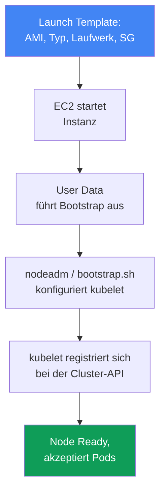
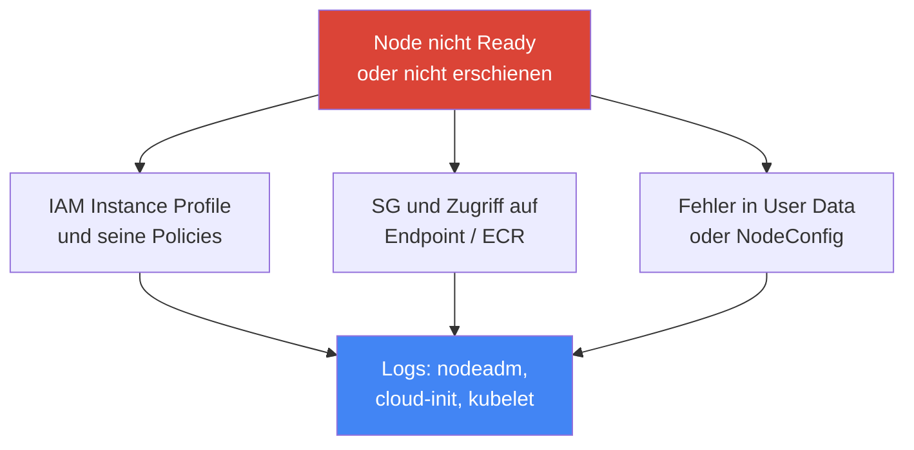

[Eng version](en.md) · [Versión en español](es.md) · [Version française](fr.md) · [Русская версия](ru.md) · [ქართული ვერსია](ge.md) · [繁體中文版](tw.md) · [日本語版](jp.md)
# Kapitel 10. AMI und Bootstrap: AL2023, Bottlerocket, Launch Templates, kubelet und User Data

> **Wie es weitergeht.** In Kapitel 9 haben wir Rechentypen und die Entscheidung zwischen Auto Mode und dem eigenen Stack behandelt.
> Wenn Sie eine Managed Node Group oder selbstverwaltete Nodes einsetzen, stellt sich die Frage: Welches Image läuft auf der Node,
> wie wird sie gebootet und wie tritt sie dem Cluster bei? Dieses Kapitel behandelt das Image (AL2023, Bottlerocket,
> das auslaufende AL2), das Launch Template und Bootstrap – den Moment, in dem aus einer nackten EC2 eine funktionierende
> Node wird. Autoscaling und Karpenter folgen in den Kapiteln 11–12, Spot in Kapitel 13, Dichte und `max-pods`
> in den Kapiteln 6 und 14, AMI-Rotation beim Upgrade in Kapitel 38, Node-Hardening (IMDSv2, Hop Limit)
> in Kapitel 19 und ausführliches Node-Troubleshooting in Kapitel 45.

## 10.1. „Die Node ist nicht hochgekommen, und auf der alten gab es sechs Monate lang keine Patches“

Das Image einer Node und ihr Bootstrap sind ein unauffälliges Thema – bis zum ersten Ausfall. Danach
zeigt es sich sofort auf mehreren teuren Arten:

- Eine neue Node wurde gestartet, **erscheint aber nicht in `kubectl get nodes`** oder bleibt in `NotReady`:
  Fehler in User Data, kubelet konnte sich nicht registrieren, während ein Incident läuft;
- die Node läuft seit sechs Monaten auf dem AMI, mit dem sie gestartet wurde, **ungepatchte CVEs im Kernel und
  Runtime** sammeln sich an, und niemand erstellt Nodes neu, denn „es funktioniert doch“;
- beim Cluster-Update ist **der Bootstrap kaputtgegangen**: Das Skript, das jahrelang Nodes beitreten ließ,
  funktioniert nicht mehr, weil sich das Imageformat geändert hat (AL2 wurde durch AL2023 ersetzt);
- ein eigenes AMI wurde erstellt, „vorsichtshalber“ mit zusätzlichen Agents versehen, und nach sechs Monaten **sind die
  Nodes auseinander gedriftet**: Einige wurden im März gebaut, andere im September, die Paketversionen stimmen nicht überein.

Keine dieser Schwierigkeiten betrifft Kubernetes an sich. Alle vier betreffen, **woraus eine Node besteht und wie
sie gebootet wird**. Im Folgenden der Reihe nach: Was ein AMI ist, welche Imagevarianten es gibt, wie aus einer
Instanz eine Cluster-Node wird und wo das scheitern kann.

## 10.2. AMI: Warum nicht „einfach Linux“

Ein AMI (Amazon Machine Image) ist die Vorlage, aus der EC2 das Instanzlaufwerk bereitstellt: Kernel, Dateisystem,
vorinstallierte Software und Einstellungen. Sie können jedes Linux-Image nehmen und alles installieren, was eine
Node benötigt, aber das tut man nicht: Man verwendet **EKS-optimierte AMIs**, und dafür gibt es einen Grund.

Eine Kubernetes-Node ist kein „Server mit Linux“, sondern eine Kombination bestimmter Komponenten in passenden
Versionen, die zur Control Plane passen müssen. Das Image enthält sie bereits abgestimmt:

- **`kubelet`** in der erforderlichen Minor-Version (der Version Skew zur Control Plane ist begrenzt, Kapitel 3);
- **`containerd`** als Container Runtime sowie dessen Einstellungen;
- Dienstprogramme zur Node-Registrierung und **Bootstrap-Logik** (`nodeadm` auf AL2023);
- vorinstallierte Abhängigkeiten für VPC CNI und andere Add-ons.

Dies manuell zusammenzustellen bedeutet, Build, Tests und Versionssynchronisierung zu übernehmen, die AWS bereits
leistet. Daher ist ein optimiertes Image der Standard; ein eigenes AMI wird nur aus einem konkreten Grund verwendet (10.8).

## 10.3. Imagevarianten: AL2023, Bottlerocket, Windows, AL2

EKS-optimierte Images gibt es in mehreren Familien. Die Wahl zwischen ihnen bestimmt das Modell für Debugging
und Node-Updates, nicht nur „welches Linux darauf läuft“.

- **AL2023** ist die vollständige Distribution Amazon Linux 2023: vertrautes Dateisystem, Paketmanager `dnf`
  und bekannte Debugging-Werkzeuge. Der Standard für neue Managed Node Groups. Es benötigt mindestens VPC CNI
  `1.16.2` und aktiviert standardmäßig IMDSv2.
- **Bottlerocket** ist ein minimales Betriebssystem für Container: **read-only root**, ohne Paketmanager,
  Aktualisierung **als vollständiges Image** (image-basiert, atomar und mit Rollback). Verwaltung erfolgt über
  **API statt SSH**; für den Zugriff gibt es den **Control-Container** (reguläre Verwaltung, SSM) und den
  **Admin-Container** (Debugging, SSH, standardmäßig deaktiviert).
- **Windows** ist für Workloads mit Windows-Containern gedacht; Nodes treten mit eigenem Bootstrap bei.
- **AL2** ist das auslaufende Amazon Linux 2. Wichtig: **Kubernetes 1.32 ist die letzte Version, für die EKS AL2-AMIs
  veröffentlicht. Ab 1.33 bleiben nur AL2023 und Bottlerocket.** AWS stellte die Veröffentlichung von AL2-AMIs Ende November
  2025 ein. Für neue Cluster sollte AL2 nicht mehr verwendet werden.

| Image | Was es ist | Debugging und Zugriff | Update | Wann verwenden |
|---|---|---|---|---|
| AL2023 | vollständige Distribution, `dnf` | vertraut, SSH/SSM | Paketupdates, Node-Rotation | Standard für Linux-Nodes |
| Bottlerocket | minimales Betriebssystem für Container | API, Control-/Admin-Container | vollständiges Image, atomar | Hardening, minimale Angriffsfläche |
| Windows | Image für Windows-Nodes | Windows-Werkzeuge | eigener Zyklus | Windows-Container |
| AL2 | auslaufendes Amazon Linux 2 | vertraut | bis 1.32, danach nicht mehr | nur Legacy bis zur Migration |

Die Wahl zwischen AL2023 und Bottlerocket ist eine Modellentscheidung: „vertrauter Server, auf den man sich
anmelden kann“ oder „versiegeltes Appliance mit minimaler Angriffsfläche“. Auto Mode (Kapitel 9) verwendet intern
Bottlerocket, aber dort wählen Sie das Image nicht selbst.

## 10.4. Wie eine Instanz zur Cluster-Node wird

Zwischen „EC2 wurde gestartet“ und „die Node akzeptiert Pods“ liegt eine Kette, die man vollständig im Kopf haben
sollte: Sie ist zugleich die Karte der Fehlerstellen.



Das **Launch Template** legt fest, wie die Instanz aussieht: AMI, Instanztyp, Größe und Typ des Laufwerks,
Security Groups, IAM Instance Profile, User Data und IMDS-Einstellungen. **User Data** ist ein Skript oder
Konfigurationsdatei, das bzw. die beim ersten Start ausgeführt wird und den **Bootstrap** startet: Dieser konfiguriert
`kubelet` (API-Adresse, CA, Clustername, Labels, Taints, `--max-pods`) und startet ihn. `kubelet` registriert sich
bei der Cluster-API, die Node wird `Ready` und beginnt, Pods anzunehmen.

Der entscheidende Punkt: **Die Parameter sind gleich, aber das Bootstrap-Format unterscheidet sich je nach Image**.
Clustername, API-Endpoint, CA-Zertifikat, Service CIDR, `max-pods`, Labels und Taints werden in allen Fällen
übergeben, aber unterschiedlich geschrieben.

| Image | Bootstrap-Format | Wie Parameter übergeben werden |
|---|---|---|
| AL2023 | `nodeadm`, YAML `NodeConfig` | Felder `spec.cluster` und `spec.kubelet` in User Data |
| Bottlerocket | Einstellungen im TOML-Format | Abschnitte `[settings.kubernetes]` in User Data |
| AL2 (bis 1.32) | Skript `bootstrap.sh` | Skriptargumente und `--kubelet-extra-args` |

Genau beim Formatwechsel bricht der Bootstrap beim Upgrade: Das alte `bootstrap.sh` von AL2 versteht AL2023 nicht,
wo `nodeadm` seine Rolle übernommen hat.

## 10.5. nodeadm und NodeConfig auf AL2023

Auf AL2023 übernimmt `nodeadm` die Initialisierung der Node, und seine Eingabe ist ein YAML-Manifest `NodeConfig`.
Dies ersetzt das Skript `bootstrap.sh`: Statt Positionsargumenten und `--kubelet-extra-args` beschreiben Sie die
Node deklarativ.

```yaml
---
apiVersion: node.eks.aws/v1alpha1
kind: NodeConfig
spec:
  cluster:
    name: demo
    apiServerEndpoint: https://XXXXXXXX.gr7.us-west-2.eks.amazonaws.com
    certificateAuthority: <base64-CA>
    cidr: 10.100.0.0/16
  kubelet:
    config:
      maxPods: 110
      systemReserved:
        cpu: 100m
        memory: 200Mi
      kubeReserved:
        cpu: 100m
        memory: 500Mi
    flags:
      - --node-labels=role=apps
```

Über `kubelet` werden Ressourcen für Systemprozesse reserviert, damit Pods nicht Dämonen verdrängen und die
Node nicht `NotReady` wird. `systemReserved` reserviert CPU und Arbeitsspeicher für das Betriebssystem (systemd, sshd),
`kubeReserved` für `kubelet` und `containerd` selbst. Auf AL2023 werden sie in `kubelet.config`
(oben) gesetzt, auf Bottlerocket in denselben TOML-Einstellungen in separaten Abschnitten:

```toml
[settings.kubernetes]
cluster-name = "demo"
api-server = "https://XXXXXXXX.gr7.us-west-2.eks.amazonaws.com"
cluster-certificate = "<base64-CA>"
cluster-dns-ip = "10.100.0.10"
max-pods = 110

[settings.kubernetes.system-reserved]
cpu = "100m"
memory = "200Mi"

[settings.kubernetes.kube-reserved]
cpu = "100m"
memory = "500Mi"
```

Dies ist derselbe Parametersatz wie in `NodeConfig`, jedoch mit dem Bottlerocket-Konfigurator geschrieben:
Clustermetadaten und `max-pods` in `[settings.kubernetes]`, Reservierungen in untergeordneten Abschnitten.

`maxPods` in `NodeConfig` ist ein statischer Wert, und `nodeadm` berechnet ihn bei Prefix Delegation nicht selbst
neu: Haben Sie Präfixe aktiviert (Kapitel 7), berechnen Sie die Obergrenze und tragen sie hier ein. Bei Nodes,
die Karpenter startet, liegen dieselben `kubelet`-Einstellungen nicht in User Data, sondern in
`EC2NodeClass` (`spec.kubelet`): `maxPods` wird dort explizit gesetzt, oder stattdessen wird `podsPerCore`
verwendet; dann wird die Dichte aus der Anzahl vCPUs der Instanz berechnet, ohne `maxPods` zu überschreiten.
Karpenter erzeugt `NodeConfig` selbst, und dessen Werte überschreiben, was Sie in `userData` geschrieben haben.
Daher werden diese Felder ausschließlich über `EC2NodeClass` gesetzt (Mechanik: Kapitel 12).

Ein wichtiges Betriebsdetail: Auf AL2 hat `bootstrap.sh` die Clustermetadaten (`certificateAuthority`, Service `cidr`)
selbst durch einen Aufruf von `DescribeCluster` abgerufen. Auf AL2023 müssen bei **eigenem Launch Template oder
benutzerdefiniertem AMI** diese Felder explizit an `NodeConfig` übergeben werden: Der zusätzliche API-Aufruf wurde
entfernt, damit er beim massenhaften Starten von Nodes nicht durch Throttling scheitert. Wenn Sie eine Managed Node Group
**ohne** eigenes Launch Template oder Karpenter verwenden, wird dies automatisch ausgefüllt. Ein benutzerdefiniertes
Launch Template auf AL2023 verlangt daher eine sorgfältige `NodeConfig` und kein „altes Skript“.

## 10.6. Woher die Image-ID kommt: SSM-Parameter

Die AMI-ID wird **nicht hartcodiert**. Sie ist in jeder Region anders, hängt von Kubernetes-Minor-Version,
Architektur und Imagevariante ab und ändert sich mit jedem Release mit neuen Patches. Ein im Code fest verankertes
`ami-...` bedeutet nach einem Monat eine Node mit altem Kernel. Stattdessen wird die ID aus dem **SSM Parameter Store**
gelesen, in dem AWS aktuelle Werte veröffentlicht. Die Berechtigung `ssm:GetParameter` ist erforderlich.

```bash
# AL2023, x86_64, Standardvariante – eigene Version und Region einsetzen
aws ssm get-parameter \
  --name /aws/service/eks/optimized-ami/1.33/amazon-linux-2023/x86_64/standard/recommended/image_id \
  --region us-west-2 --query "Parameter.Value" --output text

# Bottlerocket, x86_64, Variante ohne GPU
aws ssm get-parameter \
  --name /aws/service/bottlerocket/aws-k8s-1.33/x86_64/latest/image_id \
  --region us-west-2 --query "Parameter.Value" --output text
```

| Image | SSM-Parameter (Muster) |
|---|---|
| AL2023 x86_64 | `/aws/service/eks/optimized-ami/<Version>/amazon-linux-2023/x86_64/standard/recommended/image_id` |
| AL2023 arm64 | `/aws/service/eks/optimized-ami/<Version>/amazon-linux-2023/arm64/standard/recommended/image_id` |
| AL2023 NVIDIA | `/aws/service/eks/optimized-ami/<Version>/amazon-linux-2023/x86_64/nvidia/recommended/image_id` |
| Bottlerocket | `/aws/service/bottlerocket/aws-k8s-<Version>/<arch>/latest/image_id` |

Die Bindung an die Minor-Version im Pfad ist keine Formalität: Sie stellt sicher, dass `kubelet` im Image zur
Control Plane passt. Beim Cluster-Upgrade ändern Sie die Version im SSM-Pfad und erhalten ein AMI mit `kubelet`
der nächsten Version (den Rotationsprozess beim Upgrade behandelt Kapitel 38).

## 10.7. Launch Template im Detail

Eine Managed Node Group wird **immer** über ein Launch Template bereitgestellt. Wenn Sie keines angeben, erstellt EKS
ein eigenes automatisch – und dieses sollte **nicht manuell bearbeitet** werden. Dasselbe gilt für das ASG unter der
Gruppe (darauf wurde in Kapitel 9 hingewiesen: EKS muss den Lebenszyklus der Instanzen selbst verwalten). Eigene
Kontrolle entsteht, wenn Sie die Gruppe **von Anfang an** mit einem eigenen Launch Template erstellen: Dann lässt sich
die Konfiguration über neue Template-Versionen ändern.

Ein Launch Template ist **versioniert**: Jede Änderung ergibt eine neue Version, die alten bleiben bestehen. Ein
Versionswechsel für die Gruppe **erstellt alle Nodes** mit der neuen Konfiguration neu und drainiert sie ordentlich.
Ein Teil der Einstellungen wird **nur** im Launch Template gesetzt, ein anderer **nur** in der Konfiguration der
Node Group; Duplikate sind nicht zulässig, andernfalls scheitert die Erstellung oder Aktualisierung.

| Einstellung | Wo sie gesetzt wird |
|---|---|
| Benutzerdefinierte AMI-ID | nur im Launch Template |
| Größe und Typ des Laufwerks | im Launch Template (wenn es ein eigenes ist) |
| User Data / Bootstrap | im Launch Template |
| IMDS-Einstellungen (Hop Limit, IMDSv2) | im Launch Template (Hardening: Kapitel 19) |
| Security Groups für Remote Access | nur im Launch Template |
| Subnetze (subnets) | nur in der Node-Group-Konfiguration |
| IAM-Rolle der Node (node role) | nur in der Node-Group-Konfiguration |
| Scaling Config (min/max/desired) | nur in der Node-Group-Konfiguration |

```bash
# Versionen des eigenen Launch Templates anzeigen
aws ec2 describe-launch-template-versions \
  --launch-template-id lt-0abc123 \
  --query "LaunchTemplateVersions[].{v:VersionNumber,ami:LaunchTemplateData.ImageId}"

# Mit welchem Launch Template und welcher Version die Node Group verbunden ist
aws eks describe-nodegroup --cluster-name demo --nodegroup-name apps \
  --query "nodegroup.launchTemplate"
```

IMDS-Einstellungen im Launch Template dienen ebenfalls dem Hardening. Standardmäßig beträgt das Hop Limit 2, und ein
Pod aus einem Container kann die Metadaten der Node und ihre IAM-Rolle erreichen. IMDSv2 wird erzwungen und der Pfad
zu den Metadaten direkt im Template eingeschränkt:

```bash
# Neue Template-Version: IMDSv2-Token verpflichtend und Hop Limit 1
aws ec2 create-launch-template-version --launch-template-id lt-0abc123 \
  --source-version 1 --launch-template-data \
  'MetadataOptions={HttpTokens=required,HttpPutResponseHopLimit=1,HttpEndpoint=enabled}'
```

`HttpTokens=required` aktiviert IMDSv2 (Token-Anforderung statt eines einfachen GET),
`HttpPutResponseHopLimit=1` verhindert, dass die Metadatenantwort den Host verlässt, sodass ein Pod im
Container sie nicht erreichen kann.

Es gibt genau eine Einschränkung, die man oft zu spät erfährt: Dies funktioniert, weil das Paket eines Pods durch
seinen eigenen Netzwerk-Namespace läuft und einen zusätzlichen Hop macht. Ein Pod mit `hostNetwork: true` lebt im
Netzwerk-Stack der Node; sein Paket benötigt nur einen Hop, und **solch ein Pod kann bei jedem Hop Limit auf die
Metadaten mit den Anmeldedaten der Node-Rolle zugreifen**. Das lässt sich nicht durch eine Launch-Template-Einstellung
schließen, sondern auf zwei andere Arten: durch das Verbieten von `hostNetwork` über Pod Security Admission und indem
die Node-Rolle schlicht keine Anwendungsberechtigungen hat – diese erhält der Pod über IRSA oder Pod Identity
(Kapitel 16, 17 und 19). Ausführliches Node-Hardening folgt in Kapitel 19.

Das praktische Fazit: Image- und Bootstrap-Einstellungen (AMI, Laufwerk, User Data, IMDS) liegen im Launch Template
und werden dort versioniert; Netzwerk, Rolle und Skalierung liegen in der Konfiguration der Node Group. Nicht vermischen
und das automatisch generierte Template nicht bearbeiten.

## 10.8. Benutzerdefiniertes AMI: Wann es gerechtfertigt ist und welchen Preis Sie zahlen

Ein eigenes AMI wird nicht verwendet, „um generell Kontrolle zu haben“, sondern wegen einer konkreten Anforderung,
die das optimierte Image nicht erfüllt:

- **regulatorische Anforderungen und Zertifizierung**: Das Image muss einen internen Security-Prozess durchlaufen,
  CIS-Hardening oder einen bestimmten Standard-Build enthalten;
- **vorkonfigurierte Agents**: Monitoring, Antivirus oder Security-Agent sind bereits im Image, damit die Node
  betriebsbereit startet, statt beim Start nachinstalliert zu werden;
- **spezifische Treiber und Kernel**: besondere GPU-Treiber, Kernelversion oder Module für den Workload.

Der Preis dafür ist, dass die gesamte Image-Pipeline bei Ihnen liegt:

- **eigener Build**: eine Pipeline, die das Image regelmäßig erstellt, sonst bleiben Nodes auf alten Ständen;
- **eigene Patches**: CVEs im Kernel und in Paketen schließen Sie selbst, statt sie fertig aus einem AWS-Release zu erhalten;
- **Drift**, wenn manuell gebaut wird: Images aus verschiedenen Builds unterscheiden sich bei Paketversionen –
  genau das Problem aus Abschnitt 10.1;
- **Version Skew**: Wenn das Image hinter dem Cluster zurückliegt, kann sein `kubelet` außerhalb der
  Kompatibilitätsgrenzen zur Control Plane liegen (Kapitel 3).

Der richtige Ansatz besteht nicht darin, „bei null“ zu beginnen, sondern ein **EKS-optimiertes AMI als Basis** zu
nehmen und es mit einem Image Builder (beispielsweise EC2 Image Builder) reproduzierbar zu einem **Golden Image**
weiterzubauen. AWS veröffentlicht die offenen Build-Skripte dieser Images, die Basis und der Prozess sind also
transparent. Ein einmaliges manuell gebautes Image ist ein direkter Weg zu Drift.

## 10.9. Diagnose: „Node nicht Ready“

Wenn eine Node nicht erscheint oder in `NotReady` bleibt, liegt die Ursache fast immer an einer von wenigen Stellen;
suchen Sie sie in den Bootstrap-Logs, statt zu raten.



Typische Ursachen nach Häufigkeit:

- **IAM Instance Profile ohne benötigte Policies**: Die Node-Rolle hat keine Berechtigung beizutreten oder
  Images aus ECR zu pullen, kubelet besteht die Autorisierung nicht;
- **Security Groups und Netzwerkzugriff**: Die Node erreicht weder den API-Endpoint des Clusters noch ECR;
- **fehlerhafter Bootstrap**: kaputte `NodeConfig`, `certificateAuthority`/`cidr` wurden auf AL2023 mit eigenem
  Launch Template nicht übergeben, Tippfehler in User Data;
- **Versionskonflikt**: `kubelet` aus dem Image liegt außerhalb der Kompatibilitätsgrenzen zur Control Plane.

Wo auf der Node nachgesehen werden sollte (sofern Zugriff besteht – auf AL2023, nicht über SSH auf Bottlerocket):

```bash
sudo cat /var/log/cloud-init-output.log            # User-Data- und cloud-init-Logs
sudo journalctl -u kubelet --no-pager | tail -50   # kubelet-Status und -Logs
sudo journalctl -u nodeadm-config -u nodeadm-run   # nodeadm-Logs auf AL2023
```

Das ist der erste Überblick, um die Problemklasse zu verstehen. Eine vollständige Analyse von „Node ist nicht
beigetreten“ mit Ursachenbaum finden Sie in Kapitel 45; dort gibt es auch Diagnose ohne Zugriff auf die Node und
typische Fehlermeldungen.

## 10.10. Wie dies in der Produktion eingesetzt wird

- **Die Image-ID wird anhand der Minor-Version aus SSM gelesen**, nicht hartcodiert: So passt `kubelet` im AMI
  zur Control Plane, und Patches kommen mit neuen Releases.
- **Nodes werden regelmäßig neu erstellt**, statt monatelang auf einem alten AMI zu laufen: Ein frisches Image
  bringt frische Kernel- und Runtime-Patches, die Rotation schließt CVEs ohne manuelles Patchen.
- **Ein benutzerdefiniertes AMI wird nur bei einer Anforderung** (Zertifizierung, Agents, Treiber) eingesetzt und
  über einen Image Builder auf dem optimierten AMI gebaut, nicht manuell, um Drift zu vermeiden.
- **Bottlerocket wird gewählt, wenn eine minimale Angriffsfläche wichtig ist**: read-only root, Image-Update,
  Zugriff über API und Control-Container statt offenem SSH.
- **Ein eigenes Launch Template wird direkt beim Erstellen der Node Group angelegt**; das automatisch generierte
  Template und das ASG unter der Gruppe werden nicht manuell verändert.
- **Auf AL2023 wird mit eigenem Launch Template `NodeConfig` geprüft**: `apiServerEndpoint`,
  `certificateAuthority` und `cidr` müssen explizit übergeben werden.

## 10.11. Mini-Glossar

- **AMI (Amazon Machine Image)** ist eine Vorlage für das Instanzlaufwerk: Kernel, Dateisystem, Software. Für Nodes
  wird ein EKS-optimiertes AMI verwendet, in dem `kubelet`, `containerd` und Bootstrap-Logik bereits abgestimmt sind.
- **EKS-optimiertes AMI** ist ein AWS-Image mit Node-Komponenten in den benötigten Versionen; die Familien sind
  AL2023, Bottlerocket, Windows und das auslaufende AL2.
- **Bottlerocket** ist ein minimales Betriebssystem für Container: read-only root, Aktualisierung als vollständiges Image,
  Verwaltung über API, Control- und Admin-Container anstelle von offenem SSH.
- **nodeadm** ist der Node-Initialisierer auf AL2023; seine Eingabe ist das YAML-Manifest `NodeConfig`
  (`apiVersion: node.eks.aws/v1alpha1`) als Ersatz für das Skript `bootstrap.sh`.
- **User Data** ist ein Skript oder eine Konfiguration, das bzw. die beim ersten Start der Instanz ausgeführt wird;
  es bzw. sie startet Bootstrap und konfiguriert `kubelet`.
- **Launch Template** ist eine versionierte Instanzvorlage (AMI, Typ, Laufwerk, SG, User Data, IMDS);
  eine Managed Node Group wird immer darüber bereitgestellt.
- **Golden Image** ist ein reproduzierbares benutzerdefiniertes Image, das über einem optimierten AMI mit einem
  Image Builder erstellt wird.

## 10.12. Zusammenfassung des Kapitels

- Eine Node ist kein „Server mit Linux“, sondern ein abgestimmter Satz aus `kubelet`, `containerd` und Bootstrap;
  dafür wird ein EKS-optimiertes AMI verwendet, keine nackte Distribution.
- Die Imagefamilien sind AL2023 (vollständige Distribution, `dnf`, vertrautes Debugging), Bottlerocket
  (minimales Betriebssystem, read-only root, API statt SSH), Windows und das auslaufende AL2.
- Kubernetes 1.32 ist die letzte Version mit AL2-AMI; ab 1.33 bleiben nur AL2023 und Bottlerocket,
  AWS hat die Veröffentlichung von AL2-AMIs eingestellt.
- Eine Instanz wird über die Kette Launch Template, User Data, Bootstrap und kubelet-Registrierung zur Node.
  Die Parameter sind gleich, Bootstrap-Formate unterschiedlich: nodeadm YAML, TOML, `bootstrap.sh`.
- Auf AL2023 übernimmt `nodeadm` die Initialisierung mit dem Manifest `NodeConfig`; bei eigenem Launch Template
  müssen `certificateAuthority` und Service `cidr` explizit übergeben werden.
- Die AMI-ID wird nicht hartcodiert, sondern nach Minor-Version, Region und Variante aus SSM gelesen; so passt
  `kubelet` zur Control Plane. Eine Managed Node Group läuft immer über ein Launch Template.
- Im Launch Template werden IMDSv2 (`HttpTokens=required`) und Hop Limit 1 erzwungen; über `kubelet`
  werden Ressourcen (`systemReserved`, `kubeReserved`) reserviert, damit Pods keine Dämonen verdrängen.
- Ein benutzerdefiniertes AMI ist für Zertifizierung, Agents oder Treiber gerechtfertigt, bringt aber eine eigene
  Build-Pipeline, Patches, Risiko von Drift und Version Skew; Golden Images werden auf optimierten Images aufgebaut.
- Wenn eine Node nicht Ready ist: IAM Instance Profile, SG und Zugriff auf Endpoint/ECR sowie die Korrektheit des
  Bootstrap prüfen; Logs in cloud-init, nodeadm und `journalctl -u kubelet` ansehen (Details: Kapitel 45).

## 10.13. Wie dies in der praktischen Arbeit hilft

Image und Bootstrap bleiben unauffällig, bis sie im denkbar schlechtesten Moment versagen: beim Hochfahren von Nodes
während eines Incidents, beim Cluster-Upgrade oder bei einem Security-Audit. Ein Engineer, der die Kette vom Launch
Template bis zur kubelet-Registrierung versteht, rät im Bereitschaftsdienst nicht, sondern prüft die Fehlerstellen:
Node-Rolle, Netzwerk, User Data, nodeadm-Logs. Bei der Planung beantwortet dieselbe Karte die Fragen „Woraus sind die
Nodes gebaut?“, „Wie wird die AMI-ID bezogen?“ und „Wer erstellt sie wann neu?“. Das Wissen über den Übergang von AL2
zu AL2023 vermeidet zudem die unerquicklichste Fehlerklasse: wenn ein Upgrade nicht wegen Kubernetes scheitert,
sondern wegen eines geänderten Bootstrap-Formats.

## 10.14. Fragen zur Selbstkontrolle

1. Warum wird für Nodes ein EKS-optimiertes AMI verwendet und nicht beliebiges Linux mit nachinstallierten Paketen?
2. Worin unterscheidet sich Bottlerocket von AL2023 hinsichtlich Debugging- und Update-Modell?
3. Ab welcher Kubernetes-Version werden keine AL2-AMIs mehr veröffentlicht, und was bleibt stattdessen?
4. Beschreiben Sie die Kette vom EC2-Start bis zum Zustand `Ready` der Node. Wo liegt darin Bootstrap?
5. Wie unterscheidet sich das Bootstrap-Format bei AL2023, Bottlerocket und AL2?
6. Was sind `nodeadm` und `NodeConfig`, und warum ersetzen sie `bootstrap.sh`?
7. Welche Felder müssen bei einem eigenen Launch Template explizit an `NodeConfig` übergeben werden und warum?
8. Warum wird die AMI-ID nicht hartcodiert und woher wird sie gelesen? Welchen Nutzen hat die Versionsbindung im SSM-Pfad?
9. Welche Einstellungen werden nur im Launch Template und welche nur in der Node-Group-Konfiguration gesetzt?
10. Warum dürfen das automatisch generierte Launch Template und das ASG unter einer Managed Group nicht manuell bearbeitet werden?
11. Wann ist ein benutzerdefiniertes AMI gerechtfertigt und welchen Preis zahlen Sie dafür?
12. Wo sehen Sie zuerst nach, wenn die Node nicht erscheint oder in `NotReady` bleibt?
13. Warum sollten IMDSv2 und Hop Limit 1 erzwungen werden, und welchen Nutzen haben `systemReserved`/`kubeReserved`?

## Praxis

Das Kurs-Lab zu diesem Thema: [Lab 101 – Cluster als Code](../../labs/101/README_DE.MD). Darin
prüfen Sie, auf welchem Image die produktiven Nodes laufen (AL2023 aus dem standardmäßigen NodePool
von Karpenter); geprüft wird mit dem Befehl `check_result`. Starten Sie es mit `TASK=101 make run_eks_task`.

Neben dem Lab ist alles auf einem laufenden Cluster und über die CLI sichtbar. Beginnen Sie mit den Images:
`aws ssm get-parameter` über die Pfade aus Abschnitt 10.6 zeigt die aktuellen AMI-IDs für Ihre Version und
Region – vergleichen Sie AL2023 und Bottlerocket. Sehen Sie sich anschließend die Node Groups an: `aws eks
describe-nodegroup --cluster-name <cluster> --nodegroup-name <name> --query
"nodegroup.launchTemplate"` zeigt, ob die Gruppe an ein eigenes Launch Template gebunden ist.

Sehen Sie anschließend in das Template selbst: `aws ec2 describe-launch-template-versions --launch-template-id
<lt-id>` zeigt, welches AMI, Laufwerk und welche User Data in jeder Version gesetzt sind. Prüfen Sie auf einer Node
(wenn es AL2023 ist und Zugriff besteht) den Bootstrap: `sudo cat /var/log/cloud-init-output.log`, `sudo
journalctl -u kubelet` und die `nodeadm`-Logs. Gehen Sie die Kette aus Abschnitt 10.4 durch und beantworten Sie:
Woher kommt die AMI-ID, wann wurden die Nodes zuletzt neu erstellt und was geschieht mit dem Bootstrap bei einem
Versionsupgrade?

---
[Inhaltsverzeichnis](../README_DE.md) · [Kapitel 9](../09/de.md) · [Kapitel 11](../11/de.md)
