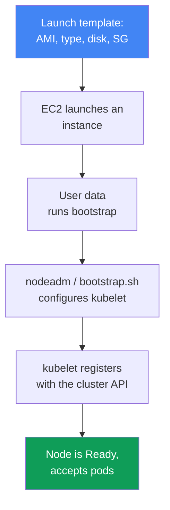
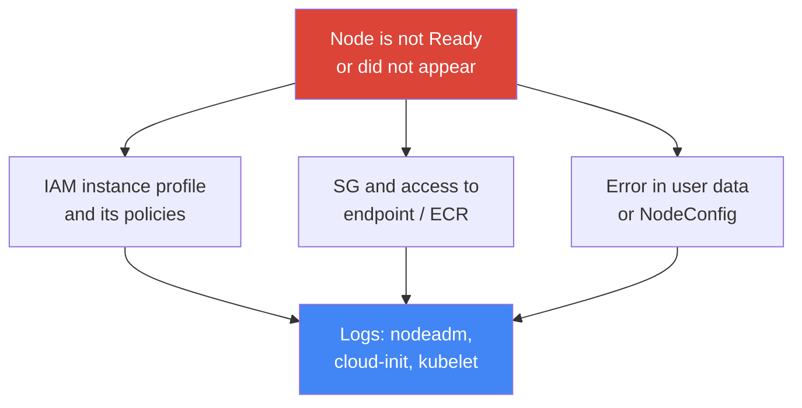

[Русская версия](ru.md) · [Versión en español](es.md) · [Version française](fr.md) · [Deutsche Version](de.md) · [ქართული ვერსია](ge.md) · [繁體中文版](tw.md) · [日本語版](jp.md)
# Chapter 10. AMIs and bootstrap: AL2023, Bottlerocket, launch templates, kubelet, and user data

> **What comes next.** Chapter 9 covered compute types and choosing Auto Mode versus your own stack. When you use managed node groups or self-managed nodes, you face the question of which image runs on the node, how it boots, and how it joins the cluster. This chapter covers the image (AL2023, Bottlerocket, the retiring AL2), launch templates, and bootstrap - the point at which a bare EC2 instance becomes a working node. Autoscaling and Karpenter are covered in Chapters 11-12, Spot in Chapter 13, density and `max-pods` in Chapters 6 and 14, AMI rotation during an upgrade in Chapter 38, node hardening (IMDSv2, hop limit) in Chapter 19, and detailed node troubleshooting in Chapter 45.

## 10.1. “The node did not come up, and the old one has not been patched for six months”

The node image and its boot process are a quiet subject only until the first failure. Then they surface in several ways at once, and all of them are expensive:

- a new node was launched, but it **does not appear in `kubectl get nodes`** or remains `NotReady`: there is an error in user data, kubelet could not register, and an incident clock is running;
- a node runs for six months on the AMI from which it was launched, **unpatched kernel and runtime CVEs** accumulate, and nobody recreates the nodes because “it works”;
- during a cluster update, **bootstrap broke**: the script that had joined nodes for years stopped working because the image format changed (AL2 was replaced by AL2023);
- a custom AMI was built, extra agents were added “just in case,” and six months later the **nodes have drifted**: some were built in March and others in September, and package versions differ.

None of these failures is about Kubernetes itself. All four are about **what the node is built from and how it boots**. Next, in order: what an AMI is, which image choices exist, how an instance becomes a cluster node, and where that process breaks.

## 10.2. AMI: why not “just Linux”

An AMI (Amazon Machine Image) is the template from which EC2 deploys an instance disk: the kernel, filesystem, preinstalled software, and configuration. You could take any Linux image and install everything a node needs on it, but that is not the usual approach: use **EKS-optimized AMIs**, for good reason.

A Kubernetes node is not “a server running Linux,” but a set of particular, compatible component versions that must match the control plane. The image already includes them in a coordinated form:

- **`kubelet`** at the required minor version (version skew with the control plane is limited; see Chapter 3);
- **`containerd`** as the container runtime and its configuration;
- node registration utilities and **bootstrap logic** (`nodeadm` on AL2023);
- preinstalled dependencies for the VPC CNI and other add-ons.

Building that manually means taking on building, testing, and version synchronization that AWS already performs. Therefore, the default is an optimized image; use a custom AMI only for a specific reason (10.8).

## 10.3. Image options: AL2023, Bottlerocket, Windows, AL2

EKS-optimized images have several families, and choosing among them determines the node debugging and update model - not merely “which Linux it is.”

- **AL2023** is a full Amazon Linux 2023 distribution: a familiar filesystem, the `dnf` package manager, and familiar debugging tools. It is the default for new managed node groups. It requires VPC CNI 1.16.2 or later and enables IMDSv2 by default.
- **Bottlerocket** is a minimal OS for containers: a **read-only root**, no package manager, and **whole-image updates** (image-based, atomic, and rollback-capable). It is managed through an **API rather than SSH**; access is available through the **control container** (standard management, SSM) and the **admin container** (debugging, SSH; disabled by default).
- **Windows** is for workloads using Windows containers; nodes join through their own bootstrap process.
- **AL2** is the retiring Amazon Linux 2. An important fact: **Kubernetes 1.32 is the last version for which EKS publishes AL2 AMIs. Starting with 1.33, only AL2023 and Bottlerocket remain.** AWS stopped publishing AL2 AMIs at the end of November 2025. AL2 should no longer be selected for new clusters.

| Image | What it is | Debugging and access | Updates | When to choose it |
|---|---|---|---|---|
| AL2023 | full distribution, `dnf` | familiar, SSH/SSM | package updates, node rotation | default for Linux nodes |
| Bottlerocket | minimal OS for containers | API, control/admin containers | whole image, atomic | hardening, minimal surface |
| Windows | image for Windows nodes | Windows tools | its own lifecycle | Windows containers |
| AL2 | retiring Amazon Linux 2 | familiar | through 1.32, not after | legacy only, until migration |

Choosing between AL2023 and Bottlerocket is a choice of model: “a familiar server you can log in to” or “a sealed appliance with minimal attack surface.” Auto Mode (Chapter 9) uses Bottlerocket internally, but you do not select the image there.

## 10.4. How an instance becomes a cluster node

Between “EC2 launched” and “the node accepts pods” is a chain worth understanding end to end; it is also a map of the places where everything breaks.



A **launch template** specifies what the instance will be: its AMI, instance type, disk size and type, security groups, IAM instance profile, user data, and IMDS settings. **User data** is a script or configuration that runs on the first boot and starts **bootstrap**: it configures `kubelet` (the API address, CA, cluster name, labels, taints, and `--max-pods`) and starts it. `kubelet` registers with the cluster API, the node becomes `Ready`, and it starts accepting pods.

The key point is that **the parameters are the same, but the bootstrap format differs by image**. The cluster name, API endpoint, CA certificate, service CIDR, `max-pods`, labels, and taints are passed in every case, but are written differently.

| Image | Bootstrap format | How parameters are passed |
|---|---|---|
| AL2023 | `nodeadm`, YAML `NodeConfig` | `spec.cluster` and `spec.kubelet` fields in user data |
| Bottlerocket | TOML-formatted settings | `[settings.kubernetes]` sections in user data |
| AL2 (through 1.32) | `bootstrap.sh` script | script arguments and `--kubelet-extra-args` |

This format change is exactly where bootstrap breaks during an upgrade: the old AL2 `bootstrap.sh` does not work with AL2023, where `nodeadm` has taken over its role.

## 10.5. nodeadm and NodeConfig on AL2023

On AL2023, `nodeadm` initializes the node, and its input is a YAML `NodeConfig` manifest. It replaces the `bootstrap.sh` script: instead of positional arguments and `--kubelet-extra-args`, you describe the node declaratively.

```yaml
---
apiVersion: node.eks.aws/v1alpha1
kind: NodeConfig
spec:
  cluster:
    name: demo
    apiServerEndpoint: https://XXXXXXXX.gr7.us-west-2.eks.amazonaws.com
    certificateAuthority: <base64-CA>
    cidr: 10.100.0.0/16
  kubelet:
    config:
      maxPods: 110
      systemReserved:
        cpu: 100m
        memory: 200Mi
      kubeReserved:
        cpu: 100m
        memory: 500Mi
    flags:
     - --node-labels=role=apps
```

Resources are reserved through `kubelet` for system processes so that pods do not displace daemons and cause the node to become `NotReady`. `systemReserved` keeps CPU and memory for the OS (systemd, sshd); `kubeReserved` keeps them for `kubelet` and `containerd` themselves. On AL2023, specify them in `kubelet.config` (above); on Bottlerocket, specify them in the same TOML settings in separate sections:

```toml
[settings.kubernetes]
cluster-name = "demo"
api-server = "https://XXXXXXXX.gr7.us-west-2.eks.amazonaws.com"
cluster-certificate = "<base64-CA>"
cluster-dns-ip = "10.100.0.10"
max-pods = 110

[settings.kubernetes.system-reserved]
cpu = "100m"
memory = "200Mi"

[settings.kubernetes.kube-reserved]
cpu = "100m"
memory = "500Mi"
```

This is the same set of parameters as in `NodeConfig`, but expressed through the Bottlerocket configurator: cluster metadata and `max-pods` are in `[settings.kubernetes]`, while reservations are in child sections.

`maxPods` in `NodeConfig` is static, and `nodeadm` does not recalculate it for prefix delegation: if you enable prefixes (Chapter 7), calculate the limit and enter it here. For nodes launched by Karpenter, the same `kubelet` settings live not in user data but in `EC2NodeClass` (`spec.kubelet`): set `maxPods` explicitly there, or use `podsPerCore` instead, in which case density is calculated from the instance vCPU count without exceeding `maxPods`. Karpenter generates `NodeConfig` itself, and its values override what you put in `userData`, so set these fields only through `EC2NodeClass` (mechanics in Chapter 12).

An important operational detail: on AL2, `bootstrap.sh` fetched cluster metadata (`certificateAuthority`, service `cidr`) itself with a `DescribeCluster` call. On AL2023, when using **your own launch template or a custom AMI**, pass these fields **explicitly** in `NodeConfig`: the extra API call was removed so it would not hit throttling when nodes scale out in large numbers. If you use a managed node group **without** your own launch template, or Karpenter, these fields are populated for you. Therefore, a custom launch template on AL2023 requires careful `NodeConfig`, rather than an “old script.”

## 10.6. Where to get an image ID: SSM parameters

Do **not hardcode** an AMI ID. It differs in every Region, depends on the Kubernetes minor version, architecture, and image variant, and changes with every release containing new patches. An `ami-...` pinned in code means a node with an old kernel a month later. Instead, obtain the ID from **SSM Parameter Store**, where AWS publishes current values. You need the `ssm:GetParameter` permission.

```bash
# AL2023, x86_64, standard variant - substitute your version and Region
aws ssm get-parameter \
  --name /aws/service/eks/optimized-ami/1.33/amazon-linux-2023/x86_64/standard/recommended/image_id \
  --region us-west-2 --query "Parameter.Value" --output text

# Bottlerocket, x86_64, non-GPU variant
aws ssm get-parameter \
  --name /aws/service/bottlerocket/aws-k8s-1.33/x86_64/latest/image_id \
  --region us-west-2 --query "Parameter.Value" --output text
```

| Image | SSM parameter (pattern) |
|---|---|
| AL2023 x86_64 | `/aws/service/eks/optimized-ami/<version>/amazon-linux-2023/x86_64/standard/recommended/image_id` |
| AL2023 arm64 | `/aws/service/eks/optimized-ami/<version>/amazon-linux-2023/arm64/standard/recommended/image_id` |
| AL2023 NVIDIA | `/aws/service/eks/optimized-ami/<version>/amazon-linux-2023/x86_64/nvidia/recommended/image_id` |
| Bottlerocket | `/aws/service/bottlerocket/aws-k8s-<version>/<arch>/latest/image_id` |

The minor-version binding in the path is not a formality: it guarantees that the `kubelet` in the image matches the control plane. When upgrading the cluster, change the version in the SSM path to obtain an AMI with the next `kubelet` version (the rotation process during an upgrade is covered in Chapter 38).

## 10.7. Launch templates in practice

A managed node group **always** deploys through a launch template. If you do not provide one, EKS creates an automatic one - and you **must not manually edit it**, just as you must not directly modify the ASG beneath the group (Chapter 9 warned about this: EKS must manage the instance lifecycle itself). Your own control begins when you **initially** create a group with your own launch template: then configuration can be changed through new template versions.

A launch template is **versioned**: every change creates a new version, while old versions remain. Changing the version for a group **recreates all nodes** with the new configuration and drains them correctly. Some settings belong **only** in the launch template, and others **only** in the node group configuration; they must not be duplicated, or creation or update fails.

| Setting | Where it is configured |
|---|---|
| Custom AMI ID | launch template only |
| Disk size and type | launch template (when it is custom) |
| User data / bootstrap | launch template |
| IMDS settings (hop limit, IMDSv2) | launch template (hardening in Chapter 19) |
| Security groups for remote access | launch template only |
| Subnets | node group configuration only |
| Node IAM role (node role) | node group configuration only |
| Scaling config (min/max/desired) | node group configuration only |

```bash
# View versions of your launch template
aws ec2 describe-launch-template-versions \
  --launch-template-id lt-0abc123 \
  --query "LaunchTemplateVersions[].{v:VersionNumber,ami:LaunchTemplateData.ImageId}"

# Which launch template and version a node group uses
aws eks describe-nodegroup --cluster-name demo --nodegroup-name apps \
  --query "nodegroup.launchTemplate"
```

IMDS settings in the launch template are also hardening controls. By default, the hop limit is 2, so a pod in a container can reach node metadata and its IAM role. Enforce IMDSv2 and limit the metadata path directly in the template:

```bash
# New template version: required IMDSv2 token and hop limit 1
aws ec2 create-launch-template-version --launch-template-id lt-0abc123 \
  --source-version 1 --launch-template-data \
  'MetadataOptions={HttpTokens=required,HttpPutResponseHopLimit=1,HttpEndpoint=enabled}'
```

`HttpTokens=required` enables IMDSv2 (a token request instead of a simple GET), and `HttpPutResponseHopLimit=1` prevents the metadata response from traveling beyond the host itself, so a containerized pod cannot reach it.

There is exactly one caveat that is often discovered late: this works because a packet from a pod travels through its own network namespace and takes an extra hop. A pod with `hostNetwork: true` runs in the node network stack, so its packet fits within one hop, and **metadata containing node-role credentials is available to that pod regardless of the hop limit**. This is addressed not through a launch template setting, but in two other ways: prohibit `hostNetwork` through Pod Security Admission, and ensure that the node role simply has no application permissions - those belong to the pod through IRSA or Pod Identity (Chapters 16, 17, and 19). Detailed node hardening is covered in Chapter 19.

The practical conclusion: image and boot settings (AMI, disk, user data, IMDS) belong in the launch template and are versioned there; networking, role, and scale belong in the node group configuration. Do not mix them, and do not modify the autogenerated template.

## 10.8. Custom AMIs: when they are justified and what they cost

Use a custom AMI not “to have control in general,” but for a particular requirement the optimized image does not meet:

- **regulatory requirements and attestation**: the image must pass an internal security process, include CIS hardening, or provide a particular standards-based build;
- **preconfigured agents**: monitoring, antivirus, or a security agent is already in the image so the node comes up ready rather than installing more software at startup;
- **specific drivers and kernel**: special GPU drivers, a kernel version, or workload-specific modules.

The cost is that the entire image pipeline becomes your responsibility:

- **your own builds**: a pipeline that regularly bakes the image, otherwise nodes remain on an old one;
- **your own patches**: you remediate kernel and package CVEs rather than receiving them ready-made in an AWS release;
- **drift** if builds are manual: images from different builds diverge in package versions - the exact pain described in Section 10.1;
- **version skew**: if the image lags behind the cluster, the `kubelet` in it may fall outside the control-plane compatibility bounds (Chapter 3).

The right approach is not to build “from scratch,” but to use an **EKS-optimized AMI as the base** and bake on top of it with an image builder (for example, EC2 Image Builder), producing a reproducible **golden image**. AWS publishes the open build scripts for these images, so both the base and process are transparent. A one-off manually built image is a direct path to drift.

## 10.9. Diagnosing “node not Ready”

When a node does not appear or remains `NotReady`, the cause is almost always in one of several places; look for it in bootstrap logs rather than guessing.



Typical causes, in order of frequency:

- **IAM instance profile without required policies**: the node role lacks permission to join or pull images from ECR, and kubelet cannot authenticate;
- **security groups and network access**: the node cannot reach the cluster API endpoint or ECR;
- **incorrect bootstrap**: broken `NodeConfig`, missing `certificateAuthority`/`cidr` on AL2023 with a custom launch template, or a typo in user data;
- **version mismatch**: the `kubelet` from the image is outside the compatibility bounds with the control plane.

Where to look on the node itself (if access is available - on AL2023, not on Bottlerocket via SSH):

```bash
sudo cat /var/log/cloud-init-output.log            # user data and cloud-init logs
sudo journalctl -u kubelet --no-pager | tail -50   # kubelet status and logs
sudo journalctl -u nodeadm-config -u nodeadm-run   # nodeadm logs on AL2023
```

This is the first pass for identifying the problem class. A full “node did not join” analysis with a decision tree is in Chapter 45; it also covers diagnosis without node access and common error messages.

## 10.10. How this is used in production

- **Obtain image IDs from SSM by minor version**, rather than hardcoding them: this keeps the `kubelet` in the AMI aligned with the control plane, and patches arrive with new releases.
- **Recreate nodes regularly**, rather than keeping them on an old AMI for months: a fresh image means fresh kernel and runtime patches, and rotation remediates CVEs without manual patching.
- **Use a custom AMI only for a requirement** (attestation, agents, drivers), and build it with an image builder on top of an optimized image rather than manually, to avoid drift.
- **Choose Bottlerocket where minimal surface area matters**: a read-only root, image-based updates, and access through the API and control container instead of open SSH.
- **Create your own launch template when the node group is created**; do not manually touch the autogenerated template or the ASG beneath the group.
- **Check `NodeConfig` on AL2023 with a custom launch template**: `apiServerEndpoint`, `certificateAuthority`, and `cidr` must be passed explicitly.

## 10.11. Mini-glossary

- **AMI (Amazon Machine Image)**: an instance disk template containing the kernel, filesystem, and software. Nodes use an EKS-optimized one, where `kubelet`, `containerd`, and bootstrap logic are already coordinated.
- **EKS-optimized AMI**: an AWS image with required-version node components; families include AL2023, Bottlerocket, Windows, and the retiring AL2.
- **Bottlerocket**: a minimal OS for containers: a read-only root, whole-image updates, API management, and control and admin containers instead of open SSH.
- **nodeadm**: the AL2023 node initializer; its input is the YAML `NodeConfig` manifest (`apiVersion: node.eks.aws/v1alpha1`), replacing the `bootstrap.sh` script.
- **User data**: a script or configuration that runs on the first instance boot; it starts bootstrap and configures `kubelet`.
- **Launch template**: a versioned instance template (AMI, type, disk, SG, user data, IMDS); a managed node group always deploys through it.
- **Golden image**: a reproducible custom image built atop an optimized AMI with an image builder.

## 10.12. Chapter summary

- A node is not “a Linux server,” but a coordinated set of `kubelet`, `containerd`, and bootstrap components; use an EKS-optimized AMI rather than a bare distribution for this.
- Image families are AL2023 (full distribution, `dnf`, familiar debugging), Bottlerocket (minimal OS, read-only root, API instead of SSH), Windows, and the retiring AL2.
- Kubernetes 1.32 is the last version with AL2 AMIs; starting with 1.33, only AL2023 and Bottlerocket remain, and AWS has stopped publishing AL2 AMIs.
- An instance becomes a node through the chain of launch template, user data, bootstrap, and kubelet registration. The parameters are the same, but bootstrap formats differ: nodeadm YAML, TOML, and `bootstrap.sh`.
- On AL2023, `nodeadm` initializes the node with a `NodeConfig` manifest; with a custom launch template, pass `certificateAuthority` and service `cidr` explicitly.
- Do not hardcode AMI IDs; get them from SSM by minor version, Region, and variant so `kubelet` matches the control plane. A managed node group always uses a launch template.
- In the launch template, enforce IMDSv2 (`HttpTokens=required`) and hop limit 1, and reserve resources through `kubelet` (`systemReserved`, `kubeReserved`) so pods do not displace daemons.
- A custom AMI is justified for attestation, agents, or drivers, but brings your own build pipeline, patches, drift risk, and version skew; build a golden image on top of an optimized image.
- If a node is not Ready, check the IAM instance profile, SGs and endpoint/ECR access, and bootstrap correctness; inspect cloud-init, nodeadm, and `journalctl -u kubelet` logs (details in Chapter 45).

## 10.13. How this helps in real work

The image and bootstrap remain silent until they fail at the worst time: while scaling up nodes during an incident, during a cluster upgrade, or in a security audit. An engineer who understands the chain from launch template through kubelet registration does not guess while on call, but follows the failure points: node role, network, user data, and nodeadm logs. During planning, the same map answers “what are the nodes built on,” “how is the AMI ID obtained,” and “who recreates them and when.” Understanding the AL2-to-AL2023 transition also avoids the most frustrating class of failures - when an upgrade fails not because of Kubernetes, but because the boot format changed.

## 10.14. Self-check questions

1. Why do nodes use an EKS-optimized AMI rather than any Linux with installed packages?
2. How does Bottlerocket differ from AL2023 in its debugging and update model?
3. Starting with which Kubernetes version are AL2 AMIs no longer released, and what remains instead?
4. Describe the chain from EC2 launch to a node becoming `Ready`. Where does bootstrap fit in it?
5. How does the bootstrap format differ among AL2023, Bottlerocket, and AL2?
6. What are `nodeadm` and `NodeConfig`, and why do they replace `bootstrap.sh`?
7. Which fields must be passed explicitly in `NodeConfig` with a custom launch template, and why?
8. Why should an AMI ID not be hardcoded, and where is it obtained? What does binding to a version in the SSM path provide?
9. Which settings are configured only in a launch template, and which only in node group configuration?
10. Why must the autogenerated launch template and the ASG beneath a managed group not be edited manually?
11. When is a custom AMI justified, and what cost does it impose?
12. Where should you look first if a node does not appear or remains `NotReady`?
13. Why enforce IMDSv2 and hop limit 1, and what do `systemReserved`/`kubeReserved` provide?

## Practice

The course lab for this topic is [Lab 101 - cluster as code](../../labs/101/README.MD). In it, you check which image the worker nodes use (AL2023 from Karpenter’s default NodePool); verify with the `check_result` command. Run it with `TASK=101 make run_eks_task`.

Beyond the lab, everything is visible on a live cluster and through the CLI. Start with images: `aws ssm get-parameter` using the paths in Section 10.6 shows the current AMI IDs for your version and Region - compare AL2023 and Bottlerocket. Then inspect node groups: `aws eks describe-nodegroup --cluster-name <cluster> --nodegroup-name <name> --query "nodegroup.launchTemplate"` shows whether a group is attached to its own launch template.

Next, look into the template itself: `aws ec2 describe-launch-template-versions --launch-template-id <lt-id>` shows which AMI, disk, and user data each version defines. On a node (if it is AL2023 and access is open), inspect bootstrapping: `sudo cat /var/log/cloud-init-output.log`, `sudo journalctl -u kubelet`, and the `nodeadm` logs. Walk through the chain in Section 10.4 and answer: where does the AMI ID come from, how long ago were the nodes recreated, and what will happen to bootstrap when the version is upgraded?

---
[Table of Contents](../README.md) · [Chapter 9](../09/en.md) · [Chapter 11](../11/en.md)
