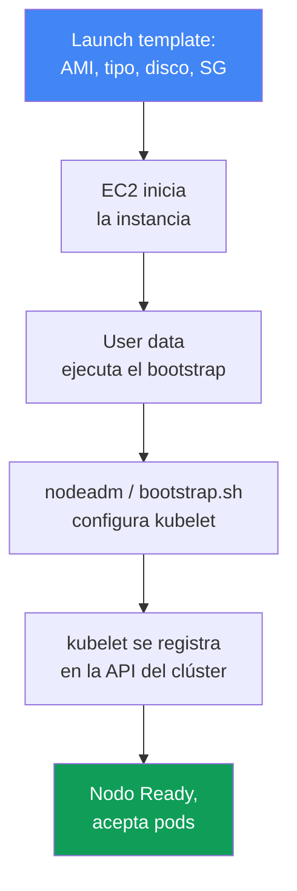
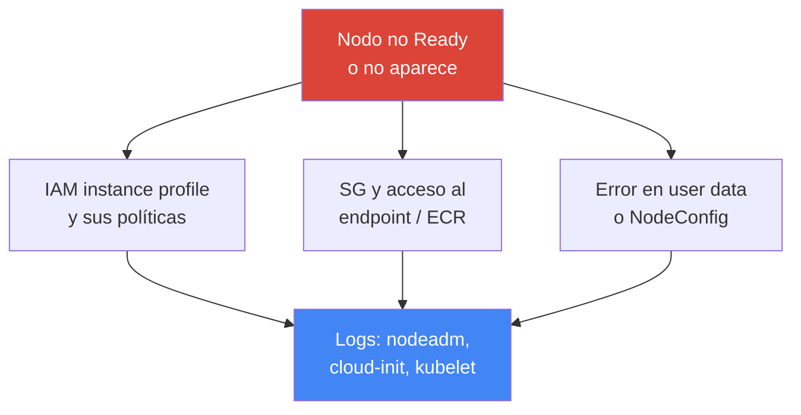

[Русская версия](ru.md) · [Eng version](en.md) · [Version française](fr.md) · [Deutsche Version](de.md) · [ქართული ვერსია](ge.md) · [繁體中文版](tw.md) · [日本語版](jp.md)
# Capítulo 10. AMI y bootstrap: AL2023, Bottlerocket, launch templates, kubelet y user data

> **Qué sigue.** En el capítulo 9 se analizaron los tipos de cómputo y la elección entre Auto Mode y tu propia pila.
> Al usar un managed node group o nodos self-managed, aparece la cuestión de qué imagen lleva el nodo,
> cómo arranca y se une al clúster. Este capítulo trata de la imagen (AL2023, Bottlerocket,
> el AL2 en desuso), el launch template y el bootstrap: el momento en que de un EC2 vacío surge un
> nodo operativo. El autoescalado y Karpenter se cubren en los capítulos 11-12, spot en el capítulo 13,
> la densidad y `max-pods` en los capítulos 6 y 14, la rotación de AMI durante una actualización en el capítulo 38,
> el hardening del nodo (IMDSv2, hop limit) en el capítulo 19 y el troubleshooting detallado de nodos en el capítulo 45.

## 10.1. «El nodo no levantó y el anterior lleva medio año sin parches»

La imagen del nodo y su arranque son un tema silencioso hasta el primer fallo. Después aparecen de
varias maneras a la vez, y todas son costosas:

- se levantó un nodo nuevo, pero **no aparece en `kubectl get nodes`** o queda en `NotReady`:
  hay un error en user data, kubelet no pudo registrarse y hay un incidente en curso;
- el nodo lleva medio año funcionando con la AMI con la que se inició, se acumulan **CVE sin parchear
  del kernel y runtime**, y nadie recrea los nodos porque «igual funciona»;
- durante la actualización del clúster **se rompió el bootstrap**: el script que durante años unía
  nodos dejó de funcionar porque cambió el formato de la imagen (AL2 pasó a AL2023);
- se construyó una AMI propia, se añadieron agentes adicionales «por si acaso», y en seis meses **los nodos
  divergieron**: unos se construyeron en marzo, otros en septiembre, y las versiones de paquetes no coinciden.

Ninguno de estos problemas trata de Kubernetes como tal. Los cuatro tratan de **con qué se construye
el nodo y cómo arranca**. A continuación, en orden: qué es una AMI, qué variantes de imagen existen,
cómo una instancia se convierte en nodo del clúster y dónde se rompe el proceso.

## 10.2. AMI: por qué no «solo Linux»

Una AMI (Amazon Machine Image) es la plantilla desde la cual EC2 despliega el disco de una instancia:
kernel, sistema de archivos, software preinstalado y configuración. Podrías tomar cualquier imagen Linux e
instalar todo lo necesario para el nodo, pero no se hace así: se usan **AMI optimizadas para EKS**, por una razón.

Un nodo Kubernetes no es un «servidor con Linux», sino un conjunto de componentes concretos, de versiones
necesarias, que deben coincidir con el control plane. La imagen ya los incluye de forma coordinada:

- **`kubelet`** de la versión minor requerida (el version skew con el control plane está limitado, capítulo 3);
- **`containerd`** como container runtime y su configuración;
- utilidades de registro de nodos y la **lógica de bootstrap** (`nodeadm` en AL2023);
- dependencias preinstaladas para VPC CNI y otros addons.

Construirlo a mano significa asumir la compilación, las pruebas y la sincronización de versiones que AWS ya
realiza. Por eso, el valor predeterminado es una imagen optimizada y se usa una AMI propia únicamente con una razón (10.8).

## 10.3. Variantes de imagen: AL2023, Bottlerocket, Windows, AL2

Las imágenes optimizadas para EKS tienen varias familias, y elegir entre ellas determina el modelo de depuración
y actualización del nodo, no solo «qué Linux lleva».

- **AL2023** es una distribución completa Amazon Linux 2023: sistema de archivos habitual, gestor de paquetes
  `dnf`, herramientas de depuración conocidas. Es el valor predeterminado para nuevos managed node groups. Requiere
  VPC CNI 1.16.2 o posterior e incluye IMDSv2 de forma predeterminada.
- **Bottlerocket** es un SO mínimo para contenedores: **raíz read-only**, sin gestor de paquetes, actualización
  de **la imagen completa** (image-based, atómica y con rollback). Se administra mediante **API, no SSH**;
  para el acceso cuenta con un **control container** (administración estándar, SSM) y un
  **admin container** (depuración, SSH, desactivado por defecto).
- **Windows** es para cargas de trabajo en contenedores Windows; los nodos se unen con su propio bootstrap.
- **AL2** es el obsoleto Amazon Linux 2. Hecho importante: **Kubernetes 1.32 es la última versión para la
  que EKS publica AMI de AL2. Desde 1.33 solo quedan AL2023 y Bottlerocket.** AWS dejó de publicar
  AMI de AL2 a finales de noviembre de 2025. Ya no debes elegir AL2 para clústeres nuevos.

| Imagen | Qué es | Depuración y acceso | Actualización | Cuándo elegirla |
|---|---|---|---|---|
| AL2023 | distribución completa, `dnf` | habitual, SSH/SSM | actualización de paquetes, rotación de nodos | predeterminado para nodos Linux |
| Bottlerocket | SO mínimo para contenedores | API, control/admin containers | imagen completa, atómica | hardening, superficie mínima |
| Windows | imagen para nodos Windows | herramientas de Windows | según su propio ciclo | contenedores en Windows |
| AL2 | Amazon Linux 2 obsoleto | habitual | hasta 1.32; después no | solo legacy hasta la migración |

Elegir entre AL2023 y Bottlerocket es elegir un modelo: «servidor habitual al que se puede acceder» o
«appliance sellado con mínima superficie de ataque». Auto Mode (capítulo 9) usa Bottlerocket internamente,
pero ahí no eliges la imagen.

## 10.4. Cómo una instancia se convierte en nodo del clúster

Entre «EC2 inició» y «el nodo acepta pods» hay una cadena que conviene tener completa en mente: también es
el mapa de los lugares donde todo falla.



El **launch template** define cómo será la instancia: qué AMI, tipo de instancia, tamaño y tipo de disco,
security groups, IAM instance profile, user data y configuración de IMDS. **User data** es el script
o la configuración que se ejecuta en el primer inicio y lanza el **bootstrap**: este configura
`kubelet` (dirección de la API, CA, nombre del clúster, labels, taints, `--max-pods`) y lo inicia. `kubelet`
se registra en la API del clúster, el nodo pasa a estar `Ready` y empieza a aceptar pods.

Punto clave: **los parámetros son los mismos, pero el formato de bootstrap difiere entre imágenes**. El nombre
del clúster, el endpoint de API, el certificado CA, el service CIDR, `max-pods`, labels y taints se pasan en
todos los casos, pero se escriben de distinta forma.

| Imagen | Formato de bootstrap | Cómo se pasan los parámetros |
|---|---|---|
| AL2023 | `nodeadm`, YAML `NodeConfig` | campos `spec.cluster` y `spec.kubelet` en user data |
| Bottlerocket | configuración en formato TOML | secciones `[settings.kubernetes]` en user data |
| AL2 (hasta 1.32) | script `bootstrap.sh` | argumentos del script y `--kubelet-extra-args` |

Precisamente el cambio de formato rompe el bootstrap durante una actualización: el antiguo `bootstrap.sh` de AL2 no
entiende AL2023, donde `nodeadm` asumió su función.

## 10.5. nodeadm y NodeConfig en AL2023

En AL2023, `nodeadm` se ocupa de la inicialización del nodo y su entrada es un manifiesto YAML `NodeConfig`.
Sustituye al script `bootstrap.sh`: en lugar de argumentos posicionales y `--kubelet-extra-args`,
describes el nodo de forma declarativa.

```yaml
---
apiVersion: node.eks.aws/v1alpha1
kind: NodeConfig
spec:
  cluster:
    name: demo
    apiServerEndpoint: https://XXXXXXXX.gr7.us-west-2.eks.amazonaws.com
    certificateAuthority: <base64-CA>
    cidr: 10.100.0.0/16
  kubelet:
    config:
      maxPods: 110
      systemReserved:
        cpu: 100m
        memory: 200Mi
      kubeReserved:
        cpu: 100m
        memory: 500Mi
    flags:
      - --node-labels=role=apps
```

Mediante `kubelet` se reservan recursos para los procesos del sistema, de modo que los pods no desplacen a los
daemons y el nodo no pase a `NotReady`. `systemReserved` reserva CPU y memoria para el SO (systemd, sshd),
y `kubeReserved` para el propio `kubelet` y `containerd`. En AL2023 se configuran en `kubelet.config`
(arriba); en Bottlerocket, en la misma configuración TOML, mediante secciones separadas:

```toml
[settings.kubernetes]
cluster-name = "demo"
api-server = "https://XXXXXXXX.gr7.us-west-2.eks.amazonaws.com"
cluster-certificate = "<base64-CA>"
cluster-dns-ip = "10.100.0.10"
max-pods = 110

[settings.kubernetes.system-reserved]
cpu = "100m"
memory = "200Mi"

[settings.kubernetes.kube-reserved]
cpu = "100m"
memory = "500Mi"
```

Es el mismo conjunto de parámetros que en `NodeConfig`, pero escrito por el configurador de Bottlerocket:
los metadatos del clúster y `max-pods` en `[settings.kubernetes]`, y las reservas en secciones hijas.

`maxPods` en `NodeConfig` es un valor estático y `nodeadm` no lo recalcula por sí solo para prefix delegation:
si habilitas prefijos (capítulo 7), calcula el límite e indícalo aquí. En los nodos que levanta Karpenter, la
misma configuración de `kubelet` no vive en user data sino en `EC2NodeClass` (`spec.kubelet`): ahí se define
explícitamente `maxPods`, o se utiliza `podsPerCore` en su lugar y entonces la densidad se calcula a partir del
número de vCPU de la instancia, sin superar `maxPods`. Karpenter genera por sí mismo el `NodeConfig` y sus valores
sobrescriben lo que escribiste en `userData`, por lo que estos campos se configuran solo mediante `EC2NodeClass`
(mecánica en el capítulo 12).

Un detalle operativo importante: en AL2, `bootstrap.sh` obtenía por sí solo los metadatos del clúster
(`certificateAuthority`, service `cidr`) mediante una llamada a `DescribeCluster`. En AL2023, con **tu propio
launch template o una AMI personalizada**, debes **pasar explícitamente** estos campos en `NodeConfig`: se eliminó
una llamada API adicional para que no sufriera throttling al levantar nodos masivamente. Si usas un managed node group
**sin** tu propio launch template o Karpenter, se completa automáticamente por ti. Por tanto, un launch template
personalizado en AL2023 requiere un `NodeConfig` cuidadoso, no el «script antiguo».

## 10.6. De dónde obtener el ID de imagen: parámetros SSM

El ID de AMI **no se hardcodea**. Es distinto en cada región, depende de la versión minor de Kubernetes,
la arquitectura y la variante de imagen, y cambia con cada release que incluye nuevos parches. Un `ami-...`
fijado en código significa un nodo con kernel antiguo al cabo de un mes. En su lugar, el ID se obtiene de
**SSM Parameter Store**, donde AWS publica los valores actuales. Necesitas el permiso `ssm:GetParameter`.

```bash
# AL2023, x86_64, variante estándar: sustituye por tu versión y región
aws ssm get-parameter \
  --name /aws/service/eks/optimized-ami/1.33/amazon-linux-2023/x86_64/standard/recommended/image_id \
  --region us-west-2 --query "Parameter.Value" --output text

# Bottlerocket, x86_64, variante sin GPU
aws ssm get-parameter \
  --name /aws/service/bottlerocket/aws-k8s-1.33/x86_64/latest/image_id \
  --region us-west-2 --query "Parameter.Value" --output text
```

| Imagen | Parámetro SSM (plantilla) |
|---|---|
| AL2023 x86_64 | `/aws/service/eks/optimized-ami/<versión>/amazon-linux-2023/x86_64/standard/recommended/image_id` |
| AL2023 arm64 | `/aws/service/eks/optimized-ami/<versión>/amazon-linux-2023/arm64/standard/recommended/image_id` |
| AL2023 NVIDIA | `/aws/service/eks/optimized-ami/<versión>/amazon-linux-2023/x86_64/nvidia/recommended/image_id` |
| Bottlerocket | `/aws/service/bottlerocket/aws-k8s-<versión>/<arch>/latest/image_id` |

La vinculación a la versión minor en la ruta no es una formalidad: garantiza que el `kubelet` de la imagen
coincida con el control plane. Al actualizar el clúster cambias la versión en la ruta SSM y obtienes una AMI con
`kubelet` de la siguiente versión (el proceso de rotación durante la actualización se trata en el capítulo 38).

## 10.7. Launch template en detalle

Un managed node group **siempre** se despliega mediante un launch template. Si no lo proporcionas, EKS crea uno
propio automático, y **no debes editarlo manualmente**, ni manipular directamente el ASG del grupo (como se advirtió
en el capítulo 9: EKS debe gestionar por sí mismo el ciclo de vida de las instancias). Tu propio control aparece cuando
**desde el inicio** creas el grupo con tu launch template: entonces puedes modificar la configuración con nuevas
versiones de la plantilla.

Un launch template está **versionado**: cada cambio es una nueva versión y las antiguas permanecen. Cambiar la
versión del grupo **recrea todos los nodos** con la nueva configuración y hace drain de ellos correctamente.
Parte de la configuración se establece **solo** en el launch template y otra parte **solo** en la configuración
del node group; no se pueden duplicar o la creación o actualización falla.

| Configuración | Dónde se define |
|---|---|
| ID de AMI personalizada | solo en el launch template |
| Tamaño y tipo de disco | en el launch template (si es propio) |
| User data / bootstrap | en el launch template |
| Configuración de IMDS (hop limit, IMDSv2) | en el launch template (hardening: capítulo 19) |
| Security groups para remote access | solo en el launch template |
| Subredes (subnets) | solo en la configuración del node group |
| Rol IAM del nodo (node role) | solo en la configuración del node group |
| Scaling config (min/max/desired) | solo en la configuración del node group |

```bash
# Consultar las versiones de tu launch template
aws ec2 describe-launch-template-versions \
  --launch-template-id lt-0abc123 \
  --query "LaunchTemplateVersions[].{v:VersionNumber,ami:LaunchTemplateData.ImageId}"

# Con qué launch template y versión está asociado el node group
aws eks describe-nodegroup --cluster-name demo --nodegroup-name apps \
  --query "nodegroup.launchTemplate"
```

La configuración de IMDS en el launch template también es hardening. De forma predeterminada, el hop limit es 2,
y un pod desde un contenedor puede alcanzar los metadatos del nodo y su rol IAM. Fuerza IMDSv2 y reduce la ruta
hacia los metadatos directamente en la plantilla:

```bash
# Nueva versión de plantilla: token IMDSv2 obligatorio y hop limit 1
aws ec2 create-launch-template-version --launch-template-id lt-0abc123 \
  --source-version 1 --launch-template-data \
  'MetadataOptions={HttpTokens=required,HttpPutResponseHopLimit=1,HttpEndpoint=enabled}'
```

`HttpTokens=required` habilita IMDSv2 (solicitud de token en lugar de un GET simple), y
`HttpPutResponseHopLimit=1` evita que la respuesta de metadatos salga del propio host, por lo que un pod en
un contenedor no puede alcanzarla.

Hay una salvedad que se suele conocer demasiado tarde: funciona porque el paquete desde un pod viaja por su propio
namespace de red y hace un hop adicional. Un pod con `hostNetwork: true` vive en la pila de red del nodo, su paquete
cabe en un hop, y **los metadatos con las credenciales del rol de nodo están disponibles para ese pod con cualquier
hop limit**. Esto no se cierra con una configuración del launch template, sino de otras dos maneras: prohibiendo
`hostNetwork` mediante Pod Security Admission y evitando que el rol del nodo tenga permisos de aplicación; estos
corresponden al pod mediante IRSA o Pod Identity (capítulos 16, 17 y 19). El hardening detallado del nodo se trata
en el capítulo 19.

Conclusión práctica: la configuración de imagen y arranque (AMI, disco, user data, IMDS) vive en el launch template
y se versiona allí; red, rol y escala viven en la configuración del node group. No las mezcles ni edites la plantilla
autogenerada.

## 10.8. AMI personalizada: cuándo se justifica y cuál es el coste

Una AMI propia no se usa «para tener control en general», sino ante un requisito específico que una imagen optimizada
no cubre:

- **requisitos regulatorios y certificación**: la imagen debe pasar un proceso interno de seguridad,
  incluir hardening CIS o una compilación concreta conforme a un estándar;
- **agentes preconfigurados**: monitorización, antivirus o agente de seguridad ya están en la imagen, para que
  el nodo arranque preparado y no haya que instalarlos al inicio;
- **drivers y kernel específicos**: drivers GPU especiales, versión de kernel o módulos para la carga de trabajo.

El coste es que todo el pipeline de imagen pasa a ser tuyo:

- **tu propia compilación**: un pipeline que cree regularmente la imagen; de lo contrario, los nodos quedan en una versión antigua;
- **tus propios parches**: tú solucionas las CVE del kernel y paquetes, en vez de recibirlas listas en un release de AWS;
- **drift**, si se compila a mano: las imágenes de distintas compilaciones divergen en versiones de paquetes,
  exactamente el problema de la sección 10.1;
- **version skew**: si la imagen queda detrás del clúster, su `kubelet` puede salir de los límites de compatibilidad
  con el control plane (capítulo 3).

El enfoque correcto no es construir «desde cero», sino tomar una **AMI optimizada para EKS como base** y hornearla
encima mediante un image builder (por ejemplo, EC2 Image Builder), obteniendo una **golden image** reproducible.
AWS publica los scripts abiertos de construcción de estas imágenes, por lo que la base y el proceso son transparentes.
Una imagen de un solo uso construida a mano es un camino directo al drift.

## 10.9. Diagnóstico de «nodo no Ready»

Cuando un nodo no aparece o queda en `NotReady`, la causa casi siempre está en uno de unos pocos lugares;
debes buscarla en los logs de bootstrap, no adivinar.



Causas típicas, por frecuencia:

- **IAM instance profile sin las políticas necesarias**: el rol del nodo no tiene permisos para unirse o extraer
  imágenes de ECR, y kubelet no supera la autorización;
- **security groups y acceso de red**: el nodo no alcanza el endpoint de API del clúster o ECR;
- **bootstrap incorrecto**: `NodeConfig` roto, no se pasaron `certificateAuthority`/`cidr` en AL2023 con
  tu propio launch template, error tipográfico en user data;
- **incompatibilidad de versiones**: el `kubelet` de la imagen está fuera de los límites de compatibilidad con el control plane.

Dónde mirar en el propio nodo (si tienes acceso: en AL2023, no mediante SSH en Bottlerocket):

```bash
sudo cat /var/log/cloud-init-output.log            # logs de user data y cloud-init
sudo journalctl -u kubelet --no-pager | tail -50   # estado y logs de kubelet
sudo journalctl -u nodeadm-config -u nodeadm-run   # logs de nodeadm en AL2023
```

Es el primer corte para comprender la clase de problema. El análisis completo de «el nodo no se unió» con árbol
de causas se encuentra en el capítulo 45; allí también se trata el diagnóstico sin acceso al nodo y los mensajes
de error típicos.

## 10.10. Cómo se aplica esto en producción

- **El ID de imagen se obtiene de SSM según la versión minor**, no se hardcodea: así el `kubelet` de la AMI coincide
  con el control plane y los parches llegan con nuevos releases.
- **Los nodos se recrean regularmente**, no se mantienen durante meses en una AMI antigua: una imagen reciente trae
  parches recientes de kernel y runtime; la rotación soluciona CVE sin parcheo manual.
- **Una AMI personalizada se usa solo ante un requisito** (certificación, agentes, drivers) y se construye mediante
  image builder sobre la optimizada, no a mano, para evitar el drift.
- **Bottlerocket se elige donde importa una superficie mínima**: raíz read-only, actualización por imagen,
  acceso mediante API y control container en vez de SSH abierto.
- **Tu propio launch template se crea desde el inicio al crear el node group**; la plantilla autogenerada y el ASG
  del grupo no se manipulan a mano.
- **En AL2023 con tu propio launch template, comprueba `NodeConfig`**: `apiServerEndpoint`,
  `certificateAuthority` y `cidr` deben pasarse explícitamente.

## 10.11. Mini glosario

- **AMI (Amazon Machine Image)**: plantilla del disco de instancia: kernel, sistema de archivos y software. Para
  los nodos se usa una optimizada para EKS, donde `kubelet`, `containerd` y la lógica de bootstrap ya están coordinados.
- **AMI optimizada para EKS**: imagen de AWS con componentes de nodo de las versiones requeridas; las familias son
  AL2023, Bottlerocket, Windows y el obsoleto AL2.
- **Bottlerocket**: SO mínimo para contenedores: raíz read-only, actualización de imagen completa,
  administración por API, control y admin containers en lugar de SSH abierto.
- **nodeadm**: inicializador de nodos en AL2023; su entrada es un manifiesto YAML `NodeConfig`
  (`apiVersion: node.eks.aws/v1alpha1`), sustituto del script `bootstrap.sh`.
- **User data**: script o configuración que se ejecuta en el primer inicio de la instancia; lanza el
  bootstrap y configura `kubelet`.
- **Launch template**: plantilla de instancia versionada (AMI, tipo, disco, SG, user data, IMDS);
  un managed node group siempre se despliega a través de ella.
- **Golden image**: imagen personalizada reproducible construida sobre una AMI optimizada mediante image builder.

## 10.12. Resumen del capítulo

- Un nodo no es un «servidor con Linux», sino un conjunto coordinado de `kubelet`, `containerd` y bootstrap;
  por ello se usa una AMI optimizada para EKS, no una distribución sin preparar.
- Las familias de imagen son AL2023 (distribución completa, `dnf`, depuración habitual), Bottlerocket
  (SO mínimo, raíz read-only, API en vez de SSH), Windows y el obsoleto AL2.
- Kubernetes 1.32 es la última versión con AMI de AL2; desde 1.33 solo quedan AL2023 y Bottlerocket;
  AWS dejó de publicar AMI de AL2.
- Una instancia se convierte en nodo mediante la cadena launch template, user data, bootstrap y registro de
  kubelet. Los parámetros son iguales, pero el formato de bootstrap difiere: YAML de nodeadm, TOML, `bootstrap.sh`.
- En AL2023, `nodeadm` inicializa usando un manifiesto `NodeConfig`; con tu propio launch template,
  debes pasar explícitamente `certificateAuthority` y service `cidr`.
- El ID de AMI no se hardcodea: se obtiene de SSM según versión minor, región y variante, para que `kubelet`
  coincida con el control plane. Un managed node group siempre usa un launch template.
- En el launch template se fuerzan IMDSv2 (`HttpTokens=required`) y hop limit 1, y mediante `kubelet` se
  reservan recursos (`systemReserved`, `kubeReserved`) para que los pods no desplacen a los daemons.
- Una AMI personalizada se justifica para certificación, agentes o drivers, pero conlleva tu propio pipeline de
  compilación, parches, riesgo de drift y version skew; se construye una golden image sobre la optimizada.
- Si un nodo no está Ready, revisa IAM instance profile, SG y acceso a endpoint/ECR, y la corrección del
  bootstrap; los logs están en cloud-init, nodeadm y `journalctl -u kubelet` (detalle en el capítulo 45).

## 10.13. Cómo será útil en el trabajo real

La imagen y el bootstrap permanecen silenciosos hasta que fallan en el peor momento: al levantar nodos durante
un incidente, actualizar el clúster o pasar una auditoría de seguridad. Un ingeniero que comprende la cadena desde
el launch template hasta el registro de kubelet no adivina durante una guardia: recorre los puntos de fallo, el
rol de nodo, la red, user data y los logs de nodeadm. Al planificar, el mismo mapa responde «de qué se componen
los nodos», «cómo se obtiene el ID de AMI», «quién y cuándo los recrea». Y conocer la transición de AL2 a AL2023
evita la clase de fallos más frustrante: cuando la actualización no falla por Kubernetes, sino por el cambio de
formato de arranque.

## 10.14. Preguntas de autoevaluación

1. ¿Por qué se usa una AMI optimizada para EKS en los nodos, en vez de cualquier Linux con paquetes instalados después?
2. ¿En qué se diferencia Bottlerocket de AL2023 en su modelo de depuración y actualización?
3. ¿Desde qué versión de Kubernetes dejan de publicarse AMI de AL2 y qué queda en su lugar?
4. Describe la cadena desde el inicio de EC2 hasta que el nodo está `Ready`. ¿Dónde se ubica el bootstrap?
5. ¿Cómo difiere el formato de bootstrap entre AL2023, Bottlerocket y AL2?
6. ¿Qué son `nodeadm` y `NodeConfig`, y por qué sustituyen a `bootstrap.sh`?
7. ¿Qué campos debes pasar explícitamente en `NodeConfig` con tu propio launch template y por qué?
8. ¿Por qué no se hardcodea el ID de AMI y de dónde se obtiene? ¿Qué aporta vincularlo a una versión en la ruta SSM?
9. ¿Qué configuraciones se establecen solo en el launch template y cuáles solo en la configuración del node group?
10. ¿Por qué no se puede editar manualmente el launch template autogenerado ni el ASG del managed group?
11. ¿Cuándo se justifica una AMI personalizada y qué precio conlleva?
12. ¿Dónde mirar primero si el nodo no aparece o queda en `NotReady`?
13. ¿Para qué forzar IMDSv2 y hop limit 1, y qué aportan `systemReserved`/`kubeReserved`?

## Práctica

El laboratorio del curso sobre este tema es el [laboratorio 101: clúster como código](../../labs/101/README_ES.MD).
En él compruebas en qué imagen viven los nodos de trabajo (AL2023 del NodePool predeterminado de
Karpenter); la comprobación se realiza con el comando `check_result`. Se inicia con `TASK=101 make run_eks_task`.

Además del laboratorio, todo puede verse en un clúster activo y con la CLI. Empieza con las imágenes:
`aws ssm get-parameter` en las rutas de la sección 10.6 mostrará los ID de AMI actuales para tu versión y
región; compara AL2023 y Bottlerocket. Después observa los node groups: `aws eks
describe-nodegroup --cluster-name <cluster> --nodegroup-name <name> --query
"nodegroup.launchTemplate"` indicará si el grupo está asociado a su propio launch template.

A continuación, examina la propia plantilla: `aws ec2 describe-launch-template-versions --launch-template-id
<lt-id>` mostrará qué AMI, disco y user data se establecen en cada versión. En un nodo (si es AL2023
y el acceso está abierto), revisa el arranque: `sudo cat /var/log/cloud-init-output.log`, `sudo
journalctl -u kubelet` y los logs de `nodeadm`. Recorre la cadena de la sección 10.4 y responde: de dónde
sale el ID de AMI, hace cuánto se recrearon los nodos y qué ocurrirá con el bootstrap al actualizar la versión.

---
[Índice](../README_ES.md) · [Capítulo 9](../09/es.md) · [Capítulo 11](../11/es.md)
