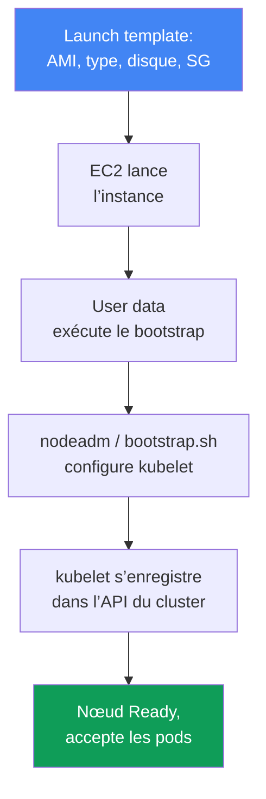
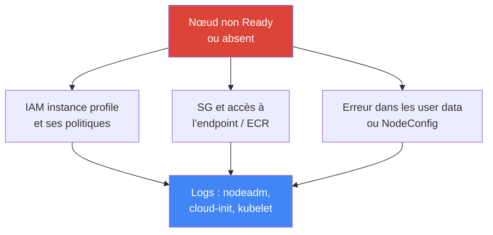

[Русская версия](ru.md) · [Eng version](en.md) · [Versión en español](es.md) · [Deutsche Version](de.md) · [ქართული ვერსია](ge.md) · [繁體中文版](tw.md) · [日本語版](jp.md)
# Chapitre 10. AMI et bootstrap : AL2023, Bottlerocket, launch templates, kubelet et user data

> **La suite.** Le chapitre 9 a présenté les types de calcul et le choix entre Auto Mode et votre
> propre stack. Dès que vous choisissez un managed node group ou des nœuds self-managed, la
> question devient : quelle image utilise le nœud, comment démarre-t-il et rejoint-il le cluster ?
> Ce chapitre porte sur l’image (AL2023, Bottlerocket, AL2 en fin de vie), le launch template et
> le bootstrap : le moment où une simple instance EC2 devient un nœud opérationnel. Autoscaling
> et Karpenter : chapitres 11-12 ; spot : chapitre 13 ; densité et `max-pods` : chapitres 6 et
> 14 ; rotation des AMI lors d’une mise à niveau : chapitre 38 ; durcissement du nœud (IMDSv2,
> hop limit) : chapitre 19 ; troubleshooting détaillé des nœuds : chapitre 45.

## 10.1. « Le nœud n’a pas démarré, et l’ancien n’a pas reçu de correctifs depuis six mois »

L’image du nœud et son démarrage sont un sujet discret jusqu’à la première panne. Ensuite, il
surgit de plusieurs manières à la fois, toutes coûteuses :

- un nouveau nœud a été lancé, mais **n’apparaît pas dans `kubectl get nodes`** ou reste en
  `NotReady` : erreur dans les user data, échec de l’enregistrement du kubelet, et un incident
  est en cours ;
- un nœud tourne depuis six mois sur l’AMI avec laquelle il a été lancé ; les **CVE non corrigées
  du noyau et du runtime** s’accumulent, et personne ne recrée les nœuds parce que « ça marche » ;
- lors de la mise à niveau du cluster, le **bootstrap a cessé de fonctionner** : le script qui
  joignait les nœuds depuis des années ne fonctionne plus, car le format de l’image a changé
  (AL2 a été remplacé par AL2023) ;
- une AMI maison a été construite, des agents supplémentaires ont été ajoutés « au cas où », puis
  six mois plus tard les **nœuds ont divergé** : certains ont été construits en mars, d’autres en
  septembre, et les versions de leurs paquets ne correspondent plus.

Aucun de ces problèmes ne concerne Kubernetes à proprement parler. Les quatre concernent **la
composition du nœud et la façon dont il démarre**. Voyons dans l’ordre ce qu’est une AMI, quels
sont les choix d’images, comment une instance devient un nœud du cluster, et où cela peut casser.

## 10.2. AMI : pourquoi pas « simplement Linux »

Une AMI (Amazon Machine Image) est le modèle à partir duquel EC2 déploie le disque d’une instance :
noyau, système de fichiers, logiciels préinstallés et paramètres. Vous pouvez utiliser n’importe
quelle image Linux et y installer tout ce dont un nœud a besoin, mais ce n’est pas l’approche
habituelle : on utilise des **AMI optimisées pour EKS**, et ce pour une raison.

Un nœud Kubernetes n’est pas « un serveur Linux », mais un ensemble précis de composants aux
bonnes versions, qui doivent correspondre au control plane. L’image les fournit déjà sous une
forme cohérente :

- **`kubelet`** à la bonne version mineure (le version skew avec le control plane est limité,
  chapitre 3) ;
- **`containerd`** en tant que container runtime, avec ses paramètres ;
- les outils d’enregistrement du nœud et la **logique de bootstrap** (`nodeadm` sur AL2023) ;
- les dépendances préinstallées pour VPC CNI et les autres add-ons.

Les assembler manuellement signifie prendre en charge la construction, les tests et la
synchronisation des versions, tâches qu’AWS assume déjà. Le défaut est donc une image optimisée ;
on ne prend une AMI maison que pour une raison précise (10.8).

## 10.3. Choix d’images : AL2023, Bottlerocket, Windows, AL2

Les images optimisées pour EKS appartiennent à plusieurs familles. Le choix entre elles détermine
le modèle de dépannage et de mise à jour du nœud, et non pas seulement « le Linux installé ».

- **AL2023** : distribution Amazon Linux 2023 complète, avec un système de fichiers classique,
  le gestionnaire de paquets `dnf` et des outils de dépannage familiers. C’est le défaut pour les
  nouveaux managed node groups. Elle exige VPC CNI version `1.16.2` ou ultérieure et active IMDSv2
  par défaut.
- **Bottlerocket** : système d’exploitation minimal pour les conteneurs, avec une **racine en
  lecture seule**, sans gestionnaire de paquets et une mise à jour **par image entière**
  (image-based, atomique avec rollback). L’administration s’effectue via une **API, pas SSH** ;
  l’accès est assuré par le **conteneur control** (administration standard, SSM) et le
  **conteneur admin** (débogage, SSH, désactivé par défaut).
- **Windows** : pour les charges exécutées dans des conteneurs Windows ; les nœuds se joignent via
  leur propre bootstrap.
- **AL2** : Amazon Linux 2 obsolète. Fait important : **Kubernetes 1.32 est la dernière version
  pour laquelle EKS publie des AMI AL2. À partir de 1.33, seuls AL2023 et Bottlerocket restent.**
  AWS a arrêté la publication des AMI AL2 à la fin novembre 2025. AL2 ne doit plus être choisi
  pour les nouveaux clusters.

| Image | Nature | Débogage et accès | Mise à jour | Quand la choisir |
|---|---|---|---|---|
| AL2023 | distribution complète, `dnf` | familier, SSH/SSM | mise à jour des paquets, rotation du nœud | défaut pour les nœuds Linux |
| Bottlerocket | OS minimal pour conteneurs | API, conteneurs control/admin | image entière, atomique | durcissement, surface minimale |
| Windows | image pour nœuds Windows | outils Windows | selon son propre cycle | conteneurs sous Windows |
| AL2 | Amazon Linux 2 obsolète | familier | jusqu’à 1.32, plus après | uniquement legacy avant migration |

Choisir entre AL2023 et Bottlerocket revient à choisir un modèle : « serveur familier sur lequel on
peut se connecter » ou « appliance scellée à surface d’attaque minimale ». Auto Mode (chapitre 9)
utilise Bottlerocket en interne, mais vous n’y choisissez pas l’image.

## 10.4. Comment une instance devient un nœud du cluster

Entre « EC2 a démarré » et « le nœud accepte des pods », il existe une chaîne qu’il est utile de
garder entièrement en tête : c’est aussi la carte des endroits où tout peut casser.



Le **launch template** définit les caractéristiques de l’instance : AMI, type d’instance, taille et
type de disque, security groups, IAM instance profile, user data et paramètres IMDS. Les
**user data** sont un script ou une configuration exécutés au premier démarrage ; ils lancent le
**bootstrap**, qui configure `kubelet` (adresse de l’API, CA, nom du cluster, labels, taints,
`--max-pods`) et le démarre. Le `kubelet` s’enregistre dans l’API du cluster, le nœud devient
`Ready` et commence à accepter les pods.

Point essentiel : **les paramètres sont les mêmes, mais le format du bootstrap diffère selon les
images**. Nom du cluster, endpoint API, certificat CA, service CIDR, `max-pods`, labels et taints
sont transmis dans tous les cas, mais sont écrits différemment.

| Image | Format du bootstrap | Transmission des paramètres |
|---|---|---|
| AL2023 | `nodeadm`, YAML `NodeConfig` | champs `spec.cluster` et `spec.kubelet` dans les user data |
| Bottlerocket | paramètres au format TOML | sections `[settings.kubernetes]` dans les user data |
| AL2 (jusqu’à 1.32) | script `bootstrap.sh` | arguments du script et `--kubelet-extra-args` |

C’est précisément lors du changement de format que le bootstrap casse à la mise à niveau : l’ancien
`bootstrap.sh` d’AL2 ne comprend pas AL2023, où `nodeadm` a repris son rôle.

## 10.5. nodeadm et NodeConfig sur AL2023

Sur AL2023, `nodeadm` assure l’initialisation du nœud et reçoit un manifeste YAML `NodeConfig`.
Il remplace le script `bootstrap.sh` : au lieu d’arguments positionnels et de
`--kubelet-extra-args`, vous décrivez le nœud de façon déclarative.

```yaml
---
apiVersion: node.eks.aws/v1alpha1
kind: NodeConfig
spec:
  cluster:
    name: demo
    apiServerEndpoint: https://XXXXXXXX.gr7.us-west-2.eks.amazonaws.com
    certificateAuthority: <base64-CA>
    cidr: 10.100.0.0/16
  kubelet:
    config:
      maxPods: 110
      systemReserved:
        cpu: 100m
        memory: 200Mi
      kubeReserved:
        cpu: 100m
        memory: 500Mi
    flags:
     - --node-labels=role=apps
```

`kubelet` permet de réserver des ressources pour les processus système, afin que les pods
n’évincent pas les démons et que le nœud ne passe pas en `NotReady`. `systemReserved` réserve
le CPU et la mémoire pour l’OS (systemd, sshd), `kubeReserved` pour `kubelet` lui-même et
`containerd`. Sur AL2023, elles sont définies dans `kubelet.config` (ci-dessus) ; sur
Bottlerocket, dans les mêmes paramètres TOML, via des sections distinctes :

```toml
[settings.kubernetes]
cluster-name = "demo"
api-server = "https://XXXXXXXX.gr7.us-west-2.eks.amazonaws.com"
cluster-certificate = "<base64-CA>"
cluster-dns-ip = "10.100.0.10"
max-pods = 110

[settings.kubernetes.system-reserved]
cpu = "100m"
memory = "200Mi"

[settings.kubernetes.kube-reserved]
cpu = "100m"
memory = "500Mi"
```

Il s’agit du même ensemble de paramètres que dans `NodeConfig`, mais écrit par le configurateur
de Bottlerocket : les métadonnées du cluster et `max-pods` dans `[settings.kubernetes]`, les
réserves dans les sections enfants.

La valeur de `maxPods` dans `NodeConfig` est statique, et `nodeadm` ne la recalcule pas lui-même
pour prefix delegation : si vous activez les préfixes (chapitre 7), calculez le plafond et
indiquez-le ici. Sur les nœuds lancés par Karpenter, les mêmes paramètres de `kubelet` ne vivent
pas dans les user data mais dans `EC2NodeClass` (`spec.kubelet`) : `maxPods` y est défini
explicitement ou remplacé par `podsPerCore`, auquel cas la densité est calculée à partir du nombre
de vCPU de l’instance, sans dépasser `maxPods`. Karpenter génère lui-même le `NodeConfig` et ses
valeurs remplacent ce que vous avez écrit dans `userData` ; définissez donc ces champs uniquement
via `EC2NodeClass` (mécanisme : chapitre 12).

Détail d’exploitation important : sur AL2, `bootstrap.sh` récupérait lui-même les métadonnées du
cluster (`certificateAuthority`, service `cidr`) via un appel `DescribeCluster`. Sur AL2023, avec
**votre propre launch template ou une AMI maison**, vous devez **fournir explicitement** ces
champs dans `NodeConfig` : l’appel API supplémentaire a été supprimé pour éviter qu’il ne soit
soumis au throttling lors d’un démarrage massif de nœuds. Si vous utilisez un managed node group
**sans** votre launch template ou Karpenter, ces informations sont renseignées automatiquement.
Un launch template personnalisé sur AL2023 exige donc un `NodeConfig` soigné, et non « l’ancien
script ».

## 10.6. Où trouver l’ID de l’image : paramètres SSM

L’ID d’une AMI **ne se hardcode pas**. Il est différent dans chaque région, dépend de la version
mineure de Kubernetes, de l’architecture et de la variante d’image, et change à chaque release
avec de nouveaux correctifs. Un `ami-...` figé dans le code signifie, un mois plus tard, un nœud
avec un ancien noyau. Utilisez plutôt **SSM Parameter Store**, où AWS publie les valeurs à jour.
L’autorisation `ssm:GetParameter` est requise.

```bash
# AL2023, x86_64, variante standard : remplacez par votre version et région
aws ssm get-parameter \
  --name /aws/service/eks/optimized-ami/1.33/amazon-linux-2023/x86_64/standard/recommended/image_id \
  --region us-west-2 --query "Parameter.Value" --output text

# Bottlerocket, x86_64, variante sans GPU
aws ssm get-parameter \
  --name /aws/service/bottlerocket/aws-k8s-1.33/x86_64/latest/image_id \
  --region us-west-2 --query "Parameter.Value" --output text
```

| Image | Paramètre SSM (modèle) |
|---|---|
| AL2023 x86_64 | `/aws/service/eks/optimized-ami/<version>/amazon-linux-2023/x86_64/standard/recommended/image_id` |
| AL2023 arm64 | `/aws/service/eks/optimized-ami/<version>/amazon-linux-2023/arm64/standard/recommended/image_id` |
| AL2023 NVIDIA | `/aws/service/eks/optimized-ami/<version>/amazon-linux-2023/x86_64/nvidia/recommended/image_id` |
| Bottlerocket | `/aws/service/bottlerocket/aws-k8s-<version>/<arch>/latest/image_id` |

La présence de la version mineure dans le chemin n’est pas une formalité : elle garantit que le
`kubelet` de l’image correspond au control plane. Lors d’une mise à niveau du cluster, vous
modifiez la version dans le chemin SSM et obtenez une AMI dont `kubelet` est à la version suivante
(processus de rotation lors d’une mise à niveau : chapitre 38).

## 10.7. Le launch template en pratique

Un managed node group est **toujours** déployé via un launch template. Si vous n’en fournissez
pas, EKS en crée un automatiquement - et il ne faut **pas le modifier manuellement**, pas plus
que l’ASG du groupe directement (le chapitre 9 l’a signalé : EKS doit gérer lui-même le cycle de
vie des instances). Vous obtenez le contrôle lorsque vous créez **dès le départ** le groupe avec
votre propre launch template : vous pouvez alors changer la configuration avec de nouvelles
versions du modèle.

Un launch template est **versionné** : chaque modification crée une nouvelle version, les anciennes
restent disponibles. Changer la version du groupe **recrée tous les nœuds** avec la nouvelle
configuration et les draine proprement. Certains paramètres se définissent **uniquement** dans le
launch template, d’autres **uniquement** dans la configuration du node group ; il ne faut pas les
dupliquer, sinon la création ou la mise à jour échoue.

| Paramètre | Où le définir |
|---|---|
| ID d’AMI personnalisée | uniquement dans le launch template |
| Taille et type de disque | dans le launch template (s’il est personnalisé) |
| User data / bootstrap | dans le launch template |
| Paramètres IMDS (hop limit, IMDSv2) | dans le launch template (durcissement : chapitre 19) |
| Security groups pour remote access | uniquement dans le launch template |
| Sous-réseaux (subnets) | uniquement dans la configuration du node group |
| Rôle IAM du nœud (node role) | uniquement dans la configuration du node group |
| Scaling config (min/max/desired) | uniquement dans la configuration du node group |

```bash
# Voir les versions de votre launch template
aws ec2 describe-launch-template-versions \
  --launch-template-id lt-0abc123 \
  --query "LaunchTemplateVersions[].{v:VersionNumber,ami:LaunchTemplateData.ImageId}"

# Launch template et version associés au node group
aws eks describe-nodegroup --cluster-name demo --nodegroup-name apps \
  --query "nodegroup.launchTemplate"
```

Les paramètres IMDS du launch template constituent aussi un durcissement. Par défaut, le hop limit
est de 2 : un pod dans un conteneur peut alors atteindre les métadonnées du nœud et son rôle IAM.
Forcez IMDSv2 et limitez le chemin vers les métadonnées directement dans le modèle :

```bash
# Nouvelle version du modèle : jeton IMDSv2 obligatoire et hop limit à 1
aws ec2 create-launch-template-version --launch-template-id lt-0abc123 \
  --source-version 1 --launch-template-data \
  'MetadataOptions={HttpTokens=required,HttpPutResponseHopLimit=1,HttpEndpoint=enabled}'
```

`HttpTokens=required` active IMDSv2 (demande de jeton au lieu d’un simple GET),
`HttpPutResponseHopLimit=1` empêche la réponse des métadonnées de sortir de l’hôte ; un pod dans
un conteneur ne peut donc pas les atteindre.

Une réserve importante, souvent découverte trop tard : cela fonctionne parce qu’un paquet venant
d’un pod passe par son propre namespace réseau et effectue un hop supplémentaire. Un pod avec
`hostNetwork: true` vit dans la stack réseau du nœud, son paquet tient en un seul hop et les
**métadonnées avec les identifiants du rôle de nœud lui sont accessibles quel que soit le hop
limit**. Il ne s’agit pas d’un problème à régler dans le launch template, mais de deux autres
mesures : interdire `hostNetwork` via Pod Security Admission et ne donner aucun droit applicatif
au rôle du nœud - ils sont portés par le pod via IRSA ou Pod Identity (chapitres 16, 17 et 19).
Le durcissement détaillé du nœud est traité au chapitre 19.

Conclusion pratique : les paramètres de l’image et du démarrage (AMI, disque, user data, IMDS)
vivent dans le launch template et y sont versionnés ; réseau, rôle et dimensionnement vivent dans
la configuration du node group. Ne les mélangez pas et ne modifiez pas le modèle généré
automatiquement.

## 10.8. AMI personnalisée : quand elle est justifiée et ce qu’elle coûte

Une AMI maison n’est pas choisie « pour avoir le contrôle en général », mais pour une exigence
précise que l’image optimisée ne couvre pas :

- **exigences réglementaires et certification** : l’image doit passer un processus de sécurité
  interne, intégrer le durcissement CIS ou une construction précise conforme à un standard ;
- **agents préconfigurés** : monitoring, antivirus, agent de sécurité sont déjà inclus dans
  l’image afin que le nœud démarre prêt, sans installations complémentaires au démarrage ;
- **pilotes et noyau spécifiques** : pilotes GPU particuliers, version du noyau, modules pour la
  charge de travail.

Le prix à payer est que l’ensemble de la chaîne de production de l’image passe sous votre
responsabilité :

- **votre propre construction** : un pipeline qui produit régulièrement l’image, sinon les nœuds
  restent bloqués sur une ancienne version ;
- **vos propres correctifs** : vous corrigez les CVE du noyau et des paquets au lieu de les
  recevoir prêts avec une release AWS ;
- **la dérive**, si vous construisez à la main : les images de différentes constructions divergent
  dans leurs versions de paquets - exactement le problème de la section 10.1 ;
- **version skew** : si l’image est en retard sur le cluster, son `kubelet` peut sortir des limites
  de compatibilité avec le control plane (chapitre 3).

La bonne approche consiste non pas à construire « depuis zéro », mais à prendre une **AMI optimisée
pour EKS comme base** et à la compléter avec un image builder (par exemple EC2 Image Builder),
pour obtenir une **golden image** reproductible. AWS publie les scripts de construction ouverts de
ces images, de sorte que la base et le processus sont transparents. Une image ponctuelle assemblée
à la main mène directement à la dérive.

## 10.9. Diagnostiquer « nœud non Ready »

Lorsqu’un nœud n’apparaît pas ou reste en `NotReady`, la cause se trouve presque toujours dans
l’un de quelques endroits ; cherchez-la dans les logs de bootstrap plutôt qu’en devinant.



Causes courantes, par fréquence :

- **IAM instance profile sans les politiques nécessaires** : le rôle du nœud n’a pas le droit de
  joindre le cluster ou de tirer des images depuis ECR ; le kubelet ne passe pas l’autorisation ;
- **security groups et accès réseau** : le nœud ne peut pas joindre l’API endpoint du cluster ou
  ECR ;
- **bootstrap incorrect** : `NodeConfig` cassé, `certificateAuthority`/`cidr` non transmis sur
  AL2023 avec votre launch template, faute de frappe dans les user data ;
- **incompatibilité de versions** : le `kubelet` de l’image est hors des limites de compatibilité
  avec le control plane.

Où regarder sur le nœud lui-même (si vous y avez accès - sur AL2023, pas via SSH sur
Bottlerocket) :

```bash
sudo cat /var/log/cloud-init-output.log            # logs des user data et de cloud-init
sudo journalctl -u kubelet --no-pager | tail -50   # statut et logs kubelet
sudo journalctl -u nodeadm-config -u nodeadm-run   # logs nodeadm sur AL2023
```

C’est le premier niveau d’analyse permettant d’identifier la classe du problème. L’analyse
complète de « nœud non joint » avec un arbre de causes est au chapitre 45 ; il présente aussi le
diagnostic sans accès au nœud et les messages d’erreur fréquents.

## 10.10. Application en production

- **Prenez l’ID de l’image depuis SSM par version mineure**, au lieu de le hardcoder : le
  `kubelet` de l’AMI correspond ainsi au control plane, et les correctifs arrivent avec les
  nouvelles releases.
- **Recréez les nœuds régulièrement**, au lieu de les garder des mois sur une ancienne AMI : une
  image fraîche contient des correctifs récents du noyau et du runtime ; la rotation ferme les CVE
  sans patch manuel.
- **Ne prenez une AMI personnalisée que pour une exigence** (certification, agents, pilotes) et
  construisez-la via un image builder à partir de l’image optimisée plutôt qu’à la main, pour
  éviter la dérive.
- **Choisissez Bottlerocket lorsqu’une surface minimale importe** : racine en lecture seule, mise
  à jour par image, accès par API et conteneur control plutôt que SSH ouvert.
- **Créez votre propre launch template dès la création du node group** ; ne modifiez pas à la main
  le modèle généré automatiquement ni l’ASG sous le groupe.
- **Sur AL2023 avec votre launch template, vérifiez `NodeConfig`** : `apiServerEndpoint`,
  `certificateAuthority` et `cidr` doivent être transmis explicitement.

## 10.11. Mini-glossaire

- **AMI (Amazon Machine Image)** : modèle du disque d’une instance : noyau, système de fichiers,
  logiciels. Pour les nœuds, on utilise une AMI optimisée pour EKS, où `kubelet`, `containerd` et
  la logique de bootstrap sont déjà cohérents.
- **AMI optimisée pour EKS** : image AWS avec des composants de nœud aux bonnes versions ; ses
  familles sont AL2023, Bottlerocket, Windows et AL2, désormais obsolète.
- **Bottlerocket** : OS minimal pour conteneurs : racine en lecture seule, mise à jour par image
  entière, administration par API, conteneurs control et admin au lieu de SSH ouvert.
- **nodeadm** : initialiseur de nœud sur AL2023 ; son entrée est un manifeste YAML `NodeConfig`
  (`apiVersion: node.eks.aws/v1alpha1`), qui remplace le script `bootstrap.sh`.
- **User data** : script ou configuration exécuté au premier démarrage de l’instance ; lance le
  bootstrap et configure `kubelet`.
- **Launch template** : modèle d’instance versionné (AMI, type, disque, SG, user data, IMDS) ; un
  managed node group est toujours déployé par son intermédiaire.
- **Golden image** : image personnalisée reproductible construite sur une AMI optimisée via un
  image builder.

## 10.12. Bilan du chapitre

- Un nœud n’est pas « un serveur Linux », mais un ensemble cohérent de `kubelet`, `containerd` et
  bootstrap ; utilisez pour cela une AMI optimisée pour EKS, et non une distribution nue.
- Les familles d’images sont AL2023 (distribution complète, `dnf`, dépannage familier),
  Bottlerocket (OS minimal, racine en lecture seule, API au lieu de SSH), Windows et AL2 obsolète.
- Kubernetes 1.32 est la dernière version avec une AMI AL2 ; à partir de 1.33, seuls AL2023 et
  Bottlerocket restent, AWS ayant cessé de publier les AMI AL2.
- Une instance devient un nœud à travers la chaîne launch template, user data, bootstrap,
  enregistrement du kubelet. Les paramètres sont les mêmes, mais les formats diffèrent : YAML
  nodeadm, TOML, `bootstrap.sh`.
- Sur AL2023, `nodeadm` initialise le nœud avec un manifeste `NodeConfig` ; avec votre propre
  launch template, `certificateAuthority` et le service `cidr` doivent être transmis explicitement.
- L’ID de l’AMI ne se hardcode pas : prenez-le dans SSM selon la version mineure, la région et la
  variante, afin que `kubelet` corresponde au control plane. Un managed node group passe toujours
  par un launch template.
- Dans le launch template, forcez IMDSv2 (`HttpTokens=required`) et hop limit 1 ; via `kubelet`,
  réservez les ressources (`systemReserved`, `kubeReserved`) pour que les pods n’évincent pas
  les démons.
- Une AMI personnalisée se justifie par la certification, les agents ou les pilotes, mais apporte
  votre propre chaîne de construction, les correctifs, un risque de dérive et le version skew ;
  construisez une golden image à partir de l’image optimisée.
- Pour un nœud non Ready, contrôlez IAM instance profile, SG et accès à l’endpoint/ECR, ainsi que
  la validité du bootstrap ; consultez les logs cloud-init, nodeadm et `journalctl -u kubelet`
  (détails : chapitre 45).

## 10.13. Utilité dans le travail réel

L’image et le bootstrap restent silencieux jusqu’à ce qu’ils échouent au pire moment : lors d’une
montée en charge de nœuds pendant un incident, d’une mise à niveau du cluster ou d’un audit de
sécurité. L’ingénieur qui comprend la chaîne depuis le launch template jusqu’à l’enregistrement du
kubelet ne devine pas pendant son astreinte : il suit les points de défaillance, rôle du nœud,
réseau, user data, logs nodeadm. Lors de la planification, la même carte répond aux questions
« de quoi sont faits les nœuds », « comment l’ID d’AMI est-il obtenu » et « qui les recrée, et
quand ». La connaissance de la transition d’AL2 vers AL2023 évite la classe de pannes la plus
frustrante : une mise à niveau qui échoue non à cause de Kubernetes, mais du changement du format
de démarrage.

## 10.14. Questions d’auto-évaluation

1. Pourquoi les nœuds utilisent-ils une AMI optimisée pour EKS plutôt qu’un Linux quelconque avec
   des paquets installés ultérieurement ?
2. En quoi Bottlerocket diffère-t-il d’AL2023 pour le modèle de débogage et de mise à jour ?
3. À partir de quelle version de Kubernetes les AMI AL2 ne sont-elles plus publiées, et que reste-t-il
   à la place ?
4. Décrivez la chaîne allant du démarrage d’EC2 à l’état `Ready` du nœud. Où se situe le bootstrap ?
5. En quoi le format du bootstrap diffère-t-il entre AL2023, Bottlerocket et AL2 ?
6. Que sont `nodeadm` et `NodeConfig`, et pourquoi remplacent-ils `bootstrap.sh` ?
7. Quels champs devez-vous transmettre explicitement dans `NodeConfig` avec votre propre launch
   template, et pourquoi ?
8. Pourquoi ne hardcode-t-on pas l’ID d’AMI et où l’obtient-on ? Que procure le lien à une version
   dans le chemin SSM ?
9. Quels paramètres sont définis uniquement dans le launch template, et lesquels uniquement dans la
   configuration du node group ?
10. Pourquoi le launch template généré automatiquement et l’ASG sous un managed group ne doivent-ils
    pas être modifiés à la main ?
11. Quand une AMI personnalisée est-elle justifiée, et quel prix payez-vous pour elle ?
12. Où regarder en premier lorsqu’un nœud n’apparaît pas ou reste en `NotReady` ?
13. Pourquoi forcer IMDSv2 et hop limit 1, et à quoi servent `systemReserved`/`kubeReserved` ?

## Pratique

Le lab du cours correspondant à ce sujet est le [lab 101 - cluster as code](../../labs/101/README_FR.MD).
Vous y vérifiez l’image utilisée par les nœuds actifs (AL2023 depuis le NodePool par défaut de
Karpenter) ; la vérification se fait avec la commande `check_result`. Lancez-le avec
`TASK=101 make run_eks_task`.

En plus du lab, tout est observable sur un cluster actif et par CLI. Commencez par les images :
`aws ssm get-parameter`, avec les chemins de la section 10.6, affiche les ID d’AMI à jour pour
votre version et votre région ; comparez AL2023 et Bottlerocket. Examinez ensuite les node groups :
`aws eks describe-nodegroup --cluster-name <cluster> --nodegroup-name <name> --query
"nodegroup.launchTemplate"` indique si le groupe est lié à son propre launch template.

Examinez ensuite le modèle lui-même : `aws ec2 describe-launch-template-versions --launch-template-id
<lt-id>` montre l’AMI, le disque et les user data définis dans chaque version. Sur un nœud (s’il
s’agit d’AL2023 et si l’accès est ouvert), observez le démarrage : `sudo cat
/var/log/cloud-init-output.log`, `sudo journalctl -u kubelet` et les logs `nodeadm`. Parcourez la
chaîne de la section 10.4 et répondez : d’où vient l’ID d’AMI, depuis quand les nœuds ont-ils été
recréés, et qu’arrivera-t-il au bootstrap lors d’une mise à niveau de version ?

---
[Table des matières](../README_FR.md) · [Chapitre 9](../09/fr.md) · [Chapitre 11](../11/fr.md)
