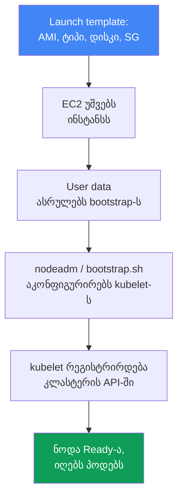
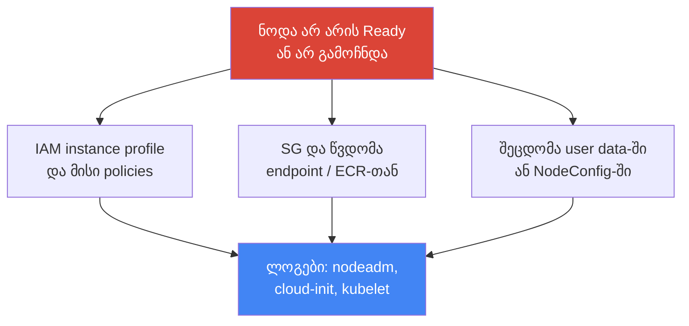

[Русская версия](ru.md) · [Eng version](en.md) · [Versión en español](es.md) · [Version française](fr.md) · [Deutsche Version](de.md) · [繁體中文版](tw.md) · [日本語版](jp.md)
# თავი 10. AMI და bootstrap: AL2023, Bottlerocket, launch templates, kubelet და user data

> **რა არის შემდეგ.** მე-9 თავში განვიხილეთ გამოთვლითი რესურსების ტიპები და Auto Mode-სა და საკუთარ სტეკს შორის არჩევანი.
> managed node group-ის ან self-managed ნოდების არჩევის შემდეგ ჩნდება კითხვა: რომელი იმიჯი უნდა იყოს ნოდაზე,
> როგორ იტვირთება და უერთდება ის კლასტერს. ეს თავი ეხება იმიჯს (AL2023, Bottlerocket,
> მოძველებად AL2-ს), launch template-სა და bootstrap-ს - მომენტს, როდესაც ცარიელი EC2-დან მუშა
> ნოდა მიიღება. ავტომასშტაბირება და Karpenter - თავები 11-12, spot - თავი 13, სიმჭიდროვე და `max-pods`
> - თავები 6 და 14, AMI-ის როტაცია განახლებისას - თავი 38, ნოდის ჰარდენინგი (IMDSv2, hop limit) - 
> თავი 19, ნოდების დეტალური troubleshooting - თავი 45.

## 10.1. „ნოდა არ გაეშვა, ძველზე კი ნახევარი წელია პატჩები არ დაყენებულა“

ნოდის იმიჯი და მისი ჩატვირთვა ჩუმი თემაა ზუსტად პირველ შეფერხებამდე. შემდეგ ის ერთდროულად
რამდენიმე სახით იჩენს თავს და ყველა მათგანი ძვირად ჯდება:

- ახალი ნოდა გაეშვა, მაგრამ **`kubectl get nodes`-ში არ ჩანს** ან `NotReady` მდგომარეობაშია:
  შეცდომაა user data-ში, kubelet-მა რეგისტრაცია ვერ შეძლო, ინციდენტის დრო კი გადის;
- ნოდა ნახევარი წელია იმავე AMI-ზე მუშაობს, რომლითაც გაეშვა, **ბირთვისა და runtime-ის დაუპატჩავი
  CVE-ები** გროვდება, ნოდებს კი არავინ ხელახლა ქმნის, რადგან „ხომ მუშაობს“;
- კლასტერის განახლებისას **bootstrap გაფუჭდა**: სკრიპტმა, რომელიც წლების განმავლობაში აერთებდა ნოდებს,
  მუშაობა შეწყვიტა, რადგან იმიჯის ფორმატი შეიცვალა (AL2 შეიცვალა AL2023-ით);
- საკუთარი AMI ააწყვეს, „ყოველი შემთხვევისთვის“ ზედმეტი აგენტები დაამატეს და ნახევარი წლის შემდეგ **ნოდები
  ერთმანეთს აცდა**: ზოგი მარტშია აწყობილი, ზოგი - სექტემბერში, პაკეტების ვერსიები კი არ ემთხვევა.

არცერთი ეს პრობლემა უშუალოდ Kubernetes-ს არ ეხება. ოთხივე ეხება იმას, **რისგან არის აწყობილი ნოდა და როგორ
იტვირთება ის**. შემდეგ თანმიმდევრულად განვიხილავთ: რა არის AMI, იმიჯების რომელი ვარიანტები არსებობს, როგორ
ხდება ინსტანსი კლასტერის ნოდა და სად ფუჭდება ეს პროცესი.

## 10.2. AMI: რატომ არა „უბრალოდ Linux“

AMI (Amazon Machine Image) - შაბლონია, რომლისგანაც EC2 ინსტანსის დისკს ქმნის: ბირთვი, ფაილური სისტემა,
წინასწარ დაყენებული პროგრამული უზრუნველყოფა და პარამეტრები. შეიძლება ნებისმიერი Linux-ის იმიჯის აღება და
მასზე ნოდისთვის საჭირო ყველაფრის დამატება, მაგრამ ასე არ იქცევიან: იყენებენ **EKS-ოპტიმიზებულ AMI-ებს** და
ამას თავისი მიზეზი აქვს.

Kubernetes-ის ნოდა არ არის უბრალოდ „Linux-იანი სერვერი“ - ეს საჭირო ვერსიების კონკრეტული კომპონენტების
ერთობლიობაა, რომლებიც control plane-ს უნდა შეესაბამებოდეს. იმიჯში ისინი უკვე შეთანხმებული სახითაა:

- საჭირო minor ვერსიის **`kubelet`** (control plane-თან version skew შეზღუდულია, თავი 3);
- **`containerd`**, როგორც container runtime, და მისი პარამეტრები;
- ნოდის რეგისტრაციის ხელსაწყოები და **bootstrap-ლოგიკა** (`nodeadm` AL2023-ზე);
- VPC CNI-სა და სხვა ადონებისთვის წინასწარ დაყენებული დამოკიდებულებები.

ამის ხელით აწყობა ნიშნავს, საკუთარ თავზე აიღოთ აგება, ტესტირება და ვერსიების სინქრონიზაცია, რასაც AWS უკვე
აკეთებს. ამიტომ ნაგულისხმევი არჩევანია ოპტიმიზებული იმიჯი, საკუთარ AMI-ს კი მხოლოდ კონკრეტული მიზეზით იყენებენ (10.8).

## 10.3. იმიჯების ვარიანტები: AL2023, Bottlerocket, Windows, AL2

EKS-ოპტიმიზებულ იმიჯებს რამდენიმე ოჯახი აქვს და მათ შორის არჩევანი განსაზღვრავს ნოდის გამართვისა და
განახლების მოდელს და არა მხოლოდ იმას, „რომელი Linux აყენია“.

- **AL2023** - სრულფასოვანი Amazon Linux 2023 დისტრიბუტივი: ჩვეული ფაილური სისტემა, პაკეტების
  მენეჯერი `dnf`, გამართვის ნაცნობი ხელსაწყოები. ახალი managed node groups-ის ნაგულისხმევი არჩევანი. მოითხოვს
  მინიმუმ `1.16.2` ვერსიის VPC CNI-ს და ნაგულისხმევად რთავს IMDSv2-ს.
- **Bottlerocket** - მინიმალური OS კონტეინერებისთვის: **read-only root**, პაკეტების
  მენეჯერის გარეშე, **მთლიანი იმიჯით განახლება** (image-based, ატომურად და rollback-ის შესაძლებლობით). მართვა ხდება
  **API-ით და არა SSH-ით**; წვდომისთვის არის **control-კონტეინერი** (სტანდარტული მართვა, SSM) და
  **admin-კონტეინერი** (გამართვა, SSH, ნაგულისხმევად გამორთულია).
- **Windows** - Windows-კონტეინერების workload-ებისთვის; ნოდები საკუთარი bootstrap-ით უერთდება.
- **AL2** - მოძველებადი Amazon Linux 2. მნიშვნელოვანი ფაქტი: **Kubernetes 1.32 ბოლო ვერსიაა, რომლისთვისაც
  EKS AL2 AMI-ს უშვებს. 1.33-დან რჩება მხოლოდ AL2023 და Bottlerocket.** AWS-მა AL2
  AMI-ების გამოქვეყნება 2025 წლის ნოემბრის ბოლოს შეწყვიტა. ახალ კლასტერებში AL2 აღარ უნდა გამოიყენოთ.

| იმიჯი | რა არის | გამართვა და წვდომა | განახლება | როდის გამოვიყენოთ |
|---|---|---|---|---|
| AL2023 | სრული დისტრიბუტივი, `dnf` | ჩვეული, SSH/SSM | პაკეტების განახლება, ნოდის როტაცია | ნაგულისხმევად Linux-ნოდებისთვის |
| Bottlerocket | მინიმალური OS კონტეინერებისთვის | API, control/admin კონტეინერები | მთლიანი იმიჯით, ატომურად | ჰარდენინგი, მინიმალური ზედაპირი |
| Windows | იმიჯი Windows-ნოდებისთვის | Windows-ის ხელსაწყოები | საკუთარი ციკლით | Windows-ზე კონტეინერები |
| AL2 | მოძველებული Amazon Linux 2 | ჩვეული | 1.32-მდე, შემდეგ აღარ | მხოლოდ legacy მიგრაციამდე |

AL2023-სა და Bottlerocket-ს შორის არჩევანი მოდელის არჩევანია: „ჩვეული სერვერი, რომელზეც შესვლა შეიძლება“ ან
„დალუქული appliance შეტევის მინიმალური ზედაპირით“. Auto Mode (თავი 9) შიგნით Bottlerocket-ს იყენებს,
მაგრამ იქ იმიჯს თქვენ არ ირჩევთ.

## 10.4. როგორ ხდება ინსტანსი კლასტერის ნოდა

„EC2 გაეშვა“-სა და „ნოდამ პოდები მიიღო“-ს შორის არის ჯაჭვი, რომელიც სრულად უნდა გვახსოვდეს:
ეს იმ ადგილების რუკაცაა, სადაც ყველაფერი შეიძლება გაფუჭდეს.



**Launch template** განსაზღვრავს, როგორი იქნება ინსტანსი: რომელი AMI, ინსტანსის ტიპი, დისკის ზომა და ტიპი,
security groups, IAM instance profile, user data და IMDS-ის პარამეტრები. **User data** არის სკრიპტი
ან კონფიგურაცია, რომელიც პირველ გაშვებაზე სრულდება და **bootstrap-ს** უშვებს: ის აკონფიგურირებს
`kubelet`-ს (API-ის მისამართი, CA, კლასტერის სახელი, ჭდეები, taints, `--max-pods`) და უშვებს მას. `kubelet`
კლასტერის API-ში რეგისტრირდება, ნოდა ხდება `Ready` და პოდების მიღებას იწყებს.

მთავარი მომენტი: **პარამეტრები ერთი და იგივეა, მაგრამ სხვადასხვა იმიჯზე bootstrap-ის ფორმატი განსხვავდება**. კლასტერის სახელი,
API endpoint, CA-სერტიფიკატი, service CIDR, `max-pods`, labels და taints ყველა შემთხვევაში გადაიცემა,
თუმცა სხვადასხვა ფორმით იწერება.

| იმიჯი | bootstrap-ის ფორმატი | როგორ გადაიცემა პარამეტრები |
|---|---|---|
| AL2023 | `nodeadm`, YAML `NodeConfig` | ველები `spec.cluster` და `spec.kubelet` user data-ში |
| Bottlerocket | TOML ფორმატის პარამეტრები | სექციები `[settings.kubernetes]` user data-ში |
| AL2 (1.32-მდე) | სკრიპტი `bootstrap.sh` | სკრიპტის არგუმენტები და `--kubelet-extra-args` |

bootstrap სწორედ ფორმატის შეცვლისას ფუჭდება განახლების დროს: AL2-ის ძველ `bootstrap.sh`-ს არ ესმის AL2023,
სადაც მისი როლი `nodeadm`-მა გადაიბარა.

## 10.5. nodeadm და NodeConfig AL2023-ზე

AL2023-ზე ნოდის ინიციალიზაციას `nodeadm` ასრულებს, მის შესატან მონაცემებს კი YAML-მანიფესტი `NodeConfig` წარმოადგენს.
ეს `bootstrap.sh` სკრიპტის შემცვლელია: პოზიციური არგუმენტებისა და `--kubelet-extra-args`-ის ნაცვლად ნოდას
დეკლარაციულად აღწერთ.

```yaml
---
apiVersion: node.eks.aws/v1alpha1
kind: NodeConfig
spec:
  cluster:
    name: demo
    apiServerEndpoint: https://XXXXXXXX.gr7.us-west-2.eks.amazonaws.com
    certificateAuthority: <base64-CA>
    cidr: 10.100.0.0/16
  kubelet:
    config:
      maxPods: 110
      systemReserved:
        cpu: 100m
        memory: 200Mi
      kubeReserved:
        cpu: 100m
        memory: 500Mi
    flags:
     - --node-labels=role=apps
```

`kubelet`-ის საშუალებით რესურსები სისტემური პროცესებისთვის რეზერვდება, რათა პოდებმა დემონები არ განდევნოს და
ნოდა `NotReady` მდგომარეობაში არ გადავიდეს. `systemReserved` CPU-სა და მეხსიერებას OS-ისთვის (systemd, sshd)
იტოვებს, `kubeReserved` კი - თავად `kubelet`-ისა და `containerd`-ისთვის. AL2023-ზე ისინი `kubelet.config`-ში
(ზემოთ) განისაზღვრება, Bottlerocket-ზე კი - იმავე TOML-პარამეტრებში, ცალკე სექციებად:

```toml
[settings.kubernetes]
cluster-name = "demo"
api-server = "https://XXXXXXXX.gr7.us-west-2.eks.amazonaws.com"
cluster-certificate = "<base64-CA>"
cluster-dns-ip = "10.100.0.10"
max-pods = 110

[settings.kubernetes.system-reserved]
cpu = "100m"
memory = "200Mi"

[settings.kubernetes.kube-reserved]
cpu = "100m"
memory = "500Mi"
```

ეს `NodeConfig`-ის პარამეტრების იგივე ნაკრებია, ოღონდ Bottlerocket-ის კონფიგურატორით ჩაწერილი:
კლასტერის მეტამონაცემები და `max-pods` - `[settings.kubernetes]`-ში, რეზერვები კი - შვილობილ სექციებში.

`NodeConfig`-ში `maxPods` სტატიკური მნიშვნელობაა და `nodeadm` მას prefix delegation-ისთვის თავად არ
გადაანგარიშებს: ჩართეთ პრეფიქსები (თავი 7) - გამოთვალეთ ზედა ზღვარი და აქ ჩაწერეთ. Karpenter-ის მიერ
გაშვებული ნოდებისთვის `kubelet`-ის იგივე პარამეტრები user data-ში კი არა, `EC2NodeClass`-ში (`spec.kubelet`)
ინახება: იქ `maxPods` პირდაპირ განისაზღვრება, ან მის ნაცვლად გამოიყენება `podsPerCore`, რის შემდეგაც სიმჭიდროვე
ინსტანსის vCPU-ების რაოდენობიდან ითვლება და `maxPods`-ს არ აღემატება. Karpenter თავად აგენერირებს
`NodeConfig`-ს და მისი მნიშვნელობები გადაწერს იმას, რაც `userData`-ში დაწერეთ, ამიტომ ეს ველები მხოლოდ
`EC2NodeClass`-ის საშუალებით უნდა განსაზღვროთ (მექანიკა - თავი 12).

ექსპლუატაციის მნიშვნელოვანი დეტალი: AL2-ზე კლასტერის მეტამონაცემებს (`certificateAuthority`, service `cidr`)
`bootstrap.sh` თავად იღებდა `DescribeCluster` გამოძახებით. AL2023-ზე **საკუთარი launch template-ის ან
კასტომური AMI-ის** გამოყენებისას ეს ველები `NodeConfig`-ში **ცხადად უნდა გადასცეთ**: API-ის ზედმეტი გამოძახება
ამოიღეს, რათა ნოდების მასობრივი გაშვებისას throttling-ს არ დასჯახებოდა. თუ managed node group-ს **საკუთარი
launch template-ის გარეშე** ან Karpenter-ს იყენებთ, ეს მონაცემები თქვენ ნაცვლად ავტომატურად ივსება. ამიტომ
AL2023-ზე კასტომური launch template საჭიროებს გამართულ `NodeConfig`-ს და არა „ძველ სკრიპტს“.

## 10.6. საიდან ავიღოთ იმიჯის ID: SSM-პარამეტრები

AMI ID-ს **არ ჰარდკოდავენ**. ის თითოეულ რეგიონში განსხვავებულია, დამოკიდებულია Kubernetes-ის minor ვერსიაზე,
არქიტექტურასა და იმიჯის ვარიანტზე და ახალი პატჩების შემცველი ყოველი რელიზისას იცვლება. კოდში ჩაჭედილი
`ami-...` ერთი თვის შემდეგ ძველი ბირთვის მქონე ნოდას ნიშნავს. ამის ნაცვლად ID-ს იღებენ **SSM Parameter
Store**-დან, სადაც AWS აქტუალურ მნიშვნელობებს აქვეყნებს. საჭიროა `ssm:GetParameter` უფლება.

```bash
# AL2023, x86_64, სტანდარტული ვარიანტი - ჩასვით თქვენი ვერსია და რეგიონი
aws ssm get-parameter \
  --name /aws/service/eks/optimized-ami/1.33/amazon-linux-2023/x86_64/standard/recommended/image_id \
  --region us-west-2 --query "Parameter.Value" --output text

# Bottlerocket, x86_64, ვარიანტი GPU-ის გარეშე
aws ssm get-parameter \
  --name /aws/service/bottlerocket/aws-k8s-1.33/x86_64/latest/image_id \
  --region us-west-2 --query "Parameter.Value" --output text
```

| იმიჯი | SSM-პარამეტრი (შაბლონი) |
|---|---|
| AL2023 x86_64 | `/aws/service/eks/optimized-ami/<ვერსია>/amazon-linux-2023/x86_64/standard/recommended/image_id` |
| AL2023 arm64 | `/aws/service/eks/optimized-ami/<ვერსია>/amazon-linux-2023/arm64/standard/recommended/image_id` |
| AL2023 NVIDIA | `/aws/service/eks/optimized-ami/<ვერსია>/amazon-linux-2023/x86_64/nvidia/recommended/image_id` |
| Bottlerocket | `/aws/service/bottlerocket/aws-k8s-<ვერსია>/<arch>/latest/image_id` |

გზაში minor ვერსიაზე მიბმა ფორმალობა არ არის: ის უზრუნველყოფს, რომ იმიჯში არსებული `kubelet` control plane-ს
ემთხვეოდეს. კლასტერის განახლებისას SSM-გზაში ვერსიას ცვლით და შემდეგი ვერსიის `kubelet`-იან AMI-ს იღებთ
(განახლებისას როტაციის პროცესი - თავი 38).

## 10.7. Launch template დეტალურად

Managed node group **ყოველთვის** launch template-ის საშუალებით იშლება. თუ ის არ მიგითითებიათ, EKS
საკუთარ ავტომატურ შაბლონს ქმნის - მისი **ხელით რედაქტირება არ არის საჭირო**, ისევე როგორც უშუალოდ ჯგუფის
ქვეშ არსებული ASG-ის შეცვლა (ამის შესახებ მე-9 თავში გაფრთხილდით: ინსტანსების სასიცოცხლო ციკლი თავად EKS-მა
უნდა მართოს). საკუთარი კონტროლი მაშინ ჩნდება, როდესაც ჯგუფს **თავიდანვე** ქმნით საკუთარი launch template-ით:
ამის შემდეგ კონფიგურაციის შეცვლა შაბლონის ახალი ვერსიებით შეიძლება.

Launch template-ს **ვერსიები აქვს**: ყოველი ცვლილება ახალი ვერსიაა, ძველები კი რჩება. ჯგუფისთვის ვერსიის
შეცვლა **ყველა ნოდას ხელახლა ქმნის** ახალი კონფიგურაციით და სწორად ასრულებს მათ drain-ს.
პარამეტრების ნაწილი **მხოლოდ** launch template-ში განისაზღვრება, ნაწილი კი - **მხოლოდ** node group-ის კონფიგურაციაში;
მათი დუბლირება არ შეიძლება, თორემ შექმნა ან განახლება შეცდომით დასრულდება.

| პარამეტრი | სად განისაზღვრება |
|---|---|
| კასტომური AMI ID | მხოლოდ launch template-ში |
| დისკის ზომა და ტიპი | launch template-ში (თუ ის საკუთარია) |
| User data / bootstrap | launch template-ში |
| IMDS-ის პარამეტრები (hop limit, IMDSv2) | launch template-ში (ჰარდენინგი - თავი 19) |
| Security groups remote access-ისთვის | მხოლოდ launch template-ში |
| ქვექსელები (subnets) | მხოლოდ node group-ის კონფიგურაციაში |
| ნოდის IAM-როლი (node role) | მხოლოდ node group-ის კონფიგურაციაში |
| Scaling config (min/max/desired) | მხოლოდ node group-ის კონფიგურაციაში |

```bash
# საკუთარი launch template-ის ვერსიების ნახვა
aws ec2 describe-launch-template-versions \
  --launch-template-id lt-0abc123 \
  --query "LaunchTemplateVersions[].{v:VersionNumber,ami:LaunchTemplateData.ImageId}"

# რომელ launch template-სა და ვერსიასთანაა დაკავშირებული node group
aws eks describe-nodegroup --cluster-name demo --nodegroup-name apps \
  --query "nodegroup.launchTemplate"
```

launch template-ში IMDS-ის პარამეტრები ჰარდენინგიცაა. ნაგულისხმევად hop limit 2-ის ტოლია და კონტეინერიდან
პოდს ნოდის მეტამონაცემებსა და მის IAM-როლამდე მიწვდომა შეუძლია. IMDSv2-ს აიძულებენ და მეტამონაცემებამდე გზას
უშუალოდ შაბლონში ამოკლებენ:

```bash
# შაბლონის ახალი ვერსია: სავალდებულო IMDSv2 token და hop limit 1
aws ec2 create-launch-template-version --launch-template-id lt-0abc123 \
  --source-version 1 --launch-template-data \
  'MetadataOptions={HttpTokens=required,HttpPutResponseHopLimit=1,HttpEndpoint=enabled}'
```

`HttpTokens=required` რთავს IMDSv2-ს (უბრალო GET-ის ნაცვლად token-ის მოთხოვნა),
`HttpPutResponseHopLimit=1` კი მეტამონაცემების პასუხს თავად ჰოსტის საზღვრებს გარეთ გასვლის საშუალებას არ აძლევს,
ამიტომ კონტეინერში პოდი მას ვერ მისწვდება.

არის ზუსტად ერთი გამონაკლისი, რომელსაც ხშირად გვიან იგებენ: მიდგომა მუშაობს, რადგან პაკეტი პოდიდან საკუთარ
network namespace-ს გადის და დამატებით hop-ს აკეთებს. `hostNetwork: true`-ის მქონე პოდი ნოდის ქსელურ
სტეკში ცხოვრობს, მისი პაკეტი ერთ hop-ში ეტევა და **ნოდის როლის credentials-იანი მეტამონაცემები ასეთ პოდს
ნებისმიერი hop limit-ის დროს მიუწვდება**. ეს launch template-ის პარამეტრით კი არა, ორი სხვა გზით იკეტება:
`hostNetwork`-ის აკრძალვით Pod Security Admission-ის საშუალებით და იმით, რომ ნოდის როლს აპლიკაციური უფლებები
უბრალოდ არ აქვს - ისინი პოდს IRSA-ს ან Pod Identity-ის საშუალებით აქვს (თავები 16, 17 და 19). ნოდის დეტალური
ჰარდენინგი - თავი 19.

პრაქტიკული დასკვნა: იმიჯისა და ჩატვირთვის პარამეტრები (AMI, დისკი, user data, IMDS) launch template-ში
ინახება და იქვე ვერსიონირდება; ქსელი, როლი და მასშტაბი - node group-ის კონფიგურაციაში. ნუ აურევთ მათ და
ნუ შეცვლით ავტომატურად გენერირებულ შაბლონს.

## 10.8. კასტომური AMI: როდისაა გამართლებული და რა ფასს იხდით

საკუთარ AMI-ს იყენებენ არა „ზოგადად კონტროლისთვის“, არამედ კონკრეტული მოთხოვნის გამო, რომელსაც
ოპტიმიზებული იმიჯი ვერ ფარავს:

- **რეგულატორული მოთხოვნები და ატესტაცია**: იმიჯმა უნდა გაიაროს შიდა security-პროცესი,
  შეიცავდეს CIS-ჰარდენინგს ან სტანდარტით განსაზღვრულ კონკრეტულ build-ს;
- **წინასწარ გამართული აგენტები**: მონიტორინგის, ანტივირუსის, security-აგენტები უკვე იმიჯშია, რათა ნოდა
  მომზადებული გაეშვას და გაშვებისას დამატებითი ინსტალაცია არ დასჭირდეს;
- **სპეციფიკური დრაივერები და ბირთვი**: განსაკუთრებული GPU-დრაივერები, ბირთვის ვერსია, workload-ისთვის საჭირო მოდულები.

ამის საფასური ისაა, რომ იმიჯის მთელი pipeline თქვენზე გადმოდის:

- **საკუთარი build**: pipeline, რომელიც რეგულარულად ქმნის იმიჯს, წინააღმდეგ შემთხვევაში ნოდები ძველზე რჩება;
- **საკუთარი პატჩები**: ბირთვსა და პაკეტებში CVE-ებს თქვენ ხურავთ და AWS-ის მზა რელიზიდან ვერ იღებთ;
- **drift**, თუ ხელით აწყობთ: სხვადასხვა build-ის იმიჯებში პაკეტების ვერსიები ერთმანეთს სცდება - 
  ზუსტად ის პრობლემა, რაც 10.1 სექციაში აღვწერეთ;
- **version skew**: თუ იმიჯი კლასტერს ჩამორჩება, მასში არსებული `kubelet` შეიძლება control plane-თან
  თავსებადობის საზღვრებს გასცდეს (თავი 3).

სწორი მიდგომაა არა „ნულიდან“ აწყობა, არამედ **EKS-ოპტიმიზებული AMI-ის საფუძვლად აღება** და image builder-ის
(მაგალითად, EC2 Image Builder-ის) საშუალებით მის ზემოდან საჭირო კომპონენტების დამატება, რათა განმეორებადი
**golden image** მიიღოთ. AWS ამ იმიჯების აგების ღია სკრიპტებს აქვეყნებს, ამიტომ საფუძველი და პროცესი
გამჭვირვალეა. ერთჯერადი, ხელით აწყობილი იმიჯი drift-ის პირდაპირი გზაა.

## 10.9. „ნოდა არ არის Ready“ დიაგნოსტიკა

როდესაც ნოდა არ გამოჩნდა ან `NotReady` მდგომარეობაშია, მიზეზი თითქმის ყოველთვის რამდენიმე ადგილიდან ერთ-ერთშია;
ის bootstrap-ის ლოგებით უნდა მოძებნოთ და არა გამოცნობით.



ტიპური მიზეზები სიხშირის მიხედვით:

- **IAM instance profile-ს საჭირო policies არ აქვს**: ნოდის როლს არ აქვს მიერთების ან ECR-დან
  იმიჯების ჩამოტვირთვის უფლება, kubelet ავტორიზაციას ვერ გადის;
- **security groups და ქსელური წვდომა**: ნოდა კლასტერის API endpoint-ს ან ECR-ს ვერ უკავშირდება;
- **არასწორი bootstrap**: გაფუჭებული `NodeConfig`, საკუთარი launch template-ის მქონე AL2023-ზე არ არის
  გადაცემული `certificateAuthority`/`cidr`, შეცდომაა user data-ში;
- **ვერსიების შეუსაბამობა**: იმიჯის `kubelet` control plane-თან თავსებადობის ფარგლებს გარეთაა.

სად ვეძებოთ უშუალოდ ნოდაზე (თუ წვდომა არის - AL2023-ზე და არა Bottlerocket-ზე SSH-ის საშუალებით):

```bash
sudo cat /var/log/cloud-init-output.log            # user data-ისა და cloud-init-ის ლოგები
sudo journalctl -u kubelet --no-pager | tail -50   # kubelet-ის სტატუსი და ლოგები
sudo journalctl -u nodeadm-config -u nodeadm-run   # nodeadm-ის ლოგები AL2023-ზე
```

ეს პრობლემის კლასის გასაგებად პირველი ჭრილია. „ნოდა არ შეუერთდა“ პრობლემის სრული განხილვა მიზეზების ხით
45-ე თავშია; იქვეა დიაგნოსტიკა ნოდაზე წვდომის გარეშე და შეცდომების ტიპური შეტყობინებები.

## 10.10. როგორ იყენებენ ამას production-ში

- **იმიჯის ID-ს SSM-დან minor ვერსიის მიხედვით იღებენ** და არ ჰარდკოდავენ: ასე AMI-ში არსებული `kubelet`
  control plane-ს ემთხვევა, პატჩები კი ახალ რელიზებთან ერთად მოდის.
- **ნოდებს რეგულარულად ხელახლა ქმნიან** და ძველ AMI-ზე თვეობით არ ტოვებენ: ახალი იმიჯი ნიშნავს ბირთვისა და
  runtime-ის ახალ პატჩებს, როტაცია კი CVE-ებს ხელით პატჩვის გარეშე ხურავს.
- **კასტომურ AMI-ს მხოლოდ მოთხოვნის გამო იყენებენ** (ატესტაცია, აგენტები, დრაივერები) და ხელით კი არა,
  ოპტიმიზებულის საფუძველზე image builder-ით აწყობენ, რათა drift არ მიიღონ.
- **Bottlerocket-ს იქ ირჩევენ, სადაც მინიმალური ზედაპირია მნიშვნელოვანი**: read-only root, იმიჯით განახლება,
  წვდომა API-ისა და control-კონტეინერის საშუალებით ღია SSH-ის ნაცვლად.
- **საკუთარ launch template-ს node group-ის შექმნისთანავე ამატებენ**; ავტომატურად გენერირებულ შაბლონსა და
  ჯგუფის ASG-ს ხელით არ ეხებიან.
- **საკუთარი launch template-ის მქონე AL2023-ზე `NodeConfig`-ს ამოწმებენ**: `apiServerEndpoint`,
  `certificateAuthority` და `cidr` ცხადად უნდა იყოს გადაცემული.

## 10.11. მინი-ლექსიკონი

- **AMI (Amazon Machine Image)** - ინსტანსის დისკის შაბლონი: ბირთვი, ფაილური სისტემა, პროგრამული უზრუნველყოფა.
  ნოდებისთვის იყენებენ EKS-ოპტიმიზებულს, რომელშიც `kubelet`, `containerd` და bootstrap-ლოგიკა უკვე შეთანხმებულია.
- **EKS-ოპტიმიზებული AMI** - AWS-ის იმიჯი საჭირო ვერსიების ნოდის კომპონენტებით; ოჯახებია
  AL2023, Bottlerocket, Windows და მოძველებადი AL2.
- **Bottlerocket** - მინიმალური OS კონტეინერებისთვის: read-only root, მთლიანი იმიჯით განახლება,
  მართვა API-ის საშუალებით, ღია SSH-ის ნაცვლად control- და admin-კონტეინერები.
- **nodeadm** - ნოდის ინიციალიზატორი AL2023-ზე; შესატანი მონაცემია YAML-მანიფესტი `NodeConfig`
  (`apiVersion: node.eks.aws/v1alpha1`), რომელიც `bootstrap.sh` სკრიპტს ცვლის.
- **User data** - ინსტანსის პირველ გაშვებაზე შესრულებული სკრიპტი ან კონფიგურაცია; უშვებს
  bootstrap-ს და აკონფიგურირებს `kubelet`-ს.
- **Launch template** - ინსტანსის ვერსიონირებადი შაბლონი (AMI, ტიპი, დისკი, SG, user data, IMDS);
  managed node group ყოველთვის მისი საშუალებით იშლება.
- **Golden image** - განმეორებადად ასაწყობი კასტომური იმიჯი, რომელიც ოპტიმიზებული AMI-ის საფუძველზე
  image builder-ით იქმნება.

## 10.12. თავის შეჯამება

- ნოდა არ არის „Linux-იანი სერვერი“, არამედ `kubelet`-ის, `containerd`-ისა და bootstrap-ის შეთანხმებული ნაკრები;
  ამიტომ გამოიყენება EKS-ოპტიმიზებული AMI და არა ცარიელი დისტრიბუტივი.
- იმიჯების ოჯახებია: AL2023 (სრული დისტრიბუტივი, `dnf`, ჩვეული გამართვა), Bottlerocket
  (მინიმალური OS, read-only root, SSH-ის ნაცვლად API), Windows და მოძველებადი AL2.
- Kubernetes 1.32 ბოლო ვერსიაა AL2 AMI-ით; 1.33-დან რჩება მხოლოდ AL2023 და Bottlerocket,
  AWS-მა კი AL2 AMI-ის გამოქვეყნება შეწყვიტა.
- ინსტანსი ნოდა ხდება ჯაჭვით: launch template, user data, bootstrap, kubelet-ის რეგისტრაცია.
  პარამეტრები ერთია, bootstrap-ის ფორმატი კი განსხვავებული: nodeadm YAML, TOML, `bootstrap.sh`.
- AL2023-ზე ინიციალიზაციას `nodeadm` ასრულებს `NodeConfig` მანიფესტით; საკუთარი launch
  template-ის დროს `certificateAuthority` და service `cidr` ცხადად უნდა გადაიცეს.
- AMI ID-ს არ ჰარდკოდავენ - მას SSM-დან minor ვერსიის, რეგიონისა და ვარიანტის მიხედვით იღებენ, რათა `kubelet`
  control plane-ს ემთხვეოდეს. Managed node group ყოველთვის launch template-ის საშუალებით მუშაობს.
- launch template-ში აიძულებენ IMDSv2-ს (`HttpTokens=required`) და hop limit 1-ს, `kubelet`-ით კი
  რესურსებს რეზერვებენ (`systemReserved`, `kubeReserved`), რათა პოდებმა დემონები არ განდევნოს.
- კასტომური AMI გამართლებულია ატესტაციის, აგენტების ან დრაივერებისთვის, მაგრამ მოაქვს საკუთარი build pipeline,
  პატჩები, drift-ისა და version skew-ის რისკი; golden image ოპტიმიზებულის საფუძველზე უნდა აიწყოს.
- ნოდა არ არის Ready - შეამოწმეთ IAM instance profile, SG და endpoint/ECR-თან წვდომა, bootstrap-ის სისწორე;
  ლოგები არის cloud-init-ში, nodeadm-სა და `journalctl -u kubelet`-ში (დეტალურად - თავი 45).

## 10.13. როგორ გამოგადგებათ ეს რეალურ სამუშაოში

იმიჯი და bootstrap ჩუმადაა, სანამ ყველაზე ცუდ მომენტში არ გიღალატებთ: ინციდენტის დროს ნოდების გაშვებისას,
კლასტერის განახლებისას ან უსაფრთხოების აუდიტზე. ინჟინერი, რომელსაც launch template-იდან kubelet-ის
რეგისტრაციამდე ჯაჭვი ესმის, მორიგეობისას არ ვარაუდობს და პირდაპირ მარცხის ადგილებს ამოწმებს: ნოდის როლს,
ქსელს, user data-ს, nodeadm-ის ლოგებს. დაგეგმვისას იგივე რუკა პასუხობს კითხვებს: „რაზეა აწყობილი ნოდები“,
„როგორ მიიღება AMI ID“, „ვინ და როდის ქმნის მათ ხელახლა“. AL2-დან AL2023-ზე გადასვლის ცოდნა კი ყველაზე
დასანან შეცდომებს აგაცილებთ - როდესაც განახლება Kubernetes-ის გამო კი არა, ჩატვირთვის შეცვლილი ფორმატის გამო ფუჭდება.

## 10.14. კითხვები თვითშემოწმებისთვის

1. რატომ იყენებენ ნოდებისთვის EKS-ოპტიმიზებულ AMI-ს და არა ნებისმიერ Linux-ს დამატებით დაყენებული პაკეტებით?
2. რით განსხვავდება Bottlerocket AL2023-ისგან გამართვისა და განახლების მოდელით?
3. Kubernetes-ის რომელი ვერსიიდან აღარ გამოდის AL2 AMI და რა რჩება მის ნაცვლად?
4. აღწერეთ ჯაჭვი EC2-ის გაშვებიდან ნოდის `Ready` მდგომარეობამდე. სად არის მასში bootstrap-ის ადგილი?
5. როგორ განსხვავდება bootstrap-ის ფორმატი AL2023-ზე, Bottlerocket-სა და AL2-ზე?
6. რა არის `nodeadm` და `NodeConfig` და რატომ ცვლის ის `bootstrap.sh`-ს?
7. რომელი ველები უნდა გადასცეთ ცხადად `NodeConfig`-ში საკუთარი launch template-ის დროს და რატომ?
8. რატომ არ ჰარდკოდავენ AMI ID-ს და საიდან იღებენ მას? რას იძლევა SSM-გზაში ვერსიაზე მიბმა?
9. რომელი პარამეტრები განისაზღვრება მხოლოდ launch template-ში და რომელი - მხოლოდ node group-ის კონფიგურაციაში?
10. რატომ არ შეიძლება managed-ჯგუფის ავტომატურად გენერირებული launch template-ისა და ASG-ის ხელით შეცვლა?
11. როდისაა კასტომური AMI გამართლებული და რა ფასს იხდით მისთვის?
12. პირველ რიგში სად უნდა ეძებოთ, თუ ნოდა არ გამოჩნდა ან `NotReady` მდგომარეობაშია?
13. რატომ უნდა აიძულოთ IMDSv2 და hop limit 1 და რას იძლევა `systemReserved`/`kubeReserved`?

## პრაქტიკა

კურსის ლაბა ამ თემისთვის: [ლაბა 101 - კლასტერი, როგორც კოდი](../../labs/101/README_GE.MD). მასში
ამოწმებთ, რომელ იმიჯზე მუშაობს worker-ნოდები (AL2023 Karpenter-ის ნაგულისხმევი NodePool-იდან);
შემოწმება სრულდება `check_result` ბრძანებით. გაშვება - `TASK=101 make run_eks_task`.

ლაბის გარდა, ყველაფრის ნახვა შესაძლებელია ცოცხალ კლასტერსა და CLI-შიც. დაიწყეთ იმიჯებით:
10.6 სექციაში მოცემული გზებისთვის `aws ssm get-parameter` თქვენი ვერსიისა და რეგიონის აქტუალურ AMI ID-ებს
აჩვენებს - შეადარეთ AL2023 და Bottlerocket. შემდეგ ნახეთ ნოდების ჯგუფები: `aws eks
describe-nodegroup --cluster-name <cluster> --nodegroup-name <name> --query
"nodegroup.launchTemplate"` აჩვენებს, დაკავშირებულია თუ არა ჯგუფი საკუთარ launch template-თან.

შემდეგ თავად შაბლონი შეამოწმეთ: `aws ec2 describe-launch-template-versions --launch-template-id
<lt-id>` აჩვენებს, რომელი AMI, დისკი და user data არის განსაზღვრული თითოეულ ვერსიაში. ნოდაზე (თუ ის AL2023-ია
და წვდომა გახსნილია) ჩატვირთვა შეამოწმეთ: `sudo cat /var/log/cloud-init-output.log`, `sudo
journalctl -u kubelet` და `nodeadm`-ის ლოგები. გაიარეთ 10.4 სექციის ჯაჭვი და უპასუხეთ: საიდან
მიიღება AMI ID, რამდენი ხანია ნოდები ხელახლა არ შექმნილა და რა დაემართება bootstrap-ს ვერსიის განახლებისას.

---
[სარჩევი](../README_GE.md) · [თავი 9](../09/ge.md) · [თავი 11](../11/ge.md)
