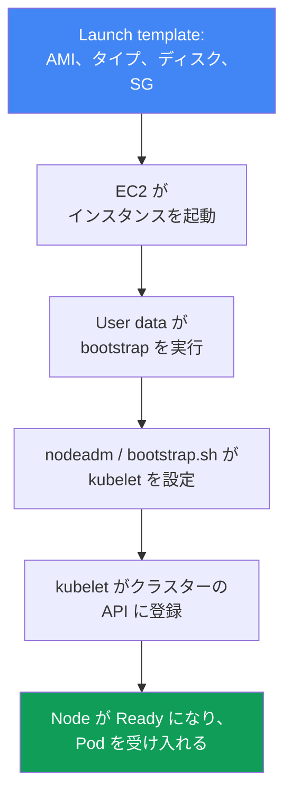
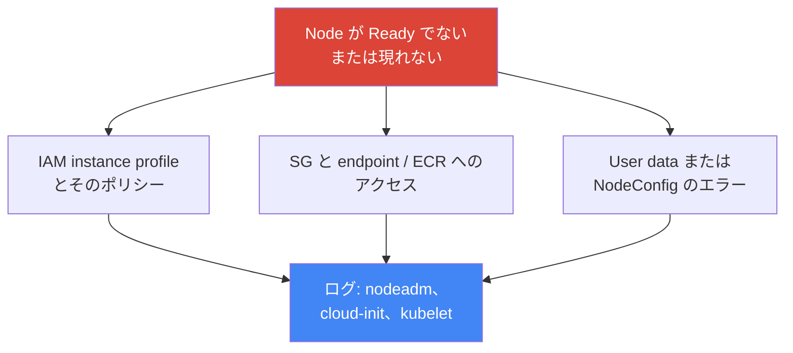

[Eng version](en.md) · [Versión en español](es.md) · [Version française](fr.md) · [Deutsche Version](de.md) · [Русская версия](ru.md) · [ქართული ვერსია](ge.md) · [繁體中文版](tw.md)
# 第10章 AMI と bootstrap: AL2023、Bottlerocket、launch template、kubelet、user data

> **この先の内容。** 第9章ではコンピューティングタイプと、Auto Mode と独自スタックの選択を扱いました。managed node group または self-managed Node を選ぶと、Node 上のイメージは何か、どのように起動されクラスターに参加するのか、という問題に行き着きます。本章ではイメージ（AL2023、Bottlerocket、旧式化する AL2）、launch template、そして素の EC2 から稼働中の Node になる瞬間である bootstrap を扱います。オートスケーリングと Karpenter は第11～12章、spot は第13章、密度と `max-pods` は第6章と第14章、アップグレード時の AMI ローテーションは第38章、Node のハードニング（IMDSv2、hop limit）は第19章、Node の詳細なトラブルシューティングは第45章です。

## 10.1. 「Node が起動せず、古い Node には半年間パッチがない」

Node イメージと起動は、最初の障害が起きるまでは目立たないテーマです。その後は同時に複数の形で表面化し、どれも高コストになります。

- 新しい Node を起動したが、**`kubectl get nodes` に現れない**、または `NotReady` のままである。user data のエラー、kubelet が登録できない、そしてインシデント中である。
- Node が起動時の AMI のまま半年間動き続け、**未パッチのカーネルと runtime の CVE** が蓄積する。「動いているから」と誰も Node を再作成しない。
- クラスター更新時に **bootstrap が壊れた**。長年 Node を参加させていたスクリプトが、イメージ形式の変更（AL2 から AL2023 への移行）により動かなくなった。
- 独自 AMI を作成し、「念のため」に余分なエージェントを入れた結果、半年後には **Node がばらつく**。3月に作成されたものもあれば9月に作成されたものもあり、パッケージバージョンが一致しない。

これらはいずれも Kubernetes 自体の問題ではありません。4つすべてが、**Node が何から構成され、どのように起動されるか**の問題です。順に、AMI とは何か、どのイメージの選択肢があるか、インスタンスがどうクラスター Node になるか、どこで壊れるかを見ていきます。

## 10.2. AMI: なぜ「単なる Linux」ではないのか

AMI（Amazon Machine Image）は、EC2 がインスタンスのディスクを展開するためのテンプレートです。カーネル、ファイルシステム、事前インストール済みソフトウェア、設定が含まれます。任意の Linux イメージを選び、Node に必要なものをすべて追加インストールすることもできますが、そうはしません。**EKS 最適化 AMI** を使用します。それには理由があります。

Kubernetes Node は「Linux が入ったサーバー」ではなく、control plane と整合する必要がある、特定バージョンのコンポーネント群です。イメージにはすでにそれらが整合した形で含まれています。

- 必要なマイナーバージョンの **`kubelet`**（control plane との version skew には制限があります。第3章）。
- container runtime としての **`containerd`** とその設定。
- Node 登録ユーティリティと **bootstrap ロジック**（AL2023 の `nodeadm`）。
- VPC CNI およびその他のアドオンの事前インストール済み依存関係。

これを手作業で構築することは、AWS がすでに担っているビルド、テスト、バージョン同期を自ら引き受けることを意味します。したがってデフォルトは最適化イメージであり、独自 AMI を使用するのは理由がある場合だけです（10.8）。

## 10.3. イメージの選択肢: AL2023、Bottlerocket、Windows、AL2

EKS 最適化イメージには複数のファミリーがあり、その選択は「どの Linux か」だけでなく、Node のデバッグと更新モデルを決定します。

- **AL2023** は完全な Amazon Linux 2023 ディストリビューションです。使い慣れたファイルシステム、`dnf` パッケージマネージャー、親しみのあるデバッグツールを備えます。新規 managed node group のデフォルトです。VPC CNI `1.16.2` 以上が必要で、デフォルトで IMDSv2 が有効です。
- **Bottlerocket** はコンテナ向けの最小 OS です。**ルートは read-only**、パッケージマネージャーはなく、**イメージ全体**で更新します（image-based、アトミックでロールバック可能）。管理は **SSH ではなく API** で行います。アクセス用に **control コンテナ**（標準管理、SSM）と **admin コンテナ**（デバッグ、SSH、デフォルトで無効）があります。
- **Windows** は Windows コンテナのワークロード向けです。Node は専用の bootstrap により参加します。
- **AL2** は旧式の Amazon Linux 2 です。重要な点は、**Kubernetes 1.32 が、EKS が AL2 AMI を提供する最後のバージョンであることです。1.33 以降は AL2023 と Bottlerocket のみです。** AWS は 2025年11月末に AL2 AMI の公開を終了しました。新規クラスターで AL2 を選ぶ必要はありません。

| イメージ | 概要 | デバッグとアクセス | 更新 | 使用する場面 |
|---|---|---|---|---|
| AL2023 | 完全なディストリビューション、`dnf` | 通常どおり、SSH/SSM | パッケージ更新、Node ローテーション | Linux Node のデフォルト |
| Bottlerocket | コンテナ向け最小 OS | API、control/admin コンテナ | イメージ全体でアトミックに | ハードニング、攻撃対象領域の最小化 |
| Windows | Windows Node 向けイメージ | Windows ツール | 独自のライフサイクル | Windows 上のコンテナ |
| AL2 | 旧式の Amazon Linux 2 | 通常どおり | 1.32 まで、それ以降は不可 | 移行までの legacy のみ |

AL2023 と Bottlerocket の選択は、「アクセスできる使い慣れたサーバー」か「攻撃対象領域が最小限の封印された appliance」かというモデルの選択です。Auto Mode（第9章）は内部で Bottlerocket を使用しますが、そのイメージを選択することはできません。

## 10.4. インスタンスがクラスター Node になる仕組み

「EC2 が起動した」と「Node が Pod を受け入れる」の間には、一連の流れがあります。これは障害が起きる場所の地図でもあるため、全体を把握しておくことが有用です。



**Launch template** はインスタンスの内容を指定します。AMI、インスタンスタイプ、ディスクのサイズとタイプ、security groups、IAM instance profile、user data、IMDS 設定です。**User data** は初回起動時に実行されるスクリプトまたは設定で、**bootstrap** を起動します。bootstrap は `kubelet`（API アドレス、CA、クラスター名、ラベル、taints、`--max-pods`）を設定し、起動します。`kubelet` はクラスター API に登録し、Node は `Ready` となって Pod を受け入れ始めます。

重要な点は、**パラメーターは同じでも、イメージごとに bootstrap の形式が異なる**ことです。クラスター名、API endpoint、CA 証明書、service CIDR、`max-pods`、labels、taints はどの場合にも渡しますが、記述方法が異なります。

| イメージ | bootstrap 形式 | パラメーターの渡し方 |
|---|---|---|
| AL2023 | `nodeadm`、YAML の `NodeConfig` | user data の `spec.cluster` と `spec.kubelet` フィールド |
| Bottlerocket | TOML 形式の設定 | user data の `[settings.kubernetes]` セクション |
| AL2（1.32 まで） | `bootstrap.sh` スクリプト | スクリプト引数と `--kubelet-extra-args` |

アップグレード時に bootstrap が壊れるのはまさに形式変更のためです。AL2 の古い `bootstrap.sh` は、役割を `nodeadm` が担う AL2023 を理解しません。

## 10.5. AL2023 の nodeadm と NodeConfig

AL2023 では `nodeadm` が Node 初期化を担当し、その入力は YAML マニフェストの `NodeConfig` です。これは `bootstrap.sh` スクリプトの代替です。位置引数と `--kubelet-extra-args` の代わりに、Node を宣言的に記述します。

```yaml
---
apiVersion: node.eks.aws/v1alpha1
kind: NodeConfig
spec:
  cluster:
    name: demo
    apiServerEndpoint: https://XXXXXXXX.gr7.us-west-2.eks.amazonaws.com
    certificateAuthority: <base64-CA>
    cidr: 10.100.0.0/16
  kubelet:
    config:
      maxPods: 110
      systemReserved:
        cpu: 100m
        memory: 200Mi
      kubeReserved:
        cpu: 100m
        memory: 500Mi
    flags:
      - --node-labels=role=apps
```

`kubelet` を通じてシステムプロセス用のリソースを予約し、Pod がデーモンを圧迫して Node が `NotReady` になることを防ぎます。`systemReserved` は OS（systemd、sshd）用に CPU とメモリを確保し、`kubeReserved` は `kubelet` と `containerd` 自体のために確保します。AL2023 では `kubelet.config`（上記）で指定します。Bottlerocket では同じ TOML 設定の別セクションで指定します。

```toml
[settings.kubernetes]
cluster-name = "demo"
api-server = "https://XXXXXXXX.gr7.us-west-2.eks.amazonaws.com"
cluster-certificate = "<base64-CA>"
cluster-dns-ip = "10.100.0.10"
max-pods = 110

[settings.kubernetes.system-reserved]
cpu = "100m"
memory = "200Mi"

[settings.kubernetes.kube-reserved]
cpu = "100m"
memory = "500Mi"
```

これは `NodeConfig` と同じパラメーター群を Bottlerocket の設定形式で記述したものです。クラスターのメタデータと `max-pods` は `[settings.kubernetes]` に、予約は子セクションにあります。

`NodeConfig` の `maxPods` は静的な値であり、`nodeadm` は prefix delegation に応じて自動再計算しません。prefix を有効化した場合（第7章）は上限を計算してここに記入してください。Karpenter が起動する Node では、同じ `kubelet` 設定は user data ではなく `EC2NodeClass`（`spec.kubelet`）にあります。`maxPods` はそこで明示的に指定するか、代わりに `podsPerCore` を使用します。この場合、密度は `maxPods` を超えない範囲でインスタンスの vCPU 数から計算されます。Karpenter は自ら `NodeConfig` を生成し、その値は `userData` に書いたものを上書きするため、これらのフィールドは `EC2NodeClass` を通じてのみ指定します（仕組みは第12章）。

運用上の重要な詳細があります。AL2 では、クラスターのメタデータ（`certificateAuthority`、service `cidr`）を `bootstrap.sh` が `DescribeCluster` 呼び出しで自動取得していました。AL2023 で **独自 launch template またはカスタム AMI** を使用する場合、これらのフィールドを `NodeConfig` に**明示的に渡す必要があります**。大量の Node 起動時に API throttling に達しないよう、余分な API 呼び出しが削除されたためです。独自 launch template **なし**の managed node group、または Karpenter を使用する場合は、自動的に設定されます。したがって、AL2023 のカスタム launch template には「古いスクリプト」ではなく、正確な `NodeConfig` が必要です。

## 10.6. イメージ ID の取得元: SSM パラメーター

AMI ID を**ハードコードしません**。リージョンごとに異なり、Kubernetes のマイナーバージョン、アーキテクチャ、イメージバリアントに依存し、新しいパッチを含むリリースごとに変わります。コードに固定した `ami-...` は、1か月後には古いカーネルを持つ Node を意味します。代わりに、AWS が最新値を公開する **SSM Parameter Store** から ID を取得します。`ssm:GetParameter` 権限が必要です。

```bash
# AL2023、x86_64、標準バリアント。自身のバージョンとリージョンに置き換えてください
aws ssm get-parameter \
  --name /aws/service/eks/optimized-ami/1.33/amazon-linux-2023/x86_64/standard/recommended/image_id \
  --region us-west-2 --query "Parameter.Value" --output text

# Bottlerocket、x86_64、GPU なしバリアント
aws ssm get-parameter \
  --name /aws/service/bottlerocket/aws-k8s-1.33/x86_64/latest/image_id \
  --region us-west-2 --query "Parameter.Value" --output text
```

| イメージ | SSM パラメーター（パターン） |
|---|---|
| AL2023 x86_64 | `/aws/service/eks/optimized-ami/<バージョン>/amazon-linux-2023/x86_64/standard/recommended/image_id` |
| AL2023 arm64 | `/aws/service/eks/optimized-ami/<バージョン>/amazon-linux-2023/arm64/standard/recommended/image_id` |
| AL2023 NVIDIA | `/aws/service/eks/optimized-ami/<バージョン>/amazon-linux-2023/x86_64/nvidia/recommended/image_id` |
| Bottlerocket | `/aws/service/bottlerocket/aws-k8s-<バージョン>/<arch>/latest/image_id` |

パスにおけるマイナーバージョンへの紐付けは形式的なものではありません。イメージ内の `kubelet` が control plane と一致することを保証します。クラスターアップグレード時は SSM パスのバージョンを変更し、次のバージョンの `kubelet` を含む AMI を取得します（アップグレード時のローテーション手順は第38章）。

## 10.7. Launch template の詳細

Managed node group は**常に** launch template を通じて展開されます。指定しなければ EKS が自動作成します。そして、そのテンプレートを**手作業で編集してはいけません**。配下の ASG も直接操作してはいけません（第9章で注意したように、EKS がインスタンスのライフサイクルを自ら管理する必要があります）。独自の制御が可能になるのは、**最初から**独自 launch template を使用してグループを作成した場合です。その場合、テンプレートの新しいバージョンにより設定を変更できます。

Launch template は**バージョン管理されます**。変更のたびに新しいバージョンが作られ、古いものは残ります。グループのバージョンを変更すると、すべての Node が新しい設定で**再作成**され、適切に drain されます。一部の設定は **launch template のみ**、一部は **node group 設定のみ**で指定します。重複指定はできず、指定すると作成または更新が失敗します。

| 設定 | 指定場所 |
|---|---|
| カスタム AMI ID | launch template のみ |
| ディスクサイズとタイプ | launch template（独自のものを使う場合） |
| User data / bootstrap | launch template |
| IMDS 設定（hop limit、IMDSv2） | launch template（ハードニングは第19章） |
| remote access 用 security groups | launch template のみ |
| サブネット（subnets） | node group 設定のみ |
| Node の IAM ロール（node role） | node group 設定のみ |
| Scaling config（min/max/desired） | node group 設定のみ |

```bash
# 独自 launch template のバージョンを確認する
aws ec2 describe-launch-template-versions \
  --launch-template-id lt-0abc123 \
  --query "LaunchTemplateVersions[].{v:VersionNumber,ami:LaunchTemplateData.ImageId}"

# node group がどの launch template とバージョンに関連付けられているかを確認する
aws eks describe-nodegroup --cluster-name demo --nodegroup-name apps \
  --query "nodegroup.launchTemplate"
```

launch template の IMDS 設定もハードニングです。デフォルトでは hop limit は 2 であり、コンテナ内の Pod が Node メタデータとその IAM ロールに到達できます。IMDSv2 を強制し、テンプレートでメタデータへの経路を制限します。

```bash
# テンプレートの新バージョン: IMDSv2 トークンを必須にし、hop limit を 1 にする
aws ec2 create-launch-template-version --launch-template-id lt-0abc123 \
  --source-version 1 --launch-template-data \
  'MetadataOptions={HttpTokens=required,HttpPutResponseHopLimit=1,HttpEndpoint=enabled}'
```

`HttpTokens=required` は IMDSv2 を有効にします（単純な GET ではなくトークンリクエスト）。`HttpPutResponseHopLimit=1` はメタデータ応答がホスト自体より先に届かないようにするため、コンテナ内の Pod は到達できません。

ただし、後になって知る重要な注意点が1つあります。この対策が機能するのは、Pod からのパケットが専用のネットワーク namespace を通り、余分な hop を経由するためです。`hostNetwork: true` の Pod は Node のネットワークスタックで動作し、そのパケットは1 hop に収まります。したがって、**Node ロールの認証情報を含むメタデータは、hop limit にかかわらずそのような Pod からアクセス可能です**。これは launch template の設定では防げず、2つの別の方法で対処します。Pod Security Admission により `hostNetwork` を禁止すること、そして Node ロールにアプリケーション権限を持たせないことです。アプリケーション権限は IRSA または Pod Identity により Pod に与えます（第16、17、19章）。Node ハードニングの詳細は第19章です。

実務的な結論は、イメージと起動の設定（AMI、ディスク、user data、IMDS）は launch template にあり、そこでバージョン管理される一方、ネットワーク、ロール、スケールは node group 設定にあるということです。混在させず、自動生成されたテンプレートを編集しないでください。

## 10.8. カスタム AMI: 妥当な場合と代償

独自 AMI を使うのは「とにかくすべてを制御するため」ではなく、最適化イメージで満たせない明確な要件がある場合です。

- **規制要件と認証**: イメージが内部セキュリティプロセスを通過する必要がある、CIS ハードニングを含む必要がある、または標準に従った特定ビルドが必要である。
- **事前設定済みエージェント**: 監視、アンチウイルス、セキュリティエージェントがすでにイメージにあり、Node が起動時から準備済みで、起動後に追加導入されない。
- **固有のドライバーとカーネル**: 特別な GPU ドライバー、カーネルバージョン、ワークロード向けモジュール。

その代償は、イメージパイプライン全体が自分たちの責任になることです。

- **独自ビルド**: 定期的にイメージを作成するパイプライン。これがなければ Node は古いイメージのままです。
- **独自パッチ**: カーネルとパッケージの CVE を、AWS リリースから完成品として得るのではなく、自分たちで修正します。
- 手作業でビルドする場合の **drift**: 異なるビルドのイメージでパッケージバージョンがばらつきます。まさに 10.1 の問題です。
- **version skew**: イメージがクラスターより古い場合、その `kubelet` が control plane との互換性範囲を外れる可能性があります（第3章）。

正しいアプローチは「ゼロから」作ることではなく、**EKS 最適化 AMI をベース**にして、image builder（例: EC2 Image Builder）でその上に追加構築し、再現可能な **golden image** を作ることです。AWS はこれらのイメージのオープンなビルドスクリプトを公開しているため、ベースとプロセスは透明です。手作業で作成した一回限りのイメージは、drift への直接的な道です。

## 10.9. 「Node が Ready にならない」の診断

Node が現れない、または `NotReady` のままの場合、原因はほぼ常に数か所のいずれかにあります。推測するのではなく bootstrap ログで調べるべきです。



頻度順の典型的な原因です。

- **必要なポリシーがない IAM instance profile**: Node ロールに参加または ECR からイメージを pull する権限がなく、kubelet の認可が通らない。
- **security groups とネットワークアクセス**: Node がクラスター API endpoint または ECR に到達できない。
- **誤った bootstrap**: 壊れた `NodeConfig`、独自 launch template を使う AL2023 での `certificateAuthority`/`cidr` 未指定、user data のタイプミス。
- **バージョン不一致**: イメージの `kubelet` が control plane との互換性範囲外である。

Node 自体で確認する場所です（アクセス可能な場合。AL2023 向けであり、SSH 経由の Bottlerocket 向けではありません）。

```bash
sudo cat /var/log/cloud-init-output.log            # user data と cloud-init のログ
sudo journalctl -u kubelet --no-pager | tail -50   # kubelet の状態とログ
sudo journalctl -u nodeadm-config -u nodeadm-run   # AL2023 の nodeadm ログ
```

これは問題の種類を把握するための最初の確認です。原因ツリーを含む「Node が参加しない」の完全な分析は第45章にあります。そこでは Node にアクセスできない場合の診断と典型的なエラーメッセージも扱います。

## 10.10. 本番環境での適用方法

- **イメージ ID はマイナーバージョンにより SSM から取得**し、ハードコードしません。これにより AMI の `kubelet` が control plane と一致し、新しいリリースでパッチも取得できます。
- **Node を定期的に再作成**し、古い AMI のまま何か月も稼働させません。新しいイメージには新しいカーネルと runtime パッチがあり、ローテーションは手動パッチなしに CVE を修正します。
- **カスタム AMI は要件がある場合だけ使用**し（認証、エージェント、ドライバー）、drift を避けるため手作業ではなく最適化イメージ上で image builder により構築します。
- **攻撃対象領域の最小化が重要な場所では Bottlerocket を選択**します。read-only ルート、イメージ更新、開放された SSH ではなく API と control コンテナによるアクセスを利用します。
- **独自 launch template は node group 作成時に最初から設定**します。自動生成されたテンプレートとグループ配下の ASG を手作業で触りません。
- **独自 launch template を使う AL2023 では `NodeConfig` を確認**します。`apiServerEndpoint`、`certificateAuthority`、`cidr` を明示的に渡す必要があります。

## 10.11. ミニ用語集

- **AMI（Amazon Machine Image）**: インスタンスディスクのテンプレート。カーネル、ファイルシステム、ソフトウェアを含みます。Node には `kubelet`、`containerd`、bootstrap ロジックがすでに整合している EKS 最適化版を使用します。
- **EKS 最適化 AMI**: 必要なバージョンの Node コンポーネントを含む AWS のイメージ。AL2023、Bottlerocket、Windows、旧式の AL2 ファミリーがあります。
- **Bottlerocket**: コンテナ向け最小 OS。read-only ルート、イメージ全体での更新、API による管理、開放された SSH の代わりの control/admin コンテナを備えます。
- **nodeadm**: AL2023 上の Node 初期化プログラム。入力は YAML マニフェスト `NodeConfig`（`apiVersion: node.eks.aws/v1alpha1`）で、`bootstrap.sh` スクリプトの代替です。
- **User data**: インスタンスの初回起動時に実行されるスクリプトまたは設定。bootstrap を起動し、`kubelet` を設定します。
- **Launch template**: バージョン管理可能なインスタンステンプレート（AMI、タイプ、ディスク、SG、user data、IMDS）。managed node group は常にこれを通じて展開されます。
- **Golden image**: 最適化 AMI 上に image builder で構築した、再現可能なカスタムイメージ。

## 10.12. 本章のまとめ

- Node は「Linux が入ったサーバー」ではなく、整合した `kubelet`、`containerd`、bootstrap の組み合わせです。そのため、素のディストリビューションではなく EKS 最適化 AMI を使用します。
- イメージファミリーは AL2023（完全なディストリビューション、`dnf`、通常のデバッグ）、Bottlerocket（最小 OS、read-only ルート、SSH の代わりの API）、Windows、旧式の AL2 です。
- Kubernetes 1.32 は AL2 AMI がある最後のバージョンです。1.33 以降は AL2023 と Bottlerocket のみで、AWS は AL2 AMI の公開を終了しました。
- インスタンスは launch template、user data、bootstrap、kubelet 登録という連鎖を経て Node になります。パラメーターは同じですが、bootstrap 形式は nodeadm YAML、TOML、`bootstrap.sh` と異なります。
- AL2023 では `NodeConfig` マニフェストを使う `nodeadm` が初期化を担います。独自 launch template では `certificateAuthority` と service `cidr` を明示的に渡す必要があります。
- AMI ID はハードコードせず、マイナーバージョン、リージョン、バリアント別に SSM から取得します。これにより `kubelet` が control plane と一致します。managed node group は常に launch template を通ります。
- launch template では IMDSv2（`HttpTokens=required`）と hop limit 1 を強制し、`kubelet` によってリソース（`systemReserved`、`kubeReserved`）を予約して、Pod がデーモンを圧迫しないようにします。
- カスタム AMI は認証、エージェント、ドライバーには妥当ですが、独自のビルドパイプライン、パッチ、drift と version skew のリスクを伴います。最適化イメージ上に golden image を構築します。
- Node が Ready でない場合は、IAM instance profile、SG と endpoint/ECR へのアクセス、bootstrap の正確性を確認します。ログは cloud-init、nodeadm、`journalctl -u kubelet` にあります（詳細は第45章）。

## 10.13. 実務での役立ち方

イメージと bootstrap は、最悪の瞬間に障害を起こすまで静かです。インシデント中の Node 起動、クラスターアップグレード、セキュリティ監査の時です。launch template から kubelet 登録までの連鎖を理解するエンジニアは、当番中に推測せず、障害箇所を順に確認します。Node ロール、ネットワーク、user data、nodeadm ログです。計画時にも、同じ地図が「Node は何で構築されているか」「AMI ID はどう取得するか」「誰がいつ再作成するか」という質問に答えます。そして AL2 から AL2023 への移行を知っていれば、Kubernetes ではなく起動形式の変更によってアップグレードが失敗する、最も悔しい種類の障害を回避できます。

## 10.14. 自己確認の質問

1. Node には、パッケージを追加インストールした任意の Linux ではなく EKS 最適化 AMI を使用するのはなぜですか。
2. Bottlerocket はデバッグと更新モデルにおいて AL2023 とどう異なりますか。
3. AL2 AMI は Kubernetes のどのバージョンから提供されなくなり、代わりに何が残りますか。
4. EC2 の起動から Node が `Ready` になるまでの連鎖を説明してください。bootstrap はその中のどこにありますか。
5. AL2023、Bottlerocket、AL2 では bootstrap の形式はどう異なりますか。
6. `nodeadm` と `NodeConfig` とは何であり、なぜ `bootstrap.sh` の代替なのですか。
7. 独自 launch template 使用時に `NodeConfig` へ明示的に渡す必要があるフィールドと、その理由は何ですか。
8. AMI ID をハードコードしない理由と取得元は何ですか。SSM パスでのバージョンへの紐付けにはどのような利点がありますか。
9. launch template のみで指定する設定と、node group 設定のみで指定する設定は何ですか。
10. managed group 配下の自動生成された launch template と ASG を手作業で編集できないのはなぜですか。
11. カスタム AMI が妥当なのはどのような場合で、そのためにどのような代償を払いますか。
12. Node が現れない、または `NotReady` のままの場合、最初にどこを確認しますか。
13. IMDSv2 と hop limit 1 を強制する理由は何ですか。また `systemReserved`/`kubeReserved` は何をもたらしますか。

## 演習

このテーマのコースラボ: [ラボ 101 - コードとしてのクラスター](../../labs/101/README_JP.MD)。このラボでは、稼働中の Node がどのイメージで動いているか（Karpenter のデフォルト NodePool にある AL2023）を確認します。確認には `check_result` コマンドを使用します。起動は `TASK=101 make run_eks_task` です。

ラボ以外にも、稼働中のクラスターと CLI を通じてすべて確認できます。まずイメージから始めます。10.6節のパスで `aws ssm get-parameter` を実行すると、バージョンとリージョンに対応する最新の AMI ID が表示されます。AL2023 と Bottlerocket を比較してください。次に Node グループを確認します。`aws eks describe-nodegroup --cluster-name <cluster> --nodegroup-name <name> --query "nodegroup.launchTemplate"` は、グループが独自の launch template に関連付けられているかを表示します。

続いてテンプレート自体を確認します。`aws ec2 describe-launch-template-versions --launch-template-id <lt-id>` は、各バージョンに設定された AMI、ディスク、user data を表示します。Node 上で（AL2023 でアクセスが開かれている場合）起動を確認します。`sudo cat /var/log/cloud-init-output.log`、`sudo journalctl -u kubelet`、`nodeadm` のログを参照してください。10.4節の連鎖をたどり、次の問いに答えてください。AMI ID はどこから来るか、Node は最後にいつ再作成されたか、バージョンアップグレード時に bootstrap はどうなるか。

---
[目次](../README_JP.md) · [第9章](../09/jp.md) · [第11章](../11/jp.md)
