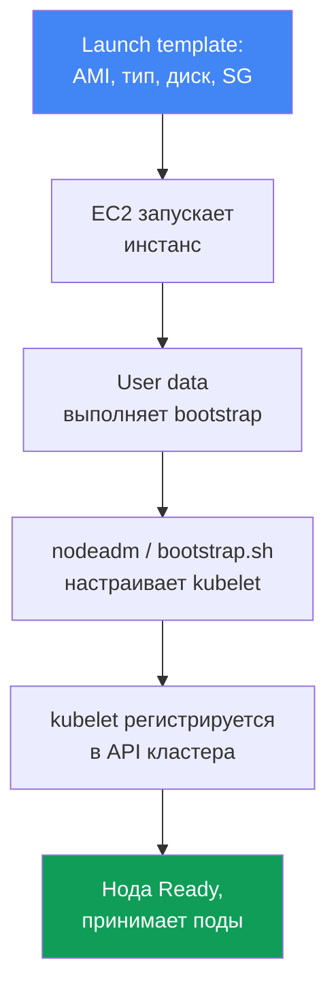
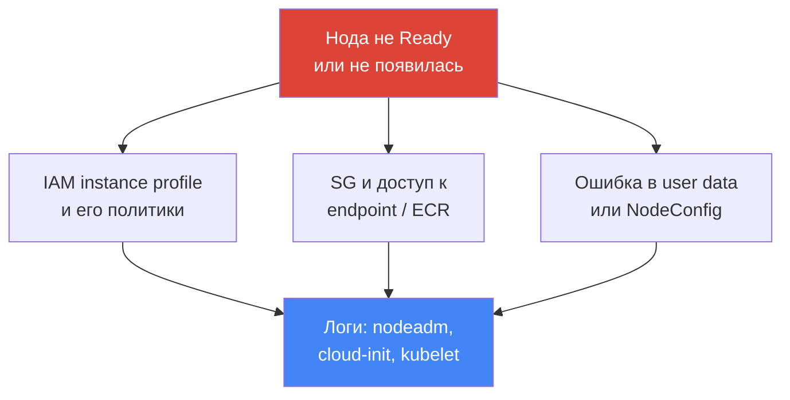

# Глава 10. AMI и bootstrap: AL2023, Bottlerocket, launch templates, kubelet и user data

> **Что дальше.** В главе 9 разобрали типы вычислений и выбор Auto Mode против своего стека.
> Взяв managed node group или self-managed ноды, вы упираетесь в вопрос: какой образ на ноде,
> как она загружается и присоединяется к кластеру. Эта глава про образ (AL2023, Bottlerocket,
> устаревающий AL2), launch template и bootstrap - момент, когда из голого EC2 выходит рабочая
> нода. Автомасштабирование и Karpenter - главы 11-12, spot - глава 13, плотность и `max-pods`
> - главы 6 и 14, ротация AMI при апгрейде - глава 38, харденинг ноды (IMDSv2, hop limit) -
> глава 19, подробный troubleshooting нод - глава 45.

## 10.1. «Нода не поднялась, а на старой полгода не было патчей»

Образ ноды и её загрузка - тихая тема ровно до первого сбоя. Дальше она всплывает сразу
несколькими способами, и все они дорогие:

- новую ноду подняли, а она **не появляется в `kubectl get nodes`** или висит `NotReady`:
  ошибка в user data, kubelet не смог зарегистрироваться, а на часах инцидент;
- нода работает полгода на том AMI, с которого её запустили, **непропатченные CVE ядра и
  runtime** копятся, а никто не пересоздаёт ноды, потому что «работает же»;
- при обновлении кластера **сломался bootstrap**: скрипт, годами присоединявший ноды, перестал
  работать, потому что поменялся формат образа (AL2 сменился на AL2023);
- собрали свой AMI, доложили «на всякий случай» лишних агентов, и через полгода **ноды
  разъехались**: одни собраны в марте, другие в сентябре, версии пакетов не совпадают.

Ни одна из бед не про Kubernetes как таковой. Все четыре - про то, **из чего собрана нода и как
она загружается**. Дальше по порядку: что такое AMI, какие есть варианты образов, как из
инстанса получается нода кластера и где это ломается.

## 10.2. AMI: почему не «просто Linux»

AMI (Amazon Machine Image) - шаблон, из которого EC2 разворачивает диск инстанса: ядро, ФС,
предустановленный софт и настройки. Можно взять любой образ Linux и доставить на него всё, что
нужно ноде, но так не делают: берут **EKS-оптимизированные AMI**, и на то есть причина.

Нода Kubernetes - это не «сервер с Linux», а набор конкретных компонентов нужных версий, что
должны совпасть с control plane. Образ уже несёт их в согласованном виде:

- **`kubelet`** нужной минорной версии (version skew с control plane ограничен, глава 3);
- **`containerd`** как container runtime и его настройки;
- утилиты регистрации ноды и **bootstrap-логику** (`nodeadm` на AL2023);
- предустановленные зависимости для VPC CNI и других аддонов.

Собирать это вручную - значит взять на себя сборку, тесты и синхронизацию версий, что AWS уже
делает. Поэтому дефолт - оптимизированный образ, а свой AMI берут только под причину (10.8).

## 10.3. Варианты образов: AL2023, Bottlerocket, Windows, AL2

У EKS-оптимизированных образов несколько семейств, и выбор между ними определяет модель отладки
и обновления ноды, а не только «какой там Linux».

- **AL2023** - полноценный дистрибутив Amazon Linux 2023: привычная файловая система, пакетный
  менеджер `dnf`, знакомые инструменты отладки. Дефолт для новых managed node groups. Требует
  VPC CNI не ниже `1.16.2` и по умолчанию включает IMDSv2.
- **Bottlerocket** - минимальная ОС под контейнеры: **read-only корень**, без пакетного
  менеджера, обновление **целым образом** (image-based, атомарно и с откатом). Управление через
  **API, а не SSH**; для доступа есть **control-контейнер** (штатное управление, SSM) и
  **admin-контейнер** (отладка, SSH, по умолчанию выключен).
- **Windows** - для нагрузок на Windows-контейнерах; ноды присоединяются своим bootstrap.
- **AL2** - устаревающий Amazon Linux 2. Важный факт: **Kubernetes 1.32 - последняя версия, для
  которой EKS выпускает AL2 AMI. С 1.33 остаются только AL2023 и Bottlerocket.** Публикацию AL2
  AMI AWS прекратил в конце ноября 2025 года. На новых кластерах AL2 брать уже не нужно.

| Образ | Что это | Отладка и доступ | Обновление | Когда брать |
|---|---|---|---|---|
| AL2023 | полный дистрибутив, `dnf` | привычная, SSH/SSM | обновление пакетов, ротация ноды | дефолт для Linux-нод |
| Bottlerocket | минимальная ОС под контейнеры | API, control/admin контейнеры | целым образом, атомарно | харденинг, минимум поверхности |
| Windows | образ для Windows-нод | инструменты Windows | по своему циклу | контейнеры на Windows |
| AL2 | устаревший Amazon Linux 2 | привычная | до 1.32, дальше нет | только legacy до миграции |

Выбор между AL2023 и Bottlerocket - это выбор модели: «привычный сервер, куда можно зайти» или
«запечатанный appliance с минимумом поверхности атаки». Auto Mode (глава 9) внутри использует
Bottlerocket, но там образ вы не выбираете.

## 10.4. Как инстанс становится нодой кластера

Между «EC2 запустился» и «нода приняла поды» лежит цепочка, которую полезно держать в голове
целиком: она же карта мест, где всё ломается.



**Launch template** задаёт, каким будет инстанс: какой AMI, тип инстанса, размер и тип диска,
security groups, IAM instance profile, user data и настройки IMDS. **User data** - это скрипт
или конфиг, который выполняется при первом старте и запускает **bootstrap**: тот настраивает
`kubelet` (адрес API, CA, имя кластера, метки, taints, `--max-pods`) и запускает его. `kubelet`
регистрируется в API кластера, нода становится `Ready` и начинает принимать поды.

Ключевой момент: **параметры одни и те же, а формат bootstrap у образов разный**. Имя кластера,
endpoint API, CA-сертификат, service CIDR, `max-pods`, labels и taints передаются во всех
случаях, но записываются по-разному.

| Образ | Формат bootstrap | Как передаются параметры |
|---|---|---|
| AL2023 | `nodeadm`, YAML `NodeConfig` | поля `spec.cluster` и `spec.kubelet` в user data |
| Bottlerocket | настройки в формате TOML | секции `[settings.kubernetes]` в user data |
| AL2 (до 1.32) | скрипт `bootstrap.sh` | аргументы скрипта и `--kubelet-extra-args` |

Именно на смене формата ломается bootstrap при апгрейде: старый `bootstrap.sh` из AL2 не
понимает AL2023, где его роль забрал `nodeadm`.
## 10.5. nodeadm и NodeConfig на AL2023

На AL2023 инициализацией ноды занимается `nodeadm`, а его вход - YAML-манифест `NodeConfig`.
Это замена скрипту `bootstrap.sh`: вместо позиционных аргументов и `--kubelet-extra-args` вы
описываете ноду декларативно.

```yaml
---
apiVersion: node.eks.aws/v1alpha1
kind: NodeConfig
spec:
  cluster:
    name: demo
    apiServerEndpoint: https://XXXXXXXX.gr7.us-west-2.eks.amazonaws.com
    certificateAuthority: <base64-CA>
    cidr: 10.100.0.0/16
  kubelet:
    config:
      maxPods: 110
      systemReserved:
        cpu: 100m
        memory: 200Mi
      kubeReserved:
        cpu: 100m
        memory: 500Mi
    flags:
      - --node-labels=role=apps
```

Через `kubelet` резервируют ресурсы под системные процессы, чтобы поды не выдавливали демоны и
нода не ушла в `NotReady`. `systemReserved` держит CPU и память под ОС (systemd, sshd),
`kubeReserved` - под сам `kubelet` и `containerd`. На AL2023 их задают в `kubelet.config`
(выше), на Bottlerocket - в тех же TOML-настройках, отдельными секциями:

```toml
[settings.kubernetes]
cluster-name = "demo"
api-server = "https://XXXXXXXX.gr7.us-west-2.eks.amazonaws.com"
cluster-certificate = "<base64-CA>"
cluster-dns-ip = "10.100.0.10"
max-pods = 110

[settings.kubernetes.system-reserved]
cpu = "100m"
memory = "200Mi"

[settings.kubernetes.kube-reserved]
cpu = "100m"
memory = "500Mi"
```

Это тот же набор параметров, что и в `NodeConfig`, но записанный конфигуратором Bottlerocket:
метаданные кластера и `max-pods` в `[settings.kubernetes]`, резервы - в дочерних секциях.

`maxPods` в `NodeConfig` - значение статическое, и `nodeadm` сам под prefix delegation его не
пересчитывает: включили префиксы (глава 7) - посчитайте потолок и впишите его сюда. У нод,
которые поднимает Karpenter, те же самые настройки `kubelet` живут не в user data, а в
`EC2NodeClass` (`spec.kubelet`): `maxPods` там задаётся явно, либо вместо него берут
`podsPerCore`, и тогда плотность считается от числа vCPU инстанса, не превышая `maxPods`.
Karpenter сам генерирует `NodeConfig` и его значения перебивают то, что вы написали в
`userData`, поэтому эти поля задают только через `EC2NodeClass` (механика - глава 12).

Важная деталь эксплуатации: на AL2 метаданные кластера (`certificateAuthority`, service `cidr`)
`bootstrap.sh` подтягивал сам через вызов `DescribeCluster`. На AL2023 при **своём launch
template или кастомном AMI** эти поля надо **передавать явно** в `NodeConfig`: лишний вызов API
убрали, чтобы он не упирался в throttling при массовом подъёме нод. Если вы берёте managed node
group **без** своего launch template или Karpenter, за вас это заполняется само. Поэтому
кастомный launch template на AL2023 требует аккуратного `NodeConfig`, а не «старого скрипта».

## 10.6. Где брать ID образа: SSM-параметры

ID AMI **не хардкодят**. Он свой в каждом регионе, зависит от минорной версии Kubernetes,
архитектуры и варианта образа, и меняется с каждым релизом с новыми патчами. Прибитый в коде
`ami-...` через месяц означает ноду со старым ядром. Вместо этого ID берут из **SSM Parameter
Store**, где AWS публикует актуальные значения. Нужно право `ssm:GetParameter`.

```bash
# AL2023, x86_64, стандартный вариант - подставьте свою версию и регион
aws ssm get-parameter \
  --name /aws/service/eks/optimized-ami/1.33/amazon-linux-2023/x86_64/standard/recommended/image_id \
  --region us-west-2 --query "Parameter.Value" --output text

# Bottlerocket, x86_64, вариант без GPU
aws ssm get-parameter \
  --name /aws/service/bottlerocket/aws-k8s-1.33/x86_64/latest/image_id \
  --region us-west-2 --query "Parameter.Value" --output text
```

| Образ | SSM-параметр (шаблон) |
|---|---|
| AL2023 x86_64 | `/aws/service/eks/optimized-ami/<версия>/amazon-linux-2023/x86_64/standard/recommended/image_id` |
| AL2023 arm64 | `/aws/service/eks/optimized-ami/<версия>/amazon-linux-2023/arm64/standard/recommended/image_id` |
| AL2023 NVIDIA | `/aws/service/eks/optimized-ami/<версия>/amazon-linux-2023/x86_64/nvidia/recommended/image_id` |
| Bottlerocket | `/aws/service/bottlerocket/aws-k8s-<версия>/<arch>/latest/image_id` |

Привязка к минорной версии в пути - не формальность: она гарантирует, что `kubelet` в образе
совпадает с control plane. При апгрейде кластера вы меняете версию в SSM-пути и получаете AMI с
`kubelet` следующей версии (процесс ротации при апгрейде - глава 38).

## 10.7. Launch template предметно

Managed node group **всегда** разворачивается через launch template. Если вы его не задали, EKS
создаёт свой автоматический - и его **редактировать руками не нужно**, как и трогать ASG под
группой напрямую (об этом предупреждали в главе 9: EKS должен сам управлять жизненным циклом
инстансов). Свой контроль появляется, когда вы **изначально** создаёте группу со своим launch
template: тогда конфигурацию можно менять новыми версиями шаблона.

Launch template **версионируется**: каждое изменение - новая версия, старые остаются. Смена
версии у группы **пересоздаёт все ноды** под новую конфигурацию, корректно их drain'ит.
Часть настроек задаётся **только** в launch template, часть - **только** в конфиге node group;
дублировать нельзя, иначе создание или обновление падает.

| Настройка | Где задаётся |
|---|---|
| Кастомный AMI ID | только в launch template |
| Размер и тип диска | в launch template (если он свой) |
| User data / bootstrap | в launch template |
| Настройки IMDS (hop limit, IMDSv2) | в launch template (харденинг - глава 19) |
| Security groups для remote access | только в launch template |
| Подсети (subnets) | только в конфиге node group |
| IAM-роль ноды (node role) | только в конфиге node group |
| Scaling config (min/max/desired) | только в конфиге node group |

```bash
# Посмотреть версии своего launch template
aws ec2 describe-launch-template-versions \
  --launch-template-id lt-0abc123 \
  --query "LaunchTemplateVersions[].{v:VersionNumber,ami:LaunchTemplateData.ImageId}"

# С каким launch template и какой версией связана node group
aws eks describe-nodegroup --cluster-name demo --nodegroup-name apps \
  --query "nodegroup.launchTemplate"
```

Настройки IMDS в launch template - это ещё и харденинг. По умолчанию hop limit равен 2, и под
из контейнера может достучаться до метаданных ноды и её IAM-роли. Форсируют IMDSv2 и урезают
путь до метаданных прямо в шаблоне:

```bash
# Новая версия шаблона: обязательный токен IMDSv2 и hop limit 1
aws ec2 create-launch-template-version --launch-template-id lt-0abc123 \
  --source-version 1 --launch-template-data \
  'MetadataOptions={HttpTokens=required,HttpPutResponseHopLimit=1,HttpEndpoint=enabled}'
```

`HttpTokens=required` включает IMDSv2 (запрос токена вместо простого GET),
`HttpPutResponseHopLimit=1` не даёт ответу метаданных уйти дальше самого хоста, так что под в
контейнере до них не дотянется.

Ровно одна оговорка, о которой узнают поздно: приём работает потому, что пакет из пода идёт
через свой сетевой namespace и делает лишний hop. Под с `hostNetwork: true` живёт в сетевом
стеке ноды, его пакет укладывается в один hop, и **метаданные с кредами роли ноды такому поду
доступны при любом hop limit**. Закрывается это не настройкой launch template, а двумя другими
способами: запретом `hostNetwork` через Pod Security Admission и тем, что прикладных прав на
роли ноды просто нет - они у пода через IRSA или Pod Identity (главы 16, 17 и 19). Детальный
харденинг ноды - глава 19.

Практический вывод: настройки образа и загрузки (AMI, диск, user data, IMDS) живут в launch
template и версионируются там; сеть, роль и масштаб - в конфиге node group. Не смешивать и не
править автогенерированный шаблон.

## 10.8. Кастомный AMI: когда оправдан и чем платите

Свой AMI берут не «чтобы был контроль вообще», а под конкретное требование, которое
оптимизированный образ не закрывает:

- **регуляторные требования и аттестация**: образ должен пройти внутренний security-процесс,
  нести CIS-хардненинг или конкретную сборку по стандарту;
- **преднастроенные агенты**: мониторинг, антивирус, security-агент уже в образе, чтобы нода
  поднималась готовой, а не досоставлялась при старте;
- **специфические драйверы и ядро**: особые GPU-драйверы, версия ядра, модули под нагрузку.

Чем за это платят - тем, что весь конвейер образа переходит на вас:

- **своя сборка**: пайплайн, который регулярно печёт образ, иначе ноды застревают на старом;
- **свои патчи**: CVE в ядре и пакетах закрываете вы, а не берёте готовыми из релиза AWS;
- **дрейф**, если собирать руками: образы из разных сборок разъезжаются по версиям пакетов -
  ровно та боль из раздела 10.1;
- **version skew**: если образ отстаёт от кластера, `kubelet` в нём может выйти за границы
  совместимости с control plane (глава 3).

Правильный подход - не собирать «с нуля», а брать **EKS-оптимизированный AMI как базу** и
допекать поверх него через image builder (например EC2 Image Builder), получая воспроизводимый
**golden image**. Открытые скрипты сборки этих образов AWS публикует, так что база и процесс
прозрачны. Собранный руками одноразовый образ - прямой путь к дрейфу.

## 10.9. Диагностика «нода не Ready»

Когда нода не появилась или висит `NotReady`, причина почти всегда в одном из нескольких мест;
искать её надо по логам bootstrap, а не гадать.



Типовые причины по частоте:

- **IAM instance profile без нужных политик**: у роли ноды нет прав присоединиться или тянуть
  образы из ECR, kubelet не проходит авторизацию;
- **security groups и сетевой доступ**: нода не достаёт до API-endpoint кластера или до ECR;
- **неверный bootstrap**: сломанный `NodeConfig`, не переданы `certificateAuthority`/`cidr` на
  AL2023 со своим launch template, опечатка в user data;
- **несовпадение версий**: `kubelet` из образа вне границ совместимости с control plane.

Куда смотреть на самой ноде (если доступ есть - на AL2023, не на Bottlerocket через SSH):

```bash
sudo cat /var/log/cloud-init-output.log            # логи user data и cloud-init
sudo journalctl -u kubelet --no-pager | tail -50   # статус и логи kubelet
sudo journalctl -u nodeadm-config -u nodeadm-run   # логи nodeadm на AL2023
```

Это первый срез, чтобы понять класс проблемы. Полный разбор «нода не присоединилась» с деревом
причин - глава 45; там же диагностика без доступа на ноду и типовые сообщения об ошибках.

## 10.10. Как это применяют в продакшене

- **ID образа берут из SSM по минорной версии**, а не хардкодят: так `kubelet` в AMI совпадает
  с control plane, а патчи приезжают с новыми релизами.
- **Ноды регулярно пересоздают**, а не держат месяцами на старом AMI: свежий образ - свежие
  патчи ядра и runtime, ротация закрывает CVE без ручного патчинга.
- **Кастомный AMI берут только под требование** (аттестация, агенты, драйверы) и собирают через
  image builder поверх оптимизированного, а не руками, чтобы не ловить дрейф.
- **Bottlerocket выбирают, где важна минимальная поверхность**: read-only корень, обновление
  образом, доступ через API и control-контейнер вместо открытого SSH.
- **Свой launch template заводят сразу при создании node group**; автогенерированный шаблон и
  ASG под группой руками не трогают.
- **На AL2023 со своим launch template проверяют `NodeConfig`**: `apiServerEndpoint`,
  `certificateAuthority` и `cidr` должны быть переданы явно.

## 10.11. Мини-глоссарий

- **AMI (Amazon Machine Image)** - шаблон диска инстанса: ядро, ФС, софт. Для нод берут
  EKS-оптимизированный, где уже согласованы `kubelet`, `containerd` и bootstrap-логика.
- **EKS-оптимизированный AMI** - образ от AWS с компонентами ноды нужных версий; семейства
  AL2023, Bottlerocket, Windows и устаревающий AL2.
- **Bottlerocket** - минимальная ОС под контейнеры: read-only корень, обновление целым образом,
  управление через API, control- и admin-контейнеры вместо открытого SSH.
- **nodeadm** - инициализатор ноды на AL2023; вход - YAML-манифест `NodeConfig`
  (`apiVersion: node.eks.aws/v1alpha1`), замена скрипту `bootstrap.sh`.
- **User data** - скрипт или конфиг, выполняемый при первом старте инстанса; запускает
  bootstrap и настраивает `kubelet`.
- **Launch template** - версионируемый шаблон инстанса (AMI, тип, диск, SG, user data, IMDS);
  managed node group всегда разворачивается через него.
- **Golden image** - воспроизводимый кастомный образ, собранный поверх оптимизированного AMI
  через image builder.

## 10.12. Итоги главы

- Нода - это не «сервер с Linux», а согласованный набор `kubelet`, `containerd` и bootstrap;
  для этого берут EKS-оптимизированный AMI, а не голый дистрибутив.
- Семейства образов: AL2023 (полный дистрибутив, `dnf`, привычная отладка), Bottlerocket
  (минимальная ОС, read-only корень, API вместо SSH), Windows и устаревающий AL2.
- Kubernetes 1.32 - последняя версия с AL2 AMI; с 1.33 остаются только AL2023 и Bottlerocket,
  публикацию AL2 AMI AWS прекратил.
- Инстанс становится нодой через цепочку launch template, user data, bootstrap, регистрация
  kubelet. Параметры одни, а формат bootstrap разный: nodeadm YAML, TOML, `bootstrap.sh`.
- На AL2023 инициализацией занимается `nodeadm` с манифестом `NodeConfig`; при своём launch
  template `certificateAuthority` и service `cidr` надо передавать явно.
- ID AMI не хардкодят, а берут из SSM по минорной версии, региону и варианту, так `kubelet`
  совпадает с control plane. Managed node group всегда идёт через launch template.
- В launch template форсируют IMDSv2 (`HttpTokens=required`) и hop limit 1, а через `kubelet`
  резервируют ресурсы (`systemReserved`, `kubeReserved`), чтобы поды не выдавили демоны.
- Кастомный AMI оправдан под аттестацию, агенты или драйверы, но приносит свой конвейер сборки,
  патчи, риск дрейфа и version skew; собирают golden image поверх оптимизированного.
- Нода не Ready - смотреть IAM instance profile, SG и доступ к endpoint/ECR, корректность
  bootstrap; логи в cloud-init, nodeadm и `journalctl -u kubelet` (подробно - глава 45).

## 10.13. Как это пригодится в реальной работе

Образ и bootstrap молчат, пока не подведут в худший момент: при подъёме нод в инцидент, при
апгрейде кластера или на аудите безопасности. Инженер, который понимает цепочку от launch
template до регистрации kubelet, на дежурстве не гадает, а идёт по местам отказа: роль ноды,
сеть, user data, логи nodeadm. При планировании та же карта отвечает на вопросы «на чём собраны
ноды», «как берётся ID AMI», «кто и когда их пересоздаёт». А знание про переход AL2 на AL2023
экономит самый обидный класс поломок - когда апгрейд валится не из-за Kubernetes, а из-за
сменившегося формата загрузки.

## 10.14. Вопросы для самопроверки

1. Почему для нод берут EKS-оптимизированный AMI, а не любой Linux с доустановкой пакетов?
2. Чем Bottlerocket отличается от AL2023 по модели отладки и обновления?
3. С какой версии Kubernetes AL2 AMI больше не выпускаются и что остаётся вместо него?
4. Опишите цепочку от запуска EC2 до состояния ноды `Ready`. Где в ней место bootstrap?
5. Чем различается формат bootstrap у AL2023, Bottlerocket и AL2?
6. Что такое `nodeadm` и `NodeConfig` и почему это замена `bootstrap.sh`?
7. Какие поля надо передавать явно в `NodeConfig` при своём launch template и почему?
8. Почему ID AMI не хардкодят и откуда его берут? Что даёт привязка к версии в SSM-пути?
9. Какие настройки задаются только в launch template, а какие только в конфиге node group?
10. Почему автогенерированный launch template и ASG под managed-группой нельзя править руками?
11. Когда оправдан кастомный AMI и какую цену вы за него платите?
12. Куда смотреть в первую очередь, если нода не появилась или висит `NotReady`?
13. Зачем форсировать IMDSv2 и hop limit 1 и что дают `systemReserved`/`kubeReserved`?

## Практика

Лаба курса к этой теме: [лаба 101 - кластер как код](../../labs/101/README_RU.MD). В ней
вы проверяете, на каком образе живут рабочие ноды (AL2023 из дефолтного NodePool
Karpenter); проверка - командой `check_result`. Запуск - `TASK=101 make run_eks_task`.

Помимо лабы, всё видно на живом кластере и через CLI. Начните с образов:
`aws ssm get-parameter` по путям из раздела 10.6 покажет актуальные ID AMI для вашей версии и
региона - сравните AL2023 и Bottlerocket. Затем посмотрите на группы нод: `aws eks
describe-nodegroup --cluster-name <cluster> --nodegroup-name <name> --query
"nodegroup.launchTemplate"` покажет, привязана ли группа к своему launch template.

Дальше загляните в сам шаблон: `aws ec2 describe-launch-template-versions --launch-template-id
<lt-id>` покажет, какой AMI, диск и user data заданы в каждой версии. На ноде (если это AL2023
и доступ открыт) посмотрите загрузку: `sudo cat /var/log/cloud-init-output.log`, `sudo
journalctl -u kubelet` и логи `nodeadm`. Пройдите по цепочке из раздела 10.4 и ответьте: откуда
берётся ID AMI, как давно пересоздавали ноды и что случится с bootstrap при апгрейде версии.

---
[Оглавление](../README_RU.md) · [Глава 9](../09/ru.md) · [Глава 11](../11/ru.md)
