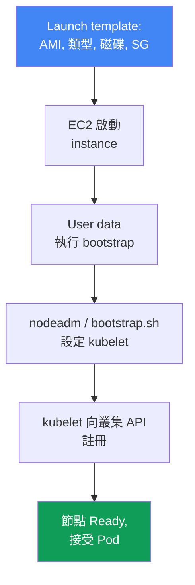
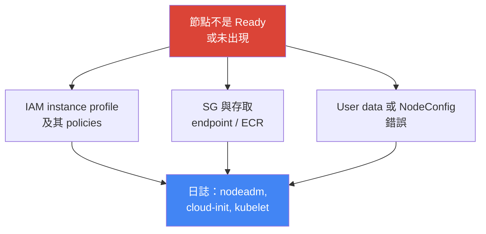

[Русская версия](ru.md) · [Eng version](en.md) · [Versión en español](es.md) · [Version française](fr.md) · [Deutsche Version](de.md) · [ქართული ვერსია](ge.md) · [日本語版](jp.md)
# 第 10 章．AMI 與 bootstrap：AL2023、Bottlerocket、launch template、kubelet 與 user data

> **接下來。** 第 9 章討論了運算類型，以及在 Auto Mode 與自建堆疊之間的選擇。
> 採用 managed node group 或 self-managed 節點後，接著要面對的問題是：節點使用什麼映像、如何開機並加入叢集。本章說明映像（AL2023、Bottlerocket、逐漸淘汰的 AL2）、launch template 與 bootstrap--讓裸 EC2 成為可運作節點的時刻。自動擴展與 Karpenter 請見第 11–12 章，spot 請見第 13 章，密度與 `max-pods` 請見第 6 與第 14 章，升級時的 AMI 輪替請見第 38 章，節點強化（IMDSv2、hop limit）請見第 19 章，節點的詳細 troubleshooting 請見第 45 章。

## 10.1．「節點沒起來，而舊節點半年都沒有修補」

節點映像與其啟動流程，在首次故障前都是安靜的議題。之後它會同時以多種昂貴方式浮現：

- 建立了新節點，卻**沒有出現在 `kubectl get nodes`** 中，或卡在 `NotReady`：user data 有錯、kubelet 無法註冊，而事故正在發生；
- 節點半年來一直使用啟動時的 AMI，**未修補的 kernel 與 runtime CVE** 不斷累積，卻沒有人重建節點，因為「它還能運作」；
- 叢集更新時 **bootstrap 壞了**：多年來用於加入節點的指令碼不再可用，因為映像格式變了（AL2 改為 AL2023）；
- 建置了自己的 AMI，為了「以防萬一」放入多餘 agent，半年後**節點發散了**：有些在三月建置，有些在九月，套件版本不一致。

這些問題沒有一項是 Kubernetes 本身的問題。四者都關於**節點由什麼組成，以及它如何啟動**。接下來依序說明：什麼是 AMI、有哪些映像選項、instance 如何成為叢集節點，以及哪裡會失敗。

## 10.2．AMI：為什麼不只是「Linux」

AMI（Amazon Machine Image）是 EC2 用來佈建 instance 磁碟的範本：kernel、檔案系統、預先安裝的軟體與設定。雖然可以採用任意 Linux 映像並在上面安裝節點所需的一切，但實務上不這麼做：會選擇 **EKS-optimized AMI**，理由如下。

Kubernetes 節點不是「裝了 Linux 的伺服器」，而是一組必須與 control plane 相符的特定版本元件。映像已經以相容的形式包含它們：

- 所需 minor version 的 **`kubelet`**（與 control plane 的 version skew 有限制，請見第 3 章）；
- 作為 container runtime 的 **`containerd`** 與其設定；
- 節點註冊工具與 **bootstrap 邏輯**（AL2023 上的 `nodeadm`）；
- 為 VPC CNI 與其他 addon 預先安裝的相依項目。

手動建置代表您要承擔建置、測試與版本同步，而 AWS 已經在做這些工作。因此預設使用 optimized image，只有在有明確理由時才使用自己的 AMI（10.8）。

## 10.3．映像選項：AL2023、Bottlerocket、Windows、AL2

EKS-optimized image 有多個系列；它們之間的選擇決定節點的除錯與更新模型，而不僅是「上面是哪個 Linux」。

- **AL2023**--完整的 Amazon Linux 2023 發行版：熟悉的檔案系統、`dnf` 套件管理器與常見的除錯工具。新 managed node group 的預設選項。需要至少 `1.16.2` 版的 VPC CNI，且預設啟用 IMDSv2。
- **Bottlerocket**--為容器打造的最小化 OS：**read-only root**、沒有套件管理器、透過**完整映像**更新（image-based、原子性且可回復）。透過 **API 而非 SSH** 管理；可使用 **control container**（標準管理、SSM）與 **admin container**（除錯、SSH，預設關閉）存取。
- **Windows**--適用於 Windows container 工作負載；節點透過其專用 bootstrap 加入。
- **AL2**--已淘汰的 Amazon Linux 2。重要事實：**Kubernetes 1.32 是 EKS 發行 AL2 AMI 的最後一個版本。自 1.33 起，僅保留 AL2023 與 Bottlerocket。** AWS 已在 2025 年 11 月底停止發行 AL2 AMI。新叢集不應再採用 AL2。

| 映像 | 是什麼 | 除錯與存取 | 更新 | 何時選用 |
|---|---|---|---|---|
| AL2023 | 完整發行版，`dnf` | 熟悉的方式、SSH/SSM | 套件更新、節點輪替 | Linux 節點的預設選項 |
| Bottlerocket | 容器專用最小化 OS | API、control/admin container | 完整映像、原子性 | 強化、最小攻擊面 |
| Windows | Windows 節點映像 | Windows 工具 | 依其自身週期 | Windows container |
| AL2 | 已淘汰的 Amazon Linux 2 | 熟悉的方式 | 至 1.32，之後不再支援 | 僅供遷移前的 legacy 使用 |

在 AL2023 與 Bottlerocket 之間選擇，等於在兩種模型之間選擇：「可登入的熟悉伺服器」或「攻擊面最小的密封 appliance」。Auto Mode（第 9 章）內部使用 Bottlerocket，但您無法選擇映像。

## 10.4．instance 如何成為叢集節點

從「EC2 已啟動」到「節點接受 Pod」之間有一條完整鏈路，值得牢記：它也是所有故障點的地圖。



**Launch template** 定義 instance 的樣貌：AMI、instance type、磁碟大小與類型、security groups、IAM instance profile、user data 與 IMDS 設定。**User data** 是在首次啟動時執行的指令碼或設定，並啟動 **bootstrap**：它會設定 `kubelet`（API 位址、CA、叢集名稱、labels、taints、`--max-pods`）並將其啟動。`kubelet` 向叢集 API 註冊，節點成為 `Ready`，開始接受 Pod。

關鍵在於：**參數相同，但不同映像的 bootstrap 格式不同**。所有情況都會傳遞叢集名稱、API endpoint、CA 憑證、service CIDR、`max-pods`、labels 和 taints，但寫入的方式不同。

| 映像 | Bootstrap 格式 | 如何傳遞參數 |
|---|---|---|
| AL2023 | `nodeadm`、YAML `NodeConfig` | user data 的 `spec.cluster` 與 `spec.kubelet` 欄位 |
| Bottlerocket | TOML 格式設定 | user data 的 `[settings.kubernetes]` 區段 |
| AL2（至 1.32） | `bootstrap.sh` 指令碼 | 指令碼引數與 `--kubelet-extra-args` |

這正是升級時 bootstrap 因格式變動而損壞的原因：AL2 舊有的 `bootstrap.sh` 無法理解 AL2023；在後者中，此角色由 `nodeadm` 接手。

## 10.5．AL2023 上的 nodeadm 與 NodeConfig

在 AL2023 上，節點初始化由 `nodeadm` 負責，其輸入為 YAML `NodeConfig` manifest。它取代 `bootstrap.sh` 指令碼：不再使用位置引數與 `--kubelet-extra-args`，而是以宣告方式描述節點。

```yaml
---
apiVersion: node.eks.aws/v1alpha1
kind: NodeConfig
spec:
  cluster:
    name: demo
    apiServerEndpoint: https://XXXXXXXX.gr7.us-west-2.eks.amazonaws.com
    certificateAuthority: <base64-CA>
    cidr: 10.100.0.0/16
  kubelet:
    config:
      maxPods: 110
      systemReserved:
        cpu: 100m
        memory: 200Mi
      kubeReserved:
        cpu: 100m
        memory: 500Mi
    flags:
      - --node-labels=role=apps
```

透過 `kubelet` 為系統程序保留資源，避免 Pod 排擠 daemon 而讓節點進入 `NotReady`。`systemReserved` 保留 CPU 與記憶體給 OS（systemd、sshd），`kubeReserved` 則給 `kubelet` 與 `containerd` 本身。在 AL2023 上，它們設定在 `kubelet.config`（如上）；在 Bottlerocket 上，則在相同 TOML 設定中的個別區段：

```toml
[settings.kubernetes]
cluster-name = "demo"
api-server = "https://XXXXXXXX.gr7.us-west-2.eks.amazonaws.com"
cluster-certificate = "<base64-CA>"
cluster-dns-ip = "10.100.0.10"
max-pods = 110

[settings.kubernetes.system-reserved]
cpu = "100m"
memory = "200Mi"

[settings.kubernetes.kube-reserved]
cpu = "100m"
memory = "500Mi"
```

這與 `NodeConfig` 是同一組參數，只是由 Bottlerocket configurator 以不同方式寫入：叢集 metadata 與 `max-pods` 位於 `[settings.kubernetes]`，保留資源位於子區段。

`NodeConfig` 中的 `maxPods` 是靜態值，`nodeadm` 不會自行針對 prefix delegation 重新計算：啟用 prefixes（第 7 章）後，請自行計算上限並填入。由 Karpenter 啟動的節點，這些相同的 `kubelet` 設定不在 user data，而在 `EC2NodeClass`（`spec.kubelet`）：其中明確設定 `maxPods`，或改用 `podsPerCore`，此時密度根據 instance vCPU 數量計算，且不會超過 `maxPods`。Karpenter 會自行產生 `NodeConfig`，其值會覆寫您在 `userData` 中寫入的內容，因此這些欄位只能透過 `EC2NodeClass` 設定（機制請見第 12 章）。

一個重要的營運細節：在 AL2 上，叢集 metadata（`certificateAuthority`、service `cidr`）會由 `bootstrap.sh` 透過 `DescribeCluster` 呼叫自行擷取。在 AL2023 上，使用**自己的 launch template 或 custom AMI** 時，必須在 `NodeConfig` 中**明確傳遞**這些欄位：移除額外 API 呼叫，是為了避免大量啟動節點時遇到 throttling。若採用**沒有**自己 launch template 的 managed node group 或採用 Karpenter，系統會自動為您填入。因此，在 AL2023 上使用 custom launch template 時，需要仔細設定 `NodeConfig`，而不是沿用「舊指令碼」。

## 10.6．在哪裡取得映像 ID：SSM parameters

AMI ID **不應硬編碼**。它在每個 region 都不同，取決於 Kubernetes minor version、架構與映像變體，並且隨每個含有新修補程式的 release 變更。一個硬寫在程式碼中的 `ami-...`，一個月後就代表使用舊 kernel 的節點。應改從 **SSM Parameter Store** 取得 ID，AWS 在此發布目前的值。需要 `ssm:GetParameter` 權限。

```bash
# AL2023、x86_64、標準變體--請代入自己的版本與 region
aws ssm get-parameter \
  --name /aws/service/eks/optimized-ami/1.33/amazon-linux-2023/x86_64/standard/recommended/image_id \
  --region us-west-2 --query "Parameter.Value" --output text

# Bottlerocket、x86_64、無 GPU 變體
aws ssm get-parameter \
  --name /aws/service/bottlerocket/aws-k8s-1.33/x86_64/latest/image_id \
  --region us-west-2 --query "Parameter.Value" --output text
```

| 映像 | SSM parameter（範本） |
|---|---|
| AL2023 x86_64 | `/aws/service/eks/optimized-ami/<版本>/amazon-linux-2023/x86_64/standard/recommended/image_id` |
| AL2023 arm64 | `/aws/service/eks/optimized-ami/<版本>/amazon-linux-2023/arm64/standard/recommended/image_id` |
| AL2023 NVIDIA | `/aws/service/eks/optimized-ami/<版本>/amazon-linux-2023/x86_64/nvidia/recommended/image_id` |
| Bottlerocket | `/aws/service/bottlerocket/aws-k8s-<版本>/<arch>/latest/image_id` |

路徑中綁定 minor version 並非形式而已：它保證映像中的 `kubelet` 與 control plane 相符。叢集升級時，您變更 SSM 路徑中的版本，即可取得含下一版本 `kubelet` 的 AMI（升級時的輪替流程請見第 38 章）。

## 10.7．具體認識 launch template

Managed node group **一律**透過 launch template 佈建。若未指定，EKS 會自動建立自己的 template--您**不應手動編輯**它，也不應直接動到底層 group 的 ASG（第 9 章已警告：EKS 必須自行管理 instance 的生命週期）。當您**在一開始**就以自己的 launch template 建立 group 時，才會擁有控制權：之後可透過 template 的新版本變更設定。

Launch template **有版本控制**：每次變更都是一個新版本，舊版本仍保留。變更 group 使用的版本會**重建所有節點**以套用新設定，並適當地 drain 它們。有些設定**只能**在 launch template 設定，有些**只能**在 node group config 設定；不能重複，否則建立或更新會失敗。

| 設定 | 設定位置 |
|---|---|
| Custom AMI ID | 僅限 launch template |
| 磁碟大小與類型 | launch template（若使用自有 template） |
| User data / bootstrap | launch template |
| IMDS 設定（hop limit、IMDSv2） | launch template（強化請見第 19 章） |
| Remote access 的 security groups | 僅限 launch template |
| Subnets | 僅限 node group config |
| 節點 IAM role（node role） | 僅限 node group config |
| Scaling config（min/max/desired） | 僅限 node group config |

```bash
# 檢視自有 launch template 的版本
aws ec2 describe-launch-template-versions \
  --launch-template-id lt-0abc123 \
  --query "LaunchTemplateVersions[].{v:VersionNumber,ami:LaunchTemplateData.ImageId}"

# node group 關聯的 launch template 與版本
aws eks describe-nodegroup --cluster-name demo --nodegroup-name apps \
  --query "nodegroup.launchTemplate"
```

Launch template 中的 IMDS 設定也是強化措施。預設 hop limit 為 2，container 中的 Pod 可能可以存取節點 metadata 與其 IAM role。可直接在 template 中強制使用 IMDSv2 並縮短 metadata 路徑：

```bash
# 新 template 版本：強制 IMDSv2 token 與 hop limit 1
aws ec2 create-launch-template-version --launch-template-id lt-0abc123 \
  --source-version 1 --launch-template-data \
  'MetadataOptions={HttpTokens=required,HttpPutResponseHopLimit=1,HttpEndpoint=enabled}'
```

`HttpTokens=required` 啟用 IMDSv2（要求 token，而非簡單的 GET），`HttpPutResponseHopLimit=1` 阻止 metadata 回應離開主機本身，因而 container 中的 Pod 無法取得它們。

有一項人們往往太晚才知道的限制：此作法有效，是因為 Pod 的封包經過獨立 network namespace，會多經過一個 hop。使用 `hostNetwork: true` 的 Pod 位於節點的 network stack 中，其封包只需一個 hop，因此**無論 hop limit 為何，這類 Pod 都能存取含節點 role credentials 的 metadata**。解法不是調整 launch template，而是兩種其他方法：透過 Pod Security Admission 禁止 `hostNetwork`，以及不要將應用程式權限放在節點 role 上--將它們授予 Pod，透過 IRSA 或 Pod Identity（第 16、17 與 19 章）。節點強化詳見第 19 章。

實務結論：映像與啟動設定（AMI、磁碟、user data、IMDS）位於 launch template 並在其中版本化；網路、role 與規模位於 node group config。不要混用，也不要修改自動產生的 template。

## 10.8．Custom AMI：何時合理，以及代價

採用自己的 AMI 並不是為了「完全掌控」，而是為了 optimized image 無法滿足的明確需求：

- **法規要求與認證**：映像必須通過內部 security 流程、包含 CIS hardening，或依標準進行特定建置；
- **預先設定的 agent**：映像中已有 monitoring、antivirus、security agent，使節點啟動後即可就緒，而不必在啟動時才安裝；
- **特定 driver 與 kernel**：特殊 GPU driver、kernel 版本或工作負載所需的 module。

代價是整條映像 pipeline 都轉由您負責：

- **自行建置**：需要定期產生映像的 pipeline，否則節點會停留在舊版本；
- **自行修補**：kernel 與套件的 CVE 由您處理，而非直接取得 AWS release 的現成修補；
- 若手動建置，會產生**drift**：不同建置的映像在套件版本上發散--正是第 10.1 節的痛點；
- **version skew**：若映像落後於叢集，其 `kubelet` 可能超出與 control plane 的相容範圍（第 3 章）。

正確做法不是「從零開始」建置，而是使用 **EKS-optimized AMI 作為基礎**，並透過 image builder（例如 EC2 Image Builder）在其上建置，產生可重現的 **golden image**。AWS 公開發布了這些映像的建置指令碼，因此基礎與流程都透明。一次性手工建置的映像是直接走向 drift 的道路。

## 10.9．診斷「節點不是 Ready」

當節點未出現或卡在 `NotReady`，原因幾乎總是在幾個位置之一；應從 bootstrap 日誌尋找，而非猜測。



依常見程度排序的典型原因：

- **IAM instance profile 缺少必要 policies**：node role 沒有加入或從 ECR 拉取映像的權限，kubelet 無法完成授權；
- **security groups 與網路存取**：節點無法連線至叢集 API endpoint 或 ECR；
- **錯誤的 bootstrap**：損壞的 `NodeConfig`、在 AL2023 使用自有 launch template 時未傳遞 `certificateAuthority`/`cidr`、user data 中的拼寫錯誤；
- **版本不相符**：映像中的 `kubelet` 超出與 control plane 的相容範圍。

節點本身應檢查的位置（若可以存取--AL2023 可用，Bottlerocket 不透過 SSH）：

```bash
sudo cat /var/log/cloud-init-output.log            # user data 與 cloud-init 日誌
sudo journalctl -u kubelet --no-pager | tail -50   # kubelet 狀態與日誌
sudo journalctl -u nodeadm-config -u nodeadm-run   # AL2023 上的 nodeadm 日誌
```

這是用來判斷問題類別的初步檢視。包含原因樹的「節點未加入」完整分析請見第 45 章；其中也包含無法存取節點時的診斷與典型錯誤訊息。

## 10.10．如何在生產環境中套用

- **透過 minor version 從 SSM 取得映像 ID**，而非硬編碼：這樣 AMI 中的 `kubelet` 會與 control plane 相符，且新的 release 會帶來修補程式。
- **定期重建節點**，而非讓它們在舊 AMI 上運作數月：新映像帶來新的 kernel 與 runtime 修補；輪替可避免手動修補而關閉 CVE。
- **僅在有需求時使用 custom AMI**（認證、agent、driver），並在 optimized image 之上透過 image builder 建置，而不是手動建立，以避免 drift。
- **在重視最小攻擊面時選擇 Bottlerocket**：read-only root、映像更新、透過 API 與 control container 存取，而非開放 SSH。
- **在建立 node group 時就設定自有 launch template**；不要手動觸碰自動產生的 template 與 group 底下的 ASG。
- **在 AL2023 搭配自有 launch template 時檢查 `NodeConfig`**：必須明確傳遞 `apiServerEndpoint`、`certificateAuthority` 與 `cidr`。

## 10.11．迷你詞彙表

- **AMI（Amazon Machine Image）**--instance 磁碟的範本：kernel、檔案系統、軟體。節點採用 EKS-optimized image，其中的 `kubelet`、`containerd` 與 bootstrap 邏輯已相互配合。
- **EKS-optimized AMI**--AWS 提供、包含所需版本節點元件的映像；系列包括 AL2023、Bottlerocket、Windows 與已淘汰的 AL2。
- **Bottlerocket**--容器專用最小化 OS：read-only root、完整映像更新、透過 API 管理，使用 control 與 admin container 取代開放 SSH。
- **nodeadm**--AL2023 上的節點初始化器；輸入是 YAML `NodeConfig` manifest（`apiVersion: node.eks.aws/v1alpha1`），取代 `bootstrap.sh` 指令碼。
- **User data**--instance 首次啟動時執行的指令碼或設定；啟動 bootstrap 並設定 `kubelet`。
- **Launch template**--可版本化的 instance 範本（AMI、類型、磁碟、SG、user data、IMDS）；managed node group 一律透過它佈建。
- **Golden image**--透過 image builder 在 optimized AMI 之上建立的可重現 custom image。

## 10.12．章節總結

- 節點不是「裝了 Linux 的伺服器」，而是一組相容的 `kubelet`、`containerd` 與 bootstrap；因此使用 EKS-optimized AMI，而不是裸發行版。
- 映像系列包括：AL2023（完整發行版、`dnf`、熟悉的除錯）、Bottlerocket（最小化 OS、read-only root、以 API 取代 SSH）、Windows 與已淘汰的 AL2。
- Kubernetes 1.32 是最後一個有 AL2 AMI 的版本；從 1.33 起只剩 AL2023 與 Bottlerocket，AWS 已停止發行 AL2 AMI。
- Instance 透過 launch template、user data、bootstrap 與 kubelet 註冊這條鏈路成為節點。參數相同，但 bootstrap 格式不同：nodeadm YAML、TOML、`bootstrap.sh`。
- 在 AL2023 上，初始化由搭配 `NodeConfig` manifest 的 `nodeadm` 負責；使用自有 launch template 時，必須明確傳遞 `certificateAuthority` 與 service `cidr`。
- AMI ID 不應硬編碼，而應按 minor version、region 與變體從 SSM 取得；如此 `kubelet` 可與 control plane 相符。Managed node group 一律透過 launch template。
- 在 launch template 中強制 IMDSv2（`HttpTokens=required`）與 hop limit 1，並透過 `kubelet` 保留資源（`systemReserved`、`kubeReserved`），以免 Pod 排擠 daemon。
- Custom AMI 適用於認證、agent 或 driver，但會帶來自有建置 pipeline、修補、drift 與 version skew 風險；應在 optimized image 之上建置 golden image。
- 節點不是 Ready 時，檢查 IAM instance profile、SG 與 endpoint/ECR 存取、bootstrap 正確性；查看 cloud-init、nodeadm 與 `journalctl -u kubelet` 日誌（細節請見第 45 章）。

## 10.13．這將如何用於實際工作

映像與 bootstrap 平時安靜無聲，卻會在最糟的時刻造成問題：事故中擴展節點時、叢集升級時，或安全稽核時。了解從 launch template 到 kubelet 註冊這條鏈路的工程師，在 on-call 時不會猜測，而是依失敗點逐一檢查：node role、網路、user data、nodeadm 日誌。規劃時，同一張地圖能回答「節點由什麼建置」、「AMI ID 如何取得」、「誰在何時重建節點」。而知道 AL2 到 AL2023 的轉換，可避免最令人沮喪的一類故障--升級並非因 Kubernetes 失敗，而是因啟動格式改變。

## 10.14．自我檢查問題

1. 為什麼節點使用 EKS-optimized AMI，而非任何 Linux 再安裝套件？
2. Bottlerocket 與 AL2023 的除錯和更新模型有何不同？
3. AL2 AMI 從哪個 Kubernetes 版本起不再發行？其替代選項是什麼？
4. 請描述從 EC2 啟動到節點成為 `Ready` 的鏈路。bootstrap 在哪個環節？
5. AL2023、Bottlerocket 與 AL2 的 bootstrap 格式有何不同？
6. 什麼是 `nodeadm` 與 `NodeConfig`，為什麼它們取代了 `bootstrap.sh`？
7. 使用自有 launch template 時，哪些欄位必須在 `NodeConfig` 明確傳遞，為什麼？
8. 為什麼不應硬編碼 AMI ID，以及應從哪裡取得？SSM 路徑中綁定版本有什麼作用？
9. 哪些設定僅在 launch template 設定，哪些僅在 node group config 設定？
10. 為什麼不能手動修改自動產生的 launch template 與 managed group 底下的 ASG？
11. Custom AMI 何時合理，其代價是什麼？
12. 節點未出現或卡在 `NotReady` 時，應優先檢查哪裡？
13. 為什麼要強制 IMDSv2 與 hop limit 1？`systemReserved`/`kubeReserved` 有什麼作用？

## 實作

本主題的課程 lab：[lab 101--以程式碼管理叢集](../../labs/101/README_TW.MD)。其中您會檢查工作節點使用的映像（來自 Karpenter 預設 NodePool 的 AL2023）；可使用 `check_result` 指令檢查。啟動方式為 `TASK=101 make run_eks_task`。

除了 lab 外，您可透過執行中的叢集與 CLI 檢視一切。先從映像開始：依第 10.6 節路徑執行 `aws ssm get-parameter`，會顯示您版本與 region 的目前 AMI ID--比較 AL2023 與 Bottlerocket。接著檢視 node group：`aws eks describe-nodegroup --cluster-name <cluster> --nodegroup-name <name> --query "nodegroup.launchTemplate"` 會顯示 group 是否連結至自有 launch template。

接著查看 template 本身：`aws ec2 describe-launch-template-versions --launch-template-id <lt-id>` 會顯示各版本設定的 AMI、磁碟與 user data。在節點上（若為 AL2023 且已開放存取），檢查啟動狀況：`sudo cat /var/log/cloud-init-output.log`、`sudo journalctl -u kubelet` 與 `nodeadm` 日誌。依第 10.4 節的鏈路逐步檢查，並回答：AMI ID 從何而來、節點上次重建是何時，以及升級版本時 bootstrap 會發生什麼事。

---
[目錄](../README_TW.md) · [第 9 章](../09/tw.md) · [第 11 章](../11/tw.md)
