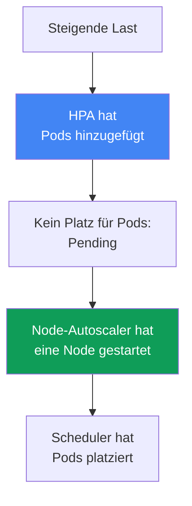
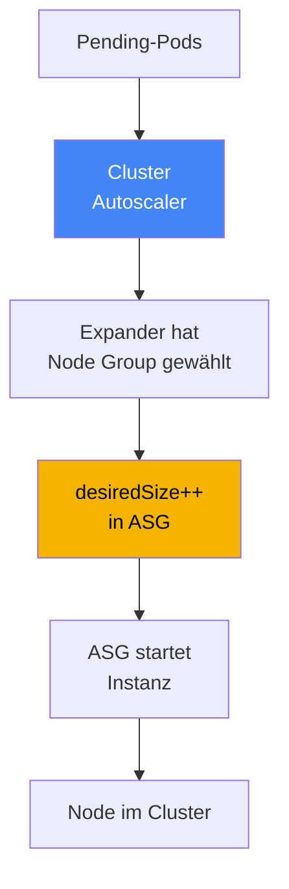
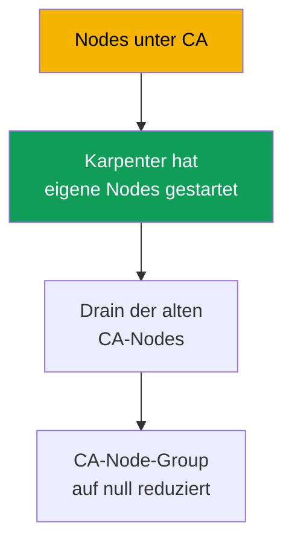

[Eng version](en.md) · [Versión en español](es.md) · [Version française](fr.md) · [Русская версия](ru.md) · [ქართული ვერსია](ge.md) · [繁體中文版](tw.md) · [日本語版](jp.md)
# Kapitel 11. Cluster Autoscaler und Karpenter: zwei Ansätze zur Node-Skalierung

> **Wie es weitergeht.** Rechentypen und Auto Mode wurden in Kapitel 9 behandelt, AMIs und der Node-Bootstrap in Kapitel 10. Nun geht es darum, wie Nodes unter Last ohne manuelles Anpassen von `desiredSize` wachsen und schrumpfen. Dafür gibt es in EKS zwei Werkzeuge – Cluster Autoscaler und Karpenter –, und dieses Kapitel behandelt die Wahl zwischen ihren Ansätzen. Karpenter im Detail (`NodePool`, `EC2NodeClass`, Consolidation, Drift, Disruption Budgets) folgt in Kapitel 12, Spot-Instanzen in Kapitel 13, Dichte und Sizing in Kapitel 14 sowie Autoscaling der Pods selbst (HPA, VPA, KEDA) in Kapitel 35.

## 11.1. „Pods hängen in Pending, aber es erscheinen keine Nodes“

Morgendlicher Traffic-Anstieg. HPA hat korrekt Replikate hinzugefügt, aber die neuen Pods starten nicht – sie hängen in `Pending`. `kubectl describe pod` zeigt das Ereignis `FailedScheduling`: Der Scheduler kann sie nirgends platzieren, auf den Nodes sind keine Ressourcen frei. Niemand fügt Nodes hinzu, weil dies niemand verwaltet: `desiredSize` in der Auto Scaling group wurde vor einem Monat manuell für die damalige Last gesetzt.

```bash
kubectl get pods --field-selector status.phase=Pending -A
kubectl describe pod <pod> | grep -A5 Events
```

Das spiegelbildliche Problem tritt nachts auf, wenn der Traffic nachgelassen hat: Es gibt wieder wenige Replikate, aber weiterhin dieselben Nodes – unterausgelastet, aber eingeschaltet, und die EC2-Rechnung läuft weiter. Die manuelle Verwaltung von `desiredSize` skaliert grundsätzlich nicht: Die erforderliche Node-Anzahl lässt sich nicht im Voraus erraten; eine Reserve „für alle Fälle“ vorzuhalten bedeutet, rund um die Uhr für Leerlauf zu zahlen.

Es braucht einen Mechanismus, der **selbst Nodes hinzufügt, wenn Pods keinen Platz mehr haben, und sie entfernt, wenn Nodes leer werden**. Dafür gibt es in EKS zwei Mechanismen: Cluster Autoscaler und Karpenter. Sie lösen dieselbe Aufgabe unterschiedlich, und die Wahl zwischen ihnen ist Thema dieses Kapitels.

## 11.2. Zwei Ebenen des Autoscalings: Pods und Nodes

Zunächst muss klar getrennt werden, damit es später nicht zu Verwirrungen kommt: Autoscaling in Kubernetes findet auf **zwei unterschiedlichen Ebenen** statt, und es ist nicht dasselbe.

- **Pod-Ebene.** HPA ändert die Replikatanzahl eines Deployments, VPA die Requests und Limits, KEDA skaliert anhand externer Metriken. Das ist Skalierung der **Last**; sie wird in Kapitel 35 behandelt.
- **Node-Ebene.** Cluster Autoscaler und Karpenter ändern Anzahl und Zusammensetzung der **Nodes** unter dem Cluster. Das ist Skalierung der **Kapazität** und das Thema hier.

Die Ebenen arbeiten zusammen und lösen einander in einer Kette aus. HPA erkennt zunehmende Last und fügt Pods hinzu. Auf den aktuellen Nodes reicht der Platz nicht – sie bleiben in `Pending`. Das ist das Signal für den Node-Autoscaler: Er bemerkt die nicht platzierbaren Pods und startet eine Node, auf der der Scheduler sie platziert. Wenn die Last abnimmt, läuft die Kette rückwärts: HPA entfernt Pods, Nodes werden leer, und der Node-Autoscaler fährt sie herunter.



Die praktische Schlussfolgerung: Wenn Pods in `Pending` hängen, verstehen Sie zuerst, auf welcher Ebene der Engpass liegt. Fehlen Replikate, ist HPA zuständig (Kapitel 35). Sind Replikate vorhanden, können aber wegen fehlender Ressourcen nicht platziert werden, ist der Node-Autoscaler zuständig – also dieses Kapitel. Beide Ebenen werden zusammen benötigt: HPA ohne Node-Autoscaler stößt an die Kapazitätsgrenze, ein Node-Autoscaler ohne HPA erfährt nicht, dass mehr Replikate erforderlich sind.

## 11.3. Cluster Autoscaler: Skalierung über Auto Scaling groups

Cluster Autoscaler (CA) ist der klassische Node-Autoscaler von SIG Autoscaling, der seit Jahren in EKS „out of the box“ verfügbar ist. Sein Modell: Er **erstellt Instanzen nicht selbst**, sondern verwaltet vorhandene Auto Scaling groups. Erkennt CA nicht platzierbare Pods, berechnet er, welche Node Group sie aufnehmen kann, und erhöht deren `desiredSize`; die ASG startet eine Instanz aus ihrem Launch Template, und die Node registriert sich im Cluster. Bei Unterauslastung verringert CA umgekehrt `desiredSize`, und die ASG beendet die Instanz.



Wenn es mehrere Gruppen gibt und ein Pod in mehrere passt, wählt CA mittels **Expander**. Die in der Autoscaler-Dokumentation beschriebenen Strategien sind: `least-waste` (die geringste Restmenge an Ressourcen nach der Platzierung, Standard), `priority` (nach den von Ihnen festgelegten Gruppenprioritäten), `most-pods` (wo die meisten Pods hineinpassen) und `random`. Bei AWS verwendet man meist `least-waste` oder `priority`.

Die zentrale Anforderung an die Konfiguration: Eine **Node Group muss hinsichtlich Ressourcen homogen sein**. CA geht davon aus, dass alle Instanzen der Gruppe hinsichtlich CPU und Speicher identisch sind, und schätzt anhand einer Beispiel-Node ab, ob ein Pod hineinpasst. Werden `m5.large` und `m5.4xlarge` in einer Gruppe gemischt, wird die Berechnung falsch und die Entscheidungen werden fehlerhaft. Daraus ergibt sich das typische CA-Antipattern: ein Zoo aus zehn engen Gruppen für jede Lastklasse, den niemand vollständig überblickt.

## 11.4. Einschränkungen von Cluster Autoscaler

CA ist zuverlässig und verständlich, doch sein Modell „über ASG“ setzt Grenzen, an die man im großen Maßstab stößt:

- **Reaktion auf Gruppenebene, nicht auf Pod-Ebene.** CA ändert `desiredSize`, aber welche Instanz genau gestartet wird, entscheidet die ASG über ihr Launch Template. CA wählt keinen Typ für einen konkreten Pod.
- **Die Menge der Typen ist durch Gruppen festgelegt.** Soll eine neue Instanzklasse verwendet werden, benötigen Sie eine neue Node Group mit eigenem Launch Template. Die Flexibilität ist durch die Zahl vorab erstellter Gruppen begrenzt.
- **Geschwindigkeit.** Zwischen dem Auftreten von `Pending` und einer bereiten Node liegt eine Kette: CA berechnet neu, ruft die ASG auf, die ASG startet die Instanz, die Node bootet und registriert sich. In der Praxis dauert dies merklich länger als ein direkter EC2-Aufruf.
- **Packing ist eingeschränkt.** CA kann unterausgelastete Nodes entfernen, verschiebt aber keine Last, um sie auf Instanzen anderer Größe dichter zu packen – das ist Karpenters Bereich.

Keiner dieser Punkte macht CA ungeeignet. Sie zeigen auf, wo sein Modell hinderlich wird: bei vielen heterogenen Lasten, der Anforderung nach schneller Reaktion und dem Wunsch, Instanztypen fein auszuwählen.

## 11.5. Karpenter: Instanzen direkt für nicht platzierbare Pods

Karpenter ist ein ursprünglich bei AWS entwickelter (heute Teil von SIG Autoscaling) Node-Autoscaler, der den anderen Weg einschlägt. Er **verwendet keine Auto Scaling group**. Karpenter beobachtet nicht platzierbare Pods direkt, liest ihre Anforderungen (Requests, nodeSelector, Affinity, Topology, Toleration) und **erstellt selbst eine EC2-Instanz für sie**, indem er die EC2-API ohne ASG als Zwischeninstanz aufruft.

Den Instanztyp wählt Karpenter **selbst** aus einer großen, von Ihnen freigegebenen Auswahl und nimmt einen Typ, der zu den Pods passt und günstiger ist. Daraus ergeben sich gegenüber CA seine Stärken:

- **Geschwindigkeit.** Die Instanz startet über einen direkten EC2-Aufruf ohne die Zwischenschicht ASG; dadurch vergeht von `Pending` bis zu einer bereiten Node merklich weniger Zeit.
- **Flexibilität der Typen.** Gruppen für jede Klasse müssen nicht vorab zugeschnitten werden – Karpenter nimmt für konkrete Pods einen geeigneten Typ aus dem erlaubten Bereich.
- **Consolidation (Verdichtung).** Karpenter kann den Cluster aktiv verdichten: Erkennt er, dass sich die Last dichter packen lässt, verschiebt er Pods und ersetzt Nodes durch kleinere oder entfernt überflüssige Nodes; dies reduziert Leerlauf.
- **Diversifizierung für Spot.** Karpenter kann zugleich viele verschiedene Instanztypen auswählen, wodurch Spot-Lasten robuster gegen Unterbrechungen werden (Spot im Detail: Kapitel 13).

Hier halten wir bewusst auf der Ebene des Ansatzes an. Die Konfiguration – die Objekte `NodePool` und `EC2NodeClass`, Consolidation-Richtlinien, Drift und Disruption Budgets – wird in Kapitel 12 ausführlich behandelt. In diesem Kapitel ist Karpenter als **Ansatz**, nicht als Konfiguration, wichtig.

```bash
kubectl get nodepools
kubectl get nodeclaims
```

## 11.6. Direkter Vergleich der Ansätze

Beide Werkzeuge fügen unter Last Nodes hinzu und entfernen sie, tun dies aber grundlegend unterschiedlich. Der Vergleich entlang der Achsen, die die Wahl tatsächlich beeinflussen:

| Achse | Cluster Autoscaler | Karpenter |
|---|---|---|
| Mechanismus | über Auto Scaling groups | direkter EC2-Aufruf, ohne ASG |
| Reaktionsgeschwindigkeit | langsamer: über die ASG-Schicht | schneller: Instanz direkt |
| Wahl des Instanztyps | durch das Launch Template der Gruppe festgelegt | wählt selbst aus einem Bereich |
| Packing / Consolidation | nur Entfernen leerer Nodes | aktive Verdichtung und Ersatz |
| Spot-Diversifizierung | innerhalb der Gruppen | viele Typen gleichzeitig (Kapitel 13) |
| Komplexität | Node Groups und ihre Launch Templates | eigene CRDs `NodePool`, `EC2NodeClass` |
| Reife und Abdeckung | langjährig, funktioniert in verschiedenen Clouds | AWS-first, auf EKS ausgereift |

Die Achse Geschwindigkeit sollte gesondert aufgeschlüsselt werden, weil sie bei Traffic-Spitzen entscheidend ist. Bei Cluster Autoscaler setzt sich die Provisioning-Verzögerung aus einer Kette zusammen: Polling-Zyklus von CA, Neuberechnung und Aufruf der ASG, Instanzstart durch die ASG, Booten und Registrierung der Node. Bei Karpenter entfallen die Zwischenschritte über ASG: Er reagiert ereignisgesteuert auf `Pending` und ruft EC2 direkt auf, weshalb deutlich weniger Zeit von `Pending` bis zur bereiten Node vergeht. Zudem fasst Karpenter eine Gruppe von `Pending`-Pods in einer Kapazitätsentscheidung zusammen, statt Gruppen einzeln zu verändern.

Die Tabelle darf nicht als „Karpenter ist immer besser“ gelesen werden. CA hat eigene Einsatzbereiche:

- **Einfache, vorhersehbare Cluster** mit ein paar homogenen Gruppen, in denen Karpenters Flexibilität nicht benötigt wird und der vertraute CA die Aufgabe ohne neue CRDs erfüllt.
- **Multi-Cloud-Vereinheitlichung.** CA funktioniert bei vielen Anbietern auf dieselbe Weise und gibt einem Team mit Clustern in unterschiedlichen Clouds dadurch ein einheitliches Werkzeug und einen einheitlichen Prozess.
- **Bestehende Installationen**, in denen CA bereits läuft, erprobt ist und keinen Engpass darstellt: Einen funktionierenden Mechanismus nur wegen eines Trends auszutauschen, ergibt keinen Sinn.

Karpenter gewinnt dort, wo gerade die Einschränkungen von CA schmerzen: heterogene Lasten, eine Anforderung nach schneller Reaktion, feine Typauswahl und dichte Packung zur Kostenreduzierung.

## 11.7. Zusammenhang mit Auto Mode

Eine wichtige Verzweigung aus Kapitel 9: In **EKS Auto Mode ist Karpenter bereits in den Service integriert** und nicht als Cluster-Komponente sichtbar. Sie installieren ihn nicht über Helm, aktualisieren ihn nicht und sehen seinen Pod nicht in `kube-system`. Die Logik zur Instanzauswahl, Consolidation und Ereignisverarbeitung läuft innerhalb des verwalteten Modus; Sie beeinflussen sie nur über die Standard-`NodePool` und eigene `NodePool` (die Standard-Pools in Auto Mode können nicht geändert, eigene aber hinzugefügt werden).

```bash
kubectl get pods -n kube-system
```

Daraus folgt praktisch: Läuft der Cluster im Auto Mode, ist Karpenter bereits vorhanden, nur verborgen; einen Node-Autoscaler zusätzlich zu installieren, ist weder nötig noch möglich. Wenn jedoch **ein eigener Karpenter mit detaillierter Konfiguration** benötigt wird (eigene Consolidation-Richtlinie, eigene Disruption Budgets, eigene `EC2NodeClass`), ist das ein eigener Stack: Sie installieren und betreiben Karpenter selbst auf Managed oder selbstverwalteten Nodes. Cluster Autoscaler und ein selbst betriebener Karpenter gehören zum eigenen Stack; Auto Mode ist Karpenter „unter der Haube“ ohne Zugriff auf seine Interna.

| Szenario | Wodurch Nodes skaliert werden | Wer den Autoscaler verwaltet |
|---|---|---|
| EKS Auto Mode | integrierter Karpenter | AWS; Sie definieren nur eigene NodePool |
| Eigener Stack mit Karpenter | von Ihnen installierter Karpenter | Sie: CRDs, Upgrades, Konfiguration |
| Eigener Stack mit Cluster Autoscaler | CA über Ihren Node Groups | Sie: CA-Deployment, ASG, Expander |

## 11.8. Was wählen: Checkliste

Reduzieren Sie die Wahl auf einige Fragen statt auf „was ist neuer“.

- **Läuft der Cluster im Auto Mode?** Dann ist der Autoscaler bereits vorhanden (integrierter Karpenter), die Frage ist geklärt – konfigurieren Sie über eigene `NodePool`.
- **Neuer Cluster, eigener Stack, keine starken Einschränkungen?** Nehmen Sie **Karpenter**: schneller, flexibler bei Typen, besseres Packing und Spot-Diversifizierung. Bei neuen EKS-Installationen ist das der standardmäßig empfohlene Ansatz.
- **Ist eine Vereinheitlichung mit anderen Clouds durch ein Werkzeug erforderlich?** CA bietet überall einen einheitlichen Weg – ein starker Grund, bei ihm zu bleiben.
- **Einfacher, vorhersehbarer Cluster mit einigen homogenen Gruppen?** CA erfüllt die Aufgabe ohne neue CRDs, und das ist in Ordnung.
- **CA ist bereits installiert, erprobt und stört nicht?** Ändern Sie funktionierende Systeme nicht nur wegen eines neuen Werkzeugs; migrieren Sie, wenn Sie an die Einschränkungen aus Abschnitt 11.4 stoßen.

Die Kurzfassung: Für neue EKS-Cluster wird standardmäßig Karpenter empfohlen (oder Auto Mode, wo es integriert ist). Cluster Autoscaler bleibt eine vernünftige Wahl für bestehende Installationen, Multi-Cloud-Szenarien und einfache vorhersehbare Cluster.

## 11.9. Koexistenz und Migration

**Können beide gleichzeitig betrieben werden?** Technisch ja, aber vorsichtig und **auf unterschiedlichen Node-Mengen**: CA verwaltet seine Node Groups, Karpenter seine `NodePool`; ihre Verantwortungsbereiche dürfen sich nicht überschneiden. Wenn beide dieselben Nodes beanspruchen, werden sie um Scale-down-Entscheidungen konkurrieren und einander stören. Dieser Modus ist nur vorübergehend während einer Migration gerechtfertigt, nicht als dauerhafte Konstruktion.

**Warum meist gerade von CA zu Karpenter migriert wird.** Der Grund ist nicht ein Trend, sondern dieselben Einschränkungen aus Abschnitt 11.4: Im großen Maßstab sammelt sich ein Zoo von Node Groups an, der Leerlauf steigt wegen schwachen Packings, die Reaktion auf Spitzen ist langsam. Karpenter behebt diese Probleme, daher ist die Migrationsrichtung fast immer einseitig.

**Das Migrationsprinzip: über neue Nodes, nicht im laufenden Betrieb.** Bestehende Pods werden nicht auf einer laufenden Node unter einem anderen Autoscaler umgezogen. Karpenter startet eigene Nodes daneben, die Last wird schrittweise auf sie übertragen (beispielsweise durch Cordoning und Draining der alten CA-Nodes), und die von CA verwalteten Node Groups werden auf null verkleinert und entfernt, wenn dort keine Last mehr vorhanden ist. So wird ein Zeitpunkt vermieden, zu dem beide Mechanismen für eine Node verantwortlich sind.

**Schrittweiser Plan (CA -> Karpenter v1).**

1. Karpenter v1 wird neben dem laufenden CA installiert, und die Bereiche werden getrennt: eigene `NodePool` bei Karpenter, eigene Node Groups bei CA, ohne Überschneidung (Koexistenzphase).
2. Neue und unkritische Lasten werden auf Karpenter-Nodes gelenkt; es wird geprüft, ob Provisioning und Consolidation wie erwartet funktionieren.
3. Alte CA-Nodes werden schrittweise gecordont und gedraint, die Pods ziehen auf Karpenter-Nodes um.
4. Die CA-Node-Groups werden auf null reduziert; anschließend werden Cluster Autoscaler selbst und seine IAM-Rollen entfernt.



**So schützen Sie sensible Lasten während der Erprobung.** Während Karpenter auf den ersten Pods geprüft wird, schützt die Pod-Anmerkung `karpenter.sh/do-not-disrupt: "true"` vor einer ungeplanten Entfernung der Node (in der alten API hieß sie `karpenter.sh/do-not-evict`). Ihr Umfang muss klar sein: Die Anmerkung hält **die gesamte Node**, auf der der Pod läuft, und verhindert alle freiwilligen Unterbrechungen, einschließlich eines Updates durch Drift. Während der Migration wird sie daher gezielt auf bestimmte Pods gesetzt und wieder entfernt, sobald die Last erprobt ist; andernfalls stehen neben der Consolidation auch AMI-Updates still (Kapitel 12).

Die Karpenter-Konfigurationsdetails, die bei der Migration benötigt werden (`NodePool`, `EC2NodeClass`, Consolidation, Disruption Budgets), folgen in Kapitel 12. Hier ist das Prinzip entscheidend: Die Migration erfolgt durch Übertragung der Last auf neue Nodes, nicht durch Umschalten des Autoscalers unter laufenden Pods.

## 11.10. Anwendung in der Produktion

- **Die zwei Autoscaling-Ebenen werden klar getrennt.** Bevor `Pending` behoben wird, wird bestimmt, ob der Engpass auf Pod-Ebene (HPA, Kapitel 35) oder Node-Ebene (dieses Kapitel) liegt – die Behandlung ist unterschiedlich.
- **Für neue EKS-Cluster wird Karpenter oder Auto Mode verwendet**, wo es integriert ist; Cluster Autoscaler bleibt für bestehende Installationen und Multi-Cloud-Szenarien.
- **Node Groups für Cluster Autoscaler bleiben hinsichtlich Ressourcen homogen**, sonst ist die CA-Berechnung anhand der Beispiel-Node falsch und Scaling-Entscheidungen werden fehlerhaft.
- **CA und Karpenter werden nicht auf denselben Nodes ausgeführt.** Werden beide während einer Migration benötigt, sind ihre Bereiche strikt getrennt: eigene Node Groups für CA, eigene `NodePool` für Karpenter.
- **Migrationen erfolgen über neue Nodes**, nicht durch Umschalten des Autoscalers im laufenden Betrieb: Karpenter startet seine Nodes, die Last wird durch Draining übertragen und CA-Gruppen werden auf null reduziert.
- **Die Werkzeugwahl wird bewusst festgehalten** – anhand der Checkliste 11.8 und nicht nach Neuheit: CA hat eigene Einsatzbereiche, und ein funktionierender, erprobter CA wird nicht nur zum Werkzeugwechsel ersetzt.

## 11.11. Mini-Glossar

- **Cluster Autoscaler (CA)** – Node-Autoscaler über Auto Scaling groups: Er ändert `desiredSize` der Gruppen anhand nicht platzierbarer Pods und Unterauslastung. Instanztypen sind durch die Launch Templates der Gruppen festgelegt.
- **Karpenter** – Node-Autoscaler, der EC2-Instanzen direkt für konkrete nicht platzierbare Pods erstellt und den Typ selbst aus dem erlaubten Bereich auswählt. Die Konfiguration folgt in Kapitel 12.
- **Expander** – Cluster-Autoscaler-Strategie zur Auswahl einer Node Group, wenn ein Pod in mehrere passt: `least-waste` (Standard), `priority`, `most-pods`, `random`.
- **Consolidation** – aktive Clusterverdichtung in Karpenter: Verschieben von Pods und Ersetzen von Nodes durch kleinere oder Entfernen überflüssiger Nodes, um Leerlauf zu reduzieren (im Detail: Kapitel 12).
- **Node-Skalierung gegenüber Pod-Skalierung** – unterschiedliche Ebenen: Nodes skalieren CA und Karpenter (dieses Kapitel), Pods HPA, VPA und KEDA (Kapitel 35).

## 11.12. Zusammenfassung des Kapitels

- Autoscaling findet auf zwei Ebenen statt: Pods skalieren HPA, VPA und KEDA (Kapitel 35), Nodes Cluster Autoscaler und Karpenter (dieses Kapitel). Die Ebenen sind durch die Kette Pending -> neue Node verbunden.
- Cluster Autoscaler arbeitet über Auto Scaling groups: Er ändert `desiredSize`, wählt die Gruppe über einen Expander und benötigt homogene Gruppen. Die Instanztypen werden durch ihre Launch Templates bestimmt.
- Einschränkungen von CA: Reaktion auf Gruppenebene, durch Gruppen festgelegte Typmenge, langsamer durch die ASG-Schicht, Packing auf das Entfernen leerer Nodes beschränkt.
- Karpenter erstellt Instanzen direkt für nicht platzierbare Pods, wählt den Typ selbst, arbeitet schneller und unterstützt Consolidation sowie Typ-Diversifizierung für Spot. Die Konfiguration folgt in Kapitel 12.
- Karpenter ist nicht „immer besser“: CA hat weiterhin Einsatzbereiche – einfache vorhersehbare Cluster, Multi-Cloud-Vereinheitlichung und erprobte bestehende Installationen.
- In Auto Mode ist Karpenter in den Service integriert und nicht als Komponente sichtbar; ein eigener Karpenter mit detaillierter Konfiguration ist ein eigener Stack, den Sie selbst betreiben.
- Beide Autoscaler können nur auf unterschiedlichen Node-Mengen und als Übergangslösung gleichzeitig laufen; üblicherweise wird von CA zu Karpenter über neue Nodes migriert, nicht durch Umschalten im laufenden Betrieb.

## 11.13. Nutzen in der praktischen Arbeit

Im Bereitschaftsdienst sind Pods in `Pending` das häufigste Szenario, und die erste Entscheidung ist diagnostisch: die Ebene zu bestimmen. `kubectl describe pod` mit einem `FailedScheduling`-Ereignis wegen fehlender Ressourcen zeigt, dass der Node-Autoscaler und nicht HPA zuständig ist. Dann prüfen Sie, welcher Mechanismus die Nodes des Clusters überhaupt skaliert: Gibt es `NodePool` und `nodeclaims`, ist es Karpenter (selbst betrieben oder innerhalb von Auto Mode); gibt es Node Groups und einen CA-Pod in `kube-system`, ist es Cluster Autoscaler. Die Antwort bestimmt, wo die Ursache gesucht wird: in Expander und ASG-Limits oder in `NodePool` und dessen Limits.

Bei der Planung hilft dieses Kapitel, den vertrauten CA nicht aus Gewohnheit in einen neuen Cluster mitzunehmen und umgekehrt einen funktionierenden CA in einem bestehenden Cluster nicht grundlos für Karpenter aufzubrechen. Die Wahl wird anhand der Checkliste festgehalten; eine nötige Migration wird über neue Nodes mit schrittweisem Draining der alten geplant und nicht als Umschalten des Autoscalers unter laufender Last.

## 11.14. Fragen zur Selbstkontrolle

1. Worin unterscheidet sich die Node-Skalierung von der Pod-Skalierung, und wie sind diese Ebenen verbunden?
2. An welchem Symptom in `kubectl` erkennen Sie, dass der Engpass auf Node-Ebene und nicht bei HPA liegt?
3. Wie fügt Cluster Autoscaler eine Node hinzu, und warum wählt er keinen Instanztyp für jeden einzelnen Pod?
4. Was macht der Expander, und welche Strategien stehen ihm zur Verfügung?
5. Warum muss eine Node Group unter Cluster Autoscaler hinsichtlich Ressourcen homogen sein?
6. Nennen Sie die wesentlichen Einschränkungen von Cluster Autoscaler im großen Maßstab.
7. Worin unterscheidet sich das Karpenter-Modell grundsätzlich vom Modell von Cluster Autoscaler?
8. Was ist Consolidation, und warum hat Cluster Autoscaler im Wesentlichen keine solche Fähigkeit?
9. In welchen Einsatzbereichen bleibt Cluster Autoscaler eine vernünftige Wahl?
10. Wie hängt Karpenter mit EKS Auto Mode zusammen, und wann wird ein eigener Karpenter benötigt?
11. Können CA und Karpenter gleichzeitig betrieben werden, und unter welchen Bedingungen?
12. Warum erfolgt die Migration über neue Nodes statt durch Umschalten des Autoscalers im laufenden Betrieb?

## Praxis

Dieses Kapitel hat noch kein Lab, aber der Ansatz zur Node-Skalierung ist auf einem laufenden Cluster sichtbar. Beginnen Sie damit festzustellen, welcher Mechanismus die Nodes ueberhaupt skaliert: `kubectl get pods -n kube-system` zeigt, ob ein Cluster-Autoscaler-Pod vorhanden ist, waehrend `kubectl get nodepools` und `kubectl get nodeclaims` anzeigen, ob Karpenter aktiv ist (auch innerhalb von Auto Mode). Das Vorhandensein eines der beiden bestimmt sofort, welchen der zwei Ansaetze Sie vor sich haben.

Reproduzieren Sie anschliessend die Diagnose aus Abschnitt 11.1, ohne dem Cluster zu schaden. Pruefen Sie, ob es derzeit nicht platzierbare Pods gibt: `kubectl get pods --field-selector status.phase=Pending -A`. Falls ja, zeigen `kubectl describe pod <pod>` und `FailedScheduling`-Ereignisse an, ob sie auf Kapazitaet warten. Gehen Sie die Checkliste 11.8 fuer Ihren Cluster durch und beantworten Sie ehrlich: Ist der aktuelle Ansatz eine bewusste Wahl fuer Ihre Lasten oder ein Erbe, das es zugunsten von Karpenter zu ueberdenken gilt -- oder im Gegenteil beizubehalten ist.

---
[Inhaltsverzeichnis](../README_DE.md) · [Kapitel 10](../10/de.md) · [Kapitel 12](../12/de.md)
