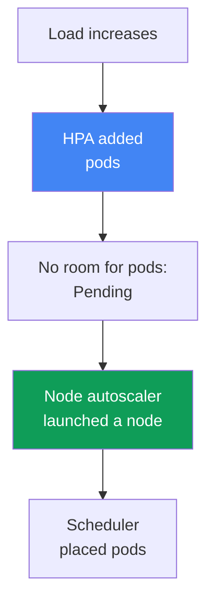
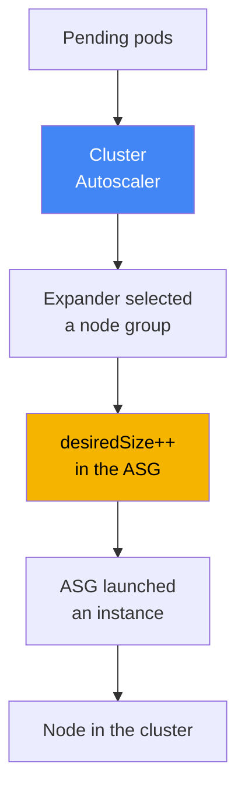
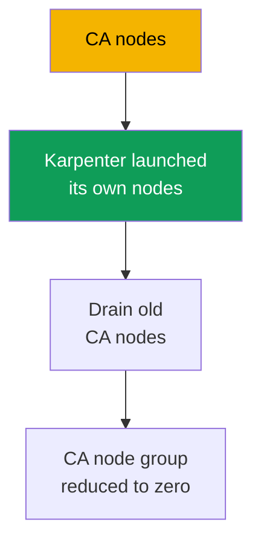

[Русская версия](ru.md) · [Versión en español](es.md) · [Version française](fr.md) · [Deutsche Version](de.md) · [ქართული ვერსია](ge.md) · [繁體中文版](tw.md) · [日本語版](jp.md)

# Chapter 11. Cluster Autoscaler and Karpenter: two approaches to node scaling

> **What comes next.** Compute types and Auto Mode were covered in Chapter 9, and node AMIs and bootstrap in Chapter 10. The next question is how nodes increase and decrease with load without manually adjusting `desiredSize`. EKS has two tools for that: Cluster Autoscaler and Karpenter. This chapter explains how to choose between their approaches. Karpenter itself (`NodePool`, `EC2NodeClass`, consolidation, drift, and disruption budgets) is covered in Chapter 12, Spot instances in Chapter 13, density and sizing in Chapter 14, and pod autoscaling itself (HPA, VPA, KEDA) in Chapter 35.

## 11.1. “Pods are stuck in Pending, but no nodes appear”

A morning traffic spike. HPA correctly added replicas, but the new pods do not start: they are stuck in
`Pending`. `kubectl describe pod` shows a `FailedScheduling` event: the scheduler has nowhere to
place them because the nodes have no free resources. No one adds nodes because nothing manages
this: the Auto Scaling group's `desiredSize` was set manually a month ago for the load at that time.

```bash
kubectl get pods --field-selector status.phase=Pending -A
kubectl describe pod <pod> | grep -A5 Events
```

The mirror problem arrives at night, when traffic has subsided: there are few replicas again, but the
nodes are still there--underutilized but running, accumulating an EC2 bill. Manual management of
`desiredSize` does not scale in principle: you cannot predict the required number of nodes in advance,
and keeping spare capacity “just in case” means paying for idle resources around the clock.

You need a mechanism that **adds nodes itself when pods have nowhere to run, and removes them when
nodes become empty**. EKS has two such mechanisms: Cluster Autoscaler and Karpenter. They solve the
same problem differently, and choosing between them is the subject of this chapter.

## 11.2. Two levels of autoscaling: pods and nodes

The first distinction to make before going further is that autoscaling in Kubernetes exists at **two
different levels**, and they are not the same thing.

- **Pod level.** HPA changes the number of Deployment replicas, VPA changes requests and limits, and KEDA
  scales on external metrics. This is **load** scaling; it is covered in Chapter 35.
- **Node level.** Cluster Autoscaler and Karpenter change the number and composition of **nodes** beneath
  the cluster. This is **capacity** scaling, and it is the topic here.

The levels work together and trigger one another in a chain. HPA sees higher load and adds pods. The
pods do not fit on the current nodes, so they enter `Pending`. That is the signal for the node
autoscaler: it notices unschedulable pods and launches a node, where the scheduler then places them.
When load falls, the chain reverses: HPA removes pods, nodes empty out, and the node autoscaler turns
them off.



The practical conclusion: if pods are stuck in `Pending`, first determine which level is blocked. If
there are not enough replicas, the issue is with HPA (Chapter 35). If replicas exist but cannot be
placed because resources are insufficient, the issue is with the node autoscaler--this chapter. Both
levels are needed together: HPA without a node autoscaler hits a capacity ceiling, while a node
autoscaler without HPA does not learn that the number of replicas has increased.

## 11.3. Cluster Autoscaler: scaling on top of Auto Scaling groups

Cluster Autoscaler (CA) is the classic node autoscaler from SIG Autoscaling, the one that has shipped
with EKS “out of the box” for years. Its model is that it **does not create instances itself**; it
manages existing Auto Scaling groups. When it sees unschedulable pods, CA calculates which node group
can accommodate them and increases its `desiredSize`; the ASG launches an instance from its launch
template, and the node registers with the cluster. When nodes are underutilized, CA does the reverse:
it reduces `desiredSize`, and the ASG terminates an instance.



When there are several groups and a pod fits in more than one, CA chooses through an **expander**.
The autoscaler documentation lists these strategies: `least-waste` (the fewest unused resources after
placement; the default), `priority` (priorities you assign to groups), `most-pods` (the group that can
fit the most pods), and `random`. On AWS, `least-waste` or `priority` are most common.

The key configuration requirement is that a **node group must be homogeneous in resources**. CA assumes
all instances in a group have the same CPU and memory, and estimates pod fit from one sample node. If
you mix `m5.large` and `m5.4xlarge` in one group, the calculation fails and its decisions become
incorrect. This leads to CA's typical anti-pattern: a zoo of ten narrow groups for every workload
class, which no one can hold in their head as a whole.

## 11.4. Cluster Autoscaler limitations

CA is reliable and understandable, but its “on top of ASG” model sets boundaries that become painful
at scale:

- **It reacts at group rather than pod level.** CA changes `desiredSize`; which specific instance
  launches is decided by the ASG and its launch template. CA does not select a type for a particular pod.
- **The set of types is fixed by groups.** Want a new instance class? Create a new node group and its
  launch template. Flexibility is limited by the number of pre-created groups.
- **Speed.** Between `Pending` and a ready node is a chain: CA recalculates, calls the ASG, the ASG
  launches an instance, and the node boots and registers. In practice, this is visibly slower than a
direct EC2 call.
- **Packing is limited.** CA can remove underutilized nodes, but does not move workloads to pack them
  more densely onto instances of another size--that is Karpenter's domain.

None of these points makes CA unsuitable. They mark where its model begins to get in the way: many
heterogeneous workloads, a requirement for fast response, or a need to select instance types finely.

## 11.5. Karpenter: instances directly for unschedulable pods

Karpenter is a node autoscaler originally created at AWS (now part of SIG Autoscaling) that takes the
opposite approach. It **does not use Auto Scaling groups**. Karpenter directly watches unschedulable
pods, reads their requirements (requests, nodeSelector, affinity, topology, toleration), and **creates
an EC2 instance for them itself**, calling the EC2 API without an ASG as an intermediary.

Karpenter **selects the instance type itself** from a broad allowed range, choosing one that fits the
pods and costs less. This gives it strengths over CA:

- **Speed.** The instance is launched by a direct EC2 call, without the ASG layer, so noticeably less
  time passes from `Pending` to a ready node.
- **Type flexibility.** You do not need to pre-slice groups for every class; Karpenter takes a suitable
  type from the permitted range for specific pods.
- **Consolidation (packing).** Karpenter can actively compact the cluster: when it sees that workloads
  can be packed more densely, it moves pods and replaces nodes with smaller ones or removes extras,
  reducing idle capacity.
- **Spot diversification.** Karpenter can select many different instance types at once, making Spot
  workloads more resilient to interruptions (Spot is covered specifically in Chapter 13).

We deliberately stop at the approach level here. Its configuration--the `NodePool` and `EC2NodeClass`
objects, consolidation policies, drift, and disruption budgets--is covered in detail in Chapter 12. In
this chapter, Karpenter matters as an **approach**, not as a configuration.

```bash
kubectl get nodepools
kubectl get nodeclaims
```

## 11.6. Direct comparison of the approaches

Both tools add and remove nodes in response to load, but they do so in fundamentally different ways.
Here is a comparison along the axes that actually affect the choice.

| Axis | Cluster Autoscaler | Karpenter |
|---|---|---|
| Mechanism | on top of an Auto Scaling group | direct EC2 call, no ASG |
| Response speed | slower: through the ASG layer | faster: instance launched directly |
| Instance-type selection | fixed by the group's launch template | selects from an allowed range itself |
| Packing / consolidation | only removes empty nodes | active compaction and replacement |
| Spot diversification | within groups | many types at once (Chapter 13) |
| Complexity | node groups and their launch templates | its own `NodePool` and `EC2NodeClass` CRDs |
| Maturity and scope | long-established, works across clouds | AWS-first, mature on EKS |

The speed axis deserves separate discussion because it matters during traffic spikes. With Cluster
Autoscaler, provisioning delay consists of the CA polling cycle, calculation and the ASG call, ASG
instance launch, and node boot and registration. Karpenter has no intermediate ASG steps: it responds
to `Pending` events and calls EC2 directly, so substantially less time passes from `Pending` to a
ready node. Karpenter also groups a batch of `Pending` pods into one capacity decision rather than
moving groups one at a time.

Do not read the table as “Karpenter is always better.” CA has its own niches:

- **Simple, predictable clusters** with a few homogeneous groups, where Karpenter's flexibility is not
  needed and familiar CA solves the task without new CRDs.
- **Multicloud standardization.** CA works in the same way with many providers, giving a team with
  clusters across clouds one tool and one process.
- **Existing installations** where CA is already installed, tuned, and not a bottleneck: there is no
  reason to replace a working mechanism merely for fashion.

Karpenter wins where CA's limitations are the pain points: heterogeneous workloads, a requirement for
fast response, fine type selection, and dense packing to reduce cost.

## 11.7. How this relates to Auto Mode

An important fork from Chapter 9: in **EKS Auto Mode, Karpenter is already built into the service**
and is not visible as a cluster component. You do not install it through Helm, update it, or see its
pod in `kube-system`. Instance selection, consolidation, and event handling run within the managed
mode, and you affect them only through the default and your own `NodePool` objects (you cannot modify
the defaults in Auto Mode, but you can add your own).

```bash
kubectl get pods -n kube-system
```

The practical implication follows. If the cluster uses Auto Mode, you already have Karpenter, albeit
hidden; you neither need nor can install a separate node autoscaler. If you need **your own Karpenter
with fine-grained configuration** (your own consolidation policy, disruption budgets, and
`EC2NodeClass`), that is your own stack: you install and operate Karpenter yourself on managed or
self-managed nodes. Cluster Autoscaler and self-operated Karpenter are for your own stack; Auto Mode
is Karpenter “under the hood” without access to its internals.

| Scenario | What scales nodes | Who operates the autoscaler |
|---|---|---|
| EKS Auto Mode | built-in Karpenter | AWS; you configure only your own NodePool |
| Your own stack with Karpenter | Karpenter you installed | you: CRDs, upgrades, configuration |
| Your own stack with Cluster Autoscaler | CA on top of your node groups | you: CA deployment, ASGs, expander |

## 11.8. What to choose: a checklist

Reduce the choice to a few questions rather than “which is newer.”

- **Is the cluster on Auto Mode?** Then the autoscaler is already present (built-in Karpenter); the
  question is settled--configure it through your own `NodePool` objects.
- **A new cluster, your own stack, with no strong constraints?** Choose **Karpenter**: it is faster,
  more flexible in types, and better at packing and Spot diversification. It is the recommended default
  approach for new EKS installations.
- **Do you need one tool to standardize across other clouds?** CA offers one method everywhere--a
  substantial reason to stay with it.
- **A simple, predictable cluster with a couple of homogeneous groups?** CA will solve the task
  without new CRDs, and that is fine.
- **Is CA already installed, tuned, and not in the way?** Do not disturb what works merely to switch
  tools; migrate when you encounter the limitations in Section 11.4.

In short: Karpenter (or Auto Mode, which includes it) is recommended by default for new EKS clusters.
Cluster Autoscaler remains a sensible choice for existing installations, multicloud scenarios, and
simple predictable clusters.

## 11.9. Coexistence and migration

**Can both run at once?** Technically, yes, but carefully and **over separate node sets**: CA manages
its own node groups, Karpenter its own `NodePool` objects, and their areas of responsibility must not
overlap. If both claim the same nodes, they will fight over scale-down decisions and interfere with one
another. This mode is justified only as temporary during migration, not as a permanent design.

**Why migration is usually from CA to Karpenter.** The reason is not fashion but the same limitations
from Section 11.4: at scale, a zoo of node groups accumulates, idle capacity rises due to weak packing,
and response to spikes is slow. Karpenter relieves these problems, so migration is almost always in one
direction.

**The migration principle is through new nodes, not in place.** Existing pods are not moved on a live
node under another autoscaler. Karpenter launches its nodes beside them, workloads are gradually moved
over (for example, by cordoning and draining old CA nodes), and node groups managed by CA are reduced
to zero and removed when they have no workloads left. This prevents a moment when both mechanisms
control the same node.

**Step-by-step plan (CA -> Karpenter v1).**

1. Install Karpenter v1 alongside the working CA and separate their areas: Karpenter has its own
   `NodePool` objects, CA has its own node groups, with no overlap (the coexistence phase).
2. Direct new, non-critical workloads to Karpenter nodes, and verify that provisioning and
   consolidation behave as intended.
3. Gradually cordon and drain old CA nodes; pods move to Karpenter nodes.
4. Reduce CA node groups to zero, then remove Cluster Autoscaler itself and its IAM roles.



**How to protect sensitive workloads during the trial.** While Karpenter is tested on initial pods, the
pod annotation `karpenter.sh/do-not-disrupt: "true"` protects against an unplanned node removal (in
the old API it was called `karpenter.sh/do-not-evict`). Understand its scope: the annotation holds
**the entire node** on which the pod runs and prevents all voluntary disruptions, including replacement
for drift. Therefore, use it temporarily and selectively on specific pods during migration, then remove
it once the workload is validated; otherwise, AMI updates stop along with consolidation (Chapter 12).

The Karpenter configuration details needed for migration (`NodePool`, `EC2NodeClass`, consolidation,
and disruption budgets) are in Chapter 12. The principle here is that migration moves workloads to new
nodes, rather than switching autoscalers beneath running pods.

## 11.10. How this is used in production

- **Clearly separate the two autoscaling levels.** Before fixing `Pending`, determine whether the
  blockage is at the pod level (HPA, Chapter 35) or node level (this chapter); the remedy differs.
- **Use Karpenter or Auto Mode for new EKS clusters**, where it is built in; retain Cluster Autoscaler
  for existing installations and multicloud scenarios.
- **Keep Cluster Autoscaler node groups homogeneous in resources**, otherwise CA's calculation from a
  sample node is wrong and scaling decisions become incorrect.
- **Do not run CA and Karpenter over the same nodes.** If both are needed during migration, strictly
  separate their areas: CA has its node groups and Karpenter its `NodePool` objects.
- **Migrate through new nodes**, not by switching autoscalers in place: Karpenter launches its nodes,
  workloads move by draining, and CA groups are reduced to zero.
- **Choose the tool consciously** using the checklist in 11.8, not by novelty: CA has its niches, and
  a working, well-tuned CA is not replaced solely for a tool change.

## 11.11. Mini-glossary

- **Cluster Autoscaler (CA)**: a node autoscaler that operates on top of Auto Scaling groups. It
  changes group `desiredSize` according to unschedulable pods and underutilization. Instance types are
  fixed by the groups' launch templates.
- **Karpenter**: a node autoscaler that creates EC2 instances directly for particular unschedulable
  pods and selects a type itself from an allowed range. Its configuration is covered in Chapter 12.
- **Expander**: a Cluster Autoscaler strategy for selecting a node group when a pod fits in several:
  `least-waste` (the default), `priority`, `most-pods`, or `random`.
- **Consolidation**: active cluster compaction in Karpenter: moving pods and replacing nodes with
  smaller ones or removing extras to reduce idle capacity (covered specifically in Chapter 12).
- **Node scaling versus pod scaling**: separate levels. CA and Karpenter scale nodes (this chapter),
  while HPA, VPA, and KEDA scale pods (Chapter 35).

## 11.12. Chapter summary

- Autoscaling has two levels: HPA, VPA, and KEDA scale pods (Chapter 35); Cluster Autoscaler and
  Karpenter scale nodes (this chapter). The levels are connected by the chain Pending -> new node.
- Cluster Autoscaler works on top of Auto Scaling groups: it adjusts `desiredSize`, selects a group
  through an expander, and requires homogeneous groups. Instance types are defined by their launch templates.
- CA limitations are group-level response, a type set fixed by groups, slower operation due to the ASG
  layer, and packing limited to removing empty nodes.
- Karpenter creates instances directly for unschedulable pods, selects the type itself, responds
  faster, and supports consolidation and type diversification for Spot. Configuration is in Chapter 12.
- Karpenter is not “always better”: CA retains niches in simple predictable clusters, multicloud
  standardization, and well-tuned existing installations.
- In Auto Mode, Karpenter is built into the service and invisible as a component; your own finely
  configured Karpenter is a stack you operate yourself.
- Both autoscalers can run only on separate node sets and as a temporary measure; migration is usually
  from CA to Karpenter, through new nodes rather than an in-place switch.

## 11.13. How this helps in real work

On call, the most common scenario is pods in `Pending`, and the first decision here is diagnostic:
determine the level. `kubectl describe pod` showing a `FailedScheduling` event due to insufficient
resources means the issue is with the node autoscaler, not HPA. Next, check which mechanism the
cluster uses to scale nodes: `NodePool` and `nodeclaims` mean Karpenter (your own or inside Auto Mode);
node groups and a CA pod in `kube-system` mean Cluster Autoscaler. The answer determines where to look:
the expander and ASG limits, or a `NodePool` and its limits.

When planning, this chapter helps you avoid carrying familiar CA into a new cluster by inertia, and,
conversely, avoid breaking a working existing CA for Karpenter without a reason. Record the choice
using the checklist, and if migration is necessary, plan it through new nodes and gradual draining of
the old ones--not as a switch of autoscaler beneath a running workload.

## 11.14. Self-check questions

1. How does node scaling differ from pod scaling, and how are the levels connected?
2. Which symptom in `kubectl` shows that the blockage is at the node level rather than HPA?
3. How does Cluster Autoscaler add a node, and why does it not select an instance type for every pod?
4. What does an expander do, and what strategies does it have?
5. Why must a Cluster Autoscaler node group be homogeneous in resources?
6. List the key limitations of Cluster Autoscaler at scale.
7. How does Karpenter's model fundamentally differ from Cluster Autoscaler's?
8. What is consolidation, and why does Cluster Autoscaler essentially lack that capability?
9. In what niches does Cluster Autoscaler remain a sensible choice?
10. How does Karpenter relate to EKS Auto Mode, and when do you need your own Karpenter?
11. Can CA and Karpenter run at the same time, and under what conditions?
12. Why is migration performed through new nodes rather than by switching autoscalers in place?

## Practice

This chapter does not yet have a lab, but the node-scaling approach is visible on a live cluster. Start by determining which mechanism scales it at all: `kubectl get pods -n kube-system` shows whether a Cluster Autoscaler pod exists, while `kubectl get nodepools` and `kubectl get nodeclaims` show whether Karpenter is active (including inside Auto Mode). The presence of one or the other immediately tells you which of the two approaches you are looking at.

Next, reproduce the diagnostics from Section 11.1 without harming the cluster. Check whether there are currently unschedulable pods: `kubectl get pods --field-selector status.phase=Pending -A`. If there are, `kubectl describe pod <pod>` and `FailedScheduling` events will indicate whether they are waiting for capacity. Walk through the checklist in 11.8 for your cluster and answer honestly: is the approach in place a conscious choice for your workloads, or a legacy worth reconsidering in favor of Karpenter, or conversely, one to leave as is.

---
[Table of contents](../README.md) · [Chapter 10](../10/en.md) · [Chapter 12](../12/en.md)
