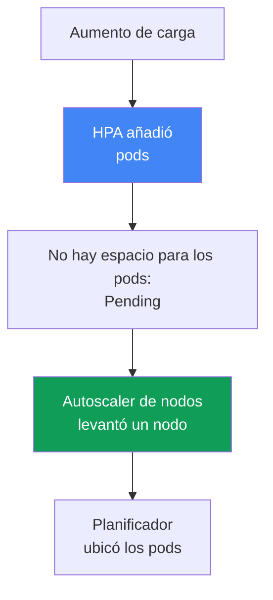
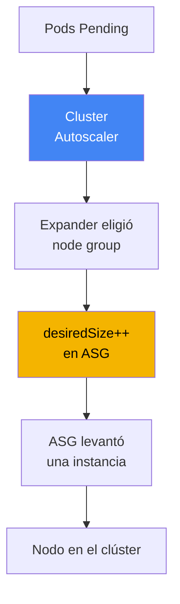
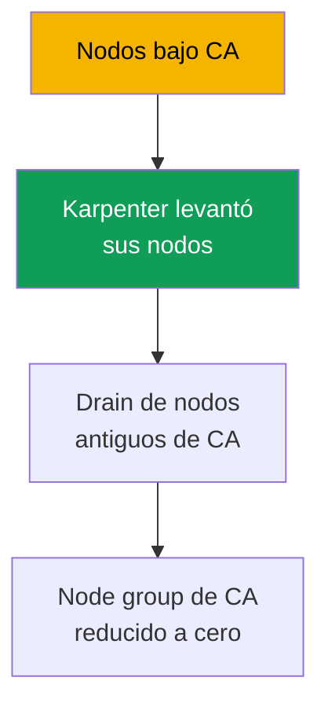

[Русская версия](ru.md) · [Eng version](en.md) · [Version française](fr.md) · [Deutsche Version](de.md) · [ქართული ვერსია](ge.md) · [繁體中文版](tw.md) · [日本語版](jp.md)
# Capítulo 11. Cluster Autoscaler y Karpenter: dos enfoques para el escalado de nodos

> **Qué sigue.** Los tipos de cómputo y Auto Mode se tratan en el capítulo 9; las AMI y el bootstrap de nodos, en el capítulo 10. Ahora la cuestión es cómo aumentan y disminuyen los nodos según la carga sin ajustar manualmente `desiredSize`. En EKS hay dos herramientas para ello: Cluster Autoscaler y Karpenter; este capítulo trata sobre elegir entre ellas a nivel de enfoque. Karpenter en detalle (`NodePool`, `EC2NodeClass`, consolidation, drift, disruption budgets) se aborda en el capítulo 12; las instancias spot, en el capítulo 13; la densidad y el dimensionamiento, en el capítulo 14; y el escalado automático de los propios pods (HPA, VPA, KEDA), en el capítulo 35.

## 11.1. «Los pods quedan en Pending, pero no aparecen nodos»

Un pico de tráfico por la mañana. HPA añadió réplicas correctamente, pero los pods nuevos no arrancan: quedan en `Pending`. `kubectl describe pod` muestra un evento `FailedScheduling`: el planificador no tiene dónde colocarlos, pues no hay recursos libres en los nodos. Nadie añade nodos porque nadie los gestiona: el `desiredSize` del Auto Scaling group se estableció manualmente hace un mes para la carga de entonces.

```bash
kubectl get pods --field-selector status.phase=Pending -A
kubectl describe pod <pod> | grep -A5 Events
```

El problema opuesto llega por la noche, cuando el tráfico baja: vuelven a haber pocas réplicas, pero los nodos siguen siendo los mismos, infrautilizados pero encendidos, acumulando costes de EC2. La gestión manual de `desiredSize` no escala en absoluto: no se puede adivinar de antemano el número de nodos necesario, y mantener reserva «por si acaso» significa pagar por inactividad las veinticuatro horas.

Hace falta un mecanismo que **añada nodos por sí solo cuando no haya dónde ubicar los pods y los retire cuando se vacíen**. En EKS hay dos mecanismos de este tipo: Cluster Autoscaler y Karpenter. Resuelven la misma tarea, pero de maneras distintas, y la elección entre ellos es el tema de este capítulo.

## 11.2. Dos niveles de escalado automático: pods y nodos

Lo primero que hay que distinguir para no confundirse después: el escalado automático en Kubernetes existe en **dos niveles diferentes**, y no son lo mismo.

- **Nivel de pods.** HPA cambia el número de réplicas de un Deployment, VPA cambia los requests y limits, y KEDA escala según métricas externas. Es el escalado de la **carga** y se trata en el capítulo 35.
- **Nivel de nodos.** Cluster Autoscaler y Karpenter cambian el número y la composición de los **nodos** bajo el clúster. Es el escalado de la **capacidad**, y es el tema de este capítulo.

Los niveles trabajan en conjunto y se activan mutuamente en una cadena. HPA detectó el aumento de carga y añadió pods. Los pods no tuvieron espacio en los nodos actuales y quedaron en `Pending`. Esta es la señal para el autoscaler de nodos: detecta los pods no programados y levanta un nodo donde el planificador los colocará. Cuando la carga disminuye, la cadena se invierte: HPA elimina pods, los nodos se vacían y el autoscaler de nodos los apaga.



Conclusión práctica: si los pods quedan en `Pending`, primero determine en qué nivel está el cuello de botella. Si faltan réplicas, es asunto de HPA (capítulo 35). Si las réplicas existen pero no se programan por falta de recursos, es asunto del autoscaler de nodos, es decir, de este capítulo. Ambos niveles se necesitan juntos: HPA sin un autoscaler de nodos llegará al límite de capacidad; un autoscaler de nodos sin HPA no sabrá que aumentó el número de réplicas.

## 11.3. Cluster Autoscaler: escalado sobre Auto Scaling groups

Cluster Autoscaler (CA) es el autoscaler clásico de nodos de SIG Autoscaling, el que lleva años incluido «de fábrica» con EKS. Su modelo es que **no crea instancias por sí mismo**, sino que gestiona Auto Scaling groups existentes. Al detectar pods no programados, CA calcula qué node group puede alojarlos y aumenta su `desiredSize`; ASG levanta una instancia desde su launch template y el nodo se registra en el clúster. Cuando hay infrautilización, CA reduce `desiredSize` y ASG apaga la instancia.



Cuando hay varios grupos y el pod cabe en más de uno, CA elige mediante el **expander**. Las estrategias, verificadas en la documentación del autoscaler, son: `least-waste` (mínimos recursos sobrantes tras la colocación; predeterminada), `priority` (según las prioridades de grupo que haya definido), `most-pods` (donde caben más pods) y `random`. En AWS se suele usar `least-waste` o `priority`.

El requisito clave de configuración es que el **node group sea homogéneo en recursos**. CA considera que todas las instancias del grupo son iguales en CPU y memoria, y estima a partir de un nodo de muestra si el pod cabrá. Si mezcla `m5.large` y `m5.4xlarge` en un grupo, el cálculo se desviará y las decisiones serán incorrectas. De ahí el antipatrón típico de CA: un zoológico de una decena de grupos estrechos para cada clase de carga que nadie tiene completamente en mente.

## 11.4. Limitaciones de Cluster Autoscaler

CA es fiable y comprensible, pero su modelo «sobre ASG» marca límites con los que se tropieza a escala:

- **Reacciona a nivel de grupo, no de pod.** CA mueve `desiredSize`, pero ASG decide qué instancia concreta levanta según su launch template. CA no elige un tipo para un pod concreto.
- **El conjunto de tipos queda fijado por los grupos.** ¿Quiere una nueva clase de instancias? Cree un nuevo node group y su launch template. La flexibilidad queda limitada por el número de grupos creados de antemano.
- **Velocidad.** Entre la aparición de `Pending` y un nodo listo hay una cadena: CA recalcula, llama a ASG, ASG levanta una instancia y el nodo arranca y se registra. En la práctica, esto tarda notablemente más que una llamada directa a EC2.
- **La compactación es limitada.** CA puede eliminar nodos infrautilizados, pero no redistribuye carga para empaquetarla más densamente en instancias de otro tamaño; ese es el terreno de Karpenter.

Ningún punto hace que CA sea inadecuado. Delimitan dónde empieza a estorbar su modelo: muchas cargas heterogéneas, necesidad de respuesta rápida y deseo de ajustar con precisión los tipos de instancia.

## 11.5. Karpenter: instancias directamente para pods no programados

Karpenter es un autoscaler de nodos creado originalmente en AWS (ahora parte de SIG Autoscaling) que aborda el problema desde otro ángulo. **No utiliza Auto Scaling group**. Karpenter observa directamente los pods no programados, lee sus requisitos (requests, nodeSelector, affinity, topology, toleration) y **crea por sí mismo una instancia de EC2 para ellos**, llamando a la API de EC2 sin el intermediario de ASG.

Karpenter **elige por sí mismo** el tipo de instancia de un amplio conjunto que usted ha permitido, buscando uno que se adapte a los pods y cueste menos. De ahí sus puntos fuertes frente a CA:

- **Velocidad.** La instancia se levanta mediante una llamada directa a EC2, sin la capa intermedia de ASG; por tanto, transcurre mucho menos tiempo desde `Pending` hasta un nodo listo.
- **Flexibilidad de tipos.** No hace falta crear de antemano grupos para cada clase: Karpenter toma un tipo adecuado del intervalo permitido para los pods concretos.
- **Consolidation (compactación).** Karpenter puede compactar activamente el clúster: al detectar que la carga se puede empaquetar de forma más densa, mueve pods y sustituye nodos por otros más pequeños o elimina los sobrantes, reduciendo la inactividad.
- **Diversificación para spot.** Karpenter puede elegir muchos tipos de instancias distintos a la vez, lo que incrementa la resiliencia de las cargas spot frente a interrupciones (las instancias spot se tratan en detalle en el capítulo 13).

Aquí nos detenemos deliberadamente en el nivel de enfoque. Cómo se configura --los objetos `NodePool` y `EC2NodeClass`, las políticas de consolidation, drift y disruption budgets-- se trata en detalle en el capítulo 12. En este capítulo, Karpenter importa como **enfoque**, no como configuración.

```bash
kubectl get nodepools
kubectl get nodeclaims
```

## 11.6. Comparación directa de enfoques

Ambas herramientas añaden y eliminan nodos según la carga, pero lo hacen de formas fundamentalmente distintas. La comparación se realiza según los ejes que realmente afectan a la elección.

| Eje | Cluster Autoscaler | Karpenter |
|---|---|---|
| Mecanismo | sobre Auto Scaling group | llamada directa a EC2, sin ASG |
| Velocidad de respuesta | más lenta: mediante la capa ASG | más rápida: instancia directamente |
| Elección de tipo de instancia | fijada por el launch template del grupo | lo selecciona de un intervalo |
| Compactación / consolidation | solo eliminación de nodos vacíos | compactación y sustitución activas |
| Diversificación spot | dentro de los grupos | muchos tipos a la vez (capítulo 13) |
| Complejidad | node group y sus launch template | sus propios CRD `NodePool`, `EC2NodeClass` |
| Madurez y cobertura | veterano, funciona en distintas nubes | AWS-first, maduro en EKS |

Vale la pena desglosar por separado el eje de velocidad, porque decide durante los picos de tráfico. Con Cluster Autoscaler, la latencia de provisioning se compone de una cadena: el ciclo de sondeo de CA, el recálculo y la llamada a ASG, el lanzamiento de la instancia por ASG, y el arranque y registro del nodo. Karpenter no tiene pasos intermedios a través de ASG: reacciona a `Pending` mediante eventos y llama directamente a EC2, por lo que transcurre considerablemente menos tiempo desde `Pending` hasta un nodo listo. Además, Karpenter agrupa un lote de pods `Pending` en una sola decisión de capacidad, en vez de mover los grupos uno por uno.

Es importante no interpretar la tabla como «Karpenter siempre es mejor». CA tiene sus propios nichos:

- **Clústeres sencillos y predecibles** con un par de grupos homogéneos, donde no se necesita la flexibilidad de Karpenter y el conocido CA resuelve la tarea sin nuevos CRD.
- **Unificación multinube.** CA funciona de la misma manera con muchos proveedores, por lo que ofrece a un equipo con clústeres en distintas nubes una única herramienta y un único proceso.
- **Instalaciones existentes** donde CA ya está instalado, ajustado y no es un cuello de botella: no tiene sentido cambiar un mecanismo que funciona solo por moda.

Karpenter gana donde precisamente duelen las limitaciones de CA: cargas heterogéneas, necesidad de respuesta rápida, selección precisa de tipos y compactación densa para reducir costes.

## 11.7. Relación con Auto Mode

Una bifurcación importante del capítulo 9. En **EKS Auto Mode Karpenter ya está integrado en el servicio** y no se ve como componente del clúster: no se instala mediante Helm, no se actualiza y no se ve su pod en `kube-system`. La lógica de selección de instancias, consolidation y procesamiento de eventos funciona dentro del modo administrado, y usted solo influye en ella mediante los `NodePool` predeterminados y propios (los predeterminados de Auto Mode no se pueden modificar; se pueden añadir los propios).

```bash
kubectl get pods -n kube-system
```

De ello se deriva una consecuencia práctica. Si el clúster usa Auto Mode, ya cuenta con Karpenter, aunque oculto; no hace falta ni se puede instalar un autoscaler de nodos aparte. Si, en cambio, necesita **su propio Karpenter con configuración detallada** (su propia política de consolidation, sus propios disruption budgets, sus propios `EC2NodeClass`), es su propia pila: usted instala y opera Karpenter en nodos managed o self-managed. Cluster Autoscaler y Karpenter autogestionado corresponden a su propia pila; Auto Mode es Karpenter «bajo el capó», sin acceso a sus componentes internos.

| Escenario | Con qué se escalan los nodos | Quién gestiona el autoscaler |
|---|---|---|
| EKS Auto Mode | Karpenter integrado | AWS; usted solo define sus propios NodePool |
| Pila propia con Karpenter | Karpenter que usted instaló | usted: CRD, actualizaciones, configuración |
| Pila propia con Cluster Autoscaler | CA sobre sus node group | usted: despliegue de CA, ASG, expander |

## 11.8. Qué elegir: lista de comprobación

Reduzca la elección a unas preguntas, no a «qué es más nuevo».

- **¿El clúster usa Auto Mode?** Entonces el autoscaler ya existe (Karpenter integrado); la cuestión está resuelta: configúrelo mediante sus propios `NodePool`.
- **¿Clúster nuevo, pila propia, sin restricciones fuertes?** Elija **Karpenter**: es más rápido, más flexible con los tipos y ofrece mejor compactación y diversificación spot. Para nuevas instalaciones en EKS, es el enfoque recomendado por defecto.
- **¿Necesita unificar con otras nubes usando una herramienta?** CA proporciona un único modo de hacerlo en todas partes; es un argumento de peso para mantenerlo.
- **¿Clúster sencillo y predecible con un par de grupos homogéneos?** CA resolverá la tarea sin nuevos CRD, y es perfectamente válido.
- **¿CA ya está instalado, ajustado y no molesta?** No cambie algo que funciona solo por sustituir la herramienta; migre cuando llegue a las limitaciones de la sección 11.4.

Resumen breve: para nuevos clústeres en EKS se recomienda Karpenter por defecto (o Auto Mode, donde está integrado). Cluster Autoscaler sigue siendo una elección razonable para instalaciones existentes, escenarios multinube y clústeres sencillos y predecibles.

## 11.9. Convivencia y migración

**¿Se pueden mantener ambos a la vez?** Técnicamente sí, pero con precaución y **en conjuntos de nodos diferentes**: CA gestiona sus propios node group, Karpenter sus propios `NodePool`, y sus ámbitos de responsabilidad no deben solaparse. Si ambos compiten por los mismos nodos, empezarán a disputarse las decisiones de scale-down y se interferirán mutuamente. Este modo se justifica solo como algo temporal durante una migración, no como una arquitectura permanente.

**Por qué normalmente se migra de CA a Karpenter.** La razón no es la moda, sino las mismas limitaciones de la sección 11.4: a escala, se acumula un zoológico de node group, aumenta la inactividad por una compactación débil y la respuesta a picos es lenta. Karpenter elimina estos problemas, por lo que la dirección de migración casi siempre es unidireccional.

**El principio de migración es mediante nodos nuevos, no en caliente.** Los pods existentes no se trasladan en un nodo activo bajo otro autoscaler. Karpenter levanta sus nodos en paralelo, la carga se transfiere gradualmente a ellos (por ejemplo, haciendo cordon y drain de los nodos antiguos de CA), y los node group gestionados por CA se reducen a cero y se eliminan cuando ya no tienen carga. Así se evita el momento en que ambos mecanismos sean responsables de un mismo nodo.

**Plan por etapas (CA -> Karpenter v1).**

1. Instale Karpenter v1 junto al CA en funcionamiento y separe los ámbitos: `NodePool` propios para Karpenter y node group propios para CA, sin solapamiento (fase de convivencia).
2. Dirija las cargas nuevas y no críticas a los nodos de Karpenter y compruebe que el provisioning y consolidation se comportan como deben.
3. Haga cordon y drain gradualmente de los nodos antiguos de CA; los pods pasarán a los nodos de Karpenter.
4. Reduzca a cero los node group de CA y, después, retire Cluster Autoscaler y sus roles IAM.



**Cómo proteger las cargas sensibles durante la validación.** Mientras se prueba Karpenter con los primeros pods, la anotación del pod `karpenter.sh/do-not-disrupt: "true"` protege contra la eliminación no planificada de un nodo (en la API anterior se llamaba `karpenter.sh/do-not-evict`). Es importante entender su alcance: la anotación retiene **todo el nodo** donde vive el pod y frena cualquier interrupción voluntaria, incluida la actualización por drift. Por ello, durante la migración se aplica de manera selectiva a pods concretos y se elimina cuando la carga se ha validado; de lo contrario, junto con la consolidación también se detendrá la actualización de la AMI (capítulo 12).

Los detalles de configuración de Karpenter necesarios durante la migración (`NodePool`, `EC2NodeClass`, consolidation, disruption budgets) están en el capítulo 12. Aquí importa el principio: la migración se realiza transfiriendo carga a nodos nuevos, no cambiando el autoscaler bajo pods en ejecución.

## 11.10. Cómo se aplica en producción

- **Separe explícitamente los dos niveles de escalado automático.** Antes de solucionar `Pending`, determine si el cuello de botella está en el nivel de pods (HPA, capítulo 35) o de nodos (este capítulo): el tratamiento es diferente.
- **Para clústeres nuevos en EKS, elija Karpenter o Auto Mode**, donde está integrado, y deje Cluster Autoscaler para instalaciones existentes y escenarios multinube.
- **Mantenga homogéneos en recursos los node group bajo Cluster Autoscaler**, de lo contrario el cálculo de CA basado en el nodo de muestra miente y las decisiones de escalado serán incorrectas.
- **No ejecute CA y Karpenter sobre los mismos nodos.** Si ambos son necesarios durante una migración, separe estrictamente sus ámbitos: node group propios para CA y `NodePool` propios para Karpenter.
- **Realice la migración mediante nodos nuevos**, no cambiando el autoscaler en caliente: Karpenter levanta sus nodos, la carga se transfiere mediante drain y los grupos de CA se reducen a cero.
- **Documente conscientemente la elección de herramienta** según la lista de comprobación 11.8, no por novedad: CA tiene sus nichos y un CA funcional y ajustado no se cambia solo por sustituir la herramienta.

## 11.11. Miniglosario

- **Cluster Autoscaler (CA)**: autoscaler de nodos que funciona sobre Auto Scaling group; cambia el `desiredSize` de los grupos según los pods no programados y la infrautilización. Los tipos de instancia están fijados por el launch template de los grupos.
- **Karpenter**: autoscaler de nodos que crea instancias EC2 directamente para pods concretos no programados y elige el tipo por sí mismo dentro del intervalo permitido. Su configuración se trata en el capítulo 12.
- **Expander**: estrategia de Cluster Autoscaler para elegir un node group cuando un pod cabe en varios: `least-waste` (predeterminada), `priority`, `most-pods`, `random`.
- **Consolidation**: compactación activa del clúster en Karpenter: movimiento de pods y sustitución de nodos por otros más pequeños, o eliminación de los sobrantes, para reducir inactividad (en detalle, capítulo 12).
- **Escalado de nodos frente a escalado de pods**: niveles distintos; CA y Karpenter escalan nodos (este capítulo), mientras HPA, VPA y KEDA escalan pods (capítulo 35).

## 11.12. Resumen del capítulo

- El escalado automático existe en dos niveles: HPA, VPA y KEDA escalan pods (capítulo 35), mientras Cluster Autoscaler y Karpenter escalan nodos (este capítulo). Los niveles están conectados mediante la cadena Pending -> nodo nuevo.
- Cluster Autoscaler funciona sobre Auto Scaling group: ajusta `desiredSize`, elige el grupo mediante expander y requiere grupos homogéneos. Los tipos de instancia están definidos por sus launch template.
- Las limitaciones de CA son: reacción a nivel de grupo, conjunto de tipos fijado por grupos, mayor lentitud por la capa ASG y compactación limitada a eliminar nodos vacíos.
- Karpenter crea instancias directamente para pods no programados, elige el tipo por sí mismo, funciona más rápido y ofrece consolidation y diversificación de tipos para spot. Su configuración se trata en el capítulo 12.
- Karpenter no es «siempre mejor»: CA conserva nichos en clústeres sencillos y predecibles, unificación multinube e instalaciones existentes bien ajustadas.
- En Auto Mode, Karpenter está integrado en el servicio y no es visible como componente; un Karpenter propio con configuración detallada es una pila propia que usted opera.
- Ambos autoscalers solo pueden mantenerse simultáneamente en conjuntos de nodos diferentes y como medida temporal; normalmente se migra de CA a Karpenter mediante nodos nuevos, no con un cambio en caliente.

## 11.13. Cómo será útil en el trabajo real

Durante una guardia, el escenario más frecuente son pods en `Pending`, y la primera decisión es diagnóstica: identificar el nivel. `kubectl describe pod` con un evento `FailedScheduling` por falta de recursos indica que la cuestión corresponde al autoscaler de nodos, no a HPA. Después, compruebe qué mecanismo escala realmente los nodos del clúster: si existen `NodePool` y `nodeclaims`, es Karpenter (propio o dentro de Auto Mode); si existen node group y un pod de CA en `kube-system`, es Cluster Autoscaler. La respuesta determina dónde buscar la causa: en el expander y los límites de ASG, o en `NodePool` y sus límites.

Durante la planificación, este capítulo ayuda a no llevar CA por inercia a un clúster nuevo y, a la inversa, a no romper un CA funcional en uno existente para adoptar Karpenter sin motivo. La elección se documenta mediante la lista de comprobación y, si hace falta una migración, se planifica con nodos nuevos y drain gradual de los antiguos, no como un cambio de autoscaler bajo una carga en ejecución.

## 11.14. Preguntas de autoevaluación

1. ¿En qué se diferencia el escalado de nodos del escalado de pods y cómo se relacionan estos niveles?
2. ¿Qué síntoma en `kubectl` permite entender que el cuello de botella está en el nivel de nodos y no en HPA?
3. ¿Cómo añade Cluster Autoscaler un nodo y por qué no elige un tipo de instancia para cada pod?
4. ¿Qué hace el expander y qué estrategias tiene?
5. ¿Por qué un node group bajo Cluster Autoscaler debe ser homogéneo en recursos?
6. Enumere las limitaciones clave de Cluster Autoscaler a escala.
7. ¿En qué se diferencia fundamentalmente el modelo de Karpenter del de Cluster Autoscaler?
8. ¿Qué es consolidation y por qué Cluster Autoscaler no tiene en esencia esa capacidad?
9. ¿En qué nichos sigue siendo Cluster Autoscaler una elección razonable?
10. ¿Cómo se relaciona Karpenter con EKS Auto Mode y cuándo se necesita un Karpenter propio?
11. ¿Se pueden mantener CA y Karpenter simultáneamente y bajo qué condiciones?
12. ¿Por qué la migración se realiza mediante nodos nuevos y no cambiando el autoscaler en caliente?

## Practica

Este capitulo aun no tiene lab, pero el enfoque de escalado de nodos se puede observar en un cluster activo. Empiece por determinar que mecanismo lo escala: `kubectl get pods -n kube-system` muestra si existe un pod de Cluster Autoscaler, mientras que `kubectl get nodepools` y `kubectl get nodeclaims` indican si Karpenter esta activo (incluido dentro de Auto Mode). La presencia de uno u otro determina inmediatamente cual de los dos enfoques tiene delante.

A continuacion, reproduzca el diagnostico de la seccion 11.1 sin perjudicar al cluster. Compruebe si hay actualmente pods no programados: `kubectl get pods --field-selector status.phase=Pending -A`. Si los hay, `kubectl describe pod <pod>` y los eventos `FailedScheduling` indicaran si estan esperando capacidad. Recorra la lista de comprobacion 11.8 para su cluster y responda con sinceridad: el enfoque actual es una eleccion consciente para sus cargas, o una herencia que conviene reconsiderar en favor de Karpenter, o bien dejar tal como esta.

---
[Índice](../README_ES.md) · [Capítulo 10](../10/es.md) · [Capítulo 12](../12/es.md)
