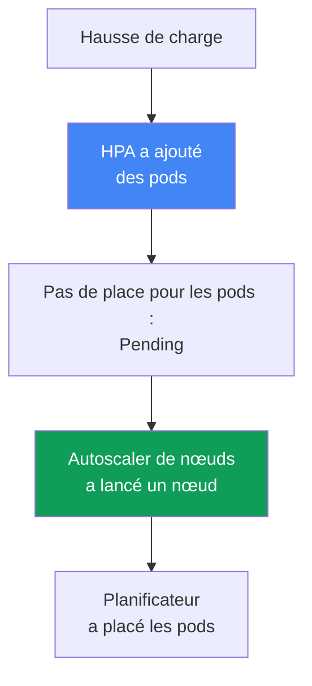
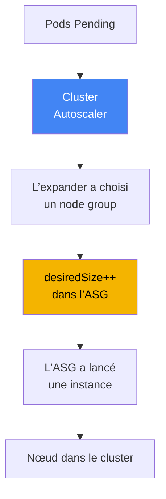
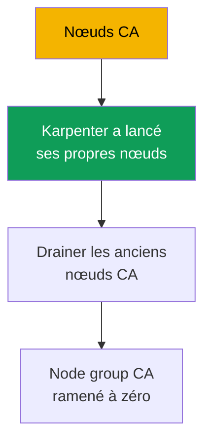

[Русская версия](ru.md) · [English version](en.md) · [Versión en español](es.md) · [Deutsche Version](de.md) · [ქართული ვერსია](ge.md) · [繁體中文版](tw.md) · [日本語版](jp.md)
# Chapitre 11. Cluster Autoscaler et Karpenter : deux approches de la mise à l’échelle des nœuds

> **La suite.** Les types de calcul et Auto Mode ont été traités au chapitre 9, et les AMI ainsi que le bootstrap des nœuds au chapitre 10. La question suivante est : comment les nœuds augmentent-ils et diminuent-ils avec la charge sans ajuster manuellement `desiredSize` ? EKS propose deux outils pour cela : Cluster Autoscaler et Karpenter. Ce chapitre explique comment choisir entre leurs approches. Karpenter en détail (`NodePool`, `EC2NodeClass`, consolidation, drift et disruption budgets) est traité au chapitre 12, les instances Spot au chapitre 13, la densité et le dimensionnement au chapitre 14, et l’autoscaling des pods eux-mêmes (HPA, VPA, KEDA) au chapitre 35.

## 11.1. « Les pods restent en Pending, mais aucun nœud n’apparaît »

Un pic de trafic matinal. HPA a correctement ajouté des réplicas, mais les nouveaux pods ne démarrent pas : ils restent en `Pending`. `kubectl describe pod` montre un événement `FailedScheduling` : le planificateur n’a nulle part où les placer, car les nœuds n’ont plus de ressources libres. Personne n’ajoute de nœuds, car rien ne les gère : le `desiredSize` de l’Auto Scaling group a été défini manuellement il y a un mois pour la charge de l’époque.

```bash
kubectl get pods --field-selector status.phase=Pending -A
kubectl describe pod <pod> | grep -A5 Events
```

Le problème inverse survient la nuit, quand le trafic a diminué : il y a de nouveau peu de réplicas, mais les nœuds sont toujours là, sous-utilisés mais en fonctionnement, et la facture EC2 s’accumule. La gestion manuelle de `desiredSize` ne passe tout simplement pas à l’échelle : il est impossible de deviner à l’avance le nombre de nœuds nécessaire, et conserver une réserve « au cas où » signifie payer des ressources inactives 24 heures sur 24.

Il faut un mécanisme qui **ajoute lui-même des nœuds lorsque les pods n’ont plus où s’exécuter, et les retire lorsque les nœuds se vident**. EKS dispose de deux mécanismes de ce type : Cluster Autoscaler et Karpenter. Ils résolvent le même problème de manières différentes, et le choix entre eux est le sujet de ce chapitre.

## 11.2. Deux niveaux d’autoscaling : pods et nœuds

La première distinction à faire pour ne pas se tromper par la suite est que l’autoscaling dans Kubernetes existe à **deux niveaux différents**, qui ne sont pas la même chose.

- **Niveau des pods.** HPA modifie le nombre de réplicas d’un Deployment, VPA modifie les requests et les limits, et KEDA effectue la mise à l’échelle sur des métriques externes. Il s’agit de la mise à l’échelle de la **charge**, traitée au chapitre 35.
- **Niveau des nœuds.** Cluster Autoscaler et Karpenter modifient le nombre et la composition des **nœuds** sous le cluster. Il s’agit de la mise à l’échelle de la **capacité**, et c’est le sujet ici.

Les niveaux fonctionnent ensemble et se déclenchent mutuellement dans une chaîne. HPA détecte une hausse de charge et ajoute des pods. Les pods ne tiennent pas sur les nœuds actuels et passent en `Pending`. C’est le signal pour l’autoscaler de nœuds : il remarque les pods non planifiables et lance un nœud, sur lequel le planificateur les place ensuite. Lorsque la charge diminue, la chaîne s’inverse : HPA retire les pods, les nœuds se vident et l’autoscaler de nœuds les arrête.



Conclusion pratique : si des pods restent en `Pending`, déterminez d’abord quel niveau est bloqué. S’il n’y a pas assez de réplicas, le problème relève de HPA (chapitre 35). Si les réplicas existent mais ne peuvent pas être placés faute de ressources, le problème relève de l’autoscaler de nœuds -- donc de ce chapitre. Les deux niveaux sont nécessaires ensemble : HPA sans autoscaler de nœuds atteint un plafond de capacité, tandis qu’un autoscaler de nœuds sans HPA ne sait pas que le nombre de réplicas a augmenté.

## 11.3. Cluster Autoscaler : mise à l’échelle au-dessus des Auto Scaling groups

Cluster Autoscaler (CA) est l’autoscaler classique de nœuds de SIG Autoscaling, celui qui accompagne EKS « prêt à l’emploi » depuis des années. Son modèle est le suivant : il **ne crée pas lui-même les instances**, mais gère des Auto Scaling groups existants. Lorsqu’il voit des pods non planifiables, CA calcule quel node group peut les accueillir et augmente son `desiredSize` ; l’ASG lance une instance depuis son launch template, puis le nœud s’enregistre dans le cluster. Lors de sous-utilisation, CA fait l’inverse : il réduit `desiredSize`, et l’ASG termine une instance.



Lorsqu’il existe plusieurs groupes et qu’un pod tient dans plusieurs d’entre eux, CA choisit via un **expander**. La documentation de l’autoscaler indique les stratégies suivantes : `least-waste` (le moins de ressources inutilisées après le placement ; valeur par défaut), `priority` (selon les priorités que vous assignez aux groupes), `most-pods` (le groupe qui peut accueillir le plus de pods) et `random`. Sur AWS, `least-waste` ou `priority` sont les plus courantes.

L’exigence clé de configuration est qu’un **node group soit homogène en ressources**. CA suppose que toutes les instances d’un groupe ont les mêmes CPU et mémoire, et estime si le pod tient à partir d’un nœud représentatif. Si vous mélangez `m5.large` et `m5.4xlarge` dans un même groupe, le calcul devient erroné et les décisions aussi. Cela conduit à l’anti-modèle typique de CA : un zoo d’une dizaine de groupes étroits, un pour chaque classe de charge, dont personne n’a une vision globale.

## 11.4. Limites de Cluster Autoscaler

CA est fiable et compréhensible, mais son modèle « au-dessus des ASG » fixe des limites qui deviennent pénibles à grande échelle :

- **Il réagit au niveau du groupe, et non du pod.** CA modifie `desiredSize`, mais l’ASG et son launch template décident de l’instance précise qui est lancée. CA ne sélectionne pas un type pour un pod particulier.
- **L’ensemble des types est fixé par les groupes.** Vous voulez une nouvelle classe d’instances ? Créez un nouveau node group et son launch template. La flexibilité est limitée par le nombre de groupes créés à l’avance.
- **Vitesse.** Entre `Pending` et un nœud prêt, une chaîne s’intercale : CA recalcule, appelle l’ASG, l’ASG lance une instance, puis le nœud démarre et s’enregistre. En pratique, c’est sensiblement plus lent qu’un appel EC2 direct.
- **Le compactage est limité.** CA peut supprimer des nœuds sous-utilisés, mais ne déplace pas les charges pour les empaqueter plus densément sur des instances d’une autre taille -- c’est le domaine de Karpenter.

Aucun de ces points ne rend CA inadapté. Ils délimitent les situations où son modèle commence à gêner : de nombreuses charges hétérogènes, une exigence de réaction rapide ou le besoin d’affiner le choix des types d’instances.

## 11.5. Karpenter : des instances directement pour les pods non planifiables

Karpenter est un autoscaler de nœuds créé à l’origine chez AWS (désormais partie de SIG Autoscaling) qui adopte l’approche opposée. Il **n’utilise pas les Auto Scaling groups**. Karpenter surveille directement les pods non planifiables, lit leurs exigences (requests, nodeSelector, affinity, topology, toleration) et **crée lui-même une instance EC2 pour eux**, en appelant l’API EC2 sans ASG comme intermédiaire.

Karpenter **choisit lui-même le type d’instance** dans un large éventail que vous avez autorisé, en sélectionnant un type adapté aux pods et moins coûteux. Cela lui donne plusieurs avantages par rapport à CA :

- **Vitesse.** L’instance est lancée par un appel EC2 direct, sans la couche ASG intermédiaire ; il s’écoule donc nettement moins de temps entre `Pending` et un nœud prêt.
- **Flexibilité des types.** Il n’est pas nécessaire de découper à l’avance des groupes pour chaque classe ; Karpenter prend un type approprié dans la plage autorisée pour les pods concernés.
- **Consolidation (compactage).** Karpenter peut compacter activement le cluster : lorsqu’il constate que les charges peuvent être regroupées plus densément, il déplace les pods et remplace les nœuds par des nœuds plus petits, ou retire les excédentaires, réduisant ainsi la capacité inactive.
- **Diversification Spot.** Karpenter peut sélectionner simultanément de nombreux types d’instances différents, ce qui rend les charges Spot plus résistantes aux interruptions (les instances Spot sont traitées précisément au chapitre 13).

Nous nous arrêtons volontairement ici au niveau de l’approche. Sa configuration -- les objets `NodePool` et `EC2NodeClass`, les politiques de consolidation, le drift et les disruption budgets -- est abordée en détail au chapitre 12. Dans ce chapitre, Karpenter compte comme **approche**, et non comme configuration.

```bash
kubectl get nodepools
kubectl get nodeclaims
```

## 11.6. Comparaison directe des approches

Les deux outils ajoutent et retirent des nœuds selon la charge, mais le font de manières fondamentalement différentes. Voici la comparaison selon les axes qui influencent réellement le choix.

| Axe | Cluster Autoscaler | Karpenter |
|---|---|---|
| Mécanisme | au-dessus d’un Auto Scaling group | appel EC2 direct, sans ASG |
| Vitesse de réaction | plus lente : via la couche ASG | plus rapide : instance lancée directement |
| Choix du type d’instance | fixé par le launch template du groupe | sélectionné dans une plage autorisée |
| Compactage / consolidation | supprime seulement les nœuds vides | compactage et remplacement actifs |
| Diversification Spot | au sein des groupes | de nombreux types à la fois (chapitre 13) |
| Complexité | node groups et leurs launch templates | ses propres CRD `NodePool` et `EC2NodeClass` |
| Maturité et portée | établi de longue date, fonctionne sur différents clouds | conçu pour AWS, mature sur EKS |

L’axe de la vitesse mérite une explication séparée, car il est déterminant lors de pics de trafic. Avec Cluster Autoscaler, le délai de provisioning comprend le cycle de scrutation de CA, le calcul et l’appel à l’ASG, le lancement de l’instance par l’ASG, puis le démarrage et l’enregistrement du nœud. Karpenter n’a pas d’étapes ASG intermédiaires : il réagit aux événements `Pending` et appelle EC2 directement ; il s’écoule donc bien moins de temps entre `Pending` et un nœud prêt. Karpenter regroupe aussi un lot de pods `Pending` dans une seule décision de capacité, plutôt que de déplacer les groupes un à un.

Il ne faut pas lire ce tableau comme « Karpenter est toujours meilleur ». CA conserve ses propres niches :

- **Clusters simples et prévisibles** avec quelques groupes homogènes, où la flexibilité de Karpenter n’est pas nécessaire et où le CA familier résout le problème sans nouvelles CRD.
- **Standardisation multicloud.** CA fonctionne de la même façon chez de nombreux fournisseurs, donnant à une équipe qui possède des clusters dans plusieurs clouds un outil et un processus uniques.
- **Installations existantes** où CA est déjà installé, réglé et n’est pas un goulot d’étranglement : il n’y a pas lieu de remplacer un mécanisme qui fonctionne uniquement par effet de mode.

Karpenter l’emporte là où les limites de CA font justement souffrir : charges hétérogènes, besoin de réaction rapide, sélection fine des types et compactage dense pour réduire les coûts.

## 11.7. Lien avec Auto Mode

Une distinction importante du chapitre 9 : dans **EKS Auto Mode, Karpenter est déjà intégré au service** et n’est pas visible comme composant du cluster. Vous ne l’installez pas avec Helm, ne le mettez pas à jour et ne voyez pas son pod dans `kube-system`. La logique de sélection des instances, de consolidation et de gestion des événements s’exécute dans le mode géré, et vous n’agissez sur elle qu’au moyen des `NodePool` par défaut et des vôtres (vous ne pouvez pas modifier ceux par défaut d’Auto Mode, mais pouvez ajouter les vôtres).

```bash
kubectl get pods -n kube-system
```

La conséquence pratique est immédiate. Si le cluster utilise Auto Mode, vous avez déjà Karpenter, bien que caché ; vous n’avez ni besoin ni la possibilité d’installer un autoscaler de nœuds distinct. Si vous avez besoin de **votre propre Karpenter avec une configuration fine** (votre propre politique de consolidation, vos disruption budgets et vos `EC2NodeClass`), il s’agit de votre propre stack : vous installez et exploitez vous-même Karpenter sur des nœuds managed ou self-managed. Cluster Autoscaler et Karpenter autogéré concernent votre propre stack ; Auto Mode est Karpenter « sous le capot », sans accès à ses composants internes.

| Scénario | Ce qui met les nœuds à l’échelle | Qui exploite l’autoscaler |
|---|---|---|
| EKS Auto Mode | Karpenter intégré | AWS ; vous configurez seulement vos propres NodePool |
| Votre propre stack avec Karpenter | le Karpenter que vous avez installé | vous : CRD, mises à niveau, configuration |
| Votre propre stack avec Cluster Autoscaler | CA au-dessus de vos node groups | vous : déploiement de CA, ASG, expander |

## 11.8. Que choisir : une liste de contrôle

Ramenez le choix à quelques questions plutôt qu’à « lequel est le plus récent ».

- **Le cluster est-il en Auto Mode ?** Alors l’autoscaler est déjà présent (Karpenter intégré) ; la question est réglée -- configurez-le au moyen de vos propres objets `NodePool`.
- **Nouveau cluster, votre propre stack, sans fortes contraintes ?** Choisissez **Karpenter** : il est plus rapide, plus flexible sur les types, et meilleur pour le compactage et la diversification Spot. C’est l’approche recommandée par défaut pour les nouvelles installations EKS.
- **Faut-il standardiser avec d’autres clouds au moyen d’un seul outil ?** CA offre une méthode unique partout -- une raison substantielle de le conserver.
- **Cluster simple et prévisible avec quelques groupes homogènes ?** CA résoudra le problème sans nouvelles CRD, et c’est très bien.
- **CA est-il déjà installé, réglé et non gênant ?** Ne perturbez pas ce qui fonctionne simplement pour changer d’outil ; migrez lorsque vous rencontrez les limites de la section 11.4.

En bref : Karpenter (ou Auto Mode, qui l’inclut) est recommandé par défaut pour les nouveaux clusters EKS. Cluster Autoscaler reste un choix raisonnable pour les installations existantes, les scénarios multicloud et les clusters simples et prévisibles.

## 11.9. Coexistence et migration

**Les deux peuvent-ils s’exécuter simultanément ?** Techniquement, oui, mais avec prudence et **sur des ensembles de nœuds distincts** : CA gère ses propres node groups, Karpenter ses propres objets `NodePool`, et leurs périmètres de responsabilité ne doivent pas se chevaucher. Si les deux revendiquent les mêmes nœuds, ils se disputeront les décisions de scale-down et s’interféreront. Ce mode ne se justifie que temporairement pendant une migration, pas comme conception permanente.

**Pourquoi la migration va généralement de CA vers Karpenter.** La raison n’est pas la mode, mais les mêmes limites que dans la section 11.4 : à grande échelle, un zoo de node groups s’accumule, la capacité inactive augmente à cause d’un compactage insuffisant et la réaction aux pics est lente. Karpenter soulage ces problèmes ; la migration va donc presque toujours dans un seul sens.

**Le principe de migration est de passer par de nouveaux nœuds, pas de migrer en place.** Les pods existants ne sont pas déplacés sur un nœud actif sous un autre autoscaler. Karpenter lance ses propres nœuds à côté, les charges y sont transférées progressivement (par exemple en cordonnant et en drainant les anciens nœuds CA), puis les node groups gérés par CA sont ramenés à zéro et supprimés lorsqu’ils n’hébergent plus de charges. Ainsi, aucun nœud n’est, même momentanément, contrôlé par les deux mécanismes.

**Plan étape par étape (CA -> Karpenter v1).**

1. Installez Karpenter v1 à côté du CA opérationnel et séparez leurs périmètres : Karpenter possède ses `NodePool`, CA ses node groups, sans chevauchement (phase de coexistence).
2. Dirigez les nouvelles charges non critiques vers les nœuds Karpenter et vérifiez que le provisioning et la consolidation se comportent comme prévu.
3. Cordonnez et drainez progressivement les anciens nœuds CA ; les pods passent sur les nœuds Karpenter.
4. Ramenez les node groups CA à zéro, puis retirez Cluster Autoscaler lui-même et ses rôles IAM.



**Comment protéger les charges sensibles pendant l’essai.** Lorsque Karpenter est testé sur les premiers pods, l’annotation de pod `karpenter.sh/do-not-disrupt: "true"` protège contre une suppression de nœud non planifiée (dans l’ancienne API, elle s’appelait `karpenter.sh/do-not-evict`). Il faut comprendre sa portée : l’annotation retient **le nœud entier** sur lequel le pod s’exécute et empêche toutes les interruptions volontaires, y compris le remplacement pour drift. Utilisez-la donc temporairement et de manière ciblée sur des pods précis pendant la migration, puis retirez-la une fois la charge validée ; autrement, les mises à jour d’AMI s’arrêtent en même temps que la consolidation (chapitre 12).

Les détails de configuration Karpenter nécessaires à la migration (`NodePool`, `EC2NodeClass`, consolidation et disruption budgets) sont au chapitre 12. Le principe ici est que la migration transfère les charges vers de nouveaux nœuds, au lieu de changer d’autoscaler sous des pods en cours d’exécution.

## 11.10. Application en production

- **Distinguez clairement les deux niveaux d’autoscaling.** Avant de corriger `Pending`, déterminez si le blocage est au niveau des pods (HPA, chapitre 35) ou des nœuds (ce chapitre) ; la correction diffère.
- **Utilisez Karpenter ou Auto Mode pour les nouveaux clusters EKS**, où il est intégré ; conservez Cluster Autoscaler pour les installations existantes et les scénarios multicloud.
- **Gardez les node groups de Cluster Autoscaler homogènes en ressources**, sinon le calcul de CA à partir d’un nœud représentatif est faux et les décisions de mise à l’échelle deviennent incorrectes.
- **N’exécutez pas CA et Karpenter sur les mêmes nœuds.** Si les deux sont nécessaires pendant une migration, séparez strictement leurs périmètres : CA dispose de ses node groups et Karpenter de ses objets `NodePool`.
- **Migrez par de nouveaux nœuds**, et non en changeant d’autoscaler en place : Karpenter lance ses nœuds, les charges sont transférées par drainage, et les groupes CA sont ramenés à zéro.
- **Choisissez l’outil consciemment** au moyen de la liste de contrôle 11.8, et non par nouveauté : CA a ses niches, et un CA opérationnel bien réglé n’est pas remplacé uniquement pour changer d’outil.

## 11.11. Mini-glossaire

- **Cluster Autoscaler (CA)** : un autoscaler de nœuds qui fonctionne au-dessus des Auto Scaling groups. Il modifie le `desiredSize` des groupes selon les pods non planifiables et la sous-utilisation. Les types d’instances sont fixés par les launch templates des groupes.
- **Karpenter** : un autoscaler de nœuds qui crée directement des instances EC2 pour des pods non planifiables spécifiques et choisit lui-même un type dans une plage autorisée. Sa configuration est traitée au chapitre 12.
- **Expander** : une stratégie de Cluster Autoscaler qui sélectionne un node group lorsqu’un pod tient dans plusieurs : `least-waste` (par défaut), `priority`, `most-pods` ou `random`.
- **Consolidation** : le compactage actif du cluster dans Karpenter : déplacement de pods et remplacement de nœuds par de plus petits, ou suppression des excédentaires, afin de réduire la capacité inactive (traité précisément au chapitre 12).
- **Mise à l’échelle des nœuds par opposition à celle des pods** : niveaux distincts. CA et Karpenter mettent les nœuds à l’échelle (ce chapitre), tandis que HPA, VPA et KEDA mettent les pods à l’échelle (chapitre 35).

## 11.12. Bilan du chapitre

- L’autoscaling a deux niveaux : HPA, VPA et KEDA mettent les pods à l’échelle (chapitre 35) ; Cluster Autoscaler et Karpenter mettent les nœuds à l’échelle (ce chapitre). Les niveaux sont reliés par la chaîne Pending -> nouveau nœud.
- Cluster Autoscaler fonctionne au-dessus des Auto Scaling groups : il ajuste `desiredSize`, sélectionne un groupe avec un expander et exige des groupes homogènes. Les types d’instances sont définis par leurs launch templates.
- Les limites de CA sont une réaction au niveau du groupe, un ensemble de types fixé par les groupes, un fonctionnement plus lent à cause de la couche ASG et un compactage limité à la suppression des nœuds vides.
- Karpenter crée directement des instances pour les pods non planifiables, choisit lui-même le type, réagit plus vite et prend en charge la consolidation ainsi que la diversification des types pour Spot. Sa configuration est au chapitre 12.
- Karpenter n’est pas « toujours meilleur » : CA conserve des niches dans les clusters simples et prévisibles, la standardisation multicloud et les installations existantes bien réglées.
- Dans Auto Mode, Karpenter est intégré au service et invisible comme composant ; votre propre Karpenter finement configuré est une stack que vous exploitez vous-même.
- Les deux autoscalers ne peuvent fonctionner que sur des ensembles de nœuds distincts et à titre temporaire ; la migration va généralement de CA vers Karpenter, via de nouveaux nœuds plutôt que par un basculement en place.

## 11.13. Utilité dans le travail réel

En astreinte, le scénario le plus fréquent est celui de pods en `Pending`, et la première décision est diagnostique : déterminer le niveau. Un `kubectl describe pod` qui affiche un événement `FailedScheduling` dû à des ressources insuffisantes indique que le problème relève de l’autoscaler de nœuds, et non de HPA. Vérifiez ensuite quel mécanisme le cluster utilise pour mettre les nœuds à l’échelle : `NodePool` et `nodeclaims` indiquent Karpenter (le vôtre ou celui d’Auto Mode) ; des node groups et un pod CA dans `kube-system` indiquent Cluster Autoscaler. La réponse détermine où chercher : dans l’expander et les limites ASG, ou dans un `NodePool` et ses limites.

Lors de la planification, ce chapitre aide à éviter d’emporter par inertie le CA familier vers un nouveau cluster et, inversement, de casser un CA existant qui fonctionne au profit de Karpenter sans raison. Consignez le choix au moyen de la liste de contrôle et, si une migration est nécessaire, planifiez-la via de nouveaux nœuds et le drainage progressif des anciens, et non comme un changement d’autoscaler sous une charge en cours d’exécution.

## 11.14. Questions d’auto-évaluation

1. En quoi la mise à l’échelle des nœuds diffère-t-elle de celle des pods, et comment ces niveaux sont-ils liés ?
2. Quel symptôme dans `kubectl` montre que le blocage est au niveau des nœuds plutôt que de HPA ?
3. Comment Cluster Autoscaler ajoute-t-il un nœud, et pourquoi ne sélectionne-t-il pas un type d’instance pour chaque pod ?
4. Que fait un expander, et quelles stratégies possède-t-il ?
5. Pourquoi un node group Cluster Autoscaler doit-il être homogène en ressources ?
6. Énumérez les principales limites de Cluster Autoscaler à grande échelle.
7. En quoi le modèle de Karpenter diffère-t-il fondamentalement de celui de Cluster Autoscaler ?
8. Qu’est-ce que la consolidation, et pourquoi Cluster Autoscaler ne possède-t-il essentiellement pas cette capacité ?
9. Dans quelles niches Cluster Autoscaler demeure-t-il un choix raisonnable ?
10. Quel est le lien entre Karpenter et EKS Auto Mode, et quand faut-il son propre Karpenter ?
11. CA et Karpenter peuvent-ils s’exécuter en même temps, et sous quelles conditions ?
12. Pourquoi la migration s’effectue-t-elle via de nouveaux nœuds plutôt qu’en changeant d’autoscaler en place ?

## Pratique

Ce chapitre n'a pas encore de lab, mais l'approche de la mise a l'echelle des noeuds est observable sur un cluster actif. Commencez par determiner quel mecanisme le met a l'echelle : `kubectl get pods -n kube-system` montre s'il existe un pod Cluster Autoscaler, tandis que `kubectl get nodepools` et `kubectl get nodeclaims` indiquent si Karpenter est actif (y compris a l'interieur d'Auto Mode). La presence de l'un ou l'autre determine immediatement lequel des deux approches est en place.

Reproduisez ensuite le diagnostic de la section 11.1 sans impact sur le cluster. Verifiez s'il existe actuellement des pods non planifiables : `kubectl get pods --field-selector status.phase=Pending -A`. S'il y en a, `kubectl describe pod <pod>` et les evenements `FailedScheduling` indiqueront s'ils attendent de la capacite. Parcourez la liste de controle 11.8 pour votre cluster et repondez honnetement : l'approche actuellement en place est-elle un choix conscient pour vos charges, ou un heritage qu'il est temps de reconsiderer en faveur de Karpenter, ou au contraire de conserver tel quel.

---
[Table des matières](../README_FR.md) · [Chapitre 10](../10/fr.md) · [Chapitre 12](../12/fr.md)
