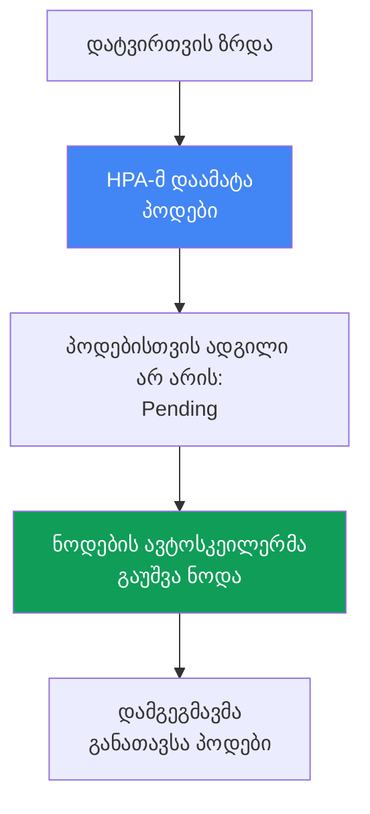
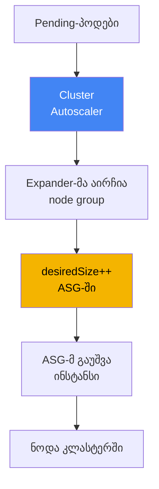
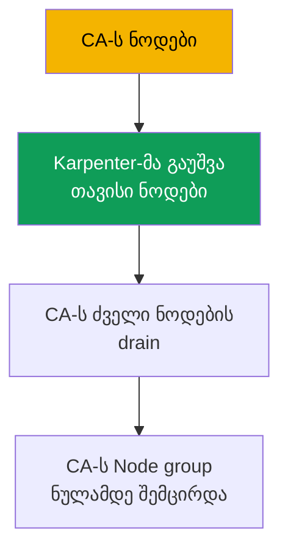

[Русская версия](ru.md) · [Eng version](en.md) · [Versión en español](es.md) · [Version française](fr.md) · [Deutsche Version](de.md) · [繁體中文版](tw.md) · [日本語版](jp.md)
# თავი 11. Cluster Autoscaler და Karpenter: ნოდების მასშტაბირების ორი მიდგომა

> **რა არის შემდეგ.** გამოთვლითი რესურსების ტიპები და Auto Mode უკვე განვიხილეთ (თავი 9), ნოდების AMI და bootstrap კი - მე-10 თავში.
> ახლა საკითხავია: როგორ იზრდება და მცირდება ნოდების რაოდენობა დატვირთვის შესაბამისად, `desiredSize`-ის
> ხელით შეცვლის გარეშე. EKS-ში ამისთვის ორი ხელსაწყოა - Cluster Autoscaler და Karpenter, ეს თავი კი
> მათ შორის მიდგომის დონეზე არჩევას ეხება. Karpenter დეტალურად (`NodePool`, `EC2NodeClass`,
> consolidation, drift, disruption budgets) - თავი 12, spot-ინსტანსები - თავი 13, სიმჭიდროვე და
> საიზინგი - თავი 14, თავად პოდების ავტომასშტაბირება (HPA, VPA, KEDA) კი - თავი 35.

## 11.1. „პოდები Pending მდგომარეობაშია, ნოდები კი არ ჩნდება“

დილით ტრაფიკი მკვეთრად გაიზარდა. HPA-მ წესიერად დაამატა რეპლიკები, მაგრამ ახალი პოდები არ ეშვება - ისინი
`Pending` მდგომარეობაშია. `kubectl describe pod` აჩვენებს `FailedScheduling` მოვლენას: დამგეგმავს
მათი განთავსების ადგილი არ აქვს, ნოდებზე თავისუფალი რესურსები არ არის. ნოდებს არავინ ამატებს, რადგან ამას
არაფერი მართავს: Auto Scaling group-ში `desiredSize` ერთი თვის წინ, მაშინდელი დატვირთვის მიხედვით, ხელით
დააყენეს.

```bash
kubectl get pods --field-selector status.phase=Pending -A
kubectl describe pod <pod> | grep -A5 Events
```

საპირისპირო პრობლემა ღამით ჩნდება, როდესაც ტრაფიკი იკლებს: რეპლიკები კვლავ ცოტაა, ნოდები კი იგივე რჩება -
ნაკლებად დატვირთული, მაგრამ ჩართული, EC2-ის ანგარიში კი გროვდება. `desiredSize`-ის ხელით მართვა პრინციპულად
ვერ მასშტაბირდება: საჭირო ნოდების რაოდენობის წინასწარ გამოცნობა შეუძლებელია, ხოლო მარაგის „ყოველი
შემთხვევისთვის“ დატოვება მთელი დღე უქმად მუშაობაში ფულის გადახდას ნიშნავს.

საჭიროა მექანიზმი, რომელიც **თავად დაამატებს ნოდებს, როდესაც პოდების განთავსების ადგილი არ არის, და წაშლის
მათ, როდესაც ნოდები ცარიელდება**. EKS-ში ორი ასეთი მექანიზმია: Cluster Autoscaler და Karpenter. ისინი
ერთსა და იმავე ამოცანას სხვადასხვა გზით წყვეტენ და მათ შორის არჩევანი ამ თავის თემაა.

## 11.2. ავტომასშტაბირების ორი დონე: პოდები და ნოდები

პირველ რიგში უნდა გავმიჯნოთ ცნებები, რათა შემდეგ აღარ აგვერიოს: Kubernetes-ში ავტომასშტაბირება
**ორ სხვადასხვა დონეზე** მუშაობს და ისინი ერთი და იგივე არ არის.

- **პოდების დონე.** HPA ცვლის Deployment-ის რეპლიკების რაოდენობას, VPA - requests-სა და limits-ს, KEDA კი
  გარე მეტრიკების მიხედვით მასშტაბირებს. ეს **დატვირთვის** მასშტაბირებაა და მას 35-ე თავი ეძღვნება.
- **ნოდების დონე.** Cluster Autoscaler და Karpenter კლასტერის ქვეშ არსებული **ნოდების** რაოდენობასა და
  შემადგენლობას ცვლის. ეს **სიმძლავრის** მასშტაბირებაა და აქ სწორედ მას განვიხილავთ.

დონეები ერთმანეთთან კავშირში მუშაობს და ჯაჭვურად ააქტიურებს ერთმანეთს. HPA-მ დატვირთვის ზრდა დაინახა და
პოდები დაამატა. მიმდინარე ნოდებზე პოდებისთვის ადგილი არ აღმოჩნდა და ისინი `Pending` მდგომარეობაში გადავიდა.
ეს სიგნალია ნოდების ავტოსკეილერისთვის: ის ხედავს განუთავსებელ პოდებს და უშვებს ნოდას, რომელზეც დამგეგმავი
მათ განათავსებს. როდესაც დატვირთვა იკლებს, ჯაჭვი უკუღმა ვითარდება: HPA პოდებს შლის, ნოდები ცარიელდება,
ნოდების ავტოსკეილერი კი მათ თიშავს.



პრაქტიკული დასკვნა: თუ პოდები `Pending` მდგომარეობაშია, ჯერ გაარკვიეთ, რომელ დონეზეა შეფერხება. თუ
რეპლიკები არ არის საკმარისი - საკითხი HPA-ს ეხება (თავი 35). თუ რეპლიკები არსებობს, მაგრამ რესურსების
სიმცირის გამო ვერ თავსდება - საკითხი ნოდების ავტოსკეილერს, ანუ ამ თავს ეხება. ორივე დონე ერთადაა საჭირო:
ნოდების ავტოსკეილერის გარეშე HPA სიმძლავრის ჭერს მიადგება, HPA-ს გარეშე კი ნოდების ავტოსკეილერი ვერ
გაიგებს, რომ რეპლიკების რაოდენობა გაიზარდა.

## 11.3. Cluster Autoscaler: მასშტაბირება Auto Scaling groups-ის ზედა დონეზე

Cluster Autoscaler (CA) - SIG Autoscaling-ის ნოდების კლასიკური ავტოსკეილერია, რომელიც წლებია EKS-ს
„მზა სახით“ მოჰყვება. მისი მოდელია: ის **ინსტანსებს თავად არ ქმნის**, არამედ უკვე არსებულ Auto Scaling
group-ებს მართავს. განუთავსებელი პოდების აღმოჩენისას CA ითვლის, რომელი node group დაიტევს მათ და ზრდის მის
`desiredSize`-ს; ASG თავისი launch template-იდან უშვებს ინსტანსს და ნოდა კლასტერში რეგისტრირდება. მცირე
დატვირთვისას CA, პირიქით, ამცირებს `desiredSize`-ს, ASG კი ინსტანსს თიშავს.



როდესაც რამდენიმე ჯგუფია და პოდი ერთზე მეტს შეესაბამება, CA არჩევანს **expander**-ის საშუალებით აკეთებს.
ავტოსკეილერის დოკუმენტაციის მიხედვით დადასტურებული სტრატეგიებია: `least-waste` (განთავსების შემდეგ მინიმალური
ზედმეტი რესურსი, ნაგულისხმევი), `priority` (თქვენ მიერ განსაზღვრული ჯგუფების პრიორიტეტების მიხედვით),
`most-pods` (სადაც მეტი პოდი მოთავსდება), `random`. AWS-ზე ყველაზე ხშირად `least-waste`-ს ან `priority`-ს
იყენებენ.

კონფიგურაციის მთავარი მოთხოვნაა: **node group რესურსების მიხედვით ერთგვაროვანი უნდა იყოს**. CA მიიჩნევს,
რომ ჯგუფის ყველა ინსტანსს ერთნაირი CPU და მეხსიერება აქვს და ერთი სანიმუშო ნოდის მიხედვით ითვლის, მოთავსდება
თუ არა პოდი. თუ ერთ ჯგუფში `m5.large`-სა და `m5.4xlarge`-ს შეურევთ, გამოთვლა აირევა და გადაწყვეტილებები
არასწორი იქნება. აქედან გამომდინარეობს CA-ს ტიპური ანტიპატერნი - თითოეული კლასის დატვირთვისთვის შექმნილი
ათობით ვიწრო ჯგუფის ზოოპარკი, რომლის სრული სურათი არავის ახსოვს.

## 11.4. Cluster Autoscaler-ის შეზღუდვები

CA საიმედო და გასაგებია, მაგრამ მისი „ASG-ის ზედა დონეზე“ მუშაობის მოდელი საზღვრებს ქმნის, რომლებიც დიდ
მასშტაბზე პრობლემად იქცევა:

- **რეაგირება ჯგუფის და არა პოდის დონეზე.** CA ცვლის `desiredSize`-ს, ხოლო კონკრეტულად რომელი ინსტანსი
  გაეშვება, ამას ASG თავისი launch template-ის მიხედვით წყვეტს. CA კონკრეტული პოდისთვის ტიპს არ ირჩევს.
- **ტიპების ნაკრები ჯგუფებითაა დაფიქსირებული.** ინსტანსების ახალი კლასი გსურთ - შექმენით ახალი node group
  და მისი launch template. მოქნილობა წინასწარ შექმნილი ჯგუფების რაოდენობით იზღუდება.
- **სიჩქარე.** `Pending` მდგომარეობის წარმოქმნასა და მზა ნოდას შორის ასეთი ჯაჭვია: CA-მ ხელახლა გამოთვალა,
  ASG გამოიძახა, ASG-მ ინსტანსი გაუშვა, ნოდა ჩაიტვირთა და დარეგისტრირდა. პრაქტიკაში ეს პირდაპირ EC2-ის
  გამოძახებაზე შესამჩნევად მეტხანს გრძელდება.
- **განლაგების ოპტიმიზაცია შეზღუდულია.** CA-ს ნაკლებად დატვირთული ნოდების წაშლა შეუძლია, მაგრამ სხვა ზომის
  ინსტანსებზე უფრო მჭიდრო განლაგებისთვის დატვირთვა არ გადააქვს - ეს Karpenter-ის სფეროა.

არცერთი ეს პუნქტი CA-ს გამოუსადეგარს არ ხდის. ისინი აჩვენებს, სად იწყებს მისი მოდელი ხელის შეშლას: ბევრი
არაერთგვაროვანი დატვირთვა, სწრაფი რეაგირების მოთხოვნა და ინსტანსის ტიპების ზუსტად შერჩევის სურვილი.

## 11.5. Karpenter: ინსტანსები პირდაპირ განუთავსებელი პოდებისთვის

Karpenter - ნოდების ავტოსკეილერია, რომელიც თავდაპირველად AWS-ში შეიქმნა (ახლა SIG Autoscaling-ის ნაწილია)
და ამოცანას სხვა მხრიდან უდგება. ის **Auto Scaling group-ს არ იყენებს**. Karpenter უშუალოდ აკვირდება
განუთავსებელ პოდებს, კითხულობს მათ მოთხოვნებს (requests, nodeSelector, affinity, topology, toleration) და
**თავად ქმნის მათთვის EC2-ინსტანსს**, რისთვისაც EC2 API-ს ASG-ის შუამავლობის გარეშე იძახებს.

Karpenter ინსტანსის ტიპს თავად ირჩევს თქვენ მიერ დაშვებული ფართო ნაკრებიდან და არჩევს ვარიანტს, რომელიც
პოდებს შეესაბამება და უფრო იაფია. აქედან გამომდინარეობს მისი ძლიერი მხარეები CA-სთან შედარებით:

- **სიჩქარე.** ინსტანსი EC2-ის პირდაპირი გამოძახებით, ASG-ის შუალედური ფენის გარეშე ეშვება, ამიტომ
  `Pending` მდგომარეობიდან მზა ნოდამდე შესამჩნევად ნაკლები დრო გადის.
- **ტიპების მოქნილობა.** თითოეული კლასისთვის ჯგუფების წინასწარ დაყოფა საჭირო არ არის - Karpenter კონკრეტული
  პოდებისთვის შესაბამის ტიპს დაშვებული დიაპაზონიდან იღებს.
- **Consolidation (ოპტიმალური განლაგება).** Karpenter-ს კლასტერის აქტიურად შემჭიდროება შეუძლია: როდესაც
  ხედავს, რომ დატვირთვის უფრო მჭიდროდ განლაგება შესაძლებელია, პოდები გადააქვს და ნოდებს უფრო მცირე ზომის
  ნოდებით ანაცვლებს ან ზედმეტებს შლის, რითაც უქმად მუშაობას ამცირებს.
- **დივერსიფიკაცია spot-ისთვის.** Karpenter-ს ერთდროულად მრავალი სხვადასხვა ტიპის ინსტანსის შერჩევა შეუძლია,
  რაც spot-დატვირთვების შეწყვეტებისადმი მდგრადობას ზრდის (spot დეტალურად - თავი 13).

აქ განზრახ ვჩერდებით მიდგომის დონეზე. მისი კონფიგურაცია - ობიექტები `NodePool` და `EC2NodeClass`,
consolidation-ის პოლიტიკები, drift და disruption budgets - დეტალურად მე-12 თავში განიხილება. ამ თავში
Karpenter მნიშვნელოვანია, როგორც **მიდგომა** და არა როგორც კონფიგურაცია.

```bash
kubectl get nodepools
kubectl get nodeclaims
```

## 11.6. მიდგომების პირდაპირი შედარება

ორივე ხელსაწყო დატვირთვის შესაბამისად ნოდებს ამატებს და შლის, მაგრამ ამას პრინციპულად განსხვავებული გზებით
აკეთებს. შევადაროთ იმ კრიტერიუმებით, რომლებიც არჩევანზე რეალურად მოქმედებს.

| კრიტერიუმი | Cluster Autoscaler | Karpenter |
|---|---|---|
| მექანიზმი | Auto Scaling group-ის ზედა დონეზე | EC2-ის პირდაპირი გამოძახება, ASG-ის გარეშე |
| რეაგირების სიჩქარე | უფრო ნელი: ASG-ის ფენის გავლით | უფრო სწრაფი: ინსტანსი პირდაპირ |
| ინსტანსის ტიპის არჩევა | ჯგუფის launch template-ში დაფიქსირებული | თავად არჩევს დიაპაზონიდან |
| განლაგების ოპტიმიზაცია / consolidation | მხოლოდ ცარიელი ნოდების წაშლა | აქტიური შემჭიდროება და ჩანაცვლება |
| Spot-დივერსიფიკაცია | ჯგუფების ფარგლებში | მრავალი ტიპი ერთდროულად (თავი 13) |
| სირთულე | node group-ები და მათი launch template-ები | საკუთარი CRD-ები `NodePool`, `EC2NodeClass` |
| სიმწიფე და დაფარვა | დიდი ხნისაა, სხვადასხვა ღრუბელში მუშაობს | AWS-first, მომწიფებული EKS-ზე |

სიჩქარის კრიტერიუმი ცალკე უნდა დავშალოთ, რადგან ტრაფიკის მკვეთრი ზრდისას ის გადამწყვეტია. Cluster Autoscaler-ის
პროვიჟინინგის დაყოვნება ასეთი ჯაჭვისგან შედგება: CA-ს გამოკითხვის ციკლი, ხელახალი გამოთვლა და ASG-ის გამოძახება,
თავად ASG-ის მიერ ინსტანსის გაშვება, ნოდის ჩატვირთვა და რეგისტრაცია. Karpenter-ს ASG-ის შუალედური ნაბიჯები არ
აქვს: ის `Pending` მოვლენაზე რეაგირებს და პირდაპირ იძახებს EC2-ს, ამიტომ `Pending` მდგომარეობიდან მზა ნოდამდე
შესამჩნევად ნაკლები დრო გადის. გარდა ამისა, Karpenter `Pending`-პოდების ჯგუფს სიმძლავრის შესახებ ერთ
გადაწყვეტილებაში აერთიანებს და ჯგუფებს სათითაოდ არ ცვლის.

მნიშვნელოვანია, ცხრილი არ აღვიქვათ ისე, თითქოს „Karpenter ყოველთვის უკეთესია“. CA-ს თავისი გამოყენების სფეროები აქვს:

- **მარტივი, პროგნოზირებადი კლასტერები** რამდენიმე ერთგვაროვანი ჯგუფით, სადაც Karpenter-ის მოქნილობა საჭირო
  არ არის და ნაცნობი CA ამოცანას ახალი CRD-ების გარეშე წყვეტს.
- **მრავალღრუბლიანი უნიფიკაცია.** CA მრავალ პროვაიდერთან ერთი და იმავე გზით მუშაობს, ამიტომ სხვადასხვა
  ღრუბელში კლასტერების მქონე გუნდს ერთიან ხელსაწყოსა და პროცესს აძლევს.
- **არსებული ინსტალაციები**, სადაც CA უკვე დაყენებული, გამართული და არ წარმოადგენს ვიწრო ადგილს: მხოლოდ
  მოდის გამო მუშა მექანიზმის შეცვლას აზრი არ აქვს.

Karpenter იქ იმარჯვებს, სადაც სწორედ CA-ს შეზღუდვები იწვევს პრობლემებს: არაერთგვაროვანი დატვირთვები,
სწრაფი რეაგირების მოთხოვნა, ტიპების ზუსტი შერჩევა და ღირებულების შესამცირებლად მჭიდრო განლაგება.

## 11.7. როგორ უკავშირდება ეს Auto Mode-ს

მე-9 თავში განხილული მნიშვნელოვანი არჩევანი. **EKS Auto Mode-ში Karpenter უკვე ჩაშენებულია სერვისში** და
კლასტერის კომპონენტად არ ჩანს: მას Helm-ით არ აყენებთ, არ აახლებთ და მის პოდს `kube-system`-ში ვერ ხედავთ.
ინსტანსების შერჩევის, consolidation-ისა და მოვლენების დამუშავების ლოგიკა მართული რეჟიმის შიგნით მუშაობს,
თქვენ კი მასზე მხოლოდ ნაგულისხმევი და საკუთარი `NodePool`-ებით ახდენთ გავლენას (Auto Mode-ში ნაგულისხმევების
რედაქტირება არ შეიძლება, საკუთარი კი შეგიძლიათ დაამატოთ).

```bash
kubectl get pods -n kube-system
```

აქედან პრაქტიკული შედეგი გამომდინარეობს. თუ კლასტერი Auto Mode-ზეა, Karpenter უკვე გაქვთ, უბრალოდ ის
დამალულია, ამიტომ ნოდების ავტოსკეილერის ცალკე დაყენება არც საჭიროა და არც შეიძლება. თუ კი **საკუთარი,
დეტალურად გამართული Karpenter** გჭირდებათ (consolidation-ის საკუთარი პოლიტიკა, საკუთარი disruption budgets,
საკუთარი `EC2NodeClass`) - ეს საკუთარი სტეკია: Karpenter-ს თავად აყენებთ და მართავთ managed ან self-managed
ნოდებზე. Cluster Autoscaler და დამოუკიდებლად დაყენებული Karpenter საკუთარი სტეკისთვისაა; Auto Mode კი
„შიგნით“ ჩაშენებული Karpenter-ია მის შიდა კომპონენტებზე წვდომის გარეშე.

| სცენარი | რით მასშტაბირდება ნოდები | ვინ მართავს ავტოსკეილერს |
|---|---|---|
| EKS Auto Mode | ჩაშენებული Karpenter | AWS, თქვენ მხოლოდ საკუთარ NodePool-ებს განსაზღვრავთ |
| საკუთარი სტეკი Karpenter-ით | თქვენ მიერ დაყენებული Karpenter | თქვენ: CRD-ები, განახლებები, კონფიგურაცია |
| საკუთარი სტეკი Cluster Autoscaler-ით | CA თქვენი node group-ების ზედა დონეზე | თქვენ: CA-ს დეპლოი, ASG, expander |

## 11.8. რა ავირჩიოთ: საკონტროლო სია

არჩევანი რამდენიმე კითხვამდე დავიყვანოთ და არა მიდგომამდე - „რომელია უფრო ახალი“.

- **კლასტერი Auto Mode-ზეა?** მაშინ ავტოსკეილერი უკვე გაქვთ (ჩაშენებული Karpenter), საკითხი დახურულია -
  მოარგეთ ის თქვენი `NodePool`-ების საშუალებით.
- **ახალი კლასტერი, საკუთარი სტეკი, მკაცრი შეზღუდვების გარეშე?** აირჩიეთ **Karpenter**: ის უფრო სწრაფია,
  ტიპების მხრივ მოქნილია, უკეთ ახდენს განლაგების ოპტიმიზაციასა და spot-დივერსიფიკაციას. EKS-ზე ახალი
  ინსტალაციებისთვის ეს ნაგულისხმევად რეკომენდებული მიდგომაა.
- **სხვა ღრუბლებთან ერთი ხელსაწყოთი უნიფიკაცია გჭირდებათ?** CA ყველგან ერთიან მიდგომას გაძლევთ - ეს მასზე
  დარჩენის მნიშვნელოვანი არგუმენტია.
- **მარტივი, პროგნოზირებადი კლასტერი გაქვთ რამდენიმე ერთგვაროვანი ჯგუფით?** CA ამოცანას ახალი CRD-ების
  გარეშე გადაწყვეტს და ეს ნორმალურია.
- **CA უკვე დაყენებული, გამართულია და ხელს არ გიშლით?** მხოლოდ ხელსაწყოს შესაცვლელად მუშა სისტემას ნუ შეეხებით;
  მიგრაცია მაშინ დაიწყეთ, როდესაც 11.4 სექციაში ჩამოთვლილ შეზღუდვებს მიადგებით.

მოკლე დასკვნა: EKS-ზე ახალი კლასტერებისთვის ნაგულისხმევად Karpenter-ს (ან Auto Mode-ს, სადაც ის ჩაშენებულია)
გირჩევენ. Cluster Autoscaler გონივრულ არჩევანად რჩება არსებული ინსტალაციების, მრავალღრუბლიანი სცენარებისა და
მარტივი, პროგნოზირებადი კლასტერებისთვის.

## 11.9. თანაარსებობა და მიგრაცია

**შეიძლება თუ არა ორივეს ერთდროულად გამოყენება.** ტექნიკურად შეიძლება, მაგრამ სიფრთხილით და **ნოდების
სხვადასხვა ნაკრებზე**: CA თავის node group-ებს მართავს, Karpenter - თავის `NodePool`-ებს და მათი
პასუხისმგებლობის არეები არ უნდა იკვეთებოდეს. თუ ორივე ერთსა და იმავე ნოდებზე განაცხადებს პრეტენზიას, ისინი
scale-down გადაწყვეტილებებისთვის ბრძოლას დაიწყებს და ხელს შეუშლის ერთმანეთს. ასეთი რეჟიმი მხოლოდ მიგრაციის
დროებით პერიოდშია გამართლებული და არა როგორც მუდმივი კონსტრუქცია.

**რატომ მიგრირებენ ჩვეულებრივ CA-დან Karpenter-ზე.** მიზეზი მოდა კი არა, 11.4 სექციაში ჩამოთვლილი იგივე
შეზღუდვებია: მასშტაბის ზრდასთან ერთად node group-ების ზოოპარკი გროვდება, არასაკმარისი ოპტიმიზაციის გამო
უქმად მუშაობა იზრდება, დატვირთვის მკვეთრ ზრდაზე რეაგირება კი ნელია. Karpenter ამ პრობლემებს ხსნის, ამიტომ
მიგრაციის მიმართულება თითქმის ყოველთვის ცალმხრივია.

**მიგრაციის პრინციპია ახალი ნოდების საშუალებით და არა მუშაობის პროცესში.** არსებული პოდები ცოცხალ ნოდაზე
სხვა ავტოსკეილერის ქვეშ არ გადააქვთ. Karpenter თავის ნოდებს არსებულების გვერდით უშვებს, დატვირთვა მათზე
თანდათან გადააქვთ (მაგალითად, CA-ს ძველი ნოდების cordon-ისა და drain-ის საშუალებით), CA-ს მიერ მართული
node group-ები კი ნულამდე მცირდება და დატვირთვის სრულად გატანის შემდეგ იშლება. ასე გამოირიცხება მომენტი,
როდესაც ერთ ნოდაზე ორივე მექანიზმია პასუხისმგებელი.

**ეტაპობრივი გეგმა (CA -> Karpenter v1).**

1. Karpenter v1-ს მუშა CA-ს გვერდით აყენებენ და ზონებს აცალკევებენ: Karpenter-ს თავისი `NodePool`-ები აქვს,
   CA-ს - თავისი node group-ები, გადაკვეთის გარეშე (თანაარსებობის ფაზა).
2. ახალ და არაკრიტიკულ დატვირთვებს Karpenter-ის ნოდებისკენ მიმართავენ და ამოწმებენ, რომ პროვიჟინინგი და
   consolidation სათანადოდ მუშაობს.
3. CA-ს ძველ ნოდებზე თანდათან ასრულებენ cordon-სა და drain-ს, პოდები კი Karpenter-ის ნოდებზე გადადის.
4. CA-ს node group-ებს ნულამდე ამცირებენ, შემდეგ თავად Cluster Autoscaler-სა და მის IAM-როლებს შლიან.



**როგორ დავიცვათ მგრძნობიარე დატვირთვები გამოცდის პერიოდში.** სანამ Karpenter-ს პირველ პოდებზე ამოწმებენ,
ნოდის დაუგეგმავი გაუქმებისგან პოდს ანოტაცია `karpenter.sh/do-not-disrupt: "true"` იცავს (ძველ API-ში მას
`karpenter.sh/do-not-evict` ერქვა). მნიშვნელოვანია მისი მოქმედების ფარგლების გაგება: ანოტაცია აჩერებს
**მთელ ნოდას**, რომელზეც პოდი მუშაობს, და აფერხებს ყველა ნებაყოფლობით შეწყვეტას, მათ შორის drift-ის გამო
განახლებას. ამიტომ მიგრაციისას მას მიზნობრივად, კონკრეტულ პოდებზე აყენებენ და დატვირთვის გამოცდის შემდეგ
შლიან, წინააღმდეგ შემთხვევაში consolidation-თან ერთად AMI-ის განახლებაც შეჩერდება (თავი 12).

მიგრაციისთვის საჭირო Karpenter-ის კონფიგურაციის დეტალები (`NodePool`, `EC2NodeClass`, consolidation,
disruption budgets) მე-12 თავშია. აქ მთავარი პრინციპია: მიგრაცია დატვირთვის ახალ ნოდებზე გადატანით ხდება
და არა მუშა პოდების ქვეშ ავტოსკეილერის გადართვით.

## 11.10. როგორ იყენებენ ამას production-ში

- **ავტომასშტაბირების ორ დონეს მკაფიოდ აცალკევებენ.** `Pending` მდგომარეობის გამოსწორებამდე ადგენენ,
  შეფერხება პოდების დონეზეა (HPA, თავი 35) თუ ნოდების დონეზე (ეს თავი), რადგან გამოსავალი განსხვავებულია.
- **EKS-ზე ახალი კლასტერებისთვის Karpenter-ს ან Auto Mode-ს ირჩევენ**, სადაც ის ჩაშენებულია, Cluster
  Autoscaler-ს კი არსებული ინსტალაციებისა და მრავალღრუბლიანი სცენარებისთვის ტოვებენ.
- **Cluster Autoscaler-ის node group-ებს რესურსების მიხედვით ერთგვაროვნად ინარჩუნებენ**, წინააღმდეგ
  შემთხვევაში CA-ს სანიმუშო ნოდის მიხედვით გამოთვლა მცდარია და მასშტაბირების გადაწყვეტილებებიც არასწორია.
- **CA-სა და Karpenter-ს ერთსა და იმავე ნოდებზე არ უშვებენ.** თუ მიგრაციისას ორივეა საჭირო, მათ ზონებს
  მკაცრად აცალკევებენ: CA-ს თავისი node group-ები, Karpenter-ს კი თავისი `NodePool`-ები აქვს.
- **მიგრაციას ახალი ნოდების საშუალებით ახორციელებენ** და არა ავტოსკეილერის მუშაობის პროცესში გადართვით:
  Karpenter თავის ნოდებს უშვებს, დატვირთვა drain-ით გადააქვთ, CA-ს ჯგუფებს კი ნულამდე ამცირებენ.
- **ხელსაწყოს არჩევანს 11.8-ის საკონტროლო სიის მიხედვით გაცნობიერებულად აფიქსირებენ** და არა სიახლის გამო:
  CA-ს თავისი გამოყენების სფეროები აქვს და გამართულ მუშა CA-ს მხოლოდ ხელსაწყოს შესაცვლელად არ ცვლიან.

## 11.11. მინი-ლექსიკონი

- **Cluster Autoscaler (CA)** - ნოდების ავტოსკეილერი, რომელიც Auto Scaling group-ის ზედა დონეზე მუშაობს:
  განუთავსებელი პოდებისა და დაბალი დატვირთვის მიხედვით ჯგუფების `desiredSize`-ს ცვლის. ინსტანსების ტიპები
  ჯგუფების launch template-ებშია დაფიქსირებული.
- **Karpenter** - ნოდების ავტოსკეილერი, რომელიც კონკრეტული განუთავსებელი პოდებისთვის პირდაპირ ქმნის
  EC2-ინსტანსებს და ტიპს დაშვებული დიაპაზონიდან თავად ირჩევს. კონფიგურაცია - თავი 12.
- **Expander** - Cluster Autoscaler-ის სტრატეგია node group-ის ასარჩევად, როდესაც პოდი რამდენიმე ჯგუფს
  შეესაბამება: `least-waste` (ნაგულისხმევი), `priority`, `most-pods`, `random`.
- **Consolidation** - Karpenter-ში კლასტერის აქტიური შემჭიდროება: უქმად მუშაობის შესამცირებლად პოდების
  გადატანა და ნოდების უფრო მცირე ნოდებით ჩანაცვლება ან ზედმეტების წაშლა (დეტალურად - თავი 12).
- **ნოდების მასშტაბირება პოდების მასშტაბირების წინააღმდეგ** - სხვადასხვა დონეა: ნოდებს CA და Karpenter
  მასშტაბირებს (ეს თავი), პოდებს კი - HPA, VPA, KEDA (თავი 35).

## 11.12. თავის შეჯამება

- ავტომასშტაბირება ორ დონეზე მუშაობს: პოდებს HPA, VPA, KEDA მასშტაბირებს (თავი 35), ნოდებს კი - Cluster
  Autoscaler და Karpenter (ეს თავი). დონეები Pending -> ახალი ნოდა ჯაჭვითაა დაკავშირებული.
- Cluster Autoscaler Auto Scaling group-ის ზედა დონეზე მუშაობს: ცვლის `desiredSize`-ს, ჯგუფს expander-ის
  საშუალებით ირჩევს და ერთგვაროვან ჯგუფებს მოითხოვს. ინსტანსების ტიპები მათ launch template-ებშია მოცემული.
- CA-ს შეზღუდვებია: რეაგირება ჯგუფის დონეზე, ჯგუფებით დაფიქსირებული ტიპების ნაკრები, ASG-ის ფენის გამო უფრო
  ნელი მუშაობა და მხოლოდ ცარიელი ნოდების წაშლით შეზღუდული განლაგების ოპტიმიზაცია.
- Karpenter ინსტანსებს პირდაპირ განუთავსებელი პოდებისთვის ქმნის, თავად ირჩევს ტიპს, უფრო სწრაფად მუშაობს,
  consolidation და spot-ისთვის ტიპების დივერსიფიკაცია შეუძლია. კონფიგურაცია - თავი 12.
- Karpenter „ყოველთვის უკეთესი“ არ არის: CA-ს გამოყენების სფეროებად რჩება მარტივი პროგნოზირებადი კლასტერები,
  მრავალღრუბლიანი უნიფიკაცია და გამართული არსებული ინსტალაციები.
- Auto Mode-ში Karpenter სერვისშია ჩაშენებული და კომპონენტად არ ჩანს; საკუთარი დეტალურად გამართული Karpenter
  კი საკუთარი სტეკია, რომელსაც თავად მართავთ.
- ორივე ავტოსკეილერის ერთდროულად გამოყენება მხოლოდ ნოდების სხვადასხვა ნაკრებზე და დროებითი ზომის სახით შეიძლება;
  ჩვეულებრივ CA-დან Karpenter-ზე ახალი ნოდების საშუალებით მიგრირებენ და არა მუშაობის პროცესში გადართვით.

## 11.13. როგორ გამოგადგებათ ეს რეალურ სამუშაოში

მორიგეობისას ყველაზე ხშირი სცენარია პოდები `Pending` მდგომარეობაში და პირველი გადაწყვეტილება აქ
დიაგნოსტიკურია: უნდა გაარკვიოთ დონე. `kubectl describe pod`-ში რესურსების სიმცირით გამოწვეული
`FailedScheduling` მოვლენა მიუთითებს, რომ საკითხი ნოდების ავტოსკეილერს ეხება და არა HPA-ს. შემდეგ ამოწმებთ,
რომელი მექანიზმით მასშტაბირებს კლასტერი ნოდებს: თუ `NodePool` და `nodeclaims` არსებობს - ეს Karpenter-ია
(საკუთარი ან Auto Mode-ის შიგნით), ხოლო თუ node group და CA-ს პოდი `kube-system`-შია - Cluster Autoscaler.
პასუხი განსაზღვრავს, სად უნდა ეძებოთ მიზეზი: expander-სა და ASG-ის ლიმიტებში თუ `NodePool`-სა და მის ლიმიტებში.

დაგეგმვისას ეს თავი გეხმარებათ, ახალ კლასტერში ჩვეული CA ინერციით არ გადაიტანოთ და, პირიქით, არსებულ მუშა
CA-ს Karpenter-ის გამო უმიზეზოდ არ შეეხოთ. არჩევანს საკონტროლო სიის მიხედვით აფიქსირებენ, ხოლო საჭიროების
შემთხვევაში მიგრაციას ძველი ნოდების თანდათანობითი drain-ითა და ახალი ნოდების საშუალებით გეგმავენ და არა მუშა
დატვირთვის ქვეშ ავტოსკეილერის გადართვის სახით.

## 11.14. კითხვები თვითშემოწმებისთვის

1. რით განსხვავდება ნოდების მასშტაბირება პოდების მასშტაბირებისგან და როგორ უკავშირდება ეს დონეები ერთმანეთს?
2. `kubectl`-ში რომელი სიმპტომით გავიგებთ, რომ შეფერხება ნოდების და არა HPA-ს დონეზეა?
3. როგორ ამატებს Cluster Autoscaler ნოდას და რატომ არ ირჩევს ის თითოეული პოდისთვის ინსტანსის ტიპს?
4. რას აკეთებს expander და რა სტრატეგიები აქვს მას?
5. რატომ უნდა იყოს Cluster Autoscaler-ის node group რესურსების მიხედვით ერთგვაროვანი?
6. ჩამოთვალეთ Cluster Autoscaler-ის ძირითადი შეზღუდვები დიდ მასშტაბზე.
7. რით განსხვავდება Karpenter-ის მოდელი Cluster Autoscaler-ის მოდელისგან პრინციპულად?
8. რა არის consolidation და რატომ არ აქვს Cluster Autoscaler-ს არსებითად ასეთი შესაძლებლობა?
9. რომელ სფეროებში რჩება Cluster Autoscaler გონივრულ არჩევანად?
10. როგორ უკავშირდება Karpenter EKS Auto Mode-ს და როდისაა საჭირო საკუთარი Karpenter?
11. შეიძლება თუ არა CA-სა და Karpenter-ის ერთდროულად გამოყენება და რა პირობებით?
12. რატომ ხორციელდება მიგრაცია ახალი ნოდების საშუალებით და არა მუშაობის პროცესში ავტოსკეილერის გადართვით?

## პრაქტიკა

ამ თავს ჯერ ლაბა არ აქვს, მაგრამ ნოდების მასშტაბირების მიდგომის ნახვა ცოცხალ კლასტერზე შეიძლება. დაიწყეთ
იმის გარკვევით, საერთოდ რომელი მექანიზმით მასშტაბირდება კლასტერი: `kubectl get pods -n kube-system` აჩვენებს,
არის თუ არა Cluster Autoscaler-ის პოდი, ხოლო `kubectl get nodepools` და `kubectl get nodeclaims` - მუშაობს
თუ არა Karpenter (მათ შორის Auto Mode-ის შიგნით). რომელიმე მათგანის არსებობა მაშინვე განსაზღვრავს, ორი
მიდგომიდან რომელი გაქვთ გამოყენებული.

შემდეგ 11.1 სექციის დიაგნოსტიკა კლასტერისთვის ზიანის მიყენების გარეშე გაიმეორეთ. შეამოწმეთ, არის თუ არა
ამჟამად განუთავსებელი პოდები: `kubectl get pods --field-selector status.phase=Pending -A`. თუ არის,
`kubectl describe pod <pod>` და `FailedScheduling` მოვლენები მიგანიშნებთ, ელოდებიან თუ არა ისინი სიმძლავრეს.
თქვენი კლასტერისთვის გაიარეთ 11.8-ის საკონტროლო სია და გულწრფელად უპასუხეთ: გამოყენებული მიდგომა თქვენი
დატვირთვებისთვის გაცნობიერებული არჩევანია თუ მემკვიდრეობა, რომლის Karpenter-ის სასარგებლოდ გადახედვის დროა,
ან, პირიქით, უცვლელად უნდა დატოვოთ.

---
[სარჩევი](../README_GE.md) · [თავი 10](../10/ge.md) · [თავი 12](../12/ge.md)
