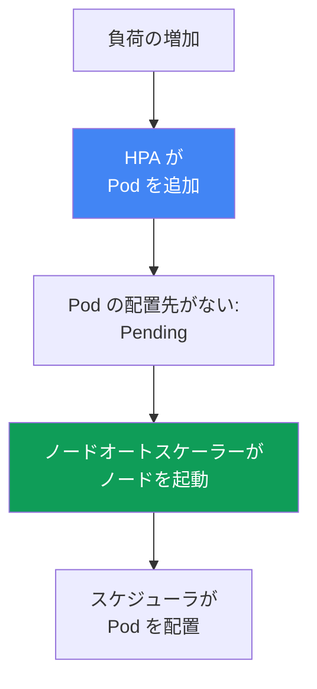
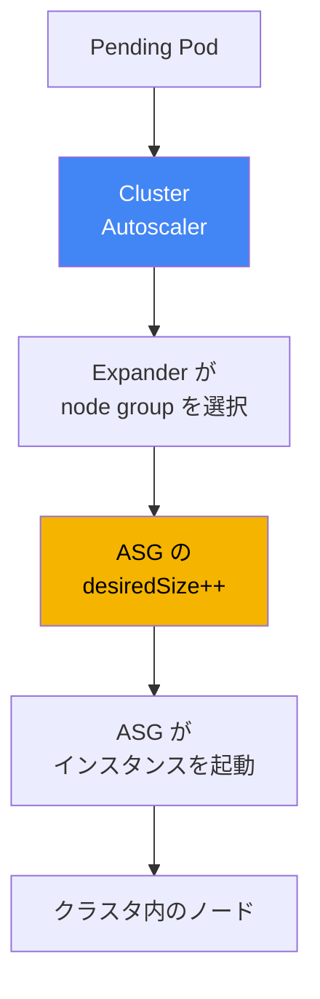
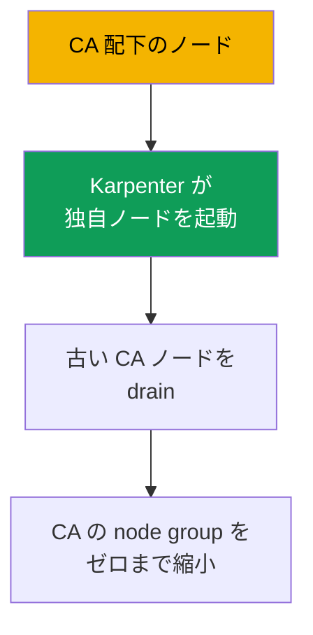

[Русская версия](ru.md) · [Eng version](en.md) · [Versión en español](es.md) · [Version française](fr.md) · [Deutsche Version](de.md) · [ქართული ვერსია](ge.md) · [繁體中文版](tw.md)
# 第11章 Cluster Autoscaler と Karpenter: ノードスケーリングの二つのアプローチ

> **この後。** コンピュートタイプと Auto Mode は第9章、AMI とノードの bootstrap は第10章で扱いました。次は、手動で `desiredSize` を調整せず、負荷に応じてノード数を増減させる方法です。EKS には Cluster Autoscaler と Karpenter という二つのツールがあり、本章ではアプローチの選択を扱います。Karpenter の詳細（NodePool、EC2NodeClass、consolidation、drift、disruption budgets）は第12章、spot インスタンスは第13章、密度とサイジングは第14章、Pod 自体のオートスケーリング（HPA、VPA、KEDA）は第35章で説明します。

## 11.1. 「Pod が Pending のままなのに、ノードが増えない」

朝のトラフィック急増時、HPA は正しくレプリカを追加しましたが、新しい Pod は起動せず `Pending` のままです。`kubectl describe pod` には `FailedScheduling` イベントが示され、スケジューラには配置先がありません。ノードに空きリソースがないからです。ノードが追加されないのは、それを管理するものがいないためです。Auto Scaling group の `desiredSize` は、当時の負荷に合わせて一か月前に手動設定されたままです。

```bash
kubectl get pods --field-selector status.phase=Pending -A
kubectl describe pod <pod> | grep -A5 Events
```

逆の問題は夜間、トラフィックが下がったときに起きます。レプリカは減ったのに、ノードは同じままです。低負荷でも稼働し続け、その EC2 料金が発生します。`desiredSize` の手動管理は本質的にスケールしません。必要なノード数を事前に正確に予測することはできず、「念のため」の余力を常時持てば、24 時間アイドル状態に支払うことになります。

**Pod の配置先がなくなったときに自動でノードを追加し、ノードが空いたときに削除する**仕組みが必要です。EKS にはその仕組みが二つあります。Cluster Autoscaler と Karpenter です。どちらも同じ課題を解決しますが、その方法は異なります。本章ではその選択を扱います。

## 11.2. オートスケーリングの二つのレベル: Pod とノード

以降混同しないために、まず明確にすべきことがあります。Kubernetes のオートスケーリングには、**二つの異なるレベル**があり、同じものではありません。

- **Pod レベル。** HPA は Deployment のレプリカ数を変更し、VPA は requests と limits を変更し、KEDA は外部メトリクスに基づいてスケールします。これは**負荷**のスケーリングであり、第35章のテーマです。
- **ノードレベル。** Cluster Autoscaler と Karpenter は、クラスタを支える**ノード**の数と構成を変更します。これは**キャパシティ**のスケーリングであり、本章のテーマです。

これらのレベルは連動して、連鎖的に互いを起動します。HPA が負荷の増加を検知して Pod を追加します。既存ノードにはその Pod を置く場所がなく、Pod は `Pending` になります。これがノードオートスケーラーへのシグナルです。オートスケーラーは未配置 Pod を検知してノードを起動し、スケジューラはそこへ Pod を配置します。負荷が下がると、この連鎖は逆に進みます。HPA が Pod を減らし、ノードが空き、ノードオートスケーラーがそれらを停止します。



実務上の結論は次のとおりです。Pod が `Pending` の場合、まずどのレベルで詰まっているかを把握します。レプリカが不足しているなら HPA の問題です（第35章）。レプリカはあるがリソース不足で配置できないなら、ノードオートスケーラー、すなわち本章の問題です。両方のレベルが必要です。ノードオートスケーラーなしの HPA はキャパシティの上限に突き当たり、HPA なしのノードオートスケーラーはレプリカが増えたことを知ることができません。

## 11.3. Cluster Autoscaler: Auto Scaling group 上でのスケーリング

Cluster Autoscaler（CA）は、SIG Autoscaling による従来型のノードオートスケーラーで、長年 EKS で「標準的に」使われてきたものです。そのモデルでは、**インスタンスを自ら作成せず**、既存の Auto Scaling group を管理します。未配置 Pod を見つけると、CA はそれを収容できる node group を計算して `desiredSize` を増やします。ASG はその launch template からインスタンスを起動し、ノードがクラスタに登録されます。低負荷時には CA が逆に `desiredSize` を減らし、ASG がインスタンスを停止します。



グループが複数あり、Pod が複数のグループに適合する場合、CA は **expander** で選択します。オートスケーラーのドキュメントにある戦略は、`least-waste`（配置後の余剰リソースが最小、デフォルト）、`priority`（指定したグループ優先度）、`most-pods`（より多くの Pod を収容できるもの）、`random` です。AWS では通常、`least-waste` または `priority` が使われます。

設定上の重要な要件は、**node group がリソース面で均質であること**です。CA はグループ内のすべてのインスタンスが CPU とメモリについて同一であると想定し、代表ノード一つから Pod が収容可能かを推定します。`m5.large` と `m5.4xlarge` を同じグループに混在させると、計算が狂い、判断が不正確になります。ここから、負荷クラスごとに細かなグループを大量に作り、全体像を誰も把握できなくなるという、CA の典型的なアンチパターンが生まれます。

## 11.4. Cluster Autoscaler の制約

CA は信頼性が高く理解しやすい一方、「ASG の上で動く」というモデルには、大規模環境で問題になりやすい境界があります。

- **Pod 単位ではなくグループ単位の反応。** CA が変更するのは `desiredSize` であり、実際にどのインスタンスを起動するかは ASG がその launch template に従って決定します。CA は特定の Pod に合わせてインスタンスタイプを選択しません。
- **タイプのセットはグループに固定される。** 新しいインスタンスクラスが必要なら、新しい node group とその launch template を作成します。柔軟性は事前作成したグループ数に制約されます。
- **速度。** `Pending` の出現からノードの準備完了までには、CA の再計算、ASG の呼び出し、ASG によるインスタンス起動、ノードのブートと登録という連鎖があります。実際には、EC2 を直接呼び出すより明らかに時間がかかります。
- **パッキングが限定的。** CA は低負荷ノードを削除できますが、別サイズのインスタンスへより密に詰め直すためにワークロードを移動させることはしません。これは Karpenter の領域です。

これらのどれも、CA を不適切なものにするわけではありません。多様なワークロード、高速な反応要件、インスタンスタイプを細かく選択したいという場面で、そのモデルが妨げになり始めることを示しています。

## 11.5. Karpenter: 未配置 Pod 向けにインスタンスを直接起動する

Karpenter は AWS で生まれた（現在は SIG Autoscaling の一部）ノードオートスケーラーであり、異なる方法を取ります。**Auto Scaling group を使用しません**。Karpenter は未配置 Pod を直接監視し、その要件（requests、nodeSelector、affinity、topology、toleration）を読み取り、ASG を仲介せず EC2 API を呼び出して、**Pod 向けの EC2 インスタンスを自ら作成します**。

Karpenter は、許可した幅広い候補の中から、Pod に適合して低コストなインスタンスタイプを**自ら選択します**。これが CA に対する強みです。

- **速度。** ASG の中間層を介さず EC2 を直接呼び出してインスタンスを起動するため、`Pending` からノードの準備完了までの時間が明らかに短くなります。
- **タイプの柔軟性。** クラスごとに事前にグループを分ける必要はありません。Karpenter は特定の Pod に対して、許可した範囲から適切なタイプを選びます。
- **Consolidation（集約）。** Karpenter はクラスタを積極的に高密度化できます。ワークロードをより密に配置できると判断すると、Pod を移動してノードをより小さなものに置き換えるか、余剰ノードを削除し、アイドルコストを下げます。
- **spot の多様化。** Karpenter は多数の異なるインスタンスタイプを同時に選択でき、spot ワークロードの中断に対する耐性を高めます（spot の詳細は第13章）。

ここでは意図的にアプローチのレベルにとどめます。設定方法、すなわち `NodePool` と `EC2NodeClass`、consolidation ポリシー、drift、disruption budgets は第12章で詳しく扱います。本章で重要なのは、Karpenter を設定としてではなく**アプローチ**として捉えることです。

```bash
kubectl get nodepools
kubectl get nodeclaims
```

## 11.6. アプローチの直接比較

どちらのツールも負荷に応じてノードを追加・削除しますが、その方法は根本的に異なります。選択に実際に影響する軸で比較します。

| 軸 | Cluster Autoscaler | Karpenter |
|---|---|---|
| 仕組み | Auto Scaling group 上で動作 | ASG を介さず EC2 を直接呼び出す |
| 反応速度 | ASG 層を通るため遅い | インスタンスを直接起動するため速い |
| インスタンスタイプの選択 | グループの launch template に固定 | 許可された範囲から自動選択 |
| パッキング / consolidation | 空のノードの削除のみ | 積極的な集約と置換 |
| Spot の多様化 | グループの範囲内 | 多数のタイプを同時に使用可能（第13章） |
| 複雑さ | node group とその launch template | 独自の CRD `NodePool`、`EC2NodeClass` |
| 成熟度と適用範囲 | 歴史が長く、複数クラウドで動作 | AWS-first、EKS で成熟 |

トラフィック急増時には、速度の軸を個別に見る必要があります。Cluster Autoscaler のプロビジョニング遅延は、CA のポーリングサイクル、再計算と ASG 呼び出し、ASG によるインスタンス起動、ノードのブートと登録で構成されます。Karpenter には ASG を経由する中間ステップがありません。`Pending` にイベント駆動で反応して EC2 を直接呼び出すため、`Pending` からノードの準備完了までが明らかに短くなります。また Karpenter は、`Pending` Pod の一群を一つのキャパシティ判断にまとめ、グループを一つずつ変更することはありません。

表を「Karpenter は常に優れている」と読むべきではありません。CA には固有の適用領域があります。

- **単純で予測可能なクラスタ。** 均質なグループが数個だけで Karpenter の柔軟性が不要なら、慣れた CA が新しい CRD なしで課題を解決します。
- **マルチクラウドの統一。** CA は多くのプロバイダーで同じ方法で動作します。そのため複数クラウドにクラスタを持つチームには、単一のツールとプロセスを提供します。
- **既存の導入環境。** CA がすでに導入・調整済みでボトルネックにもなっていないなら、流行のためだけに動作中の仕組みを変える理由はありません。

Karpenter が優位になるのは、まさに CA の制約が問題になる場合です。多様なワークロード、高速な反応の要件、きめ細かなタイプ選択、コストのための高密度なパッキングです。

## 11.7. Auto Mode との関係

第9章からの重要な分岐です。**EKS Auto Mode では Karpenter はすでにサービスに組み込まれており**、クラスタコンポーネントとしては見えません。Helm でインストールも更新もしませんし、`kube-system` にその Pod が見えることもありません。インスタンス選択、consolidation、イベント処理のロジックはマネージドモード内部で動作し、利用者が影響を与えられるのはデフォルトの `NodePool` と自作の `NodePool` を通じてのみです（Auto Mode のデフォルトは変更できませんが、独自のものは追加できます）。

```bash
kubectl get pods -n kube-system
```

ここから実務上の結論が得られます。クラスタが Auto Mode なら、Karpenter はすでに存在します。ただし隠蔽されているため、別途ノードオートスケーラーをインストールする必要も、することもできません。一方で、**細かな設定を行う独自の Karpenter**（独自の consolidation ポリシー、disruption budgets、`EC2NodeClass`）が必要なら、それは独自スタックです。managed または self-managed ノード上で Karpenter を自ら導入・運用します。Cluster Autoscaler と自己運用の Karpenter は独自スタック向けです。Auto Mode は、内部へアクセスできない「裏側の」Karpenter です。

| シナリオ | ノードをスケールするもの | オートスケーラーの管理者 |
|---|---|---|
| EKS Auto Mode | 組み込み Karpenter | AWS。利用者は独自の NodePool のみ指定 |
| Karpenter を使う独自スタック | 自ら導入した Karpenter | 利用者: CRD、アップグレード、設定 |
| Cluster Autoscaler を使う独自スタック | 自分の node group 上の CA | 利用者: CA のデプロイ、ASG、expander |

## 11.8. 選択方法: チェックリスト

「どちらが新しいか」ではなく、いくつかの問いに選択を落とし込みます。

- **クラスタは Auto Mode ですか。** その場合、オートスケーラー（組み込み Karpenter）はすでにあり、問題は解決済みです。独自の `NodePool` を通じて設定します。
- **新規クラスタで、独自スタックかつ強い制約がないですか。** **Karpenter** を選びます。タイプの柔軟性とパッキング、spot の多様化に優れ、高速です。EKS の新規導入では、これがデフォルトの推奨アプローチです。
- **一つのツールで他クラウドとの統一が必要ですか。** CA はどこでも同じ方法を提供するため、それを使い続ける強い理由になります。
- **均質なグループが数個の、単純で予測可能なクラスタですか。** CA は新しい CRD なしで課題を解決でき、それで問題ありません。
- **CA はすでに導入・調整済みで、障害になっていませんか。** ツールを変えるためだけに動作中のものを変えないでください。11.4 節の制約に突き当たったときに移行します。

要約すると、EKS の新規クラスタにはデフォルトで Karpenter（またはそれを内包する Auto Mode）が推奨されます。Cluster Autoscaler は、既存導入環境、マルチクラウドのシナリオ、単純で予測可能なクラスタでは引き続き妥当な選択です。

## 11.9. 共存と移行

**両方を同時に稼働できますか。** 技術的には可能ですが、注意が必要であり、**異なるノードセット上**で動作させます。CA は自分の node group を、Karpenter は自分の `NodePool` を管理します。担当範囲を重複させてはいけません。両者が同じノードを対象にすると、scale-down の判断で競合し、相互に妨害します。この構成は恒久的なものではなく、移行期間中の一時的な用途でのみ妥当です。

**通常は CA から Karpenter へ移行する理由。** 理由は流行ではなく、11.4 節で挙げた制約そのものです。規模が大きくなると多数の node group が増え、弱いパッキングによるアイドル時間が増加し、急増への反応は遅くなります。Karpenter はこれらの問題を解消するため、移行方向はほぼ常に一方向です。

**移行の原則は、稼働中に切り替えるのではなく新しいノードを使うことです。** 既存 Pod を、別のオートスケーラーの下で稼働中ノードから移し替えることはしません。Karpenter が隣で独自ノードを起動し、ワークロードを徐々にそちらへ移します（たとえば古い CA ノードを cordon と drain します）。その後、CA が管理する node group をゼロまで縮小し、そこにワークロードが残らなくなってから削除します。これにより、一つのノードを両方の仕組みが担当する瞬間を排除します。

**段階的な計画（CA -> Karpenter v1）。**

1. 動作中の CA と並行して Karpenter v1 を導入し、担当範囲を分けます。Karpenter には独自の `NodePool`、CA には独自の node group を割り当て、重複させません（共存フェーズ）。
2. 新規かつ非クリティカルなワークロードを Karpenter ノードへ向け、プロビジョニングと consolidation が期待どおりに動くことを確認します。
3. 古い CA ノードを徐々に cordon と drain し、Pod を Karpenter ノードへ移します。
4. CA 配下の node group をゼロまで縮小し、その後 Cluster Autoscaler 自体とその IAM ロールを削除します。



**検証期間中に重要なワークロードを保護する方法。** 最初の Pod で Karpenter を検証している間は、Pod アノテーション `karpenter.sh/do-not-disrupt: "true"` により、予定外のノード終了から保護できます（古い API では `karpenter.sh/do-not-evict` でした）。このアノテーションの対象範囲を理解することが重要です。これは Pod が稼働する**ノード全体**を保持し、drift による更新を含むすべての任意の中断を妨げます。したがって移行中は、対象の Pod にのみ限定して設定し、ワークロードの検証後に外します。そうしないと consolidation だけでなく、AMI の更新も停止します（第12章）。

移行時に必要になる Karpenter の設定詳細（`NodePool`、`EC2NodeClass`、consolidation、disruption budgets）は第12章で説明します。ここで重要なのは、オートスケーラーを稼働中 Pod の下で切り替えるのではなく、ワークロードを新しいノードへ移すことで移行する、という原則です。

## 11.10. 本番環境での適用方法

- **オートスケーリングの二つのレベルを明確に分けます。** `Pending` を修正する前に、問題が Pod レベル（HPA、第35章）かノードレベル（本章）かを特定します。対処は異なります。
- **EKS の新規クラスタでは Karpenter または組み込みの Auto Mode を選びます。** Cluster Autoscaler は既存導入環境とマルチクラウドのシナリオ向けに残します。
- **Cluster Autoscaler 配下の node group はリソース面で均質に保ちます。** そうしないと、CA の代表ノードによる計算が誤り、スケーリング判断が不正確になります。
- **同じノードで CA と Karpenter を動かしません。** 移行時に両方が必要なら、CA の node group と Karpenter の `NodePool` という担当範囲を厳格に分離します。
- **移行は新しいノードを介して行います。** オートスケーラーを稼働中に切り替えるのではありません。Karpenter がノードを起動し、ワークロードを drain で移し、CA のグループをゼロまで縮小します。
- **新しさでなくチェックリスト 11.8 に基づいて、意識的にツールを選択します。** CA にも適した領域があり、調整済みで動作している CA をツール変更のためだけに変えません。

## 11.11. ミニ用語集

- **Cluster Autoscaler（CA）** -- Auto Scaling group 上で動作するノードオートスケーラーです。未配置 Pod と低負荷に応じてグループの `desiredSize` を変更します。インスタンスタイプはグループの launch template に固定されます。
- **Karpenter** -- 特定の未配置 Pod 向けに EC2 インスタンスを直接作成し、許可範囲からタイプを自ら選択するノードオートスケーラーです。設定は第12章で扱います。
- **Expander** -- Pod が複数の node group に適合する場合に Cluster Autoscaler が選択する戦略です。`least-waste`（デフォルト）、`priority`、`most-pods`、`random` があります。
- **Consolidation** -- Karpenter によるクラスタの積極的な集約です。Pod を移動し、ノードを小さいものに置き換えるか余剰ノードを削除して、アイドル時間を減らします（詳細は第12章）。
- **ノードスケーリングと Pod スケーリングの違い** -- 異なるレベルです。ノードは CA と Karpenter（本章）がスケールし、Pod は HPA、VPA、KEDA（第35章）がスケールします。

## 11.12. この章のまとめ

- オートスケーリングには二つのレベルがあります。Pod は HPA、VPA、KEDA（第35章）、ノードは Cluster Autoscaler と Karpenter（本章）がスケールします。両レベルは、Pending -> 新しいノードという連鎖で接続されます。
- Cluster Autoscaler は Auto Scaling group 上で動作します。`desiredSize` を変更し、expander でグループを選択し、均質なグループを必要とします。インスタンスタイプはその launch template で決まります。
- CA の制約は、グループレベルの反応、グループで固定されたタイプのセット、ASG 層による遅さ、空ノードの削除に限定されるパッキングです。
- Karpenter は未配置 Pod 向けにインスタンスを直接作成し、タイプを自ら選択します。より高速で、consolidation と spot 向けのタイプ多様化を行えます。設定は第12章で扱います。
- Karpenter が「常に優れている」わけではありません。単純で予測可能なクラスタ、マルチクラウドの統一、調整済みの既存導入環境では、CA に適した領域が残ります。
- Auto Mode では Karpenter がサービスに組み込まれ、コンポーネントとして見えません。細かな設定を持つ独自の Karpenter は、自ら運用する独自スタックです。
- 両方のオートスケーラーを同時に保持できるのは、異なるノードセット上かつ一時的な措置としてのみです。通常は CA から Karpenter へ移行し、稼働中に切り替えるのではなく新しいノードを介して移行します。

## 11.13. 実務での役立ち方

当番時に最も多いシナリオは Pod が `Pending` になることであり、最初に行うべき判断は診断です。リソース不足による `FailedScheduling` イベントを含む `kubectl describe pod` は、問題が HPA ではなくノードオートスケーラーにあることを示します。次に、クラスタがそもそもどの仕組みでノードをスケールするかを確認します。`NodePool` と `nodeclaims` があれば Karpenter（独自導入または Auto Mode 内部）、node group と `kube-system` 内の CA Pod があれば Cluster Autoscaler です。答えにより、原因を expander と ASG の制限で探すか、`NodePool` とその制限で探すかが決まります。

計画時には、本章は慣性で既存の CA を新規クラスタに持ち込むことも、逆に理由なく既存の動作中 CA を Karpenter のために壊すことも防ぎます。チェックリストで選択を明確化し、必要な移行は古いノードを段階的に drain して新しいノードへ移す形で計画します。稼働中ワークロードの下でオートスケーラーを切り替えるものではありません。

## 11.14. 自己確認問題

1. ノードのスケーリングは Pod のスケーリングとどう異なり、これらのレベルはどのように関係しますか？
2. `kubectl` のどの症状から、問題が HPA ではなくノードレベルにあると判断できますか？
3. Cluster Autoscaler はどのようにノードを追加し、なぜ Pod ごとにインスタンスタイプを選択しないのですか？
4. expander は何を行い、どのような戦略がありますか？
5. Cluster Autoscaler 配下の node group がリソース面で均質でなければならないのはなぜですか？
6. 大規模環境での Cluster Autoscaler の主要な制約を列挙してください。
7. Karpenter のモデルは Cluster Autoscaler のモデルと根本的に何が異なりますか？
8. consolidation とは何ですか。また、Cluster Autoscaler に実質的にこの機能がないのはなぜですか？
9. Cluster Autoscaler が妥当な選択であり続けるのはどのような領域ですか？
10. Karpenter は EKS Auto Mode とどのような関係にあり、どのようなときに独自の Karpenter が必要ですか？
11. CA と Karpenter は同時に維持できますか。できる場合、どのような条件がありますか？
12. オートスケーラーを稼働中に切り替えるのではなく、新しいノードを介して移行するのはなぜですか？

## 実践

本章にはまだラボがありませんが、ノードスケーリングのアプローチは稼働中のクラスタで観察できます。まず、そもそもどの仕組みでスケールしているか確認します。`kubectl get pods -n kube-system` で Cluster Autoscaler の Pod が存在するか、`kubectl get nodepools` と `kubectl get nodeclaims` で Karpenter が稼働しているか（Auto Mode 内部を含む）を確認します。いずれかの存在により、二つのアプローチのどちらが採用されているかがただちに判明します。

次に、クラスタに影響を与えずに 11.1 節の診断を再現します。現在未配置の Pod があるか確認します: `kubectl get pods --field-selector status.phase=Pending -A`。ある場合は、`kubectl describe pod <pod>` と `FailedScheduling` イベントが、キャパシティ待ちかどうかを示します。11.8 節のチェックリストを自分のクラスタに対して実行し、正直に答えてください。現在のアプローチは自分のワークロードに対する意識的な選択なのか、それとも Karpenter への移行を検討すべきレガシーなのか、あるいは逆にそのまま維持すべきものなのかを判断します。

---
[目次](../README_JP.md) · [第10章](../10/jp.md) · [第12章](../12/jp.md)
