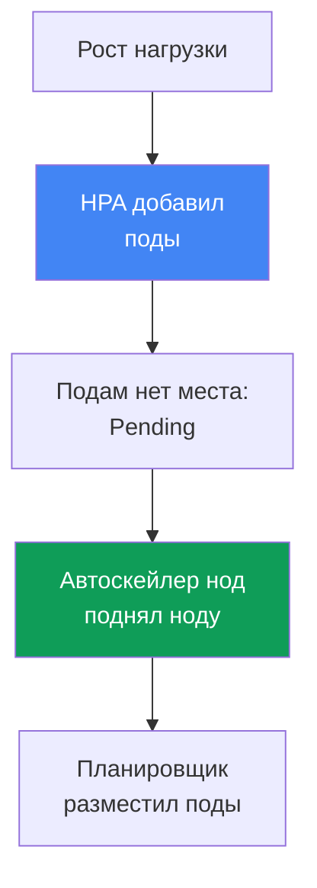
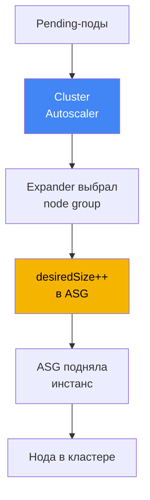
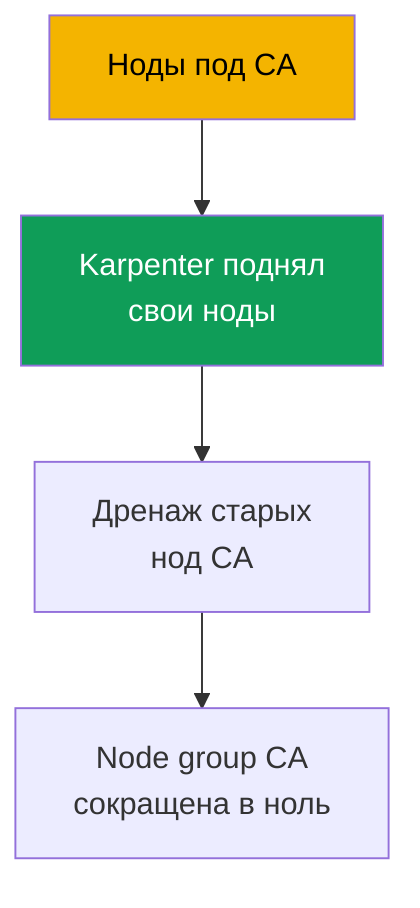

[Eng version](en.md) · [Versión en español](es.md) · [Version française](fr.md) · [Deutsche Version](de.md) · [ქართული ვერსია](ge.md) · [繁體中文版](tw.md) · [日本語版](jp.md)
# Глава 11. Cluster Autoscaler и Karpenter: два подхода к масштабированию нод

> **Что дальше.** Типы вычислений и Auto Mode разобраны (глава 9), AMI и bootstrap нод - глава
> 10. Теперь вопрос: как нод становится больше и меньше под нагрузку без ручного кручения
> `desiredSize`. В EKS для этого два инструмента - Cluster Autoscaler и Karpenter, и эта глава
> о выборе между ними на уровне подхода. Karpenter предметно (NodePool, EC2NodeClass,
> consolidation, drift, disruption budgets) - глава 12, spot-инстансы - глава 13, плотность и
> сайзинг - глава 14, а автомасштабирование самих подов (HPA, VPA, KEDA) - глава 35.

## 11.1. «Поды висят в Pending, а ноды не появляются»

Утренний скачок трафика. HPA честно добавил реплики, но новые поды не запускаются - они висят
в `Pending`. `kubectl describe pod` показывает событие `FailedScheduling`: планировщику некуда
их поставить, на нодах нет свободных ресурсов. Никто не добавляет ноды, потому что этим никто
не управляет: `desiredSize` в Auto Scaling group выставлен руками месяц назад под тогдашнюю
нагрузку.

```bash
kubectl get pods --field-selector status.phase=Pending -A
kubectl describe pod <pod> | grep -A5 Events
```

Зеркальная беда приходит ночью, когда трафик спал: реплик снова мало, а ноды всё те же -
недозагруженные, но включённые, и за них капает счёт за EC2. Ручное управление `desiredSize`
не масштабируется в принципе: угадать заранее нужное число нод нельзя, а держать запас «на
всякий случай» - значит платить за простой круглые сутки.

Нужен механизм, который **сам добавляет ноды, когда подам негде разместиться, и убирает их,
когда ноды пустеют**. В EKS таких механизма два: Cluster Autoscaler и Karpenter. Они решают
одну задачу, но по-разному, и выбор между ними - тема этой главы.

## 11.2. Два уровня автомасштабирования: поды и ноды

Первое, что нужно развести, чтобы дальше не путаться: автомасштабирование в Kubernetes живёт
на **двух разных уровнях**, и это не одно и то же.

- **Уровень подов.** HPA меняет число реплик Deployment, VPA - requests и limits, KEDA
  масштабирует по внешним метрикам. Это масштабирование **нагрузки**, ему посвящена глава 35.
- **Уровень нод.** Cluster Autoscaler и Karpenter меняют число и состав **нод** под кластером.
  Это масштабирование **ёмкости**, и это тема здесь.

Уровни работают в связке и запускают друг друга по цепочке. HPA увидел рост нагрузки и добавил
поды. Подам не хватило места на текущих нодах - они встали в `Pending`. Это сигнал для
автоскейлера нод: он замечает неразмещённые поды и поднимает ноду, куда планировщик их и
ставит. Когда нагрузка спадает, цепочка разворачивается назад: HPA убирает поды, ноды пустеют,
автоскейлер нод их гасит.



Практический вывод: если поды висят в `Pending`, сначала поймите, на каком уровне затык. Не
хватает реплик - вопрос к HPA (глава 35). Реплики есть, но не встают из-за нехватки ресурсов -
вопрос к автоскейлеру нод, то есть к этой главе. Оба уровня нужны вместе: HPA без автоскейлера
нод упрётся в потолок ёмкости, автоскейлер нод без HPA не узнает, что реплик стало больше.

## 11.3. Cluster Autoscaler: масштабирование поверх Auto Scaling groups

Cluster Autoscaler (CA) - классический автоскейлер нод от SIG Autoscaling, тот самый, что
годами идёт с EKS «из коробки». Его модель: он **не создаёт инстансы сам**, а управляет уже
существующими Auto Scaling group. Увидев неразмещённые поды, CA вычисляет, какая node group
их вместит, и увеличивает её `desiredSize`; ASG поднимает инстанс из своего launch template,
нода регистрируется в кластере. При недозагрузке CA наоборот уменьшает `desiredSize`, а ASG
гасит инстанс.



Когда групп несколько и под подходит в разные, CA выбирает через **expander**. Стратегии
проверены по документации автоскейлера: `least-waste` (минимум лишних ресурсов после
размещения, дефолт), `priority` (по заданным вами приоритетам групп), `most-pods` (куда
влезет больше подов), `random`. На AWS чаще всего берут `least-waste` или `priority`.

Ключевое требование к настройке: **node group должна быть однородна по ресурсам**. CA считает,
что все инстансы группы одинаковы по CPU и памяти, и по одному узлу-образцу прикидывает,
поместится ли под. Если смешать в группе `m5.large` и `m5.4xlarge`, расчёт поедет и решения
станут неверными. Отсюда типовой антипаттерн CA - зоопарк из десятка узких групп под каждый
класс нагрузки, который никто целиком не держит в голове.

## 11.4. Ограничения Cluster Autoscaler

CA надёжен и понятен, но его модель «поверх ASG» задаёт границы, о которые спотыкаются на
масштабе:

- **Реакция на уровне группы, а не пода.** CA двигает `desiredSize`, а какой именно инстанс
  поднимется, решает ASG по своему launch template. CA не выбирает тип под конкретный под.
- **Набор типов зафиксирован группами.** Хотите новый класс инстансов - заводите новую node
  group и её launch template. Гибкость упирается в число заранее созданных групп.
- **Скорость.** Между появлением `Pending` и готовой нодой лежит цепочка: CA пересчитал, дёрнул
  ASG, ASG подняла инстанс, нода загрузилась и зарегистрировалась. На практике это заметно
  дольше, чем прямой вызов EC2.
- **Упаковка ограничена.** CA умеет убирать недозагруженные ноды, но не переставляет нагрузку
  ради более плотной укладки на инстансы другого размера - это епархия Karpenter.

Ни один пункт не делает CA непригодным. Они очерчивают, где его модель начинает мешать: много
разнородных нагрузок, требование быстрой реакции, желание тонко подбирать типы инстансов.

## 11.5. Karpenter: инстансы напрямую под неразмещённые поды

Karpenter - автоскейлер нод, изначально созданный в AWS (сейчас часть SIG Autoscaling),
который заходит с другой стороны. Он **не использует Auto Scaling group**. Karpenter следит за
неразмещёнными подами напрямую, читает их требования (requests, nodeSelector, affinity,
topology, toleration) и **создаёт EC2-инстанс под них сам**, вызывая API EC2 без посредника в
виде ASG.

Тип инстанса Karpenter **выбирает сам** из широкого набора, который вы разрешили, подбирая
такой, что подходит под поды и обходится дешевле. Отсюда его сильные стороны по сравнению с CA:

- **Скорость.** Инстанс поднимается прямым вызовом EC2, без промежуточного слоя ASG, поэтому
  от `Pending` до готовой ноды проходит заметно меньше времени.
- **Гибкость типов.** Не нужно заранее нарезать группы под каждый класс - Karpenter берёт
  подходящий тип из разрешённого диапазона под конкретные поды.
- **Consolidation (упаковка).** Karpenter умеет активно уплотнять кластер: заметив, что
  нагрузку можно уложить плотнее, он переносит поды и заменяет ноды на меньшие или убирает
  лишние, снижая простой.
- **Диверсификация для spot.** Karpenter может подбирать много разных типов инстансов сразу,
  что повышает устойчивость spot-нагрузок к прерываниям (spot предметно - глава 13).

Здесь мы намеренно останавливаемся на уровне подхода. Как это настраивается - объекты
`NodePool` и `EC2NodeClass`, политики consolidation, drift и disruption budgets - разбирается
предметно в главе 12. В этой главе Karpenter важен как **подход**, а не как конфигурация.

```bash
kubectl get nodepools
kubectl get nodeclaims
```

## 11.6. Прямое сравнение подходов

Оба инструмента добавляют и убирают ноды под нагрузку, но делают это принципиально по-разному.
Сравнение по осям, которые реально влияют на выбор.

| Ось | Cluster Autoscaler | Karpenter |
|---|---|---|
| Механизм | поверх Auto Scaling group | прямой вызов EC2, без ASG |
| Скорость реакции | медленнее: через слой ASG | быстрее: инстанс напрямую |
| Выбор типа инстанса | фиксирован launch template группы | подбирает сам из диапазона |
| Упаковка / consolidation | только удаление пустых нод | активное уплотнение и замена |
| Spot-диверсификация | в пределах групп | много типов сразу (глава 13) |
| Сложность | node group и их launch template | свои CRD `NodePool`, `EC2NodeClass` |
| Зрелость и охват | давний, работает в разных облаках | AWS-first, зрелый на EKS |

Ось скорости стоит разложить отдельно, потому что на скачках трафика она решает. У Cluster
Autoscaler задержка провижининга складывается из цепочки: цикл опроса CA, пересчёт и вызов
ASG, запуск инстанса самой ASG, загрузка и регистрация ноды. У Karpenter промежуточных шагов
через ASG нет: он реагирует на `Pending` событийно и вызывает EC2 напрямую, поэтому от
`Pending` до готовой ноды проходит ощутимо меньше времени. Плюс Karpenter группирует пачку
`Pending`-подов в одно решение о ёмкости, а не двигает группы по одной.

Важно не читать таблицу как «Karpenter всегда лучше». У CA есть свои ниши:

- **Простые предсказуемые кластеры** с парой однородных групп, где гибкость Karpenter не нужна,
  а привычный CA закрывает задачу без новых CRD.
- **Мультиоблачная унификация.** CA работает у многих провайдеров одним и тем же способом,
  поэтому команде с кластерами в разных облаках он даёт единый инструмент и единый процесс.
- **Существующие инсталляции**, где CA уже стоит, отлажен и не является узким местом: менять
  рабочий механизм только ради моды смысла нет.

Karpenter выигрывает там, где болят именно ограничения CA: разнородные нагрузки, требование
быстрой реакции, тонкий подбор типов и плотная упаковка ради стоимости.

## 11.7. Как это связано с Auto Mode

Важная развилка из главы 9. В **EKS Auto Mode Karpenter уже встроен в сервис** и не виден как
компонент кластера: вы не ставите его через Helm, не обновляете и не видите его пода в
`kube-system`. Логика подбора инстансов, consolidation и обработка событий работают внутри
управляемого режима, а вы влияете на них только через дефолтные и свои `NodePool` (в Auto Mode
дефолтные править нельзя, свои добавлять можно).

```bash
kubectl get pods -n kube-system
```

Отсюда практическое следствие. Если кластер на Auto Mode - у вас уже Karpenter, только скрытый,
и отдельно ставить автоскейлер нод не нужно и нельзя. Если же нужен **свой Karpenter с тонкой
настройкой** (своя политика consolidation, свои disruption budgets, свои `EC2NodeClass`) - это
свой стек: вы ставите и ведёте Karpenter сами на managed или self-managed нодах. Cluster
Autoscaler и самостоятельный Karpenter - это про свой стек; Auto Mode - это Karpenter «под
капотом» без доступа к его внутренностям.

| Сценарий | Чем масштабируются ноды | Кто управляет автоскейлером |
|---|---|---|
| EKS Auto Mode | встроенный Karpenter | AWS, вы задаёте только свои NodePool |
| Свой стек с Karpenter | Karpenter, который вы поставили | вы: CRD, апгрейды, настройка |
| Свой стек с Cluster Autoscaler | CA поверх ваших node group | вы: деплой CA, ASG, expander |

## 11.8. Что выбрать: чеклист

Свести выбор к нескольким вопросам, а не к «что новее».

- **Кластер на Auto Mode?** Тогда автоскейлер уже есть (встроенный Karpenter), вопрос закрыт -
  настраивайте через свои `NodePool`.
- **Новый кластер, свой стек, без сильных ограничений?** Берите **Karpenter**: быстрее,
  гибче по типам, лучше упаковка и spot-диверсификация. Для новых установок на EKS это
  рекомендуемый по умолчанию подход.
- **Нужна унификация с другими облаками одним инструментом?** CA даёт единый способ везде -
  весомый довод остаться на нём.
- **Простой предсказуемый кластер с парой однородных групп?** CA закроет задачу без новых CRD,
  и это нормально.
- **CA уже стоит, отлажен и не мешает?** Не трогайте рабочее только ради смены инструмента;
  мигрируйте, когда упрётесь в его ограничения из раздела 11.4.

Короткий итог: для новых кластеров на EKS по умолчанию рекомендуют Karpenter (или Auto Mode,
где он внутри). Cluster Autoscaler остаётся разумным выбором для существующих инсталляций,
мультиоблачных сценариев и простых предсказуемых кластеров.

## 11.9. Сосуществование и миграция

**Можно ли держать оба сразу.** Технически да, но с осторожностью и **на разных наборах нод**:
CA управляет своими node group, Karpenter - своими `NodePool`, и их зоны ответственности не
должны пересекаться. Если оба будут претендовать на одни и те же ноды, они начнут воевать за
решения о scale-down и мешать друг другу. Такой режим оправдан только как временный на период
миграции, а не как постоянная конструкция.

**Почему обычно мигрируют именно с CA на Karpenter.** Причина не мода, а те же ограничения из
раздела 11.4: на масштабе накапливается зоопарк node group, растёт простой из-за слабой
упаковки, реакция на скачки медленная. Karpenter снимает эти боли, поэтому направление
миграции почти всегда одностороннее.

**Принцип миграции - через новые ноды, а не на лету.** Существующие поды не переносят на живой
ноде под другим автоскейлером. Karpenter поднимает свои ноды рядом, нагрузку постепенно
переводят на них (например, кордоня и дренируя старые ноды CA), а node group под управлением CA
сокращают до нуля и убирают, когда на них не осталось нагрузки. Так исключается момент, когда
за одну ноду отвечают оба механизма.

**Поэтапный план (CA -> Karpenter v1).**

1. Ставят Karpenter v1 рядом с работающим CA и разводят зоны: свои `NodePool` у Karpenter,
   свои node group у CA, без пересечения (фаза сосуществования).
2. Новые и некритичные нагрузки направляют на ноды Karpenter, проверяют, что провижининг и
   consolidation ведут себя как надо.
3. Старые ноды CA постепенно кордонят и дренируют, поды переезжают на ноды Karpenter.
4. Node group под CA сокращают до нуля, затем снимают сам Cluster Autoscaler и его IAM-роли.



**Как прикрыть чувствительные нагрузки на время обкатки.** Пока Karpenter проверяют на первых
подах, от незапланированного списания ноды защищает аннотация пода
`karpenter.sh/do-not-disrupt: "true"` (в старом API она называлась
`karpenter.sh/do-not-evict`). Важно понимать её охват: аннотация держит **всю ноду**, где живёт
под, и тормозит любые добровольные прерывания, включая обновление по drift. Поэтому на
время миграции её ставят точечно, на конкретные поды, и снимают, когда нагрузка обкатана,
иначе вместе с консолидацией встанет и обновление AMI (глава 12).

Детали конфигурации Karpenter, которые понадобятся при миграции (`NodePool`, `EC2NodeClass`,
consolidation, disruption budgets), - в главе 12. Здесь важен принцип: миграция идёт
переводом нагрузки на новые ноды, а не переключением автоскейлера под работающими подами.

## 11.10. Как это применяют в продакшене

- **Разводят два уровня автомасштабирования явно.** Прежде чем чинить `Pending`, определяют,
  затык на уровне подов (HPA, глава 35) или на уровне нод (эта глава), - лечение разное.
- **Для новых кластеров на EKS берут Karpenter или Auto Mode**, где он встроен, а Cluster
  Autoscaler оставляют для существующих инсталляций и мультиоблачных сценариев.
- **Node group под Cluster Autoscaler держат однородными по ресурсам**, иначе расчёт CA по
  узлу-образцу врёт и решения о масштабировании становятся неверными.
- **Не запускают CA и Karpenter на одни и те же ноды.** Если оба нужны на время миграции,
  жёстко разделяют их зоны: свои node group у CA, свои `NodePool` у Karpenter.
- **Миграцию ведут через новые ноды**, а не переключением автоскейлера на лету: Karpenter
  поднимает свои ноды, нагрузку переводят дренажом, группы CA сокращают до нуля.
- **Выбор инструмента фиксируют осознанно** по чеклисту 11.8, а не по новизне: у CA есть свои
  ниши, и рабочий отлаженный CA не меняют только ради смены инструмента.

## 11.11. Мини-глоссарий

- **Cluster Autoscaler (CA)** - автоскейлер нод, работающий поверх Auto Scaling group: меняет
  `desiredSize` групп по неразмещённым подам и недозагрузке. Типы инстансов фиксированы launch
  template групп.
- **Karpenter** - автоскейлер нод, создающий EC2-инстансы напрямую под конкретные
  неразмещённые поды, сам подбирающий тип из разрешённого диапазона. Настройка - глава 12.
- **Expander** - стратегия Cluster Autoscaler для выбора node group, когда под подходит в
  несколько: `least-waste` (дефолт), `priority`, `most-pods`, `random`.
- **Consolidation** - активное уплотнение кластера в Karpenter: перенос подов и замена нод на
  меньшие или удаление лишних ради снижения простоя (предметно - глава 12).
- **Масштабирование нод против масштабирования подов** - разные уровни: ноды масштабируют CA и
  Karpenter (эта глава), поды - HPA, VPA, KEDA (глава 35).

## 11.12. Итоги главы

- Автомасштабирование живёт на двух уровнях: поды масштабируют HPA, VPA, KEDA (глава 35), ноды
  - Cluster Autoscaler и Karpenter (эта глава). Уровни связаны цепочкой Pending -> новая нода.
- Cluster Autoscaler работает поверх Auto Scaling group: крутит `desiredSize`, выбирает группу
  через expander, требует однородных групп. Типы инстансов заданы их launch template.
- Ограничения CA: реакция на уровне группы, фиксированный группами набор типов, медленнее из-за
  слоя ASG, упаковка ограничена удалением пустых нод.
- Karpenter создаёт инстансы напрямую под неразмещённые поды, сам подбирает тип, работает
  быстрее, умеет consolidation и диверсификацию типов для spot. Конфигурация - глава 12.
- Karpenter не «всегда лучше»: у CA остаются ниши - простые предсказуемые кластеры,
  мультиоблачная унификация, отлаженные существующие инсталляции.
- В Auto Mode Karpenter встроен в сервис и не виден как компонент; свой Karpenter с тонкой
  настройкой - это свой стек, который вы ведёте сами.
- Держать оба автоскейлера сразу можно только на разных наборах нод и как временную меру;
  мигрируют обычно с CA на Karpenter и через новые ноды, а не переключением на лету.

## 11.13. Как это пригодится в реальной работе

На дежурстве самый частый сценарий - поды в `Pending`, и первое решение здесь диагностическое:
понять уровень. `kubectl describe pod` с событием `FailedScheduling` из-за нехватки ресурсов
говорит, что вопрос к автоскейлеру нод, а не к HPA. Дальше вы смотрите, каким механизмом
кластер вообще масштабирует ноды: есть `NodePool` и `nodeclaims` - это Karpenter (свой или
внутри Auto Mode), есть node group и под CA в `kube-system` - это Cluster Autoscaler. От
ответа зависит, где искать причину: в expander и лимитах ASG или в `NodePool` и его лимитах.

При планировании эта глава помогает не тащить в новый кластер привычный CA по инерции и,
наоборот, не ломать рабочий CA в существующем ради Karpenter без причины. Выбор фиксируют по
чеклисту, а миграцию, если она нужна, планируют через новые ноды с постепенным дренажом старых,
а не как переключение автоскейлера под работающей нагрузкой.

## 11.14. Вопросы для самопроверки

1. Чем масштабирование нод отличается от масштабирования подов и как эти уровни связаны?
2. По какому симптому в `kubectl` понять, что затык именно на уровне нод, а не HPA?
3. Как Cluster Autoscaler добавляет ноду и почему он не выбирает тип инстанса под каждый под?
4. Что делает expander и какие стратегии у него есть?
5. Почему node group под Cluster Autoscaler должна быть однородна по ресурсам?
6. Перечислите ключевые ограничения Cluster Autoscaler на масштабе.
7. Чем принципиально отличается модель Karpenter от модели Cluster Autoscaler?
8. Что такое consolidation и почему у Cluster Autoscaler такой возможности по сути нет?
9. В каких нишах Cluster Autoscaler остаётся разумным выбором?
10. Как связан Karpenter с EKS Auto Mode и когда нужен свой Karpenter?
11. Можно ли держать CA и Karpenter одновременно и при каких условиях?
12. Почему миграцию ведут через новые ноды, а не переключением автоскейлера на лету?

## Практика

Лабы у главы пока нет, но подход к масштабированию нод видно на живом кластере. Начните
с того, каким механизмом он вообще масштабируется: `kubectl get pods -n kube-system` покажет,
есть ли под Cluster Autoscaler, а `kubectl get nodepools` и `kubectl get nodeclaims` - работает
ли Karpenter (в том числе внутри Auto Mode). Наличие одного из них сразу задаёт, какой из двух
подходов у вас перед глазами.

Дальше воспроизведите диагностику из раздела 11.1 без вреда для кластера. Посмотрите, есть ли
сейчас неразмещённые поды: `kubectl get pods --field-selector status.phase=Pending -A`. Если
есть, `kubectl describe pod <pod>` и события `FailedScheduling` подскажут, ждут ли они ёмкости.
Пройдите по чеклисту 11.8 для своего кластера и честно ответьте: подход, который у вас стоит, -
осознанный выбор под ваши нагрузки или наследство, которое пора пересмотреть в пользу Karpenter
либо, наоборот, оставить как есть.

---
[Оглавление](../README_RU.md) · [Глава 10](../10/ru.md) · [Глава 12](../12/ru.md)
