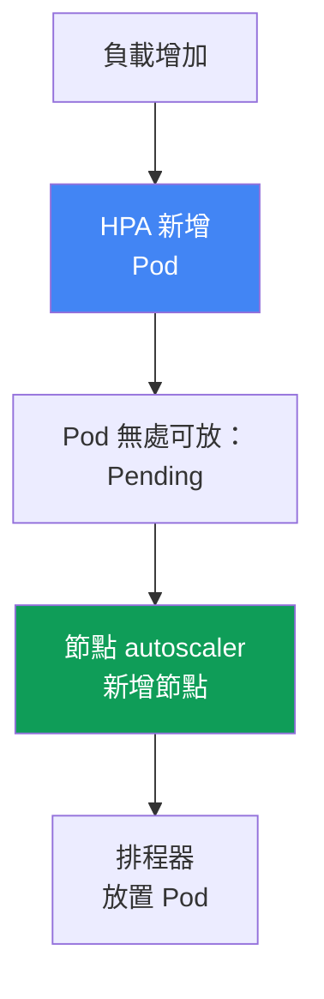
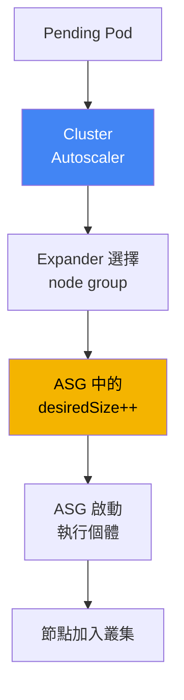
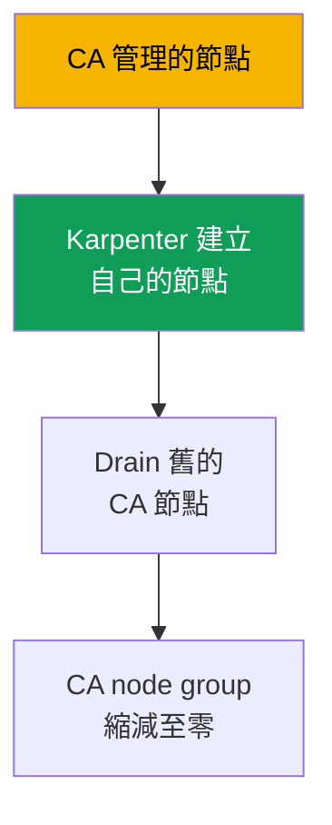

[Русская версия](ru.md) · [Eng version](en.md) · [Versión en español](es.md) · [Version française](fr.md) · [Deutsche Version](de.md) · [ქართული ვერსია](ge.md) · [日本語版](jp.md)
# 第 11 章：Cluster Autoscaler 與 Karpenter：兩種節點擴展方法

> **接下來。** 計算類型與 Auto Mode 已在第 9 章說明，節點 AMI 與 bootstrap 見第 10 章。現在的問題是：負載增加或減少時，無須手動調整 `desiredSize`，節點要如何隨之增減？EKS 有兩個工具可處理此事：Cluster Autoscaler 與 Karpenter；本章從方法論層面說明如何在兩者之間選擇。Karpenter 的具體內容（NodePool、EC2NodeClass、consolidation、drift、disruption budgets）請見第 12 章，spot 執行個體見第 13 章，密度與 sizing 見第 14 章，而 Pod 本身的自動擴展（HPA、VPA、KEDA）見第 35 章。

## 11.1.「Pod 卡在 Pending，但節點沒有出現」

早晨流量突然上升。HPA 確實增加了副本，但新的 Pod 沒有啟動，而是卡在 `Pending`。`kubectl describe pod` 顯示 `FailedScheduling` 事件：排程器無處可放置它們，節點沒有可用資源。也沒有人新增節點，因為沒有人管理這件事：Auto Scaling group 的 `desiredSize` 是一個月前依當時負載手動設定的。

```bash
kubectl get pods --field-selector status.phase=Pending -A
kubectl describe pod <pod> | grep -A5 Events
```

相反的問題會在夜間、流量降低時出現：副本又變少了，但節點數仍相同----使用率不足卻持續運行，EC2 費用也持續累積。手動管理 `desiredSize` 本質上無法擴展：不可能預先猜對所需節點數，而保留「以防萬一」的餘裕，就代表全天候為閒置付費。

需要一種機制，能夠**在 Pod 無處安置時自行新增節點，並在節點變空時移除它們**。EKS 有兩種機制：Cluster Autoscaler 與 Karpenter。兩者解決相同問題，但方法不同；如何選擇正是本章主題。

## 11.2. 兩個自動擴展層級：Pod 與節點

首先必須釐清、以免後續混淆：Kubernetes 的自動擴展存在於**兩個不同層級**，兩者並不是同一件事。

- **Pod 層級。** HPA 變更 Deployment 的副本數，VPA 變更 requests 與 limits，KEDA 依外部指標擴展。這是**負載**擴展，第 35 章會介紹。
- **節點層級。** Cluster Autoscaler 與 Karpenter 變更叢集底層**節點**的數量與組成。這是**容量**擴展，也是本章主題。

兩個層級會協同運作，並以鏈條方式互相觸發。HPA 發現負載上升並增加 Pod。現有節點沒有足夠空間，Pod 因而處於 `Pending`。這就是節點 autoscaler 的訊號：它注意到無法排程的 Pod，並建立節點，排程器便會將它們放上去。負載下降時，鏈條反向運作：HPA 移除 Pod，節點變空，節點 autoscaler 將其關閉。



實務結論是：Pod 卡在 `Pending` 時，先了解瓶頸在哪個層級。副本不足是 HPA 的問題（第 35 章）；副本已存在但因資源不足無法放置，則是節點 autoscaler 的問題，也就是本章內容。兩個層級都不可或缺：沒有節點 autoscaler 的 HPA 會撞上容量上限；沒有 HPA 的節點 autoscaler 不會知道副本已增加。

## 11.3. Cluster Autoscaler：在 Auto Scaling groups 上進行擴展

Cluster Autoscaler（CA）是 SIG Autoscaling 提供的經典節點 autoscaler，也是多年來 EKS「開箱即用」的選擇。它的模型是：它**不自行建立執行個體**，而是管理既有的 Auto Scaling group。偵測到無法排程的 Pod 後，CA 計算哪個 node group 能容納它們，並增加其 `desiredSize`；ASG 從自己的 launch template 啟動執行個體，節點隨後註冊至叢集。使用率不足時，CA 則降低 `desiredSize`，ASG 會關閉執行個體。



當有多個群組且 Pod 可放入其中任一群組時，CA 透過 **expander** 選擇。autoscaler 文件中列出的策略為：`least-waste`（放置後剩餘資源最少，預設）、`priority`（依您指定的群組優先順序）、`most-pods`（可容納最多 Pod 者）、`random`。AWS 上最常使用 `least-waste` 或 `priority`。

設定的關鍵要求是：**node group 的資源必須同質**。CA 假設群組中所有執行個體的 CPU 與記憶體相同，並用一個範例節點估算 Pod 是否放得下。若在同一群組混用 `m5.large` 與 `m5.4xlarge`，計算就會失準，決策也會不正確。因此 CA 常見的反模式，是針對每種負載類別建立十多個狹窄群組，卻沒有人能完整掌握它們。

## 11.4. Cluster Autoscaler 的限制

CA 可靠且容易理解，但其「建立在 ASG 之上」的模型，劃定了會在規模擴大時遇到的邊界：

- **以群組為單位反應，而非以 Pod 為單位。** CA 調整 `desiredSize`，但實際啟動哪種執行個體由 ASG 的 launch template 決定。CA 不會為特定 Pod 選擇類型。
- **類型集合由群組固定。** 想要新執行個體類別，就要建立新的 node group 與其 launch template。彈性受限於預先建立的群組數量。
- **速度。** 從 `Pending` 出現到節點就緒，中間需經過：CA 重新計算、呼叫 ASG、ASG 啟動執行個體、節點開機並註冊。實務上，這比直接呼叫 EC2 明顯更久。
- **封裝能力有限。** CA 能移除使用率不足的節點，卻不會為了用不同大小的執行個體達成更緊密配置而重新安置負載----這是 Karpenter 的領域。

以上各點都不代表 CA 不適用。它們描述的是何時其模型開始形成阻礙：大量異質負載、需要快速反應，或希望細緻選擇執行個體類型時。

## 11.5. Karpenter：直接為無法排程的 Pod 建立執行個體

Karpenter 是最初由 AWS 建立（現在是 SIG Autoscaling 一部分）的節點 autoscaler，採取不同方法。它**不使用 Auto Scaling group**。Karpenter 直接監看無法排程的 Pod，讀取其需求（requests、nodeSelector、affinity、topology、toleration），並**自行為其建立 EC2 執行個體**，透過 EC2 API 呼叫而非 ASG 中介層。

Karpenter **自行選擇**您允許之廣泛集合中的執行個體類型，找出既符合 Pod 又成本較低的選項。因此，相較於 CA，它具備以下優點：

- **速度。** 執行個體經由直接 EC2 呼叫啟動，沒有中間 ASG 層，因此從 `Pending` 到節點就緒所需時間明顯較短。
- **類型彈性。** 無須預先為每種類別切分群組；Karpenter 會從允許範圍中挑選適合特定 Pod 的類型。
- **Consolidation（整併）。** Karpenter 可主動壓縮叢集：發現負載可更緊密配置時，它會搬移 Pod，並將節點替換為較小節點或移除多餘節點，以降低閒置。
- **spot 多樣化。** Karpenter 可以同時選擇許多不同的執行個體類型，進而提高 spot 負載面對中斷時的韌性（spot 詳見第 13 章）。

此處刻意只停留在方法層級。如何設定----`NodePool` 與 `EC2NodeClass` 物件、consolidation 政策、drift 與 disruption budgets----將在第 12 章具體說明。本章中，Karpenter 重要的是作為一種**方法**，而非一份設定。

```bash
kubectl get nodepools
kubectl get nodeclaims
```

## 11.6. 方法的直接比較

兩個工具都會依負載新增與移除節點，但其做法根本不同。以下依實際影響選擇的面向比較。

| 面向 | Cluster Autoscaler | Karpenter |
|---|---|---|
| 機制 | 建立在 Auto Scaling group 上 | 直接呼叫 EC2，無 ASG |
| 反應速度 | 較慢：經由 ASG 層 | 較快：直接建立執行個體 |
| 執行個體類型選擇 | 由群組 launch template 固定 | 自行從範圍中挑選 |
| 封裝 / consolidation | 僅移除空節點 | 主動整併與替換 |
| Spot 多樣化 | 限於群組內 | 同時使用多種類型（第 13 章） |
| 複雜度 | node group 與其 launch template | 自有 CRD `NodePool`、`EC2NodeClass` |
| 成熟度與涵蓋範圍 | 歷史悠久，適用不同雲端 | AWS-first，在 EKS 上成熟 |

速度這個面向值得單獨展開，因為它會決定流量尖峰的成敗。Cluster Autoscaler 的佈建延遲由多個環節組成：CA 輪詢週期、重新計算及呼叫 ASG、ASG 自行啟動執行個體、節點開機與註冊。Karpenter 沒有經過 ASG 的中間步驟：它以事件方式對 `Pending` 反應並直接呼叫 EC2，因此從 `Pending` 至節點就緒的時間明顯較短。此外，Karpenter 將一批 `Pending` Pod 聚合為單一容量決策，而不是逐一調整群組。

請勿將表格解讀為「Karpenter 永遠更好」。CA 仍有自己的適用場景：

- **簡單、可預測的叢集**，只有幾個同質群組，不需要 Karpenter 的彈性，熟悉的 CA 無須新增 CRD 即可完成工作。
- **多雲統一化。** CA 在許多供應商上以相同方式運作，因此擁有不同雲端叢集的團隊可以使用單一工具與單一流程。
- **既有安裝。** CA 已部署、調校完成且不是瓶頸時，僅為追隨潮流而替換運作正常的機制沒有意義。

Karpenter 在 CA 的限制真正造成痛點時勝出：異質負載、需要快速反應、細緻類型選擇，以及為成本而進行緊密封裝。

## 11.7. 與 Auto Mode 的關係

這是第 9 章的重要分岔。在 **EKS Auto Mode 中，Karpenter 已內建於服務**，不會以叢集元件的形式出現：您不透過 Helm 安裝或更新它，也不會在 `kube-system` 看到它的 Pod。執行個體選擇、consolidation 與事件處理邏輯均在受管模式內運作；您只能透過預設及自己的 `NodePool` 影響它們（Auto Mode 的預設項目不能修改，但可以新增自己的項目）。

```bash
kubectl get pods -n kube-system
```

由此產生實務結果。若叢集使用 Auto Mode，您已有 Karpenter，只是它被隱藏；不需要也不能另行安裝節點 autoscaler。若您需要**自行管理、可精細調校的 Karpenter**（自己的 consolidation 政策、disruption budgets、`EC2NodeClass`），則是另一套堆疊：您在 managed 或 self-managed 節點上自行安裝與維護 Karpenter。Cluster Autoscaler 與自行管理的 Karpenter 屬於自建堆疊；Auto Mode 則是「引擎蓋下」的 Karpenter，沒有其內部存取權。

| 情境 | 節點如何擴展 | 誰管理 autoscaler |
|---|---|---|
| EKS Auto Mode | 內建 Karpenter | AWS；您只定義自己的 NodePool |
| 使用 Karpenter 的自建堆疊 | 您安裝的 Karpenter | 您：CRD、升級、設定 |
| 使用 Cluster Autoscaler 的自建堆疊 | 建立在您的 node group 上的 CA | 您：部署 CA、ASG、expander |

## 11.8. 如何選擇：檢查清單

將選擇化為幾個問題，而不是問「哪個較新」。

- **叢集使用 Auto Mode？** autoscaler 已存在（內建 Karpenter），問題已解決----請透過自己的 `NodePool` 設定。
- **新叢集、自建堆疊、沒有強烈限制？** 選擇 **Karpenter**：類型更快、更有彈性，封裝與 spot 多樣化更好。對 EKS 新部署而言，這是建議的預設方法。
- **需要以單一工具統一其他雲端？** CA 在任何地方都提供一致方式----這是繼續使用它的有力理由。
- **具備幾個同質群組的簡單、可預測叢集？** CA 不必新增 CRD 便能完成工作，這完全沒問題。
- **CA 已部署、調校完成且不造成阻礙？** 不要只為更換工具而動到正常運作的系統；當您碰上 11.4 節所述限制時再遷移。

簡短結論：對 EKS 新叢集，預設建議使用 Karpenter（或內含它的 Auto Mode）。Cluster Autoscaler 對既有安裝、多雲情境及簡單可預測的叢集，仍是合理選擇。

## 11.9. 共存與遷移

**能否同時保留兩者。** 技術上可以，但要小心，且必須管理**不同的節點集合**：CA 管理自己的 node group，Karpenter 管理自己的 `NodePool`，職責範圍不得重疊。若兩者都嘗試管理相同節點，便會在 scale-down 決策上互相競爭與干擾。此模式只適合作為遷移期間的暫時方案，而非常設架構。

**為何通常從 CA 遷移至 Karpenter。** 原因不是潮流，而是 11.4 節的相同限制：規模增加時，node group 的動物園逐漸累積；封裝不足導致閒置增加；面對尖峰反應太慢。Karpenter 能解除這些痛點，因此遷移方向幾乎總是單向的。

**遷移原則：經由新節點，而非直接切換。** 既有 Pod 不會在仍運行的節點上直接切換到另一個 autoscaler。Karpenter 會在旁建立自己的節點，負載逐步移過去（例如 cordon 並 drain 舊的 CA 節點）；當 CA 管理的 node group 上已沒有負載時，便將它們縮減至零並移除。這能避免同一節點同時由兩種機制負責的時刻。

**分階段計畫（CA -> Karpenter v1）。**

1. 在運作中的 CA 旁部署 Karpenter v1，並分隔職責範圍：Karpenter 使用自己的 `NodePool`，CA 使用自己的 node group，互不重疊（共存階段）。
2. 將新的非關鍵負載導向 Karpenter 節點，驗證佈建與 consolidation 是否符合預期。
3. 逐步 cordon 與 drain 舊 CA 節點，Pod 會遷移至 Karpenter 節點。
4. 將 CA 的 node group 縮減至零，再移除 Cluster Autoscaler 本身及其 IAM roles。



**在驗證期間如何保護敏感負載。** 在 Karpenter 首批 Pod 上接受驗證時，Pod 註解 `karpenter.sh/do-not-disrupt: "true"` 可防止節點遭到非計畫性淘汰（舊 API 名稱為 `karpenter.sh/do-not-evict`）。務必理解其範圍：此註解會保留**整個節點**，也就是該 Pod 所在的節點，並阻止所有自願性中斷，包括 drift 更新。因此遷移期間應僅精準加在特定 Pod 上，負載驗證完成就移除；否則 consolidation 與 AMI 更新（第 12 章）都會停滯。

遷移時所需的 Karpenter 設定細節（`NodePool`、`EC2NodeClass`、consolidation、disruption budgets）請見第 12 章。此處的關鍵原則是：遷移是將負載移至新節點，而不是在運行中的 Pod 下切換 autoscaler。

## 11.10. 在生產環境中的應用方式

- **明確區分兩個自動擴展層級。** 修正 `Pending` 前，先判斷問題在 Pod 層級（HPA，第 35 章）或節點層級（本章）；處置不同。
- **EKS 新叢集使用 Karpenter 或內建它的 Auto Mode**，Cluster Autoscaler 留給既有安裝與多雲情境。
- **Cluster Autoscaler 的 node group 必須維持資源同質性**，否則 CA 的範例節點計算會失準，擴展決策也會錯誤。
- **不要讓 CA 與 Karpenter 管理相同節點。** 若遷移期間需要兩者，嚴格分隔責任範圍：CA 使用自己的 node group，Karpenter 使用自己的 `NodePool`。
- **經由新節點遷移**，而不是即時切換 autoscaler：Karpenter 建立自己的節點，透過 drain 遷移負載，再將 CA 群組縮減至零。
- **依 11.8 節檢查清單有意識地決定工具**，而非依新舊判斷：CA 有其適用場景，正常且調校完成的 CA 不應只為了換工具而被替換。

## 11.11. 迷你詞彙表

- **Cluster Autoscaler（CA）**：建立在 Auto Scaling group 之上的節點 autoscaler；依無法排程的 Pod 與使用率不足調整群組 `desiredSize`。執行個體類型由群組 launch template 固定。
- **Karpenter**：直接為特定無法排程的 Pod 建立 EC2 執行個體的節點 autoscaler，自行從允許範圍選擇類型。設定見第 12 章。
- **Expander**：當 Pod 可放入多個 node group 時，Cluster Autoscaler 用來選擇群組的策略：`least-waste`（預設）、`priority`、`most-pods`、`random`。
- **Consolidation**：Karpenter 的主動叢集整併：搬移 Pod，並將節點替換為較小節點或移除多餘節點，以降低閒置（詳見第 12 章）。
- **節點擴展與 Pod 擴展**：不同層級：CA 與 Karpenter 擴展節點（本章），HPA、VPA、KEDA 擴展 Pod（第 35 章）。

## 11.12. 本章摘要

- 自動擴展存在兩個層級：HPA、VPA、KEDA 擴展 Pod（第 35 章）；Cluster Autoscaler 與 Karpenter 擴展節點（本章）。兩層由 Pending -> 新節點的鏈條相連。
- Cluster Autoscaler 建立在 Auto Scaling group 上：它調整 `desiredSize`、透過 expander 選擇群組，並要求群組同質。執行個體類型由其 launch template 決定。
- CA 的限制包括：以群組層級反應、類型集合由群組固定、因 ASG 層而較慢，且封裝僅限於移除空節點。
- Karpenter 直接為無法排程的 Pod 建立執行個體，自行選擇類型、運作更快，並支援 consolidation 與 spot 的類型多樣化。設定見第 12 章。
- Karpenter 並非「永遠更好」：CA 對簡單可預測的叢集、多雲統一化與調校完成的既有安裝，仍有適用場景。
- Auto Mode 將 Karpenter 內建於服務且不顯示為元件；需精細設定的自有 Karpenter 則是您自行維護的堆疊。
- 同時保留兩種 autoscaler，只能管理不同節點集合且應為暫時措施；通常從 CA 遷移至 Karpenter，並經由新節點而非即時切換進行。

## 11.13. 在實務工作中的用處

值班時最常見的情境是 Pod 處於 `Pending`，而第一個決定是診斷性的：判斷層級。`kubectl describe pod` 中因資源不足而出現的 `FailedScheduling` 事件，表示問題屬於節點 autoscaler，而非 HPA。接著查看叢集實際以何種機制擴展節點：存在 `NodePool` 與 `nodeclaims` 就是 Karpenter（自行管理或 Auto Mode 內建）；存在 node group 與 `kube-system` 中的 CA Pod，則是 Cluster Autoscaler。答案決定排查位置：是 expander 與 ASG 限制，還是 `NodePool` 及其限制。

在規劃時，本章可避免因慣性將熟悉的 CA 帶進新叢集，也避免無故為了 Karpenter 破壞現有可用的 CA。應依檢查清單記錄選擇；若需要遷移，便規劃透過新節點逐步 drain 舊節點，而不是在運行中的負載下切換 autoscaler。

## 11.14. 自我檢查問題

1. 節點擴展與 Pod 擴展有何不同？這兩個層級如何相連？
2. 在 `kubectl` 中，根據何種症狀可判斷瓶頸位於節點層級而非 HPA？
3. Cluster Autoscaler 如何新增節點？為何它不會為每個 Pod 選擇執行個體類型？
4. expander 的作用是什麼？有哪些策略？
5. 為何 Cluster Autoscaler 的 node group 必須在資源上保持同質？
6. 請列出 Cluster Autoscaler 在規模擴大時的主要限制。
7. Karpenter 的模型與 Cluster Autoscaler 有何根本差異？
8. 什麼是 consolidation？為何 Cluster Autoscaler 本質上沒有此能力？
9. Cluster Autoscaler 在哪些適用場景中仍是合理選擇？
10. Karpenter 與 EKS Auto Mode 如何相關？何時需要自行管理的 Karpenter？
11. 能否同時保留 CA 與 Karpenter？條件是什麼？
12. 為何遷移必須經由新節點，而不是即時切換 autoscaler？

## 實作練習

本章尚無 lab，但節點擴展方法可以在實際叢集上觀察。首先確認叢集以何種機制擴展：`kubectl get pods -n kube-system` 可檢視是否存在 Cluster Autoscaler 的 Pod，而 `kubectl get nodepools` 與 `kubectl get nodeclaims` 則顯示 Karpenter 是否運作中（包括 Auto Mode 內建的情況）。任一者的存在，立即就能判別您正使用兩種方法中的哪一種。

接著在不損害叢集的前提下，重現 11.1 節的診斷。檢查目前是否有無法排程的 Pod：`kubectl get pods --field-selector status.phase=Pending -A`。若有，`kubectl describe pod <pod>` 與 `FailedScheduling` 事件會提示它們是否正在等待容量。針對您的叢集走過 11.8 節的檢查清單，並誠實回答：目前使用的方法是針對您的負載所做的有意識選擇，還是值得重新考慮改用 Karpenter 的歷史遺留，又或者應該維持不變。

---
[目錄](../README_TW.md) · [第 10 章](../10/tw.md) · [第 12 章](../12/tw.md)
