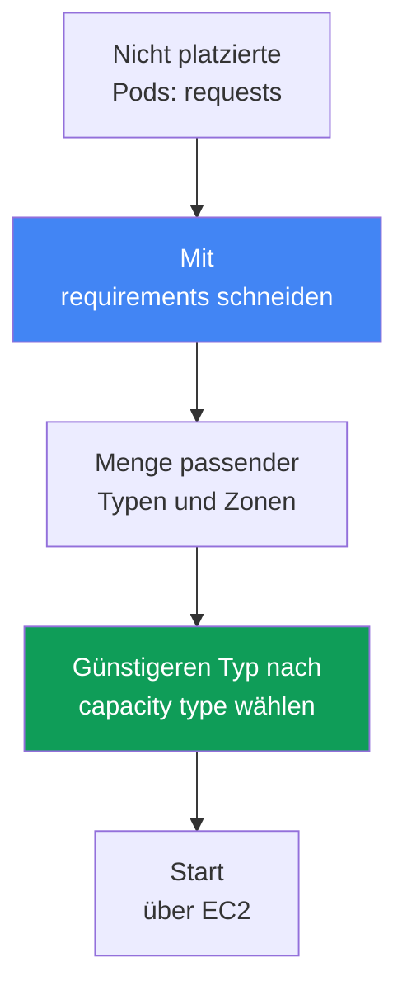
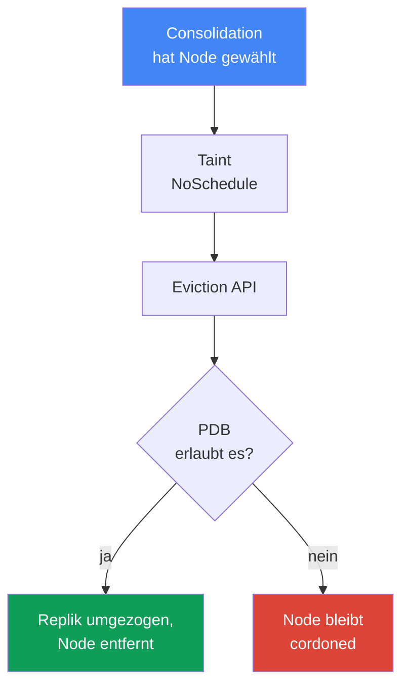

[Русская версия](ru.md) · [Eng version](en.md) · [Versión en español](es.md) · [Version française](fr.md) · [ქართული ვერსია](ge.md) · [繁體中文版](tw.md) · [日本語版](jp.md)

# Kapitel 12. Karpenter: NodePool, EC2NodeClass, Disruption, Consolidation, Drift

> **Wie es weitergeht.** Kapitel 11 behandelte die Wahl zwischen Cluster Autoscaler und Karpenter auf Ebene des Ansatzes sowie die Verbindung von Karpenter mit Auto Mode. Hier geht es um die konkrete Konfiguration: die Objekte `NodePool` und `EC2NodeClass`, wie Karpenter eine Instance auswählt und vor allem um Disruption: Consolidation, Drift und die sichere Eviction von Workloads einschließlich StatefulSets. Spot wird in Kapitel 13 konkret behandelt, AMI und Bootstrap in Kapitel 10, EBS-Volumes und die Bindung an eine AZ in Kapitel 23, Sizing in Kapitel 14 und das Cluster-Upgrade in Kapitel 38.

## 12.1. „Consolidation hat ein StatefulSet zum Absturz gebracht“ und „Nodes werden nicht aktualisiert“

Karpenter ist aktiviert, Nodes werden passend zur Last gestartet – auf den ersten Blick funktioniert alles. Dann tritt eines von zwei Problemen ein, beide mit derselben Ursache.

Im ersten Szenario ist der Traffic gesunken, Karpenter verdichtet den Cluster und evicted Pods von unterausgelasteten Nodes. Dabei erreicht er eine Datenbankreplik eines StatefulSets – diese zieht zusammen mit der Node um, verliert lokale Daten oder unterbricht das Quorum. Im zweiten, spiegelbildlichen Szenario ist ein neues AMI mit geschlossenen CVEs erschienen; die Nodes müssten aktualisiert werden, ändern sich aber wochenlang nicht, und was ihren Ersatz blockiert, ist unklar.

```bash
kubectl get nodeclaims
kubectl logs -n kube-system -l app.kubernetes.io/name=karpenter | grep -i disrupt
```

Beide Fälle betreffen die Art, wie Karpenter Nodes erstellt und entfernt: Eine Node zu starten genügt nicht; ihr Ersatz und ihre Entfernung dürfen weder Workloads zum Absturz bringen noch dauerhaft hängen bleiben. Darum geht es in diesem Kapitel.

## 12.2. NodePool: Rahmen für erstellte Nodes

Ein `NodePool` beschreibt die Grenzen, innerhalb derer Karpenter Nodes erstellen darf, sowie die Regeln für ihren Lebenszyklus. Ohne mindestens einen `NodePool` tut Karpenter nichts. Die wichtigsten Teile:

- `template.spec.requirements` – erlaubte Typen, Zonen, Architekturen und Capacity Types über well-known labels (`karpenter.k8s.aws/instance-category`, `kubernetes.io/arch`, `topology.kubernetes.io/zone`, `karpenter.sh/capacity-type`).
- `template.metadata.labels` und `template.spec.taints` – Labels und Taints für erstellte Nodes.
- `template.spec.nodeClassRef` – Referenz auf `EC2NodeClass`; `disruption` – Richtlinie für Verdichtung und Budgets (Abschnitt 12.5); `limits` – Obergrenze des Pools; `weight` – Priorität des Pools (höheres Gewicht wird früher berücksichtigt).

```yaml
apiVersion: karpenter.sh/v1
kind: NodePool
metadata:
  name: default
spec:
  template:
    spec:
      nodeClassRef:
        group: karpenter.k8s.aws
        kind: EC2NodeClass
        name: default
      requirements:
        - key: kubernetes.io/arch
          operator: In
          values: ["amd64"]
        - key: karpenter.k8s.aws/instance-category
          operator: In
          values: ["c", "m", "r"]
        - key: karpenter.sh/capacity-type
          operator: In
          values: ["spot", "on-demand"]
      expireAfter: 720h
  disruption:
    consolidationPolicy: WhenEmptyOrUnderutilized
    consolidateAfter: 1m
```

Die Dokumentation empfiehlt, `requirements` nicht stärker als nötig einzuengen. Je breiter die Menge der Typen, desto flexibler das Placement der Pods und desto resilienter Spot-Workloads (Kapitel 13).

## 12.3. EC2NodeClass: AWS-spezifische Eigenschaften der Node

`EC2NodeClass` beschreibt, was sich speziell auf AWS bezieht. Jeder `NodePool` verweist auf eine Klasse; mehrere Pools können sich eine Klasse teilen. Konfiguriert werden:

- `amiFamily` – Image-Familie (`AL2023`, `Bottlerocket`, `AL2`, `Custom`): Bootstrap-Logik und standardmäßige Block-Device-Mappings; Details zu Images stehen in Kapitel 10.
- `amiSelectorTerms` – welche AMIs verwendet werden: per `alias` (`al2023@latest`), `id`, `name`, `tags` (Pflichtfeld). `role` oder `instanceProfile` – die IAM-Identität der Node (eines von beiden).
- `subnetSelectorTerms`, `securityGroupSelectorTerms` – Subnetze und SG nach Tags oder ID (innerhalb eines Terms gelten Bedingungen per AND, unterschiedliche Terms per OR).
- `blockDeviceMappings` – Disks; `metadataOptions` – IMDS, standardmäßig `httpTokens: required` (IMDSv2) und `httpPutResponseHopLimit: 1` (Hardening – Kapitel 19).

```yaml
apiVersion: karpenter.k8s.aws/v1
kind: EC2NodeClass
metadata:
  name: default
spec:
  amiSelectorTerms:
    - alias: al2023@latest
  role: "KarpenterNodeRole-my-cluster"
  subnetSelectorTerms:
    - tags:
        karpenter.sh/discovery: "my-cluster"
  securityGroupSelectorTerms:
    - tags:
        karpenter.sh/discovery: "my-cluster"
  blockDeviceMappings:
    - deviceName: /dev/xvda
      ebs: {volumeSize: 50Gi, volumeType: gp3, encrypted: true}
  metadataOptions:
    httpTokens: required          # IMDSv2
    httpPutResponseHopLimit: 1
```

| Konfiguriertes Element | NodePool | EC2NodeClass |
|---|---|---|
| Typen, Zonen, Architekturen, Capacity Type | ja | nein |
| Labels und Taints der Nodes, Disruption-Richtlinie | ja | nein |
| AMI, Image-Familie, Bootstrap | nein | ja |
| IAM-Rolle, Subnetze, SG, Disks, IMDS | nein | ja |

Zu `alias: al2023@latest`: Das ist praktisch, wird für die Produktion aber nicht empfohlen – ein neues AMI löst sofort Drift auf allen Nodes aus. Besser ist es, eine Version festzuschreiben und das Update bewusst auszurollen (Kapitel 38).

### Placement Group: eine Gruppe für die gesamte Klasse

Karpenter-Nodes lassen sich ebenfalls in einer **Placement Group** starten (Strategien – Kapitel 0.4). Die Gruppe wird zuvor in EC2 erstellt und von der Klasse per Name oder ID ausgewählt, eines von beiden; die Unterstützung kam im Juli 2026 zu Karpenter, bei älteren Controller-Versionen existiert das Feld nicht.

```yaml
spec:
  placementGroupSelector:
    name: training-pg            # oder id: pg-123
```

Die Eigenschaft, welche die gesamte Architektur bestimmt: **Eine `EC2NodeClass` wird genau einer Gruppe zugeordnet**, und alle ihre Instances landen dort. Ein Flag in einer gemeinsamen Klasse reicht dafür nicht aus – für einen solchen Workload wird ein separates Paar aus `NodePool` plus `EC2NodeClass` angelegt, und Pods werden über Selektoren und Taints in den Pool geleitet. Das ist zugleich eine Absicherung: `cluster` hält alle Nodes in einer Zone, was einer Verteilung über drei Zonen widerspricht (Kapitel 40), und ein separater Pool begrenzt die Auswirkung auf einen Workload. Bei `cluster` sollte die Zone in den `requirements` des Pools festgelegt werden, andernfalls bestimmt sie die erste Instance. Bei `partition` steht das Label `karpenter.k8s.aws/placement-group-partition` zur Verfügung, mit dem Replikate über `topologySpreadConstraints` auf Partitionen verteilt werden (Mechanik – Kapitel 40).

Zwei Dinge sind unverzichtbar. Erstens benötigen die Controller-Rollen die Berechtigungen `ec2:DescribePlacementGroups` zum Erkennen der Gruppe sowie `ec2:RunInstances` mit `ec2:CreateFleet`, um darin zu starten – mit einer alten Policy bleibt das Feld wirkungslos. Zweitens passt das Limit von `spread` mit sieben laufenden Instances pro Zone (Kapitel 0.4) schlecht zu Karpenters Vorgehen beim Ersetzen von Nodes: Den Ersatz startet es vorab, bevor die alte Node gedraint wird (Abschnitt 12.5). In einer Gruppe am Limit startet der Ersatz nicht und die Node bleibt in Betrieb. Das AMI-Update eines `spread`-Workloads wird deshalb mit freien Slots geplant; man verlässt sich nicht auf automatischen Drift.

## 12.4. Wie Karpenter eine Instance auswählt

Die Auswahl beginnt bei den Pods, nicht bei vorab zugeschnittenen Gruppen. Karpenter liest von nicht platzierten Pods `requests`, `nodeSelector`, `affinity`, `topologySpreadConstraints` und `tolerations`, schneidet sie mit den `requirements` des `NodePool` und erhält eine Menge passender Typen. Daraus wählt es die Option, welche die Pods aufnimmt und weniger kostet.



Sind mehrere Capacity Types erlaubt, ist die Priorität festgelegt: `reserved` (Capacity Reservations), dann `spot`, dann `on-demand`; bei Kapazitätsmangel weicht Karpenter auf den nächsten Typ aus. Daraus folgt die Regel: Breite `requirements` sind gut. Ein oder zwei Typen lassen keine Auswahl: Bei Spot steigt die Häufigkeit von Unterbrechungen (Kapitel 13), bei On-Demand droht ein Mangel an Kapazität dieses Typs in der Zone.

### Mehrere NodePools: Welcher Pool wird zuerst versucht?

Im Cluster gibt es normalerweise mehr als einen Pool, und früher oder später passt ein Pod gleichzeitig zu zwei Pools: etwa zu einem allgemeinen Pool und zu einem Pool mit im Voraus bezahlter Kapazität. Wer gewinnt, entscheidet `weight`: Je höher es ist, desto früher wird der Pool vom Karpenter-Scheduler berücksichtigt; ein Pool ohne `weight` zählt als null.

```yaml
apiVersion: karpenter.sh/v1
kind: NodePool
metadata:
  name: reserved
spec:
  weight: 50            # höher als das Gewicht des allgemeinen Pools, daher zuerst versucht
  limits:
    cpu: "200"          # Limit ausgeschöpft – Karpenter wechselt in den allgemeinen Pool
  template:
    spec:
      requirements:
        - key: node.kubernetes.io/instance-type
          operator: In
          values: ["m6i.2xlarge"]
```

Damit werden zwei Aufgaben gelöst. **Bezahlte Kapazität wird zuerst verbraucht**: ein enger Pool mit Limit und hohem Gewicht, danach wandert die Arbeit nach Erschöpfung von `limits` in den allgemeinen Pool. Und der **Standardpool** für Pods ohne Selektoren: breite Anforderungen plus hohes Gewicht, damit nicht zielgerichtete Pods auf einer vorhersehbaren Konfiguration landen, während spezialisierte Pools (GPU aus 12.10, Spot aus Kapitel 13) über Taints und Selektoren nur ihre eigenen Pods übernehmen.

Zwei Einschränkungen. Die Pools sollten besser **gegenseitig ausschließend** sein, und Gewicht sollte zur Konfliktauflösung dienen, nicht als Hauptmechanismus zur Trennung von Workloads. Zudem ist die Priorität **nicht garantiert**: Pods werden batchweise verarbeitet; deshalb kann ein Pod, der nicht in den priorisierten Pool passt, in einen Pool mit niedrigerem Gewicht wechseln und Nachbar-Pods aus seinem Batch mitnehmen. Gibt es im Cluster bereits eine passende Node, platziert der normale `kube-scheduler` die Pods, und Gewicht spielt überhaupt keine Rolle.

## 12.5. Disruption: Wie Karpenter Nodes entfernt und ersetzt

Disruption beschreibt, wie Karpenter Nodes freiwillig außer Betrieb nimmt. Der Controller führt jeweils eine Methode in strikter Reihenfolge aus: **zuerst Drift, dann Consolidation** (neben den erzwungenen Expiration und Interruption). Die Reihenfolge ist für die Diagnose wichtig: Drifftet eine Node und ist zugleich unterausgelastet, kümmert sich Karpenter zunächst um den Drift. Bei jeder freiwilligen Methode versieht es die Node mit dem Taint `karpenter.sh/disrupted:NoSchedule`, startet vorab einen Ersatz und draint erst danach die alte Node über die Kubernetes Eviction API – also unter Beachtung von PDBs.

**Consolidation** ist aktive Verdichtung zur Kostensenkung. Sie wird von `consolidationPolicy` (welche Nodes betrachtet werden) und `consolidateAfter` gesteuert (wie lange auf die Stabilität der Node gewartet wird; der Timer wird beim Hinzufügen oder Entfernen eines Pods zurückgesetzt; `Never` deaktiviert Consolidation).

| consolidationPolicy | Betroffene Nodes | Wann wählen |
|---|---|---|
| `WhenEmpty` | nur leere Nodes (nur DaemonSets und „günstige“ Pods) | der schonendste Modus ist erforderlich |
| `WhenEmptyOrUnderutilized` | leere plus unterausgelastete Nodes: entfernen oder günstiger ersetzen | maximale Einsparung |

In v1 gibt es genau zwei Werte für `consolidationPolicy`. Einen „Kompromissmodus“ als separate Richtlinie gibt es nicht: Bei `WhenEmptyOrUnderutilized` bewertet Karpenter selbst den Nutzen und verwendet drei Methoden – Entfernen leerer Nodes, Single-Node- und Multi-Node-Consolidation – und unterbricht eine Node nur, wenn der Ersatz günstiger ist.

**Drift** ist die Angleichung der Node an den gewünschten Zustand: Eine Node driftet, wenn Werte in ihrem `NodeClaim` vom `NodePool` oder der `EC2NodeClass` abweichen. Drift-Felder sind `requirements` im `NodePool` sowie `subnetSelectorTerms`, `securityGroupSelectorTerms` und `amiSelectorTerms` in der `EC2NodeClass`. Der häufigste Trigger ist ein neues AMI. Verhaltensfelder (`weight`, `limits`, `disruption.*`) beeinflussen Drift nicht.

## 12.6. Eviction steuern: Womit bremsen – und womit nicht

Hier liegt der Unterschied zwischen „der Workload ist abgestürzt“ und „alles hängt für immer“. Es gibt vier Werkzeuge.

**PodDisruptionBudget (PDB)** ist die wichtigste Bremse. Karpenter draint eine Node über die Eviction API, daher wird ein Pod mit blockierendem PDB bei freiwilliger Unterbrechung nicht evicted. Für ein StatefulSet ist `maxUnavailable: 1` typisch. Solange das PDB die Eviction des Pods nicht erlaubt, trägt die Node bereits den Taint `karpenter.sh/disrupted:NoSchedule` (cordoned), wird aber nicht gelöscht – sie verbleibt in diesem Zustand:

```bash
kubectl describe node <node> | grep -A2 Unconsolidatable
# Normal  Unconsolidatable  ...  pdb default/db-pdb prevents pod evictions
```

Die Feinheit: Fällt ein Pod unter mehrere PDBs oder befinden sich auf der Node Pods aus unterschiedlichen PDBs, müssen alle diese PDBs die Eviction gleichzeitig erlauben. Ein einziges blockierendes PDB hält die gesamte Node fest.

**Die Annotation `karpenter.sh/do-not-disrupt` an einem Pod** schützt die gesamte Node vor freiwilliger Unterbrechung, solange der Pod lebt: `
"true"` – dauerhaft, eine Dauer (`"30m"`) – zeitweise nach dem Start des Pods. Dieselbe Annotation kann an einem `NodeClaim` oder einer Node angebracht werden.

**Disruption Budgets im `NodePool`** begrenzen das Tempo von Unterbrechungen: den Anteil oder die Zahl gleichzeitig unterbrochener Nodes (`nodes: "20%"` oder `nodes: "5"`), optional mit einem geplanten Zeitfenster (`schedule` in Cron plus `duration`) für ruhige Stunden. Standardmäßig gilt ein Budget von `nodes: 10%`. Das Budget wird über `reasons` an den Grund gebunden: `Drifted`, `Underutilized`, `Empty`.

```yaml
  disruption:
    consolidationPolicy: WhenEmptyOrUnderutilized
    budgets:
      - nodes: "20%"
      - schedule: "0 9 * * mon-fri"
        duration: 8h
        nodes: "0"
```

**`terminationGracePeriod` und `expireAfter`** setzen zeitliche Grenzen. `expireAfter` (standardmäßig `720h`) ist die maximale Lebensdauer einer Node, nach der sie erzwungen gedraint wird. `terminationGracePeriod` ist die Grenze für das Drain: Nach ihrem Ablauf werden verbleibende Pods gewaltsam entfernt (Verbindung zum Graceful Shutdown der Anwendung). Zusammen setzen sie die Obergrenze für die Lebensdauer der Node.

| Mechanismus | Ebene | Consolidation | Drift | Erzwungen (expiration/interruption) |
|---|---|---|---|---|
| PDB | Pod | bremst | bremst (ohne `terminationGracePeriod`) | nein |
| `do-not-disrupt` am Pod | Pod/Node | bremst | bremst (ohne `terminationGracePeriod`) | nein |
| Disruption Budget | NodePool | bremst | bremst | nein (expiration ignoriert Budgets) |
| `terminationGracePeriod` | NodePool | begrenzt Drain | hebt Blockierung durch PDB/do-not-disrupt auf | begrenzt Drain |

Die rechte Spalte ist entscheidend: Erzwungene Methoden lassen sich weder durch Budgets noch durch Annotationen anhalten. Expiration und Interruption beginnen das Drain sofort; sie können nur über PDBs auf Anwendungsebene abgemildert werden.

## 12.7. Sichere Eviction eines StatefulSets bei Consolidation

Stellen wir das Szenario aus 12.1 richtig zusammen: ein Datenbank-StatefulSet, Consolidation ist aktiviert, und die Verdichtung darf das Quorum nicht zum Absturz bringen. Ohne PDB wird die Replik sofort evicted – das Quorum ist gefährdet. Mit einem PDB `maxUnavailable: 1` evicted Karpenter die Replikate strikt einzeln und wartet jeweils ihre Wiederherstellung ab. Möchte Consolidation jedoch zugleich mehrere Nodes mit Replikaten entfernen, blockiert das PDB einen Teil der Evictions, und die Nodes bleiben cordoned.



Die blockierte Eviction ist in Logs und Events sichtbar:

```bash
kubectl logs -n kube-system -l app.kubernetes.io/name=karpenter -f | grep -i pdb
kubectl get pdb -A
```

Die korrekte Konfiguration besteht aus drei Teilen, nicht nur aus einem:

- **PDB** `maxUnavailable: 1` am StatefulSet – Eviction einzeln und Erhalt des Quorums;
- **Disruption Budget** im `NodePool` – begrenzt das Tempo, damit Karpenter nicht alle Nodes mit Replikaten auf einmal berührt (`nodes: "20%"` plus ruhiges Zeitfenster während der Arbeitszeit);
- **`do-not-disrupt`** – gezielt, nur dort, wo eine Unterbrechung unzulässig ist (Leader, Migration, lange Batch-Aufgabe), nicht flächendeckend.

## 12.8. Falle: Strenger Schutz blockiert nicht nur Consolidation, sondern auch Drift

Der heimtückischste Fehler folgt aus Tabelle 12.6. PDBs und `do-not-disrupt` bremsen freiwillige Unterbrechungen insgesamt – sowohl Consolidation als auch **Drift**. Ein Engineer setzt `do-not-disrupt: "true"` an alle Pods oder ein PDB `maxUnavailable: 0`, damit „nichts angefasst wird“, und erhält das zweite Szenario aus 12.1: Die Nodes werden nicht aktualisiert.

Die Logik: Ein neues AMI erscheint, alte Nodes werden als drifted markiert, Karpenter möchte sie ersetzen, aber das Drain wird blockiert. Die Nodes bleiben wochenlang auf dem alten Image: ungepatchte CVEs häufen sich, Versionen von kubelet und Komponenten bleiben zurück, und technische Schulden wachsen. Bei einem Cluster-Upgrade (Kapitel 38) führt dies zu einem festgefahrenen Node-Update.

Die Lösung ist `terminationGracePeriod` am `NodePool`: Ist sie gesetzt, driftet eine Node auch bei blockierenden PDBs oder der Annotation `do-not-disrupt`; nach Ablauf des Zeitraums werden Pods gewaltsam gelöscht. Das ist eine Absicherung für kritische Updates (AMI mit CVE-Fix). Die Dokumentation warnt ausdrücklich davor, bei vorhandenem `do-not-disrupt` `expireAfter` ohne `terminationGracePeriod` zu setzen, sonst entstehen teilweise gedrainte Nodes, die für immer hängen. Das Gleichgewicht lautet: Workloads genau so stark schützen wie nötig und immer `terminationGracePeriod` setzen.

## 12.9. Zusammenspiel mit EBS-Volumes: Bindung an die Zone

Eine separate Falle betrifft StatefulSets mit EBS-Volumes. Ein EBS-Volume lebt in einer bestimmten AZ und kann nicht an eine Instance in einer anderen Zone gemountet werden; daher ist eine Replik über ihr PVC an die Zone des Volumes gebunden.

Folge für Consolidation: Karpenter kann eine solche Replik zur Verdichtung nicht in eine andere AZ verschieben – die neue Node muss in derselben Zone wie das Volume gestartet werden. Gibt es dort nichts zu verdichten, bleibt die Replik an ihrem Platz – das ist normal, kein Fehler. Beim Ersatz einer Node (Drift, Expiration) wird die neue in derselben AZ gestartet, das Volume wieder angehängt und der Pod kehrt zurück.

Daraus folgt die Praxis: Die Topologie wird vorab geplant – Replikate werden mit `topologySpreadConstraints` über Zonen verteilt, und Volumes mit `volumeBindingMode: WaitForFirstConsumer` erstellt, damit das Provisioning in der Zone der ausgewählten Node geschieht. Die Mechanik von StorageClass und `allowedTopologies` behandelt Kapitel 23.

## 12.10. GPU- und AI-Workloads: separater NodePool für Beschleuniger

GPU-Instances (`g5`, `p4d`, `p5`) sind teuer und knapp; gewöhnliche Pods haben dort nichts zu suchen. Der Ansatz ist derselbe wie überall: ein separater `NodePool` mit engen `requirements` für die GPU-Familie plus Taint, damit die Node nur Pods belegen, die tatsächlich eine GPU benötigen.

```yaml
apiVersion: karpenter.sh/v1
kind: NodePool
metadata: {name: gpu}
spec:
  template:
    spec:
      nodeClassRef: {group: karpenter.k8s.aws, kind: EC2NodeClass, name: gpu}
      requirements:
        - key: karpenter.k8s.aws/instance-family
          operator: In
          values: ["g5", "p4d", "p5"]
      taints:
        - key: nvidia.com/gpu
          effect: NoSchedule
```

Ein Pod ohne Toleration wird auf einer solchen Node nicht platziert; ein GPU-Pod toleriert den Taint und fordert die Ressource explizit an:

```yaml
  tolerations:
    - {key: nvidia.com/gpu, operator: Exists, effect: NoSchedule}
  containers:
    - name: train
      resources:
        limits: {nvidia.com/gpu: 1}
```

Die Ressource `nvidia.com/gpu` veröffentlicht das NVIDIA Device Plugin – ein DaemonSet auf GPU-Nodes (im EKS-optimierten GPU-AMI oder als separates Add-on; in Auto Mode integriert, Kapitel 11). Solange das Plugin nicht läuft, ist die GPU für den Scheduler nicht sichtbar. Karpenter erkennt den Pending-Pod mit `requests` auf `nvidia.com/gpu` und startet dafür eine GPU-Node aus diesem Pool.

Einen Trainings-Workload mit garantierter knapper GPU-Kapazität bindet man an EC2 Capacity Blocks for ML (Kapitel 0.4): Die reservierte Kapazität bezieht Karpenter über `capacityReservationSelectorTerms` in der `EC2NodeClass`; dabei steht `reserved` in der Priorität der Capacity Types an erster Stelle (Abschnitt 12.4). Für verteiltes Training ergänzt man dies um eine Placement Group mit der Strategie `cluster` in derselben Klasse (Abschnitt 12.3): Die Nodes stehen nah beieinander in einer Zone, und die Latenz zwischen ihnen ist minimal.


## 12.11. Betrieb: Beobachtung und typische Fehler

Was auf einem laufenden Cluster zu prüfen ist, wenn Karpenter sich nicht wie erwartet verhält:

```bash
kubectl get nodepools
kubectl get ec2nodeclasses
kubectl get nodeclaims
kubectl logs -n kube-system -l app.kubernetes.io/name=karpenter -f
kubectl describe node <node>            # Unconsolidatable-Events
```

Ein `NodeClaim` ist Karpenters Anfrage für eine konkrete Node; die Kette `NodePool -> NodeClaim -> Node` zeigt, wessen Node das ist. Karpenter exportiert Prometheus-Metriken (unter anderem zur Consolidation) für Dashboards (Kapitel 33). Typische Fehler:

- **Nodes konsolidieren nicht** – Event `Unconsolidatable` mit dem Grund `pdb ... prevents pod evictions` (blockierendes PDB) oder `can't replace with a lower-priced node` (es gibt keinen günstigeren Ersatz).
- **Nodes werden nicht aktualisiert (Drift hängt)** – strenge PDBs oder `do-not-disrupt` ohne `terminationGracePeriod` (Abschnitt 12.8).
- **`EC2NodeClass` not Ready** – Subnetze, SG oder AMI werden nicht gefunden; `status.conditions` prüfen. Solange die Klasse nicht Ready ist, nehmen referenzierende Pools nicht am Scheduling teil.
- **Zu enge `requirements`** – kein Typ kann ausgewählt werden, Pods bleiben in `Pending`.

## 12.12. Anwendung in der Produktion

- **`requirements` breit halten** und nur bei Bedarf einschränken: Auswahl von Typen, dichtes Placement, Spot-Resilienz (Kapitel 13).
- **AMI-Version festschreiben**, nicht `@latest` in der Produktion: Updates bewusst über kontrollierten Drift ausrollen (Kapitel 38).
- **StatefulSets mit der Kombination aus PDB plus Disruption Budget schützen**: Das PDB ermöglicht Eviction einzeln, das Budget begrenzt das Tempo und definiert ruhige Zeitfenster.
- **`terminationGracePeriod` immer setzen**, wenn es `do-not-disrupt` oder strenge PDBs gibt – als Sicherung, damit Drift und Updates nicht hängen bleiben.
- **`do-not-disrupt` gezielt einsetzen** – für konkrete kritische Pods, nicht für den gesamten Namespace.
- **Topologie über AZs vorab planen**, weil Consolidation EBS-Volumes nicht zwischen Zonen verschiebt.

## 12.13. Mini-Glossar

- **NodePool** – CRD (`karpenter.sh/v1`), das die Grenzen von Nodes festlegt: `requirements`, `limits`, `weight`, Labels/Taints, Disruption-Richtlinie.
- **EC2NodeClass** – CRD (`karpenter.k8s.aws/v1`) mit AWS-Einstellungen: AMI, IAM-Rolle, Subnetze und SG, Disks, IMDS.
- **NodeClaim** – Karpenters Anfrage für eine konkrete Node; verbindet `NodePool` und die reale `Node`.
- **Consolidation** – freiwillige Verdichtung zur Kostensenkung; Richtlinien `WhenEmpty` und `WhenEmptyOrUnderutilized`, Methoden Empty/Single/Multi-Node, Parameter `consolidateAfter`.
- **Drift** – Abweichung einer Node vom gewünschten Zustand (neues AMI, geänderte Selektoren oder `requirements`); wird vor Consolidation ausgeführt.
- **Disruption Budget** – Begrenzung des Tempos freiwilliger Unterbrechungen: Anteil/Zahl von Nodes, Zeitfenster über `schedule` und `duration`, Bindung an `reasons`.
- **`terminationGracePeriod`** – Grenze für das Drain einer Node; wenn vorhanden, läuft Drift auch durch blockierende PDBs und `do-not-disrupt` weiter.
- **`placementGroupSelector`** – Feld der `EC2NodeClass`, das eine Placement Group nach Name oder ID auswählt. Eine Klasse entspricht genau einer Gruppe; ein solcher Workload lebt daher in seinem eigenen Paar aus `NodePool` plus `EC2NodeClass`.

## 12.14. Zusammenfassung des Kapitels

- `NodePool` setzt den Rahmen der Nodes, `EC2NodeClass` die AWS-spezifischen Eigenschaften (AMI, Rolle, Subnetze, SG, Disks, IMDS). Mehrere Pools können sich eine Klasse teilen.
- Karpenter wählt die Instance ausgehend von Pods: Es schneidet Requests mit `requirements` und nimmt die günstigere. Priorität der Capacity Types: `reserved`, `spot`, `on-demand`.
- Disruption führt jeweils eine Methode aus: zuerst Drift, dann Consolidation (neben erzwungenen Expiration und Interruption). Consolidation wird über `consolidationPolicy` und `consolidateAfter` gesteuert.
- Eviction bremsen PDBs (Hauptbremse), `do-not-disrupt` (schützt die gesamte Node) und Disruption Budgets (Tempo und Zeitfenster); erzwungene Methoden lassen sich damit nicht stoppen.
- StatefulSets werden mit PDB plus Disruption Budget plus gezieltem `do-not-disrupt` sicher evicted; eine blockierte Eviction zeigt sich als cordoned Node und Event `Unconsolidatable`.
- Zu strenger Schutz blockiert nicht nur Consolidation, sondern auch Drift: Nodes werden nicht aktualisiert, CVEs häufen sich. Die Absicherung ist `terminationGracePeriod`.
- Consolidation verschiebt StatefulSet-Replikate nicht zwischen AZs, weil das EBS-Volume an seine Zone gebunden ist (Kapitel 23).

## 12.15. Nutzen in der Praxis

Im Bereitschaftsdienst lassen sich beide Symptome aus 12.1 schnell diagnostizieren. „Die Node bleibt cordoned und wird nicht entfernt“ – `kubectl describe node` auf das Event `Unconsolidatable` und `kubectl get pdb`: Fast immer blockiert ein PDB oder die Annotation `do-not-disrupt`. „Nodes werden nach einem neuen AMI nicht aktualisiert“ – dieselbe Ursache auf der Drift-Seite; prüfen Sie auf flächendeckenden Schutz ohne `terminationGracePeriod`. Bei der Planung schützt dieses Kapitel vor zwei Extremen: StatefulSet ohne PDB (Consolidation bringt den Workload zum Absturz) und flächendeckendes `do-not-disrupt` (Drift stoppt). Der Mittelweg ist ein PDB pro kritischem Workload, ein Disruption Budget mit ruhigen Zeitfenstern und `terminationGracePeriod` als Sicherung.

## 12.16. Fragen zur Selbstkontrolle

1. Was beschreibt `NodePool` und was `EC2NodeClass`? Warum wurden sie in zwei Objekte aufgeteilt?
2. Wie wählt Karpenter einen Instance-Typ, und warum sind breite `requirements` engen vorzuziehen?
3. Ein Pod passt zu zwei `NodePool`. Was entscheidet `weight`, und warum kann man sich nicht als strikte Regel zur Trennung von Workloads darauf verlassen?
4. In welcher Reihenfolge werden die Disruption-Methoden ausgeführt, und warum ist das für die Diagnose wichtig?
5. Worin unterscheiden sich `WhenEmpty` und `WhenEmptyOrUnderutilized`, welche Methoden verwendet Consolidation, und was macht `consolidateAfter`?
6. Was ist Drift, welche Änderungen lösen ihn aus, und welche Felder beeinflussen ihn nicht?
7. Wie bremst ein PDB die Eviction, und was geschieht mit der Node, wenn das PDB die Eviction eines Pods nicht erlaubt?
8. Was schützt `karpenter.sh/do-not-disrupt`, und auf welcher Ebene wirkt es?
9. Wie funktionieren Disruption Budgets, und lassen sich Expiration oder Interruption damit stoppen?
10. Wie wird ein StatefulSet bei Consolidation sicher evicted? Aus welchen Teilen besteht die Konfiguration?
11. Warum blockiert strenger Schutz nicht nur Consolidation, sondern auch Drift, und weshalb ist das gefährlich?
12. Wie hebt `terminationGracePeriod` die Blockierung auf, und warum verschiebt Consolidation ein EBS-Volume nicht in eine andere AZ?
13. Warum wird ein Workload für eine Placement Group in ein separates Paar aus `NodePool` und `EC2NodeClass` ausgelagert, statt die Gruppe in einer gemeinsamen Klasse zu aktivieren?

## Praxis

Das Kurs-Lab zu diesem Thema: [Lab 123 – Karpenter: NodePool, Consolidation, Drift und sichere Eviction von StatefulSets](../../labs/123/README_DE.MD). Karpenter wird außerdem in [Lab 106 – EBS CSI: gp3, Bindung an eine AZ, Erweiterung, Snapshot](../../labs/106/README_DE.MD) im Kontext zonaler Volumes behandelt. Darüber hinaus ist die Karpenter-Konfiguration auf einem laufenden Cluster sichtbar (auch in Auto Mode, Kapitel 11). Beginnen Sie mit der Bestandsaufnahme: `kubectl get nodepools`, `kubectl get ec2nodeclasses`, `kubectl get nodeclaims`. Prüfen Sie den Block `spec.disruption` Ihres `NodePool`: Welche `consolidationPolicy` gilt, und gibt es `budgets` sowie `terminationGracePeriod`?

Gehen Sie danach die Diagnose aus den Abschnitten 12.7 und 12.8 durch, ohne dem Cluster zu schaden. Finden Sie ein StatefulSet und prüfen Sie mit `kubectl get pdb -A`, ob es ein PDB hat und was in `maxUnavailable` steht. Sehen Sie in die Logs von `kubectl logs -n kube-system -l app.kubernetes.io/name=karpenter` und in die Node-Events auf `Unconsolidatable`. Betrachten Sie außerdem das ältere Karpenter-Lab im Repository ([Karpenter](../../labs/02/README_RUS.MD)) – es gehört nicht zum Kurs, das Thema überschneidet sich aber.

---
[Inhaltsverzeichnis](../README_DE.md) · [Kapitel 11](../11/de.md) · [Kapitel 13](../13/de.md)