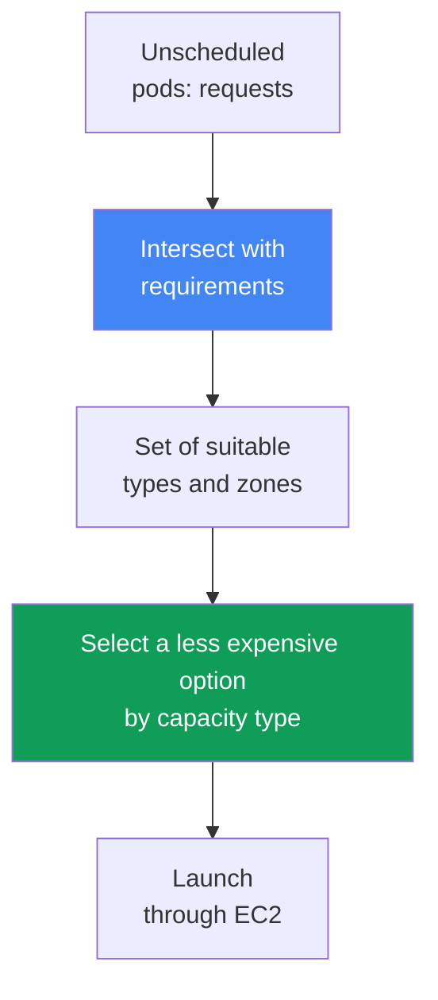
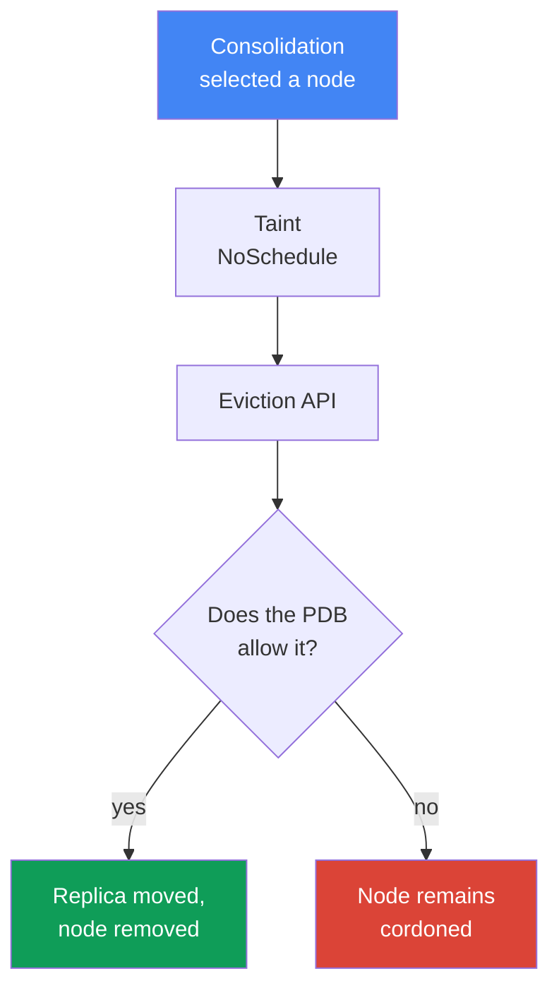

[Russian version](ru.md) · [Versión en español](es.md) · [Version française](fr.md) · [Deutsche Version](de.md) · [ქართული ვერსია](ge.md) · [繁體中文版](tw.md) · [日本語版](jp.md)
# Chapter 12. Karpenter: NodePool, EC2NodeClass, disruption, consolidation, drift

> **What comes next.** Chapter 11 covered choosing between Cluster Autoscaler and Karpenter at the approach level, and Karpenter's relationship with Auto Mode. This chapter covers the actual configuration: `NodePool` and `EC2NodeClass` objects, how Karpenter selects an instance, and, most importantly, disruption: consolidation, drift, and safe workload eviction, including StatefulSet. Spot is covered specifically in Chapter 13, AMIs and bootstrap in Chapter 10, EBS volumes and AZ binding in Chapter 23, sizing in Chapter 14, and cluster upgrades in Chapter 38.

## 12.1. “Consolidation took down the StatefulSet” and “nodes do not update”

Karpenter is enabled and brings up nodes for the load - at first glance, everything works. Then one of two things happens, both caused by the same mechanism.

In the first scenario, traffic has subsided, Karpenter consolidates the cluster and evicts pods from underutilized nodes. It reaches a database replica from a StatefulSet - and the replica moves along with the node, losing local data or breaking quorum. In the second, mirror-image scenario, a new AMI containing fixes for CVEs is released and nodes should update - but they do not change for weeks, and what is preventing their replacement is unclear.

```bash
kubectl get nodeclaims
kubectl logs -n kube-system -l app.kubernetes.io/name=karpenter | grep -i disrupt
```

Both cases are about how Karpenter creates and removes nodes: bringing up a node is not enough; its replacement and removal must neither take down workloads nor get stuck forever. This chapter is about that.

## 12.2. NodePool: boundaries for created nodes

`NodePool` describes the boundaries within which Karpenter may create nodes and their lifecycle rules. Without at least one `NodePool`, Karpenter does nothing. Key parts:

- `template.spec.requirements`  -  permitted instance types, zones, architectures, and capacity types through well-known labels (`karpenter.k8s.aws/instance-category`, `kubernetes.io/arch`, `topology.kubernetes.io/zone`, `karpenter.sh/capacity-type`).
- `template.metadata.labels` and `template.spec.taints`  -  labels and taints for created nodes.
- `template.spec.nodeClassRef`  -  a reference to `EC2NodeClass`; `disruption`  -  the consolidation policy and budgets (Section 12.5); `limits`  -  the pool ceiling; `weight`  -  the pool priority (higher weight is considered earlier).

```yaml
apiVersion: karpenter.sh/v1
kind: NodePool
metadata:
  name: default
spec:
  template:
    spec:
      nodeClassRef:
        group: karpenter.k8s.aws
        kind: EC2NodeClass
        name: default
      requirements:
        - key: kubernetes.io/arch
          operator: In
          values: ["amd64"]
        - key: karpenter.k8s.aws/instance-category
          operator: In
          values: ["c", "m", "r"]
        - key: karpenter.sh/capacity-type
          operator: In
          values: ["spot", "on-demand"]
      expireAfter: 720h
  disruption:
    consolidationPolicy: WhenEmptyOrUnderutilized
    consolidateAfter: 1m
```

The documentation recommends not narrowing `requirements` more than necessary. The broader the set of instance types, the more flexible pod packing is and the more resilient Spot workloads are (Chapter 13).

## 12.3. EC2NodeClass: AWS-specific node configuration

`EC2NodeClass` describes what specifically belongs to AWS. Every `NodePool` refers to one class; several pools can share one class. It defines:

- `amiFamily`  -  the image family (`AL2023`, `Bottlerocket`, `AL2`, `Custom`): bootstrap logic and default block device mappings; image details are in Chapter 10.
- `amiSelectorTerms`  -  which AMIs to use: by `alias` (`al2023@latest`), `id`, `name`, or `tags` (a required field). `role` or `instanceProfile`  -  the node IAM identity (one of the two).
- `subnetSelectorTerms`, `securityGroupSelectorTerms`  -  subnets and security groups by tags or ID (conditions within a term use AND, different terms use OR).
- `blockDeviceMappings`  -  disks; `metadataOptions`  -  IMDS, with `httpTokens: required` (IMDSv2) and `httpPutResponseHopLimit: 1` by default (hardening is covered in Chapter 19).

```yaml
apiVersion: karpenter.k8s.aws/v1
kind: EC2NodeClass
metadata:
  name: default
spec:
  amiSelectorTerms:
    - alias: al2023@latest
  role: "KarpenterNodeRole-my-cluster"
  subnetSelectorTerms:
    - tags:
        karpenter.sh/discovery: "my-cluster"
  securityGroupSelectorTerms:
    - tags:
        karpenter.sh/discovery: "my-cluster"
  blockDeviceMappings:
    - deviceName: /dev/xvda
      ebs: {volumeSize: 50Gi, volumeType: gp3, encrypted: true}
  metadataOptions:
    httpTokens: required          # IMDSv2
    httpPutResponseHopLimit: 1
```

| What is configured | NodePool | EC2NodeClass |
|---|---|---|
| Instance types, zones, architectures, capacity type | yes | no |
| Node labels and taints, disruption policy | yes | no |
| AMI, image family, bootstrap | no | yes |
| IAM role, subnets, security groups, disks, IMDS | no | yes |

About `alias: al2023@latest`: it is convenient, but not recommended for production - each new AMI immediately causes drift on all nodes. It is better to pin a version and roll out the update deliberately (Chapter 38).

### Placement group: one group for the entire class

Karpenter nodes can also run in a **placement group** (strategies are in Chapter 0.4). The group is created beforehand in EC2, and the class selects it - by name or by ID, one of the two; Karpenter support appeared in July 2026, so the field is unavailable in older controller versions.

```yaml
spec:
  placementGroupSelector:
    name: training-pg            # or id: pg-123
```

One property determines the entire design: **one `EC2NodeClass` maps to exactly one group**, and all of its instances join it. A flag on a shared class is insufficient here - for such a workload, create a separate `NodePool` plus `EC2NodeClass` pair and direct pods to the pool with selectors and taints. This is also a safeguard: `cluster` keeps all nodes in one zone, which conflicts with spreading across three zones (Chapter 40), and a separate pool limits the effect to one workload. With `cluster`, it is best to pin the zone in the pool's `requirements`; otherwise, the first instance fixes it. With `partition`, the `karpenter.k8s.aws/placement-group-partition` label is available, allowing replicas to be spread across partitions through `topologySpreadConstraints` (mechanics are in Chapter 40).

Two things are required for this to work. First, the controller role needs `ec2:DescribePlacementGroups` to discover the group and `ec2:RunInstances` with `ec2:CreateFleet` to launch into it - under an old policy, the field remains inert. Second, the `spread` limit of seven running instances per zone (Chapter 0.4) fits poorly with how Karpenter replaces nodes - it brings up the replacement beforehand, before draining the old node (Section 12.5). In a group that has reached its limit, the replacement cannot start and the node remains running; therefore, plan AMI updates for a `spread` workload with spare slots rather than relying on automatic drift.

## 12.4. How Karpenter selects an instance

Selection logic starts with pods, not pre-defined groups. Karpenter reads unscheduled pods' `requests`, `nodeSelector`, `affinity`, `topologySpreadConstraints`, and `tolerations`, intersects them with `requirements` from the `NodePool`, and obtains a set of suitable types. From that set, it selects an option that fits the pods and costs less.



When multiple capacity types are permitted, priority is fixed: `reserved` (capacity reservations), then `spot`, then `on-demand`; when capacity is insufficient, Karpenter falls back to the next type. Hence the rule: broad `requirements` are good. One or two types leave no choice: for Spot, interruption frequency increases (Chapter 13); for on-demand, there is a risk of insufficient capacity for that type in the zone.

### Multiple NodePools: which pool is tried first

A cluster normally has more than one pool, and eventually a pod matches two at once: for example, there is a general pool and a pool for prepaid capacity. `weight` decides which wins: the higher it is, the earlier Karpenter's scheduler considers the pool; a pool with no `weight` is zero.

```yaml
apiVersion: karpenter.sh/v1
kind: NodePool
metadata:
  name: reserved
spec:
  weight: 50            # higher than the general pool's weight, so tried first
  limits:
    cpu: "200"          # limit exhausted  -  Karpenter moves to the general pool
  template:
    spec:
      requirements:
        - key: node.kubernetes.io/instance-type
          operator: In
          values: ["m6i.2xlarge"]
```

This solves two problems. **Prepaid capacity is used first**: use a narrow pool with a limit and high weight, and after `limits` are exhausted, work moves to the general pool. It also provides a **default pool** for pods without selectors: broad requirements plus high weight place unspecific workloads on a predictable configuration, while specialized pools (GPU from 12.10, Spot from Chapter 13) take only their own workloads through taints and selectors.

Two caveats apply. Pools are best made **mutually exclusive**, with weight used to resolve a conflict rather than as the primary mechanism for separating workloads. Priority is also **not guaranteed**: pods are processed in batches, so a pod that does not fit in the priority pool can go to a lower-weight pool and bring neighboring pods from its batch with it; and if a suitable node already exists in the cluster, the regular `kube-scheduler` places the pods, so weight is not involved at all.

## 12.5. Disruption: how Karpenter removes and replaces nodes

Disruption is how Karpenter voluntarily terminates nodes. The controller performs one method at a time and in a strict order: **Drift first, then Consolidation** (plus forced Expiration and Interruption). The order matters for diagnosis: if a node is both drifted and underutilized, Karpenter handles drift first. For every voluntary method, it applies the `karpenter.sh/disrupted:NoSchedule` taint to the node, brings up a replacement beforehand, and only then drains the old node through the Kubernetes Eviction API - that is, respecting PDBs.

**Consolidation** is active packing for cost savings. It is controlled by `consolidationPolicy` (which nodes to consider) and `consolidateAfter` (how long to wait for node stability; the timer resets when a pod is added or removed; `Never` disables consolidation).

| consolidationPolicy | Which nodes it touches | When to choose it |
|---|---|---|
| `WhenEmpty` | only empty nodes (only DaemonSets and “inexpensive” pods) | the most conservative mode is required |
| `WhenEmptyOrUnderutilized` | empty plus underutilized nodes: remove or replace them more cheaply | maximum savings |

There are exactly two `consolidationPolicy` values in v1. There is no separate “compromise” policy: with `WhenEmptyOrUnderutilized`, Karpenter weighs the benefit itself and applies three methods - empty-node deletion, single-node consolidation, and multi-node consolidation - interrupting a node only if its replacement costs less.

**Drift** brings a node to its desired state: a node drifts when values in its `NodeClaim` diverge from `NodePool` or `EC2NodeClass`. Drift fields are `requirements` in `NodePool` and `subnetSelectorTerms`, `securityGroupSelectorTerms`, and `amiSelectorTerms` in `EC2NodeClass`. The most common trigger is a new AMI. Behavioral fields (`weight`, `limits`, `disruption.*`) do not affect drift.

## 12.6. Controlling eviction: what to use and what not to use

This is where the difference lies between “the workload was taken down” and “it got stuck forever.” There are four tools.

**PodDisruptionBudget (PDB)** is the primary brake. Karpenter drains a node through the Eviction API, so a pod with a blocking PDB is not evicted during voluntary disruption. `maxUnavailable: 1` is typical for a StatefulSet. While the PDB does not allow the pod to be evicted, the node is already tainted `karpenter.sh/disrupted:NoSchedule` (cordoned) but is not removed - it remains in this state:

```bash
kubectl describe node <node> | grep -A2 Unconsolidatable
# Normal  Unconsolidatable  ...  pdb default/db-pdb prevents pod evictions
```

A subtlety: if a pod is covered by several PDBs, or a node has pods from different PDBs, all those PDBs must allow eviction simultaneously. One blocking PDB holds the entire node.

The **`karpenter.sh/do-not-disrupt` annotation on a pod** protects the entire node from voluntary disruption while the pod is alive: `"true"` permanently, or a duration (`"30m"`) temporarily after pod startup. The same annotation can be put on a `NodeClaim` or node.

**Disruption budgets in `NodePool`** limit the rate of disruptions: a proportion or number of concurrently disrupted nodes (`nodes: "20%"` or `nodes: "5"`), optionally with a scheduled window (`schedule` in cron plus `duration`) for quiet hours. By default, a `nodes: 10%` budget applies. A budget is associated with a reason through `reasons`: `Drifted`, `Underutilized`, `Empty`.

```yaml
  disruption:
    consolidationPolicy: WhenEmptyOrUnderutilized
    budgets:
      - nodes: "20%"
      - schedule: "0 9 * * mon-fri"
        duration: 8h
        nodes: "0"
```

**`terminationGracePeriod` and `expireAfter`** define time limits. `expireAfter` (default `720h`) is the maximum node lifetime, after which it is forcibly drained. `terminationGracePeriod` is the drain deadline: after it expires, remaining pods are forcibly deleted (related to application graceful shutdown). Together, they set a ceiling on node lifetime.

| Mechanism | Level | Consolidation | Drift | Forceful (expiration/interruption) |
|---|---|---|---|---|
| PDB | pod | blocks | blocks (without `terminationGracePeriod`) | no |
| `do-not-disrupt` on a pod | pod/node | blocks | blocks (without `terminationGracePeriod`) | no |
| disruption budget | NodePool | blocks | blocks | no (expiration ignores budgets) |
| `terminationGracePeriod` | NodePool | bounds draining | removes the PDB/do-not-disrupt block | bounds draining |

The rightmost column is critical: forceful methods cannot be stopped by budgets and annotations. Expiration and Interruption start draining immediately; they can only be softened through PDBs at the application level.

## 12.7. Safe StatefulSet eviction during consolidation

Let us assemble the scenario from 12.1 correctly: a database StatefulSet, consolidation enabled, and consolidation must not take down quorum. Without a PDB, a replica is evicted immediately - putting quorum at risk. With PDB `maxUnavailable: 1`, Karpenter evicts replicas strictly one at a time, waiting for each one to recover. But if consolidation wants to remove multiple nodes holding replicas at once, the PDB blocks some evictions, and the nodes remain cordoned.



A blocked eviction is visible in logs and events:

```bash
kubectl logs -n kube-system -l app.kubernetes.io/name=karpenter -f | grep -i pdb
kubectl get pdb -A
```

A correct configuration has three parts, not one:

- **PDB** `maxUnavailable: 1` for the StatefulSet - one-at-a-time eviction and quorum preservation;
- a **disruption budget** in `NodePool` - limits the rate so Karpenter does not touch all nodes with replicas at once (`nodes: "20%"` plus a quiet window during business hours);
- **`do-not-disrupt`** - selectively, only where interruption is unacceptable (a leader, migration, or long batch job), not everywhere.

## 12.8. The trap: strict protection blocks not only consolidation, but also drift

The most insidious mistake follows from the table in 12.6. PDB and `do-not-disrupt` block voluntary disruption as a whole - both consolidation and **drift**. An engineer sets `do-not-disrupt: "true"` on all pods or PDB `maxUnavailable: 0` so that “nothing is touched,” and gets the second scenario from 12.1: nodes do not update.

The logic is as follows: a new AMI is released, old nodes are marked drifted, Karpenter wants to replace them, but draining is blocked. Nodes remain on the old image for weeks: unpatched CVEs accumulate, kubelet and component versions fall behind, and technical debt grows. During a cluster upgrade (Chapter 38), this becomes a stuck node update.

The solution is `terminationGracePeriod` on `NodePool`: when it is set, a node drifts even with blocking PDBs or the `do-not-disrupt` annotation, and after the period expires, pods are forcibly deleted. It is a safeguard for critical updates (an AMI with a CVE fix). The documentation explicitly warns not to set `expireAfter` without `terminationGracePeriod` when `do-not-disrupt` is present; otherwise, you get partially drained nodes hanging forever. The balance is to protect the workload exactly as much as necessary and always set `terminationGracePeriod`.

## 12.9. Interaction with EBS volumes: zone binding

A separate trap concerns StatefulSets with EBS volumes. An EBS volume exists in a particular AZ and cannot mount to an instance in another zone; therefore, its PVC binds a replica to the volume's zone.

The consequence for consolidation: Karpenter cannot move such a replica to another AZ merely to consolidate - a new node must be launched in the same zone as the volume. If there is nothing to consolidate there, the replica remains in place; that is normal, not a failure. When a node is replaced (drift, expiration), the new one comes up in the same AZ, the volume is reattached, and the pod returns.

Thus, topology is designed in advance: spread replicas across zones with `topologySpreadConstraints`, and create volumes with `volumeBindingMode: WaitForFirstConsumer` so provisioning occurs in the selected node's zone. StorageClass mechanics and `allowedTopologies` are in Chapter 23.

## 12.10. GPU and AI workloads: a dedicated NodePool for accelerators

GPU instances (`g5`, `p4d`, `p5`) are expensive and scarce; ordinary pods have no place on them. The technique is the same as everywhere else: a separate `NodePool` with narrow GPU-family `requirements` plus a taint, so that only pods that truly need a GPU occupy the node.

```yaml
apiVersion: karpenter.sh/v1
kind: NodePool
metadata: {name: gpu}
spec:
  template:
    spec:
      nodeClassRef: {group: karpenter.k8s.aws, kind: EC2NodeClass, name: gpu}
      requirements:
        - key: karpenter.k8s.aws/instance-family
          operator: In
          values: ["g5", "p4d", "p5"]
      taints:
        - key: nvidia.com/gpu
          effect: NoSchedule
```

A pod without a toleration cannot be scheduled on such a node; a GPU pod tolerates the taint and explicitly requests the resource:

```yaml
  tolerations:
    - {key: nvidia.com/gpu, operator: Exists, effect: NoSchedule}
  containers:
    - name: train
      resources:
        limits: {nvidia.com/gpu: 1}
```

The NVIDIA device plugin - a DaemonSet on GPU nodes - publishes the `nvidia.com/gpu` resource (on an EKS-optimized GPU AMI or as a separate add-on; it is built into Auto Mode, Chapter 11). Until the plugin starts, the scheduler cannot see the GPU. Karpenter notices a pending pod with `requests` for `nvidia.com/gpu` and brings up a GPU node from this pool for it.

A training pod requiring guaranteed scarce GPU capacity is associated with EC2 Capacity Blocks for ML (Chapter 0.4): Karpenter takes reserved capacity through `capacityReservationSelectorTerms` in `EC2NodeClass`, while `reserved` is first in capacity-type priority (Section 12.4). For distributed training, add a placement group with the `cluster` strategy in the same class (Section 12.3): nodes are placed close together in one zone, minimizing latency between them.

## 12.11. Operations: monitoring and common errors

What to inspect in a live cluster when Karpenter behaves unexpectedly:

```bash
kubectl get nodepools
kubectl get ec2nodeclasses
kubectl get nodeclaims
kubectl logs -n kube-system -l app.kubernetes.io/name=karpenter -f
kubectl describe node <node>            # Unconsolidatable events
```

A `NodeClaim` is Karpenter's request for a particular node; the `NodePool -> NodeClaim -> Node` chain shows whose node it is. Karpenter exports Prometheus metrics (including consolidation metrics) for dashboards (Chapter 33). Common errors:

- **Nodes do not consolidate**  -  an `Unconsolidatable` event with the reason `pdb ... prevents pod evictions` (a blocking PDB) or `can't replace with a lower-priced node` (there is no cheaper replacement).
- **Nodes do not update (drift is stuck)**  -  strict PDBs or `do-not-disrupt` without `terminationGracePeriod` (Section 12.8).
- **`EC2NodeClass` not Ready**  -  subnets, security groups, or AMIs cannot be found; inspect `status.conditions`. Until the class is Ready, pools that reference it do not take part in scheduling.
- **Requirements are too narrow**  -  no instance type can be selected, and pods stay `Pending`.

## 12.12. How this is used in production

- Keep **`requirements` broad**, narrowing them only when necessary: more instance choices, denser packing, and Spot resilience (Chapter 13).
- **Pin the AMI version**, rather than using `@latest` in production: roll out the update deliberately through controlled drift (Chapter 38).
- Protect **StatefulSets with PDB plus a disruption budget**: the PDB provides one-at-a-time eviction, while the budget limits the rate and defines quiet windows.
- **Always set `terminationGracePeriod`** when `do-not-disrupt` or strict PDBs exist - as a safeguard so drift and updates do not get stuck.
- Use **`do-not-disrupt` selectively** - on particular critical pods, not on an entire namespace.
- **Design AZ topology in advance**, recognizing that consolidation does not move EBS volumes between zones.

## 12.13. Mini glossary

- **NodePool**  -  a CRD (`karpenter.sh/v1`) defining node boundaries: `requirements`, `limits`, `weight`, labels/taints, and the disruption policy.
- **EC2NodeClass**  -  a CRD (`karpenter.k8s.aws/v1`) with AWS settings: AMI, IAM role, subnets and security groups, disks, and IMDS.
- **NodeClaim**  -  Karpenter's request for a particular node; it links `NodePool` and a real `Node`.
- **Consolidation**  -  voluntary packing for cost savings; `WhenEmpty` and `WhenEmptyOrUnderutilized` policies, empty/single/multi-node methods, and the `consolidateAfter` parameter.
- **Drift**  -  divergence of a node from its desired state (a new AMI, changed selectors, or `requirements`); it runs before consolidation.
- **Disruption budget**  -  a limit on the rate of voluntary disruptions: a proportion/number of nodes, `schedule` and `duration` windows, and association with `reasons`.
- **`terminationGracePeriod`**  -  the node drain deadline; when it exists, drift proceeds even through blocking PDBs and `do-not-disrupt`.
- **`placementGroupSelector`**  -  an `EC2NodeClass` field selecting a placement group by name or ID. One class has exactly one group, so such a workload lives in its own `NodePool` plus `EC2NodeClass` pair.

## 12.14. Chapter summary

- `NodePool` defines node boundaries, while `EC2NodeClass` defines AWS-specific configuration (AMI, role, subnets, security groups, disks, IMDS). Multiple pools can share one class.
- Karpenter selects an instance from pods: it intersects requests with `requirements` and chooses the less expensive option. Capacity-type priority is `reserved`, `spot`, `on-demand`.
- Disruption runs one method at a time: Drift first, then Consolidation (plus forced Expiration and Interruption). Consolidation is controlled by `consolidationPolicy` and `consolidateAfter`.
- PDBs (the primary brake), `do-not-disrupt` (protects the entire node), and disruption budgets (rate and windows) slow eviction; forceful methods cannot be stopped with these mechanisms.
- Evict StatefulSets safely with PDB plus a disruption budget plus selective `do-not-disrupt`; a blocked eviction appears as a cordoned node and an `Unconsolidatable` event.
- Overly strict protection blocks not only consolidation but drift as well: nodes do not update and CVEs accumulate. The safeguard is `terminationGracePeriod`.
- Consolidation does not move StatefulSet replicas between AZs because an EBS volume is zone-bound (Chapter 23).

## 12.15. How this helps in real work

During an on-call shift, both symptoms from 12.1 can be diagnosed quickly. “A node is cordoned and does not get removed” - use `kubectl describe node` for an `Unconsolidatable` event and `kubectl get pdb`: it is almost always blocked by a PDB or a `do-not-disrupt` annotation. “Nodes do not update after a new AMI” - the same root cause on the drift side; check for blanket protection without `terminationGracePeriod`. When designing, the chapter guards against two extremes: a StatefulSet without a PDB (consolidation takes down the workload) and blanket `do-not-disrupt` (drift stops). The middle ground is a PDB for every critical workload, a disruption budget with quiet windows, and `terminationGracePeriod` as a safeguard.

## 12.16. Self-check questions

1. What does `NodePool` describe, and what does `EC2NodeClass` describe? Why were they separated into two objects?
2. How does Karpenter select an instance type, and why are broad `requirements` preferable to narrow ones?
3. A pod matches two `NodePool` objects. What does `weight` decide, and why cannot it be relied on as a strict workload-separation rule?
4. In what order do disruption methods run, and why does this matter for diagnosis?
5. How do `WhenEmpty` and `WhenEmptyOrUnderutilized` differ, and which methods does consolidation use? What does `consolidateAfter` do?
6. What is drift, which changes cause it, and which fields do not affect it?
7. How does a PDB slow eviction, and what happens to a node when a PDB does not allow a pod to be evicted?
8. What does `karpenter.sh/do-not-disrupt` protect, and at what level does it act?
9. How do disruption budgets work, and can they stop expiration or interruption?
10. How do you safely evict a StatefulSet during consolidation? What parts make up the configuration?
11. Why does strict protection block not only consolidation but drift too, and why is that dangerous?
12. How does `terminationGracePeriod` remove the block, and why does consolidation not move an EBS volume to another AZ?
13. Why is a placement-group workload moved into a separate `NodePool` and `EC2NodeClass` pair instead of enabling the group on a shared class?

## Practice

The course lab for this topic is [lab 123  -  Karpenter: NodePool, consolidation, drift, and safe StatefulSet eviction](../../labs/123/README.MD). Karpenter is also covered in [lab 106  -  EBS CSI: gp3, AZ binding, expansion, snapshot](../../labs/106/README.MD) in the context of zonal volumes. In addition, you can see Karpenter configuration in a live cluster (including inside Auto Mode, Chapter 11). Start with inventory: `kubectl get nodepools`, `kubectl get ec2nodeclasses`, `kubectl get nodeclaims`. Examine your `NodePool`'s `spec.disruption` block: which `consolidationPolicy` it uses and whether `budgets` and `terminationGracePeriod` exist.

Next, work through the diagnosis in Sections 12.7 and 12.8 without harming the cluster. Find a StatefulSet and run `kubectl get pdb -A` - does it have a PDB, and what is in `maxUnavailable`? Look in `kubectl logs -n kube-system -l app.kubernetes.io/name=karpenter` and node events for `Unconsolidatable`. Also review the earlier Karpenter lab in the repository ([Karpenter](../../labs/02/README_RUS.MD)) - it is not part of the course, but the topic overlaps.

---
[Table of contents](../README.md) · [Chapter 11](../11/en.md) · [Chapter 13](../13/en.md)
