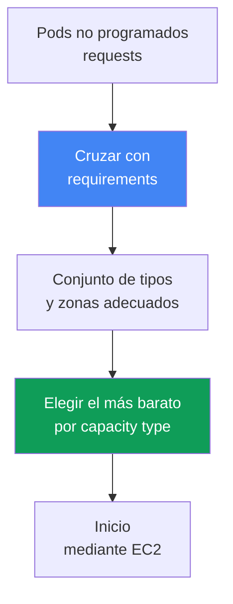
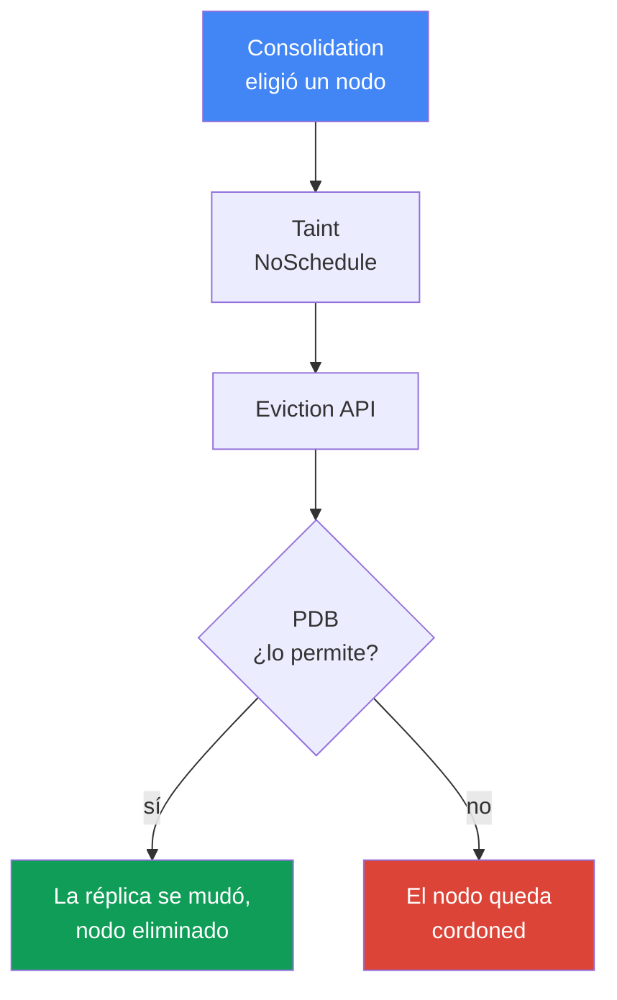

[Русская версия](ru.md) · [Eng version](en.md) · [Version française](fr.md) · [Deutsche Version](de.md) · [ქართული ვერსია](ge.md) · [繁體中文版](tw.md) · [日本語版](jp.md)
# Capítulo 12. Karpenter: NodePool, EC2NodeClass, disruption, consolidation, drift

> **Qué sigue.** En el capítulo 11 se abordó la elección entre Cluster Autoscaler y Karpenter a nivel de enfoque, así como la relación de Karpenter con Auto Mode. Aquí está la configuración concreta: los objetos `NodePool` y `EC2NodeClass`, cómo Karpenter elige una instancia y, sobre todo, disruption: consolidation, drift y la evacuación segura de cargas, incluidos los StatefulSet. Spot se trata específicamente en el capítulo 13; AMI y bootstrap, en el capítulo 10; los volúmenes EBS y la afinidad con la AZ, en el capítulo 23; el dimensionamiento, en el capítulo 14; y la actualización del clúster, en el capítulo 38.

## 12.1. «La consolidación derribó un StatefulSet» y «los nodos no se actualizan»

Karpenter está activado, los nodos se levantan según la carga; a primera vista, todo funciona. Pero después ocurre una de dos cosas, y en ambos casos el culpable es el mismo mecanismo.

Primer escenario: el tráfico bajó, Karpenter compacta el clúster y evacúa pods de nodos infrautilizados. Llega a una réplica de base de datos de un StatefulSet, y esta se muda junto con el nodo, perdiendo datos locales o rompiendo el cuórum. El segundo escenario es el inverso: se publicó una AMI nueva con CVE corregidos, los nodos deberían actualizarse, pero no cambian durante semanas, y no es evidente qué bloquea la sustitución.

```bash
kubectl get nodeclaims
kubectl logs -n kube-system -l app.kubernetes.io/name=karpenter | grep -i disrupt
```

Ambos casos tratan de cómo Karpenter crea y retira nodos: no basta con levantar un nodo; su sustitución y eliminación no deben derribar la carga ni quedar atascadas para siempre. De eso trata este capítulo.

## 12.2. NodePool: límites para los nodos creados

`NodePool` describe los límites dentro de los cuales Karpenter puede crear nodos y las reglas de su ciclo de vida. Sin al menos un `NodePool`, Karpenter no hace nada. Partes clave:

- `template.spec.requirements`: tipos, zonas, arquitecturas y capacity type permitidos mediante well-known labels (`karpenter.k8s.aws/instance-category`, `kubernetes.io/arch`, `topology.kubernetes.io/zone`, `karpenter.sh/capacity-type`).
- `template.metadata.labels` y `template.spec.taints`: etiquetas y taints para los nodos creados.
- `template.spec.nodeClassRef`: referencia a `EC2NodeClass`; `disruption`: política de compactación y presupuestos (sección 12.5); `limits`: límite máximo del pool; `weight`: prioridad del pool (cuanto mayor el peso, antes).

```yaml
apiVersion: karpenter.sh/v1
kind: NodePool
metadata:
  name: default
spec:
  template:
    spec:
      nodeClassRef:
        group: karpenter.k8s.aws
        kind: EC2NodeClass
        name: default
      requirements:
        - key: kubernetes.io/arch
          operator: In
          values: ["amd64"]
        - key: karpenter.k8s.aws/instance-category
          operator: In
          values: ["c", "m", "r"]
        - key: karpenter.sh/capacity-type
          operator: In
          values: ["spot", "on-demand"]
      expireAfter: 720h
  disruption:
    consolidationPolicy: WhenEmptyOrUnderutilized
    consolidateAfter: 1m
```

La recomendación de la documentación es no restringir `requirements` más de lo necesario. Cuanto más amplio sea el conjunto de tipos, más flexible será la colocación de pods y más resilientes serán las cargas spot (capítulo 13).

## 12.3. EC2NodeClass: especificidad de AWS del nodo

`EC2NodeClass` describe lo que pertenece específicamente a AWS. Cada `NodePool` hace referencia a una clase; varios pools pueden compartir una clase. Se configura lo siguiente:

- `amiFamily`: familia de imagen (`AL2023`, `Bottlerocket`, `AL2`, `Custom`): la lógica de bootstrap y los block device mappings predeterminados; los detalles de las imágenes se tratan en el capítulo 10.
- `amiSelectorTerms`: qué AMI usar: por `alias` (`al2023@latest`), `id`, `name`, `tags` (campo obligatorio). `role` o `instanceProfile`: la identidad IAM del nodo (una de las dos).
- `subnetSelectorTerms`, `securityGroupSelectorTerms`: subredes y SG por etiquetas o id (dentro de un term, las condiciones se combinan con AND; distintos terms, con OR).
- `blockDeviceMappings`: discos; `metadataOptions`: IMDS, de forma predeterminada `httpTokens: required` (IMDSv2) y `httpPutResponseHopLimit: 1` (hardening: capítulo 19).

```yaml
apiVersion: karpenter.k8s.aws/v1
kind: EC2NodeClass
metadata:
  name: default
spec:
  amiSelectorTerms:
    - alias: al2023@latest
  role: "KarpenterNodeRole-my-cluster"
  subnetSelectorTerms:
    - tags:
        karpenter.sh/discovery: "my-cluster"
  securityGroupSelectorTerms:
    - tags:
        karpenter.sh/discovery: "my-cluster"
  blockDeviceMappings:
    - deviceName: /dev/xvda
      ebs: {volumeSize: 50Gi, volumeType: gp3, encrypted: true}
  metadataOptions:
    httpTokens: required          # IMDSv2
    httpPutResponseHopLimit: 1
```

| Qué se configura | NodePool | EC2NodeClass |
|---|---|---|
| Tipos, zonas, arquitecturas, capacity type | sí | no |
| Labels y taints de nodos, política de disruption | sí | no |
| AMI, familia de imagen, bootstrap | no | sí |
| Rol IAM, subredes, SG, discos, IMDS | no | sí |

Sobre `alias: al2023@latest`: es cómodo, pero no se recomienda para producción; una AMI nueva provocará inmediatamente drift en todos los nodos. Es mejor fijar una versión y desplegar la actualización conscientemente (capítulo 38).

### Placement group: un grupo para toda la clase

Los nodos de Karpenter también se pueden ejecutar en un **placement group** (estrategias: capítulo 0.4). El grupo se crea previamente en EC2, y la clase lo selecciona por nombre o por id, una de las dos opciones; el soporte apareció en Karpenter en julio de 2026; en versiones más antiguas del controlador, el campo no existe.

```yaml
spec:
  placementGroupSelector:
    name: training-pg            # o bien id: pg-123
```

La propiedad que determina todo el esquema es esta: **un `EC2NodeClass` se asigna exactamente a un grupo**, y todas sus instancias entran en él. Un indicador en una clase común no basta: para tal carga se crea una pareja independiente de `NodePool` más `EC2NodeClass`, y los pods se dirigen al pool mediante selectores y taints. Esto también es una protección: `cluster` mantiene todos los nodos en una sola zona, lo que contradice una distribución en tres zonas (capítulo 40), y un pool independiente limita el efecto a una sola carga. Con `cluster`, es mejor fijar la zona en los `requirements` del pool; de lo contrario, la primera instancia la fijará. Para `partition` está disponible la etiqueta `karpenter.k8s.aws/placement-group-partition`, con la que se distribuyen las réplicas entre particiones mediante `topologySpreadConstraints` (mecánica: capítulo 40).

Hay dos cosas sin las cuales esto no funcionará. La primera: los roles del controlador necesitan los permisos `ec2:DescribePlacementGroups` para descubrir el grupo y `ec2:RunInstances` con `ec2:CreateFleet` para iniciarlo; con una política antigua, el campo seguirá inactivo. La segunda: el límite de `spread` de 7 instancias en ejecución por zona (capítulo 0.4) encaja mal con cómo Karpenter sustituye nodos: levanta la sustitución de antemano, antes de drenar el antiguo (sección 12.5). En un grupo que alcanzó el límite, la sustitución no se iniciará y el nodo seguirá funcionando; por ello, la actualización de AMI para una carga en `spread` se planifica con margen de slots y no confiando en el drift automático.

## 12.4. Cómo elige Karpenter una instancia

La lógica de selección parte de los pods, no de grupos recortados de antemano. Karpenter lee los `requests`, `nodeSelector`, `affinity`, `topologySpreadConstraints`, `tolerations` de los pods no programados, los cruza con los `requirements` de `NodePool` y obtiene un conjunto de tipos adecuados, del que toma una opción que aloje los pods y cueste menos.



Si se permiten varios capacity type, la prioridad es fija: `reserved` (capacity reservations), después `spot` y después `on-demand`; si falta capacidad, Karpenter recurre al tipo siguiente. De aquí surge la regla: unos `requirements` amplios son buenos. Uno o dos tipos no dejan margen de elección: con spot aumenta la frecuencia de interrupciones (capítulo 13); con on-demand, el riesgo de falta de capacidad del tipo en la zona.

### Varios NodePool: qué pool se prueba primero

Normalmente hay más de un pool en el clúster, y tarde o temprano un pod encaja en dos a la vez: por ejemplo, hay un pool común y otro para capacidad pagada por adelantado. Quién gana lo decide `weight`: cuanto mayor sea, antes considera el planificador de Karpenter el pool; un pool sin `weight` cuenta como cero.

```yaml
apiVersion: karpenter.sh/v1
kind: NodePool
metadata:
  name: reserved
spec:
  weight: 50            # mayor que el peso del pool común, por eso se prueba primero
  limits:
    cpu: "200"          # límite agotado: Karpenter pasa al pool común
  template:
    spec:
      requirements:
        - key: node.kubernetes.io/instance-type
          operator: In
          values: ["m6i.2xlarge"]
```

Esto resuelve dos tareas. **La capacidad pagada se consume primero**: un pool estrecho con límite y peso alto; tras agotar `limits`, el trabajo pasa al pool común. Y un **pool predeterminado** para pods sin selectores: requisitos amplios y peso alto para que lo no dirigido caiga en una configuración predecible, mientras que los pools especializados (GPU de 12.10, spot del capítulo 13) solo toman lo suyo mediante taints y selectores.

Dos salvedades. Es mejor que los pools sean **mutuamente excluyentes**, y usar el peso para resolver disputas, no como mecanismo principal para separar cargas. Además, la prioridad **no está garantizada**: los pods se procesan por lotes, por lo que un pod que no cupo en el pool prioritario puede ir a uno con menos peso y arrastrar consigo a vecinos de su lote; y si ya hay un nodo adecuado en el clúster, los pods los colocará el `kube-scheduler` normal y el peso no participará en absoluto.

## 12.5. Disruption: cómo Karpenter retira y sustituye nodos

Disruption es la forma en que Karpenter termina voluntariamente nodos. El controlador ejecuta un método a la vez y en orden estricto: **primero Drift, después Consolidation** (además de Expiration e Interruption forzados). El orden es importante para el diagnóstico: si un nodo tiene drift y está infrautilizado, Karpenter primero se ocupará del drift. Con cualquier método voluntario, aplica al nodo el taint `karpenter.sh/disrupted:NoSchedule`, levanta de antemano una sustitución y solo entonces drena el nodo antiguo mediante la Kubernetes Eviction API, es decir, respetando el PDB.

**Consolidation** es la compactación activa para reducir costes. Se controla mediante `consolidationPolicy` (qué nodos considerar) y `consolidateAfter` (cuánto esperar a la estabilidad del nodo; el temporizador se reinicia al añadir o eliminar un pod; `Never` desactiva consolidation).

| consolidationPolicy | Qué nodos toca | Cuándo elegirla |
|---|---|---|
| `WhenEmpty` | solo vacíos (únicamente DaemonSet y pods «baratos») | se necesita el modo más prudente |
| `WhenEmptyOrUnderutilized` | vacíos más infrautilizados: retirar o sustituir por uno más barato | máximo ahorro |

En v1 hay exactamente dos valores de `consolidationPolicy`. No existe un modo «de compromiso» como política independiente: con `WhenEmptyOrUnderutilized`, Karpenter sopesa por sí mismo el beneficio y aplica tres métodos --eliminación de nodos vacíos, consolidation de un nodo y de varios nodos--, interrumpiendo un nodo solo si la sustitución es más barata.

**Drift** es llevar el nodo al estado deseado: un nodo tiene drift si los valores de su `NodeClaim` difieren de `NodePool` o `EC2NodeClass`. Los campos de drift son `requirements` de `NodePool` y `subnetSelectorTerms`, `securityGroupSelectorTerms`, `amiSelectorTerms` de `EC2NodeClass`. El desencadenante más frecuente es una AMI nueva. Los campos de comportamiento (`weight`, `limits`, `disruption.*`) no influyen en el drift.

## 12.6. Control de la evacuación: con qué frenarla y con qué no

Aquí reside la diferencia entre «derribaron la carga» y «quedaron atascados para siempre». Hay cuatro herramientas.

**PodDisruptionBudget (PDB)** es el freno principal. Karpenter drena el nodo mediante la Eviction API, por lo que un pod con un PDB bloqueante no será desalojado durante una interrupción voluntaria. Para un StatefulSet, es típico `maxUnavailable: 1`. Mientras el PDB no permita desalojar el pod, el nodo ya está marcado con el taint `karpenter.sh/disrupted:NoSchedule` (cordoned), pero no se elimina; queda en ese estado:

```bash
kubectl describe node <node> | grep -A2 Unconsolidatable
# Normal  Unconsolidatable  ...  pdb default/db-pdb prevents pod evictions
```

Una sutileza: si un pod entra en varios PDB o hay pods de distintos PDB en el nodo, todos esos PDB deben permitir el desalojo al mismo tiempo. Un único PDB bloqueante retiene todo el nodo.

La **anotación `karpenter.sh/do-not-disrupt` en el pod** protege todo el nodo de la interrupción voluntaria mientras el pod viva: `"true"`, de forma permanente; una duración (`"30m"`), temporalmente tras el inicio del pod. La misma anotación se puede poner en un `NodeClaim` o en un nodo.

Los **disruption budgets en `NodePool`** limitan el ritmo de interrupciones: proporción o número de nodos interrumpidos simultáneamente (`nodes: "20%"` o `nodes: "5"`), opcionalmente con una ventana programada (`schedule` en cron más `duration`) para horas de menor actividad. De forma predeterminada, se aplica un presupuesto de `nodes: 10%`. El presupuesto se vincula a la causa mediante `reasons`: `Drifted`, `Underutilized`, `Empty`.

```yaml
  disruption:
    consolidationPolicy: WhenEmptyOrUnderutilized
    budgets:
      - nodes: "20%"
      - schedule: "0 9 * * mon-fri"
        duration: 8h
        nodes: "0"
```

**`terminationGracePeriod` y `expireAfter`** establecen los límites temporales. `expireAfter` (de forma predeterminada, `720h`) es la vida máxima de un nodo, después de la cual se drena forzosamente. `terminationGracePeriod` es el límite del drenaje: al expirar, los pods restantes se eliminan a la fuerza (relación con el apagado ordenado de la aplicación). Juntos fijan el límite máximo de vida del nodo.

| Mecanismo | Nivel | Consolidation | Drift | Forceful (expiration/interruption) |
|---|---|---|---|---|
| PDB | pod | frena | frena (sin `terminationGracePeriod`) | no |
| `do-not-disrupt` en el pod | pod/nodo | frena | frena (sin `terminationGracePeriod`) | no |
| disruption budget | NodePool | frena | frena | no (expiration ignora los budgets) |
| `terminationGracePeriod` | NodePool | limita el drenaje | elimina el bloqueo de PDB/do-not-disrupt | limita el drenaje |

La columna de la derecha es crítica: los métodos forceful no se pueden detener con budgets ni anotaciones. Expiration e Interruption inician el drenaje de inmediato; solo se pueden suavizar mediante PDB a nivel de aplicación.

## 12.7. Evacuación segura de StatefulSet durante la consolidación

Construyamos correctamente el escenario de 12.1: un StatefulSet de base de datos, consolidation activada, y la compactación no debe derribar el cuórum. Sin PDB, la réplica se desaloja inmediatamente y el cuórum queda en riesgo. Con PDB `maxUnavailable: 1`, Karpenter desaloja las réplicas estrictamente de una en una, esperando que cada una se recupere. Pero si consolidation quiere retirar a la vez varios nodos con réplicas, PDB bloqueará parte de los desalojos y los nodos quedarán cordoned.



El desalojo bloqueado se ve en los registros y eventos:

```bash
kubectl logs -n kube-system -l app.kubernetes.io/name=karpenter -f | grep -i pdb
kubectl get pdb -A
```

La configuración correcta consta de tres partes, no de una:

- **PDB** `maxUnavailable: 1` en el StatefulSet: desalojo de uno en uno y preservación del cuórum;
- **disruption budget** en `NodePool`: limita el ritmo para que Karpenter no toque de inmediato todos los nodos con réplicas (`nodes: "20%"` más una ventana tranquila durante el horario laboral);
- **`do-not-disrupt`**: de forma puntual, solo donde la interrupción sea inadmisible (líder, migración, tarea batch larga), no en todo indiscriminadamente.

## 12.8. Trampa: una protección estricta bloquea no solo consolidation, sino también drift

El error más insidioso se desprende de la tabla 12.6. PDB y `do-not-disrupt` frenan por completo las interrupciones voluntarias, tanto consolidation como **drift**. Un ingeniero pone `do-not-disrupt: "true"` en todos los pods o PDB `maxUnavailable: 0` para que «no se toque nada», y obtiene el segundo escenario de 12.1: los nodos no se actualizan.

La lógica es esta: sale una AMI nueva, los nodos antiguos se marcan drifted, Karpenter quiere sustituirlos, pero el drenaje está bloqueado. Los nodos permanecen semanas en la imagen antigua: se acumulan CVE sin corregir, las versiones de kubelet y componentes se retrasan y crece la deuda. Durante una actualización de clúster (capítulo 38), esto se convierte en una actualización de nodos atascada.

La salida es `terminationGracePeriod` en el `NodePool`: cuando se define, el nodo tiene drift incluso con PDB bloqueantes o la anotación `do-not-disrupt`; al terminar el periodo, los pods se eliminan forzosamente. Es una protección para actualizaciones críticas (AMI con corrección de CVE). La documentación advierte explícitamente: no definir `expireAfter` sin `terminationGracePeriod` cuando exista `do-not-disrupt`, o se obtendrán nodos parcialmente drenados que quedan suspendidos eternamente. El equilibrio consiste en proteger la carga solo lo necesario y siempre establecer `terminationGracePeriod`.

## 12.9. Interacción con volúmenes EBS: afinidad con la zona

Otra trampa afecta a los StatefulSet con volúmenes EBS. Un volumen EBS vive en una AZ concreta y no se monta en una instancia de otra zona; por ello, una réplica queda vinculada a la zona del volumen mediante su PVC.

La consecuencia para consolidation es que Karpenter no puede mover tal réplica a otra AZ para compactar: el nodo nuevo debe levantarse en la misma zona donde está el volumen. Si no hay nada que compactar allí, la réplica permanece en su sitio; es normal, no un fallo. Al sustituir el nodo (drift, expiration), el nuevo se levanta en la misma AZ, el volumen se vuelve a adjuntar y el pod regresa.

De ahí la práctica: la topología se plantea por adelantado; las réplicas se distribuyen entre zonas mediante `topologySpreadConstraints`, y los volúmenes se crean con `volumeBindingMode: WaitForFirstConsumer` para que el aprovisionamiento se haga en la zona del nodo elegido. La mecánica de StorageClass y `allowedTopologies` se trata en el capítulo 23.

## 12.10. Cargas GPU e IA: un NodePool separado para aceleradores

Las instancias GPU (`g5`, `p4d`, `p5`) son caras y escasas; los pods normales no tienen nada que hacer en ellas. El enfoque es el mismo que en cualquier otro caso: un `NodePool` independiente con `requirements` estrechos para la familia GPU más un taint, para que el nodo solo lo ocupen pods que realmente necesitan GPU.

```yaml
apiVersion: karpenter.sh/v1
kind: NodePool
metadata: {name: gpu}
spec:
  template:
    spec:
      nodeClassRef: {group: karpenter.k8s.aws, kind: EC2NodeClass, name: gpu}
      requirements:
        - key: karpenter.k8s.aws/instance-family
          operator: In
          values: ["g5", "p4d", "p5"]
      taints:
        - key: nvidia.com/gpu
          effect: NoSchedule
```

Un pod sin toleration no se ubicará en tal nodo; el pod GPU tolera el taint y solicita explícitamente el recurso:

```yaml
  tolerations:
    - {key: nvidia.com/gpu, operator: Exists, effect: NoSchedule}
  containers:
    - name: train
      resources:
        limits: {nvidia.com/gpu: 1}
```

El recurso `nvidia.com/gpu` lo publica el NVIDIA device plugin, un DaemonSet en los nodos GPU (en la AMI GPU optimizada para EKS o mediante un addon independiente; en Auto Mode está integrado, capítulo 11). Mientras el plugin no se haya levantado, la GPU no es visible para el planificador. Karpenter detecta un pod pending con `requests` de `nvidia.com/gpu` y levanta para él un nodo GPU de este pool.

Un pod de entrenamiento con garantía de capacidad GPU escasa se vincula a EC2 Capacity Blocks for ML (capítulo 0.4): Karpenter toma la capacidad reservada mediante `capacityReservationSelectorTerms` en `EC2NodeClass`; así, `reserved` va primero en la prioridad de capacity type (sección 12.4). Para entrenamiento distribuido, se añade a esto un placement group con estrategia `cluster` en la misma clase (sección 12.3): los nodos se colocan cerca dentro de una zona y la latencia entre ellos es mínima.

## 12.11. Operación: observación y errores habituales

Qué observar en un clúster activo cuando Karpenter se comporta de forma distinta a la esperada:

```bash
kubectl get nodepools
kubectl get ec2nodeclasses
kubectl get nodeclaims
kubectl logs -n kube-system -l app.kubernetes.io/name=karpenter -f
kubectl describe node <node>            # eventos Unconsolidatable
```

`NodeClaim` es la solicitud de Karpenter para un nodo concreto; la cadena `NodePool -> NodeClaim -> Node` muestra de quién es ese nodo. Karpenter exporta métricas de Prometheus (incluidas métricas de consolidation) para dashboards (capítulo 33). Errores habituales:

- **Los nodos no se consolidan**: evento `Unconsolidatable` con la causa `pdb ... prevents pod evictions` (PDB bloqueante) o `can't replace with a lower-priced node` (no existe una opción más barata).
- **Los nodos no se actualizan (drift atascado)**: PDB estrictos o `do-not-disrupt` sin `terminationGracePeriod` (sección 12.8).
- **`EC2NodeClass` no está Ready**: no se encuentran subredes, SG o AMI; consulte `status.conditions`. Hasta que la clase no esté Ready, los pools que hacen referencia a ella no participan en la planificación.
- **`requirements` demasiado estrechos**: no se encuentra un tipo adecuado y los pods quedan en `Pending`.

## 12.12. Cómo se aplica en producción

- Los **`requirements` se mantienen amplios**, restringiéndolos solo cuando sea necesario: elección de tipos, empaquetado denso y resiliencia spot (capítulo 13).
- Se **fija la versión de AMI**, no se usa `@latest` en producción: la actualización se despliega conscientemente mediante drift controlado (capítulo 38).
- Los **StatefulSet se protegen con la combinación de PDB y disruption budget**: PDB permite el desalojo de uno en uno y el budget limita el ritmo y define ventanas tranquilas.
- Se establece siempre **`terminationGracePeriod`** si existe `do-not-disrupt` o PDB estrictos, como protección para que drift y las actualizaciones no queden atascados.
- **`do-not-disrupt` se aplica de forma puntual**, a pods críticos concretos, no a todo el namespace.
- La **topología por AZ se plantea de antemano**, entendiendo que consolidation no mueve volúmenes EBS entre zonas.

## 12.13. Miniglosario

- **NodePool**: CRD (`karpenter.sh/v1`) que establece los límites de los nodos: `requirements`, `limits`, `weight`, labels/taints y la política de disruption.
- **EC2NodeClass**: CRD (`karpenter.k8s.aws/v1`) con la configuración de AWS: AMI, rol IAM, subredes y SG, discos, IMDS.
- **NodeClaim**: solicitud de Karpenter para un nodo concreto; vincula `NodePool` y el `Node` real.
- **Consolidation**: compactación voluntaria para reducir costes; políticas `WhenEmpty` y `WhenEmptyOrUnderutilized`, métodos empty/single/multi-node y parámetro `consolidateAfter`.
- **Drift**: divergencia del nodo respecto al estado deseado (AMI nueva, selectores modificados o `requirements`); se ejecuta antes de consolidation.
- **Disruption budget**: límite del ritmo de interrupciones voluntarias: proporción/número de nodos, ventanas mediante `schedule` y `duration`, vinculación a `reasons`.
- **`terminationGracePeriod`**: límite del drenaje de un nodo; al existir, el drift procede incluso a través de PDB bloqueantes y `do-not-disrupt`.
- **`placementGroupSelector`**: campo de `EC2NodeClass` que selecciona un placement group por nombre o id. Una clase corresponde exactamente a un grupo; por tanto, tal carga vive en su propia pareja `NodePool` más `EC2NodeClass`.

## 12.14. Resumen del capítulo

- `NodePool` establece los límites de los nodos; `EC2NodeClass`, la especificidad de AWS (AMI, rol, subredes, SG, discos, IMDS). Varios pools pueden compartir una clase.
- Karpenter elige una instancia a partir de los pods: cruza los requests con `requirements` y toma la más barata. Prioridad de capacity type: `reserved`, `spot`, `on-demand`.
- Disruption se realiza con un método a la vez: primero Drift, luego Consolidation (además de Expiration e Interruption forzados). Consolidation se controla con `consolidationPolicy` y `consolidateAfter`.
- El desalojo lo frenan PDB (el freno principal), `do-not-disrupt` (protege todo el nodo) y disruption budgets (ritmo y ventanas); los métodos forceful no se pueden detener con estos medios.
- Los StatefulSet se desalojan de forma segura con la combinación de PDB, disruption budget y `do-not-disrupt` puntual; un desalojo bloqueado se ve como un nodo cordoned y un evento `Unconsolidatable`.
- Una protección demasiado estricta bloquea no solo consolidation, sino también drift: los nodos no se actualizan y se acumulan CVE. La protección es `terminationGracePeriod`.
- Consolidation no mueve réplicas de StatefulSet entre AZ, puesto que el volumen EBS está vinculado a la zona (capítulo 23).

## 12.15. Cómo servirá en el trabajo real

Durante una guardia, los dos síntomas de 12.1 se diagnostican rápidamente. «Un nodo queda cordoned y no se elimina»: ejecute `kubectl describe node` para el evento `Unconsolidatable` y `kubectl get pdb`; casi siempre lo bloquea un PDB o la anotación `do-not-disrupt`. «Los nodos no se actualizan tras una AMI nueva»: la misma causa desde la perspectiva del drift; compruebe si hay protección generalizada sin `terminationGracePeriod`. En el diseño, el capítulo evita dos extremos: StatefulSet sin PDB (consolidation derriba la carga) y `do-not-disrupt` generalizado (drift se detiene). El equilibrio es un PDB para cada carga crítica, un disruption budget con ventanas tranquilas y `terminationGracePeriod` como protección.

## 12.16. Preguntas de autoevaluación

1. ¿Qué describe `NodePool` y qué describe `EC2NodeClass`? ¿Por qué se dividieron en dos objetos?
2. ¿Cómo elige Karpenter un tipo de instancia y por qué unos `requirements` amplios son preferibles a unos estrechos?
3. Un pod encaja en dos `NodePool`. ¿Qué decide `weight` y por qué no se puede confiar en él como una regla rígida para separar cargas?
4. ¿En qué orden se ejecutan los métodos de disruption y por qué es importante para el diagnóstico?
5. ¿Qué diferencia hay entre `WhenEmpty` y `WhenEmptyOrUnderutilized` y qué métodos aplica consolidation? ¿Qué hace `consolidateAfter`?
6. ¿Qué es drift, qué cambios lo provocan y qué campos no influyen en él?
7. ¿Cómo frena PDB un desalojo y qué ocurre con el nodo cuando PDB no permite desalojar un pod?
8. ¿Qué protege `karpenter.sh/do-not-disrupt` y a qué nivel actúa?
9. ¿Cómo funcionan los disruption budgets y pueden detener expiration o interruption?
10. ¿Cómo desalojar de forma segura un StatefulSet durante la consolidación? ¿De qué partes consta la configuración?
11. ¿Por qué una protección estricta bloquea no solo consolidation, sino también drift, y por qué es peligroso?
12. ¿Cómo elimina `terminationGracePeriod` el bloqueo y por qué consolidation no mueve un volumen EBS a otra AZ?
13. ¿Por qué una carga para un placement group se lleva a una pareja independiente de `NodePool` y `EC2NodeClass`, en vez de activar el grupo en una clase común?

## Práctica

El laboratorio del curso para este tema: [laboratorio 123: Karpenter: NodePool, consolidation, drift y evacuación segura de StatefulSet](../../labs/123/README_ES.MD). Karpenter también se trata en el [laboratorio 106: EBS CSI: gp3, afinidad con AZ, expansión, snapshot](../../labs/106/README_ES.MD) en el contexto de los volúmenes zonales. Además de ellos, la configuración de Karpenter se puede ver en un clúster activo (incluso dentro de Auto Mode, capítulo 11). Comience con el inventario: `kubectl get nodepools`, `kubectl get ec2nodeclasses`, `kubectl get nodeclaims`. Revise el bloque `spec.disruption` de su `NodePool`: qué `consolidationPolicy` tiene, si dispone de `budgets` y `terminationGracePeriod`.

Después, siga el diagnóstico de las secciones 12.7 y 12.8 sin causar daño al clúster. Encuentre un StatefulSet y compruebe `kubectl get pdb -A`: si tiene PDB y qué hay en `maxUnavailable`. Consulte los logs con `kubectl logs -n kube-system -l app.kubernetes.io/name=karpenter` y los eventos de nodos buscando `Unconsolidatable`. Revise por separado el laboratorio anterior de Karpenter del repositorio ([Karpenter](../../labs/02/README_ES.MD)): no forma parte del curso, pero el tema se relaciona.

---
[Índice](../README_ES.md) · [Capítulo 11](../11/es.md) · [Capítulo 13](../13/es.md)
