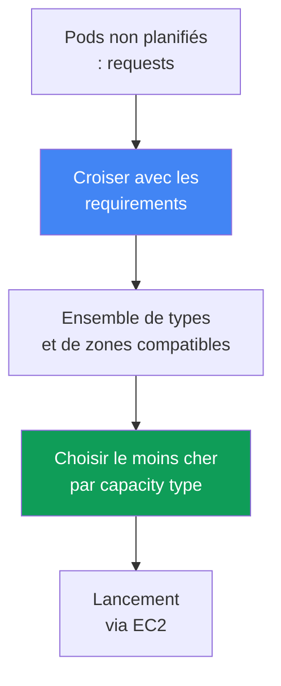
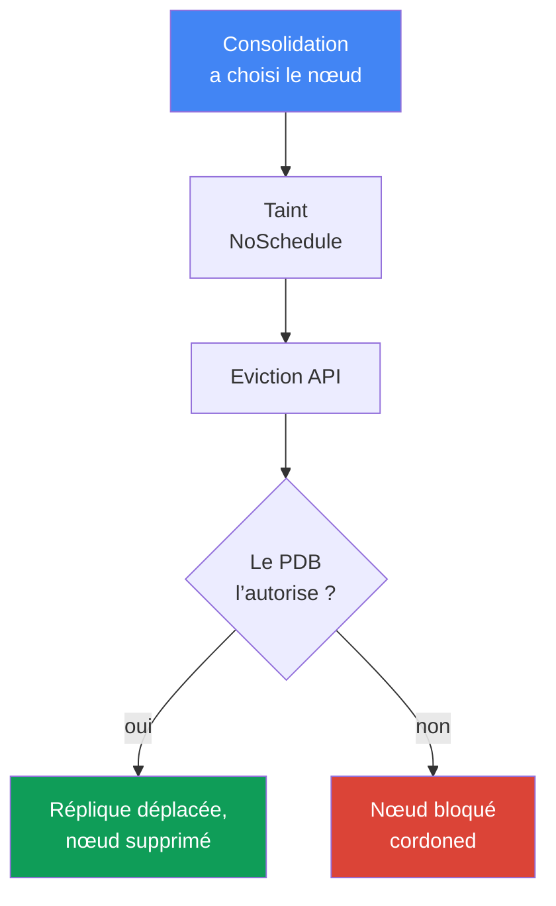

[Русская версия](ru.md) · [Eng version](en.md) · [Versión en español](es.md) · [Deutsche Version](de.md) · [ქართული ვერსია](ge.md) · [繁體中文版](tw.md) · [日本語版](jp.md)
# Chapitre 12. Karpenter : NodePool, EC2NodeClass, disruption, consolidation, drift

> **La suite.** Le chapitre 11 a traité le choix entre Cluster Autoscaler et Karpenter au niveau de
> l’approche, ainsi que le lien entre Karpenter et Auto Mode. Ici, nous passons à la configuration
> concrète : les objets `NodePool` et `EC2NodeClass`, la façon dont Karpenter choisit une instance,
> et surtout le disruption : consolidation, drift et éviction sûre des charges, y compris les
> StatefulSet. Le spot est traité en détail au chapitre 13, l’AMI et le bootstrap au chapitre 10,
> les volumes EBS et l’affinité avec une AZ au chapitre 23, le dimensionnement au chapitre 14 et la
> mise à niveau du cluster au chapitre 38.

## 12.1. « La consolidation a fait tomber un StatefulSet » et « les nœuds ne se mettent pas à jour »

Karpenter est activé, les nœuds sont lancés en fonction de la charge : à première vue, tout
fonctionne. Puis l’une de ces deux situations se produit, et dans les deux cas le même mécanisme
est en cause.

Premier scénario : le trafic diminue, Karpenter compacte le cluster et évince les pods des nœuds
sous-utilisés. Il atteint une réplique de base de données d’un StatefulSet : elle migre avec le
nœud, perdant des données locales ou rompant le quorum. Second scénario, symétrique : une nouvelle
AMI corrige des CVE, les nœuds doivent être mis à jour, mais ils ne changent pas pendant des
semaines, et ce qui bloque leur remplacement n’est pas évident.

```bash
kubectl get nodeclaims
kubectl logs -n kube-system -l app.kubernetes.io/name=karpenter | grep -i disrupt
```

Les deux cas concernent la façon dont Karpenter crée et retire des nœuds : il ne suffit pas de
lancer un nœud, il faut que son remplacement et sa suppression ne fassent pas tomber la charge et
ne restent pas bloqués indéfiniment. C’est l’objet de ce chapitre.

## 12.2. NodePool : le cadre des nœuds créés

Un `NodePool` décrit les limites dans lesquelles Karpenter peut créer des nœuds, ainsi que les
règles de leur cycle de vie. Sans au moins un `NodePool`, Karpenter ne fait rien. Les parties
principales sont les suivantes :

- `template.spec.requirements` : types, zones, architectures et capacity type autorisés via les
  well-known labels (`karpenter.k8s.aws/instance-category`, `kubernetes.io/arch`,
  `topology.kubernetes.io/zone`, `karpenter.sh/capacity-type`).
- `template.metadata.labels` et `template.spec.taints` : labels et taints des nœuds créés.
- `template.spec.nodeClassRef` : référence à `EC2NodeClass` ; `disruption` : politique de
  compactage et budgets (section 12.5) ; `limits` : plafond du pool ; `weight` : priorité du pool
  (plus le poids est élevé, plus tôt il est considéré).

```yaml
apiVersion: karpenter.sh/v1
kind: NodePool
metadata:
  name: default
spec:
  template:
    spec:
      nodeClassRef:
        group: karpenter.k8s.aws
        kind: EC2NodeClass
        name: default
      requirements:
        - key: kubernetes.io/arch
          operator: In
          values: ["amd64"]
        - key: karpenter.k8s.aws/instance-category
          operator: In
          values: ["c", "m", "r"]
        - key: karpenter.sh/capacity-type
          operator: In
          values: ["spot", "on-demand"]
      expireAfter: 720h
  disruption:
    consolidationPolicy: WhenEmptyOrUnderutilized
    consolidateAfter: 1m
```

La documentation recommande de ne pas restreindre `requirements` plus que nécessaire. Plus
l’ensemble de types est large, plus le placement des pods est flexible et plus les charges spot
sont résilientes (chapitre 13).

## 12.3. EC2NodeClass : les spécificités AWS du nœud

`EC2NodeClass` décrit ce qui concerne spécifiquement AWS. Chaque `NodePool` référence une classe ;
plusieurs pools peuvent partager une même classe. Les éléments configurés sont les suivants :

- `amiFamily` : famille d’image (`AL2023`, `Bottlerocket`, `AL2`, `Custom`) : logique de bootstrap
  et block device mappings par défaut ; les détails des images sont au chapitre 10.
- `amiSelectorTerms` : AMI à utiliser, par `alias` (`al2023@latest`), `id`, `name` ou `tags`
  (champ obligatoire). `role` ou `instanceProfile` : identité IAM du nœud (l’un des deux).
- `subnetSelectorTerms`, `securityGroupSelectorTerms` : sous-réseaux et SG par tags ou id (au sein
  d’un term, les conditions sont reliées par AND ; les différents terms, par OR).
- `blockDeviceMappings` : disques ; `metadataOptions` : IMDS, avec par défaut `httpTokens: required`
  (IMDSv2) et `httpPutResponseHopLimit: 1` (durcissement : chapitre 19).

```yaml
apiVersion: karpenter.k8s.aws/v1
kind: EC2NodeClass
metadata:
  name: default
spec:
  amiSelectorTerms:
    - alias: al2023@latest
  role: "KarpenterNodeRole-my-cluster"
  subnetSelectorTerms:
    - tags:
        karpenter.sh/discovery: "my-cluster"
  securityGroupSelectorTerms:
    - tags:
        karpenter.sh/discovery: "my-cluster"
  blockDeviceMappings:
    - deviceName: /dev/xvda
      ebs: {volumeSize: 50Gi, volumeType: gp3, encrypted: true}
  metadataOptions:
    httpTokens: required          # IMDSv2
    httpPutResponseHopLimit: 1
```

| Élément configuré | NodePool | EC2NodeClass |
|---|---|---|
| Types, zones, architectures, capacity type | oui | non |
| Labels et taints des nœuds, politique de disruption | oui | non |
| AMI, famille d’image, bootstrap | non | oui |
| Rôle IAM, sous-réseaux, SG, disques, IMDS | non | oui |

Concernant `alias: al2023@latest` : c’est pratique, mais déconseillé en production : une nouvelle
AMI déclenchera immédiatement du drift sur tous les nœuds. Il vaut mieux épingler une version et
déployer la mise à jour de façon maîtrisée (chapitre 38).

### Placement group : un groupe pour toute la classe

Les nœuds Karpenter peuvent aussi être lancés dans un **placement group** (stratégies : chapitre
0.4). Le groupe est créé à l’avance dans EC2 et la classe le sélectionne, par nom ou par id, l’un
des deux ; la prise en charge est apparue dans Karpenter en juillet 2026 ; les anciennes versions
du contrôleur ne possèdent pas ce champ.

```yaml
spec:
  placementGroupSelector:
    name: training-pg            # ou id: pg-123
```

La propriété qui détermine toute l’architecture est la suivante : **une `EC2NodeClass` correspond
exactement à un groupe**, et toutes ses instances y sont placées. Un indicateur sur une classe
partagée ne suffit pas : pour cette charge, on crée une paire dédiée `NodePool` plus
`EC2NodeClass`, puis on dirige les pods vers le pool à l’aide de sélecteurs et de taints. C’est
également un garde-fou : `cluster` maintient tous les nœuds dans une même zone, ce qui contredit
la répartition sur trois zones (chapitre 40), et un pool distinct limite l’effet à une seule
charge. Avec `cluster`, il est préférable de fixer la zone dans les `requirements` du pool, sinon
elle sera fixée par la première instance. Avec `partition`, le label
`karpenter.k8s.aws/placement-group-partition` est disponible pour répartir les répliques entre
partitions via `topologySpreadConstraints` (mécanisme : chapitre 40).

Deux conditions sont indispensables. Premièrement, les rôles du contrôleur nécessitent les
autorisations `ec2:DescribePlacementGroups` pour découvrir le groupe et `ec2:RunInstances` avec
`ec2:CreateFleet` pour y lancer des instances : avec une ancienne politique, le champ restera
inopérant. Deuxièmement, la limite de `spread` de 7 instances en fonctionnement par zone
(chapitre 0.4) se concilie mal avec la façon dont Karpenter remplace les nœuds : il lance le
remplacement à l’avance, avant de drainer l’ancien (section 12.5). Dans un groupe arrivé à cette
limite, le remplacement ne démarrera pas et le nœud restera en service. Il faut donc planifier la
mise à jour d’AMI d’une charge en `spread` avec une marge de slots, et non compter sur le drift
automatique.

## 12.4. Comment Karpenter choisit une instance

La logique de sélection part des pods, et non de groupes prédécoupés. Karpenter lit les `requests`,
`nodeSelector`, `affinity`, `topologySpreadConstraints` et `tolerations` des pods non planifiés,
les croise avec les `requirements` du `NodePool`, puis obtient un ensemble de types compatibles
dans lequel il prend l’option qui héberge les pods au coût le plus bas.



Si plusieurs capacity types sont autorisés, la priorité est fixe : `reserved` (capacity
reservations), puis `spot`, puis `on-demand` ; en cas de capacité insuffisante, Karpenter passe au
type suivant. D’où la règle : des `requirements` larges sont préférables. Un ou deux types ne
laissent pas de choix : en spot, la fréquence des interruptions augmente (chapitre 13) ; en
on-demand, il existe un risque de manque de capacité du type dans la zone.

### Plusieurs NodePool : quel pool est essayé en premier

Il y a généralement plus d’un pool dans le cluster et, tôt ou tard, un pod correspond à deux pools
à la fois : par exemple, un pool général et un pool de capacité payée à l’avance. Le gagnant est
décidé par `weight` : plus il est élevé, plus tôt le pool est considéré par le planificateur
Karpenter ; un pool sans `weight` vaut zéro.

```yaml
apiVersion: karpenter.sh/v1
kind: NodePool
metadata:
  name: reserved
spec:
  weight: 50            # plus élevé que le pool général, donc essayé en premier
  limits:
    cpu: "200"          # limite atteinte : Karpenter passe au pool général
  template:
    spec:
      requirements:
        - key: node.kubernetes.io/instance-type
          operator: In
          values: ["m6i.2xlarge"]
```

Cette approche résout deux problèmes. **La capacité payée est consommée en premier** : un pool
étroit avec une limite et un poids élevé, puis, après épuisement des `limits`, le travail passe au
pool général. Et **le pool par défaut** pour les pods sans sélecteurs : exigences larges et poids
élevé afin que les pods sans destination soient placés sur une configuration prévisible, tandis que
les pools spécialisés (GPU de la section 12.10, spot du chapitre 13) ne prennent que les leurs via
les taints et sélecteurs.

Deux réserves. Il est préférable que les pools soient **mutuellement exclusifs**, et que le poids
serve à trancher un conflit, non de mécanisme principal de séparation des charges. Et la priorité
**n’est pas garantie** : les pods sont traités par lots, donc un pod qui ne tient pas dans le pool
prioritaire peut partir dans un pool de poids inférieur et entraîner avec lui des voisins de son
lot ; si un nœud compatible existe déjà dans le cluster, les pods seront placés par le
`kube-scheduler` normal et le poids n’interviendra pas du tout.

## 12.5. Disruption : comment Karpenter retire et remplace les nœuds

Le disruption est la façon dont Karpenter met fin volontairement à l’exécution des nœuds. Le
contrôleur exécute une méthode à la fois, dans un ordre strict : **d’abord Drift, puis
Consolidation** (auxquels s’ajoutent les Expiration et Interruption forcées). Cet ordre est
important pour le diagnostic : si un nœud est à la fois en drift et sous-utilisé, Karpenter traite
d’abord le drift. Pour toute méthode volontaire, il applique au nœud le taint
`karpenter.sh/disrupted:NoSchedule`, lance le remplacement à l’avance et ne draine l’ancien nœud
qu’ensuite via la Kubernetes Eviction API, donc en respectant les PDB.

**Consolidation** : compactage actif pour réduire les coûts. Elle est contrôlée par
`consolidationPolicy` (quels nœuds considérer) et `consolidateAfter` (combien de temps attendre
la stabilité du nœud ; le minuteur est réinitialisé à chaque ajout ou retrait de pod ; `Never`
désactive la consolidation).

| consolidationPolicy | Nœuds concernés | Quand choisir |
|---|---|---|
| `WhenEmpty` | seulement les nœuds vides (uniquement DaemonSet et pods « peu coûteux ») | le mode le plus prudent est requis |
| `WhenEmptyOrUnderutilized` | nœuds vides et sous-utilisés : les retirer ou les remplacer à moindre coût | économies maximales |

Il n’existe exactement que deux valeurs de `consolidationPolicy` en v1. Il n’y a pas de mode « de
compromis » sous forme de politique distincte : avec `WhenEmptyOrUnderutilized`, Karpenter évalue
lui-même le gain et applique trois méthodes  -  retrait des nœuds vides, consolidation single-node
et multi-node  -  en n’interrompant le nœud que si le remplacement coûte moins cher.

**Drift** : alignement du nœud sur l’état désiré ; un nœud est en drift si les valeurs de son
`NodeClaim` divergent du `NodePool` ou de l’`EC2NodeClass`. Les champs de drift sont :
`requirements` du `NodePool`, ainsi que `subnetSelectorTerms`, `securityGroupSelectorTerms` et
`amiSelectorTerms` de l’`EC2NodeClass`. Le déclencheur le plus courant est une nouvelle AMI. Les
champs de comportement (`weight`, `limits`, `disruption.*`) n’affectent pas le drift.

## 12.6. Contrôler l’éviction : avec quoi la ralentir, et avec quoi ne pas le faire

C’est ici que se joue la différence entre « la charge est tombée » et « tout est bloqué pour
toujours ». Il existe quatre outils.

**PodDisruptionBudget (PDB)** : le frein principal. Karpenter draine un nœud via l’Eviction API,
donc un pod avec un PDB bloquant ne sera pas évincé lors d’une interruption volontaire. Pour un
StatefulSet, `maxUnavailable: 1` est typique. Tant que le PDB ne permet pas d’évincer le pod, le
nœud porte déjà le taint `karpenter.sh/disrupted:NoSchedule` (cordoned), mais n’est pas supprimé :
il reste dans cet état :

```bash
kubectl describe node <node> | grep -A2 Unconsolidatable
# Normal  Unconsolidatable  ...  pdb default/db-pdb prevents pod evictions
```

Subtilité : si un pod relève de plusieurs PDB, ou si le nœud contient des pods de PDB différents,
tous ces PDB doivent simultanément autoriser l’éviction. Un seul PDB bloquant retient tout le
nœud.

**L’annotation `karpenter.sh/do-not-disrupt` sur un pod** protège tout le nœud contre une
interruption volontaire tant que le pod vit : `
"true"` : en permanence, une durée (`"30m"`) : temporairement après le démarrage du pod. La
même annotation peut être appliquée à un `NodeClaim` ou à un nœud.

**Les disruption budgets dans `NodePool`** limitent le rythme des interruptions : proportion ou
nombre de nœuds interrompus simultanément (`nodes: "20%"` ou `nodes: "5"`), éventuellement avec
une fenêtre planifiée (`schedule` en cron plus `duration`) pendant les heures calmes. Par défaut,
le budget `nodes: 10%` s’applique. Le budget est associé à une raison via `reasons` : `Drifted`,
`Underutilized`, `Empty`.

```yaml
  disruption:
    consolidationPolicy: WhenEmptyOrUnderutilized
    budgets:
      - nodes: "20%"
      - schedule: "0 9 * * mon-fri"
        duration: 8h
        nodes: "0"
```

**`terminationGracePeriod` et `expireAfter`** définissent les limites de temps. `expireAfter`
(par défaut `720h`) est la durée de vie maximale d’un nœud, après laquelle il est drainé de force.
`terminationGracePeriod` est la limite du drainage : une fois écoulée, les pods restants sont
supprimés de force (lien avec l’arrêt gracieux de l’application). Ensemble, ils définissent le
plafond de durée de vie du nœud.

| Mécanisme | Niveau | Consolidation | Drift | Forcé (expiration/interruption) |
|---|---|---|---|---|
| PDB | pod | ralentit | ralentit (sans `terminationGracePeriod`) | non |
| `do-not-disrupt` sur le pod | pod/nœud | ralentit | ralentit (sans `terminationGracePeriod`) | non |
| disruption budget | NodePool | ralentit | ralentit | non (expiration ignore les budgets) |
| `terminationGracePeriod` | NodePool | limite le drainage | lève le blocage PDB/do-not-disrupt | limite le drainage |

La colonne de droite est critique : les méthodes forcées ne peuvent être arrêtées ni par les
budgets ni par les annotations. Expiration et Interruption commencent immédiatement le drainage ;
elles ne peuvent être atténuées qu’au niveau de l’application via les PDB.

## 12.7. Éviction sûre d’un StatefulSet lors de la consolidation

Reprenons correctement le scénario de 12.1 : un StatefulSet de base de données, consolidation
activée, et le compactage ne doit pas faire tomber le quorum. Sans PDB, la réplique est évincée
immédiatement : le quorum est menacé. Avec un PDB `maxUnavailable: 1`, Karpenter évince les
répliques strictement une par une, en attendant le rétablissement de chacune. Mais si la
consolidation veut retirer simultanément plusieurs nœuds avec des répliques, le PDB bloque une
partie des évictions et les nœuds restent cordoned.



L’éviction bloquée est visible dans les logs et événements :

```bash
kubectl logs -n kube-system -l app.kubernetes.io/name=karpenter -f | grep -i pdb
kubectl get pdb -A
```

La configuration correcte se compose de trois éléments, et non d’un seul :

- **PDB** `maxUnavailable: 1` sur le StatefulSet : éviction une par une et préservation du quorum ;
- **disruption budget** dans le `NodePool` : limite le rythme afin que Karpenter ne touche pas
  d’un coup tous les nœuds contenant des répliques (`nodes: "20%"` plus une fenêtre calme aux
  heures de travail) ;
- **`do-not-disrupt`** : de façon ciblée, uniquement là où l’interruption est inacceptable
  (leader, migration, longue tâche batch), et non partout.

## 12.8. Piège : une protection stricte bloque non seulement la consolidation, mais aussi le drift

L’erreur la plus insidieuse découle du tableau 12.6. Les PDB et `do-not-disrupt` ralentissent
l’ensemble des interruptions volontaires : consolidation et **drift**. Un ingénieur met
`do-not-disrupt: "true"` sur tous les pods, ou un PDB `maxUnavailable: 0`, afin que « rien ne soit
touché » : il obtient alors le second scénario de 12.1, les nœuds ne se mettent pas à jour.

La logique est la suivante : une nouvelle AMI est publiée, les anciens nœuds sont marqués drifted,
Karpenter veut les remplacer, mais le drainage est bloqué. Les nœuds restent sur l’ancienne image
pendant des semaines : les CVE non corrigées s’accumulent, les versions de kubelet et des
composants prennent du retard, et la dette augmente. Lors d’une mise à niveau du cluster (chapitre
38), cela se transforme en mise à jour de nœuds bloquée.

La solution est `terminationGracePeriod` sur le `NodePool` : lorsqu’il est défini, un nœud en drift
est remplacé même avec des PDB bloquants ou l’annotation `do-not-disrupt`, et les pods sont
supprimés de force à la fin de la période. C’est un garde-fou pour les mises à jour critiques (AMI
avec correction de CVE). La documentation avertit explicitement de ne pas définir `expireAfter`
sans `terminationGracePeriod` en présence de `do-not-disrupt`, sinon vous obtiendrez des nœuds
partiellement drainés qui resteront bloqués à jamais. L’équilibre consiste à protéger la charge
exactement autant que nécessaire et à toujours définir `terminationGracePeriod`.

## 12.9. Interaction avec les volumes EBS : affinité avec une zone

Un piège distinct concerne les StatefulSet avec des volumes EBS. Un volume EBS vit dans une AZ
précise et ne peut pas être monté sur une instance d’une autre zone ; une réplique est donc liée,
via son PVC, à la zone de son volume.

Conséquence pour la consolidation : Karpenter ne peut pas déplacer cette réplique vers une autre AZ
pour compacter : le nouveau nœud doit être lancé dans la même zone que le volume. S’il n’y a rien à
compacter dans cette zone, la réplique reste en place : c’est normal, pas une défaillance. Lors du
remplacement d’un nœud (drift, expiration), le nouveau est lancé dans la même AZ, le volume est
rattaché et le pod revient.

D’où cette pratique : la topologie est conçue à l’avance  -  les répliques sont réparties entre les
zones via `topologySpreadConstraints`, et les volumes sont créés avec
`volumeBindingMode: WaitForFirstConsumer` afin que le provisioning ait lieu dans la zone du nœud
choisi. Le mécanisme de StorageClass et de `allowedTopologies` est décrit au chapitre 23.

## 12.10. GPU et charges AI : un NodePool distinct pour les accélérateurs

Les instances GPU (`g5`, `p4d`, `p5`) sont coûteuses et rares ; les pods ordinaires n’ont rien à y
faire. L’approche est la même partout : un `NodePool` distinct avec des `requirements` étroits sur
la famille GPU, ainsi qu’un taint pour que le nœud ne soit occupé que par les pods qui ont vraiment
besoin d’un GPU.

```yaml
apiVersion: karpenter.sh/v1
kind: NodePool
metadata: {name: gpu}
spec:
  template:
    spec:
      nodeClassRef: {group: karpenter.k8s.aws, kind: EC2NodeClass, name: gpu}
      requirements:
        - key: karpenter.k8s.aws/instance-family
          operator: In
          values: ["g5", "p4d", "p5"]
      taints:
        - key: nvidia.com/gpu
          effect: NoSchedule
```

Un pod sans toleration ne sera pas planifié sur ce nœud ; un pod GPU tolère le taint et demande
explicitement la ressource :

```yaml
  tolerations:
    - {key: nvidia.com/gpu, operator: Exists, effect: NoSchedule}
  containers:
    - name: train
      resources:
        limits: {nvidia.com/gpu: 1}
```

La ressource `nvidia.com/gpu` est publiée par le plugin de périphérique NVIDIA, un DaemonSet sur
les nœuds GPU (dans l’AMI GPU optimisée EKS ou en tant qu’add-on séparé ; intégré à Auto Mode,
chapitre 11). Tant que le plugin n’est pas lancé, le GPU n’est pas visible par le planificateur.
Karpenter remarque le pod pending avec des `requests` sur `nvidia.com/gpu` et lance pour lui un
nœud GPU depuis ce pool.

Une charge d’entraînement ayant besoin de capacité GPU rare garantie est associée à EC2 Capacity
Blocks for ML (chapitre 0.4) : Karpenter obtient la capacité réservée via
`capacityReservationSelectorTerms` dans `EC2NodeClass`, et `reserved` est prioritaire parmi les
capacity types (section 12.4). Pour l’entraînement distribué, on ajoute à cela un placement group
avec la stratégie `cluster` dans la même classe (section 12.3) : les nœuds sont placés à proximité
dans une même zone et leur latence mutuelle est minimale.

## 12.11. Exploitation : observabilité et erreurs courantes

Voici quoi consulter dans un cluster en fonctionnement quand Karpenter ne se comporte pas comme
prévu :

```bash
kubectl get nodepools
kubectl get ec2nodeclasses
kubectl get nodeclaims
kubectl logs -n kube-system -l app.kubernetes.io/name=karpenter -f
kubectl describe node <node>            # événements Unconsolidatable
```

Un `NodeClaim` est une demande de Karpenter pour un nœud concret ; la chaîne
`NodePool -> NodeClaim -> Node` indique à qui appartient le nœud. Karpenter exporte des métriques
Prometheus (notamment sur la consolidation) pour les tableaux de bord (chapitre 33). Erreurs
courantes :

- **Les nœuds ne se consolident pas** : événement `Unconsolidatable` avec la raison
  `pdb ... prevents pod evictions` (PDB bloquant) ou
  `can't replace with a lower-priced node` (aucun remplacement moins cher).
- **Les nœuds ne se mettent pas à jour (drift bloqué)** : PDB stricts ou `do-not-disrupt` sans
  `terminationGracePeriod` (section 12.8).
- **`EC2NodeClass` not Ready** : sous-réseaux, SG ou AMI introuvables ; consulter
  `status.conditions`. Tant que la classe n’est pas Ready, les pools qui la référencent ne
  participent pas à la planification.
- **`requirements` trop étroits** : aucun type ne peut être choisi, les pods restent en `Pending`.

## 12.12. Comment l’appliquer en production

- **Conserver des `requirements` larges**, en les restreignant seulement si nécessaire : choix de
  types, placement dense, résilience spot (chapitre 13).
- **Épingler la version d’AMI**, et non `@latest` en production : déployer la mise à jour de façon
  maîtrisée via un drift contrôlé (chapitre 38).
- **Protéger les StatefulSet avec l’association PDB plus disruption budget** : le PDB permet une
  éviction une par une, le budget limite le rythme et définit les fenêtres calmes.
- **Toujours définir `terminationGracePeriod`** s’il existe `do-not-disrupt` ou des PDB stricts :
  c’est le garde-fou afin que le drift et les mises à jour ne restent pas bloqués.
- **Appliquer `do-not-disrupt` de façon ciblée**, aux pods critiques précis et non à tout le
  namespace.
- **Prévoir à l’avance la topologie par AZ**, en sachant que la consolidation ne déplace pas les
  volumes EBS entre zones.

## 12.13. Mini-glossaire

- **NodePool** : CRD (`karpenter.sh/v1`) qui définit les limites des nœuds : `requirements`,
  `limits`, `weight`, labels/taints, politique de disruption.
- **EC2NodeClass** : CRD (`karpenter.k8s.aws/v1`) avec les paramètres AWS : AMI, rôle IAM,
  sous-réseaux et SG, disques, IMDS.
- **NodeClaim** : demande de Karpenter pour un nœud concret ; lie le `NodePool` et le `Node` réel.
- **Consolidation** : compactage volontaire pour réduire les coûts ; politiques `WhenEmpty` et
  `WhenEmptyOrUnderutilized`, méthodes empty/single/multi-node, paramètre `consolidateAfter`.
- **Drift** : divergence d’un nœud de l’état désiré (nouvelle AMI, sélecteurs modifiés ou
  `requirements`) ; il est exécuté avant la consolidation.
- **Disruption budget** : limite du rythme des interruptions volontaires : proportion/nombre de
  nœuds, fenêtres par `schedule` et `duration`, association à `reasons`.
- **`terminationGracePeriod`** : limite du drainage d’un nœud ; lorsqu’il est défini, le drift se
  poursuit même à travers des PDB bloquants et `do-not-disrupt`.
- **`placementGroupSelector`** : champ de `EC2NodeClass` qui sélectionne un placement group par
  nom ou id. Une classe correspond exactement à un groupe ; une telle charge vit donc dans sa
  propre paire `NodePool` plus `EC2NodeClass`.

## 12.14. Récapitulatif du chapitre

- `NodePool` définit le cadre des nœuds, `EC2NodeClass` les spécificités AWS (AMI, rôle,
  sous-réseaux, SG, disques, IMDS). Une même classe peut être partagée par plusieurs pools.
- Karpenter choisit l’instance à partir des pods : il croise les requests avec les `requirements`
  et prend la moins chère. Priorité des capacity types : `reserved`, `spot`, `on-demand`.
- Le disruption procède par une méthode à la fois : d’abord Drift, puis Consolidation (auxquels
  s’ajoutent les Expiration et Interruption forcées). La consolidation est contrôlée par
  `consolidationPolicy` et `consolidateAfter`.
- L’éviction est ralentie par les PDB (frein principal), `do-not-disrupt` (protège tout le nœud)
  et les disruption budgets (rythme et fenêtres) ; les méthodes forcées ne peuvent être arrêtées
  par ces moyens.
- Les StatefulSet sont évincés en sécurité grâce à PDB plus disruption budget plus
  `do-not-disrupt` ciblé ; une éviction bloquée apparaît sous la forme d’un nœud cordoned et d’un
  événement `Unconsolidatable`.
- Une protection trop stricte bloque non seulement la consolidation, mais aussi le drift : les
  nœuds ne sont pas mis à jour et les CVE s’accumulent. Le garde-fou est
  `terminationGracePeriod`.
- La consolidation ne déplace pas les répliques StatefulSet entre AZ, car le volume EBS est lié à
  sa zone (chapitre 23).

## 12.15. Utilité dans le travail réel

En astreinte, les deux symptômes de 12.1 se diagnostiquent rapidement. « Le nœud reste cordoned et
n’est pas supprimé » : exécutez `kubectl describe node` pour l’événement `Unconsolidatable` et
`kubectl get pdb` ; un PDB ou l’annotation `do-not-disrupt` bloque presque toujours. « Les nœuds
ne se mettent pas à jour après une nouvelle AMI » : même cause côté drift ; vérifiez l’existence
d’une protection globale sans `terminationGracePeriod`. Lors de la conception, ce chapitre évite
deux extrêmes : un StatefulSet sans PDB (la consolidation fait tomber la charge) et un
`do-not-disrupt` généralisé (le drift s’arrête). Le juste milieu est un PDB par charge critique, un
disruption budget avec des fenêtres calmes et `terminationGracePeriod` comme garde-fou.

## 12.16. Questions d’auto-évaluation

1. Que décrit `NodePool` et que décrit `EC2NodeClass` ? Pourquoi ont-ils été séparés en deux objets ?
2. Comment Karpenter choisit-il un type d’instance, et pourquoi des `requirements` larges sont-ils
   préférables à des exigences étroites ?
3. Un pod correspond à deux `NodePool`. Que décide `weight`, et pourquoi ne peut-on pas s’y fier
   comme règle stricte de séparation des charges ?
4. Dans quel ordre les méthodes de disruption sont-elles exécutées, et pourquoi est-ce important
   pour le diagnostic ?
5. Quelle est la différence entre `WhenEmpty` et `WhenEmptyOrUnderutilized`, et quelles méthodes
   la consolidation applique-t-elle ? Que fait `consolidateAfter` ?
6. Qu’est-ce que le drift, quelles modifications le déclenchent et quels champs ne l’affectent pas ?
7. Comment un PDB ralentit-il l’éviction et qu’arrive-t-il au nœud quand il ne permet pas d’évincer
   un pod ?
8. Que protège `karpenter.sh/do-not-disrupt` et à quel niveau agit-il ?
9. Comment fonctionnent les disruption budgets et peut-on arrêter expiration ou interruption avec eux ?
10. Comment évincer un StatefulSet en sécurité lors de la consolidation ? De quelles parties se
    compose la configuration ?
11. Pourquoi une protection stricte bloque-t-elle non seulement la consolidation, mais aussi le
    drift, et en quoi est-ce dangereux ?
12. Comment `terminationGracePeriod` lève-t-il le blocage et pourquoi la consolidation ne déplace-t-elle
    pas un volume EBS vers une autre AZ ?
13. Pourquoi une charge destinée à un placement group est-elle placée dans une paire distincte
    `NodePool` et `EC2NodeClass`, plutôt que d’activer le groupe dans une classe partagée ?

## Pratique

Le lab du cours associé à ce sujet : [lab 123  -  Karpenter : NodePool, consolidation, drift et
éviction sûre de StatefulSet](../../labs/123/README_FR.MD). Karpenter est également traité dans le
[lab 106  -  EBS CSI : gp3, affinité avec une AZ, extension, snapshot](../../labs/106/README_FR.MD)
dans le contexte des volumes zonaux. En outre, la configuration de Karpenter peut être observée sur
un cluster en fonctionnement (y compris dans Auto Mode, chapitre 11). Commencez par
l’inventaire : `kubectl get nodepools`, `kubectl get ec2nodeclasses`, `kubectl get nodeclaims`.
Examinez le bloc `spec.disruption` de votre `NodePool` : quelle `consolidationPolicy`, y a-t-il des
`budgets` et un `terminationGracePeriod` ?

Ensuite, suivez le diagnostic des sections 12.7 et 12.8 sans nuire au cluster. Trouvez un
StatefulSet et vérifiez `kubectl get pdb -A` : possède-t-il un PDB et quelle est sa valeur
`maxUnavailable` ? Consultez les logs de
`kubectl logs -n kube-system -l app.kubernetes.io/name=karpenter` et les événements des nœuds
pour rechercher `Unconsolidatable`. Étudiez séparément le lab Karpenter plus ancien du dépôt
([Karpenter](../../labs/02/README_FR.MD)) : il ne fait pas partie du cours, mais le sujet se
recoupe.

---
[Table des matières](../README_FR.md) · [Chapitre 11](../11/fr.md) · [Chapitre 13](../13/fr.md)