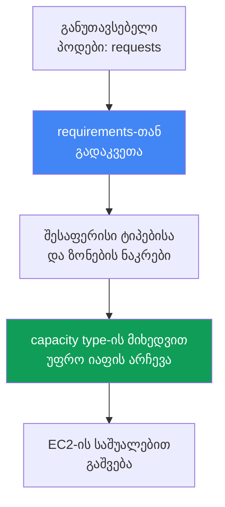
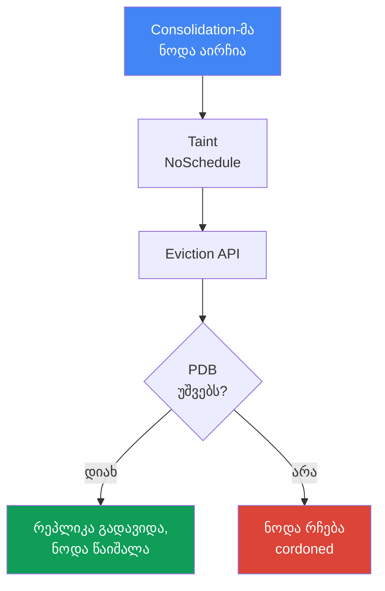

[Русская версия](ru.md) · [Eng version](en.md) · [Versión en español](es.md) · [Version française](fr.md) · [Deutsche Version](de.md) · [繁體中文版](tw.md) · [日本語版](jp.md)
# თავი 12. Karpenter: NodePool, EC2NodeClass, disruption, consolidation, drift

> **რა არის შემდეგ.** მე-11 თავში Cluster Autoscaler-სა და Karpenter-ს შორის არჩევანი მიდგომის
> დონეზე და Karpenter-ის Auto Mode-თან კავშირი განვიხილეთ. აქ უშუალო კონფიგურაციას შევეხებით:
> `NodePool` და `EC2NodeClass` ობიექტებს, იმას, თუ როგორ ირჩევს Karpenter ინსტანსს, და მთავარს -
> disruption-ს: consolidation, drift და დატვირთვების, მათ შორის StatefulSet-ის, უსაფრთხო
> გამოდევნას. Spot უშუალოდ მე-13 თავში განიხილება, AMI და bootstrap - მე-10 თავში, EBS ტომები
> და AZ-ზე მიბმა - 23-ე თავში, საიზინგი - მე-14 თავში, კლასტერის განახლება კი - 38-ე თავში.

## 12.1. „Consolidation-მა StatefulSet გათიშა“ და „ნოდები არ ახლდება“

Karpenter ჩართულია, დატვირთვისთვის ნოდები იშვება - ერთი შეხედვით ყველაფერი მუშაობს. შემდეგ კი
ორი შემთხვევიდან ერთ-ერთი ხდება და ორივეჯერ მიზეზი ერთი და იგივე მექანიზმია.

პირველი სცენარი: ტრაფიკი შემცირდა, Karpenter კლასტერს ამჭიდროებს და ნაკლებად დატვირთული
ნოდებიდან პოდებს გამოდევნის. პროცესი StatefulSet-ში არსებული მონაცემთა ბაზის რეპლიკამდე მიდის,
რომელიც ნოდასთან ერთად გადადის, ადგილობრივ მონაცემებს კარგავს ან კვორუმს არღვევს. მეორე,
სარკისებური სცენარი: გამოვიდა ახალი AMI, რომელშიც CVE-ები დახურულია, ნოდები უნდა განახლდეს,
მაგრამ კვირების განმავლობაში არ იცვლება, ხოლო რა ბლოკავს ჩანაცვლებას - გაურკვეველია.

```bash
kubectl get nodeclaims
kubectl logs -n kube-system -l app.kubernetes.io/name=karpenter | grep -i disrupt
```

ორივე შემთხვევა იმას ეხება, თუ როგორ ქმნის და შლის Karpenter ნოდებს: ნოდის გაშვება საკმარისი
არ არის, საჭიროა, რომ მისმა ჩანაცვლებამ და წაშლამ დატვირთვა არ გათიშოს და სამუდამოდ არ გაიჭედოს.
ეს თავი სწორედ ამას ეხება.

## 12.2. NodePool: ჩარჩოები შესაქმნელი ნოდებისთვის

`NodePool` აღწერს საზღვრებს, რომელთა ფარგლებშიც Karpenter-ს ნოდების შექმნა შეუძლია, და მათი
სასიცოცხლო ციკლის წესებს. სულ მცირე ერთი `NodePool`-ის გარეშე Karpenter არაფერს აკეთებს.
ძირითადი ნაწილებია:

- `template.spec.requirements` - ნებადართული ტიპები, ზონები, არქიტექტურები და capacity type
  well-known labels-ის საშუალებით (`karpenter.k8s.aws/instance-category`, `kubernetes.io/arch`,
  `topology.kubernetes.io/zone`, `karpenter.sh/capacity-type`).
- `template.metadata.labels` და `template.spec.taints` - შესაქმნელი ნოდების ნიშნულები და taint-ები.
- `template.spec.nodeClassRef` - ბმული `EC2NodeClass`-ზე; `disruption` - შემჭიდროების პოლიტიკა და
  ბიუჯეტები (სექცია 12.5); `limits` - პულის ზედა ზღვარი; `weight` - პულის პრიორიტეტი (რაც უფრო
  მაღალია წონა, მით უფრო ადრე განიხილება პული).

```yaml
apiVersion: karpenter.sh/v1
kind: NodePool
metadata:
  name: default
spec:
  template:
    spec:
      nodeClassRef:
        group: karpenter.k8s.aws
        kind: EC2NodeClass
        name: default
      requirements:
        - key: kubernetes.io/arch
          operator: In
          values: ["amd64"]
        - key: karpenter.k8s.aws/instance-category
          operator: In
          values: ["c", "m", "r"]
        - key: karpenter.sh/capacity-type
          operator: In
          values: ["spot", "on-demand"]
      expireAfter: 720h
  disruption:
    consolidationPolicy: WhenEmptyOrUnderutilized
    consolidateAfter: 1m
```

დოკუმენტაციის რეკომენდაციაა, `requirements` საჭიროზე მეტად არ შეიზღუდოს. რაც უფრო ფართოა
ტიპების ნაკრები, მით უფრო მოქნილია პოდების განლაგება და მით უფრო მდგრადია spot-დატვირთვები
(თავი 13).

## 12.3. EC2NodeClass: ნოდის AWS-სპეციფიკა

`EC2NodeClass` აღწერს უშუალოდ AWS-თან დაკავშირებულ პარამეტრებს. თითოეული `NodePool` ერთ კლასზე
მიუთითებს; რამდენიმე პულს ერთი კლასის გაზიარება შეუძლია. მასში განისაზღვრება:

- `amiFamily` - გამოსახულების ოჯახი (`AL2023`, `Bottlerocket`, `AL2`, `Custom`): bootstrap-ის
  ლოგიკა და ნაგულისხმევი block device mappings; გამოსახულებების დეტალები მე-10 თავშია.
- `amiSelectorTerms` - რომელი AMI-ები გამოიყენოს: `alias`-ის (`al2023@latest`), `id`-ის, `name`-ის
  ან `tags`-ის მიხედვით (სავალდებულო ველი). `role` ან `instanceProfile` - ნოდის IAM-იდენტობა
  (ერთ-ერთი მათგანი).
- `subnetSelectorTerms`, `securityGroupSelectorTerms` - ქვექსელები და SG-ები ტეგების ან id-ის
  მიხედვით (ერთი term-ის შიგნით პირობები AND-ით, სხვადასხვა terms კი OR-ით ერთიანდება).
- `blockDeviceMappings` - დისკები; `metadataOptions` - IMDS, ნაგულისხმევად
  `httpTokens: required` (IMDSv2) და `httpPutResponseHopLimit: 1` (ჰარდენინგი - თავი 19).

```yaml
apiVersion: karpenter.k8s.aws/v1
kind: EC2NodeClass
metadata:
  name: default
spec:
  amiSelectorTerms:
    - alias: al2023@latest
  role: "KarpenterNodeRole-my-cluster"
  subnetSelectorTerms:
    - tags:
        karpenter.sh/discovery: "my-cluster"
  securityGroupSelectorTerms:
    - tags:
        karpenter.sh/discovery: "my-cluster"
  blockDeviceMappings:
    - deviceName: /dev/xvda
      ebs: {volumeSize: 50Gi, volumeType: gp3, encrypted: true}
  metadataOptions:
    httpTokens: required          # IMDSv2
    httpPutResponseHopLimit: 1
```

| რა კონფიგურირდება | NodePool | EC2NodeClass |
|---|---|---|
| ტიპები, ზონები, არქიტექტურები, capacity type | დიახ | არა |
| ნოდების labels და taints, disruption-ის პოლიტიკა | დიახ | არა |
| AMI, გამოსახულების ოჯახი, bootstrap | არა | დიახ |
| IAM-როლი, ქვექსელები, SG, დისკები, IMDS | არა | დიახ |

`alias: al2023@latest` მოსახერხებელია, მაგრამ production-ისთვის რეკომენდებული არ არის - ახალი
AMI ყველა ნოდზე მაშინვე გამოიწვევს drift-ს. უმჯობესია ვერსია დააფიქსიროთ და განახლება გააზრებულად
გაავრცელოთ (თავი 38).

### Placement group: ერთი ჯგუფი მთელი კლასისთვის

Karpenter-ის ნოდების **placement group**-ში გაშვებაც შესაძლებელია (სტრატეგიები - თავი 0.4).
ჯგუფი წინასწარ იქმნება EC2-ში, კლასი კი მას სახელით ან id-ით ირჩევს - ამ ორიდან ერთ-ერთით;
Karpenter-ში მხარდაჭერა 2026 წლის ივლისში გამოჩნდა, ამიტომ კონტროლერის ძველ ვერსიებში ეს ველი
ხელმისაწვდომი არ არის.

```yaml
spec:
  placementGroupSelector:
    name: training-pg            # ან id: pg-123
```

მთელ სქემას ერთი თვისება განსაზღვრავს: **ერთი `EC2NodeClass` ზუსტად ერთ ჯგუფს შეესაბამება** და
მისი ყველა ინსტანსი ამ ჯგუფში ხვდება. საერთო კლასზე ერთი ალმით აქ ვერ შემოვიფარგლებით - ასეთი
დატვირთვისთვის ცალკე `NodePool` და `EC2NodeClass` წყვილი იქმნება, პოდები კი პულში selectors-ითა
და taints-ით მიემართება. ეს დამცავი მექანიზმიცაა: `cluster` ყველა ნოდას ერთ ზონაში აჩერებს,
რაც სამ ზონაზე განაწილებას ეწინააღმდეგება (თავი 40), ცალკე პული კი ეფექტს ერთი დატვირთვით
ზღუდავს. `cluster`-ის გამოყენებისას ზონა უმჯობესია პულის `requirements`-ში დაფიქსირდეს,
წინააღმდეგ შემთხვევაში მას პირველი ინსტანსი დააფიქსირებს. `partition`-ისთვის ხელმისაწვდომია
ნიშნული `karpenter.k8s.aws/placement-group-partition`, რომლის მიხედვითაც რეპლიკები
`topologySpreadConstraints`-ით პარტიციებს შორის ნაწილდება (მექანიკა - თავი 40).

ამის მუშაობისთვის ორი რამ არის საჭირო. პირველი: ჯგუფის აღმოსაჩენად კონტროლერის როლს
`ec2:DescribePlacementGroups`, ხოლო მასში გასაშვებად `ec2:RunInstances` და `ec2:CreateFleet`
უფლებები სჭირდება - ძველი პოლიტიკის პირობებში ველი უმოქმედო დარჩება. მეორე: `spread`-ის ზღვარი,
ერთ ზონაში 7 გაშვებული ინსტანსი (თავი 0.4), ცუდად ეწყობა Karpenter-ის მიერ ნოდების ჩანაცვლების
მეთოდს - ის ჩანაცვლებას ძველი ნოდის drain-მდე წინასწარ უშვებს (სექცია 12.5). ზღვრამდე შევსებულ
ჯგუფში შემცვლელი ვერ გაეშვება და ნოდა მუშაობას გააგრძელებს, ამიტომ `spread` დატვირთვის AMI-ის
განახლება თავისუფალი სლოტების მარაგით უნდა დაიგეგმოს და არა ავტომატური drift-ის იმედად.

## 12.4. როგორ ირჩევს Karpenter ინსტანსს

შერჩევის ლოგიკა პოდებიდან იწყება და არა წინასწარ დაყოფილი ჯგუფებიდან. Karpenter განუთავსებელი
პოდებიდან კითხულობს `requests`, `nodeSelector`, `affinity`, `topologySpreadConstraints`,
`tolerations` პარამეტრებს, მათ `NodePool`-ის `requirements`-თან კვეთს და შესაფერისი ტიპების
ნაკრებს იღებს, საიდანაც ირჩევს ვარიანტს, რომელიც პოდებს იტევს და ნაკლები ღირს.



თუ რამდენიმე capacity type არის ნებადართული, პრიორიტეტი ფიქსირებულია: `reserved` (capacity
reservations), შემდეგ `spot`, შემდეგ `on-demand`; სიმძლავრის უკმარისობისას Karpenter მომდევნო
ტიპზე გადადის. აქედან გამომდინარეობს წესი: ფართო `requirements` კარგია. ერთი ან ორი ტიპი არჩევანს
არ ტოვებს: spot-ის შემთხვევაში შეწყვეტების სიხშირე იზრდება (თავი 13), on-demand-ის შემთხვევაში
კი - ზონაში ამ ტიპის სიმძლავრის უკმარისობის რისკი.

### რამდენიმე NodePool: რომელი პული გამოიცდება პირველი

კლასტერში, როგორც წესი, ერთზე მეტი პულია და ადრე თუ გვიან პოდი ერთდროულად ორს შეესაბამება:
მაგალითად, არსებობს საერთო პული და წინასწარ გადახდილი სიმძლავრის პული. რომელი გაიმარჯვებს,
`weight` წყვეტს: რაც უფრო მაღალია ის, მით უფრო ადრე განიხილავს პულს Karpenter-ის დამგეგმავი;
`weight`-ის გარეშე პულის წონა ნულია.

```yaml
apiVersion: karpenter.sh/v1
kind: NodePool
metadata:
  name: reserved
spec:
  weight: 50            # საერთო პულის წონაზე მაღალია, ამიტომ პირველი გამოიცდება
  limits:
    cpu: "200"          # ლიმიტი ამოიწურა - Karpenter საერთო პულზე გადადის
  template:
    spec:
      requirements:
        - key: node.kubernetes.io/instance-type
          operator: In
          values: ["m6i.2xlarge"]
```

ამით ორი ამოცანა წყდება. **წინასწარ გადახდილი სიმძლავრე პირველი გამოიყენება**: ვიწრო პული
ლიმიტითა და მაღალი წონით, `limits`-ის ამოწურვის შემდეგ კი სამუშაო საერთო პულში გადადის. ასევე
იქმნება **ნაგულისხმევი პული** selectors-ის გარეშე პოდებისთვის: ფართო მოთხოვნები და მაღალი წონა
დაუმისამართებელ დატვირთვებს პროგნოზირებად კონფიგურაციაზე განათავსებს, სპეციალიზებული პულები კი
(GPU - 12.10-დან, spot - მე-13 თავიდან) taints-ითა და selectors-ით მხოლოდ საკუთარ დატვირთვებს
მიიღებს.

აქ ორი შენიშვნაა. პულები უმჯობესია **ურთიერთგამომრიცხავი** იყოს, წონა კი კონფლიქტის გადაჭრას
ემსახურებოდეს და არა დატვირთვების განცალკევების ძირითად მექანიზმს. პრიორიტეტი ასევე
**გარანტირებული არ არის**: პოდები ჯგუფებად მუშავდება, ამიტომ პოდი, რომელიც პრიორიტეტულ პულში ვერ
ეტევა, შეიძლება ნაკლები წონის პულში გადავიდეს და თავისი ჯგუფის მეზობელი პოდებიც გაიყოლოს; ხოლო
თუ კლასტერში შესაფერისი ნოდა უკვე არსებობს, პოდებს ჩვეულებრივი `kube-scheduler` განათავსებს და
წონა საერთოდ არ მონაწილეობს.

## 12.5. Disruption: როგორ შლის და ანაცვლებს Karpenter ნოდებს

Disruption არის ის, თუ როგორ წყვეტს Karpenter ნოდების მუშაობას ნებაყოფლობით. კონტროლერი თითო
ჯერზე ერთ მეთოდს და მკაცრი თანმიმდევრობით ასრულებს: **ჯერ Drift, შემდეგ Consolidation** (ამას
ემატება იძულებითი Expiration და Interruption). თანმიმდევრობა დიაგნოსტიკისთვის მნიშვნელოვანია:
თუ ნოდა ერთდროულად drift მდგომარეობაშია და ნაკლებადაა დატვირთული, Karpenter ჯერ drift-ს
მოაგვარებს. ნებისმიერი ნებაყოფლობითი მეთოდისას ის ნოდაზე აყენებს taint-ს
`karpenter.sh/disrupted:NoSchedule`, წინასწარ უშვებს შემცვლელს და მხოლოდ ამის შემდეგ ასრულებს
ძველი ნოდის drain-ს Kubernetes Eviction API-ის საშუალებით - ანუ PDB-ების დაცვით.

**Consolidation** ხარჯის შესამცირებლად აქტიური შემჭიდროებაა. მას მართავს `consolidationPolicy`
(რომელი ნოდები განიხილოს) და `consolidateAfter` (რამდენ ხანს დაელოდოს ნოდის სტაბილურობას; პოდის
დამატების ან წაშლისას ტაიმერი თავიდან იწყება; `Never` consolidation-ს თიშავს).

| consolidationPolicy | რომელ ნოდებს ეხება | როდის ავირჩიოთ |
|---|---|---|
| `WhenEmpty` | მხოლოდ ცარიელს (მხოლოდ DaemonSet და „იაფი“ პოდები) | საჭიროა ყველაზე ფრთხილი რეჟიმი |
| `WhenEmptyOrUnderutilized` | ცარიელსა და ნაკლებად დატვირთულს: წაშლა ან უფრო იაფად ჩანაცვლება | მაქსიმალური ეკონომია |

v1-ში `consolidationPolicy`-ს ზუსტად ორი მნიშვნელობა აქვს. ცალკე „კომპრომისული“ პოლიტიკა არ
არსებობს: `WhenEmptyOrUnderutilized`-ის შემთხვევაში Karpenter სარგებელს თავად აფასებს და სამ
მეთოდს იყენებს - ცარიელი ნოდების წაშლას, single-node და multi-node consolidation-ს - და ნოდას
მხოლოდ მაშინ წყვეტს, თუ ჩანაცვლება იაფია.

**Drift** ნოდის სასურველ მდგომარეობაში მოყვანაა: ნოდა drift მდგომარეობაში გადადის, თუ მის
`NodeClaim`-ში არსებული მნიშვნელობები `NodePool`-ს ან `EC2NodeClass`-ს აღარ ემთხვევა. Drift-ის
ველებია `NodePool`-ში `requirements`, ხოლო `EC2NodeClass`-ში `subnetSelectorTerms`,
`securityGroupSelectorTerms` და `amiSelectorTerms`. ყველაზე ხშირი გამომწვევი ახალი AMI-ა.
ქცევითი ველები (`weight`, `limits`, `disruption.*`) drift-ზე გავლენას არ ახდენს.

## 12.6. გამოდევნის კონტროლი: რით შევაფერხოთ და რით არა

სწორედ აქ არის განსხვავება „დატვირთვა გავთიშეთ“-სა და „სამუდამოდ გავიჭედეთ“-ს შორის. ოთხი
ხელსაწყო არსებობს.

**PodDisruptionBudget (PDB)** მთავარი შემაფერხებელია. Karpenter ნოდის drain-ს Eviction API-ის
საშუალებით ასრულებს, ამიტომ დამბლოკავი PDB-ის მქონე პოდი ნებაყოფლობითი შეწყვეტისას არ
გამოიდევნება. StatefulSet-ისთვის ტიპურია `maxUnavailable: 1`. სანამ PDB პოდის გამოდევნას არ
უშვებს, ნოდა უკვე მონიშნულია taint-ით `karpenter.sh/disrupted:NoSchedule` (cordoned), მაგრამ არ
იშლება და ამ მდგომარეობაში რჩება:

```bash
kubectl describe node <node> | grep -A2 Unconsolidatable
# Normal  Unconsolidatable  ...  pdb default/db-pdb prevents pod evictions
```

ერთი ნიუანსი: თუ პოდი რამდენიმე PDB-ში ხვდება ან ნოდაზე სხვადასხვა PDB-ის პოდებია, ყველა ამ
PDB-მ გამოდევნა ერთდროულად უნდა დაუშვას. ერთი დამბლოკავი PDB მთელ ნოდას აჩერებს.

**პოდზე ანოტაცია `karpenter.sh/do-not-disrupt`** მთელ ნოდას იცავს ნებაყოფლობითი შეწყვეტისგან,
სანამ პოდი ცოცხალია: `"true"` - მუდმივად, ხანგრძლივობა (`"30m"`) - პოდის გაშვების შემდეგ
დროებით. იგივე ანოტაცია შეიძლება `NodeClaim`-ს ან ნოდასაც დაემატოს.

**`NodePool`-ის disruption budgets** შეწყვეტების ტემპს ზღუდავს: ერთდროულად შესაწყვეტი ნოდების
წილი ან რაოდენობა (`nodes: "20%"` ან `nodes: "5"`), სურვილისამებრ გრაფიკის ფანჯრით (`schedule`
cron-ში და `duration`) მშვიდი საათებისთვის. ნაგულისხმევად მოქმედებს ბიუჯეტი `nodes: 10%`.
ბიუჯეტი მიზეზს `reasons`-ის საშუალებით უკავშირდება: `Drifted`, `Underutilized`, `Empty`.

```yaml
  disruption:
    consolidationPolicy: WhenEmptyOrUnderutilized
    budgets:
      - nodes: "20%"
      - schedule: "0 9 * * mon-fri"
        duration: 8h
        nodes: "0"
```

**`terminationGracePeriod` და `expireAfter`** დროის ფარგლებს განსაზღვრავს. `expireAfter`
(ნაგულისხმევად `720h`) ნოდის სიცოცხლის მაქსიმალური ვადაა, რომლის შემდეგაც მისი drain იძულებით
სრულდება. `terminationGracePeriod` drain-ის ზღვარია: მისი ამოწურვის შემდეგ დარჩენილი პოდები
იძულებით იშლება (კავშირი აპლიკაციის graceful shutdown-თან). ერთად ისინი ნოდის სიცოცხლის ზედა
ზღვარს ადგენს.

| მექანიზმი | დონე | Consolidation | Drift | Forceful (expiration/interruption) |
|---|---|---|---|---|
| PDB | პოდი | აფერხებს | აფერხებს (`terminationGracePeriod`-ის გარეშე) | არა |
| `do-not-disrupt` პოდზე | პოდი/ნოდა | აფერხებს | აფერხებს (`terminationGracePeriod`-ის გარეშე) | არა |
| disruption budget | NodePool | აფერხებს | აფერხებს | არა (expiration ბიუჯეტებს უგულებელყოფს) |
| `terminationGracePeriod` | NodePool | drain-ს ზღუდავს | PDB/do-not-disrupt ბლოკს ხსნის | drain-ს ზღუდავს |

მარჯვენა სვეტი კრიტიკულად მნიშვნელოვანია: forceful-მეთოდებს ბიუჯეტებითა და ანოტაციებით ვერ
შეაჩერებთ. Expiration და Interruption drain-ს დაუყოვნებლივ იწყებს; მათი შერბილება მხოლოდ
აპლიკაციის დონეზე PDB-ების საშუალებით შეიძლება.

## 12.7. StatefulSet-ის უსაფრთხო გამოდევნა consolidation-ის დროს

12.1-ის სცენარი სწორად ავაწყოთ: მონაცემთა ბაზის StatefulSet, ჩართული consolidation და
შემჭიდროებამ კვორუმი არ უნდა გათიშოს. PDB-ის გარეშე რეპლიკა დაუყოვნებლივ გამოიდევნება და კვორუმი
საფრთხის ქვეშ დგება. PDB `maxUnavailable: 1`-ით Karpenter რეპლიკებს მკაცრად სათითაოდ გამოდევნის
და თითოეულის აღდგენას დაელოდება. მაგრამ თუ consolidation ერთდროულად რეპლიკებიანი რამდენიმე
ნოდის წაშლას მოინდომებს, PDB გამოდევნების ნაწილს დაბლოკავს და ნოდები cordoned მდგომარეობაში
დარჩება.



დაბლოკილი გამოდევნა ჟურნალებსა და მოვლენებში ჩანს:

```bash
kubectl logs -n kube-system -l app.kubernetes.io/name=karpenter -f | grep -i pdb
kubectl get pdb -A
```

სწორი კონფიგურაცია სამი ნაწილისგან შედგება და არა ერთისგან:

- **PDB** `maxUnavailable: 1` StatefulSet-ისთვის - სათითაო გამოდევნა და კვორუმის შენარჩუნება;
- **disruption budget** `NodePool`-ში - ზღუდავს ტემპს, რათა Karpenter ერთდროულად რეპლიკებიანი
  ყველა ნოდას არ შეეხოს (`nodes: "20%"` და სამუშაო საათებში მშვიდი ფანჯარა);
- **`do-not-disrupt`** - შერჩევითად, მხოლოდ იქ, სადაც შეწყვეტა დაუშვებელია (ლიდერი, მიგრაცია ან
  ხანგრძლივი batch-ამოცანა), და არა ყველაფერზე.

## 12.8. ხაფანგი: მკაცრი დაცვა ბლოკავს არა მხოლოდ consolidation-ს, არამედ drift-საც

ყველაზე მზაკვრული შეცდომა 12.6-ის ცხრილიდან გამომდინარეობს. PDB და `do-not-disrupt` მთლიანად
ნებაყოფლობით შეწყვეტებს აფერხებს - როგორც consolidation-ს, ისე **drift**-ს. ინჟინერი ყველა
პოდზე აყენებს `do-not-disrupt: "true"`-ს ან PDB `maxUnavailable: 0`-ს, რათა „არაფერს შეეხონ“,
და შედეგად 12.1-ის მეორე სცენარს იღებს: ნოდები არ ახლდება.

ლოგიკა ასეთია: გამოვიდა ახალი AMI, ძველი ნოდები drifted-ად მოინიშნა, Karpenter-ს მათი
ჩანაცვლება სურს, მაგრამ drain დაბლოკილია. ნოდები კვირების განმავლობაში ძველ გამოსახულებაზე
რჩება: გროვდება დაუხურავი CVE-ები, kubelet-ისა და კომპონენტების ვერსიები ჩამორჩება და ტექნიკური
ვალი იზრდება. კლასტერის განახლებისას (თავი 38) ეს ნოდების გაჭედილ განახლებად იქცევა.

გამოსავალი `NodePool`-ზე `terminationGracePeriod`-ია: როდესაც ის მითითებულია, ნოდა დამბლოკავი
PDB-ების ან `do-not-disrupt` ანოტაციის მიუხედავად გადადის drift-ში, პერიოდის ამოწურვის შემდეგ
კი პოდები იძულებით იშლება. ეს კრიტიკული განახლებების (AMI CVE-ის შესწორებით) დამცავი
მექანიზმია. დოკუმენტაცია პირდაპირ გვაფრთხილებს: `do-not-disrupt`-ის არსებობისას `expireAfter`
არ უნდა მიეთითოს `terminationGracePeriod`-ის გარეშე, წინააღმდეგ შემთხვევაში ნაწილობრივ drain
შესრულებული ნოდები სამუდამოდ გაჩერდება. ბალანსია დატვირთვის ზუსტად საჭირო დონით დაცვა და
`terminationGracePeriod`-ის ყოველთვის მითითება.

## 12.9. EBS ტომებთან ურთიერთქმედება: ზონაზე მიბმა

ცალკე ხაფანგი EBS ტომების მქონე StatefulSet-ს ეხება. EBS ტომი კონკრეტულ AZ-ში არსებობს და სხვა
ზონის ინსტანსზე ვერ მონტაჟდება, ამიტომ მისი PVC რეპლიკას ტომის ზონაზე აბამს.

შედეგი consolidation-ისთვის: Karpenter მხოლოდ შემჭიდროების მიზნით ასეთ რეპლიკას სხვა AZ-ში ვერ
გადაიტანს - ახალი ნოდა იმავე ზონაში უნდა გაეშვას, სადაც ტომი მდებარეობს. თუ იქ შესამჭიდროებელი
არაფერია, რეპლიკა ადგილზე რჩება - ეს ნორმაა და არა გაუმართაობა. ნოდის ჩანაცვლებისას (drift,
expiration) ახალი ნოდა იმავე AZ-ში იშვება, ტომი ხელახლა ერთდება და პოდი ბრუნდება.

აქედან გამომდინარე, ტოპოლოგია წინასწარ იგეგმება: რეპლიკები ზონებს შორის
`topologySpreadConstraints`-ით ნაწილდება, ტომები კი `volumeBindingMode: WaitForFirstConsumer`-ით
იქმნება, რათა პროვიჟინინგი არჩეული ნოდის ზონაში მოხდეს. StorageClass-ის მექანიკა და
`allowedTopologies` 23-ე თავშია.

## 12.10. GPU და AI-დატვირთვები: ცალკე NodePool ამაჩქარებლებისთვის

GPU-ინსტანსები (`g5`, `p4d`, `p5`) ძვირი და დეფიციტურია, ჩვეულებრივი პოდების ადგილი მათზე არ
არის. მიდგომა იგივეა, რაც სხვაგან: ცალკე `NodePool` GPU-ოჯახის ვიწრო `requirements`-ით და
დამატებული taint-ით, რათა ნოდა მხოლოდ იმ პოდებმა დაიკავოს, რომლებსაც GPU ნამდვილად სჭირდება.

```yaml
apiVersion: karpenter.sh/v1
kind: NodePool
metadata: {name: gpu}
spec:
  template:
    spec:
      nodeClassRef: {group: karpenter.k8s.aws, kind: EC2NodeClass, name: gpu}
      requirements:
        - key: karpenter.k8s.aws/instance-family
          operator: In
          values: ["g5", "p4d", "p5"]
      taints:
        - key: nvidia.com/gpu
          effect: NoSchedule
```

toleration-ის გარეშე პოდი ასეთ ნოდაზე ვერ განთავსდება; GPU-პოდი taint-ს ითმენს და რესურსს
ცხადად ითხოვს:

```yaml
  tolerations:
    - {key: nvidia.com/gpu, operator: Exists, effect: NoSchedule}
  containers:
    - name: train
      resources:
        limits: {nvidia.com/gpu: 1}
```

`nvidia.com/gpu` რესურსს NVIDIA device plugin აქვეყნებს - DaemonSet GPU-ნოდებზე
(EKS-ოპტიმიზებულ GPU AMI-ზე ან ცალკე add-on-ის სახით; Auto Mode-ში ჩაშენებულია, თავი 11).
სანამ plugin არ გაეშვება, დამგეგმავი GPU-ს ვერ ხედავს. Karpenter ამჩნევს `nvidia.com/gpu`-ის
`requests`-ის მქონე pending-პოდს და მისთვის ამ პულიდან GPU-ნოდას უშვებს.

სასწავლო პოდი, რომელსაც დეფიციტური GPU-ს გარანტირებული სიმძლავრე სჭირდება, EC2 Capacity Blocks
for ML-ს უკავშირდება (თავი 0.4): Karpenter დაჯავშნილ სიმძლავრეს `EC2NodeClass`-ის
`capacityReservationSelectorTerms`-ის საშუალებით იღებს, ხოლო capacity type-ის პრიორიტეტში
`reserved` პირველია (სექცია 12.4). განაწილებული სწავლებისთვის ამას იმავე კლასში `cluster`
სტრატეგიის placement group ემატება (სექცია 12.3): ნოდები ერთმანეთთან ახლოს, ერთ ზონაში
თავსდება და მათ შორის დაყოვნება მინიმალურია.

## 12.11. ექსპლუატაცია: დაკვირვება და ტიპური შეცდომები

რას უნდა დავაკვირდეთ ცოცხალ კლასტერში, როდესაც Karpenter მოსალოდნელად არ იქცევა:

```bash
kubectl get nodepools
kubectl get ec2nodeclasses
kubectl get nodeclaims
kubectl logs -n kube-system -l app.kubernetes.io/name=karpenter -f
kubectl describe node <node>            # Unconsolidatable მოვლენები
```

`NodeClaim` კონკრეტულ ნოდაზე Karpenter-ის მოთხოვნაა; ჯაჭვი `NodePool -> NodeClaim -> Node`
აჩვენებს, ვის ეკუთვნის ნოდა. Karpenter dashboard-ებისთვის Prometheus-ის მეტრიკებს (მათ შორის
consolidation-ის მეტრიკებს) აქვეყნებს (თავი 33). ტიპური შეცდომებია:

- **ნოდების consolidation არ სრულდება** - `Unconsolidatable` მოვლენა მიზეზით
  `pdb ... prevents pod evictions` (დამბლოკავი PDB) ან
  `can't replace with a lower-priced node` (უფრო იაფი ჩანაცვლება არ არსებობს).
- **ნოდები არ ახლდება (drift გაიჭედა)** - მკაცრი PDB-ები ან `do-not-disrupt`
  `terminationGracePeriod`-ის გარეშე (სექცია 12.8).
- **`EC2NodeClass` not Ready** - ქვექსელები, SG-ები ან AMI-ები ვერ მოიძებნა; შეამოწმეთ
  `status.conditions`. სანამ კლასი Ready არ არის, მასზე მითითებული პულები დაგეგმვაში არ
  მონაწილეობს.
- **ზედმეტად ვიწრო `requirements`** - შესაფერისი ტიპი ვერ შეირჩევა და პოდები `Pending`
  მდგომარეობაში რჩება.

## 12.12. როგორ იყენებენ ამას production-ში

- **`requirements` ფართოდ ინახება** და მხოლოდ საჭიროებისას ვიწროვდება: ტიპების მეტი არჩევანი,
  მჭიდრო განლაგება და spot-ის მდგრადობა (თავი 13).
- **AMI-ის ვერსია ფიქსირდება** და production-ში `@latest` არ გამოიყენება: განახლება
  კონტროლირებადი drift-ის საშუალებით გააზრებულად ვრცელდება (თავი 38).
- **StatefulSet დაცულია PDB-სა და disruption budget-ის კომბინაციით**: PDB სათითაო გამოდევნას
  უზრუნველყოფს, ბიუჯეტი კი ტემპს ზღუდავს და მშვიდ ფანჯრებს განსაზღვრავს.
- **`terminationGracePeriod` ყოველთვის მიეთითება**, თუ არსებობს `do-not-disrupt` ან მკაცრი
  PDB-ები - როგორც დამცავი მექანიზმი, რათა drift და განახლებები არ გაიჭედოს.
- **`do-not-disrupt` შერჩევითად გამოიყენება** - კონკრეტულ კრიტიკულ პოდებზე და არა მთელ
  namespace-ზე.
- **AZ-ის ტოპოლოგია წინასწარ იგეგმება** იმის გათვალისწინებით, რომ consolidation EBS ტომებს
  ზონებს შორის არ გადააქვს.

## 12.13. მინი-ლექსიკონი

- **NodePool** - CRD (`karpenter.sh/v1`), რომელიც ნოდების საზღვრებს განსაზღვრავს:
  `requirements`, `limits`, `weight`, labels/taints და disruption-ის პოლიტიკა.
- **EC2NodeClass** - CRD (`karpenter.k8s.aws/v1`) AWS-ის პარამეტრებით: AMI, IAM-როლი,
  ქვექსელები და SG-ები, დისკები, IMDS.
- **NodeClaim** - კონკრეტულ ნოდაზე Karpenter-ის მოთხოვნა; `NodePool`-სა და რეალურ `Node`-ს
  აკავშირებს.
- **Consolidation** - ხარჯის შესამცირებლად ნებაყოფლობითი შემჭიდროება; პოლიტიკები `WhenEmpty`
  და `WhenEmptyOrUnderutilized`, მეთოდები empty/single/multi-node და პარამეტრი
  `consolidateAfter`.
- **Drift** - ნოდის სასურველი მდგომარეობიდან აცდენა (ახალი AMI, შეცვლილი selectors ან
  `requirements`); consolidation-მდე სრულდება.
- **Disruption budget** - ნებაყოფლობითი შეწყვეტების ტემპის ლიმიტი: ნოდების წილი/რაოდენობა,
  `schedule` და `duration` ფანჯრები, `reasons`-თან კავშირი.
- **`terminationGracePeriod`** - ნოდის drain-ის ზღვარი; მისი არსებობისას drift დამბლოკავი
  PDB-ებისა და `do-not-disrupt`-ის მიუხედავად სრულდება.
- **`placementGroupSelector`** - `EC2NodeClass`-ის ველი, რომელიც placement group-ს სახელით ან
  id-ით ირჩევს. ერთ კლასს ზუსტად ერთი ჯგუფი აქვს, ამიტომ ასეთი დატვირთვა საკუთარ `NodePool`
  და `EC2NodeClass` წყვილში თავსდება.

## 12.14. თავის შეჯამება

- `NodePool` ნოდების საზღვრებს განსაზღვრავს, `EC2NodeClass` კი - AWS-სპეციფიკას (AMI, როლი,
  ქვექსელები, SG-ები, დისკები, IMDS). ერთი კლასი რამდენიმე პულმა შეიძლება გაიზიაროს.
- Karpenter ინსტანსს პოდებიდან გამომდინარე ირჩევს: requests-ს `requirements`-თან კვეთს და
  უფრო იაფ ვარიანტს იღებს. Capacity type-ის პრიორიტეტია: `reserved`, `spot`, `on-demand`.
- Disruption თითო ჯერზე ერთი მეთოდით სრულდება: ჯერ Drift, შემდეგ Consolidation (და იძულებითი
  Expiration და Interruption). Consolidation-ს `consolidationPolicy` და `consolidateAfter`
  მართავს.
- გამოდევნას აფერხებს PDB (მთავარი შემაფერხებელი), `do-not-disrupt` (მთელ ნოდას იცავს) და
  disruption budgets (ტემპი და ფანჯრები); forceful-მეთოდებს ეს მექანიზმები ვერ შეაჩერებს.
- StatefulSet-ის უსაფრთხო გამოდევნა PDB-ს, disruption budget-ისა და შერჩევითი
  `do-not-disrupt`-ის კომბინაციით ხდება; დაბლოკილი გამოდევნა ჩანს, როგორც cordoned-ნოდა და
  `Unconsolidatable` მოვლენა.
- ზედმეტად მკაცრი დაცვა არა მხოლოდ consolidation-ს, არამედ drift-საც ბლოკავს: ნოდები არ
  ახლდება და CVE-ები გროვდება. დამცავი მექანიზმია `terminationGracePeriod`.
- Consolidation StatefulSet-ის რეპლიკებს AZ-ებს შორის არ გადაიტანს, რადგან EBS ტომი ზონაზეა
  მიბმული (თავი 23).

## 12.15. როგორ გამოგადგებათ ეს რეალურ სამუშაოში

მორიგეობისას 12.1-ის ორივე სიმპტომის სწრაფად დიაგნოსტირება შეიძლება. „ნოდა cordoned
მდგომარეობაშია და არ იშლება“ - `kubectl describe node`-ით შეამოწმეთ `Unconsolidatable` მოვლენა
და გაუშვით `kubectl get pdb`: თითქმის ყოველთვის მიზეზი PDB ან `do-not-disrupt` ანოტაციაა.
„ახალი AMI-ის შემდეგ ნოდები არ ახლდება“ - drift-ის მხრიდან იგივე ძირეული მიზეზია; შეამოწმეთ
სრული დაცვა `terminationGracePeriod`-ის გარეშე. პროექტირებისას ეს თავი ორი უკიდურესობისგან
გიცავთ: StatefulSet PDB-ის გარეშე (consolidation დატვირთვას თიშავს) და ყველგან გამოყენებული
`do-not-disrupt` (drift ჩერდება). შუალედური გზა თითოეული კრიტიკული დატვირთვისთვის PDB,
მშვიდი ფანჯრების მქონე disruption budget და დამცავ მექანიზმად `terminationGracePeriod`-ია.

## 12.16. კითხვები თვითშემოწმებისთვის

1. რას აღწერს `NodePool` და რას - `EC2NodeClass`? რატომ გაიყო ისინი ორ ობიექტად?
2. როგორ ირჩევს Karpenter ინსტანსის ტიპს და რატომ სჯობს ფართო `requirements` ვიწროს?
3. პოდი ორ `NodePool`-ს შეესაბამება. რას წყვეტს `weight` და რატომ არ შეიძლება მასზე დაყრდნობა,
   როგორც დატვირთვების განცალკევების მკაცრ წესზე?
4. რა თანმიმდევრობით სრულდება disruption-ის მეთოდები და რატომაა ეს დიაგნოსტიკისთვის მნიშვნელოვანი?
5. რით განსხვავდება `WhenEmpty` და `WhenEmptyOrUnderutilized`, რომელ მეთოდებს იყენებს
   consolidation და რას აკეთებს `consolidateAfter`?
6. რა არის drift, რომელი ცვლილებები იწვევს მას და რომელი ველები არ მოქმედებს მასზე?
7. როგორ აფერხებს PDB გამოდევნას და რა ემართება ნოდას, როდესაც PDB პოდის გამოდევნას არ უშვებს?
8. რას იცავს `karpenter.sh/do-not-disrupt` და რომელ დონეზე მოქმედებს ის?
9. როგორ მუშაობს disruption budgets და შეუძლია თუ არა მას expiration-ის ან interruption-ის
   შეჩერება?
10. როგორ უნდა გამოიდევნოს StatefulSet უსაფრთხოდ consolidation-ის დროს? რა ნაწილებისგან
    შედგება კონფიგურაცია?
11. რატომ ბლოკავს მკაცრი დაცვა არა მხოლოდ consolidation-ს, არამედ drift-საც და რატომაა ეს
    სახიფათო?
12. როგორ ხსნის ბლოკს `terminationGracePeriod` და რატომ არ გადააქვს consolidation-ს EBS ტომი
    სხვა AZ-ში?
13. რატომ გადააქვთ placement group-ის დატვირთვა ცალკე `NodePool` და `EC2NodeClass` წყვილში და
    რატომ არ რთავენ ჯგუფს საერთო კლასზე?

## პრაქტიკა

ამ თემის საკურსო ლაბაა [ლაბა 123 - Karpenter: NodePool, consolidation, drift და StatefulSet-ის
უსაფრთხო გამოდევნა](../../labs/123/README_GE.MD). Karpenter ასევე განიხილება
[ლაბაში 106 - EBS CSI: gp3, AZ-ზე მიბმა, გაფართოება, snapshot](../../labs/106/README_GE.MD)
ზონალური ტომების კონტექსტში. გარდა ამისა, Karpenter-ის კონფიგურაცია ცოცხალ კლასტერში ჩანს (მათ
შორის Auto Mode-ის შიგნით, თავი 11). დაიწყეთ ინვენტარიზაციით: `kubectl get nodepools`,
`kubectl get ec2nodeclasses`, `kubectl get nodeclaims`. შეამოწმეთ თქვენი `NodePool`-ის
`spec.disruption` ბლოკი: რომელი `consolidationPolicy` გამოიყენება და არის თუ არა `budgets` და
`terminationGracePeriod`.

შემდეგ კლასტერისთვის ზიანის მიყენების გარეშე გაიარეთ 12.7 და 12.8 სექციების დიაგნოსტიკა.
იპოვეთ StatefulSet და შეასრულეთ `kubectl get pdb -A` - აქვს თუ არა მას PDB და რა წერია
`maxUnavailable`-ში? `Unconsolidatable` მოძებნეთ `kubectl logs -n kube-system -l app.kubernetes.io/name=karpenter` ჟურნალებში და ნოდების მოვლენებში. ცალკე განიხილეთ
რეპოზიტორიის ადრინდელი Karpenter-ის ლაბა
([Karpenter](../../labs/02/README_GE.MD)) - ის კურსის ნაწილი არ არის, მაგრამ თემები იკვეთება.

---
[სარჩევი](../README_GE.md) · [თავი 11](../11/ge.md) · [თავი 13](../13/ge.md)